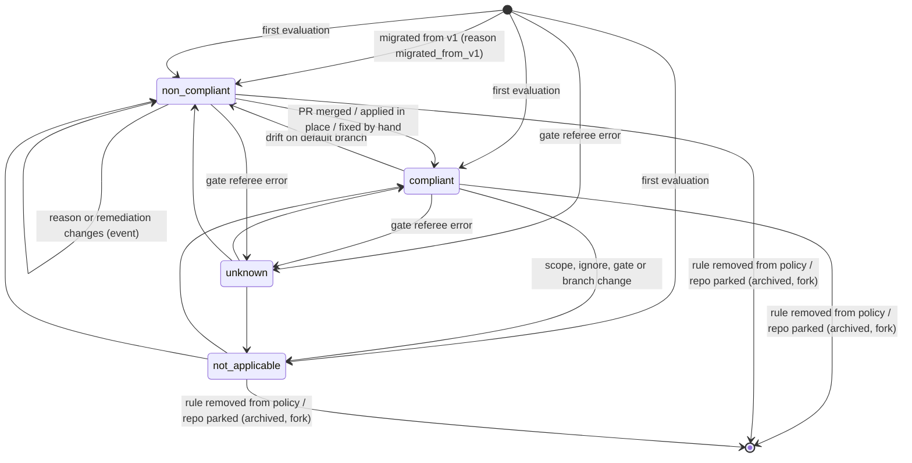
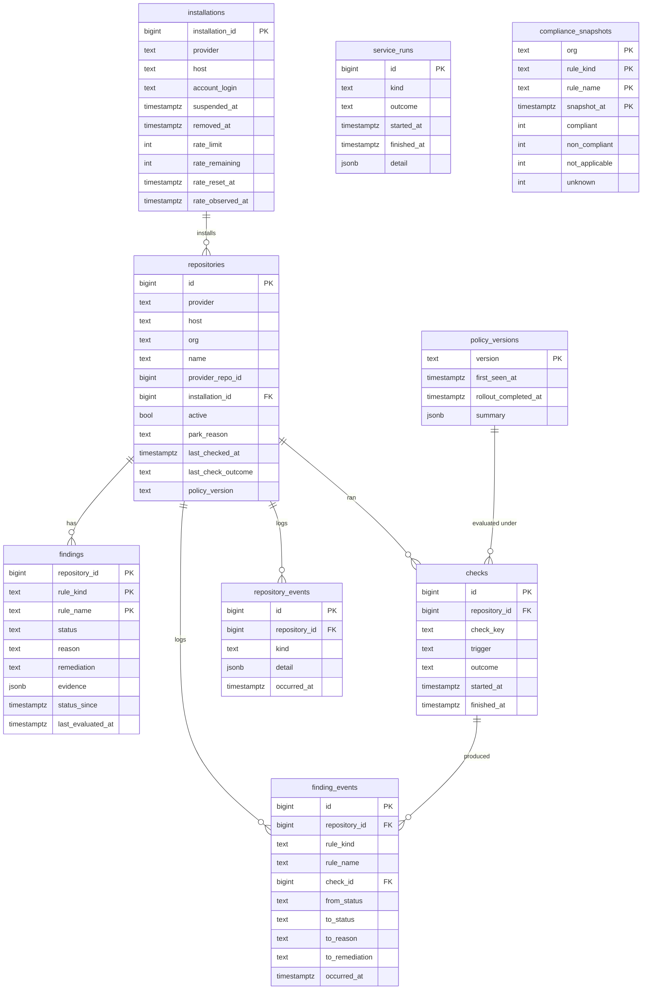
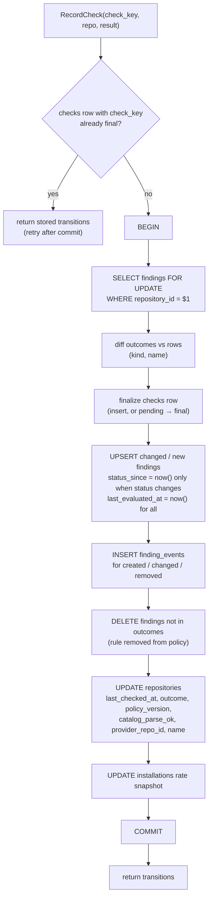
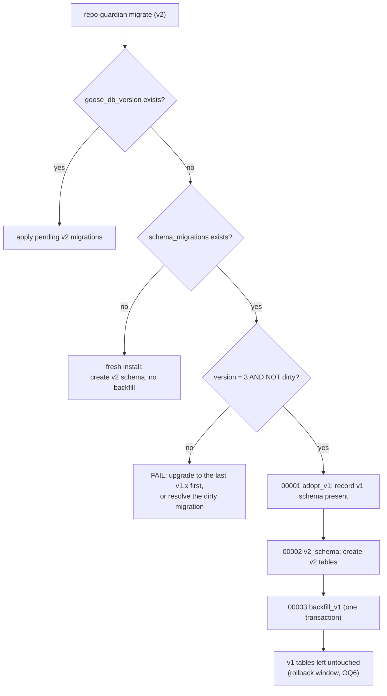

<!-- markdownlint-disable-file MD025 MD041 -->

# DESIGN-0025: v2 findings model and v1 data migration

**Status:** Draft
**Author:** Donald Gifford
**Date:** 2026-09-24

<!--toc:start-->
- [Overview](#overview)
- [Goals and Non-Goals](#goals-and-non-goals)
  - [Goals](#goals)
  - [Non-Goals](#non-goals)
- [Background](#background)
- [Detailed Design](#detailed-design)
  - [Finding model](#finding-model)
    - [Reason codes and evidence](#reason-codes-and-evidence)
    - [Reporting divergences from v1](#reporting-divergences-from-v1)
  - [Identity](#identity)
  - [Data model](#data-model)
  - [Engine outcome enrichment](#engine-outcome-enrichment)
  - [Recording a check](#recording-a-check)
  - [Store interface](#store-interface)
  - [Migration tooling: goose and sqlc](#migration-tooling-goose-and-sqlc)
  - [v1 → v2 migration](#v1--v2-migration)
  - [Policy version v2](#policy-version-v2)
- [API / Interface Changes](#api--interface-changes)
- [Data Model](#data-model-1)
- [Testing Strategy](#testing-strategy)
- [Implementation Phases](#implementation-phases)
- [Migration / Rollout Plan](#migration--rollout-plan)
- [Risks](#risks)
- [Open Questions](#open-questions)
- [References](#references)
<!--toc:end-->

## Overview

v2 keeps the rules engine and changes what it records. Today the engine
works out *why* a repository fails a rule, logs it, and persists one
boolean (`rule_state.actionable`). v2 persists the reason: a
**finding** per repository per rule, with a status, a reason code,
typed evidence and the remediation in flight. Every change to a finding
is appended to **`finding_events`**. Findings are what the read-only
API and UI serve (DESIGN-0027), what notifications fire from, and the
only source of business numbers once Prometheus carries none
(INV-0018 OQ3).

This design also owns the **v1 → v2 data migration**. The swap goal is
that an operator scales v1 to zero, points v2 at the same Postgres, and
v2 resumes: it knows every repository v1 knew, which ones are parked
and why, what each rule's last result was, and on its next check of a
repository it takes the same actions v1 would have taken.

It is one of three v2 designs:

| Design | Scope |
| --- | --- |
| **DESIGN-0025** (this) | findings data model, engine outcome enrichment, migration tooling (goose + sqlc), v1 → v2 backfill, policy version v2 |
| DESIGN-0026 | Temporal control plane, role split, Valkey removal, cutover runbook |
| DESIGN-0027 | read-only API, business UI, status page |

## Goals and Non-Goals

### Goals

- **Persist what the engine already knows.** Status, reason and evidence
  for every rule on every tracked repository, including rules that do
  not apply (and why).
- **A transition log.** `finding_events` records every status, reason or
  remediation change, written in the same transaction as the finding.
- **Swap-in from v1 on the same database.** A goose migration adopts
  v1's golang-migrate schema, backfills v2 tables from `repo_state`,
  `rule_state` and `compliance_snapshot`, and leaves v1's tables
  untouched so rollback stays possible.
- **Action parity.** The engine's GitHub writes (PRs, file commits,
  setting and ruleset remediation, auto-close, orphan cleanup) are
  byte-for-byte what v1 does for the same repository and policy.
  Enrichment is output-only.
- **Stable identity.** Repositories are keyed by an internal surrogate
  id, carry GitHub's numeric repository id, and survive renames and
  transfers. Rule identity is `(kind, name)`, fixing v1's cross-kind
  collision.
- **Typed queries and reviewable migrations.** goose for migrations
  (including Go-function migrations for the backfill), sqlc for queries.
- **A policy version that only changes when behaviour can.**
  Operational knobs (`log_level`, `worker_count`) stop triggering a
  fleet-wide re-check.

### Non-Goals

- **Reporting parity.** v2 reports *more truthfully* than v1 in a small
  number of cases, listed in [Reporting divergences](#reporting-divergences-from-v1).
  Action parity is required; reporting parity is not.
- **Notification delivery.** Sinks, routing and `external_ref` tracking
  are a later design (INV-0018 Phase 5). This design reserves nothing
  for them beyond the event log they will consume.
- **The control plane.** When checks run, how they are deferred and how
  the fleet is re-checked are DESIGN-0026. This design defines the
  write that ends every check.
- **Read paths for the UI.** The API's queries and read-only role usage
  are DESIGN-0027; this design defines the tables and grants.
- **Multi-provider implementation.** Keys are provider-neutral so
  GitLab can be added later (INV-0002, INV-0007); only GitHub is built.

## Background

Research for this design (code at `main` @ `5bd96bb`):

- **Schema today** is three golang-migrate migrations (version 3, table
  `schema_migrations(version, dirty)`), embedded in
  `internal/store/postgres/migrations/` and run by every pod at startup
  (`main.go:513`):
  - `repo_state` — PK `(installation_id, owner, repo)`; `last_checked_at`,
    `last_check_status` (free text: success/error/skipped/pending),
    `last_error` (≤1024 runes), `policy_version`, `active`,
    `catalog_parse_ok`.
  - `rule_state` — PK `(installation_id, owner, repo, rule_name)` with
    `rule_kind` **outside** the key, `actionable`, `actionable_since`.
  - `compliance_snapshot` — PK `(org, rule_name, snapshot_at)`, no kind.
- **What survives a check** is `CheckResult{Outcomes []RuleOutcome{RuleName, Kind, Actionable}, CatalogParseOK *bool}`
  (`internal/checker/result.go:40-58`). Every reason below is computed
  and then only logged or counted:

  | Where | Known at evaluation time |
  | --- | --- |
  | `engine_policy.go:434-443` | file missing (paths checked) |
  | `engine_policy.go:445-480` | assertion failed (message from `EvaluateAssertions`) |
  | `engine_policy.go:482-545` | content differs (byte or YAML-semantic) |
  | `engine_policy.go:420-432` | forbidden file present (first path found) |
  | `engine_policy.go:385-393` | foreign PR already open (number, head, matched term) — **recorded as compliant** |
  | `engine_policy.go:297-327` | disabled, out of scope, ignored, when-gate closed (`not_satisfied` / `error`, referee) — **no row** |
  | `engine_settings.go:83-112` | setting mismatch (current, expected), remediated / dry-run |
  | `engine_branch_protection.go:90-139` | branch missing — **recorded as compliant**; ruleset mismatch list; remediated / dry-run |
  | `engine_policy.go:49-88`, `drift.go` | our open PR number, auto-close, orphans |

- **Identity** is `(installation_id, owner, repo)` everywhere. GitHub's
  numeric repository id is not stored; `repository.renamed`,
  `transferred` and `deleted` webhooks are ignored. A renamed repository
  becomes a new row and the old one lingers until it errors out.
- **Rule names collide across kinds.** Validation dedupes per kind
  (`policy/validate.go:333, 396, 429`), but `rule_state`'s key omits
  kind, so a file rule and a setting rule named `renovate` overwrite one
  row (branch protection evaluates last and wins).
- **`policy.Version`** hashes `json.Marshal(PolicyConfig)` plus
  templates (`policy/version.go:32-66`). `GuardianConfig` has no json
  tags, so `log_level`, `worker_count`, `queue_size`,
  `schedule_interval` and `rate_limit_threshold` all feed it, and any
  struct change re-checks the fleet.
- **`UpsertIfMissing` hard-codes `last_checked_at = NULL`**
  (`postgres.go:336`), so the jittered first-check time callers compute
  is discarded. v2 fixes this in the backfill and in discovery.
- **The nil vs empty `*CheckResult` contract** (IMPL-0023): nil means
  "learned nothing, keep rows" (errors, access-denied parks, exhausted
  jobs); empty means "definitively no rule applies, clear rows" (empty
  repo, global ignore, out of policy scope, archived/fork parks).
- **go.mod** has pgx v5.9.2 and golang-migrate v4.19.1; no goose, no
  sqlc.

## Detailed Design

### Finding model

A finding has three orthogonal facets instead of INV-0018's single
eight-value enum, because the engine's outcomes are orthogonal: *is the
rule met*, *why not*, and *what is being done about it*.

| Facet | Values | Meaning |
| --- | --- | --- |
| `status` | `compliant`, `non_compliant`, `not_applicable`, `unknown` | Is the rule met on the default branch? `unknown` means we could not tell. |
| `reason` | reason code (table below), NULL when compliant | Why this status. |
| `remediation` | `none`, `pr_open`, `foreign_pr`, `applied`, `dry_run`, `disabled` | What repo-guardian did or is doing. |

INV-0018's states map onto the facets:

| INV-0018 state | v2 facets |
| --- | --- |
| compliant | `compliant` |
| missing | `non_compliant` / `file_missing` |
| failing_assertion | `non_compliant` / `assertion_failed` |
| pr_open | `non_compliant` + `remediation = pr_open` |
| pr_stale | derived at read time: `pr_open` and `evidence.pr.created_at` older than a threshold (never stored, so no job has to age it) |
| remediated | an **event** (`non_compliant → compliant`), not a state |
| blocked | `unknown` / `gate_error`, or a parked repository |
| not_applicable | `not_applicable` / scope, ignore, gate or branch reason |



#### Reason codes and evidence

Evidence is a versioned JSON object whose shape is fixed per reason
code. It is built only from data the engine already has: **evidence
must never add a GitHub API call** (OQ9). Values that come from the
repository are stored as data and must be rendered as text by every
consumer; they are never interpolated into markup, queries or shell.

| Status | Reason | Evidence | Source |
| --- | --- | --- | --- |
| non_compliant | `file_missing` | `{paths_checked: [..]}` | `evaluateExists/Contains/Exact` |
| non_compliant | `assertion_failed` | `{path, message}` (message clipped to 1024 runes) | `evaluateContains` |
| non_compliant | `content_differs` | `{path, comparison: "bytes"\|"yaml"}` | `compareContent` |
| non_compliant | `forbidden_present` | `{path}` (first match, as today) | `evaluateAbsent` |
| non_compliant | `setting_mismatch` | `{property, expected, actual}` | `engine_settings.go` |
| non_compliant | `ruleset_missing` | `{branch}` | `compareBranchProtection` "no matching ruleset" |
| non_compliant | `ruleset_mismatch` | `{branch, ruleset_id, mismatches: [..]}` | `compareBranchProtection` |
| not_applicable | `out_of_scope_policy` | `{}` | org outside top-level `scope` |
| not_applicable | `out_of_scope_rule` | `{}` | rule `scope` excludes the org |
| not_applicable | `ignored_global` | `{pattern}` | global `ignore` |
| not_applicable | `ignored_rule` | `{pattern}` | rule `ignore` |
| not_applicable | `gate_closed` | `{referee}` | `when { rule_satisfied }` not met |
| not_applicable | `branch_missing` | `{branch}` | branch-protection target branch absent |
| not_applicable | `empty_repository` | `{}` | repo has no default branch |
| unknown | `gate_error` | `{referee, error}` | referee evaluation failed (gate fails closed) |
| non_compliant | `migrated_from_v1` | `{v1_actionable_since}` | backfill: v1 knew it failed, not why; replaced on first v2 check |

| Remediation | Evidence merged under `pr` / `remediation` |
| --- | --- |
| `none` | — |
| `pr_open` | `pr: {number, url, created_at}` — our `repo-guardian/add-missing-files` PR |
| `foreign_pr` | `pr: {number, url, head, matched_term}` — a human PR the rule yields to |
| `applied` | `remediation: {at}` — setting or ruleset fixed in place this check |
| `dry_run` | `remediation: {would: "open_pr"\|"apply"}` |
| `disabled` | `remediation: {}` — setting rule with `remediate = false` |

`evidence_version` starts at 1; a reader that sees a higher version it
does not know renders the reason code and skips the evidence.

#### Reporting divergences from v1

Actions are unchanged; these *records* change. Each is deliberate and
each changes a compliance number, so the migration runbook
(DESIGN-0026) lists them for operators.

| Case | v1 records | v2 records | Effect on compliance % |
| --- | --- | --- | --- |
| Foreign PR open for the rule | `actionable=false` (compliant) | `non_compliant` + `foreign_pr` | falls; see OQ2 |
| Branch-protection target branch missing | `actionable=false` (compliant) | `not_applicable` / `branch_missing` | denominator shrinks |
| Rule out of scope, ignored, gate closed | no row | `not_applicable` row | none (excluded) |
| Global ignore, policy out of scope, empty repo | empty result (rows cleared) | `not_applicable` rows | none (excluded) |
| Gate referee errored | no row | `unknown` / `gate_error` | none (excluded, shown) |
| File + setting rule share a name | one row, last kind wins | two findings | both counted |

**Compliance** for a rule is `compliant / (compliant + non_compliant)`
over active repositories; `not_applicable` and `unknown` are excluded
from both terms and reported separately. The report and API keep v1's
rule: an empty denominator is *unmeasured*, never 100%
(`report.CompliantPercent`).

### Identity

```text
provider  host         org        name        provider_repo_id  id (surrogate)
github    github.com   acme       widgets     123456789         42
```

- **`repositories.id`** (bigserial) is the identity every other table
  and every Temporal workflow uses (DESIGN-0026: `RepoWorkflow` id is
  `repo/<id>`). It never changes, so a rename is an `UPDATE`, not a new
  row with orphaned history.
- **`provider_repo_id`** is GitHub's numeric repository id, unique per
  `(provider, host)`. It is NULL for backfilled rows until first
  resolved. Resolution costs nothing: discovery's
  `ListInstallationRepos` and the engine's `GetRepository` already
  return it; `ghclient.Repository` gains an `ID` field.
- **Matching order** on every write that carries a repository
  (discovery, webhook, check): by `provider_repo_id` first; if unmatched,
  by `(provider, host, lower(org), lower(name))` with `provider_repo_id
  IS NULL`, then fill the id. A match by id with a different name or org
  is a rename or transfer: update `org`/`name`/`installation_id` and
  append a `repository_events` row.
- **Case.** GitHub names are case-insensitive. Uniqueness is on
  `lower(org), lower(name)`; the stored value is the display case from
  the most recent API response.
- **`host`** stays in the key because GitHub Enterprise Cloud with data
  residency serves organizations from `<subdomain>.ghe.com`, not
  `github.com` (OQ3). Enterprise Server stays out of scope (INV-0018).
- **Rule identity is `(rule_kind, rule_name)`.** Cross-kind duplicate
  names stay legal but become two findings; load emits one `slog.Warn`
  per collision (OQ7).

### Data model



DDL (abbreviated; the IMPL pins every index and constraint):

```sql
CREATE TABLE installations (
  installation_id  BIGINT PRIMARY KEY,
  provider         TEXT NOT NULL DEFAULT 'github',
  host             TEXT NOT NULL DEFAULT 'github.com',
  account_login    TEXT NOT NULL,
  suspended_at     TIMESTAMPTZ,
  removed_at       TIMESTAMPTZ,
  rate_limit       INT,
  rate_remaining   INT,
  rate_reset_at    TIMESTAMPTZ,
  rate_observed_at TIMESTAMPTZ,
  updated_at       TIMESTAMPTZ NOT NULL DEFAULT now()
);

CREATE TABLE repositories (
  id                 BIGSERIAL PRIMARY KEY,
  provider           TEXT NOT NULL DEFAULT 'github',
  host               TEXT NOT NULL DEFAULT 'github.com',
  org                TEXT NOT NULL,
  name               TEXT NOT NULL,
  provider_repo_id   BIGINT,
  installation_id    BIGINT NOT NULL REFERENCES installations,
  active             BOOLEAN NOT NULL DEFAULT true,
  park_reason        TEXT CHECK (park_reason IN
                       ('access_denied','archived','fork','removed','installation_removed','unknown')),
  parked_at          TIMESTAMPTZ,
  discovered_at      TIMESTAMPTZ NOT NULL DEFAULT now(),
  next_due_at        TIMESTAMPTZ,          -- seeded by backfill/discovery; read by DESIGN-0026 bootstrap
  last_checked_at    TIMESTAMPTZ,
  last_check_outcome TEXT NOT NULL DEFAULT 'pending'
                       CHECK (last_check_outcome IN ('pending','success','error','skipped')),
  last_error         TEXT,
  policy_version     TEXT NOT NULL DEFAULT '',
  catalog_parse_ok   BOOLEAN
);
CREATE UNIQUE INDEX repositories_name_key ON repositories (provider, host, lower(org), lower(name));
CREATE UNIQUE INDEX repositories_provider_id_key ON repositories (provider, host, provider_repo_id)
  WHERE provider_repo_id IS NOT NULL;
CREATE INDEX repositories_installation ON repositories (installation_id) WHERE active;

CREATE TABLE findings (
  repository_id     BIGINT NOT NULL REFERENCES repositories ON DELETE CASCADE,
  rule_kind         TEXT NOT NULL CHECK (rule_kind IN ('file','setting','branch_protection')),
  rule_name         TEXT NOT NULL,
  status            TEXT NOT NULL CHECK (status IN ('compliant','non_compliant','not_applicable','unknown')),
  reason            TEXT,
  remediation       TEXT NOT NULL DEFAULT 'none',
  evidence          JSONB NOT NULL DEFAULT '{}',
  evidence_version  SMALLINT NOT NULL DEFAULT 1,
  status_since      TIMESTAMPTZ NOT NULL,
  last_evaluated_at TIMESTAMPTZ NOT NULL,
  policy_version    TEXT NOT NULL,
  PRIMARY KEY (repository_id, rule_kind, rule_name)
);
CREATE INDEX findings_rule_status ON findings (rule_kind, rule_name, status);
CREATE INDEX findings_failing ON findings (status_since) WHERE status = 'non_compliant';

CREATE TABLE checks (
  id             BIGSERIAL PRIMARY KEY,
  repository_id  BIGINT NOT NULL REFERENCES repositories ON DELETE CASCADE,
  check_key      TEXT NOT NULL UNIQUE,   -- idempotency key from the control plane
  trigger        TEXT NOT NULL,          -- schedule | webhook | push | discovery | policy_rollout | bootstrap
  outcome        TEXT NOT NULL,          -- pending | success | error | skipped
  error          TEXT,
  pending_result JSONB,                  -- outcome set handed from CheckRepo to RecordCheck; NULLed on commit (DESIGN-0026 OQ17)
  policy_version TEXT NOT NULL,
  started_at     TIMESTAMPTZ NOT NULL,
  finished_at    TIMESTAMPTZ NOT NULL
);
CREATE INDEX checks_repo_time ON checks (repository_id, finished_at DESC);

CREATE TABLE finding_events (
  id               BIGSERIAL PRIMARY KEY,
  repository_id    BIGINT NOT NULL REFERENCES repositories ON DELETE CASCADE,
  rule_kind        TEXT NOT NULL,
  rule_name        TEXT NOT NULL,
  check_id         BIGINT REFERENCES checks ON DELETE SET NULL,
  from_status      TEXT,                  -- NULL: finding created
  to_status        TEXT,                  -- NULL: finding removed
  from_reason      TEXT,
  to_reason        TEXT,
  from_remediation TEXT,
  to_remediation   TEXT,
  evidence         JSONB NOT NULL DEFAULT '{}',
  policy_version   TEXT NOT NULL,
  occurred_at      TIMESTAMPTZ NOT NULL DEFAULT now()
);
CREATE INDEX finding_events_repo ON finding_events (repository_id, occurred_at DESC);
CREATE INDEX finding_events_time ON finding_events (occurred_at DESC);
```

`repository_events` (discovered, renamed, transferred, parked,
unparked, removed), `policy_versions` and `compliance_snapshots` follow
the diagram. Two tables exist for the read side (DESIGN-0027):

- **`policy_versions.summary`** is a JSON description of the loaded
  policy: rules with kind, name, description, scope and check mode, but
  no template bodies. The worker writes it with `RecordPolicyVersion`,
  so the API can show "what is enforced" without mounting the policy
  file.
- **`service_runs`** records one row per discovery, snapshot, policy
  rollout and bootstrap run, with its outcome and counts. It is the
  first-party record the status page reads for "when did discovery last
  succeed".

The API's org filters also need
`CREATE INDEX repositories_org ON repositories (lower(org)) WHERE active`. `finding_events` is append-only by convention and by
grant: the application role has `INSERT, SELECT` on it, not `UPDATE` or
`DELETE` (retention is a separate maintenance role, OQ8).

**Volume at the INV-0018 target (20,000 repositories, ~10 rules):**
`findings` ~200k rows. `finding_events` grows only on transitions: at a
generous 1% of findings changing per day, ~2k rows/day, well under 1M a
year. `checks` is one row per check: at a 24h freshness ~20k/day,
~7.3M/year, so it has a retention window (OQ8). `compliance_snapshots`
is ~(orgs × rules) per day.

### Engine outcome enrichment

`RuleOutcome` widens; nothing that decides an action reads the new
fields.

```go
type RuleOutcome struct {
    RuleName    string
    Kind        RuleKind
    Status      Status      // compliant | non_compliant | not_applicable | unknown
    Reason      Reason      // "" when compliant
    Remediation Remediation // none | pr_open | foreign_pr | applied | dry_run | disabled
    Evidence    Evidence    // typed per reason; marshalled by the store
}

// Actionable is v1's boolean, kept so the PR, drift and auto-close
// paths compile unchanged and so parity tests can compare it directly.
func (o RuleOutcome) Actionable() bool
```

- **Skipped rules now produce outcomes.** The scope, ignore and gate
  branches in `findActionableRules`, `evaluateSettingRules` and
  `evaluateBranchProtectionRules` append a `not_applicable` outcome
  where they previously appended nothing. Their metric increments stay
  put, and the double-iteration contract (CLAUDE.md: counters only in
  the primary pass) is unaffected because outcomes are appended only in
  the primary pass, like today.
- **Disabled rules** still produce nothing. A disabled rule is not part
  of the evaluated policy, so its finding is removed (event
  `rule_removed`), matching v1's delete-not-in.
- **Repo-level not-applicable** (global ignore, policy out of scope,
  empty repository) returns a `CheckResult` whose outcomes are one
  `not_applicable` per enabled rule instead of an empty slice. This
  changes the meaning of "empty" in exactly one place: an empty,
  non-nil result now only comes from archived/fork parks, where the
  findings are deleted. The nil contract (learned nothing, write
  nothing) is unchanged.
- **Foreign PR** keeps its v1 action (do not open ours) and records
  `non_compliant` with the reason the file would otherwise have had, plus
  `remediation = foreign_pr`. `Actionable()` returns false for it, which
  is what keeps the action identical.
- **Branch missing** keeps its v1 action (skip) and records
  `not_applicable` / `branch_missing`.
- **Our PR.** `checkRepoWithPolicy` already finds our open PR
  (`findOurPR`) before evaluation; outcomes for rules included in it
  carry `remediation = pr_open` with the PR's number, URL and
  `created_at` (already on `ghclient.PullRequest`).
- **`CatalogParseOK`** stays a per-repository field on `CheckResult`.

**Parity is enforced by test, not review.** The existing engine tests
keep asserting on GitHub calls. A new parity suite runs every
`engine_test.go` / `convergence_test.go` scenario and asserts the
recorded `github.Client` write calls are identical with and without
enrichment, and that `Actionable()` equals v1's `Actionable` for every
outcome. This is the test the swap guarantee rests on.

### Recording a check

Every check ends in exactly one store call. It is the durable activity
DESIGN-0026 retries until it succeeds, so it must be idempotent.



- **Change** means `status`, `reason` or `remediation` differs.
  Evidence-only changes (a PR getting older, an assertion message
  rewording) update the row but emit no event, so the event log records
  state changes, not heartbeats.
- **`check_key`** is supplied by the control plane (workflow id + run
  id + iteration, DESIGN-0026) and is unique. A retry after a commit the
  caller never heard about finds the row already final and returns the
  same transitions without writing. When the control plane hands the
  outcome set over through the database (DESIGN-0026 OQ17 (a)),
  `CheckRepo` writes a `pending` row carrying `pending_result`, and
  `RecordCheck` finalizes it and clears the payload in the same
  transaction.
- **Errors** (`result == nil`) go through `RecordCheckError`: a `checks`
  row with `outcome = error`, `repositories.last_check_outcome = error`
  and `last_error` clipped with `store.Truncate` (1024 runes). Findings
  are not touched: the nil contract.
- **Parking** goes through `Park(repo, reason, clearFindings)`.
  `access_denied` passes `clearFindings = false` (we learned nothing);
  `archived`/`fork` pass `true` (we know no rule applies). This is v1's
  nil-vs-empty rule (IMPL-0023, INV-0015) made explicit in the
  signature instead of encoded in a pointer.
- **Rate snapshot.** The check activity reports the installation's last
  observed `X-RateLimit-*` values; the store keeps the latest by
  `rate_observed_at`. This feeds the status page (DESIGN-0027) without a
  metric or an extra call.

### Store interface

The `store.Store` seam and its generated mock stay; the method set is
replaced. Writers and readers split so the API compiles against a
read-only interface (INV-0009 Obs 3).

```go
// Writer is used by the worker and ingest roles.
type Writer interface {
    UpsertDiscovered(ctx context.Context, r DiscoveredRepo) (UpsertResult, error) // created / reactivated / renamed
    UpsertInstallation(ctx context.Context, in Installation) error
    MarkInstallationRemoved(ctx context.Context, installationID int64, at time.Time) error
    RecordCheck(ctx context.Context, c CheckRecord) (*CheckApplied, error)
    RecordCheckError(ctx context.Context, c CheckErrorRecord) error
    Park(ctx context.Context, repoID int64, reason ParkReason, clearFindings bool) error
    RecordPolicyVersion(ctx context.Context, version string, summary PolicySummary) (firstSeen bool, err error)
    RecordServiceRun(ctx context.Context, run ServiceRun) error
    CompletePolicyRollout(ctx context.Context, version string) error
    InsertComplianceSnapshot(ctx context.Context, at time.Time) (int, error)
    PruneChecks(ctx context.Context, before time.Time) (int64, error)
}

// Reader is used by the control plane for paging and by the api role.
type Reader interface {
    GetRepository(ctx context.Context, id int64) (*Repository, error)
    ListActiveRepositories(ctx context.Context, afterID int64, limit int) ([]Repository, error)
    ReportData(ctx context.Context) (*ReportData, error)
    // API read methods are defined in DESIGN-0027.
}
```

Un-parking stays exclusive to discovery (`UpsertDiscovered`), which is
INV-0015's subset invariant carried over unchanged.

### Migration tooling: goose and sqlc

- **goose v3 Provider API**, embedded migrations (`embed.FS`), dialect
  postgres over `database/sql` via `github.com/jackc/pgx/v5/stdlib`,
  with goose's Postgres session locker so concurrent runners serialize.
  Version table `goose_db_version`. SQL migrations for DDL; Go
  migrations only where logic branches (adoption, backfill).
- **Migrations run once per release, not per pod.** A `repo-guardian
  migrate` subcommand runs them; the chart runs it as a
  `pre-install,pre-upgrade` Helm hook Job. Roles check at startup that
  the schema is at least the version they were built for and fail
  readiness otherwise (OQ5). With three roles and autoscaled workers,
  v1's "every pod migrates at startup" would mean many racing
  migrators and a DDL-capable credential in every pod.
- **sqlc** with `engine: postgresql`, `sql_package: pgx/v5`, schema read
  from the goose migration directory (sqlc understands goose's
  `-- +goose Up/Down` annotations), queries in
  `internal/store/postgres/queries/*.sql`, generated code in
  `internal/store/postgres/sqlcdb`. The hand-written store wraps the
  generated `Queries` and owns transactions. `make generate-sql` and a CI
  drift gate (regenerate, `diff -r`, the same shape as
  `lint-monitoring`) keep committed code honest.
- **Grants.** The chart or the operator creates roles; migrations grant.
  The application role gets `SELECT, INSERT, UPDATE, DELETE` on the v2
  tables except `finding_events` (`SELECT, INSERT`). If a
  `repoguardian_ro` role exists, migrations grant it `SELECT` on v2
  tables and set default privileges; if it does not, they skip with a
  notice. Migrations never `CREATE ROLE` (OQ12).

### v1 → v2 migration



**Preconditions.** v1 is scaled to zero (DESIGN-0026 runbook). The
migration refuses to run if `repo_state.last_checked_at` was written in
the last 60 seconds, a cheap guard against a v1 replica still running.

**`00003_backfill_v1`**, in one transaction:

1. **installations** ← `SELECT DISTINCT installation_id, owner FROM repo_state`.
   If an installation id maps to more than one owner (should not happen
   for GitHub Apps), take the most recent by `last_checked_at` and log
   the rest.
2. **repositories** ← `repo_state`: `org = owner`, `name = repo`,
   `provider_repo_id = NULL`, `active`, `last_checked_at`,
   `last_check_outcome = last_check_status`, `last_error`,
   `catalog_parse_ok`.
   - `park_reason` for inactive rows is v1's own reconstruction
     (`postgres.go:557-567`): `error` → `access_denied`;
     `skipped` with `last_error` `archived`/`fork` → that; else `unknown`.
   - `policy_version = 'v1:' || policy_version`. The prefix guarantees it
     never equals a v2 version (see [Policy version v2](#policy-version-v2)).
   - `next_due_at` = `last_checked_at + RECONCILE_FRESHNESS` for checked
     rows, spread uniformly over one freshness window for rows never
     checked (fixing the `UpsertIfMissing` NULL bug instead of
     reproducing it). Freshness is a migrate flag defaulting to v1's
     `RECONCILE_FRESHNESS` env var.
   - Case-colliding rows (same `lower(org), lower(name)`) keep the most
     recently checked one and log the rest.
3. **findings** ← `rule_state` joined to the new repository ids:
   - `actionable = false` → `compliant`, `status_since = updated_at`.
   - `actionable = true` → `non_compliant`, `reason = migrated_from_v1`,
     `status_since = coalesce(actionable_since, updated_at)`,
     `evidence = {v1_actionable_since}`.
   - `rule_kind` from `rule_state.rule_kind` (v1 had one row per name,
     so the new key cannot collide).
4. **finding_events** ← one `created` event per finding with
   `to_reason = migrated_from_v1`, `occurred_at` = migration time, so
   every history starts at the swap.
5. **compliance_snapshots** ← `compliance_snapshot` (OQ10), with
   `rule_kind` resolved from the current `rule_state` names (fallback
   `file`), `non_compliant = actionable_count`,
   `compliant = tracked_count - actionable_count`,
   `not_applicable = unknown = 0`.
6. **policy_versions** gets no row: v1's hash is not a v2 version.

After the backfill the first v2 check of each repository replaces
`migrated_from_v1` with a real reason. When checks happen is
DESIGN-0026's decision (OQ4 there); this design only guarantees the data
is correct in the meantime: every non-compliant repository v1 knew
about is still non-compliant, with its original `since`.

**Rollback.** v2 never writes v1's tables, and `goose_db_version` is
invisible to golang-migrate. Starting a v1 image against the same
database finds `schema_migrations` at 3 (no-op migrate) and v1's tables
as they were at the swap; the stale sweep then re-checks everything
older than freshness, and v1 adopts any open repo-guardian PR because
the branch name and comment marker are unchanged. What rollback loses is
everything v2 learned. The window closes when a later v2 release drops
the v1 tables (OQ6).

### Policy version v2

v2 computes the version from an explicit input struct with json tags,
so renaming a Go field cannot silently re-check the fleet, and so only
settings that can change an outcome or an action are hashed:

| Hashed | Not hashed |
| --- | --- |
| file, setting and branch-protection rules (all fields, assertions, `when`, `pr`) | `log_level` |
| reconcilers and their config | `worker_count` / `queue_size` (removed in v2) |
| top-level and per-rule `scope`, `ignore` | `schedule_interval`, freshness |
| `defaults.pr`, templates (name + content) | `rate_limit_threshold` |
| `dry_run`, `skip_forks`, `skip_archived`, `auto_close_pr`, `orphan_cleanup` | anything added later unless tagged |

- A golden test pins the version of a fixture policy; changing the hash
  function requires updating the golden deliberately.
- Every new `GuardianConfig` field must be classified in a table-driven
  test that fails for an unclassified field, so "does this re-check the
  fleet?" is a decision, not an accident.
- `findings.policy_version` and `checks.policy_version` record what each
  result was computed under; DESIGN-0026 uses `policy_versions` to
  drive paced re-checks.

## API / Interface Changes

- `checker.RuleOutcome` gains `Status`, `Reason`, `Remediation`,
  `Evidence`; `Actionable` becomes a method.
- `ghclient.Repository` gains `ID int64`; `ghclient.PullRequest`
  already has `Number`, `HTMLURL`, `CreatedAt`.
- `store.Store` splits into `Writer` and `Reader` with the methods
  above; the old methods are removed on the `v2` branch.
- New subcommand `repo-guardian migrate [--freshness 24h] [--dry-run]`.
  `--dry-run` runs the adoption checks and the backfill in a transaction
  that rolls back, printing row counts.
- `repo-guardian report` reads findings; its markdown gains a reason
  column. Its SQL moves to sqlc.

## Data Model

Covered in [Data model](#data-model). v1 tables (`repo_state`,
`rule_state`, `compliance_snapshot`, `schema_migrations`) remain,
read-only by convention, until OQ6's drop migration.

## Testing Strategy

- **Migration tests (testcontainers Postgres):** build v1's schema with
  v1's own golang-migrate migrations (vendored as a test fixture at
  version 3), seed a representative dataset (parked for every reason,
  never-checked, actionable with and without `actionable_since`,
  case-colliding names, a cross-kind name), run `migrate`, and assert
  every row maps as specified. Also: dirty v1 → refuses; version 2 →
  refuses; fresh database → v2 schema, no backfill; re-run → no-op.
- **Rollback test:** after `migrate`, run v1's `Migrate` and v1's
  `StaleRepos` against the database and assert they work.
- **Engine parity suite:** described in
  [Engine outcome enrichment](#engine-outcome-enrichment).
- **Outcome golden tests:** one scenario per reason code asserting
  status, reason, remediation and evidence shape.
- **`RecordCheck` properties:** same `check_key` twice → one set of
  events; identical outcomes twice with different keys → no events,
  `last_evaluated_at` advances; rule removed → event + delete; status
  change → `status_since` moves, evidence-only change → it does not.
- **Contract test for the nil / clear rule:** `RecordCheckError` never
  touches findings; `Park(access_denied)` keeps them; `Park(archived)`
  deletes them with events.
- **Policy version:** golden hash; unclassified-field test; operational
  knob change → same version.
- **sqlc drift gate** in CI.

## Implementation Phases

All phases land on the `v2` branch (INV-0018 OQ10).

1. **Tooling.** goose + pgx stdlib, the `migrate` subcommand, adoption
   migration, sqlc config and CI drift gate. Existing v1 queries are
   not ported; the v1 store is deleted in phase 4.
2. **Schema.** v2 tables, grants, `Writer`/`Reader` with sqlc queries,
   `RecordCheck` and its idempotency.
3. **Engine enrichment.** `RuleOutcome` facets and evidence at every
   site in [Background](#background); parity suite green before merge.
4. **Backfill and cutover data path.** `00003_backfill_v1`, `--dry-run`,
   migration and rollback tests; delete the v1 store implementation.
5. **Policy version v2.** Explicit input struct, golden and
   classification tests.
6. **Report on findings.** `report` reads findings; reason column.

## Migration / Rollout Plan

The operator-facing cutover (scale v1 down, deploy Temporal, run
`migrate`, start v2) is one runbook owned by DESIGN-0026, because the
data migration is one step in it. This design's contributions to that
runbook:

1. `repo-guardian migrate --dry-run` against a restored copy of
   production first, to see row counts and collisions.
2. `pg_dump` before the real run; the migration is additive, but a dump
   is the only rollback for a bad backfill.
3. The reporting-divergence table, so a drop in a compliance number on
   day one is expected rather than alarming.

## Risks

| Risk | Mitigation |
| --- | --- |
| Enrichment changes an action | parity suite over every existing engine scenario; `Actionable()` derived, not re-implemented |
| Backfill maps a parked or failing repo wrong | seeded migration tests per park reason; `--dry-run` on a production copy |
| v1 still running during `migrate` | recent-write guard; runbook scales v1 to zero first |
| `checks` table growth | retention window pruned by the snapshot workflow (OQ8) |
| Evidence carries repository-controlled text into the UI | stored as data, rendered as text; clipped lengths; documented in DESIGN-0027 |
| Case-colliding v1 rows | deterministic keep-most-recent rule, logged |
| goose/sqlc are new to the codebase | both are used conventionally (embedded SQL, generated queries); CI drift gate |

## Open Questions

1. **Finding status shape.**
   - (a) Three facets: `status` × `reason` × `remediation`, with
     `pr_stale` derived at read time and `remediated` as an event.
   - (b) INV-0018's single eight-value enum (`compliant`, `missing`,
     `failing_assertion`, `pr_open`, `pr_stale`, `remediated`,
     `blocked`, `not_applicable`).
   - (c) Status enum only, with reason in free text.
   - other:

2. **How a rule yielding to a human's PR counts.**
   - (a) `non_compliant` with `remediation = foreign_pr`; counts as
     failing, shown with the PR link.
   - (b) Count it as compliant, like v1, to keep compliance numbers
     continuous across the swap.
   - (c) A separate bucket excluded from the compliance denominator,
     like `not_applicable`.
   - other:

3. **Repository key includes `host`.**
   - (a) Yes: `(provider, host, org, name)`, so GHEC data-residency
     organizations on `*.ghe.com` are distinguishable.
   - (b) No: `(provider, org, name)`; add `host` if and when needed.
   - other:

4. **Status of backfilled non-compliant rows.**
   - (a) `non_compliant` / `migrated_from_v1`: v1's `actionable = true`
     is a true statement that the rule fails, only without the reason,
     and compliance numbers stay continuous across the swap.
   - (b) `unknown` / `migrated_from_v1` until the first v2 check, so no
     number is shown that v2 did not compute itself.
   - other:

5. **Where migrations run.**
   - (a) `repo-guardian migrate` as a Helm `pre-install,pre-upgrade`
     hook Job; roles check the schema version at startup and fail
     readiness if it is behind.
   - (b) Every pod runs migrations at startup behind goose's advisory
     lock, as v1 does.
   - (c) An init container on the worker Deployment only.
   - other:

6. **v1 table retention.**
   - (a) Keep v1 tables untouched for the rollback window; drop them in
     a v2.1 migration once v2.0 has run in production for one release.
   - (b) Drop them at the end of the backfill.
   - (c) Rename them to `v1_*` during the backfill and drop later.
   - other:

7. **Cross-kind duplicate rule names.**
   - (a) Allowed; findings are keyed by `(kind, name)`; one
     `slog.Warn` per collision at load.
   - (b) Reject at load (breaking for any v1 config that has them).
   - other:

8. **Retention for `checks` and `finding_events`.**
   - (a) `checks` 90 days, pruned daily by the snapshot workflow;
     `finding_events` kept indefinitely.
   - (b) Both indefinitely.
   - (c) Both pruned, `finding_events` after one year.
   - other:

9. **Evidence may cost GitHub API calls.**
   - (a) Never: evidence uses only what the engine already fetched
     (first forbidden path, not all of them).
   - (b) Allow bounded extra calls for complete evidence.
   - other:

10. **v1 compliance history.**
    - (a) Copy `compliance_snapshot` into `compliance_snapshots` with
      kind resolved from current rule names, so trends span the swap.
    - (b) Start history fresh at the swap.
    - other:

11. **Case-insensitive repository names.**
    - (a) Unique index on `lower(org), lower(name)`; store display case.
    - (b) The `citext` extension.
    - other:

12. **Read-only database role.**
    - (a) The chart (baked/CNPG) or operator (external) creates
      `repoguardian_ro`; migrations grant `SELECT` if it exists.
    - (b) Migrations create the role (requires `CREATEROLE` on the
      migration credential).
    - other:

## References

- INV-0018 — v2 re-topology; finding model (Obs 3), OQ2, OQ7, OQ8, OQ10
- INV-0019 — Temporal control plane
- DESIGN-0026 — Temporal control plane and role split (cutover runbook)
- DESIGN-0027 — read-only API, business UI, status page
- DESIGN-0022 / IMPL-0023 — posture state, nil vs empty `CheckResult`
- INV-0015 — parking and the subset invariant
- INV-0003 — idempotent file commits
- [goose](https://github.com/pressly/goose) · [sqlc](https://docs.sqlc.dev) · [pgx](https://github.com/jackc/pgx)
