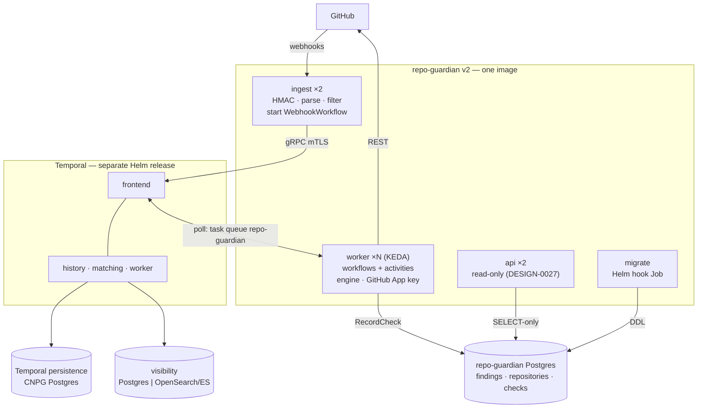
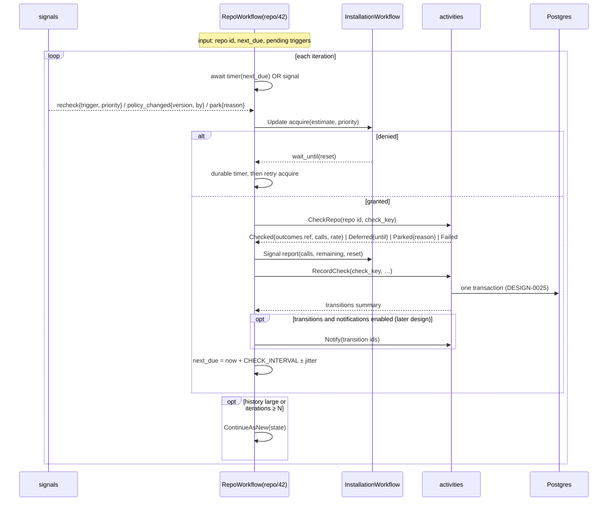
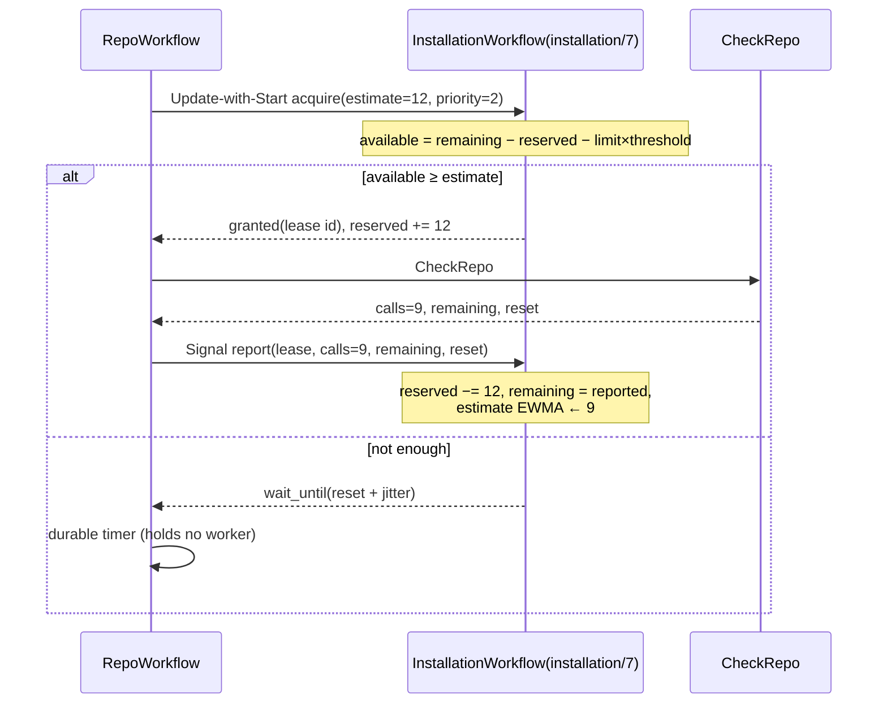
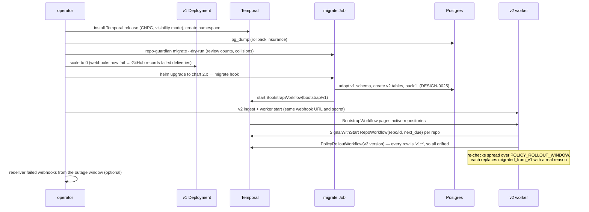

<!-- markdownlint-disable-file MD025 MD041 -->

# DESIGN-0026: v2 Temporal control plane and role split

**Status:** Draft
**Author:** Donald Gifford
**Date:** 2026-09-24

<!--toc:start-->
- [Overview](#overview)
- [Goals and Non-Goals](#goals-and-non-goals)
  - [Goals](#goals)
  - [Non-Goals](#non-goals)
- [Background](#background)
- [Detailed Design](#detailed-design)
  - [Topology](#topology)
  - [Roles](#roles)
  - [Workflows](#workflows)
  - [RepoWorkflow](#repoworkflow)
  - [Activities](#activities)
  - [Rate budget](#rate-budget)
  - [Ingest and webhook routing](#ingest-and-webhook-routing)
  - [Discovery](#discovery)
  - [Policy rollout](#policy-rollout)
  - [Snapshots and retention](#snapshots-and-retention)
  - [Cutover from v1](#cutover-from-v1)
  - [Temporal deployment](#temporal-deployment)
  - [Versioning and deployment of workflow code](#versioning-and-deployment-of-workflow-code)
  - [Scaling](#scaling)
  - [Observability (system only)](#observability-system-only)
  - [Configuration](#configuration)
  - [Chart 2.0.0](#chart-200)
  - [The v2 branch: CI and release](#the-v2-branch-ci-and-release)
  - [Code removed and reshaped](#code-removed-and-reshaped)
- [API / Interface Changes](#api--interface-changes)
- [Data Model](#data-model)
- [Testing Strategy](#testing-strategy)
- [Implementation Phases](#implementation-phases)
- [Migration / Rollout Plan](#migration--rollout-plan)
- [Risks](#risks)
- [Open Questions](#open-questions)
- [References](#references)
<!--toc:end-->

## Overview

v2 replaces repo-guardian's hand-built control plane with self-hosted
[Temporal](https://temporal.io). Temporal takes over the Valkey queue,
the delayed-requeue set, the reaper, SETNX leader election, the stale
sweep, the discovery and snapshot schedules and the posture exporter.
The process splits into roles (`ingest`, `worker`, `api`, `all`),
Valkey is removed, and workers autoscale on Temporal task-queue backlog.

The rules engine is unchanged and runs inside a Temporal activity. The
only engine change v2 makes is DESIGN-0025's output enrichment, which is
parity-tested to leave every GitHub write identical.

This design also owns the **v1 → v2 cutover**. An operator running v1
in production scales it to zero, deploys Temporal, runs the v2 data
migration, and starts v2. v2 then:

- adopts every repository v1 knew, with its parked state;
- adopts every open repo-guardian PR, because the branch name, PR title
  and sticky-comment markers are unchanged;
- re-checks the fleet at a paced rate, applying the same policy the same
  way.

| Design | Scope |
| --- | --- |
| DESIGN-0025 | findings model, engine enrichment, goose + sqlc, v1 data backfill, policy version v2 |
| **DESIGN-0026** (this) | Temporal workflows, rate budget, roles, Valkey removal, chart v2, v2 branch CI, cutover runbook |
| DESIGN-0027 | read-only API, business UI, status page |

## Goals and Non-Goals

### Goals

- **One control plane: Temporal.** No Valkey, no leader election, no
  reaper, no sweep. No second or pluggable backend (INV-0019;
  DESIGN-0021's one-mechanism rule).
- **One long-running workflow per repository.** It owns the repository's
  timer, its signals and its parked state. One workflow per installation
  holds the shared GitHub API budget (INV-0019 OQ3).
- **Durable end-of-check writes.** Recording findings is an activity the
  workflow cannot skip; a check's result is never lost to a best-effort
  write (DESIGN-0025 `RecordCheck`).
- **Nothing blocks while holding a worker.** Budget waits and throttle
  deferrals are durable timers, not sleeps (IMPL-0022's rule, now
  structural).
- **Role split.** A stateless `ingest` with no GitHub credentials, a
  `worker` scaled on backlog, an `api` with read-only database access,
  and `all` for small installs.
- **Swap in for v1 and resume.** The same repositories, parked state,
  PRs, policies and actions, with no manual per-repository work.
- **Fix v1 gaps the new model makes cheap:** renames, transfers,
  deletions, archive/unarchive and installation removal are handled;
  the discovery seed jitter actually applies; a policy change no longer
  re-checks the fleet in one burst.

### Non-Goals

- **Temporal Cloud.** Self-hosted on Kubernetes (INV-0019 OQ5); nothing
  here prevents Cloud later.
- **Bundling Temporal in the repo-guardian chart.** Temporal is its own
  Helm release from `temporalio/helm-charts` (INV-0019 OQ6).
- **Notifications.** Jira, Slack and webhook sinks are a later design.
  This design reserves the `Notify` step in the workflow loop.
- **The API and UI.** See DESIGN-0027; `api` appears here only as a
  role.
- **Changing what a check does.** Rule semantics, PR behaviour and
  reconcilers are v1's, unchanged.

## Background

Research for this design (code at `main` @ `5bd96bb`):

- **Startup** (`cmd/repo-guardian/main.go:125-306`) does the following:
  - loads config and policy;
  - migrates Postgres;
  - connects Valkey;
  - starts N worker goroutines, the reaper, a depth poller and two HTTP
    servers (`:8080` for the webhook plus `/healthz` and `/readyz`,
    `:9090` for `/metrics`);
  - registers four leader-elected schedules:

  | Schedule | Default | Handler |
  | --- | --- | --- |
  | `stale-sweep` | `schedule_interval` = **168h** | `StaleRepos(freshness=24h, batch=200)` → enqueue |
  | `posture-export` | 60s | Postgres → posture gauges |
  | `compliance-snapshot` | 24h | `INSERT … SELECT` into `compliance_snapshot` |
  | `discovery` | 1h | list installations and repos → `UpsertIfMissing` |

- **Effective v1 cadence is capped by the sweep.** With default
  settings the stale sweep fires every 168h and enqueues at most 200
  stale repositories per tick. The homelab (`schedule_interval = "1h"`)
  gets roughly daily checks, up to 4,800 a day. Fleets past that
  throughput fall behind silently. Webhooks (`repository.created`,
  `installation*`, watched-path pushes) bypass the sweep.
- **The worker** (`internal/worker/worker.go:173-245`) classifies each
  failure in this order:
  1. Attempt cap reached → drop the job.
  2. Throttled (`AsThrottled`) → defer via `RetryAfterError` (no
     write-back).
  3. Access denied (`IsAccessDenied`) → park; keep posture (nil result).
  4. Skipped (`AsSkipped`, archived/fork) → park; clear posture (empty
     result).
  5. Anything else → error write-back and a nack. The reaper requeues it
     after `JOB_ACK_TIMEOUT` (5m); `MAX_JOB_ATTEMPTS` (10) caps
     redeliveries.
- **Webhooks handled** (`internal/webhook/handler.go`):
  - `repository.created`, `installation_repositories.added` and
    `installation.created` → seed the repository and enqueue it.
  - Pushes to the default branch that touch a watched path → mark
    pending and enqueue.
  - Everything else, including `renamed`, `transferred`, `deleted`,
    `archived`, `unarchived`, `installation.deleted`, `suspend` and
    `installation_repositories.removed`, is ignored.
  - Handled events return 202, even when the enqueue failed.
- **Rate-limit state is per process.** Each installation client has its
  own `rateLimitTransport` (`internal/github/ratelimit.go`) holding
  `remaining/limit/reset`. It refuses requests under the reserve with
  `*ThrottledError`. It retries a 403 or secondary limit once after at
  most 60s (`maxRateLimitSleep`, which must stay below the activity
  timeout). go-github's own pre-check can short-circuit above the
  transport, and `AsThrottled` normalizes both paths. N pods hold N
  optimistic views of one budget.
- **The engine is safe to share across goroutines** (read-only after
  `NewEngine`; `gateEvaluator` is per check). Two caches are per process:
  - the custom-properties org schema cache (30m TTL, singleflight);
  - installation clients (`getInstallClient`, never evicted).
- **Metrics:** 52 `repo_guardian_*` metrics.
  - 25 are business metrics, all removed in v2 (INV-0018 OQ3).
  - Of the 27 system metrics, 13 are queue- or scheduler-specific and
    disappear with Valkey.
  - 12 chart alerts, 5 of them Valkey- or leader-specific.
- **CI:**
  - `ci.yml`, `license-check.yml` and `security.yml` trigger only on
    `main`, and `ct.yaml` targets `main`.
  - `release.yml` bumps semver from PR labels on `main`, and images get
    a `latest` tag.
  - `changelog-update.yml` hard-codes `ref: main`.
- **Temporal facts verified for this design** (2026-09):
  - Server v1.32.x is current.
  - Task Queue **Priority and Fairness** has been GA since Server 1.31.
    It takes integer priority 1–5 and fairness keys up to 64 bytes with
    weights, and per-fairness-key rate limits scale with weight. Fairness
    requires `matching.enableFairness` in dynamic config when
    self-hosted.
  - **Worker Versioning** has been GA since 2026-03, with Pinned and
    Auto-Upgrade behaviours. **Upgrade-on-Continue-as-New** is in public
    preview.
  - **Update-with-Start** is GA (Server 1.28, Go SDK ≥ v1.31).
  - `NextRetryDelay` needs Server ≥ 1.24.2.
  - Visibility stores:
    - Postgres 12+ from 1.20.
    - Elasticsearch 7 and 8.
    - **OpenSearch 2+ from 1.30.1**. OpenSearch 3.x is not stated;
      Amazon OpenSearch Service is at 3.7.
  - The Temporal Helm chart installs no databases; persistence and
    visibility are external. Schema is managed by chart hooks
    (`createDatabase`, `manageSchema`).
  - KEDA's Temporal scaler (v2.17+, community-maintained) scales on
    task-queue backlog, with `queueTypes` and worker-deployment
    parameters.

## Detailed Design

### Topology

### Roles

One binary, one image; the role is the first argument.

| Role | Runs | Needs | Does not need |
| --- | --- | --- | --- |
| `ingest` | webhook HTTP server | webhook secret, Temporal client, watched-path list (from policy) | GitHub App key, database |
| `worker` | Temporal worker: all workflows and activities | GitHub App key, Temporal client, database (rw), policy, templates | webhook secret |
| `api` | read-only HTTP API (DESIGN-0027) | database (ro), OIDC config, Temporal client (read-only calls) | GitHub App key, webhook secret |
| `migrate` | goose migrations, then exits (DESIGN-0025) | database (DDL) | everything else |
| `all` | ingest + worker + api in one process | union | — |

Security consequence: `ingest` is the only internet-facing role, and it
holds neither the App key nor database credentials. A compromised
`ingest` can start webhook workflows, which the worker validates again;
it cannot write to GitHub.

`report` and `monitoring generate` remain one-shot subcommands.

### Workflows

| Workflow | ID | Started by | Lifetime |
| --- | --- | --- | --- |
| `RepoWorkflow` | `repo/<repositories.id>` | discovery, webhook routing, bootstrap (SignalWithStart) | until parked; ContinueAsNew periodically |
| `InstallationWorkflow` | `installation/<installation_id>` | first `acquire` (Update-with-Start) | until installation removed; ContinueAsNew periodically |
| `DiscoveryWorkflow` | `discovery/<schedule-time>` or `discovery/installation/<id>/<delivery>` | Temporal Schedule; installation webhooks | one run |
| `WebhookWorkflow` | `webhook/<X-GitHub-Delivery>` | `ingest` | one run |
| `PolicyRolloutWorkflow` | `policy-rollout/<version>` | every worker at startup (duplicate start rejected) | one run |
| `BootstrapWorkflow` | `bootstrap/v1` | `repo-guardian migrate` after a v1 backfill | one run |
| `SnapshotWorkflow` | `snapshot/<schedule-time>` | Temporal Schedule | one run |

Workflow IDs are the dedupe mechanism. `repo/<id>` is the per-repository
lock that v1 built from `StatusPending` writes and job-ID hashing.
`webhook/<delivery>` makes GitHub redeliveries idempotent. Using the
internal `repositories.id` keeps a repository's workflow the same across
renames and transfers (DESIGN-0025 identity).

**Payloads carry identifiers, never content.** Workflow inputs, signals
and activity results hold ids, names, counts and timestamps. File
content, evidence and error text live in Postgres. That keeps Temporal
history small and keeps repository data out of a second store. It also
means no payload encryption codec is needed.

### RepoWorkflow

Behaviour:

- **Timer.** `next_due = finished + CHECK_INTERVAL + jitter`, with jitter
  uniform in ±10% of the interval so a fleet onboarded at once spreads
  out rather than re-synchronizing.
- **Signal coalescing.** Signals received during a check set a pending
  flag and keep the highest priority; one follow-up check runs, not one
  per signal. Twenty pushes in a minute produce at most two checks.
- **`policy_changed{version, by}`** sets
  `next_due = min(next_due, random(now, by))`. This spreads the re-check
  across the rollout window instead of re-checking immediately
  (see [Policy rollout](#policy-rollout)).
- **Parking.** A `Parked` result or a `park` signal calls `Park`
  (DESIGN-0025) and **completes the workflow**. Only discovery restarts
  it, via `SignalWithStart` after `UpsertDiscovered` reactivates the
  row. That is INV-0015's subset invariant with the workflow lifecycle
  as the enforcement.
- **Failures.** `CheckRepo` has an activity retry policy (exponential,
  30s initial, 30m max interval, `MaximumAttempts = 10`, the v1
  `MAX_JOB_ATTEMPTS` default). If it still fails, the workflow runs
  `RecordCheckError` and sets `next_due` normally. The repository is
  **not** dropped: v1's "dropped after N attempts" becomes "try again
  next interval", and the error is visible in `checks` and the UI.
- **ContinueAsNew** when `GetContinueAsNewSuggested()` or after 100
  iterations. Carried state: repo id, `next_due`, pending trigger and
  priority, and the last seen policy version.
- **The workflow code stays tiny.** It is the loop above and nothing
  else, because every change to it is a determinism hazard for up to
  20,000 running executions (see [Versioning](#versioning-and-deployment-of-workflow-code)).

### Activities

| Activity | Timeouts | Retry | Returns |
| --- | --- | --- | --- |
| `CheckRepo` | StartToClose 15m, no heartbeat | exponential, 10 attempts; throttle is a result, not an error | `Checked`, `Deferred`, `Parked` or error |
| `RecordCheck` / `RecordCheckError` | StartToClose 30s | unlimited, 1s → 1m | transitions summary |
| `Park` | StartToClose 30s | unlimited | — |
| `ListInstallations`, `ListInstallationRepos` | StartToClose 5m | exponential, 5 attempts | ids and names |
| `UpsertDiscovered` (batched) | StartToClose 1m | unlimited | created, reactivated, renamed ids |
| `RouteWebhook` | StartToClose 30s | exponential, 10 attempts | — (does SignalWithStart) |
| `ListActiveRepositories` (paged) | StartToClose 1m | unlimited | ids and due times |
| `SignalRepos` (batched) | StartToClose 2m | unlimited | — |
| `InsertComplianceSnapshot`, `PruneChecks` | StartToClose 5m | unlimited | counts |

**`CheckRepo`** runs v1's `worker.processJob` classification, returning
typed results instead of queue dispositions:

| Engine outcome | v1 disposition | v2 activity result |
| --- | --- | --- |
| success | ack + write-back | `Checked` (the outcomes are passed by reference to `RecordCheck`; see below) |
| `AsThrottled(err)` | `RetryAfterError` → delayed ZSET | `Deferred{until: reset + jitter}`; **not** an error, so it does not consume retry attempts |
| `IsAccessDenied(err)` | park, keep posture | `Parked{access_denied}` (findings kept) |
| `AsSkipped(err)` archived/fork | park, clear posture | `Parked{archived\|fork}` (findings cleared) |
| installation client error | error write-back, nack | error → activity retry |
| other error | error write-back, nack → reaper | error → activity retry |

Throttle must be checked before access-denied, as today, because a
secondary rate limit is also a 403.

**Outcomes do not travel through workflow history.** An outcome set can
be tens of kilobytes of evidence. `CheckRepo` writes the outcome set to
the `checks` row it opens (`outcome = pending`, evidence in a JSONB
column dropped after `RecordCheck`), keyed by `check_key`, and returns
only the key. `RecordCheck` reads it back inside its transaction. If the
payload-in-history approach proves simpler in the spike, it is
acceptable up to Temporal's payload limits; the rule is only that
evidence does not live in Temporal long-term (OQ17).

**Idempotency under at-least-once execution.** Temporal may run
`CheckRepo` twice: after a worker crash, or when a timeout fires on a
slow run. That is safe for the same reason v1's reaper redelivery is
safe: every engine write is idempotent (INV-0003 idempotent commits,
deterministic branch, PR upsert, sticky-comment hash). The engine
already relies on this; Temporal does not add a new requirement.

### Rate budget

Two mechanisms: fairness to share workers between installations, and
the budget to protect each installation's GitHub quota.

- **Fairness.** One task queue, `repo-guardian`. Every workflow and
  activity carries `FairnessKey = <installation_id>`, so a 15,000-repo
  installation cannot starve a 50-repo one. This needs
  `matching.enableFairness` in Temporal's dynamic config (reference
  values set it). Per-installation task queues were considered and
  rejected: a worker can only poll queues it knows at startup, and
  installations come and go at runtime.
- **Priority.** A webhook or push recheck gets priority 2, a scheduled
  check 3, and rollout and bootstrap 4. Priority is set on the check
  activity and carried into `acquire`, so when budget is scarce,
  human-triggered checks go first.
- **Budget.** `InstallationWorkflow` holds `{limit, remaining, reset,
  reserved, estimate}` and serves `acquire` (an Update, so the caller
  gets a synchronous grant or wait) and `report` (a Signal). The reserve
  is v1's `RATE_LIMIT_THRESHOLD` (default 10% of the limit). The estimate
  is an EWMA of reported calls per check, seeded at 20.
- **Leases expire.** A grant not reported within the `CheckRepo`
  timeout plus a margin is released. A crashed check cannot leak budget.
- **Unknown budget.** Before the first report, or after a reset has
  passed, `acquire` grants optimistically. The transport's reactive
  throttle (unchanged) is the backstop, and a `Deferred` result feeds
  `report(remaining=0, reset)`, which closes the gate for every
  repository of that installation at once.
- **Load.** At a 24h interval across 20,000 repositories that is about
  0.25 acquisitions per second fleet-wide. The spike's burst test
  (INV-0019) acquires 20,000 times against one installation to size
  `InstallationWorkflow`'s ContinueAsNew threshold.
- **Visible state.** Each `report` updates the `installations` rate
  columns through `RecordCheck` (DESIGN-0025), which is what the status
  page reads. No metric is needed.

### Ingest and webhook routing

`ingest` validates the HMAC (401 on failure, unchanged) and parses the
event. It drops what it can decide statelessly, such as tag pushes,
non-default branches, pushes touching no watched path, and unhandled
types (204). Otherwise it starts `WebhookWorkflow` with id
`webhook/<X-GitHub-Delivery>` and a minimal input, then returns **202**.
If Temporal is unreachable it returns **503**, so GitHub records a failed
delivery that an operator can redeliver. v1 returned 202 even when the
enqueue failed, which lost events silently.

`WebhookWorkflow` runs one `RouteWebhook` activity, which:

1. upserts the repository and installation rows as needed;
2. resolves the repository id;
3. calls `SignalWithStart` on the right `RepoWorkflow`, or starts a
   single-installation `DiscoveryWorkflow`.

| Event | v1 | v2 |
| --- | --- | --- |
| `repository.created` | seed + enqueue | discover + recheck (priority 2) |
| `installation.created`, `installation_repositories.added` | seed + enqueue each | single-installation discovery |
| `push` to default branch, watched path added/modified/removed | pending + enqueue | recheck{push} (priority 2) |
| `repository.renamed`, `transferred` | ignored (old row lingers) | update name/org/installation by `provider_repo_id`; workflow id unchanged |
| `repository.deleted` | ignored | park `removed` |
| `repository.archived` | ignored until next check | recheck, and the engine's archived skip parks it (same code path as today) |
| `repository.unarchived` | ignored (stays parked until discovery) | single-installation discovery, the only un-parker (OQ6) |
| `installation_repositories.removed` | ignored | park `removed` for each |
| `installation.deleted` | ignored | mark installation removed; park all its repositories `installation_removed` |
| `installation.suspend` / `unsuspend` | ignored | mark suspended (checks deferred) / single-installation discovery |

Watched paths still come from `policy.ExtractWatchedPaths`, so `ingest`
mounts the policy ConfigMap. It uses the policy only for path filtering,
and its readiness does not depend on it.

### Discovery

A Temporal Schedule starts `DiscoveryWorkflow` every
`DISCOVERY_INTERVAL` (1h). The overlap policy is skip, so a slow run is
never doubled. Each run:

1. `ListInstallations` → `UpsertInstallation` for each (marks removed
   any installation not returned, only if the listing completed).
2. For each installation, `ListInstallationRepos` → skip archived and
   forks per `skip_archived` / `skip_forks` (the same fields and filter
   as v1, which keeps the subset invariant exact) → `UpsertDiscovered`
   in batches.
3. For each created or reactivated repository, `SignalWithStart`
   `RepoWorkflow` with `next_due` jittered across one `CHECK_INTERVAL`.
   This is what v1's `UpsertIfMissing` intended but discarded.
4. Active repositories absent from a **complete** listing are parked
   `removed` (OQ5). A listing error parks nothing, matching v1's
   fail-safe.

### Policy rollout

A policy version (DESIGN-0025) changes when a rule-affecting setting
changes. At worker startup:

1. `RecordPolicyVersion(v)` → `firstSeen`.
2. If first seen, start `PolicyRolloutWorkflow` with id
   `policy-rollout/<v>`. Every worker pod tries; Temporal rejects the
   duplicates.
3. The rollout pages `ListActiveRepositories` and sends
   `policy_changed{v, by: now + POLICY_ROLLOUT_WINDOW}` in batches.
   Each `RepoWorkflow` schedules its re-check at a random point in the
   window.
4. At the end of the window it counts active repositories whose
   `policy_version ≠ v`. It re-signals stragglers once, then calls
   `CompletePolicyRollout`.

During a rolling deploy, pods on the old version can still run checks
for a while. Their results carry the old version, and step 4 catches
them. Policy is loaded at pod start from the ConfigMap. The v1 chart
has **no** checksum annotation, so a ConfigMap edit today only takes
effect on the next restart. Chart 2.0.0 adds
`checksum/policy` and `checksum/templates` pod annotations to the
`worker` (and `ingest`, for watched paths), so a policy edit rolls
every pod onto the new version.

### Snapshots and retention

A Temporal Schedule starts `SnapshotWorkflow` every
`COMPLIANCE_SNAPSHOT_INTERVAL` (24h). It runs `InsertComplianceSnapshot`
(DESIGN-0025's per-status counts, idempotent on `(org, kind, rule, at)`)
and then `PruneChecks(before = now − CHECKS_RETENTION)`. It needs no
leader election: a Schedule fires once. The posture exporter is deleted,
because Prometheus carries no business metrics in v2.

### Cutover from v1

What makes "resume" work:

- **Same webhook URL, path and secret.** `POST /webhooks/github` on
  `ingest`'s Service. The operator's ingress (IMPL-0024) points at the
  new Service.
- **Same PR identity.** Branch `repo-guardian/add-missing-files`, title
  and labels, and the markers `<!-- repo-guardian:reconcile-log:v1 -->`
  and hash tags are unchanged. v2's first check finds v1's open PR via
  `findOurPR` and updates it, exactly as v1 would. Changing any of these
  constants on the `v2` branch is forbidden by a test.
- **Same policy file.** `guardian.hcl` is read by the same loader. v2
  **rejects** the three attributes it removes (`worker_count`,
  `queue_size`, `schedule_interval`) at load with a migration link, so
  operators must edit the file before the swap (OQ12).
- **Parked stays parked.** Bootstrap starts workflows only for active
  rows. Discovery's first run re-applies v1's un-park rule.
- **Nothing in Valkey matters.** Postgres was always the source of
  truth (IMPL-0015). In-flight and delayed jobs are dropped, and every
  repository they referenced is re-checked by the rollout.
- **The re-check is paced.** `POLICY_ROLLOUT_WINDOW` (default 24h)
  bounds how fast the swap consumes API budget. `InstallationWorkflow`
  bounds it further (OQ4).

**Optional shadow run before the swap** (OQ15): restore a copy of the
production database into a scratch Postgres. Run v2 against it with
`DRY_RUN=true` and its own Temporal namespace while v1 keeps running.
Then compare v2's findings to v1's `rule_state`, checking that
`Actionable()` parity holds per repository and rule. A dry run makes no
GitHub writes. It does spend read budget, so run it off-peak.

**Rollback.** Scale v2 to zero, then deploy the last v1 chart against
the same database. DESIGN-0025 keeps v1's tables intact, and v1 adopts
any PR v2 opened because the identity is the same. Temporal state is
simply abandoned. Rollback is supported until the v1 table drop
migration (DESIGN-0025 OQ6).

### Temporal deployment

Reference configuration lives in `contrib/temporal/`, as values files
for the upstream `temporalio/helm-charts` plus supporting manifests. It
is not part of the repo-guardian chart.

| File | Purpose |
| --- | --- |
| `values-base.yaml` | pinned server version, frontend mTLS, `matching.enableFairness`, resources |
| `persistence-cnpg.yaml` | CNPG `Cluster` for Temporal's default store (separate from repo-guardian's) |
| `visibility-postgres.yaml` | **baked (default):** SQL visibility in its own database on the same CNPG cluster |
| `visibility-opensearch-baked.yaml` | **baked:** in-cluster OpenSearch, via the OpenSearch operator or chart, pinned to a Temporal-supported 2.x |
| `visibility-external.yaml` | **external:** Elasticsearch 7/8 or OpenSearch (Amazon OpenSearch Service), endpoint and credentials from a secret |
| `namespace-job.yaml` | one-shot admintools Job: `temporal operator namespace create repo-guardian --retention 7d` |
| `networkpolicy.yaml` | frontend reachable only from repo-guardian namespaces |

- **Version floor:** Temporal Server **1.31**, for fairness GA,
  Update-with-Start GA, `NextRetryDelay` and OpenSearch 2 support. v2
  checks the server version at worker startup and refuses to run below
  it.
- **OpenSearch 3.x** is not in Temporal's documented support matrix.
  Amazon's current engine is 3.7, and 2.19 is still offered. The spike
  verifies 3.x; until it does, the documented Amazon target is 2.19
  (OQ9).
- **Namespace retention** is 7 days for closed workflows. That is plenty
  for debugging a check, and Postgres holds the durable record.
- **Access control:** mTLS on the frontend plus a NetworkPolicy (OQ11).
  Open-source Temporal has no per-namespace authorization by default,
  so network reachability is the boundary.

### Versioning and deployment of workflow code

`RepoWorkflow` and `InstallationWorkflow` run for months, so their code
must replay deterministically across deploys.

- **Auto-Upgrade** versioning behaviour with `workflow.GetVersion`
  patches for any change to the loop (OQ7).
- **Replay tests in CI.** Histories recorded from the homelab are
  committed under `testdata/histories/` and replayed with
  `worker.WorkflowReplayer` on every PR that touches `internal/workflows`.
  A non-deterministic change fails CI, not production.
- **Logic lives in activities.** Activities are not replayed, so the
  engine, store and GitHub client change freely.
- **Upgrade-on-Continue-as-New** (public preview) is the planned
  successor once GA. It lets each execution move to new code at its
  next ContinueAsNew instead of carrying patches forever.

### Scaling

- **Worker concurrency** `WORKER_ACTIVITY_CONCURRENCY` (default 10)
  replaces `worker_count`. Workflow-task concurrency uses SDK defaults.
- **KEDA** (optional, OQ14): a `ScaledObject` with a `temporal` trigger
  on `repo-guardian`, with `queueTypes: workflow,activity`,
  `targetQueueSize` and `min/maxReplicaCount`. `maxReplicaCount` should
  be sized to the GitHub budget, not the backlog: the work is
  rate-limit bound, so more pods past the budget only park more timers
  (INV-0018 Obs 7).
- **`ingest`** is stateless; 2 replicas with a PDB.

### Observability (system only)

Prometheus carries operational metrics only (INV-0018 OQ3).

| Source | Metrics |
| --- | --- |
| otelhttp server / client | unchanged: webhook latency and codes; GitHub API latency and codes, including throttled refusals (transport-ordering contract unchanged) |
| otelpgx | unchanged |
| Temporal Go SDK | via its OpenTelemetry metrics handler onto the same registry: schedule-to-start latency, activity and workflow task latency and failures, sticky cache, poller counts |
| repo-guardian | `webhook_received_total{event_type}`, `webhook_rejected_total{reason}`, `checks_total{outcome}` (success/error/deferred/parked, **no org label**), `budget_acquire_total{result}`, `rate_limit_remaining{installation_id}` (set from `report`), `discovery_duration_seconds` |

- **Removed:**
  - all 25 business metrics;
  - the 13 queue and scheduler metrics;
  - `github_rate_remaining` (already on INV-0018's cleanup list);
  - `installation_info`, since the org join is a business concern now
    served by the API.
- **v2 system alerts:**
  - `WebhookRejected`
  - `CheckErrorRate`
  - `ScheduleToStartLatencyHigh` (the replacement for queue depth)
  - `NoWorkerPollers`
  - `WorkflowTaskFailures`, which pages on non-determinism
  - `RateLimitNearExhaustion`
  - `StoreErrors`
  - `TemporalUnreachable` (ingest 503s)
- **Monitoring generator.** E1 and E2 are deleted. E3 is rebuilt around
  the metrics above, and E4 keeps its log panels. The LogQL contract
  test still guards matched lines. DESIGN-0024's multi-instance flags
  apply unchanged.
- **Logs** keep v1's JSON keys (`owner`, `repo`, `rule`), and each log
  line also carries the workflow id.

### Configuration

**Removed env vars** (warn-and-ignore at startup, like IMPL-0024):

- Queue and scheduler: `QUEUE_BACKEND`, `SCHEDULER_BACKEND`,
  `QUEUE_VALKEY_DSN`, `JOB_ACK_TIMEOUT`, `REAPER_INTERVAL`, `POD_NAME`
  (lock identity), `MAX_JOB_ATTEMPTS`.
- Sweep and posture: `STALE_SWEEP_BATCH_SIZE`, `POSTURE_EXPORT_INTERVAL`.
- Former policy overrides: `WORKER_COUNT`, `QUEUE_SIZE`,
  `SCHEDULE_INTERVAL`.

**Removed HCL** `guardian {}` attributes (fail load with a migration
link, OQ12): `worker_count`, `queue_size`, `schedule_interval`.

**New or changed:**

| Var | Default | Notes |
| --- | --- | --- |
| `TEMPORAL_ADDRESS` | required | frontend `host:port` |
| `TEMPORAL_NAMESPACE` | `repo-guardian` | |
| `TEMPORAL_TASK_QUEUE` | `repo-guardian` | |
| `TEMPORAL_TLS_CERT_PATH` / `_KEY_PATH` / `_CA_PATH` / `_SERVER_NAME` | — | mTLS |
| `CHECK_INTERVAL` | `24h` | per-repository cadence (OQ3); replaces `RECONCILE_FRESHNESS` + `schedule_interval` |
| `POLICY_ROLLOUT_WINDOW` | `24h` | spread for policy-change and cutover re-checks |
| `WORKER_ACTIVITY_CONCURRENCY` | `10` | replaces `worker_count` |
| `CHECKS_RETENTION` | `2160h` | DESIGN-0025 OQ8 |
| `DISCOVERY_ENABLED` / `DISCOVERY_INTERVAL` | `true` / `1h` | unchanged meaning; now a Temporal Schedule |
| `COMPLIANCE_SNAPSHOT_INTERVAL` | `24h` | unchanged meaning; now a Temporal Schedule |
| `RATE_LIMIT_THRESHOLD` | `0.10` | unchanged; used by the transport and `InstallationWorkflow` |
| `STORE_DSN` | required (worker, migrate) | `api` uses `STORE_RO_DSN` (DESIGN-0027) |

`RECONCILE_FRESHNESS` is read once by `migrate` to seed `next_due_at`,
and otherwise warn-and-ignored.

### Chart 2.0.0

- **Topology:** `topology: split | all` (OQ13). In split mode the chart
  renders:
  - `ingest` Deployment with its own Service (webhook port), exposed
    through the operator's ingress;
  - `worker` Deployment, with an optional KEDA `ScaledObject`;
  - `api` Deployment (DESIGN-0027), ClusterIP only;
  - `ui` Deployment (DESIGN-0027): the Bun BFF image from
    `repo-guardian-ui`, which owns the single public UI/API host;
  - `migrate` hook Job.

  The `/metrics` port and ServiceMonitor apply to every role. PDBs are
  rendered for `ingest` and `api`.
- **Removed values** fail render via `validateRemovedValues` and schema
  `const`, naming the migration doc:
  - `queue.*`, `scheduler.*`, `staleSweep.*`, `posture.exportInterval`;
  - `config.workerCount`, `config.queueSize`, `config.scheduleInterval`,
    `config.maxJobAttempts`.

  The baked Valkey StatefulSet and Secret are deleted.
- **New values:** `temporal.{address, namespace, taskQueue, tls.existingSecret}`,
  `checkInterval`, `policyRolloutWindow`,
  `worker.{replicas, concurrency, keda.*}`, `ingest.{replicas}`,
  `api.*`, `migrate.{enabled, freshness}`.
- **Unchanged:** `store.*` (baked, CNPG or external Postgres for
  repo-guardian's own data), `secrets.*`, `templates.*`, `templating.*`,
  `policy.*`, `serviceMonitor`, `prometheusRule` (new catalogue).
- **Secret scoping:** the GitHub App key is mounted only into `worker`
  and `all`; the webhook secret only into `ingest` and `all`.
- **Namespace stamping** on every template, as today.

### The `v2` branch: CI and release

Per INV-0018 OQ10, v2 is built on a long-lived `v2` branch.

| File | Change on `v2` |
| --- | --- |
| `ci.yml`, `license-check.yml`, `security.yml` | add `v2` to `push` / `pull_request` branches |
| `ct.yaml` | `target-branch: v2` on the `v2` branch |
| `release.yml` | no semver bump from `v2`; pre-releases are manual `v2.0.0-rc.N` tags with `dont-release` PRs (CLAUDE.md rule 6) |
| `ghcr.yml`, `ecr.yml` | pre-release tags publish `2.0.0-rc.N` only; **never `latest`** until v2.0.0 |
| chart | `version: 2.0.0-rc.N`, so the OCI publish never collides with 1.x |
| `changelog-update.yml` | parameterize `ref` |
| `gh-pages.yml` | unchanged: docs publish from `main` (design docs live there) |

`main` merges into `v2` regularly. Engine fixes land on `main` first.
At v2.0.0 the `v2` branch fast-forwards `main`, and the `v2` entries
are reverted to `main`.

### Code removed and reshaped

| Removed | Replaced by |
| --- | --- |
| `internal/queue`, `internal/queue/valkey` (incl. reaper, Lua) | Temporal task queue, activity retries, durable timers |
| `internal/scheduler`, `internal/scheduler/valkey` | Temporal Schedules |
| `internal/checker/sweep.go` (stale sweep) | `RepoWorkflow` timers |
| `internal/checker/posture.go` (posture exporter) | nothing: no business metrics |
| `internal/worker` | `internal/workflows` + `internal/activities` |
| `internal/observability/valkey.go`, redisotel | Temporal SDK metrics |
| `internal/webhook` enqueue path | `ingest` + `WebhookWorkflow` |
| `scheduler/discoverer.go` | `DiscoveryWorkflow` + activities (logic reused) |
| `checker/snapshot.go` | `SnapshotWorkflow` + activity (logic reused) |

## API / Interface Changes

- CLI: `repo-guardian ingest | worker | api | all | migrate | report |
  monitoring generate`. No arguments means `all`, preserving v1's
  "no subcommand starts the server" behaviour.
- HTTP: `POST /webhooks/github` moves to `ingest`, and returns 503 when
  Temporal is unavailable. `/healthz` is unchanged; `/readyz` now checks
  Temporal connectivity, plus the database schema version for `worker`
  and `api`.
- `github.Client` gains no methods. The transport's observed rate is
  surfaced to the activity through the existing client for `report`.

## Data Model

No tables beyond DESIGN-0025, which already covers `installations`
(rate snapshot, suspended/removed), `repositories.next_due_at` (read by
bootstrap), `repository_events` (renames, transfers, parks), `checks`
(the `check_key` and pending-outcome handoff) and `policy_versions`.

## Testing Strategy

- **Workflow unit tests** with the Temporal `testsuite` time-skipping
  environment:
  - the timer loop;
  - signal coalescing (20 signals → at most two checks);
  - the parking lifecycle (completes, then restarts on discovery);
  - ContinueAsNew state carry-over;
  - acquire denied → timer → granted;
  - lease expiry;
  - policy rollout straggler pass.
- **Replay tests** against committed histories (CI gate).
- **Activity tests** with the existing fake `github.Client` and a
  recording store:
  - the classification table above, including throttle-before-403;
  - the idempotent `RecordCheck` handoff.
- **Integration tests:** Temporal dev server (`temporal server
  start-dev`) and testcontainers Postgres, running a real worker against
  `httptest` GitHub. Covers webhook → WebhookWorkflow → RepoWorkflow →
  findings.
- **Cutover test:** seed a v1 database, run `migrate` and bootstrap, and
  assert:
  - one `RepoWorkflow` per active repository;
  - none for parked repositories;
  - the rollout signals every workflow;
  - v1's open PR is updated, not duplicated.
- **Chart:** helm-unittest for both topologies, removed-value guards,
  secret scoping and the KEDA toggle. `lint-alerts-chart` covers the new
  catalogue.
- **Homelab spike** (INV-0019 Recommendation 2) before the IMPL:
  - 20,000 synthetic workflows on Postgres visibility;
  - the `InstallationWorkflow` burst test;
  - KEDA scaling;
  - a patched `RepoWorkflow` deploy.

## Implementation Phases

On the `v2` branch, after DESIGN-0025 phases 1–3.

1. **Branch and CI.** The `v2` branch and the CI/release changes above.
2. **Temporal foundations.**
   - `contrib/temporal/` reference values;
   - homelab Temporal on CNPG;
   - the client wrapper (mTLS, version floor);
   - SDK metrics onto the registry.
3. **Workflows and activities.**
   - `RepoWorkflow`, `CheckRepo`, `RecordCheck`, `Park`;
   - workflow tests and the first recorded histories.
4. **Budget.** `InstallationWorkflow`, fairness keys, priority, lease
   expiry, burst test.
5. **Ingest and routing.** `ingest` role, `WebhookWorkflow`, the event
   table above.
6. **Discovery, snapshots, rollout, bootstrap.** Schedules, the four
   workflows and their activities.
7. **Deletion.**
   - queue, scheduler, reaper, sweep, posture exporter, worker package,
     Valkey;
   - the 38 removed metrics;
   - env-var and HCL removal with migration errors.
8. **Chart 2.0.0.** Topology, removed-value guards, KEDA, secret
   scoping, alert catalogue, generator E3/E4.
9. **Cutover.** Runbook in `docs/operations/v2-migration.md`, shadow-run
   tooling, homelab cutover from a live v1, `v2.0.0-rc.1`.

## Migration / Rollout Plan

See [Cutover from v1](#cutover-from-v1). The operator runbook
(`docs/operations/v2-migration.md`) contains:

- prerequisites (Temporal installed, namespace created, `guardian.hcl`
  edited to remove the three attributes);
- the dry-run migrate;
- `pg_dump`;
- scale v1 down, upgrade the chart, verify;
- redelivering outage-window webhooks;
- DESIGN-0025's reporting-divergence table;
- rollback steps.

## Risks

| Risk | Mitigation |
| --- | --- |
| Non-deterministic workflow change breaks 20,000 executions | tiny workflow code, `GetVersion` patching, replay tests in CI, `WorkflowTaskFailures` alert |
| Temporal operational burden (4 services, own schema, upgrades) | separate release, reference values, CNPG, pinned version floor; the homelab runs it first |
| SQL visibility too slow at fleet scale | nothing on the hot path queries visibility (rollout pages Postgres); OpenSearch modes available |
| `InstallationWorkflow` becomes a hot spot under burst | tiny state, frequent ContinueAsNew, spike burst test; fallback is fairness plus reactive throttling only (OQ2 b) |
| Swap re-check exhausts API budget | `POLICY_ROLLOUT_WINDOW` pacing plus the budget gate; priority lets webhooks through |
| Behaviour drift between v1 and v2 | engine unchanged; parity suite (DESIGN-0025); optional shadow run; PR identity constants test-locked |
| Temporal outage | ingest returns 503 (GitHub records it; redeliverable); timers resume; nothing is lost that Postgres holds |
| KEDA Temporal scaler is community-maintained | optional; manual replicas work without it |
| Long-lived `v2` branch diverges | runtime plumbing is v2-only; engine fixes merge forward from `main` |

## Open Questions

1. **Ingest shape.**
   **Resolved 2026-09-25: (a).**
   - (a) Stateless: HMAC, parse, filter, start
     `WebhookWorkflow(webhook/<delivery>)`; routing happens in a worker
     activity. `ingest` has no DB and no App key, and GitHub
     redeliveries dedupe on the delivery id.
   - (b) `ingest` holds database credentials, resolves the repository
     and calls `SignalWithStart` directly (one less hop, but a
     DB-writing process on the internet-facing edge).
   - other:

2. **Rate budget mechanism.**
   **Resolved 2026-09-25: (a).**
   - (a) `InstallationWorkflow` budget (acquire/report, leases) plus
     fairness keys per installation and priority.
   - (b) Fairness keys plus per-key rate limits plus reactive deferral
     only; no `InstallationWorkflow`.
   - (c) `InstallationWorkflow` only, without fairness.
   - other:

3. **Default check cadence.**
   **Resolved 2026-09-25: (a).**
   - (a) `CHECK_INTERVAL = 24h` per repository, the intent of v1's
     `RECONCILE_FRESHNESS`, with no batch cap; the budget gate keeps it
     inside quota.
   - (b) 168h, mirroring v1's default `schedule_interval`.
   - (c) Migrate each operator's effective v1 cadence (derived from
     their `schedule_interval` and freshness) into `CHECK_INTERVAL`.
   - other:

4. **Re-check at cutover.**
   **Resolved 2026-09-25: (a).**
   - (a) Paced full re-check across `POLICY_ROLLOUT_WINDOW` (default
     24h). v1 policy versions never match v2's, and the re-check both
     fills real reasons and validates the swap.
   - (b) Resume each repository at its v1 due time (`next_due_at`) and
     let reasons fill in over one interval.
   - other:

5. **Discovery parks repositories missing from a complete installation
   listing.**
   **Resolved 2026-09-25: (a).**
   - (a) Yes, reason `removed`, only after a listing that completed
     without error.
   - (b) No; leave them to fail with access-denied on their next check,
     as v1 does.
   - other:

6. **New webhook handlers** (renamed, transferred, deleted, archived,
   unarchived, installation deleted/suspend, repositories removed).
   **Resolved 2026-09-25: (a).**
   - (a) Handle all of them. Unarchive routes through single-installation
     discovery so discovery stays the only un-parker.
   - (b) Keep v1's handled set for v2.0 and add the rest later.
   - other:

7. **Workflow code versioning.**
   **Resolved 2026-09-25: (a).**
   - (a) Auto-Upgrade plus `GetVersion` patching plus replay tests in
     CI. Adopt Upgrade-on-Continue-as-New when it reaches GA.
   - (b) Upgrade-on-Continue-as-New now (public preview).
   - (c) Pinned versioning with the Temporal Worker Controller and
     rainbow deployments.
   - other:

8. **Temporal Server version floor.**
   **Resolved 2026-09-25: (a).**
   - (a) 1.31, for fairness GA; track the latest minor.
   - (b) 1.30.1, the OpenSearch 2 minimum; no fairness.
   - other:

9. **OpenSearch 3.x (Amazon OpenSearch Service is at 3.7; Temporal
   documents "OpenSearch 2+").**
   **Resolved 2026-09-25: (a).**
   - (a) Document 2.19 as the supported Amazon version until the spike
     verifies 3.x against the pinned server.
   - (b) Assume 3.x works and document it.
   - (c) Recommend Elasticsearch 8 for external mode instead.
   - other:

10. **Temporal namespace creation.**
    **Resolved 2026-09-25: (a).**
    - (a) A one-shot admintools Job in `contrib/temporal/`.
    - (b) `repo-guardian migrate` registers the namespace through the
      API if it is missing (needs admin rights on the frontend).
    - other:

11. **Temporal frontend access control.**
    **Resolved 2026-09-25: (a).**
    - (a) mTLS plus a NetworkPolicy restricting the frontend to
      repo-guardian namespaces.
    - (b) mTLS only.
    - (c) In-cluster plaintext with a NetworkPolicy only.
    - other:

12. **Removed `guardian {}` attributes** (`worker_count`, `queue_size`,
    `schedule_interval`).
    **Resolved 2026-09-25: (a).**
    - (a) Fail load with a migration link from v2.0 (IMPL-0024 shape).
    - (b) Warn and ignore in v2.0; fail in v2.1.
    - other:

13. **Chart default topology.**
    **Resolved 2026-09-25: (a).**
    - (a) `split`, with `all` documented for the homelab and single-org
      installs.
    - (b) `all` by default; `split` opt-in.
    - other:

14. **KEDA autoscaling.**
    **Resolved 2026-09-25: (a).**
    - (a) Optional (`worker.keda.enabled: false` by default).
    - (b) On by default.
    - other:

15. **Shadow run before cutover.**
    **Resolved 2026-09-25: (a).**
    - (a) Documented optional step with a comparison command
      (`repo-guardian migrate verify-shadow`) that diffs v2 findings
      against v1 `rule_state`.
    - (b) Documented only, with no tooling.
    - (c) Skip.
    - other:

16. **Pre-release image tags.**
    **Resolved 2026-09-25: (a).**
    - (a) `2.0.0-rc.N` tags from the `v2` branch; never `latest` until
      v2.0.0; same image name.
    - (b) A separate image name (`repo-guardian-v2`) until GA.
    - other:

17. **How outcomes reach `RecordCheck`.**
    **Resolved 2026-09-25: (a).**
    - (a) `CheckRepo` stores them on the pending `checks` row and
      returns the `check_key`; nothing large enters workflow history.
    - (b) Return outcomes in the activity result (simpler; evidence
      lives in history for the namespace retention period).
    - other:

18. **Failed checks after retries.**
    **Resolved 2026-09-25: (a).**
    - (a) Record the error and try again next interval; never drop the
      repository.
    - (b) Park the repository after N consecutive failed intervals, with
      reason `error`.
    - other:

## References

- INV-0018 — v2 re-topology (OQ3 zero business metrics, OQ6 roles, OQ10
  v2 branch)
- INV-0019 — Temporal as the control plane (OQ2 spike, OQ3 workflow
  granularity, OQ4 Valkey dropped, OQ6 visibility modes)
- DESIGN-0025 — findings model, v1 data migration
- DESIGN-0027 — read-only API, business UI, status page
- DESIGN-0021 / IMPL-0022 — delayed requeue and one-mechanism rule
- IMPL-0015 — discovery, write-back
- INV-0015 — parking and the subset invariant
- IMPL-0024 — operator-owned ingress; removed-value guard pattern
- DESIGN-0024 — multi-instance monitoring generation
- [Temporal Task Queue Priority and Fairness](https://docs.temporal.io/develop/task-queue-priority-fairness) ·
  [Worker Versioning](https://docs.temporal.io/production-deployment/worker-deployments/worker-versioning) ·
  [Visibility](https://docs.temporal.io/self-hosted-guide/visibility) ·
  [Go SDK message passing (Update-with-Start)](https://docs.temporal.io/develop/go/message-passing) ·
  [temporalio/helm-charts](https://github.com/temporalio/helm-charts) ·
  [KEDA Temporal scaler](https://keda.sh/docs/latest/scalers/temporal/) ·
  [Amazon OpenSearch Service 3.7](https://aws.amazon.com/about-aws/whats-new/2026/07/amazon-opensearch-service/)
