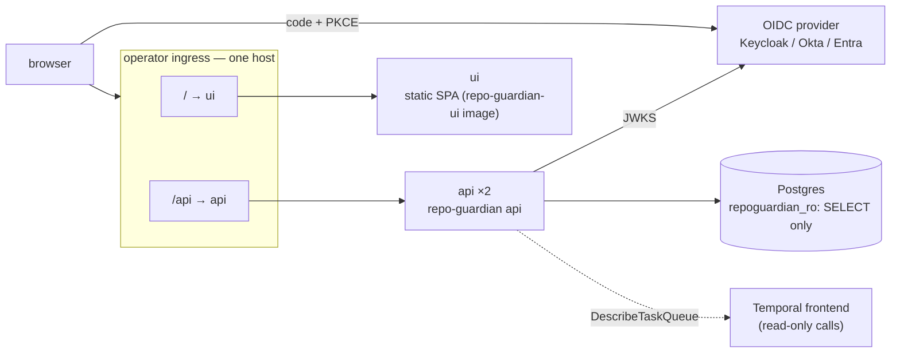
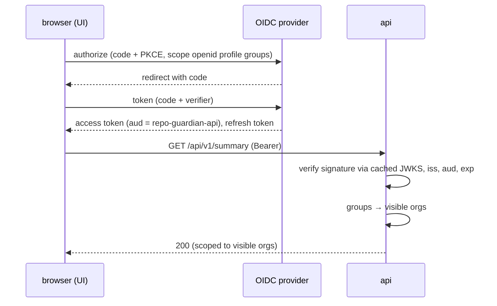

<!-- markdownlint-disable-file MD025 MD041 -->

# DESIGN-0027: v2 read-only API, business UI, and status page

**Status:** Draft
**Author:** Donald Gifford
**Date:** 2026-09-24

<!--toc:start-->
- [Overview](#overview)
- [Goals and Non-Goals](#goals-and-non-goals)
  - [Goals](#goals)
  - [Non-Goals](#non-goals)
- [Background](#background)
- [Detailed Design](#detailed-design)
  - [Architecture](#architecture)
  - [The api role](#the-api-role)
  - [Authentication](#authentication)
  - [Authorization](#authorization)
  - [Endpoints (v1)](#endpoints-v1)
  - [Status page](#status-page)
  - [Contract and code generation](#contract-and-code-generation)
  - [The UI (repo-guardian-ui)](#the-ui-repo-guardian-ui)
  - [What the UI replaces](#what-the-ui-replaces)
  - [Chart](#chart)
  - [Observability](#observability)
  - [Documentation](#documentation)
- [API / Interface Changes](#api--interface-changes)
- [Data Model](#data-model)
- [Testing Strategy](#testing-strategy)
- [Implementation Phases](#implementation-phases)
- [Migration / Rollout Plan](#migration--rollout-plan)
- [Risks](#risks)
- [Open Questions](#open-questions)
- [References](#references)
<!--toc:end-->

## Overview

In v2, Prometheus carries no business metrics (INV-0018 OQ3), so the
compliance dashboards (E1 KPI, E2 detail) and the "which repository and
why" Loki panels (E4) need a new home. That home has three parts:

- **A read-only HTTP API**, the `api` role of the repo-guardian binary.
  It serves findings, compliance and history from Postgres
  (DESIGN-0025) behind OIDC, through a SELECT-only database role.
- **A business UI** in a separate repository (`repo-guardian-ui`):
  Bun, React, TypeScript and shadcn/ui, with OIDC login and a client
  generated from the API's OpenAPI contract.
- **A public status page**, served by the same API from first-party
  state. It shows aggregate service health and fleet compliance, with no
  organization, repository or rule names.

The UI never writes. It cannot edit policy, trigger actions, or call
GitHub (INV-0018 OQ4, Obs 8, Obs 9). Data flows one way: engine →
findings → API → UI.

| Design | Scope |
| --- | --- |
| DESIGN-0025 | findings model, v1 data migration, the tables this design reads |
| DESIGN-0026 | Temporal control plane, roles, chart 2.0.0 |
| **DESIGN-0027** (this) | API contract, auth, authorization, status page, UI |

## Goals and Non-Goals

### Goals

- **Replace every business panel** in E1, E2 and the per-repository E4
  panels with an API endpoint and a UI view (see the
  [replacement map](#what-the-ui-replaces)).
- **Explain, not just count.** A repository page shows each rule's
  status, reason, evidence, the PR in flight, and the history of
  changes.
- **Read-only by construction.** The database role can only `SELECT`,
  the API has no mutating routes, and the API holds no GitHub
  credentials.
- **OIDC for people and machines.** The UI logs in with authorization
  code + PKCE. The API validates bearer JWTs against the issuer's JWKS,
  and machine clients use client-credentials tokens.
- **Coarse org-level authorization**: "may this identity see this org",
  from group claims. No RBAC hierarchy (INV-0018 Obs 9).
- **A public status page** that is safe to expose: aggregate health and
  compliance only.
- **One contract.** `api/openapi.yaml` in this repository drives the Go
  server stubs and the TypeScript client.

### Non-Goals

- **Any write path.** No acknowledging findings, suppressing rules,
  re-running checks or editing policy from the UI, for the life of v2.
  Policy changes go through git.
- **Notifications UI.** Showing Jira/Slack references on findings comes
  with the notifications design.
- **Operator/system dashboards.** Grafana with the E3 system dashboard
  and E4 logs remains the operator surface. The status page summarizes
  health for users, not for on-call.
- **Multi-tenant SaaS concerns.** One deployment serves one
  organization's GitHub Enterprise Cloud estate.

## Background

- **INV-0009** made the API/UI decisions this design builds on:
  - `api` is a subcommand of the same image with its own Deployment,
    disabled by default (`api.enabled=false`).
  - The API uses a `store.Reader` interface on its own pool.
  - `STORE_RO_DSN` with a `repoguardian_ro` role; in CNPG mode that is
    the `-ro` Service.
  - OIDC: code + PKCE in the UI, stateless bearer-JWT middleware in the
    API; the chart renders no Ingress unless auth is configured.
  - OpenAPI + oapi-codegen, with a generated TS client.
  - The UI lives in a separate repository.
  - Generic OIDC, validated with Keycloak in the homelab first.
- **INV-0018:**
  - the UI is read-only and never holds policy (Obs 8, OQ4);
  - there is no generic GitHub proxy (Obs 9);
  - the status page is served from first-party state and never from
    Prometheus;
  - the status page is unauthenticated and aggregate-only (OQ5).
- **What exists today:**
  - The `report` subcommand renders per-org markdown from `rule_state`
    and `compliance_snapshot`. Compliance is floored to one decimal and
    reads "n/a" when the denominator is zero. Trends compare each rule
    against its latest snapshot. PR links are resolved live through
    GitHub.
  - The HTTP layer is `net/http.ServeMux` with Go 1.22 method patterns,
    wrapped by `observability.Handler`. otelhttp is the outermost
    wrapper, so rejected requests are still counted.
  - There is no OIDC, JWT-validation or CORS code, and no OpenAPI
    tooling, in go.mod.
  - `mkdocs.yml` uses `techdocs-core` only and has no API section.
- **Tooling fact:** oapi-codegen added initial OpenAPI 3.1 support in
  v2.8.0. It needs Go ≥ 1.25 and runtime ≥ v1.6.0, and it generates
  standard-library `net/http` servers.

## Detailed Design

### Architecture



- **Same origin** (OQ1). The UI is served at `/` and the API at `/api`
  on one host. The browser therefore never makes a cross-origin call,
  the API needs no CORS handling, and the attack surface stays smaller.
- **The UI is static assets.** All data comes from the API with a
  bearer token.
- **The API is stateless**: two replicas behind a PDB, with no session
  store.

### The `api` role

- **Process.** `repo-guardian api` serves the API on `API_LISTEN_ADDR`
  (`:8080` in its own pod) and `/metrics` on `METRICS_ADDR`.
  `/healthz` and `/readyz` are uninstrumented, as on v1's server;
  `/readyz` checks the database schema version and pool.
- **Router.** Standard-library `ServeMux` with oapi-codegen's
  strict-server interface, so each handler receives typed request
  objects and returns typed response objects that match the spec.
- **Middleware, outermost first:**
  1. `observability.Handler` (otelhttp; `http.route` from the matched
     pattern; outermost so 401s and 403s are counted);
  2. request ID and structured access log;
  3. panic recovery;
  4. authentication;
  5. authorization context (visible orgs);
  6. handler.
- **Database.** `store.Reader` on a dedicated pool:
  - `STORE_RO_DSN`, with max 8 connections;
  - `statement_timeout = 5s` and `default_transaction_read_only = on`
    set in `AfterConnect`, so a write is refused even if a grant is
    wrong;
  - every handler runs in a `pgx.ReadOnly` transaction.
  - In `all` topology the API may fall back to `STORE_DSN`; it keeps the
    read-only session settings (OQ11).
- **Temporal.** An optional client for status only:
  `DescribeTaskQueue` for backlog and pollers (OQ13). The API never
  starts, signals or queries workflows.
- **No GitHub client.** PR links come from finding evidence
  (DESIGN-0025), which the worker captured. The report's live
  `GitHubLinker` lookup is not carried over.

### Authentication

- **Library:** `github.com/coreos/go-oidc/v3` (OQ3). It handles
  discovery from `OIDC_ISSUER`, keeps a cached, rotating JWKS, and
  checks signature, `iss`, `aud` (`OIDC_AUDIENCE`), `exp` and `nbf`,
  with 60s skew.
- **Header:** `Authorization: Bearer <access token>`. The API accepts
  **access tokens** issued for its audience, never ID tokens.
- **Claims used:**
  - `sub` for logging;
  - a display name (`OIDC_NAME_CLAIM`, default `preferred_username`);
  - groups (`OIDC_GROUPS_CLAIM`, default `groups`).
- **Machine clients** use client-credentials tokens with the same
  audience. Their group claim (or a configured `azp`→groups mapping)
  goes through the same authorization.
- **Disabled auth** (`api.auth.enabled=false`) is allowed only with the
  API bound to the pod network and **no Ingress rendered**, as in
  INV-0009. The chart refuses to render the Ingress in that state.
- **Failures:** 401 carries `WWW-Authenticate: Bearer error="invalid_token"`;
  the system counter `api_auth_failures_total{reason}` records it.



### Authorization

Authorization answers one question: which orgs this identity may see.
It is configured in chart values and rendered to a file the API reads
at startup:

```yaml
api:
  authz:
    groups:
      platform-engineering: ["*"]        # every org
      team-payments: ["acme-payments"]
      team-web: ["acme-web", "acme-docs"]
    defaultOrgs: []                      # identities with no matching group see nothing
```

- **Filtering happens in SQL.** Every query takes
  `org = ANY($visible)`, and `*` is a flag that skips the predicate. No
  handler filters rows in Go after the query.
- **An org the caller cannot see returns 404, not 403**, so org and
  repository names cannot be enumerated.
- **Identities with no visible org get 403** on every endpoint except
  `/api/v1/me`, which tells the UI to show an "ask for access" page.
- **Aggregates are computed over visible orgs only.** A fleet summary
  for `team-web` is the summary of its two orgs.

### Endpoints (v1)

All endpoints are `GET`. Responses are JSON, times are RFC 3339 UTC,
and errors are RFC 9457 `application/problem+json`. Lists use opaque
keyset cursors (`?cursor=&limit=`, default 50, max 200) and never
offsets, so pages stay stable while checks write.

| Endpoint | Auth | Returns | Replaces |
| --- | --- | --- | --- |
| `/api/v1/status` | **public** | overall state, component states, fleet compliance % (see [Status page](#status-page)) | — |
| `/api/v1/me` | token | identity, visible orgs | — |
| `/api/v1/summary` | token | tracked, parked by reason, compliant %, counts by status, open PRs by age bucket, PRs over threshold | E1 fleet row, convergence row |
| `/api/v1/rules` | token | per `(kind, name)`: counts by status, compliance %, trend vs. previous snapshot | E1 "compliance by rule", "failing each rule" |
| `/api/v1/rules/{kind}/{name}` | token | per-org breakdown, top reasons, oldest failures, policy description | E2 per-rule |
| `/api/v1/orgs` | token | per-org tracked, compliance, parked | E2 "tracked by org" |
| `/api/v1/orgs/{org}` | token | per-rule table for one org, scope/ignore/gate counts (`not_applicable` by reason) | E2 org row, "rules skipped for scope/ignore" |
| `/api/v1/findings` | token | findings filtered by `status, reason, remediation, org, kind, rule, pr_stale, since_before` | E4 "which repository" panels |
| `/api/v1/repositories` | token | repositories filtered by `org, active, park_reason, q` (name prefix) | E1/E4 parked panels |
| `/api/v1/repositories/{id}` | token | repository, installation, last check, all findings with evidence, park state | — (log-only in v1) |
| `/api/v1/repositories/{id}/events` | token | timeline merging `finding_events` and `repository_events` | — |
| `/api/v1/repositories/{id}/checks` | token | recent checks: trigger, outcome, duration, error | E4 write-back and error panels, per repo |
| `/api/v1/compliance/history` | token | snapshot series by `org, kind, rule, from, to` | report trend, E1 trends |
| `/api/v1/policy` | token | current policy version, rollout state, rule summaries (from `policy_versions.summary`) | — |
| `/api/v1/installations` | token | installation, org, suspended/removed, rate snapshot age | E2 "API budget by org" |
| `/api/v1/openapi.yaml` | public | the contract | — |

`pr_stale` is computed at read time: a finding with
`remediation = pr_open` and `evidence.pr.created_at` older than
`PR_STALE_AFTER` (default 30 days, OQ14). The `?stale_after=` query
parameter overrides it.

**Compliance math is shared.** The report, the snapshot writer and the
`/rules` and `/orgs` endpoints use one sqlc query:
`compliant / (compliant + non_compliant)` over active repositories,
with `not_applicable` and `unknown` reported separately. An empty
denominator returns `null`, never 100% (DESIGN-0025). The value is
floored to one decimal, as `report.CompliantPercent` does today, so the
UI and the report never disagree.

### Status page

`GET /api/v1/status` is public. The API computes it every 30s into an
in-process cache, so a request never touches the database and the
endpoint is cheap to hit.

| Component | Source | Degraded when | Down when |
| --- | --- | --- | --- |
| Checks | `checks`: last success, error ratio over the last hour | error ratio > 10% or last success > 2h ago | no success in 2 × `CHECK_INTERVAL` |
| Webhooks | `checks` with trigger `webhook`/`push`: last one | none in 24h while repositories are active (informational only; quiet orgs are normal) | — |
| Discovery | `service_runs` kind `discovery` | last success > 2 × `DISCOVERY_INTERVAL` ago | no success in 24h |
| Snapshots | `service_runs` kind `snapshot` | last success > 2 × interval ago | — |
| GitHub API budget | `installations` rate snapshot | any installation below the reserve with reset in the future | all installations throttled |
| Work backlog | Temporal `DescribeTaskQueue` (optional) | backlog age > 15m | no pollers |

```json
{
  "state": "operational",
  "updated_at": "2026-09-24T12:00:00Z",
  "components": [
    {"name": "checks", "state": "operational", "detail": "last success 3m ago"},
    {"name": "discovery", "state": "operational", "detail": "last run 41m ago"}
  ],
  "compliance": {"percent": 87.4, "measured": true}
}
```

- **Contents** (OQ5): overall state, component states with relative-time
  details, and fleet-wide compliance.
- **Never included:** organization, repository, rule or installation
  names, counts that identify an org, and error text.
- A test asserts the response schema has no free-text fields beyond the
  fixed component `detail` templates.

### Contract and code generation

- **`api/openapi.yaml`**, OpenAPI 3.1 (OQ2). It is hand-written and
  reviewed like code, and it is the source of truth.
- **Server:** oapi-codegen ≥ v2.8.0, `std-http-server` +
  `strict-server`, with output committed to `internal/api/gen`.
  `make generate-api` plus a CI drift gate (regenerate, then `diff -r`)
  keep them in sync.
- **3.1 support in oapi-codegen is new ("initial").** The spec sticks to
  constructs it documents: `type: [T, "null"]` nullability, `oneOf`
  enums. If a construct fails, the fallback is an OpenAPI Overlay rather
  than downgrading the spec.
- **Contract tests** run every handler through kin-openapi's response
  validator in tests, so the implementation cannot drift from the spec.
- **Publishing:** the spec is attached to each GitHub release, served at
  `/api/v1/openapi.yaml`, and vendored by the UI repository at a pinned
  version.
- **Compatibility:** within `/api/v1`, only additive changes (new
  fields, endpoints, enum values documented as open). A breaking change
  means `/api/v2`, with both served for one release.

### The UI (`repo-guardian-ui`)

**Stack:**

| Concern | Choice |
| --- | --- |
| Runtime, package manager, test runner | Bun |
| Build | Vite (run under Bun) producing static assets |
| Framework | React 19 + TypeScript (strict) |
| Components | shadcn/ui + Tailwind CSS; shadcn charts (Recharts) |
| Routing and data | TanStack Router + TanStack Query (OQ9) |
| API client | `openapi-typescript` types + `openapi-fetch`, generated from the pinned spec |
| OIDC | `oidc-client-ts` via `react-oidc-context` (code + PKCE) |
| Tests | `bun test` for units; Playwright e2e against a mock issuer and a seeded API |

**Views:**

| View | Path | Shows |
| --- | --- | --- |
| Status | `/status` (public) | status page |
| Fleet | `/` | tracked, compliance, parked by reason, PR age buckets, compliance trend, worst rules |
| Rules | `/rules`, `/rules/:kind/:name` | compliance per rule; per-org breakdown; top reasons; description from policy |
| Orgs | `/orgs`, `/orgs/:org` | per-org rule table, not-applicable reasons |
| Findings | `/findings` | filterable table (status, reason, remediation, org, rule, stale PR) with CSV export (client-side, from the fetched page set) |
| Repository | `/repos/:id` | findings with evidence, PR links, park state, timeline, recent checks |
| History | `/history` | compliance series per org and rule |
| Policy | `/policy` | current version, rollout progress, rules (read-only) |

Two views, sketched:

```text
Fleet                                                   [org filter ▾]
┌───────────────┬───────────────┬───────────────┬───────────────┐
│ Tracked 4,812 │ Compliant 87% │ Failing 1,203 │ Parked 211    │
└───────────────┴───────────────┴───────────────┴───────────────┘
Compliance (90d) ▁▂▂▃▃▄▄▅▅▆▆▆▇▇     Open PRs by age  <1d 40 │ 1-7d 88 │ 7-30d 51 │ 30d+ 17
Worst rules                         Parked by reason
 renovate        61%  ▸              archived 150 · fork 48 · access_denied 13
 codeowners      78%  ▸

Repository  acme/widgets                       active · checked 2h ago
┌────────────┬───────────────┬──────────────────────────┬────────────────────┐
│ Rule       │ Status        │ Reason / evidence        │ Remediation        │
├────────────┼───────────────┼──────────────────────────┼────────────────────┤
│ renovate   │ non_compliant │ assertion_failed:        │ PR #412 (9d)  ↗    │
│            │               │ "extends must include…"  │                    │
│ codeowners │ compliant     │                          │                    │
│ dependabot │ n/a           │ gate_closed (renovate)   │                    │
└────────────┴───────────────┴──────────────────────────┴────────────────────┘
Timeline  09-15 renovate compliant → non_compliant (assertion_failed) · 09-15 PR #412 opened
```

**Security:**

- **Tokens** are held in memory, with refresh-token rotation for renewal
  (OQ7). Nothing goes to `localStorage`.
- **CSP:** no inline scripts, `connect-src 'self'` plus the issuer, and
  `frame-ancestors 'none'`.
- **Repository-controlled text** (assertion messages, file paths, PR
  titles) is rendered as text only: no `dangerouslySetInnerHTML`, no
  markdown rendering of evidence.
- **External links** are built from structured fields
  (`https://<host>/<org>/<name>/pull/<number>`), not from free-text URLs
  in evidence. They open with `rel="noopener noreferrer"`.

**Runtime config:** one image serves every environment. `/config.json`
is mounted from a ConfigMap and read at boot:
`{issuer, clientId, apiBase: "/api", scopes}`.

**Serving:** a static build in an unprivileged nginx image (OQ6), with
SPA fallback to `index.html`, long cache for hashed assets and no-cache
for `index.html` and `config.json`.

### What the UI replaces

| v1 surface | v2 |
| --- | --- |
| E1 Repositories tracked / unmeasurable | Fleet tiles; `/summary` |
| E1 Compliance by rule / failing each rule | Fleet "worst rules", Rules view; `/rules` |
| E1 Open PRs by age, PRs over 30 days | Fleet PR buckets; Findings `pr_stale=true` |
| E1 PR throughput (opened/auto-closed per hour) | History: daily transitions from `finding_events` (non_compliant → compliant with remediation `pr_open`) |
| E1 service-health row | Status page (users); E3 in Grafana (operators) |
| E2 tracked by org, org rows | Orgs view; `/orgs`, `/orgs/{org}` |
| E2 parked in 24h by reason | Repositories filtered by `park_reason`, with `repository_events` times |
| E2 rules skipped for scope/ignore | Org view: `not_applicable` by reason |
| E2 API budget by org | `/installations` (and the status page) |
| E4 unparseable catalog-info | Repositories with `catalog_parse_ok = false`, error in the latest check |
| E4 parked repositories | Repositories view |
| E4 jobs dropped at attempt cap | Repository → recent checks with `outcome = error` |
| `repo-guardian report` | unchanged CLI, reading the same sqlc queries; PR links now come from evidence |

### Chart

These values extend chart 2.0.0 (DESIGN-0026):

```yaml
api:
  enabled: false            # INV-0009: off until auth is configured
  replicas: 2
  roDsn:
    existingSecret: ""      # STORE_RO_DSN; baked/CNPG modes derive it
  auth:
    enabled: true
    issuer: ""
    audience: repo-guardian-api
    groupsClaim: groups
  authz:
    groups: {}
  status:
    public: true
  ingress:
    enabled: false          # fails render if auth.enabled is false
    className: ""
    host: ""
    uiService: ""           # the UI release's Service, routed at /
```

The read-only role (DESIGN-0025 OQ12) is created per Postgres mode:

- **baked:** by the StatefulSet's init SQL;
- **CNPG:** declared in `spec.managed.roles`, with the API connecting
  through the `-ro` Service;
- **external:** the operator creates `repoguardian_ro`, and the docs
  give the `CREATE ROLE` and `GRANT` statements.

The UI ships its own chart from its own repository (OQ8).
`api.ingress.uiService` wires both into one host.

### Observability

These are system-only metrics:

- otelhttp server metrics on `api`, by route;
- otelpgx metrics on the read-only pool;
- `api_auth_failures_total{reason}`;
- `api_status_refresh_seconds`.

No endpoint emits a business metric. The E3 dashboard gains an API row
through the generator.

### Documentation

`docs/usage/api.md` covers authentication setup (Keycloak example),
authz configuration, the status page, and a link to the spec.
Rendering the spec inside mkdocs is OQ10.

## API / Interface Changes

- New role `repo-guardian api`.
- New env vars:
  - `API_LISTEN_ADDR`, `STORE_RO_DSN`;
  - `OIDC_ISSUER`, `OIDC_AUDIENCE`, `OIDC_GROUPS_CLAIM`,
    `OIDC_NAME_CLAIM`;
  - `API_AUTHZ_CONFIG` (path), `API_AUTH_ENABLED`;
  - `PR_STALE_AFTER`, `STATUS_PUBLIC`.
- New contract `api/openapi.yaml`.
- `store.Reader` gains the read methods behind each endpoint, as sqlc
  queries in `internal/store/postgres/queries/api_*.sql`.

## Data Model

The API reads DESIGN-0025 tables only:

- `repositories`, `installations`, `findings`, `finding_events`,
  `repository_events`;
- `checks`, `compliance_snapshots`, `policy_versions`, `service_runs`.

The only additions requested of DESIGN-0025 are `service_runs`,
`policy_versions.summary` and the `lower(org)` index, all already
reflected there. At the target scale (200k findings) every endpoint is
an indexed aggregate or a keyset page. If `/summary` or `/rules` exceed
100ms p99, the first remedy is caching them alongside the status
refresh, not materialized views.

## Testing Strategy

- **Contract:** every handler test validates the response against the
  spec with kin-openapi; the CI drift gate checks generated code.
- **Auth:** a test issuer (in-process JWKS) mints tokens with the wrong
  audience, expired, wrong issuer, bad signature, and no groups.
  Assertions cover 401 and 403 and the counter.
- **Authz:** seeded two-org data. Assert:
  - aggregates computed over visible orgs only;
  - 404 for an invisible org's repository;
  - `*` sees everything.
- **Read-only enforcement:** an integration test attempts an `INSERT`
  through the API pool and expects failure from both the role and
  `default_transaction_read_only`.
- **Status page:**
  - component state thresholds (table-driven);
  - served from cache (zero queries per request);
  - schema has no free-text fields.
- **Compliance parity:** the same seeded database through `report`,
  `/rules` and the snapshot writer yields identical percentages.
- **UI:** unit tests for view models. Playwright e2e covers login via
  mock issuer, fleet → rule → repository navigation, filters, the public
  status page without login, and an evidence string containing HTML
  rendered as text.

## Implementation Phases

On the `v2` branch after DESIGN-0025 phase 2 (tables exist). This work
can run in parallel with DESIGN-0026.

1. **Contract and skeleton.** `api/openapi.yaml` for `/me`, `/summary`,
   `/status`; oapi-codegen wiring; the `api` role; middleware chain;
   read-only pool.
2. **Auth and authz.** go-oidc verifier, group→org config, SQL
   filtering, test issuer.
3. **Read endpoints.** The rest of the table, with sqlc queries and
   compliance-math unification with `report`.
4. **Status page.** Cache, component rules, optional Temporal probe.
5. **Chart.** `api.*` values, ingress guard, read-only role per
   Postgres mode.
6. **UI repository.** Scaffold, OIDC, generated client, Fleet and
   Repository views first, then the rest.
7. **E2E and docs.** Playwright suite, `docs/usage/api.md`, a Keycloak
   homelab walkthrough.

## Migration / Rollout Plan

- The API and UI are new in v2, so there is nothing to migrate.
- At the v2 cutover (DESIGN-0026), the API serves backfilled data
  immediately. Findings read `migrated_from_v1` until each repository's
  first v2 check, and the UI renders that reason as "last checked by v1;
  details on next check".
- `api.enabled` stays false by default until auth has been validated in
  the homelab (INV-0009). Operators enable it after configuring an
  issuer.

## Risks

| Risk | Mitigation |
| --- | --- |
| Public status page leaks org or repo information | fixed schema with no names; test asserts no free-text fields |
| Authz bug exposes another team's orgs | filtering only in SQL, 404 for invisible, two-org tests on every endpoint |
| Evidence text used for XSS | text-only rendering, CSP, no markdown |
| Tokens stolen from the browser | in-memory storage, short-lived access tokens, rotation; the BFF option (OQ6 b) if the threat model requires it |
| Spec and server drift | strict-server generation, drift gate, response validation in tests |
| oapi-codegen 3.1 gaps | documented constructs only; Overlay fallback |
| Aggregate queries slow at scale | indexed queries, 30s cache for hot aggregates, measured in the homelab |

## Open Questions

1. **Hosting the UI and API.**
   - (a) Same origin through the operator's ingress: the UI at `/` and
     the API at `/api`. No CORS.
   - (b) Separate hosts with a CORS allowlist in the API.
   - other:

2. **Contract version and generator.**
   - (a) OpenAPI 3.1 with oapi-codegen ≥ v2.8.0 (std-http + strict),
     using an Overlay for any unsupported construct.
   - (b) OpenAPI 3.0.3 with oapi-codegen (mature path; loses 3.1 null
     types).
   - (c) OpenAPI 3.1 with `ogen`.
   - other:

3. **OIDC validation library.**
   - (a) `coreos/go-oidc/v3`.
   - (b) `zitadel/oidc`.
   - (c) `lestrrat-go/jwx` with hand-rolled discovery.
   - other:

4. **Authorization model.**
   - (a) Group → org mapping in chart values, `*` for all orgs, 404 for
     invisible orgs.
   - (b) Every authenticated user sees every org.
   - (c) Orgs asserted directly by an IdP claim.
   - other:

5. **Public status page content.**
   - (a) Overall and component health plus fleet-wide compliance %; no
     names.
   - (b) (a) plus per-rule compliance % (exposes rule names).
   - (c) Service health only, with no compliance number.
   - other:

6. **UI serving and token handling.**
   - (a) Static SPA in an unprivileged nginx image; tokens in the
     browser (in memory).
   - (b) A Bun backend-for-frontend holding tokens server-side, with an
     HttpOnly session cookie to the browser.
   - (c) Embed the SPA in the Go binary (INV-0009 rejected this).
   - other:

7. **Token storage in the browser** (if 6a).
   - (a) Memory only, with refresh-token rotation.
   - (b) `sessionStorage`.
   - other:

8. **UI deployment packaging.**
   - (a) The UI repository publishes its own chart; the repo-guardian
     chart wires the ingress to it (`api.ingress.uiService`).
   - (b) The repo-guardian chart gains an optional `ui.*` Deployment
     using the UI image.
   - other:

9. **Router and data libraries.**
   - (a) TanStack Router + TanStack Query.
   - (b) React Router v7 + TanStack Query.
   - other:

10. **API docs in mkdocs.**
    - (a) Add an OpenAPI-rendering mkdocs plugin alongside
      `techdocs-core`.
    - (b) Link to the spec file and the release artifact only.
    - other:

11. **Read-only DSN fallback.**
    - (a) Require `STORE_RO_DSN` in `split` topology. `all` may fall
      back to `STORE_DSN`, and the read-only session settings still
      apply.
    - (b) Always allow fallback.
    - other:

12. **Policy view source.**
    - (a) The worker writes a summary into `policy_versions.summary`;
      the API reads only the database.
    - (b) The API mounts the policy ConfigMap and parses it.
    - other:

13. **Temporal in the status page.**
    - (a) Optional read-only Temporal client (`DescribeTaskQueue`) for
      backlog and pollers.
    - (b) Database only: derive liveness from `checks` freshness.
    - other:

14. **Stale-PR threshold.**
    - (a) `PR_STALE_AFTER` default 30 days, with a per-request override.
    - (b) Configurable per org in authz config.
    - other:

## References

- INV-0009 — read-only status API and web UI options
- INV-0018 — v2 (Obs 8, Obs 9, OQ4, OQ5)
- DESIGN-0025 — findings model and tables
- DESIGN-0026 — roles, chart 2.0.0, cutover
- DESIGN-0022 — compliance posture, dashboards E1–E4, report
- [oapi-codegen v2.8.0 (OpenAPI 3.1)](https://github.com/oapi-codegen/oapi-codegen/releases/tag/v2.8.0) ·
  [go-oidc](https://github.com/coreos/go-oidc) ·
  [oidc-client-ts](https://github.com/authts/oidc-client-ts) ·
  [openapi-typescript](https://openapi-ts.dev) ·
  [shadcn/ui](https://ui.shadcn.com) ·
  [RFC 9457](https://www.rfc-editor.org/rfc/rfc9457)
