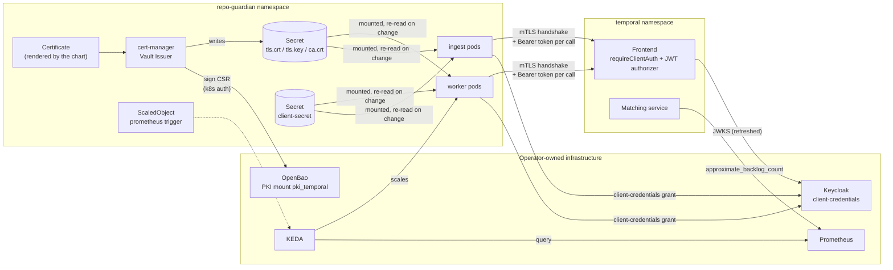
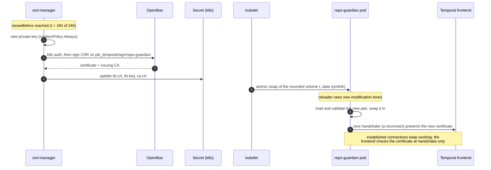
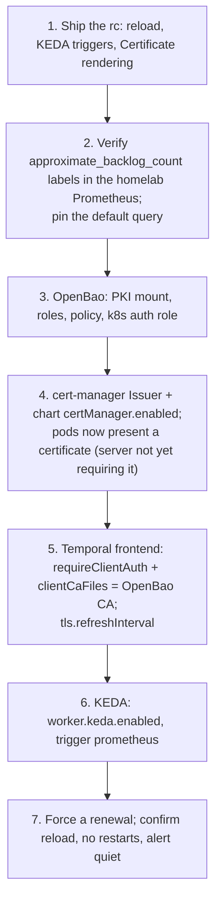

<!-- markdownlint-disable-file MD025 MD041 -->

# DESIGN-0028: Temporal client auth: OIDC over mTLS with OpenBao-issued certificates, and KEDA scaling from server metrics

<!--toc:start-->
- [Overview](#overview)
- [Goals and Non-Goals](#goals-and-non-goals)
  - [Goals](#goals)
  - [Non-Goals](#non-goals)
- [Background](#background)
- [Detailed Design](#detailed-design)
  - [Architecture](#architecture)
  - [Certificate issuance](#certificate-issuance)
    - [OpenBao](#openbao)
    - [cert-manager](#cert-manager)
    - [Renewal](#renewal)
  - [Credential reload in the client](#credential-reload-in-the-client)
    - [Certificate and CA](#certificate-and-ca)
    - [OIDC client secret](#oidc-client-secret)
    - [Metrics](#metrics)
  - [Temporal server configuration](#temporal-server-configuration)
  - [Multiple environments](#multiple-environments)
  - [KEDA](#keda)
    - [Prometheus trigger (default)](#prometheus-trigger-default)
    - [Temporal trigger (opt-in)](#temporal-trigger-opt-in)
    - [Guards](#guards)
  - [Chart values](#chart-values)
  - [Alerts](#alerts)
- [API / Interface Changes](#api--interface-changes)
- [Data Model](#data-model)
- [Testing Strategy](#testing-strategy)
- [Migration / Rollout Plan](#migration--rollout-plan)
- [Open Questions](#open-questions)
  - [OQ1: One Temporal CA, or separate client and server CAs?](#oq1-one-temporal-ca-or-separate-client-and-server-cas)
  - [OQ2: Does the chart render the cert-manager Issuer?](#oq2-does-the-chart-render-the-cert-manager-issuer)
  - [OQ3: One certificate and OIDC client for all roles, or one per role?](#oq3-one-certificate-and-oidc-client-for-all-roles-or-one-per-role)
  - [OQ4: Default certificate lifetime?](#oq4-default-certificate-lifetime)
  - [OQ5: How does the client notice a changed file?](#oq5-how-does-the-client-notice-a-changed-file)
  - [OQ6: Reload the CA bundle too, or only the client certificate?](#oq6-reload-the-ca-bundle-too-or-only-the-client-certificate)
  - [OQ7: How does the reference cluster create its namespace with the authorizer on?](#oq7-how-does-the-reference-cluster-create-its-namespace-with-the-authorizer-on)
  - [OQ8: Which KEDA trigger is the default?](#oq8-which-keda-trigger-is-the-default)
  - [OQ9: Where does the certificate-expiry alert live?](#oq9-where-does-the-certificate-expiry-alert-live)
  - [OQ10: Should the ScaledObject set a fallback?](#oq10-should-the-scaledobject-set-a-fallback)
- [References](#references)
<!--toc:end-->

## Overview

repo-guardian's Temporal clients (the `ingest`, `worker` and `all`
roles) will authenticate in two layers:

- **mTLS for transport.** The certificate proves this is a workload we
  issued a certificate to. cert-manager requests and renews it from
  OpenBao's PKI engine.
- **OIDC for authorization.** The token decides what the client may do,
  and in which namespace. Keycloak (or another identity provider) issues
  it, as today.

The client re-reads every credential file when it changes, so
certificate renewal and secret rotation never need a pod restart or an
extra controller. KEDA scales the worker from the Temporal server's own
backlog gauge through its Prometheus trigger, so the autoscaler holds no
Temporal credentials at all.

This turns [INV-0020](../investigation/0020-keda-worker-autoscaling-cannot-authenticate-to-temporal.md)'s
recommendation into a buildable design for the next v2 rc.

## Goals and Non-Goals

### Goals

- **Layered client auth.** A client certificate *and* an OIDC token on
  every connection to the Temporal frontend, with the frontend enforcing
  both.
- **Certificates issued and renewed without people.** OpenBao holds the
  CA key; cert-manager renews; nobody copies PEM files around.
- **No restarts for rotation.** The client certificate, the CA bundle
  and the OIDC client secret are re-read from disk when they change.
  Operators do not need Reloader or similar.
- **Autoscaling that works under any auth mode.** KEDA's Prometheus
  trigger on `approximate_backlog_count` is the default. KEDA's own
  Temporal trigger keeps working for mTLS-only clusters, with the
  missing `TriggerAuthentication` fixed.
- **Fail loudly.** Every new failure mode (a certificate near expiry, a
  reload error, a Prometheus outage) has a metric, and the important
  ones have an alert.
- **A reference cluster that matches.** `contrib/temporal/` enables the
  JWT authorizer alongside its existing mTLS.

### Non-Goals

- **A shared library.** Extracting this into a shared module (for
  example `donaldgifford/x`) is planned for after the rc is proven
  (INV-0020 § Future work). This design keeps the code in
  `internal/temporal` but shapes it to lift out cleanly.
- **Running OpenBao or cert-manager.** Both are cluster infrastructure
  the operator owns. The design documents their configuration and
  renders only the per-release `Certificate`.
- **Temporal Cloud.** Cloud scopes certificates and API keys per
  namespace natively; that path already works through
  `temporal.tls.existingSecret` and needs nothing here.
- **The status page backlog in split topology** (INV-0020 Observation
  10). It is unrelated to auth and gets its own change.
- **Certificate-bound tokens** (RFC 8705). Keycloak can issue them, but
  the Temporal server never checks the binding, so they would add
  nothing.
- **Revocation lists.** The Temporal frontend does not check CRLs or
  OCSP. Short certificate lifetimes stand in for revocation.

## Background

INV-0020 established:

1. **On self-hosted Temporal, mTLS and JWTs are layers, not
   alternatives.** The server's only built-in fine-grained authorizer
   reads JWTs. Its claim mapper ignores the client certificate entirely.
   A certificate-only client on a JWT-authorized cluster is denied, and
   "mTLS for workers" without tokens means turning authorization off,
   which makes every certificate cluster admin (Observation 9).
2. **KEDA's Temporal trigger cannot mint OIDC tokens**, and its static
   `apiKey` field cannot hold an expiring token (Observation 3). The
   chart refuses KEDA with OIDC. Under mTLS the chart renders no
   `TriggerAuthentication`, so KEDA fails silently (Observations 1 and
   2).
3. **The Temporal server already exports the backlog** as
   `approximate_backlog_count`, per task queue, on by default
   (Observation 8). KEDA's Prometheus trigger can read it with no
   Temporal credentials.
4. **repo-guardian already supports a certificate and a token together**
   (Observation 11). The code loads both, and the chart allows
   `temporal.tls.existingSecret` with `temporal.auth.oidc`.
5. **Credentials are read once** (Observation 12, and a comment on
   `OIDCConfig.tokenSource`). A renewed certificate or rotated client
   secret is not used until the pod restarts.

Today's configurations, for reference:

| Cluster | Transport | Authorization | KEDA |
| --- | --- | --- | --- |
| Homelab | server TLS | JWT (Keycloak) | refused by the chart |
| `contrib/temporal/` | mTLS, one CA for everything | none (any certificate is admin) | renders, silently fails |
| This design | mTLS, dedicated client CA in OpenBao | JWT | Prometheus trigger |

## Detailed Design

### Architecture



Two trust paths, which never cross:

- **Workload → Temporal:** certificate from OpenBao, token from
  Keycloak.
- **KEDA → worker replicas:** Prometheus only. KEDA never connects to
  Temporal.

### Certificate issuance

#### OpenBao

One PKI mount used only for Temporal clients. At the transport layer the
frontend admits every certificate this CA signs, so sharing it with
anything else widens who gets through the first layer. The CA layout
(one CA for clients and the frontend's server certificate, or separate
ones) is **OQ1**.

The sketch below assumes OQ1 (a): one Temporal CA, with roles kept apart
by extended key usage (EKU).

```bash
bao secrets enable -path=pki_temporal pki
bao secrets tune -max-lease-ttl=87600h pki_temporal
bao write pki_temporal/root/generate/internal \
    common_name="Temporal CA" ttl=87600h key_type=ec key_bits=384

# Client certificates for repo-guardian: client EKU only, short-lived.
bao write pki_temporal/roles/repo-guardian \
    allowed_domains="repo-guardian" allow_bare_domains=true \
    allow_subdomains=false enforce_hostnames=false \
    client_flag=true server_flag=false \
    key_type=ec key_bits=256 max_ttl=72h

# The frontend's server certificate: server EKU only.
bao write pki_temporal/roles/temporal-frontend \
    allowed_domains="temporal-frontend" allow_bare_domains=true \
    client_flag=false server_flag=true \
    key_type=ec key_bits=256 max_ttl=720h

# cert-manager's policy and Kubernetes auth role, per workload.
bao policy write repo-guardian-issuer - <<'EOF'
path "pki_temporal/sign/repo-guardian" { capabilities = ["create", "update"] }
EOF
bao write auth/kubernetes/role/repo-guardian-issuer \
    bound_service_account_names=repo-guardian-issuer \
    bound_service_account_namespaces=repo-guardian \
    audience="vault://repo-guardian/repo-guardian-temporal" \
    token_policies=repo-guardian-issuer token_ttl=5m
```

EKU separation makes one CA safe for both purposes: Go's client rejects
a server certificate without the server-auth EKU, and the frontend
rejects a client certificate without the client-auth EKU. A stolen
repo-guardian client certificate cannot impersonate the frontend.

#### cert-manager

A namespaced `Issuer` per workload, operator-owned. It holds the OpenBao
address and authenticates with a short-lived token for a dedicated
service account. Whether the chart renders the Issuer as well is
**OQ2**.

```yaml
apiVersion: cert-manager.io/v1
kind: Issuer
metadata:
  name: repo-guardian-temporal
  namespace: repo-guardian
spec:
  vault:
    server: https://openbao.openbao.svc:8200
    path: pki_temporal/sign/repo-guardian
    caBundleSecretRef: {name: openbao-ca, key: ca.crt}
    auth:
      kubernetes:
        role: repo-guardian-issuer
        mountPath: /v1/auth/kubernetes
        serviceAccountRef:
          name: repo-guardian-issuer
```

Notes:

- `serviceAccountRef` needs a Role letting cert-manager's controller
  create tokens for `repo-guardian-issuer` (`serviceaccounts/token`,
  `create`), per the cert-manager Vault docs. The token's audience is
  derived from the Issuer's namespace and name, which is why the OpenBao
  role above pins `audience`. Confirm the exact format against the
  installed cert-manager version.
- OpenBao keeps Vault's HTTP API, which is what cert-manager's Vault
  issuer speaks. Verify against the deployed OpenBao version during the
  homelab rollout.

The chart renders the `Certificate` (when
`temporal.tls.certManager.enabled`), writing the Secret the pods already
mount:

```yaml
apiVersion: cert-manager.io/v1
kind: Certificate
metadata:
  name: repo-guardian-temporal-client
  namespace: repo-guardian
spec:
  secretName: repo-guardian-temporal-tls   # = temporal.tls.existingSecret
  commonName: repo-guardian
  usages: [client auth, digital signature]
  duration: 24h
  renewBefore: 8h
  privateKey:
    algorithm: ECDSA
    size: 256
    rotationPolicy: Always
  issuerRef:
    name: repo-guardian-temporal
    kind: Issuer
    group: cert-manager.io
```

cert-manager's Vault issuer writes `ca.crt` alongside `tls.crt` and
`tls.key`, the three keys the chart already expects. Whether `ingest` and
`worker` share this certificate or get one each is **OQ3**. The default
lifetimes are **OQ4**.

#### Renewal



Kubelet updates a mounted Secret within its sync period (about a minute
by default). The old certificate stays valid for `renewBefore`, so the
window is hours wide, not seconds.

### Credential reload in the client

A new file in `internal/temporal`, `reload.go`, re-reads every credential
the client loads from disk.

| Credential | Read today | After this design |
| --- | --- | --- |
| Client certificate and key | once, in `tlsConfig` (`tls.LoadX509KeyPair`) | served by `GetClientCertificate` from a reloaded snapshot |
| CA bundle (server verification) | once, into `RootCAs` | verified in `VerifyConnection` against a reloaded pool |
| OIDC client secret | once, in `tokenSource` | read on each token fetch |

#### Certificate and CA

```go
// credentialFiles serves TLS material from disk, reloading it when the
// files change. Safe for concurrent use; handshakes never touch disk.
type credentialFiles struct {
    certPath, keyPath, caPath string
    logger                    *slog.Logger

    current atomic.Pointer[tlsMaterial] // last good snapshot
    // modification times of the snapshot's files, to skip unchanged reloads
}

type tlsMaterial struct {
    cert   *tls.Certificate
    leaf   *x509.Certificate // for NotAfter, the expiry gauge
    roots  *x509.CertPool    // nil: system roots
    loaded time.Time
}

func (c *credentialFiles) reload() error               // read, validate, swap
func (c *credentialFiles) run(ctx context.Context)     // reload every reloadInterval
func (c *credentialFiles) getClientCertificate(*tls.CertificateRequestInfo) (*tls.Certificate, error)
func (c *credentialFiles) verifyConnection(tls.ConnectionState) error
```

Behaviour:

- **Startup is strict.** The first `reload` must succeed, or `Dial`
  fails as it does today. A pod never starts without credentials.
- **Later reloads are forgiving.** A failed read, a key that does not
  match the certificate (a read that straddled a rotation), or a CA file
  with no PEM keeps the last good snapshot, logs a warning, and counts
  `outcome="error"`. The next tick retries.
- **Validation before swap.** The new pair must parse, match, and have
  `NotAfter` in the future. A certificate that is already expired is
  refused, rather than swapped in to fail every handshake.
- **How a change is detected (OQ5, decided):** a background poll that
  compares modification times, following symlinks, so kubelet's atomic
  `..data` swap registers. The interval is
  `TEMPORAL_TLS_RELOAD_INTERVAL` (chart `temporal.tls.reloadInterval`),
  default `30s`, bounded 5s–10m so a typo can neither hammer the disk
  nor leave a renewed certificate unused for most of its lifetime. One
  goroutine per process, started by `Dial` and stopped by the client's
  close.
- **Server verification with a reloadable CA (OQ6, decided).** Go's client
  `tls.Config` has no per-handshake hook for `RootCAs`. The standard
  pattern is to set `InsecureSkipVerify: true` and do the full chain and
  hostname verification ourselves in `VerifyConnection`, against the
  current pool, with `x509.VerifyOptions{DNSName: serverName, Roots:
  pool, Intermediates: <from the peer>, KeyUsages: [ServerAuth]}`. That
  is exactly what `crypto/tls` does internally, just with a pool we can
  swap. The `gosec` G402 finding gets a `nolint` naming this design, and
  a test proves that verification still rejects a wrong host, an unknown
  CA and an expired certificate. CA rollover therefore needs no restart
  either.
- **OIDC without a client certificate** keeps today's behaviour, but its
  CA (`temporal.tls.caSecret`) reloads the same way.

`grpc`'s `credentials.NewTLS` clones the `tls.Config`, and `Clone` keeps
function fields, so the callbacks survive into every connection the SDK
opens.

#### OIDC client secret

`tokenSource` builds a `clientcredentials.Config` around a secret read
once. It becomes a small `oauth2.TokenSource` that reads the secret file
on each fetch, then calls the client-credentials endpoint. The existing
`oauth2.ReuseTokenSourceWithExpiry` wrapper still caches the token and
renews it a minute early, so the file is read once per token lifetime
(minutes), not per call. A read error fails that fetch; the SDK retries,
and the cached token keeps working until it expires.

This matters once OpenBao also holds the Keycloak client secret (via
External Secrets or the OpenBao agent), which rotates it.

#### Metrics

| Metric | Type | Labels | Meaning |
| --- | --- | --- | --- |
| `repo_guardian_temporal_client_cert_expiry_timestamp_seconds` | gauge | none | `NotAfter` of the certificate currently served |
| `repo_guardian_temporal_credential_reloads_total` | counter | `credential` (`client_cert`, `ca`, `oidc_secret`), `outcome` (`changed`, `error`) | reloads that changed something, or failed |

No pod or role labels: Prometheus target labels already distinguish
pods. An unchanged poll increments nothing, so the counter stays quiet.

### Temporal server configuration

`contrib/temporal/values-base.yaml` moves to the layered posture. All of
it is supported by the pinned upstream chart (1.7.0, server 1.32.0):

```yaml
server:
  config:
    tls:
      # Reload the server's own certificate files; they are renewed by
      # cert-manager too.
      refreshInterval: 1m
    authorization:
      jwtKeyProvider:
        keySourceURIs:
          - https://keycloak.example/realms/temporal/protocol/openid-connect/certs
        refreshInterval: 1m
      permissionsClaimName: permissions
      # Per environment (§ Multiple environments): tokens minted for
      # another environment's cluster are refused.
      audience: temporal-prod
      authorizer: default
      claimMapper: default
  tls:
    frontend:
      enabled: true
      secretName: temporal-frontend-tls
      requireClientAuth: true
      serverName: temporal-frontend
  internal-frontend:
    # Temporal's own services and admin tools reach the cluster through
    # the internal frontend, authenticated by internode mTLS, so turning
    # the authorizer on does not lock out the system worker.
    enabled: true
```

- `server.config.tls` is merged over the chart's generated TLS block, so
  `refreshInterval` lands in the server's `global.tls`.
- **Namespace creation (OQ7, decided).** `contrib/temporal/namespace-job.yaml`
  uses a client certificate against the external frontend; with the
  authorizer on, a certificate alone is denied. It moves to the
  internal frontend with the internode certificate, the upstream
  chart's documented admin path, and keeps its own retention and
  idempotency.
- **Permissions.** Keycloak's token for repo-guardian carries
  `permissions: ["repo-guardian:write"]`. Both `ingest` (starting
  workflows) and `worker` (polling, completing tasks) need the writer
  role. The default authorizer's roles are namespace reader, writer and
  admin, so per-role tokens buy separate audit and revocation, not
  narrower rights (**OQ3**).
- `contrib/temporal/README.md` § Why these choices currently says
  open-source Temporal has no per-namespace authorization, so
  reachability is the boundary. That becomes: mTLS and NetworkPolicy
  bound reachability; the JWT authorizer bounds rights.

### Multiple environments

The posture supports a dev/stage/prod split with one shared identity
provider:

| Per environment | Shared |
| --- | --- |
| Temporal cluster | Keycloak or Okta (one realm or org) |
| OpenBao PKI mount and CA (or a whole OpenBao per environment) | User sign-in to the Temporal UI and the repo-guardian UI |
| cert-manager Issuer | |
| Keycloak client per environment (`repo-guardian-dev`, `-prod`, …) | |

Each layer separates environments on its own:

- **Transport.** Each frontend's `clientCaFiles` names only its own
  environment's CA, so a dev certificate fails the handshake on prod.
- **Authorization.** Every cluster trusts the same JWKS, and the
  namespace is called `repo-guardian` everywhere, so a dev token's
  `repo-guardian:write` would otherwise be accepted by prod's
  authorizer. Close that with Temporal's
  `server.config.authorization.audience`: each cluster requires its
  own audience (`temporal-dev`, `temporal-prod`), and each environment's
  Keycloak client gets an audience mapper for that value only. A dev
  token then fails prod's audience check even if a dev certificate were
  somehow trusted. Distinct namespace names (`repo-guardian-dev`) would
  work too, but the audience keeps configs identical across
  environments.
- **People** are out of scope here: how humans reach Temporal is the
  Temporal operator's concern, not repo-guardian's.

Either layer alone stops a cross-environment call; together, a leak of
one credential is not enough.

A client per environment is necessary but not sufficient. The default
authorizer never looks at which client minted a token: it verifies the
signature against the keys it trusts and reads `permissions`. Isolation
has to come from something that differs in the token, or in the keys a
cluster trusts:

| Option | How it isolates | Cost | When |
| --- | --- | --- | --- |
| **Client per environment + audience per cluster** | prod requires `aud: temporal-prod`; only the prod client gets that mapper | one audience mapper per client; identical configs | **default**, any IdP with one realm or org |
| IdP per environment: a Keycloak realm, or an Okta org (prod and nonprod) | each cluster trusts only its environment's signing keys, so a nonprod token fails prod's signature check | more IdP configuration; on Okta, an extra custom authorization server needs API Access Management | where separate tenants already exist, e.g. Okta prod and nonprod |
| Namespace name per environment (`repo-guardian-dev`) | `permissions` do not match across environments | configs drift; names leak into dashboards and runbooks | not recommended |

Keep the audience check even with separate IdPs: it costs one mapper,
and it still holds if two clusters are later pointed at the same
tenant.

**Today's deployments.** The homelab has one Keycloak and one
environment, so the audience alone is enough when a second appears. In
an Okta estate with prod and nonprod orgs, each environment's Temporal
trusts its own org's keys (`jwtKeyProvider.keySourceURIs`) and
repo-guardian points `temporal.auth.oidc.tokenUrl` at that org.

Nothing in repo-guardian changes for any of these: the token endpoint,
client and audience are already per-install values.

### KEDA

#### Prometheus trigger (default)

```yaml
apiVersion: keda.sh/v1alpha1
kind: ScaledObject
spec:
  scaleTargetRef: {name: repo-guardian-worker}
  minReplicaCount: 1
  maxReplicaCount: 4
  fallback:
    failureThreshold: 3
    replicas: 1          # worker.replicas
  triggers:
    - type: prometheus
      metadata:
        serverAddress: http://prometheus.monitoring:9090
        query: <worker.keda.prometheus.query, or the default below>
        threshold: "50"   # worker.keda.targetQueueSize
      # authenticationRef rendered only when
      # worker.keda.prometheus.authenticationRef is set
```

The default query is built from `temporal.namespace` and
`temporal.taskQueue`:

```promql
sum(
  max by (partition, task_type, task_priority, worker_build_id) (
    approximate_backlog_count{namespace="repo_guardian", taskqueue="repo_guardian_eval"}
  )
)
```

The inner `max` stops a partition counting twice while it moves between
matching hosts. IMPL-0028 Phase 0 answered the two label questions on
the dev server (INV-0022 Phase-0 results, spike 5): there is no aggregate
series, only one per `task_priority`, and `worker_build_id` (with
`worker_deployment_name` and `worker_version`) is a label, so both are
grouped on rather than letting `max` drop real backlog. Label values are
sanitised, `-` becoming `_`, so the namespace `repo-guardian` and the
queue `repo-guardian-eval` are selected as `repo_guardian` and
`repo_guardian_eval`; the chart builds the selector from
`temporal.namespace` and the queue name with that substitution. The
homelab check still confirms the labels against the production metrics
reporter before the default is pinned, and the value is approximate
(five queued tasks read as three), which suits a scaling signal with an
activation threshold of one. Amended 2026-10-07 (INV-0022 Phase-0 results).
The query stays overridable because the metric may carry a prefix,
depending on the server's metrics configuration.

`fallback` fixes the INV-0020 Observation 2 silence for this trigger:
when Prometheus is unreachable for three polls, KEDA holds the worker at
`worker.replicas`, and KEDA's own `keda_scaler_errors_total` rises.

#### Temporal trigger (opt-in)

For mTLS-only clusters without exposed server metrics:

- The chart renders a `TriggerAuthentication` reading `cert`, `key` and
  `ca` from `temporal.tls.existingSecret`, and sets `tlsServerName`
  (INV-0020 Option A). KEDA re-reads the Secret when it rebuilds the
  scaler, and it rebuilds on error (INV-0020 Observation 4), so renewal
  self-heals within a poll.
- It stays refused with `temporal.auth.oidc`: KEDA's trigger cannot
  present a token.
- The template never sets KEDA 2.21's composite running-workflows metric
  (INV-0020 Observation 6). A comment says why, and a helm-unittest
  asserts its absence.

#### Guards

| Values | Result |
| --- | --- |
| `keda.trigger: prometheus` without `serverAddress` | render fails |
| `keda.trigger: temporal` with `auth.oidc` | render fails (names the Prometheus trigger as the fix) |
| `keda.trigger: temporal` with plaintext and no auth | renders, as today |
| `keda.enabled` in `all` topology | not rendered, as today (split only) |

The default trigger is `prometheus` (OQ8, decided).

### Chart values

```yaml
temporal:
  tls:
    existingSecret: ""          # unchanged
    serverName: ""              # unchanged
    caSecret: ""                # unchanged (OQ1 (a): the exclusivity guard stays)
    reloadInterval: 30s         # TEMPORAL_TLS_RELOAD_INTERVAL, 5s–10m
    certManager:
      enabled: false
      # Name of the operator-owned Issuer or ClusterIssuer.
      issuerRef: {name: "", kind: Issuer, group: cert-manager.io}
      commonName: repo-guardian
      duration: 24h
      renewBefore: 8h
      # The Secret written; empty uses existingSecret, then
      # <fullname>-temporal-tls.
      secretName: ""
  auth:
    oidc: {}                    # unchanged

worker:
  keda:
    enabled: false
    trigger: prometheus         # prometheus | temporal
    minReplicas: 1
    maxReplicas: 4
    targetQueueSize: "50"       # threshold for either trigger
    fallbackReplicas: null      # null uses worker.replicas
    prometheus:
      serverAddress: ""
      query: ""                 # empty: built from temporal.namespace/taskQueue
      authenticationRef: ""     # an operator-owned TriggerAuthentication
```

`values.schema.json`, the README template and helm-unittest suites change
with them.

### Alerts

The chart's PrometheusRule gains one alert, rendered only when the pods
present a client certificate (`temporal.tls.existingSecret` or
`certManager.enabled`):

```yaml
- alert: RepoGuardianTemporalClientCertExpiring
  expr: |
    min(repo_guardian_temporal_client_cert_expiry_timestamp_seconds) - time() < 4 * 3600
  for: 10m
  labels: {severity: warning}
  annotations:
    summary: A repo-guardian pod presents a Temporal client certificate expiring within 4h
    description: Renewal or reload is failing. Check the Certificate's status, the
      Issuer's OpenBao auth, and repo_guardian_temporal_credential_reloads_total{outcome="error"}.
```

With a 24h certificate renewed 8h before expiry, a healthy pod never
gets below 8h, so 4h means renewal or reload has failed with hours
left.

It also joins the generated catalogue (OQ9, decided). The catalogue's
mechanisms are derived from the policy, and a client certificate is a
fact about the deployment, so it arrives by flag:

- A new `MechanismTemporalClientCert`, the sole producer of
  `temporal_client_cert_expiry_timestamp_seconds` and
  `temporal_credential_reloads_total{credential="client_cert"}`, with
  the membership comment `mechanism.go` requires.
- `repo-guardian monitoring generate --temporal-client-cert` adds it.
  Without the flag nothing changes, so the committed `contrib/generated/`
  tier and its drift gate are untouched.
- The catalogue entry carries the same expression and threshold as the
  chart rule; the chart mirrors it by hand, as it does every other
  alert (CLAUDE.md § IMPL-0023), and a test compares the two
  expressions.
- The E3 system dashboard gains a "Temporal client certificate: time to
  expiry" stat under the same mechanism.

## API / Interface Changes

- **Environment variables:** `TEMPORAL_TLS_RELOAD_INTERVAL` (Go
  duration, default `30s`, 5s–10m). Reload is always on.
- **CLI:** `repo-guardian monitoring generate --temporal-client-cert`.
- **Chart values:** `temporal.tls.reloadInterval`,
  `temporal.tls.certManager.*`, `worker.keda.trigger`,
  `worker.keda.fallbackReplicas`, `worker.keda.prometheus.*`.
- **Chart resources:** `Certificate` (optional), `TriggerAuthentication`
  (temporal trigger with mTLS), the alert above.
- **Metrics:** the two in § Metrics.
- **Behaviour:** the KEDA + OIDC render failure becomes conditional on
  `trigger: temporal`.
- **Go:** unexported. `Dial`'s signature does not change; its returned
  client stops the reload goroutine on `Close`.

## Data Model

None. No database or workflow changes, so no replay or `GetVersion`
concerns.

## Testing Strategy

**Unit (`internal/temporal`):**

- `TEMPORAL_TLS_RELOAD_INTERVAL` parsing, default and bounds.
- `credentialFiles` against temp files that mimic kubelet's layout (a
  `..data` symlink swapped atomically):
  - rotation is picked up;
  - a mismatched pair, an empty file, a missing file and an expired
    certificate each keep the last good snapshot and count an error;
  - startup with bad files fails `Dial`.
- **Handshake test.** An in-process `crypto/tls` listener requires
  client certificates from a test CA. Connect, rotate the client
  certificate files, reconnect, and assert the server saw the new serial
  number.
- **CA rollover test.** Reissue the server certificate from a new CA;
  the handshake fails until the client's CA file holds the new CA, then
  succeeds with no restart.
- **Verification test.** The custom `VerifyConnection` must still reject
  a wrong hostname, an unknown CA, an expired server certificate, and a
  certificate without the server-auth EKU. This test is what makes the
  `InsecureSkipVerify` line safe; it must fail if verification is
  stubbed out.
- **OIDC secret rotation.** An `httptest` token endpoint accepts only
  the current secret. Rotate the file, expire the cached token, and
  assert the next fetch uses the new secret.
- **Non-vacuous checks.** Temporarily restore the static
  `Certificates`/`RootCAs` and confirm the rotation tests fail, then
  revert.

**Integration (`-tags integration`):** the existing `TestDial_DevServer`
and `TestDial_OIDCPlaintext` keep passing. If the pinned dev server
accepts TLS flags, add an mTLS + OIDC dial against it; otherwise the
in-process handshake test is the proof.

**Chart (helm-unittest + `make lint-alerts-chart`):**

- both triggers;
- `TriggerAuthentication` present for temporal + mTLS, absent otherwise;
- `fallback` present;
- every guard in § Guards;
- the composite metric absent;
- `Certificate` rendering (secret name defaulting, issuerRef, usages);
- the alert renders only with a client certificate, and passes
  promtool.

**Monitoring (`internal/monitoring`):** the alert and the E3 stat appear
only with `--temporal-client-cert`; the chart rule and the catalogue
entry carry the same expression; `make lint-monitoring` stays clean
without the flag.

**Homelab smoke (operator):** the § Migration / Rollout Plan steps, ending
with a forced certificate renewal (`cmctl renew`) and a frontend
restart. The worker must reconnect with the new certificate and no pod
restarts.

## Migration / Rollout Plan

The order matters. A client may present a certificate the server does
not ask for, but the server cannot require one before clients have it.



- **Rollback.** Each step reverts alone. Step 5 is the only one that can
  lock clients out: revert by turning `requireClientAuth` off. Steps 4
  and 6 are values toggles.
- **Existing mTLS-only installs** (the old `contrib/temporal/` shape)
  keep working unchanged. Adding the authorizer is opt-in for them and
  documented in `contrib/temporal/README.md`.
- **Existing OIDC installs** (the homelab) gain mTLS by steps 3–5.
  Nothing changes for them until they opt in.
- **Docs.** `docs/operations/v2-onboarding.md` gets a "Temporal client
  auth" section: the posture, the OpenBao and cert-manager recipe from
  this design, and the INV-0020 trade-off table. The chart README covers
  the new values.

## Open Questions

### OQ1: One Temporal CA, or separate client and server CAs?

- (a) ✅ decided: **One dedicated Temporal CA** in OpenBao, with roles kept apart by
  EKU (client-only for workloads, server-only for the frontend). The
  client's `ca.crt` already verifies the frontend, so the chart needs no
  change, and EKU stops a client certificate impersonating the server.
- (b) Separate CAs: a client-issuing CA the frontend trusts
  (`clientCaFiles`), and a server CA the client trusts. Cleaner blast
  radius, but `ca.crt` in the client Secret then cannot verify the
  frontend. The chart must let `temporal.tls.caSecret` supply the server
  CA alongside `existingSecret` (today they are mutually exclusive), and
  the reloader watches it instead.
- (c) An intermediate under an offline root, one intermediate per
  purpose. The strongest; the most PKI to run in a homelab.
- other:

Decided with a note: per-environment Temporal clusters and OpenBao CAs work with one shared identity provider; see § Multiple environments.

### OQ2: Does the chart render the cert-manager Issuer?

- (a) ✅ decided: **No, the Certificate only.** The Issuer holds the OpenBao
  address, auth role and CA bundle: cluster infrastructure, operator-
  owned, the same stance as ingress (DESIGN-0023).
- (b) Yes, optionally: `temporal.tls.certManager.vault.{server, path,
  role, caBundleSecret}` renders the Issuer, its service account and the
  token-request Role. One values block for the whole posture, more chart
  surface to test.
- (c) Neither; document both, render nothing.
- other:

### OQ3: One certificate and OIDC client for all roles, or one per role?

- (a) ✅ decided: **One certificate and one OIDC client shared by `ingest` and
  `worker`.** Both need the writer role, so separate identities buy no
  narrower rights. One Certificate, one Secret, as the chart mounts
  today.
- (b) One per role (`repo-guardian-ingest`, `repo-guardian-worker`).
  Separate audit trails and revocation: a leaked ingest credential can
  be revoked without touching workers. Needs per-role values for TLS
  and OIDC.
- other:

### OQ4: Default certificate lifetime?

- (a) ✅ decided: **24h, renewed 8h before expiry.** Short enough to stand in for
  revocation, long enough to ride out an OpenBao outage of several
  hours.
- (b) 72h, renewed 24h before expiry. More tolerance for an OpenBao
  outage; a leaked certificate lives longer.
- (c) 1h, renewed 20m before expiry. Closest to real revocation; an
  OpenBao blip quickly becomes a Temporal outage.
- other:

### OQ5: How does the client notice a changed file?

- (a) **Background poll every 30s, comparing modification times**
  (symlinks followed). Simple, portable, no extra dependency, keeps the
  expiry gauge truthful even when no handshake happens. Fixed interval,
  no knob.
- (b) Check on each handshake. No goroutine, but handshakes are rare,
  so the expiry gauge would report the old certificate until a reconnect.
- (c) `fsnotify`. Instant, but a new dependency, and inotify on
  kubelet's symlink swap needs care (watch the directory, re-add on
  rename).
- (d) ✅ decided: Poll as (a), with a `TEMPORAL_TLS_RELOAD_INTERVAL` knob.
- other:

Decided: the knob defaults to 30s.

### OQ6: Reload the CA bundle too, or only the client certificate?

- (a) ✅ decided: **Reload both.** Verify the server in `VerifyConnection` against a
  reloadable pool, with `InsecureSkipVerify` set and the verification
  test as the guard. CA rollover then needs no restart either.
- (b) Client certificate only. Keep the standard `RootCAs`. A CA
  rollover is rare and planned: put old and new CAs in the bundle, then
  roll the pods once.
- other:

### OQ7: How does the reference cluster create its namespace with the authorizer on?

- (a) ✅ decided: **Through the internal frontend** with the internode certificate,
  the upstream chart's documented admin path. No token needed for the
  job.
- (b) Through the external frontend with an admin token from a Keycloak
  admin client, minted by an init container.
- (c) Use the upstream chart's own namespace job
  (`server.config.namespaces.create`) and delete ours.
- other:

Note: (c) takes the same internal-frontend path, so the auth is identical; the difference is whose Job it is. Ours keeps its retention setting and runs outside Helm hooks, which suits Argo CD.

### OQ8: Which KEDA trigger is the default?

- (a) ✅ decided: **`prometheus`.** It works under every auth mode, and the
  recommended posture (OIDC) rules out the other one.
- (b) `temporal`. No Prometheus dependency and no scrape lag, but it
  only works for mTLS-only or plaintext clusters.
- (c) No default: `worker.keda.trigger` is required when KEDA is
  enabled.
- other:

### OQ9: Where does the certificate-expiry alert live?

- (a) **The chart's PrometheusRule only**, gated on a client
  certificate being configured. It describes the deployment, not the
  policy.
- (b) ✅ decided: The generated catalogue as well, behind a new mechanism, so
  `repo-guardian monitoring generate` users get it.
- (c) No alert; the metric and the docs are enough.
- other:

### OQ10: Should the ScaledObject set a `fallback`?

- (a) ✅ decided: **Yes, `fallbackReplicas` defaulting to `worker.replicas`**, after
  3 failed polls. A Prometheus outage then holds a known replica count
  instead of freezing wherever KEDA last left it.
- (b) No. Keep KEDA's default (hold the current count) and rely on
  `keda_scaler_errors_total`.
- other:

## References

- [INV-0020](../investigation/0020-keda-worker-autoscaling-cannot-authenticate-to-temporal.md):
  the investigation this design implements.
- [DESIGN-0026](0026-v2-temporal-control-plane-and-role-split.md):
  roles, § Scaling, OQ11 (mTLS + NetworkPolicy) and OQ14 (KEDA
  optional).
- [DESIGN-0023](0023-operator-owned-ingress-remove-the-tailscale-sidecar-and-ip.md):
  operator-owned infrastructure stance.
- `internal/temporal/temporal.go` (`tlsConfig`, `Dial`),
  `internal/temporal/oidc.go` (`tokenSource`),
  `charts/repo-guardian/templates/worker-scaledobject.yaml`,
  `charts/repo-guardian/templates/_helpers.tpl`
  (`validateTemporalAuth`), `contrib/temporal/`.
- Temporal server: `common/authorization/`, `common/config/config.go`
  (`RootTLS.RefreshInterval`, `ClientCAFiles`), upstream chart 1.7.0
  `values.yaml` (`server.config.authorization`, `internal-frontend`).
- cert-manager: Vault issuer, Kubernetes auth with `serviceAccountRef`.
- OpenBao: PKI secrets engine, Kubernetes auth method.
- KEDA: Prometheus scaler, Temporal scaler, ScaledObject `fallback`.
