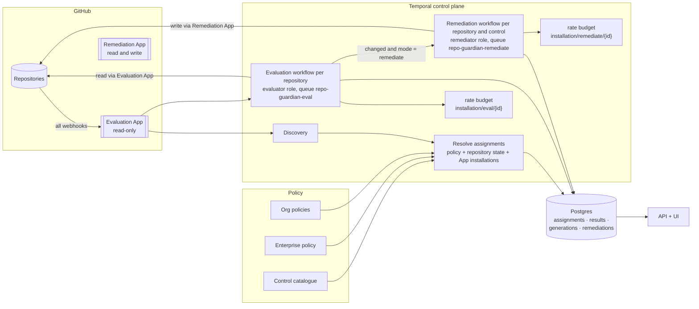
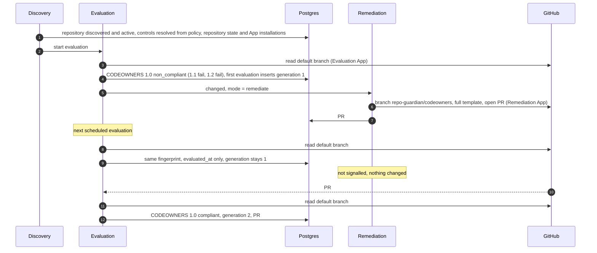

<!-- markdownlint-disable-file MD025 MD041 -->

# DESIGN-0029: Controls and policies: opinionated compliance with separate evaluation and remediation

<!--toc:start-->
- [Overview](#overview)
  - [Document set](#document-set)
- [Goals and Non-Goals](#goals-and-non-goals)
  - [Goals](#goals)
  - [Non-Goals](#non-goals)
- [Background](#background)
  - [Why the rule model conflicts](#why-the-rule-model-conflicts)
  - [Why now](#why-now)
- [Detailed Design](#detailed-design)
  - [Vocabulary](#vocabulary)
  - [Architecture](#architecture)
  - [Lifecycle of one repository](#lifecycle-of-one-repository)
  - [What happens to v1 concepts](#what-happens-to-v1-concepts)
  - [Assumptions about the current v2 code](#assumptions-about-the-current-v2-code)
  - [Risks](#risks)
- [API / Interface Changes](#api--interface-changes)
- [Data Model](#data-model)
- [Testing Strategy](#testing-strategy)
- [Migration / Rollout Plan](#migration--rollout-plan)
- [Decisions](#decisions)
- [Open Questions](#open-questions)
  - [OQ1: When does the controls model land relative to v2.0.0?](#oq1-when-does-the-controls-model-land-relative-to-v200)
  - [OQ2: Where does this work happen?](#oq2-where-does-this-work-happen)
<!--toc:end-->

## Overview

repo-guardian today is a generic rules engine. A rule is a file path, a template and some assertions, and many rules can point at the same file. Rules that share a file delete, overwrite or loop against each other, because the engine cannot know that "CODEOWNERS with a `.wiz` line" is one file with two requirements.

This design set replaces the rule model with an **opinionated controls model**, and splits **evaluation** from **remediation**:

- A **policy** says *who* and *what*: which orgs and repositories, and which controls apply to them.
- A **control** (for example `codeowners@1`, displayed as "CODEOWNERS 1.0") is the expected state of one resource, defined by its **control rules** ("1.1 a valid CODEOWNERS exists in the standard location", "1.2 `.wiz` is owned by security champions and appsec"). A control is implemented in Go by a package that understands its resource, so a control owns its resource outright.
- **Evaluation** is read-only and idempotent. It always runs against the default branch, and records which controls and control rules pass or fail. It is the default mode, so an enterprise can measure its posture before anything writes to a repository.
- **Remediation** is a separate, opt-in, write-capable workflow. It runs only when an evaluation *changed*, or when a remediation PR was edited or closed. It opens **one PR per control**, containing every fix that control needs.

The two halves run as two GitHub Apps (DESIGN-0032 D1): a read-only **Evaluation App** and a write-capable **Remediation App**. Each is installed per org with its own installation id, so each has its own rate budget (`installation/<app>/<installation id>`), its own Temporal task queue (`repo-guardian-eval`, `repo-guardian-remediate`) and its own worker role (`evaluator`, `remediator`). The two scale independently, and only the Evaluation App receives webhooks.

The original brief is kept verbatim in `notes/2026-10-02-controls-and-policies-brief.md`.

### Document set

| Doc | Covers | Open questions |
| --- | ------ | -------------- |
| **DESIGN-0029** (this) | Vocabulary, architecture, end-to-end lifecycle, assumptions about v2 code, cross-cutting decisions | 2 |
| **DESIGN-0030** | Policy model: enterprise and org policies, the control catalogue, resolving which controls apply to a repository, modes | 3 |
| **DESIGN-0031** | Control framework: the `Control` interface, control rules, results, file controls, the built-in control types | 2 |
| **DESIGN-0032** | Evaluation and remediation workflows: the two GitHub Apps, change detection, per-control PRs and their lifecycle, data model, Temporal mapping | 4 |

Each doc also carries a **Decisions** section: choices that were weighed and settled, with a one-line rationale, so the open questions are only the ones that need the maintainer.

## Goals and Non-Goals

### Goals

- **One owner per resource.** A control owns its resource (a file, a setting, a ruleset, a label, a property), so two parts of a policy can never fight over it. Every shared-file conflict in the v1 engine becomes impossible by construction rather than being patched case by case.
- **Opinionated control types.** Each resource kind gets a Go package that can find, read, parse, evaluate and fix it. The policy author picks controls and parameters, not paths and regexes.
- **Evaluation is the product; remediation is an add-on.** Posture is measured and stored on every evaluation, whether or not anything is ever fixed.
- **Least privilege by construction.** Evaluation never holds write credentials, and an org in evaluate mode never needs the write App installed.
- **Change-driven remediation.** No PR traffic unless something changed: the default branch, the evaluation result, or a human's edit to a remediation PR.
- **Explainable posture.** For every repository the database records which controls apply, which policy assigned each one, every control rule's result and evidence, and the remediation PR's state and age.
- **Compliance at every level.** Repository, org, enterprise, per control, and per policy source, from one consistent set of tables.

### Non-Goals

- **Compatibility with v1 policies.** The HCL schema is new, and there is no automatic translation (D1); a migration guide maps v1 rules to control types.
- **Keeping the v1 engine alive inside v2.** `internal/checker`'s rule evaluation, PR building, orphan cleanup and reconciler plumbing are expected to be removed (see the assumptions register).
- **Generic file merging.** A file that needs requirement-level checks gets a control type; the generic file control is one path rendered from one template.
- **Non-GitHub providers.** The control interface should not preclude them, but GitLab stays out of scope (INV-0007).

## Background

### Why the rule model conflicts

A v1 rule is `paths + target + template + assertions + scope`. Rules are independent, and nothing ties two rules on the same file together. v1 evaluates each rule in isolation against the files it names, so rules that target the same file have no shared view of the result: one rule's cleanup deleted a CODEOWNERS file another rule still required; two rules could write one file in turn, each sweep undoing the other; a rule's own fix could fail to satisfy it because `paths` (read) and `target` (write) are separate settings that can disagree; a removed rule's change stayed in the open PR because nobody owned the PR's contents; and a "must exist" / "must not exist" pair on the same path looped forever.

Every one of these is the same gap: the engine has no concept of a resource with an owner. The fix is structural — one owner per resource, and every check on a file inside one opinionated control — not another patch to the engine. The catalog-info rule has never had this problem, but only because one rule targets that file and a filled-in `catalog-info.yaml` is the norm.

### Why now

v2 is pre-release (`2.0.0-rc.N`) and already replaces v1's runtime with a Temporal control plane, a findings store, an API and a UI. It still runs v1's rule engine inside its check activity (IMPL-0025 Phase 4, "the parity suite is the swap guarantee"). The controls model is the piece that makes the rest of v2 coherent. It belongs before the v2 data model is frozen by a GA release (OQ1).

## Detailed Design

### Vocabulary

| Term | Meaning |
| ---- | ------- |
| **Enterprise** | The whole fleet repo-guardian manages: every org listed in the enterprise policy. |
| **Policy** | Who and what. The **enterprise policy** lists orgs and the baseline controls. An **org policy** adds, replaces or excludes controls, excludes repositories, and sets the mode for one org and its repositories (DESIGN-0030). There is no repository-level policy type; repository variation lives in an org policy's `repos` blocks (DESIGN-0030 OQ1). |
| **Control catalogue** | The set of control definitions that policies refer to by id and version, for example `codeowners@2` (DESIGN-0030). |
| **Control** | A named, versioned expected state of one resource, for example `codeowners@1`, displayed as "CODEOWNERS 1.0". It is an instance of a control type with parameters and rules. The version is an integer (D3). |
| **Control type** | The Go implementation behind a control: `codeowners`, `catalog_info`, `dependency_updates`, `file`, `repo_settings`, … (DESIGN-0031). One Go type serves every version of a control. |
| **Control rule** | One verifiable requirement inside a control, for example `CODEOWNERS 1.2: .wiz is owned by @org/security_champions and @org/application_security`. Its id is bare and unique within the control (`wiz-owners`), qualified as `codeowners@1/wiz-owners` only in logs and the UI (D2). |
| **Rule kind** | The typed check a control rule performs, implemented by the control type: `exists`, `owners`, `field_set`, … A rule names its kind and parameters (DESIGN-0031). |
| **Rule number** | The display numbering of a rule inside its control (`1.1`, `1.2`). Display only, and a separate axis from the control version. |
| **Remediable** | A control rule with `remediate = true`: its control type can produce a fix for it. A rule without it only reports. |
| **Resource** | What a control owns: one file (in all its locations), one setting, one ruleset, one label, one custom property. |
| **Assignment** | The resolved pairing of one repository with one control: the control version, the mode, the policy layer that decided it, and whether it is active or excluded (DESIGN-0030). |
| **Evaluation** | Running every assigned control's rules against a repository's default branch, read-only. |
| **Rule result** | `pass`, `fail`, `error` or `not_applicable`, with evidence. |
| **Control status** | Derived from its rule results: `compliant`, `non_compliant`, `unknown` or `not_applicable` (DESIGN-0031). |
| **Mode** | `evaluate` (the default) or `remediate`, resolved per repository and control from policy. An org without the Remediation App installed resolves to `evaluate` whatever its policy says (DESIGN-0030). |
| **Remediation** | Producing and proposing the change that makes a non-compliant control compliant, as a PR, or as a direct API change where a control allows it (DESIGN-0032). |
| **Fingerprint** | A hash of an evaluation's rule results and of the resources it read. An evaluation *changed* iff its fingerprint changed (DESIGN-0032). |
| **Eval generation** | A per-control counter bumped whenever the fingerprint changes; the first evaluation is generation 1. Remediation compares it with the generation it last acted on (DESIGN-0032). |

### Architecture

The key properties:

- **Two Apps, two of everything that scales.** Each App is installed per org with its own installation id, so each has its own `InstallationWorkflow` and rate budget (`installation/<app>/<installation id>`), its own task queue and its own worker role. Evaluation load never competes with remediation load for budget or workers (DESIGN-0032 D1).
- **Evaluation never holds the write App's key.** The remediator workers are the only processes with write credentials, which extends v2's role-based secret scoping (IMPL-0025 Phase 17).
- **Resolution reads stored state only.** Which controls apply to a repository is a function of the policy snapshot, the repository row (`active`, archived, fork) and each App's installation status for the org; it makes no API calls. A parked repository (archived, fork, removed, access denied) gets no assignments, and discovery stays the only un-parker, so archived repositories are never scanned (DESIGN-0030).
- **The database is the meeting point.** Evaluation writes facts, remediation reads them and records what it did, and the API reads both.
- **Remediation is triggered by change, not by schedule.** An evaluation that changed signals the remediation workflow. A periodic sweep exists only as a backstop (DESIGN-0032).

### Lifecycle of one repository

The other PR paths (a human edits the PR, closes it, or the default branch becomes compliant on its own) are specified in DESIGN-0032.

### What happens to v1 concepts

| v1 concept | Controls model |
| ---------- | -------------- |
| `rule "file"` with `exists` / `exact` | the generic `file` control type: one path, one template |
| `rule "file"` with `contains` + assertions | a dedicated control type (`codeowners`, `catalog_info`, `dependency_updates`, …), whose rules are typed checks |
| `check = "absent"` + `when` gates | absorbed into the control type that owns the opinion; for example `dependency_updates` owns both Renovate and Dependabot files |
| `rule "setting"` | the `repo_settings` control type, remediated through the API |
| `rule "branch_protection"` and the `branch_protection` reconciler | one `branch_ruleset` control type |
| `custom_properties` reconciler | a `custom_properties` control type reading catalog-info (DESIGN-0031 D4) |
| `label_sync` reconciler | a `labels` control type |
| `workflow_sync` reconciler | absorbed: its only job was feeding the push-watched path set. Every control declares its `Resources()`, and a push re-evaluates only the controls whose resources it touched (DESIGN-0032). No control type is needed. |
| global and per-rule `scope` / `ignore` | the enterprise org list, plus org-policy `exclude` and `exclude_repos` (DESIGN-0030) |
| `dry_run` | evaluate mode |
| single PR branch `repo-guardian/add-missing-files` | one branch and PR per control, `repo-guardian/<control slug>` (DESIGN-0032 D4) |
| `rule_state` / findings per rule | control and control-rule results per repository |

### Assumptions about the current v2 code

These shape the design and are **unverified**. A follow-up investigation checks each one against the `v2` branch and records whether to keep, adapt or remove the code. A wrong assumption changes the implementation plan, not the model.

| # | Assumption | If wrong |
| - | ---------- | -------- |
| A1 | The `RepoWorkflow` pattern (one long-running workflow per repository, timer plus `recheck` / `policy_changed` / `park` signals, coalescing, ContinueAsNew) can host the evaluation loop with a new activity. | Evaluation needs a new workflow type; the signal and coalescing design is copied rather than reused. |
| A2 | `InstallationWorkflow` and its budget state are keyed by installation id alone (`installation/<id>`). The design adds an app dimension: the workflow id becomes `installation/<app>/<installation id>` and the state records which App it meters, so each App's installations get their own budget. | The key already carries an app dimension and the change is smaller. |
| A3 | `DiscoveryWorkflow`, `UpsertDiscovered` (the only un-parker) and the subset invariant carry over unchanged, and policy resolution can run as a step after upsert. | Discovery needs reshaping; resolution may need its own workflow. |
| A4 | The `repositories` table and its identity matching (provider id first, rename and transfer events) are reusable as-is. | The identity work of IMPL-0025 Phase 5 is redone. |
| A5 | `findings`, `finding_events` and `compliance_snapshots` are keyed by `(rule_kind, rule_name)`, with a `rule_kind` CHECK of `file`/`setting`/`branch_protection`. They are replaced by control and control-rule tables, not extended. | A migration path that keeps findings rows is needed. |
| A6 | The `checks` table with its idempotent `check_key` and staging contract can become the evaluation log. | A new log table is needed (cheap). |
| A7 | `policy_versions`, `VersionV2` hashing and `PolicyRolloutWorkflow` (spread re-checks over a window) can be pointed at the catalogue plus policies. | Rollout is rebuilt; the window idea is kept. |
| A8 | `internal/checker`'s rule evaluation, PR assembly, drift and orphan handling, reconcile log and the parity suite are removed, not adapted. | Some engine code survives and constrains the control interface. |
| A9 | `internal/policy`'s HCL loader is replaced. Small pieces survive: hclparse usage, glob matching, PR template compilation, strict decode. | More of the loader is reusable than expected (good). |
| A10 | `internal/template` (renderer, helpers, `ValidateZero`) is reused for control templates and PR text. | Control types need their own rendering. |
| A11 | `internal/catalog` (the Backstage parser) is the core of the `catalog_info` control type. | The parser is rewritten. |
| A12 | The GitHub client layer survives: the transport chain (otelhttp → rate limit → ghinstallation), `AsThrottled`, `WithUsage` and deferral. The `Client` interface splits into a read interface and a write interface. | The split needs a wrapper rather than an interface change. |
| A13 | The `ingest` role and `WebhookWorkflow` survive; the event table gains `pull_request` events for remediation branches. | Ingest is reshaped. |
| A14 | The API's structure (OpenAPI-first, `apitest`, the scope predicate on every query, the read-only pool) survives with new resources. The UI keeps its shell, auth and status page, with new views. | API and UI work is larger. |
| A15 | Roles and chart secret scoping (`roleHasAppKey` and friends) extend to an evaluator / remediator split. | Chart roles are redesigned. |
| A16 | v2 has no production Temporal histories that must replay, so new workflow types and changed command order need no `GetVersion` gates before GA (the one existing gate, `budget-v1` in `RepoWorkflow`, guards histories that only the homelab holds). Homelab namespaces can be reset. | Version gates or a migration workflow are needed. |
| A17 | v1 and v2 currently adopt each other's PRs through frozen identity (`TestPRIdentity_IsFrozen`). Per-control branches end that, so cutover closes v1's PRs instead, and that test's literals are retired deliberately at cutover (DESIGN-0032 D4). | A transitional adopter is needed. |
| A18 | `TaskPriority` (priority plus fairness by installation) applies unchanged to evaluation and remediation activities. | Priorities need rework. |
| A19 | The posture export and dashboards (IMPL-0023) can be regenerated from control results with the same leader-only, `max by` patterns. | Monitoring generation is rewritten. |
| A20 | `internal/shadow` (verify-shadow) and the v1 backfill are not carried into the controls model; cutover starts from a fresh evaluation. | A v1 → controls mapping is needed. |
| A21 | GitHub reads CODEOWNERS from `.github/`, then the repository root, then `docs/`, and uses the first it finds. | The `codeowners` type's location precedence changes; nothing else does. |
| A22 | GitHub's REST endpoint listing CODEOWNERS errors is readable with the Evaluation App's read permissions. | The `valid` rule kind (DESIGN-0031 D3) passes on parser evidence alone for that installation. |
| A23 | The Evaluation App's read-only permission set (Contents, Metadata, Administration:read, Custom properties:read, Pull requests:read, Issues:read) covers every read the built-in control types need, including rulesets, settings and labels. | The Evaluation App needs more permissions, or some control types move reads to the Remediation App. |

### Risks

- **Code volume.** Removal is large (the rule engine, reconcilers, parity suite). Each control type also adds a package with a parser, rules, templates and tests. This is a trade of generic code for specific code, and the net size is unknown until the follow-up investigation.
- **PR volume.** One PR per control means onboarding a repository can open several PRs at once (DESIGN-0032 OQ2).
- **Two Apps to operate.** Two installations per org and two keys, though one webhook configuration (only the Evaluation App receives webhooks). Accepted for least privilege, separate budgets and independent scaling (DESIGN-0032 D1).
- **Schema churn during the rc line.** rc users (the homelab) re-evaluate from scratch.

## API / Interface Changes

Summarised here; specified in the per-area docs.

- **Policy files:** new HCL for the catalogue, the enterprise policy and org policies (DESIGN-0030).
- **Go:** `control.Control` and the control-type registry; `github.Reader` / `github.Writer` (DESIGN-0031).
- **Roles:** `evaluator` and `remediator` worker roles, each on its own task queue (`repo-guardian-eval`, `repo-guardian-remediate`) and holding only its own App's key (DESIGN-0032 D2).
- **Env:** `EVAL_INTERVAL` replaces `CHECK_INTERVAL`. Both Apps' credentials are mounted as files, scoped per role.
- **API:** new resources for controls, policies, `/repositories/{id}/controls` (assignments with provenance and the latest result) and remediations, replacing `/rules` and `/findings` (DESIGN-0032).
- **Chart:** credentials for both Apps, scoped per role (the evaluator never mounts the Remediation App key); `EVAL_INTERVAL` in place of `CHECK_INTERVAL`; the mode per org comes from policy rather than chart values.

## Data Model

Owned by the per-area docs:

- assignments and per-repository policy state (managed, excluded, unmanaged, parked): DESIGN-0030;
- results, events, generations, remediations: DESIGN-0032.

`repositories` and `installations` stay; `installations` gains an `app` column so each org has one row per App.

## Testing Strategy

- **Control types** are tested in isolation against repository state fixtures. Three properties are required for every control type (DESIGN-0031):
  - remediating then re-evaluating passes every remediable rule;
  - remediating twice changes nothing;
  - the default template passes every rule with `remediate = true`.

  With one owner per resource there is no rule-overlap matrix to test; two controls claiming one resource is rejected by the policy validator instead (DESIGN-0030).
- **Policy resolution** is table-tested (DESIGN-0030).
- **Workflows** are tested in the time-skipping environment, with replay histories captured for the new workflow types (DESIGN-0032).
- **End to end:** the e2e stack (Postgres, API, BFF) gains seeded control results. A Temporal plus GitHub-fake integration test drives onboarding → PR → merge → compliant.

## Migration / Rollout Plan

1. **Accept DESIGN-0029 to DESIGN-0032**, then run the follow-up investigation on assumptions A1–A23.
2. **IMPL plan**, roughly in this order:
   - the control interface and the `codeowners` type;
   - policy resolution and assignments;
   - the evaluation workflow, the results tables and API reads;
   - the UI views;
   - the remediation workflow and the second App;
   - the remaining control types;
   - removing the rule engine.
3. **Evaluate-only first.** The first rc with controls ships evaluation alone. Remediation follows, so posture numbers can be compared against v1 before anything writes.
4. **v1** keeps its rule engine, with bug fixes only, until cutover. Cutover closes v1's open PRs (A17).

## Decisions

- **D1 No v1 policy translation** — there is no automatic translation; a migration guide maps v1 rules to control types. The models differ in kind (paths and regexes versus typed rules), so a mechanical translation would produce generic `file` controls and miss the point, and the known fleet policies are small.
- **D2 Identifiers** — a control's id is a stable slug (`codeowners`); rule ids are bare and unique within the control (`exists`, `wiz-owners`), stored under `(repository_id, control_id, rule_id)` and qualified as `codeowners@1/exists` only in logs and the UI; rule numbers (`1.1`, `1.2`) are display only. Slugs survive renumbering and keep database keys and URLs stable; the control is the namespace, so rule ids stay short in HCL.
- **D3 Versions** — a control's version is an integer in the catalogue (`version = 2`), referenced exactly as `codeowners@2`. A bump is catalogue data served by the same Go type, an org trials `@2` through `replace` (DESIGN-0030), and `result_events` records the version each result came from. "Did the rules change" needs no semantic-version semantics.

## Open Questions

### OQ1: When does the controls model land relative to v2.0.0?

- (a) ✅ recommended: **before v2.0.0, replacing the rule engine on the v2 line.** v2 is pre-release, its data model is not frozen, and shipping v2.0.0 with rule-keyed findings would mean migrating a GA schema later. The rc line absorbs the churn.
- (b) After v2.0.0, as v3. v2.0.0 ships sooner on the current engine, but users get two breaking migrations in a row, and the shared-file conflicts ship in GA.
- (c) On v2.0.0 behind a flag, with both engines. It doubles the surface the team must test, for a pre-release product.
- other:

### OQ2: Where does this work happen?

- (a) ✅ recommended: **on the `v2` branch, phase by phase like IMPL-0025.** `main` (v1) gets bug fixes only. The `internal/checker` divergence between branches is accepted, because v1 stops receiving engine features.
- (b) A new long-lived `v2-controls` branch merged into `v2` when evaluation works end to end. It isolates churn from the v2 rc line, at the cost of a second integration branch to keep current.
- other:
