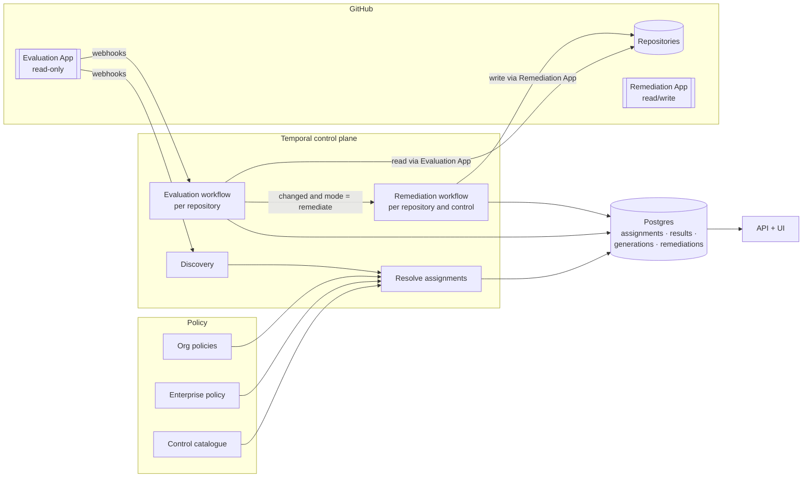
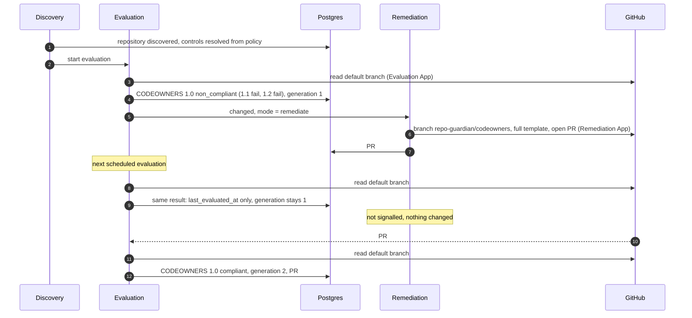

<!-- markdownlint-disable-file MD025 MD041 -->

# DESIGN-0029: Controls and policies: opinionated compliance with separate evaluation and remediation

<!--toc:start-->
- [Overview](#overview)
  - [Document set](#document-set)
- [Goals and Non-Goals](#goals-and-non-goals)
  - [Goals](#goals)
  - [Non-Goals](#non-goals)
- [Background](#background)
  - [Why the rule model conflicts](#why-the-rule-model-conflicts)
  - [Why now](#why-now)
- [Detailed Design](#detailed-design)
  - [Vocabulary](#vocabulary)
  - [Architecture](#architecture)
  - [Lifecycle of one repository](#lifecycle-of-one-repository)
  - [What happens to v1 concepts](#what-happens-to-v1-concepts)
  - [Assumptions about the current v2 code](#assumptions-about-the-current-v2-code)
  - [Risks](#risks)
- [API / Interface Changes](#api--interface-changes)
- [Data Model](#data-model)
- [Testing Strategy](#testing-strategy)
- [Migration / Rollout Plan](#migration--rollout-plan)
- [Open Questions](#open-questions)
  - [OQ1: When does the controls model land relative to v2.0.0?](#oq1-when-does-the-controls-model-land-relative-to-v200)
  - [OQ2: Where does this work happen?](#oq2-where-does-this-work-happen)
  - [OQ3: Do v1 policies get a translation helper?](#oq3-do-v1-policies-get-a-translation-helper)
  - [OQ4: What is the control identifier scheme?](#oq4-what-is-the-control-identifier-scheme)
  - [OQ5: Is a control version a semantic version that a policy pins?](#oq5-is-a-control-version-a-semantic-version-that-a-policy-pins)
<!--toc:end-->

## Overview

repo-guardian today is a generic rules engine. A rule is a file path, a template and some assertions, and many rules can point at the same file. INV-0021 showed where that leads: rules that share a file delete, overwrite or loop against each other, because the engine cannot know that "CODEOWNERS with a `.wiz` line" is one file with two requirements.

This design set replaces the rule model with an **opinionated controls model**, and splits **evaluation** from **remediation**:

- A **policy** says *who* and *what*: which orgs and repositories, and which controls apply to them.
- A **control** (for example "CODEOWNERS 1.0") is the expected state of one resource, defined by its **control rules** ("1.1 a valid CODEOWNERS exists in the standard location", "1.2 `.wiz` is owned by security champions and appsec"). A control is implemented in Go by a package that understands its resource, so a control owns its resource outright.
- **Evaluation** is read-only and idempotent. It always runs against the default branch, and records which controls and control rules pass or fail. It is the default mode, so an enterprise can measure its posture before anything writes to a repository.
- **Remediation** is a separate, opt-in, write-capable workflow. It runs only when an evaluation *changed*, or when a remediation PR was edited or closed. It opens **one PR per control**, containing every fix that control needs.

The two halves run as separate GitHub Apps: a read-only evaluation App and a write-capable remediation App.

The original brief is kept verbatim in `notes/2026-10-02-controls-and-policies-brief.md`.

### Document set

| Doc | Covers |
| --- | ------ |
| **DESIGN-0029** (this) | Vocabulary, architecture, end-to-end lifecycle, assumptions about v2 code, cross-cutting decisions |
| **DESIGN-0030** | Policy model: enterprise and org policies, the control catalogue, resolving which controls apply to a repository, modes |
| **DESIGN-0031** | Control framework: the `Control` interface, control rules, results, file controls, the built-in control types |
| **DESIGN-0032** | Evaluation and remediation workflows: the two GitHub Apps, change detection, per-control PRs and their lifecycle, data model, Temporal mapping |

## Goals and Non-Goals

### Goals

- **One owner per resource.** A control owns its resource (a file, a setting, a ruleset), so two parts of a policy can never fight over it. This removes INV-0021 R1–R5 by construction.
- **Opinionated control types.** Each resource kind gets a Go package that can find, read, parse, evaluate and fix it. The policy author picks controls and parameters, not paths and regexes.
- **Evaluation is the product; remediation is an add-on.** Posture is measured and stored on every evaluation, whether or not anything is ever fixed.
- **Least privilege by construction.** Evaluation never holds write credentials, and an org in evaluate mode never needs the write App installed.
- **Change-driven remediation.** No PR traffic unless something changed: the default branch, the evaluation result, or a human's edit to a remediation PR.
- **Explainable posture.** For every repository the database records which controls apply, which policy assigned each one, every control rule's result and evidence, and the remediation PR's state and age.
- **Compliance at every level.** Repository, org, enterprise, per control, and per policy source, from one consistent set of tables.

### Non-Goals

- **Compatibility with v1 policies.** The HCL schema is new. A one-shot translation helper is an open question (OQ3), not a goal.
- **Keeping the v1 engine alive inside v2.** `internal/checker`'s rule evaluation, PR building, orphan cleanup and reconciler plumbing are expected to be removed (see the assumptions register).
- **Generic file merging.** A file that needs requirement-level checks gets a control type; the generic file control is one path rendered from one template.
- **Non-GitHub providers.** The control interface should not preclude them, but GitLab stays out of scope (INV-0007).

## Background

### Why the rule model conflicts

A v1 rule is `paths + target + template + assertions + scope`. Rules are independent, and nothing ties two rules on the same file together. INV-0021 lists the consequences:

| INV-0021 | Failure | Root cause in the rule model |
| -------- | ------- | ---------------------------- |
| R1 | Orphan cleanup deletes a file another rule just wrote | ownership decided per rule name |
| R2 | Add and remove PRs alternate forever | two rules express one opinion ("Renovate, not Dependabot") |
| R3 | Two templates overwrite each other every sweep | two rules write one file |
| R4 | A rule's own fix never satisfies it | `paths` (read) and `target` (write) are separate settings that can disagree |
| R5 | A removed rule's change stays in the open PR | ownership of the PR's contents is not recorded |

Every row is a symptom of the same gap: the engine has no concept of a resource with an owner. The catalog-info rule has never had this problem, but only because one rule targets that file and a filled-in `catalog-info.yaml` is the norm.

### Why now

v2 is pre-release (`2.0.0-rc.N`) and already replaces v1's runtime with a Temporal control plane, a findings store, an API and a UI. It still runs v1's rule engine inside its check activity (IMPL-0025 Phase 4, "the parity suite is the swap guarantee"). The controls model is the piece that makes the rest of v2 coherent. It belongs before the v2 data model is frozen by a GA release (OQ1).

## Detailed Design

### Vocabulary

| Term | Meaning |
| ---- | ------- |
| **Enterprise** | The whole fleet repo-guardian manages: every org listed in the enterprise policy. |
| **Policy** | Who and what. The **enterprise policy** lists orgs and the baseline controls. An **org policy** adds, excludes or scopes controls for one org and its repositories (DESIGN-0030). |
| **Control catalogue** | The set of control definitions that policies refer to by ID (DESIGN-0030). |
| **Control** | A named, versioned expected state of one resource, for example `CODEOWNERS 1.0`. It is an instance of a control type with parameters and rules. |
| **Control type** | The Go implementation behind a control: `codeowners`, `catalog_info`, `dependency_updates`, `file`, `repo_settings`, … (DESIGN-0031). |
| **Control rule** | One verifiable requirement inside a control, for example `CODEOWNERS 1.2: .wiz is owned by @org/security_champions and @org/application_security`. Each rule may declare a remediation. |
| **Resource** | What a control owns: one file (in all its locations), one setting, one ruleset. |
| **Evaluation** | Running every assigned control's rules against a repository's default branch, read-only. |
| **Rule result** | `pass`, `fail`, `error` or `not_applicable`, with evidence. |
| **Control status** | Derived from its rule results: `compliant`, `non_compliant`, `unknown` or `not_applicable` (DESIGN-0031). |
| **Mode** | `evaluate` (the default) or `remediate`, resolved per repository and control from policy (DESIGN-0030). |
| **Remediation** | Producing and proposing the change that makes a non-compliant control compliant, as a PR, or as a direct API change where a control allows it (DESIGN-0032). |
| **Eval generation** | A per-control counter bumped whenever an evaluation result changes. Remediation compares it with the generation it last acted on (DESIGN-0032). |

### Architecture

The key properties:

- **Evaluation never holds the write App's key.** The remediation workers are the only processes with write credentials, which extends v2's role-based secret scoping (IMPL-0025 Phase 17).
- **The database is the meeting point.** Evaluation writes facts, remediation reads them and records what it did, and the API reads both.
- **Remediation is triggered by change, not by schedule.** An evaluation that changed signals the remediation workflow. A periodic sweep exists only as a backstop (DESIGN-0032).

### Lifecycle of one repository

The other PR paths (a human edits the PR, closes it, or the default branch becomes compliant on its own) are specified in DESIGN-0032.

### What happens to v1 concepts

| v1 concept | Controls model |
| ---------- | -------------- |
| `rule "file"` with `exists` / `exact` | the generic `file` control type: one path, one template |
| `rule "file"` with `contains` + assertions | a dedicated control type (`codeowners`, `catalog_info`, `dependency_updates`, …), whose rules are typed checks |
| `check = "absent"` + `when` gates | absorbed into the control type that owns the opinion; for example `dependency_updates` owns both Renovate and Dependabot files |
| `rule "setting"` | the `repo_settings` control type, remediated through the API |
| `rule "branch_protection"` and the `branch_protection` reconciler | one `branch_ruleset` control type |
| `custom_properties` reconciler | a `custom_properties` control type reading catalog-info (DESIGN-0031 OQ6) |
| `label_sync` reconciler | a `labels` control type |
| `workflow_sync` reconciler | the generic `file` control, or a `workflows` control type later |
| global and per-rule `scope` / `ignore` | the enterprise org list, plus org-policy excludes (DESIGN-0030) |
| `dry_run` | evaluate mode |
| single PR branch `repo-guardian/add-missing-files` | one branch and PR per control |
| `rule_state` / findings per rule | control and control-rule results per repository |

### Assumptions about the current v2 code

These shape the design and are **unverified**. A follow-up investigation checks each one against the `v2` branch and records whether to keep, adapt or remove the code. A wrong assumption changes the implementation plan, not the model.

| # | Assumption | If wrong |
| - | ---------- | -------- |
| A1 | The `RepoWorkflow` pattern (one long-running workflow per repository, timer plus `recheck` / `policy_changed` / `park` signals, coalescing, ContinueAsNew) can host the evaluation loop with a new activity. | Evaluation needs a new workflow type; the signal and coalescing design is copied rather than reused. |
| A2 | `InstallationWorkflow`'s rate budget is keyed by installation id, so two Apps (whose installations have different ids) get separate budgets without changes. | The budget needs an explicit app dimension. |
| A3 | `DiscoveryWorkflow`, `UpsertDiscovered` (the only un-parker) and the subset invariant carry over unchanged, and policy resolution can run as a step after upsert. | Discovery needs reshaping; resolution may need its own workflow. |
| A4 | The `repositories` table and its identity matching (provider id first, rename and transfer events) are reusable as-is. | The identity work of IMPL-0025 Phase 5 is redone. |
| A5 | `findings`, `finding_events` and `compliance_snapshots` are keyed by `(rule_kind, rule_name)`, with a `rule_kind` CHECK of `file`/`setting`/`branch_protection`. They are replaced by control and control-rule tables, not extended. | A migration path that keeps findings rows is needed. |
| A6 | The `checks` table with its idempotent `check_key` and staging contract can become the evaluation log. | A new log table is needed (cheap). |
| A7 | `policy_versions`, `VersionV2` hashing and `PolicyRolloutWorkflow` (spread re-checks over a window) can be pointed at the catalogue plus policies. | Rollout is rebuilt; the window idea is kept. |
| A8 | `internal/checker`'s rule evaluation, PR assembly, drift and orphan handling, reconcile log and the parity suite are removed, not adapted. | Some engine code survives and constrains the control interface. |
| A9 | `internal/policy`'s HCL loader is replaced. Small pieces survive: hclparse usage, glob matching, PR template compilation, strict decode. | More of the loader is reusable than expected (good). |
| A10 | `internal/template` (renderer, helpers, `ValidateZero`) is reused for control templates and PR text. | Control types need their own rendering. |
| A11 | `internal/catalog` (the Backstage parser) is the core of the `catalog_info` control type. | The parser is rewritten. |
| A12 | The GitHub client layer survives: the transport chain (otelhttp → rate limit → ghinstallation), `AsThrottled`, `WithUsage` and deferral. The `Client` interface splits into a read interface and a write interface. | The split needs a wrapper rather than an interface change. |
| A13 | The `ingest` role and `WebhookWorkflow` survive; the event table gains `pull_request` events for remediation branches. | Ingest is reshaped. |
| A14 | The API's structure (OpenAPI-first, `apitest`, the scope predicate on every query, the read-only pool) survives with new resources. The UI keeps its shell, auth and status page, with new views. | API and UI work is larger. |
| A15 | Roles and chart secret scoping (`roleHasAppKey` and friends) extend to an evaluator / remediator split. | Chart roles are redesigned. |
| A16 | v2 has no production Temporal histories that must replay, so new workflow types and changed command order need no `GetVersion` gates before GA. Homelab namespaces can be reset. | Version gates or a migration workflow are needed. |
| A17 | v1 and v2 currently adopt each other's PRs through frozen identity (`TestPRIdentity_IsFrozen`). Per-control branches end that, so cutover closes v1's PRs instead (DESIGN-0032 OQ6). | A transitional adopter is needed. |
| A18 | `TaskPriority` (priority plus fairness by installation) applies unchanged to evaluation and remediation activities. | Priorities need rework. |
| A19 | The posture export and dashboards (IMPL-0023) can be regenerated from control results with the same leader-only, `max by` patterns. | Monitoring generation is rewritten. |
| A20 | `internal/shadow` (verify-shadow) and the v1 backfill are not carried into the controls model; cutover starts from a fresh evaluation. | A v1 → controls mapping is needed. |
| A21 | GitHub reads CODEOWNERS from `.github/`, then the repository root, then `docs/`, and uses the first it finds. | The `codeowners` type's location precedence changes; nothing else does. |
| A22 | GitHub's REST endpoint listing CODEOWNERS errors is readable with the evaluation App's read permissions. | The `valid` rule kind (DESIGN-0031 OQ4) falls back to parse-only validation. |
| A23 | The evaluation App's read-only permission set (Metadata, Contents, Pull requests, Administration, Custom properties: read) covers every read the built-in control types need, including rulesets and settings. | The evaluation App needs more permissions, or some control types move reads to the remediation App. |

### Risks

- **Code volume.** Removal is large (the rule engine, reconcilers, parity suite). Each control type also adds a package with a parser, rules, templates and tests. This is a trade of generic code for specific code, and the net size is unknown until the follow-up investigation.
- **PR volume.** One PR per control means onboarding a repository can open several PRs at once (DESIGN-0032 OQ5).
- **Two Apps to operate.** Two installations per org, two keys, two webhook configurations (DESIGN-0032 OQ1).
- **Schema churn during the rc line.** rc users (the homelab) re-evaluate from scratch.

## API / Interface Changes

Summarised here; specified in the per-area docs.

- **Policy files:** new HCL for the catalogue, the enterprise policy and org policies (DESIGN-0030).
- **Go:** `control.Control` and the control-type registry; `github.Reader` / `github.Writer` (DESIGN-0031).
- **Roles:** `evaluator` and `remediator` worker roles, or one worker role whose activities are scoped by App credentials (DESIGN-0032 OQ2).
- **API:** new resources for controls, policies, per-repository control results and remediations, replacing `/rules` and `/findings` (DESIGN-0032).
- **Chart:** a second App's credentials, and a mode setting per org through policy rather than chart values.

## Data Model

Owned by the per-area docs:

- assignments: DESIGN-0030;
- results, events, generations, remediations: DESIGN-0032.

`repositories` and `installations` stay; `installations` gains an `app` column.

## Testing Strategy

- **Control types** are tested in isolation against repository state fixtures. Two properties are required for every control type (DESIGN-0031):
  - remediating then re-evaluating passes every fixable rule;
  - remediating twice changes nothing.

  These replace INV-0021's I1–I6 overlap matrix: with one owner per resource, the overlap space does not exist.
- **Policy resolution** is table-tested (DESIGN-0030).
- **Workflows** are tested in the time-skipping environment, with replay histories captured for the new workflow types (DESIGN-0032).
- **End to end:** the e2e stack (Postgres, API, BFF) gains seeded control results. A Temporal plus GitHub-fake integration test drives onboarding → PR → merge → compliant.

## Migration / Rollout Plan

1. **Accept DESIGN-0029 to DESIGN-0032**, then run the follow-up investigation on assumptions A1–A23.
2. **IMPL plan**, roughly in this order:
   - the control interface and the `codeowners` type;
   - policy resolution and assignments;
   - the evaluation workflow, the results tables and API reads;
   - the UI views;
   - the remediation workflow and the second App;
   - the remaining control types;
   - removing the rule engine.
3. **Evaluate-only first.** The first rc with controls ships evaluation alone. Remediation follows, so posture numbers can be compared against v1 before anything writes.
4. **v1** keeps its rule engine, plus the INV-0021 R1 fix, until cutover. Cutover closes v1's open PRs (A17).

## Open Questions

### OQ1: When does the controls model land relative to v2.0.0?

- (a) ✅ recommended: **before v2.0.0, replacing the rule engine on the v2 line.** v2 is pre-release, its data model is not frozen, and shipping v2.0.0 with rule-keyed findings would mean migrating a GA schema later. The rc line absorbs the churn.
- (b) After v2.0.0, as v3. v2.0.0 ships sooner on the current engine, but users get two breaking migrations in a row, and the INV-0021 conflicts ship in GA.
- (c) On v2.0.0 behind a flag, with both engines. It doubles the surface the team must test, for a pre-release product.
- other:

### OQ2: Where does this work happen?

- (a) ✅ recommended: **on the `v2` branch, phase by phase like IMPL-0025.** `main` (v1) gets only the INV-0021 fixes. The `internal/checker` divergence between branches is accepted, because v1 stops receiving engine features.
- (b) A new long-lived `v2-controls` branch merged into `v2` when evaluation works end to end. It isolates churn from the v2 rc line, at the cost of a second integration branch to keep current.
- other:

### OQ3: Do v1 policies get a translation helper?

- (a) ✅ recommended: **no automatic translation; a migration guide mapping v1 rules to control types.** The models differ in kind (paths and regexes versus typed rules), so a mechanical translation would produce generic `file` controls and miss the point. The known fleet policies are small.
- (b) A `repo-guardian policy translate` command for the mappable subset (`exists`/`exact` rules → `file` controls, known rule names → control types), with everything else reported as manual.
- other:

### OQ4: What is the control identifier scheme?

- (a) ✅ recommended: **a stable slug for storage plus a display number.** The control id is `codeowners` with `version = "1.0"`; rule ids are `codeowners.exists` and `codeowners.wiz-owners`, displayed as `CODEOWNERS 1.1` and `1.2`. Slugs survive renumbering and keep database keys and URLs stable; display numbers give you the catalogue-style numbering.
- (b) The display numbers are the identifiers (`CODEOWNERS-1.2`). Simpler, but inserting a rule between 1.1 and 1.2, or renumbering, rewrites history keys.
- (c) Opaque generated ids plus display names. Maximally stable, but unreadable in logs, URLs and policy files.
- other:

### OQ5: Is a control version a semantic version that a policy pins?

- (a) ✅ recommended: **yes, informally.** A policy references `codeowners@1`, and changing a control's rules in a way that changes results bumps the version. An org can trial `codeowners@2` while the enterprise stays on `@1` (DESIGN-0030 replacement). History records the version each result came from.
- (b) No versions; a control is whatever the catalogue says today. Simpler, but there is no way to trial a stricter control on one org without forking its name.
- other:
