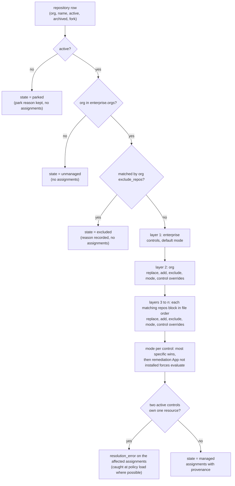

<!-- markdownlint-disable-file MD025 MD041 -->

# DESIGN-0030: Policy model: enterprise and org policies and control assignment

<!--toc:start-->
- [Overview](#overview)
- [Goals and Non-Goals](#goals-and-non-goals)
  - [Goals](#goals)
  - [Non-Goals](#non-goals)
- [Background](#background)
- [Detailed Design](#detailed-design)
  - [Files](#files)
  - [The control catalogue](#the-control-catalogue)
  - [The enterprise policy](#the-enterprise-policy)
  - [Org policies](#org-policies)
  - [Resolution](#resolution)
  - [Resource ownership](#resource-ownership)
  - [Modes](#modes)
  - [When resolution runs](#when-resolution-runs)
  - [Validation at load](#validation-at-load)
  - [Compliance queries](#compliance-queries)
- [API / Interface Changes](#api--interface-changes)
- [Data Model](#data-model)
- [Testing Strategy](#testing-strategy)
- [Migration / Rollout Plan](#migration--rollout-plan)
- [Decisions](#decisions)
- [Adversarial Review](#adversarial-review)
  - [AR-0030-01 (high): Pairwise enumeration is neither a proof nor a complete error model](#ar-0030-01-high-pairwise-enumeration-is-neither-a-proof-nor-a-complete-error-model)
  - [AR-0030-02 (high): Resource identity needs canonicalization and write-boundary enforcement](#ar-0030-02-high-resource-identity-needs-canonicalization-and-write-boundary-enforcement)
  - [AR-0030-03 (high): Assignment changes need revision fences around results and writes](#ar-0030-03-high-assignment-changes-need-revision-fences-around-results-and-writes)
  - [AR-0030-04 (high): Org installation presence is not repository authorization](#ar-0030-04-high-org-installation-presence-is-not-repository-authorization)
  - [AR-0030-05 (high): Compliance must expose unevaluated assignments and measurement loss](#ar-0030-05-high-compliance-must-expose-unevaluated-assignments-and-measurement-loss)
  - [AR-0030-06 (high): Final-layer provenance cannot answer baseline compliance reliably](#ar-0030-06-high-final-layer-provenance-cannot-answer-baseline-compliance-reliably)
  - [AR-0030-07 (medium): Overlapping modes and replacements need an executable precedence contract](#ar-0030-07-medium-overlapping-modes-and-replacements-need-an-executable-precedence-contract)
- [Open Questions](#open-questions)
  - [OQ1: Is there a separate repository policy type?](#oq1-is-there-a-separate-repository-policy-type)
  - [OQ2: Can an org policy change a control's parameters (e.g. different owner teams)?](#oq2-can-an-org-policy-change-a-controls-parameters-eg-different-owner-teams)
  - [OQ3: At what granularity is the mode set?](#oq3-at-what-granularity-is-the-mode-set)
<!--toc:end-->

## Overview

A policy is the *who* and the *what*: which orgs and repositories, and which controls apply to them. This document defines:

- the **control catalogue**, where controls are defined once;
- the **enterprise policy**, the baseline for every listed org;
- **org policies**, which add, replace or exclude controls for one org or for specific repositories in it, and set the mode;
- **resolution**, the deterministic function that turns those, together with the repository's stored state and the two Apps' installation status, into a repository's **assignments**: the controls that apply, the policy each came from, and the mode (`evaluate` or `remediate`);
- how assignments are stored and queried for compliance at repository, org, enterprise and policy level.

Vocabulary and the overall architecture are in DESIGN-0029. What a control *is* in code is in DESIGN-0031. How assignments drive evaluation and remediation is in DESIGN-0032.

## Goals and Non-Goals

### Goals

- **One baseline, local variation.** The enterprise policy says what applies everywhere. Org policies are only needed for differences.
- **Trial a control on one org.** An org policy can enable a new control, or a new version of one, without touching the enterprise policy.
- **Exclusions are explicit and explained.** Every exclusion names its scope and a reason, and is visible per repository in the UI.
- **Every assignment has provenance.** For each repository and control, the database records which policy assigned it, which excluded it, and why.
- **Deterministic resolution with no API calls.** The same policy snapshot, the same repository row and the same installation status always give the same assignments. Resolution reads stored state only, so it is table-testable.
- **One owner per resource holds per repository.** Resolution never assigns two active controls that own the same resource — the "one owner per resource" goal of DESIGN-0029.

### Non-Goals

- **A policy language with arbitrary conditions.** Selection is by org and repository name (with globs). Selection by repository facts is a later addition (D4). It is not a general expression language.
- **Per-team or per-topic policies.** These could come later through repository facts.
- **Editing policy through the UI.** Policies are files under version control. The UI is read-only (DESIGN-0027 stance).

## Background

v1 and v2 today use one policy file:

- a top-level `scope { orgs }` that engages strict mode;
- per-rule `scope` and `ignore` blocks;
- global `ignore { repos }` globs.

Every rule must restate its scope, and an exception for one org means editing a shared file. That creates three problems:

- there is no way to trial a rule on one org without scoping tricks;
- nothing records *why* a rule does not apply to a repository;
- "how compliant is org X with the enterprise baseline" is not a question the data can answer.

A fourth problem is structural rather than about scoping: rules are evaluated in isolation, so two rules that name the same file have no shared view of the result and can undo each other. The policy model's answer is resource ownership (below); the control model's answer is in DESIGN-0031.

## Detailed Design

### Files

```text
policy/
  catalogue/
    codeowners.hcl        # control definitions, any number of files
    catalog_info.hcl
    dependency_updates.hcl
  enterprise.hcl          # exactly one
  orgs/
    donaldgifford.hcl     # zero or one per org
    test-org.hcl
```

The directory is mounted the way `GUARDIAN_CONFIG` is today (a ConfigMap from chart values or an existing ConfigMap) (D3). Everything in it is loaded, validated and hashed together into one **policy version**, so every repository is resolved against a consistent snapshot.

### The control catalogue

A control is defined once and referenced by `name@version`, where the version is an integer and the reference matches exactly (DESIGN-0029 D2 and D3):

```hcl
control "codeowners" {
  version = 2
  title   = "CODEOWNERS"
  type    = "codeowners"              # the Go control type (DESIGN-0031)

  rule "exists" {
    number = "1.1"
    title  = "A CODEOWNERS file exists in a standard location"
    remediate = true                  # this rule is remediable
  }

  # Ownership rules (kind = "owners", pattern/owners parameters) are
  # DESIGN-0034, deferred. Version 2 here differs from version 1 by its
  # template, which is a catalogue change, not a Go change (DESIGN-0029 D3).
  template = "codeowners"             # full-file template for an absent file

  pr {
    title = "chore: CODEOWNERS ({{ .Control.Title }} v{{ .Control.Version }})"
  }
}

control "repo_settings" {
  version = 1
  title   = "Repository settings"
  type    = "repo_settings"           # an API-remediated type

  rule "no-wiki" {
    number    = "1.1"
    title     = "The wiki is disabled"
    kind      = "setting"
    property  = "has_wiki"
    value     = false
    remediate = true
  }

  remediation {
    apply = "pr"                      # "pr" (default) or "direct" (DESIGN-0032 OQ4)
  }
}
```

Rule ids (`exists`, `no-wiki`) are bare and unique within their control. Rule **numbers** (`1.1`, `1.2`) are display-only labels for reports and the UI; they are a different axis from the control **version** (`2`), which is what policies pin. A new version of a control is a new catalogue definition under the same name, not a new Go type.

Which rule kinds and parameters a control can use is defined by its control type, and validated at load (DESIGN-0031). The catalogue holds definitions only. A control in the catalogue that no policy references is inert.

### The enterprise policy

```hcl
enterprise {
  orgs = ["donaldgifford", "test-org", "platform"]
  mode = "evaluate"                    # default for everything; see Modes

  controls = [
    "codeowners@1",
    "catalog_info@1",
    "dependency_updates@1",
  ]

  remediation {                        # defaults; an org policy may override
    max_open_prs = 3                   # per repository (DESIGN-0032 OQ2)
    reopen_after = "336h"              # after a user closes a PR (DESIGN-0032 OQ3)
  }
}
```

The enterprise policy has **no exclusions**: it is the baseline. Its org list is also the onboarding gate. An org not listed is not managed, even if an App is installed there or an org policy file exists (D1).

### Org policies

```hcl
org "test-org" {
  mode = "remediate"                   # overrides the enterprise default for this org

  # Additional controls for this org only.
  controls = ["branch_ruleset@1"]

  # Trial a new version of an enterprise control in this org.
  replace "codeowners@1" {
    with = "codeowners@2"
  }

  # Exclude a control for the whole org.
  exclude "dependency_updates@1" {
    reason = "test-org uses an in-house updater"
  }

  # Keep evaluating one control while the rest of the org remediates.
  control "codeowners@2" {
    mode = "evaluate"
  }

  # Exclude repositories from repo-guardian entirely.
  exclude_repos {
    match  = ["sandbox-*", "archive-*"]  # globs on the repository name
    reason = "throwaway repositories"
  }

  # Repository-level variation (OQ1: no separate repository policy type).
  repos {
    match = ["legacy-api", "legacy-web"]

    exclude "catalog_info@1" {
      reason = "being decommissioned, no Backstage entry"
    }

    mode = "evaluate"                  # never remediate these
  }

  repos {
    match    = ["payments-*"]
    controls = ["secret_scanning@1"]   # (hypothetical control)

    control "secret_scanning@1" {
      mode = "remediate"
    }
  }

  remediation {
    max_open_prs = 5
  }
}
```

Block labels are quoted strings; lists live in attributes. `repos` and `exclude_repos` both select repositories with `match`, a list of globs on the repository name.

An org policy can:

- **add** controls (`controls`), org-wide or in a `repos` block;
- **replace** a control with another that owns the same resource, usually a newer version (`replace`), org-wide or in a `repos` block;
- **exclude** a control, org-wide or in a `repos` block, with a required `reason` (D2);
- **exclude repositories** entirely (`exclude_repos`), with a required `reason`;
- **set the mode** org-wide, in a `repos` block, or for one control with a `control "name@N" { mode }` override inside either (OQ3);
- **tune remediation** (`remediation { max_open_prs, reopen_after }`) for the org.

### Resolution

Resolution makes no API calls. It reads the policy snapshot and two pieces of stored state:

```text
resolve(policySnapshot,
        repository{org, name, active, archived, fork},
        installations{org → evaluation App installed?, remediation App installed?})
  → RepositoryPolicyState{state, reason}, []Assignment
```

`installations{org → …}` is read from `installations WHERE account_login = org AND suspended_at IS NULL AND removed_at IS NULL`, one row per App (`app IN ('eval', 'remediate')`, DESIGN-0032); a suspended or removed installation counts as not installed.

The repository's `active` flag is the parking mechanism carried over from today: archived repositories, forks, removed repositories and repositories the Evaluation App cannot read are parked, and discovery (`UpsertDiscovered`) is the only thing that un-parks. A parked repository resolves to no assignments and is never scanned.



**Layers.** Resolution walks the layers in order — enterprise, then the org policy, then every `repos` block whose `match` fits the repository, in file order. **Each layer is one step** that applies its `replace`, its additions, its exclusions and its mode settings together, on top of the set the previous layer produced. Within one layer an exclusion beats an addition of the same control, because "exclude" is the explicit opt-out. A later layer may add back a control an earlier layer excluded; that is how "exclude org-wide except these repositories" is written. The assignment's provenance records the layer that made the final decision.

**Precedence**, from weakest to strongest:

| Layer | Can add | Can replace | Can exclude | Can set mode |
| ----- | ------- | ----------- | ----------- | ------------ |
| enterprise | ✓ baseline | — | — | default |
| org | ✓ | ✓ | ✓ | ✓ |
| org `repos` block | ✓ | ✓ | ✓ | ✓ |
| `control "name@N" {}` override, inside the org or a `repos` block | — | — | — | ✓ for that control |

**Mode** resolves per (repository, control), most specific wins: a `control {}` override in a matching `repos` block, then that block's `mode`, then the org's `control {}` override, then the org's `mode`, then the enterprise `mode`. After that, if the Remediation App is not installed for the org, the mode is forced to `evaluate` with `mode_reason = remediation_app_not_installed` (see Modes).

**Worked example** — two overlapping `repos` blocks:

```hcl
org "test-org" {
  exclude "catalog_info@1" {
    reason = "no Backstage in test-org yet"
  }

  repos {
    match    = ["backstage-*"]
    controls = ["catalog_info@1"]      # re-activates it for these repositories
  }

  repos {
    match = ["backstage-legacy"]
    exclude "catalog_info@1" {
      reason = "being decommissioned"
    }
  }
}
```

For `backstage-api`: the enterprise assigns `catalog_info@1`, the org excludes it, the first block adds it back. Final: active, `source = org:test-org/repos[backstage-*]`. For `backstage-legacy`: the same, then the second block excludes it again. Final: excluded, `excluded_by = org:test-org/repos[backstage-legacy]`. Swapping the two blocks leaves `backstage-legacy` active, which is why blocks apply in file order and the validator warns when a later block re-adds what an earlier one excluded for an overlapping match.

**The output, per repository:**

| Field | Example |
| ----- | ------- |
| control | `codeowners@2` |
| state | `active` or `excluded` |
| source | `enterprise`, `org:test-org`, `org:test-org/repos[legacy-*]` |
| replaced | `codeowners@1` (when a `replace` applied) |
| excluded_by, reason | `org:test-org`, "being decommissioned" |
| mode | `evaluate` or `remediate` |
| mode_source | which layer set the mode |
| mode_reason | `NULL` (from policy) or `remediation_app_not_installed` |

Alongside the assignments, resolution writes the repository's effective remediation settings, `max_open_prs` and `reopen_after` (enterprise default, org override), onto its `repository_policy_state` row (D7). DESIGN-0032's `remediation_due` definition and the remediator read them from that row, never from a settings table or a re-parse of policy.

Excluded assignments are stored, not dropped. "Excluded by policy, with reason" is posture information the UI shows, and it is distinct from "not applicable" (a control that ran and decided it does not apply). On an excluded row, `mode` holds the mode that would have applied had the control been active; it is informational.

### Resource ownership

Each control type declares the resources it owns (DESIGN-0031):

| Control type | Owns |
| ------------ | ---- |
| `codeowners` | `file:CODEOWNERS`, covering `.github/CODEOWNERS`, `CODEOWNERS` and `docs/CODEOWNERS` |
| `catalog_info` | `file:catalog-info.yaml` and `.yml` |
| `dependency_updates` | `file:renovate` (every Renovate config location), `file:dependabot` (every Dependabot config location) |
| `file` | `file:<its path>` |
| `repo_settings` | `setting:<property>` for each property it sets |
| `branch_ruleset` | `ruleset:<name>` for each ruleset it manages |
| `labels` | `label:<name>` for each label it manages |
| `custom_properties` | `property:<name>` for each property it manages |

**At load**, the validator resolves the ownership check on the **final active set** of every combination it can enumerate: each org's layer alone, each org plus each of its `repos` blocks, and each org plus each pair of its `repos` blocks (globs can overlap, so two blocks may both match one repository). It rejects any combination where two active controls own the same resource and no `replace` connects them. Adding `codeowners@2` without replacing `codeowners@1` is a load error that names both controls and the org. Three or more overlapping blocks are not enumerated; a collision that only appears there is caught at discovery-time resolution, which records the repository as `managed` with `resolution_error` on the affected assignments rather than assigning either control.

Resolution re-checks at runtime as a backstop. A collision there is a bug, not a policy state.

### Modes

- `evaluate` (default): evaluate and record. A remediation is never started for this assignment.
- `remediate`: evaluate and record. When the control is non-compliant, has a remediable failing rule and the evaluation changed, start remediation (DESIGN-0032).

Mode resolves per (repository, control) through the precedence above. "Remediate the whole org except one new control while we watch it" is therefore a `control "name@N" { mode = "evaluate" }` override inside a `remediate` org (OQ3).

Remediation additionally requires the Remediation App to be installed on the org. Installation status is an input to resolution: where the Remediation App is absent, every assignment that policy would have set to `remediate` resolves to `mode = evaluate` with `mode_reason = remediation_app_not_installed`, persisted on the assignment, which the UI and an alert surface. It is not an error. Installing the App re-resolves the org (see below) and the overrides disappear.

### When resolution runs

| Trigger | Scope |
| ------- | ----- |
| repository discovered, renamed, transferred, parked or un-parked | that repository |
| policy version changes (any file in `policy/`) | every repository: re-resolve, and re-evaluate where assignments changed, spread over the rollout window (assumption A7) |
| either App installed, suspended or unsuspended | that org's repositories |

Resolution is cheap and makes no API calls, so it runs inline in the activity that needs it. Its result is persisted, so the API and the evaluation workflow read assignments rather than recomputing them.

### Validation at load

Load fails, with the file, line and names in the message, on:

- an unknown control name or version;
- a parameter the control type rejects (DESIGN-0031);
- an org policy for an org not in `enterprise.orgs` (D1);
- a `replace` whose two controls do not own the same resource;
- a resource ownership collision (see above);
- an exclusion without a `reason` (D2);
- a `control {}` override naming a control that no layer assigns;
- `remediation.max_open_prs` below 1, or `reopen_after` that is not a duration of at least `1h`;
- a duplicate org policy, or a duplicate control name at one version.

Load warns on:

- an exclusion of a control that is not assigned at that layer, which is a no-op;
- a `repos` block that re-adds a control an earlier block excluded for an overlapping `match`;
- a `repos` block that matches no known repository, which is checked after discovery.

### Compliance queries

Because each assignment records its source, posture can be cut by policy, not only by repository. Status is not stored on the assignment: these queries join `control_assignments` to DESIGN-0032's `control_results` on `(repository_id, control_id)`. Neither key includes the control version, on purpose — a repository has at most one version of a control assigned, and a result row follows the assignment through a version bump.

- **Enterprise baseline compliance for org X:** active assignments with `source = enterprise` (or `replaced` from an enterprise control) in org X, compliant ÷ (compliant + non_compliant).
- **Org-specific compliance:** active assignments with `source = org:X…`.
- **Worst controls in org X:** non-compliant count per control.
- **Exclusions report:** excluded assignments and excluded repositories with their reasons, per org (D5).

The percentage rule (integer floor, computed once in SQL, shared by report, API and snapshots) carries over from IMPL-0025 Phase 8.

## API / Interface Changes

- New policy directory and HCL schema (above); `GUARDIAN_CONFIG` points at the directory (D3).
- `policy.Snapshot`, with `Resolve(repo RepositoryRow, installs InstallationStatus) Resolution` (deterministic, no I/O), `Version() string`, `Control(id control.ID) control.Control` and `Definition(id control.ID) control.Definition`. `Resolution{State, Reason, Assignments, MaxOpenPRs, ReopenAfter}` carries the repository policy state, the assignments and the effective remediation settings (D7). `Assignment` carries `Control, State, Source, Replaced, ExcludedBy, Reason, Mode, ModeSource, ModeReason`, one per `control_assignments` row.
- API: `/policies` (the loaded snapshot, summarised), `/controls` (catalogue), `/repositories/{id}/controls` (assignments with provenance and the latest result), and `/orgs/{org}` gaining baseline-versus-org compliance (DESIGN-0032 lists the full set).

## Data Model

```sql
-- Why a repository has, or has not, assignments; rewritten on resolution.
CREATE TABLE repository_policy_state (
    repository_id   BIGINT PRIMARY KEY REFERENCES repositories(id),
    state           TEXT   NOT NULL CHECK (state IN ('managed', 'excluded', 'unmanaged', 'parked')),
    reason          TEXT,                      -- exclusion reason or park reason
    max_open_prs    INT    NOT NULL,           -- effective remediation settings (D7):
    reopen_after    INTERVAL NOT NULL,         --   enterprise default, org override
    policy_version  TEXT   NOT NULL REFERENCES policy_versions(version),
    resolved_at     TIMESTAMPTZ NOT NULL
);

-- The resolved assignments; rewritten per repository on resolution.
CREATE TABLE control_assignments (
    repository_id   BIGINT NOT NULL REFERENCES repositories(id),
    control_id      TEXT   NOT NULL,           -- 'codeowners'
    control_version INT    NOT NULL,           -- 2
    state           TEXT   NOT NULL CHECK (state IN ('active', 'excluded')),
    source          TEXT   NOT NULL,           -- 'enterprise' | 'org:<org>' | 'org:<org>/repos[<glob>]'
    replaced        TEXT,                      -- 'codeowners@1'
    excluded_by     TEXT,
    reason          TEXT,
    mode            TEXT   NOT NULL CHECK (mode IN ('evaluate', 'remediate')),
    mode_source     TEXT   NOT NULL,
    mode_reason     TEXT,                      -- NULL = from policy; 'remediation_app_not_installed'
    policy_version  TEXT   NOT NULL REFERENCES policy_versions(version),
    resolved_at     TIMESTAMPTZ NOT NULL,
    PRIMARY KEY (repository_id, control_id)
);
```

There is one row per (repository, control name). That is the resource-ownership invariant, restated as a key: only one version of a control can be assigned to a repository. A repository in state `excluded`, `unmanaged` or `parked` has a `repository_policy_state` row and no `control_assignments` rows, so "no assignments" is always explained. Assignment and state changes write a `repository_events` row (`assignment_changed`) so the timeline shows when a control started or stopped applying; the `kind` CHECK on `repository_events` must be extended for it (assumption A4 covers the identity tables, not the event kinds).

Results follow assignments (D6). When resolution flips an assignment to `excluded` or removes it (the control dropped from policy, the org removed from `enterprise.orgs`, the repository excluded or parked), the same transaction deletes that control's `control_results` and `rule_results` rows (DESIGN-0032) and writes a `result_events` row with `rule_id = NULL`, `from_status` set to the last status and `to_status = NULL`, so the timeline shows when posture stopped being tracked. `remediations` rows are kept; an open remediation PR for a control that is no longer assigned is closed by the next remediation run as `closed_withdrawn` (DESIGN-0032). The consequence is that compliance queries, the posture gauges and `/repositories/{id}/controls` never see a result without an active assignment: "no assignment" and "no result" are the same fact.

## Testing Strategy

- **Resolution table tests:** every precedence row, replace, exclude, `exclude_repos`, overlapping `repos` blocks (including the worked example in both block orders), the five mode layers, the `remediation_app_not_installed` override, and each `repository_policy_state` outcome (parked, unmanaged, excluded, managed). Each case asserts the full assignment, including provenance.
- **Load validation tests:** one per error and warning above, asserting the message names the file and the controls.
- **Ownership-collision tests:** the validator enumerates combinations. A fuzz test generates random catalogues and org policies, then asserts that load-valid policies never resolve to a collision for any single `repos` block or pair of blocks, and that a deeper collision resolves to `resolution_error` rather than an assignment.
- **Golden snapshot of the shipped example policies,** resolved against a fixed repository list, so a resolution change shows up as a diff.

## Migration / Rollout Plan

- There is no v1 policy compatibility (DESIGN-0029 D1). The example policies are rewritten as `policy/` directories, so they double as documentation.
- The chart's `policy` values move from one HCL string to a map of file names to contents, rendered into one ConfigMap. `existingConfigMap` keeps working.

## Decisions

Former open questions settled in this document; the body text above states each as fact.

- **D1 Org onboarding** — the enterprise `orgs` list is the only onboarding gate; an org policy for an org not in it is a load error. Onboarding stays one reviewed change in one file, and a stray org file cannot silently bring an org under management.
- **D2 Exclusion reasons** — every `exclude` and `exclude_repos` carries a required, non-empty `reason`, stored with the assignment or the repository state and shown in the UI. An exception without a reason is the one an auditor asks about.
- **D3 Policy source** — the policy directory is a mounted ConfigMap, as `GUARDIAN_CONFIG` is today. No new moving parts; changes go through the same values or Argo review path. A git-sync sidecar can be added later without changing the loader.
- **D4 Fact selectors** — selection is by org and repository name globs only. Facts (visibility, topics, catalog-info `spec.type`) need an evaluation to have run first, which would make resolution two-pass; names cover the stated needs, and a `facts` selector can be added later.
- **D5 Counting exclusions** — excluded controls and excluded, unmanaged or parked repositories are recorded (`control_assignments.state`, `repository_policy_state`) and reported separately, never in the compliance denominator. "92% compliant, 14 exclusions" is honest; folding exclusions into either side of the percentage is not.
- **D6 Results are cleared when an assignment stops being active** — a result row with no active assignment is posture nobody asked for: it would count in compliance, in the gauges and in the repository view until something noticed. Deleting it in the resolution transaction and recording the transition in `result_events` keeps "no assignment" and "no result" the same fact, and the history stays queryable.
- **D7 Remediation settings are persisted per repository** — `max_open_prs` and `reopen_after` are resolved like mode (enterprise default, org override) and written to `repository_policy_state`, so the sweep query and the remediator read one row instead of re-deriving policy; a policy change re-resolves and rewrites them like every other assignment field.
- **D8 No repository policy type** — repository-level variation lives in `repos { match = [...] }` blocks inside the org policy (OQ1, resolved 2026-10-04). Every exception for an org is in the one file its owners review, and `match` globs cover "these five repos" without a third file type.
- **D9 No parameter overrides** — parameters are templated with repository context (`{{ .Org }}`); a genuinely different requirement is a different control or version, used through `replace` (OQ2, resolved 2026-10-04). "CODEOWNERS 1.2" means the same thing in every org.
- **D10 Mode granularity** — enterprise default, org, `repos` block and a per-control `control "name@N" { mode }` override, most specific wins (OQ3, resolved 2026-10-04). This is what makes "remediate everything except the control we are trialling" expressible.
- **D11 One org is enough, and a user account is an org** — the enterprise `orgs` list may hold a single entry, and every level below the enterprise default is optional, so an enterprise policy alone is a complete policy. "Org" means the installation's account login whatever GitHub's account type is: a personal account with the Apps installed on its repositories is managed exactly like an organisation, and is the first test target. What GitHub does not offer on a user account (teams as CODEOWNERS owners, custom properties) is the control's concern, not the policy model's: DESIGN-0031 D10.

## Adversarial Review

Reviewed 2026-10-03 against the full DESIGN-0029–0033 set. **Disposition: changes required before relying on resolution as the ownership and authorization boundary.** These are unresolved findings; severity meanings are defined in DESIGN-0029's Adversarial Review. Proposed corrections require a design decision before becoming implementation requirements.

**Responses (2026-10-03):** 5 accepted, 2 accepted with changes. Each finding below carries a **Response** giving the disposition and the concrete change. Accepted changes are applied to the body and the Decisions ledger in the follow-up reconciliation pass; until then, where a response and the body differ, the response is the current position.

### AR-0030-01 (high): Pairwise enumeration is neither a proof nor a complete error model

**Basis:** Resource ownership and its testing strategy. The validator enumerates individual/pairwise `repos` layers while runtime may apply three or more. It can also reject unreachable subsets: if three blocks all match `*`, a later replacement/exclusion can make the actual final set safe while an enumerated pair is unsafe. Runtime collisions are described both as expected policy cases and as bugs. `resolution_error` is promised on assignments but is absent from `Assignment`, its SQL state CHECK and the result model.

**Proposed correction:** Define validation over reachable final sets, or a conservative restriction whose false rejections are documented. Keep a runtime fail-closed check for every repository and give collisions a persisted, queryable error representation. Never omit conflicted requirements in a way that makes them look compliant or unassigned by choice.

**Verification:** Test three-plus overlapping blocks, identical selectors with a later conflict-removing layer, and a new repository not known at load. Assert both write prohibition and visible error posture.

**Response:** **Accepted with changes.** The runtime check is the guarantee, not the load-time enumeration: resolution computes every repository's final write set, the union of `Owns()` across its active assignments (AR-0031-02), and any overlap fails closed for that repository. Conflicted assignments are persisted rather than omitted: `control_assignments.state` gains `conflict`, a new `error TEXT` column holds the message (`resource_conflict: file:CODEOWNERS claimed by codeowners@1 and generic:wiz-config@1`), and a conflicted control is never evaluated or remediated and counts as `unmeasurable{reason=conflict}` in posture, never as compliant or unassigned. The `resolution_error` named in Resolution and Resource ownership is this `error` column, added to the `Assignment` type and to the state CHECK, and the sentence calling a runtime collision a bug is withdrawn: it is a policy state with a visible error. The load-time pairwise check stays as a conservative early warning and is documented as such: it can reject a layout a later layer would have resolved, and the remedy is restructuring the policy. Validation over reachable final sets is rejected, because repository names are not known at load, so "reachable" is undecidable there, which is exactly why the runtime check exists. Verification: adopted.

### AR-0030-02 (high): Resource identity needs canonicalization and write-boundary enforcement

**Basis:** Resource ownership's logical keys, DESIGN-0031's concrete file keys and the assignment primary key. `file:CODEOWNERS` is described here as covering three paths, while the interface claims each path individually. A generic control using `.github/./CODEOWNERS` must not evade the collision check. Labels/properties/rulesets also need provider-specific identity rules. `(repository_id, control_id)` prevents duplicate versions of a slug, not two different slugs writing the same resource. `replace` does not itself prove ownership safety.

**Proposed correction:** Specify canonical resource keys and overlap rules, including whole-file versus sub-field ownership such as `package.json`'s Renovate key. Require every returned change to be within the assignment's current write set; replacements remove the predecessor before checking the final set. Either prohibit context-templated ownership keys or resolve them per repository.

**Verification:** Try path aliases, different slugs owning one file, duplicate provider names under their actual comparison semantics, and a change set writing an undeclared path. All must be rejected at the appropriate boundary.

**Response:** **Accepted.** Resource keys are canonicalized by the framework, not by each type: `file:<path>` runs through `path.Clean` and rejects absolute paths, `..`, empty segments and a leading `./`, then compares byte for byte as GitHub does; `label:<name>` is lower-cased because GitHub label names are case-insensitive; `property:<name>`, `ruleset:<name>` and `setting:<name>` compare exactly until the INV verifies each provider's case rules. Ownership is whole-resource only; sub-field ownership is out of scope for this release, so the `renovate` key of `package.json` becomes a read dependency (DESIGN-0031 `Reads()`) and `exclusive` fails non-remediably with a note instead of editing `package.json`. Resource keys are static per definition, with no per-repository templating, so the CODEOWNERS control owns all three locations as three `file:` keys, which is what the collision check and the interface already assume; the `file:CODEOWNERS` shorthand in the Resource ownership table is replaced by the three keys. `replace` removes the predecessor's resources before the final set is checked. Every `ChangeSet` is validated by the framework against the assignment's current `Owns()` before any write, independently of what the type returned. Verification: adopted.

### AR-0030-03 (high): Assignment changes need revision fences around results and writes

**Basis:** Compliance queries, resolution transactions and DESIGN-0032's separate activity record step. Assigning `codeowners@2` leaves an `@1` result joined by slug during rollout. Worse, an evaluation started before exclusion can finish after resolution deletes its results and insert them again. A remediator can read `mode = remediate`, spend time preparing a change, and write after the policy switched to evaluate or ownership moved to another control.

**Proposed correction:** Give each resolved assignment a revision/epoch. Record results only if that revision is still active and matches; display older results as pending/stale rather than current compliance. Fence remediation records and revalidate authorization immediately before external action, with an explicit policy for a write already in flight at withdrawal. Rollout must prevent old-snapshot workers from resolving newer state backwards.

**Verification:** Interleave exclusion, version replacement, mode downgrade and ownership transfer with evaluation/record/remediation. Stale activities must not resurrect results, acknowledge the new assignment or continue proposing an unauthorized change.

**Response:** **Accepted.** Every resolved assignment carries `epoch BIGINT NOT NULL`, starting at 1 and incremented whenever the row's version, mode, write set, source or state changes, and `control_results.assignment_epoch` records which epoch produced a result. `RecordCheck` writes a result only if the assignment is active and the epoch matches; otherwise the result is discarded as stale, logged and counted in `results_discarded_total{reason=stale_epoch}`. Generations are scoped to `(repository, control, epoch)`, so a re-added control cannot inherit an old run's generation (AR-0032-06). The remediator re-reads the assignment (mode, epoch, write set, `remediable`) immediately before every external write and records `remediations.assignment_epoch`; a write that completes after withdrawal is not prevented, it is withdrawn by lifecycle maintenance on the next pass (AR-0032-04), and that window is documented. Policy rollout is monotonic: a resolver writes only if its policy version is the newest recorded, so an old-snapshot worker cannot resolve newer state backwards. Verification: adopted.

### AR-0030-04 (high): Org installation presence is not repository authorization

**Basis:** Resolution's installation booleans and When resolution runs; DESIGN-0032 gives the Remediation App no webhooks. GitHub Apps can be installed on selected repositories. A live remediation installation for an org says nothing about whether it includes this repository. The Evaluation App's installation events describe its own installation, not the other App's suspension/removal/selection changes. The resolver also takes Evaluation App presence as input without defining what absence does to an otherwise active repository.

**Proposed correction:** Persist repository membership and lifecycle/permission observations separately for each App. Define how those facts are refreshed through each App's authenticated discovery or its lifecycle events. Resolve requested mode separately from effective write eligibility, and handle removal, suspension, permission acceptance and selected-repository changes for both Apps.

**Verification:** Install both Apps with different repository selections, suspend/remove only the Remediation App, then grant it one additional repository. Stored eligibility, mode reasons and workflow triggers must converge without requiring an unrelated policy edit.

**Response:** **Accepted.** Installation presence per org is replaced by per-App repository membership: `app_installations(app, account_login, installation_id, suspended_at, repository_selection, seen_at)` and `app_repository_access(repository_id, app, installation_id, seen_at)`. Each App refreshes its own facts: both Apps run discovery through their own installations (the Remediation App's discovery only lists repositories), and both deliver `installation` and `installation_repositories` lifecycle events to the same ingest endpoint, distinguished by the target app id header and signed with their own secret (DESIGN-0032). `evaluable` means the Evaluation App has access to this repository; `remediable` means the Remediation App has access to it and is not suspended. Resolution stores `requested_mode` and `effective_mode` (the requested mode when `remediable`, else `evaluate`) with a `mode_reason`, which replaces the single `mode` column and the org-wide `remediation_app_not_installed` override; the `installations{org → …}` input to `resolve` becomes these two per-repository booleans. Evaluation App absence on an active repository needs no new rule: the next complete discovery listing parks it `removed`. Verification: adopted.

### AR-0030-05 (high): Compliance must expose unevaluated assignments and measurement loss

**Basis:** Compliance queries/D5/D6 and DESIGN-0032's version-free result keys. An inner join drops newly assigned controls until their first evaluation. During a long rollout the dashboard can report 100% for the already-evaluated subset while most required controls have no result. Unknown, stale and access-denied cases can similarly shrink the measured denominator. “No assignment” and “no result” are not equivalent: an active assignment awaiting evaluation is a normal state.

**Proposed correction:** Start posture queries from active desired assignments with a left join to matching-revision results. Expose pending, stale and unmeasurable counts plus measurement coverage alongside the compliant/(compliant + non-compliant) percentage. Define empty-denominator behavior consistently in SQL, API, reports, snapshots and gauges. Coordinate access-loss retention with AR-0029-01.

**Verification:** Assign a control to 100 repositories and evaluate only one compliant repository. Every surface must show 99 pending measurements and must not imply a fully measured compliant fleet.

**Response:** **Accepted.** D6 is amended as AR-0029-01 states: assignments are desired state and survive parking; results are cleared only on withdrawal or exclusion by policy and on `archived`, `fork` and `removed` parks, and are kept on `access_denied` and `suspended` parks. Posture queries start from active assignments with a LEFT JOIN to results at the matching epoch and revision, which yields explicit buckets: `compliant`, `non_compliant`, `pending` (no result yet), `stale` (a result from an older epoch or revision), `unmeasurable` (parked `access_denied` or `suspended`, or `conflict`), `not_applicable` and `unknown`. The percentage stays `compliant/(compliant+non_compliant)`, and `coverage`, measured over assigned, is reported beside it. The empty-denominator rule is one definition shared by `ComplianceByRule`, the API, the report, snapshots and the gauges: NULL, shown as "no data", as DESIGN-0022 already requires. Verification: adopted.

### AR-0030-06 (high): Final-layer provenance cannot answer baseline compliance reliably

**Basis:** Layers' final `source` and Compliance queries' enterprise/replaced filter. Re-adding an enterprise control after an org exclusion changes its source to a `repos` layer and removes it from the stated baseline query. Chained replacements can lose the original enterprise reference. Replacing with a different slug also changes the aggregation identity, so “baseline compliance” becomes a count of layer operations rather than the baseline requirements actually being fulfilled.

**Proposed correction:** Store baseline requirement lineage separately from the last assignment decision: original baseline identity, replacement chain/effective definition, and explicit exception decisions. Give policy blocks stable identities rather than identifying them only by glob text. Define whether a replacement satisfies or departs from its baseline and avoid double-counting it as both baseline and org-specific posture.

**Verification:** Resolve baseline → exclude → re-add, `@1 → @2 → @3`, and cross-slug replacement. Baseline and org-specific reports must attribute the same resolved requirements consistently before and after block reordering.

**Response:** **Accepted with changes.** Lineage is stored on the assignment, separate from the final layer: `baseline_control TEXT NULL` holds the enterprise slug this assignment fulfils through the replacement chain (NULL for org-added controls), and `decision TEXT` is one of `baseline`, `replaced`, `org_added`, `excluded`. "Baseline compliance" is then "assignments with a `baseline_control`", regardless of which block last touched them, and a replacement counts once, as fulfilling its baseline, so the `source = enterprise` filter in Compliance queries is replaced by that column. `repos` blocks get a required label (`repos "frontend" { match = [...] }`) stored as `source_block`, so provenance survives reordering and glob edits, and `source` becomes `org:test-org/repos[frontend]`. The rejected part: a replacement always satisfies its baseline; whether it is a departure is what the required `reason` on the replacement records for humans, not a second compliance category. Verification: adopted.

### AR-0030-07 (medium): Overlapping modes and replacements need an executable precedence contract

**Basis:** Layers' file-order semantics versus Mode's most-specific-wins list. If an early matching block has a per-control `evaluate` override and a later block has `mode = remediate`, file-order application and override-specificity can produce different answers. The design also does not settle replacement chains in one layer, replacement of an absent/excluded source, or re-adding `@1` when an excluded `@2` row already occupies the slug key.

**Proposed correction:** Define one ordered resolution algorithm, including how override specificity interacts with block order, what replacement sources must exist, and how excluded versions are retained or superseded. Reject ambiguous/conflicting declarations or specify their exact winner. Include requested mode, effective mode and provenance in the output.

**Verification:** Publish table cases for early-specific/later-general mode overrides, reversed block order, same-layer replacement chains, and exclude/new-version/re-add combinations. Implementations must produce identical complete assignments for each case.

**Response:** **Accepted.** One ordered algorithm replaces the prose in Layers and Mode, and it is published as golden cases, `testdata/resolution/*.hcl` with expected JSON, that every implementation must reproduce exactly. The output carries requested mode, effective mode and provenance (AR-0030-04, AR-0030-06). Verification: adopted.

The algorithm:

1. Start from the enterprise baseline.
2. Apply the org policy in file order: `controls` adds, `replace` swaps (the source must be in the current set, else a load error), `exclude` removes and records; then apply each matching `repos` block in file order the same way.
3. Keep one row per slug and repository: a later layer supersedes an earlier version or an earlier exclusion, so re-adding `@1` after excluding `@2` yields an active `@1` row and the `@2` exclusion is history.
4. Choose mode by specificity, not file order: a per-control override in a matching `repos` block, then that block's `mode`, then a per-control override at org level, then the org `mode`, then the enterprise `mode`. Two declarations at the same specificity with different values fall to the later one in file order, and `validate` warns on them.

## Open Questions

### OQ1: Is there a separate repository policy type?

**Resolved 2026-10-04: (a).**

- (a) ✅ recommended: **no.** Repository-level variation lives in `repos { match = [...] }` blocks inside the org policy. Every exception for an org is in one file the org's owners review, and resolution has two layers plus blocks rather than three file types. `match` globs also cover "these five repos", which a per-repo file would not.
- (b) Yes: `repo "org/name" {}` files under `policy/repos/`. Repository owners could own their file, but exceptions scatter, and precedence gains a third file type.
- (c) A repository-owned file inside the repository (`.github/repo-guardian.hcl`). Self-service, but a repository could exclude itself from controls, which defeats the point of a policy.
- other:

### OQ2: Can an org policy change a control's parameters (e.g. different owner teams)?

**Resolved 2026-10-04: (a).**

- (a) ✅ recommended: **no parameter overrides; parameters are templated with repository context** (`{{ .Org }}`), and a genuinely different requirement is a different control or version, used through `replace`. Results stay comparable across orgs: "CODEOWNERS 1.2" means the same thing everywhere. The cost is real: an org whose team slugs do not follow the templated convention (`@{{ .Org }}/security_champions`) has `replace` as its only escape, which means a second catalogue entry for that org.
- (b) `override "codeowners@1" { rule "wiz-owners" { owners = [...] } }` in org policies. Flexible, but the same control id then means different things per org, and compliance numbers stop being comparable.
- other:

### OQ3: At what granularity is the mode set?

**Resolved 2026-10-04: (a).** Every level below the enterprise default is optional; D11 records what that means for a single org or a personal account.

- (a) ✅ recommended: **enterprise default, org, `repos` block, and a per-control `control "name@N" { mode }` override inside the org or a `repos` block**, resolved most-specific-wins by the precedence table. This enables "remediate everything except the control we are trialling", which is the safe way to roll out a new remediation.
- (b) Org and enterprise only. Simpler, but a new control in a `remediate` org starts writing PRs the moment it is added.
- (c) Per control only, in the catalogue. That is global, so it cannot express "remediate in the test org, evaluate everywhere else".
- other:
