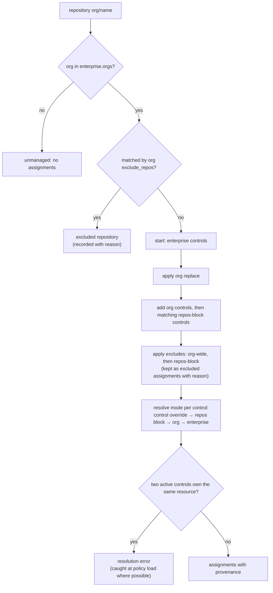

<!-- markdownlint-disable-file MD025 MD041 -->

# DESIGN-0030: Policy model: enterprise and org policies and control assignment

<!--toc:start-->
- [Overview](#overview)
- [Goals and Non-Goals](#goals-and-non-goals)
  - [Goals](#goals)
  - [Non-Goals](#non-goals)
- [Background](#background)
- [Detailed Design](#detailed-design)
  - [Files](#files)
  - [The control catalogue](#the-control-catalogue)
  - [The enterprise policy](#the-enterprise-policy)
  - [Org policies](#org-policies)
  - [Resolution](#resolution)
  - [Resource ownership](#resource-ownership)
  - [Modes](#modes)
  - [When resolution runs](#when-resolution-runs)
  - [Validation at load](#validation-at-load)
  - [Compliance queries](#compliance-queries)
- [API / Interface Changes](#api--interface-changes)
- [Data Model](#data-model)
- [Testing Strategy](#testing-strategy)
- [Migration / Rollout Plan](#migration--rollout-plan)
- [Open Questions](#open-questions)
  - [OQ1: Is there a separate repository policy type?](#oq1-is-there-a-separate-repository-policy-type)
  - [OQ2: Can an org policy onboard an org that is not in the enterprise list?](#oq2-can-an-org-policy-onboard-an-org-that-is-not-in-the-enterprise-list)
  - [OQ3: Can an org policy change a control's parameters (e.g. different owner teams)?](#oq3-can-an-org-policy-change-a-controls-parameters-eg-different-owner-teams)
  - [OQ4: At what granularity is the mode set?](#oq4-at-what-granularity-is-the-mode-set)
  - [OQ5: Must every exclusion carry a reason?](#oq5-must-every-exclusion-carry-a-reason)
  - [OQ6: Where does the policy directory come from?](#oq6-where-does-the-policy-directory-come-from)
  - [OQ7: Can selection use repository facts beyond names?](#oq7-can-selection-use-repository-facts-beyond-names)
  - [OQ8: How are excluded and unmanaged repositories counted?](#oq8-how-are-excluded-and-unmanaged-repositories-counted)
<!--toc:end-->

## Overview

A policy is the *who* and the *what*: which orgs and repositories, and which controls apply to them. This document defines:

- the **control catalogue**, where controls are defined once;
- the **enterprise policy**, the baseline for every listed org;
- **org policies**, which add, exclude or replace controls for one org or for specific repositories in it;
- **resolution**, the deterministic function that turns those into a repository's **assignments**: the controls that apply, the policy each came from, and the mode (`evaluate` or `remediate`);
- how assignments are stored and queried for compliance at repository, org, enterprise and policy level.

Vocabulary and the overall architecture are in DESIGN-0029. What a control *is* in code is in DESIGN-0031.

## Goals and Non-Goals

### Goals

- **One baseline, local variation.** The enterprise policy says what applies everywhere. Org policies are only needed for differences.
- **Trial a control on one org.** An org policy can enable a new control, or a new version of one, without touching the enterprise policy.
- **Exclusions are explicit and explained.** Every exclusion names its scope and a reason, and is visible per repository in the UI.
- **Every assignment has provenance.** For each repository and control, the database records which policy assigned it, which excluded it, and why.
- **Deterministic, pure resolution.** The same policies and the same repository always give the same assignments, with no API calls. It is table-testable.
- **One owner per resource holds per repository.** Resolution never assigns two controls that own the same resource (DESIGN-0029 goal 1).

### Non-Goals

- **A policy language with arbitrary conditions.** Selection is by org and repository name (with globs) and, optionally, by repository facts already in the database (OQ7). It is not a general expression language.
- **Per-team or per-topic policies.** These could come later through repository facts.
- **Editing policy through the UI.** Policies are files under version control. The UI is read-only (DESIGN-0027 stance).

## Background

v1 and v2 today use one policy file:

- a top-level `scope { orgs }` that engages strict mode;
- per-rule `scope` and `ignore` blocks;
- global `ignore { repos }` globs.

Every rule must restate its scope, and an exception for one org means editing a shared file. That creates three problems:

- there is no way to trial a rule on one org without scoping tricks;
- nothing records *why* a rule does not apply to a repository;
- "how compliant is org X with the enterprise baseline" is not a question the data can answer.

## Detailed Design

### Files

```text
policy/
  catalogue/
    codeowners.hcl        # control definitions, any number of files
    catalog_info.hcl
    dependency_updates.hcl
  enterprise.hcl          # exactly one
  orgs/
    donaldgifford.hcl     # zero or one per org
    test-org.hcl
```

The directory is mounted the way `GUARDIAN_CONFIG` is today (a ConfigMap from chart values or an existing ConfigMap) (OQ6). Everything in it is loaded, validated and hashed together into one **policy version**, so every repository is resolved against a consistent snapshot.

### The control catalogue

A control is defined once and referenced by `id@version` (DESIGN-0029 OQ4, OQ5):

```hcl
control "codeowners" {
  version = "1.0"
  title   = "CODEOWNERS"
  type    = "codeowners"              # the Go control type (DESIGN-0031)

  rule "exists" {
    number = "1.1"
    title  = "A valid CODEOWNERS file exists in the standard location"
    remediate = true                  # this rule has a remediation
  }

  rule "wiz-owners" {
    number  = "1.2"
    title   = ".wiz is owned by security champions and application security"
    kind    = "owners"                # a rule kind the codeowners type provides
    pattern = ".wiz"
    owners  = ["@{{ .Org }}/security_champions", "@{{ .Org }}/application_security"]
    remediate = true
  }

  template = "codeowners"             # full-file template for an absent file

  pr {
    title = "chore: CODEOWNERS ({{ .Control.Title }} {{ .Control.Version }})"
  }
}
```

Which rule kinds and parameters a control can use is defined by its control type, and validated at load (DESIGN-0031). The catalogue holds definitions only. A control in the catalogue that no policy references is inert.

### The enterprise policy

```hcl
enterprise {
  orgs = ["donaldgifford", "test-org", "platform"]
  mode = "evaluate"                    # default for everything; see Modes

  controls = [
    "codeowners@1",
    "catalog_info@1",
    "dependency_updates@1",
  ]
}
```

The enterprise policy has **no exclusions**: it is the baseline. Its org list is also the onboarding gate. An org not listed is not managed, even if the App is installed there or an org policy file exists (OQ2).

### Org policies

```hcl
org "test-org" {
  mode = "remediate"                   # overrides the enterprise default for this org

  # Additional controls for this org only.
  controls = ["branch_ruleset@1"]

  # Trial a new version of an enterprise control in this org.
  replace "codeowners@1" {
    with = "codeowners@2"
  }

  # Exclude a control for the whole org.
  exclude "dependency_updates@1" {
    reason = "test-org uses an in-house updater"
  }

  # Exclude repositories from repo-guardian entirely.
  exclude_repos {
    repos  = ["sandbox-*", "archive-*"]
    reason = "throwaway repositories"
  }

  # Repository-level variation (OQ1: no separate repo policy type).
  repos ["legacy-api", "legacy-web"] {
    exclude "catalog_info@1" {
      reason = "being decommissioned, no Backstage entry"
    }

    mode = "evaluate"                  # never remediate these
  }

  repos ["payments-*"] {
    controls = ["secret_scanning@1"]
  }
}
```

An org policy can:

- **add** controls (`controls`), org-wide or for matching repositories;
- **replace** an enterprise control with another control that owns the same resource, usually a newer version (`replace`);
- **exclude** a control, org-wide or for matching repositories, with a required `reason`;
- **exclude repositories** entirely (`exclude_repos`), with a required `reason`;
- **set the mode** org-wide, for matching repositories, or per control (OQ4).

### Resolution

Resolution is a pure function:

```text
resolve(policySnapshot, repository{org, name, facts}) → []Assignment
```



**Precedence**, from weakest to strongest:

| Layer | Can add | Can exclude | Can set mode |
| ----- | ------- | ----------- | ------------ |
| enterprise | ✓ baseline | — | default |
| org | ✓ | ✓ | ✓ |
| org `repos` block | ✓ | ✓ | ✓ |

When several `repos` blocks match one repository, they apply in file order. An exclusion beats an addition of the same control at the same layer, because "exclude" is the explicit opt-out.

**The output, per repository:**

| Field | Example |
| ----- | ------- |
| control | `codeowners@2` |
| state | `active` or `excluded` |
| source | `enterprise`, `org:test-org`, `org:test-org/repos[legacy-*]` |
| replaced | `codeowners@1` (when a `replace` applied) |
| excluded_by, reason | `org:test-org`, "being decommissioned" |
| mode | `evaluate` or `remediate` |
| mode_source | which layer set the mode |

Excluded assignments are stored, not dropped. "Excluded by policy, with reason" is posture information the UI shows, and it is distinct from "not applicable" (a control that ran and decided it does not apply).

### Resource ownership

Each control type declares the resources it owns (DESIGN-0031):

| Control type | Owns |
| ------------ | ---- |
| `codeowners` | `file:CODEOWNERS`, covering `.github/CODEOWNERS`, `CODEOWNERS` and `docs/CODEOWNERS` |
| `catalog_info` | `file:catalog-info.yaml` and `.yml` |
| `dependency_updates` | `file:renovate` (every Renovate config location), `file:dependabot` |
| `file` | `file:<its path>` |
| `repo_settings` | `setting:<each property it sets>` |
| `branch_ruleset` | `ruleset:<branch>` |

**At load**, the validator checks every possible combination (enterprise, plus each org's additions, plus each `repos` block). It rejects any combination where two active controls own the same resource and no `replace` connects them. Adding `codeowners@2` without replacing `codeowners@1` is a load error that names both controls and the org.

Resolution re-checks at runtime as a backstop. A collision there is a bug, not a policy state.

### Modes

- `evaluate` (default): evaluate and record. A remediation is never started for this assignment.
- `remediate`: evaluate and record. When the control is non-compliant, has a fixable failing rule and the evaluation changed, start remediation (DESIGN-0032).

Mode resolves per (repository, control) through the precedence above. "Remediate the whole org except one new control while we watch it" is therefore a per-control `mode = "evaluate"` inside a `remediate` org (OQ4).

Remediation additionally requires the remediation App to be installed on the org. A `remediate` assignment in an org without it is recorded as `remediation_blocked: app_not_installed`, which the UI and an alert surface. It is not an error.

### When resolution runs

| Trigger | Scope |
| ------- | ----- |
| repository discovered, renamed or transferred | that repository |
| policy version changes (any file in `policy/`) | every repository: re-resolve, and re-evaluate where assignments changed, spread over the rollout window (assumption A7) |
| App installed, suspended or unsuspended | that org's repositories |

Resolution is cheap and pure, so it runs inline in the activity that needs it. Its result is persisted, so the API and the evaluation workflow read assignments rather than recomputing them.

### Validation at load

Load fails, with the file, line and names in the message, on:

- an unknown control id or version;
- a parameter the control type rejects (DESIGN-0031);
- an org policy for an org not in `enterprise.orgs` (OQ2);
- a `replace` whose two controls do not own the same resource;
- a resource ownership collision (see above);
- an exclusion without a `reason`;
- a duplicate org policy, or a duplicate control id at one version.

Load warns on:

- an exclusion of a control that is not assigned at that layer, which is a no-op;
- a `repos` block that matches no known repository, which is checked after discovery.

### Compliance queries

Because each assignment records its source, posture can be cut by policy, not only by repository:

- **Enterprise baseline compliance for org X:** active assignments with `source = enterprise` (or `replaced` from an enterprise control) in org X, compliant ÷ (compliant + non_compliant).
- **Org-specific compliance:** active assignments with `source = org:X…`.
- **Worst controls in org X:** non-compliant count per control.
- **Exclusions report:** excluded assignments with their reasons, per org.

The percentage rule (integer floor, computed once in SQL, shared by report, API and snapshots) carries over from IMPL-0025 Phase 8.

## API / Interface Changes

- New policy directory and HCL schema (above); `GUARDIAN_CONFIG` points at the directory (OQ6).
- `policy.Snapshot`, with `Resolve(repo) []Assignment` (pure) and `Version() string`.
- API: `/policies` (the loaded snapshot, summarised), `/controls` (catalogue), `/repositories/{id}/assignments`, and `/orgs/{org}` gaining baseline-versus-org compliance (DESIGN-0032 lists the full set).

## Data Model

```sql
-- The resolved assignments; rewritten per repository on resolution.
CREATE TABLE control_assignments (
    repository_id   BIGINT NOT NULL REFERENCES repositories(id),
    control_id      TEXT   NOT NULL,           -- 'codeowners'
    control_version TEXT   NOT NULL,           -- '2.0'
    state           TEXT   NOT NULL CHECK (state IN ('active', 'excluded')),
    source          TEXT   NOT NULL,           -- 'enterprise' | 'org:<org>' | 'org:<org>/repos[<glob>]'
    replaced        TEXT,                      -- 'codeowners@1'
    excluded_by     TEXT,
    reason          TEXT,
    mode            TEXT   NOT NULL CHECK (mode IN ('evaluate', 'remediate')),
    mode_source     TEXT   NOT NULL,
    policy_version  TEXT   NOT NULL REFERENCES policy_versions(version),
    resolved_at     TIMESTAMPTZ NOT NULL,
    PRIMARY KEY (repository_id, control_id)
);
```

There is one row per (repository, control id). That is the resource-ownership invariant, restated as a key: only one version of a control can be assigned to a repository. Assignment changes write a `repository_events` row (`assignment_changed`) so the timeline shows when a control started or stopped applying (assumption A4).

## Testing Strategy

- **Resolution table tests:** every precedence row, replace, exclude, `exclude_repos`, overlapping `repos` blocks, and the four mode layers. Each case asserts the full assignment, including provenance.
- **Load validation tests:** one per error and warning above, asserting the message names the file and the controls.
- **Ownership-collision tests:** the validator enumerates combinations. A fuzz test generates random catalogues and org policies, then asserts that load-valid policies never resolve to a collision.
- **Golden snapshot of the shipped example policies,** resolved against a fixed repository list, so a resolution change shows up as a diff.

## Migration / Rollout Plan

- There is no v1 policy compatibility (DESIGN-0029 OQ3). The example policies are rewritten as `policy/` directories, so they double as documentation.
- The chart's `policy` values move from one HCL string to a map of file names to contents, rendered into one ConfigMap. `existingConfigMap` keeps working.

## Open Questions

### OQ1: Is there a separate repository policy type?

- (a) ✅ recommended: **no.** Repository-level variation lives in `repos [...]` blocks inside the org policy. Every exception for an org is in one file the org's owners review, and resolution has two layers plus blocks rather than three file types. `repos` blocks with globs also cover "these five repos", which a per-repo file would not.
- (b) Yes: `repo "org/name" {}` files under `policy/repos/`. Repository owners could own their file, but exceptions scatter, and precedence gains a third layer.
- (c) A repository-owned file inside the repository (`.github/repo-guardian.hcl`). Self-service, but a repository could exclude itself from controls, which defeats the point of a policy.
- other:

### OQ2: Can an org policy onboard an org that is not in the enterprise list?

- (a) ✅ recommended: **no; the enterprise list is the only onboarding gate, and such an org policy is a load error.** Onboarding stays one reviewed change in one file, and a stray org file cannot silently bring an org under management.
- (b) Yes: an org policy implies membership. Convenient for org owners, but who is managed becomes spread across files.
- other:

### OQ3: Can an org policy change a control's parameters (e.g. different owner teams)?

- (a) ✅ recommended: **no parameter overrides; parameters are templated with repository context** (`{{ .Org }}`, repository facts), and a genuinely different requirement is a different control or version, used through `replace`. Results stay comparable across orgs: "CODEOWNERS 1.2" means the same thing everywhere.
- (b) `override "codeowners@1" { rule "wiz-owners" { owners = [...] } }` in org policies. Flexible, but the same control id then means different things per org, and compliance numbers stop being comparable.
- other:

### OQ4: At what granularity is the mode set?

- (a) ✅ recommended: **enterprise default, org, `repos` block, and per control within any of those**, resolved by the precedence table. This enables "remediate everything except the control we are trialling", which is the safe way to roll out a new remediation.
- (b) Org and enterprise only. Simpler, but a new control in a `remediate` org starts writing PRs the moment it is added.
- (c) Per control only, in the catalogue. That is global, so it cannot express "remediate in the test org, evaluate everywhere else".
- other:

### OQ5: Must every exclusion carry a reason?

- (a) ✅ recommended: **yes, a required non-empty `reason`, stored on the assignment and shown in the UI.** Exclusions are the policy's exceptions, and an exception without a reason is the one an auditor asks about.
- (b) Optional. Less friction, at the cost of exclusions nobody can explain six months later.
- other:

### OQ6: Where does the policy directory come from?

- (a) ✅ recommended: **a mounted directory (ConfigMap), as today.** No new moving parts. Changes go through the same values or Argo review path, and a pod restart or config reload picks them up.
- (b) A git repository synced by a sidecar (git-sync). Policy changes get their own repository, review and history, without a chart change. It adds a component and a credential.
- (c) Both, with the directory as the default and git-sync optional later.
- other:

### OQ7: Can selection use repository facts beyond names?

- (a) ✅ recommended: **names and globs only for now; a `facts` selector is a later addition.** Facts include visibility, archived state, topics and the catalog-info `spec.type`. They need the evaluation to have run first, which turns resolution into a two-pass process. Names cover the stated needs.
- (b) Allow `repos { visibility = "public" }`-style fact selectors now. More expressive, but resolution depends on evaluation output, and the ordering becomes subtle.
- other:

### OQ8: How are excluded and unmanaged repositories counted?

- (a) ✅ recommended: **excluded controls and repositories are recorded and reported separately, never in the compliance denominator.** Unmanaged orgs (not in the enterprise list) do not appear at all. "92% compliant, 14 exclusions" is honest; folding exclusions into either side of the percentage is not.
- (b) Count excluded controls as compliant. Inflates the numbers.
- other:
