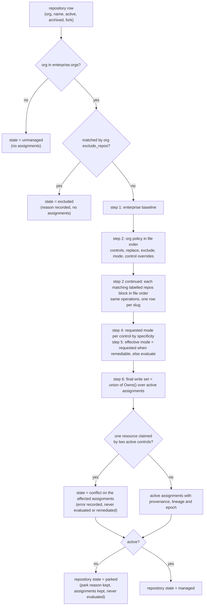

<!-- markdownlint-disable-file MD025 MD041 -->

# DESIGN-0030: Policy model: enterprise and org policies and control assignment

<!--toc:start-->
- [Overview](#overview)
- [Goals and Non-Goals](#goals-and-non-goals)
  - [Goals](#goals)
  - [Non-Goals](#non-goals)
- [Background](#background)
- [Detailed Design](#detailed-design)
  - [Files](#files)
  - [The control catalogue](#the-control-catalogue)
  - [The enterprise policy](#the-enterprise-policy)
  - [Org policies](#org-policies)
  - [Resolution](#resolution)
  - [Resource ownership](#resource-ownership)
  - [Modes](#modes)
  - [When resolution runs](#when-resolution-runs)
  - [Validation at load](#validation-at-load)
  - [Compliance queries](#compliance-queries)
- [API / Interface Changes](#api--interface-changes)
- [Data Model](#data-model)
- [Testing Strategy](#testing-strategy)
- [Migration / Rollout Plan](#migration--rollout-plan)
- [Decisions](#decisions)
- [Adversarial Review](#adversarial-review)
  - [AR-0030-01 (high): Pairwise enumeration is neither a proof nor a complete error model](#ar-0030-01-high-pairwise-enumeration-is-neither-a-proof-nor-a-complete-error-model)
  - [AR-0030-02 (high): Resource identity needs canonicalization and write-boundary enforcement](#ar-0030-02-high-resource-identity-needs-canonicalization-and-write-boundary-enforcement)
  - [AR-0030-03 (high): Assignment changes need revision fences around results and writes](#ar-0030-03-high-assignment-changes-need-revision-fences-around-results-and-writes)
  - [AR-0030-04 (high): Org installation presence is not repository authorization](#ar-0030-04-high-org-installation-presence-is-not-repository-authorization)
  - [AR-0030-05 (high): Compliance must expose unevaluated assignments and measurement loss](#ar-0030-05-high-compliance-must-expose-unevaluated-assignments-and-measurement-loss)
  - [AR-0030-06 (high): Final-layer provenance cannot answer baseline compliance reliably](#ar-0030-06-high-final-layer-provenance-cannot-answer-baseline-compliance-reliably)
  - [AR-0030-07 (medium): Overlapping modes and replacements need an executable precedence contract](#ar-0030-07-medium-overlapping-modes-and-replacements-need-an-executable-precedence-contract)
- [Open Questions](#open-questions)
  - [OQ1: Is there a separate repository policy type?](#oq1-is-there-a-separate-repository-policy-type)
  - [OQ2: Can an org policy change a control's parameters (e.g. different owner teams)?](#oq2-can-an-org-policy-change-a-controls-parameters-eg-different-owner-teams)
  - [OQ3: At what granularity is the mode set?](#oq3-at-what-granularity-is-the-mode-set)
<!--toc:end-->

## Overview

A policy is the *who* and the *what*: which orgs and repositories, and which controls apply to them. This document defines:

- the **control catalogue**, where controls are defined once;
- the **enterprise policy**, the baseline for every listed org;
- **org policies**, which add, replace or exclude controls for one org or for specific repositories in it, and set the mode;
- **resolution**, the deterministic function that turns those, together with the repository's stored state and each App's access to it, into a repository's **assignments**: the controls that apply, the policy each came from and the baseline each fulfils, and the requested and effective mode (`evaluate` or `remediate`);
- how assignments are stored and queried for compliance at repository, org, enterprise and policy level.

Vocabulary and the overall architecture are in DESIGN-0029. What a control *is* in code is in DESIGN-0031. How assignments drive evaluation and remediation is in DESIGN-0032.

## Goals and Non-Goals

### Goals

- **One baseline, local variation.** The enterprise policy says what applies everywhere. Org policies are only needed for differences.
- **Trial a control on one org.** An org policy can enable a new control, or a new version of one, without touching the enterprise policy.
- **Exclusions are explicit and explained.** Every exclusion names its scope and a reason, and is visible per repository in the UI.
- **Every assignment has provenance.** For each repository and control, the database records which policy assigned it, which excluded it, and why.
- **Deterministic resolution with no API calls.** The same policy snapshot, the same repository row and the same per-App access facts always give the same assignments. Resolution reads stored state only, so it is table-testable, and its golden cases are the contract every implementation reproduces (D18).
- **One owner per resource holds per repository.** Resolution never activates two controls that own the same resource — the "one owner per resource" goal of DESIGN-0029. A collision is not dropped or guessed at: it is persisted as a `conflict` that nobody evaluates or remediates (D12).

### Non-Goals

- **A policy language with arbitrary conditions.** Selection is by org and repository name (with globs). Selection by repository facts is a later addition (D4). It is not a general expression language.
- **Per-team or per-topic policies.** These could come later through repository facts.
- **Editing policy through the UI.** Policies are files under version control. The UI is read-only (DESIGN-0027 stance).

## Background

v1 and v2 today use one policy file:

- a top-level `scope { orgs }` that engages strict mode;
- per-rule `scope` and `ignore` blocks;
- global `ignore { repos }` globs.

Every rule must restate its scope, and an exception for one org means editing a shared file. That creates three problems:

- there is no way to trial a rule on one org without scoping tricks;
- nothing records *why* a rule does not apply to a repository;
- "how compliant is org X with the enterprise baseline" is not a question the data can answer.

A fourth problem is structural rather than about scoping: rules are evaluated in isolation, so two rules that name the same file have no shared view of the result and can undo each other. The policy model's answer is resource ownership (below); the control model's answer is in DESIGN-0031.

## Detailed Design

### Files

```text
policy/
  catalogue/
    codeowners.hcl        # control definitions, any number of files
    catalog_info.hcl
    dependency_updates.hcl
  templates/              # file templates the catalogue names; optional
    codeowners.tmpl
  enterprise.hcl          # exactly one
  orgs/
    donaldgifford.hcl     # zero or one per org
    test-org.hcl
```

The directory is mounted the way `GUARDIAN_CONFIG` is today (a ConfigMap from chart values or an existing ConfigMap) (D3). Everything in it is loaded, validated and hashed together into one **policy version**, so every repository is resolved against a consistent snapshot.

**Templates live under the policy root (D20).** Today file templates come from two places outside the policy: `TEMPLATE_DIR`, a separate mount at `/etc/repo-guardian/templates`, and the embedded `rules.TemplateStore`. Under the controls model an operator template is a file under `policy/templates/` (or any path under the root that the catalogue names), read and hashed in the same pass as the HCL, so editing a template changes the policy version. The embedded templates remain the fallback for a template name the root does not supply, and their bytes are part of the hashed snapshot too, so a binary upgrade that changes an embedded default also changes the version. `TEMPLATE_DIR` and the chart's separate `templates` mount go away. How the chart renders the template files into the same ConfigMap, and the effect on the version hash, is a phase-0 spike (INV-0022). Amended 2026-10-06 (INV-0022).

The spike settled both (INV-0022 Phase-0 results, spike 7). ConfigMap keys cannot contain `/`, so the chart encodes a nested path into the key with `__` (`templates__codeowners.tmpl`; a file name containing `__` fails render) and maps it back with the volume's `items[].path`. The reader walks `<root>/..data/` when it exists, which is kubelet's one consistent snapshot, skips every name starting with `..`, and keys files by their path relative to it: a plain walk of the mount sees only kubelet's timestamped copies, because the nested directories are symlinks it does not follow. The version hashes the root's files and the embedded templates the root does **not** shadow, sorted and length-prefixed, so a binary upgrade that changes an overridden default does not re-roll the fleet. The whole root, HCL and templates, fits one ConfigMap's 1 MiB. Amended 2026-10-07 (INV-0022 Phase-0 results).

### The control catalogue

A control is defined once and referenced by `name@version`, where the version is an integer and the reference matches exactly (DESIGN-0029 D2 and D3):

```hcl
control "codeowners" {
  version = 2
  title   = "CODEOWNERS"
  type    = "codeowners"              # the Go control type (DESIGN-0031)

  rule "exists" {
    number = "1.1"
    title  = "A CODEOWNERS file exists in a standard location"
    remediate = true                  # this rule is remediable
  }

  # Ownership rules (kind = "owners", pattern/owners parameters) are
  # DESIGN-0034, deferred. Version 2 here differs from version 1 by its
  # template, which is a catalogue change, not a Go change (DESIGN-0029 D3).
  template = "codeowners"             # full-file template for an absent file

  pr {
    title = "chore: CODEOWNERS ({{ .Control.Title }} v{{ .Control.Version }})"
  }
}

control "repo_settings" {
  version = 1
  title   = "Repository settings"
  type    = "repo_settings"           # an API-remediated type

  rule "no-wiki" {
    number    = "1.1"
    title     = "The wiki is disabled"
    kind      = "equals"
    property  = "has_wiki"
    value     = false
    remediate = true
  }

  remediation {
    apply = "recommend"               # "recommend" (default), "direct", or "workflow" for
                                      # types that declare it (DESIGN-0031, DESIGN-0032)
  }
}
```

Rule ids (`exists`, `no-wiki`) are bare and unique within their control. Control slugs and rule ids share one grammar, `^[a-z][a-z0-9]*([_-][a-z0-9]+)*$`, and a rule's `kind` may be omitted only when its id is itself a rule kind the control type declares, as `exists` is; otherwise load fails naming the rule (DESIGN-0033 AR-0033-01). Rule **numbers** (`1.1`, `1.2`) are display-only labels for reports and the UI; they are a different axis from the control **version** (`2`), which is what policies pin. A new version of a control is a new catalogue definition under the same name, not a new Go type. Beside the version, every definition has a **revision**: a content digest over everything that can change an outcome or a remediation (DESIGN-0029 AR-0029-04, DESIGN-0031), which assignments and results record so that a semantic edit under an unchanged integer still re-evaluates.

Which rule kinds and parameters a control can use is defined by its control type, and validated at load (DESIGN-0031). The catalogue holds definitions only. A control in the catalogue that no policy references is inert.

### The enterprise policy

```hcl
enterprise {
  orgs = ["donaldgifford", "test-org", "platform"]
  mode = "evaluate"                    # default for everything; see Modes

  controls = [
    "codeowners@1",
    "catalog_info@1",
    "dependency_updates@1",
  ]

  remediation {                        # defaults; an org policy may override
    max_open_prs = 3                   # per repository (DESIGN-0032 OQ2)
    reopen_after = "336h"              # after a user closes a PR (DESIGN-0032 OQ3)
  }
}
```

The enterprise policy has **no exclusions**: it is the baseline. Its org list is also the onboarding gate. An org not listed is not managed, even if an App is installed there or an org policy file exists (D1).

### Org policies

```hcl
org "test-org" {
  mode = "remediate"                   # overrides the enterprise default for this org

  # Additional controls for this org only.
  controls = ["branch_ruleset@1"]

  # Trial a new version of an enterprise control in this org.
  replace "codeowners@1" {
    with   = "codeowners@2"
    reason = "trialling the v2 template before it becomes the baseline"
  }

  # Exclude a control for the whole org.
  exclude "dependency_updates@1" {
    reason = "test-org uses an in-house updater"
  }

  # Keep evaluating one control while the rest of the org remediates.
  control "codeowners@2" {
    mode = "evaluate"
  }

  # Exclude repositories from repo-guardian entirely.
  exclude_repos {
    match  = ["sandbox-*", "archive-*"]  # globs on the repository name
    reason = "throwaway repositories"
  }

  # Repository-level variation (OQ1: no separate repository policy type).
  # The label is the block's stable identity in provenance (D17).
  repos "legacy" {
    match = ["legacy-api", "legacy-web"]

    exclude "catalog_info@1" {
      reason = "being decommissioned, no Backstage entry"
    }

    mode = "evaluate"                  # never remediate these
  }

  repos "payments" {
    match    = ["payments-*"]
    controls = ["secret_scanning@1"]   # (hypothetical control)

    control "secret_scanning@1" {
      mode = "remediate"
    }
  }

  remediation {
    max_open_prs = 5
  }
}
```

Block labels are quoted strings; lists live in attributes. A `repos` block carries a label (`repos "legacy" {}`) that is unique within the org policy and is the block's stable identity in provenance (`org:test-org/repos[legacy]`), so reordering a block or editing its globs does not change what an assignment records (D17). `repos` and `exclude_repos` both select repositories with `match`, a list of globs on the repository name.

An org policy can:

- **add** controls (`controls`), org-wide or in a `repos` block; a slug the enterprise baseline names is restored to the baseline, any other slug is org-added (D17);
- **replace** a control with another that owns the same resource, usually a newer version (`replace`), org-wide or in a `repos` block, with a required `reason` (D17); the replacement fulfils the baseline its source did;
- **exclude** a control, org-wide or in a `repos` block, with a required `reason` (D2);
- **exclude repositories** entirely (`exclude_repos`), with a required `reason`;
- **set the mode** org-wide, in a `repos` block, or for one control with a `control "name@N" { mode }` override inside either (OQ3); this is the requested mode, and the effective mode also depends on the Remediation App's access to the repository (see Modes);
- **tune remediation** (`remediation { max_open_prs, reopen_after }`) for the org.

### Resolution

Resolution makes no API calls. It reads the policy snapshot and two pieces of stored state:

```text
resolve(policySnapshot,
        repository{org, name, active, archived, fork},
        access{evaluable, remediable})
  → RepositoryPolicyState{state, reason}, []Assignment
```

`access` is per repository and per App, not per org (D15). It is read from DESIGN-0032's `app_repository_access(repository_id, app, installation_id, seen_at)` joined to `app_installations(app, account_login, installation_id, suspended_at, repository_selection, seen_at)`: `evaluable` is true when the Evaluation App has access to this repository; `remediable` is true when the Remediation App has access to it and its installation is not suspended, and `evaluable` is likewise false while the Evaluation App's installation is suspended. Suspension of either App is access state read from `app_installations.suspended_at`, never a park reason, so `installation.unsuspend` has nothing to un-park and discovery stays the only un-parker (INV-0021 OQ1). A GitHub App can be installed on selected repositories, so a live Remediation installation for the org says nothing about this repository, which is why the booleans are per repository. Each App refreshes its own facts: both Apps run discovery through their own installations (the Remediation App's discovery only lists repositories), and both deliver `installation` and `installation_repositories` lifecycle events to the same ingest endpoint, distinguished by the target App id header and signed with their own secret (DESIGN-0032).

The repository's `active` flag is the parking mechanism carried over from today: archived repositories, forks, removed repositories and repositories the Evaluation App cannot read are parked, and discovery (`UpsertDiscovered`) is the only thing that un-parks. Assignments are desired state, derived from the policy snapshot and the repository's identity, so parking never removes them (D6): a parked repository keeps its assignments and is simply never evaluated while parked. What happens to its results depends on the park reason (see Data Model). Evaluation App absence on an active repository needs no rule of its own: the next complete discovery listing parks it `removed`.



**The algorithm.** One ordered algorithm defines resolution, and it is published as golden cases, `testdata/resolution/*.hcl` with the expected JSON, that every implementation must reproduce exactly (D18):

1. Start from the enterprise baseline: every control in `enterprise.controls` is active with `decision = baseline` and `baseline_control` set to its own slug.
2. Apply the org policy in file order: `controls` adds (a slug the enterprise baseline names is restored with its `baseline_control` and `decision = baseline`; any other slug is `decision = org_added` with no `baseline_control`), `replace` swaps (the source must be in the current set, else a load error; the replacement inherits the source's `baseline_control`, records `replaced` and `decision = replaced`, and the predecessor's resources leave the write set before anything is checked), `exclude` removes and records (`decision = excluded`, `excluded_by`, `reason`). Then apply each matching `repos` block in file order the same way. Within one layer an exclusion beats an addition of the same control, because "exclude" is the explicit opt-out.
3. Keep one row per slug and repository: a later layer supersedes an earlier version or an earlier exclusion, so re-adding `@1` after excluding `@2` yields an active `@1` row and the `@2` exclusion is history. A later layer adding back a control an earlier layer excluded is how "exclude org-wide except these repositories" is written. `source` and `source_block` record the layer that made the final decision; `baseline_control` records the lineage regardless of which layer that was.
4. Choose the **requested mode** by specificity, not file order: a per-control override in a matching `repos` block, then that block's `mode`, then a per-control override at org level, then the org `mode`, then the enterprise `mode`. Two declarations at the same specificity with different values fall to the later one in file order, and `validate` warns on them.
5. Derive the **effective mode**: the requested mode when the repository is `remediable`, else `evaluate` with `mode_reason` set to `remediation_app_no_access` or `remediation_app_suspended`. This is per repository, so one org can hold remediated and evaluate-only repositories side by side without a policy edit.
6. Compute the repository's final write set, the union of `Owns()` across its active assignments after replacements. If one canonical resource key is claimed by two active controls, every assignment that claims it gets `state = conflict` and an `error` naming the resource and both controls, and none of them is evaluated or remediated (D12).
7. Assign the `epoch`: a new row starts at 1; an existing row's epoch increments whenever its version, revision, requested or effective mode, write set, source or state changed since the previous resolution (D14).

**Precedence**, from weakest to strongest:

| Layer | Can add | Can replace | Can exclude | Can set mode |
| ----- | ------- | ----------- | ----------- | ------------ |
| enterprise | ✓ baseline | — | — | default |
| org | ✓ | ✓ | ✓ | ✓ |
| org `repos "<label>"` block | ✓ | ✓ | ✓ | ✓ |
| `control "name@N" {}` override, inside the org or a `repos` block | — | — | — | ✓ for that control |

**Worked example** — two overlapping `repos` blocks:

```hcl
org "test-org" {
  exclude "catalog_info@1" {
    reason = "no Backstage in test-org yet"
  }

  repos "backstage" {
    match    = ["backstage-*"]
    controls = ["catalog_info@1"]      # re-activates it for these repositories
  }

  repos "backstage-legacy" {
    match = ["backstage-legacy"]
    exclude "catalog_info@1" {
      reason = "being decommissioned"
    }
  }
}
```

For `backstage-api`: the enterprise assigns `catalog_info@1`, the org excludes it, the first block adds it back. Final: active, `source = org:test-org/repos[backstage]`, `baseline_control = catalog_info`, `decision = baseline`. For `backstage-legacy`: the same, then the second block excludes it again. Final: excluded, `excluded_by = org:test-org/repos[backstage-legacy]`. Swapping the two blocks leaves `backstage-legacy` active, which is why blocks apply in file order and the validator warns when a later block re-adds what an earlier one excluded for an overlapping match. Editing a block's globs does not change its provenance, because `source` carries the block's label, not its `match`.

**The output, per repository:**

| Field | Example |
| ----- | ------- |
| control | `codeowners@2` |
| revision | the definition's content digest (DESIGN-0031) |
| state | `active`, `excluded` or `conflict` |
| decision | `baseline`, `replaced`, `org_added` or `excluded` |
| baseline_control | `codeowners` (the enterprise slug this row fulfils; `NULL` when org-added) |
| source | `enterprise`, `org:test-org`, `org:test-org/repos[legacy]` |
| source_block | `legacy` (the `repos` block label; `NULL` otherwise) |
| replaced | `codeowners@1` (when a `replace` applied) |
| excluded_by, reason | `org:test-org`, "being decommissioned" |
| error | `NULL`, or `resource_conflict: file:.github/CODEOWNERS claimed by codeowners@2 and legacy_codeowners@1` |
| requested_mode | `evaluate` or `remediate`, from policy |
| effective_mode | `evaluate` or `remediate`, what actually runs |
| mode_source | which layer set the requested mode |
| mode_reason | `NULL` (effective equals requested), `remediation_app_no_access` or `remediation_app_suspended` |
| epoch | `1`, then incremented on every change to the row (D14) |

Alongside the assignments, resolution writes the repository's effective remediation settings, `max_open_prs` and `reopen_after` (enterprise default, org override), onto its `repository_policy_state` row (D7). DESIGN-0032's `remediation_due` definition and the remediator read them from that row, never from a settings table or a re-parse of policy.

Excluded assignments are stored, not dropped. "Excluded by policy, with reason" is posture information the UI shows, and it is distinct from "not applicable" (a control that ran and decided it does not apply). On an excluded row, `requested_mode` and `effective_mode` hold the modes that would have applied had the control been active; they are informational. A `conflict` row is likewise stored with its modes and its `error`; it is distinct from both, and posture counts it as `unmeasurable{reason=conflict}`.

### Resource ownership

Each control type declares the resources it may write, `Owns()`, separately from the resources it only reads, `Reads()` (DESIGN-0031 AR-0031-02). Only owned resources take part in ownership; a read dependency never collides with anything.

| Control type | Owns |
| ------------ | ---- |
| `codeowners` | `file:.github/CODEOWNERS`, `file:CODEOWNERS` and `file:docs/CODEOWNERS`, three static keys |
| `catalog_info` | `file:catalog-info.yaml` and `file:catalog-info.yml` |
| `dependency_updates` | one `file:` key per Renovate configuration location and per Dependabot configuration location; the `renovate` key of `package.json` is a read dependency, not owned (below) |
| `file` | `file:<its path>`, canonicalized |
| `repo_settings` | `setting:<property>` for each property it sets |
| `branch_ruleset` | `ruleset:<name>` for each ruleset it manages |
| `labels` | `label:<name>` for each label it manages |
| `custom_properties` | `property:<name>` for each property it manages |

**Canonical keys (D13).** Resource keys are canonicalized by the framework, not by each type, so two spellings of one resource cannot evade the check. `file:<path>` runs through `path.Clean` and rejects absolute paths, `..`, empty segments and a leading `./`, then compares byte for byte, as GitHub does (`.github/./CODEOWNERS` is therefore `file:.github/CODEOWNERS`, and `.GITHUB/CODEOWNERS` is a different file). `label:<name>` is lower-cased, because GitHub label names are case-insensitive. `property:<name>`, `ruleset:<name>` and `setting:<name>` compare exactly until the investigation verifies each provider's case rules. Keys are static per definition: there is no per-repository templating of a resource key, which is why the CODEOWNERS control owns all three locations as three keys rather than one templated one.

**Whole resources only.** Ownership is of a whole resource; sub-field ownership is out of scope for this release. The `renovate` key of `package.json` is a `Reads()` dependency of `dependency_updates`, and its `exclusive` rule fails non-remediably with a note instead of editing `package.json`.

**The write boundary.** `replace` removes the predecessor's resources before the final set is checked, so `codeowners@2` replacing `codeowners@1` is never a self-collision. Every `ChangeSet` a control returns is validated by the framework against the assignment's current `Owns()` before any write, independently of what the type returned (DESIGN-0031); a change outside the write set is rejected, not written.

**At load**, the validator runs the ownership check over the final active set of every combination it can enumerate: each org's layer alone, each org plus each of its `repos` blocks, and each org plus each pair of its `repos` blocks, because globs can overlap. It rejects any combination where two active controls own the same canonical resource and no `replace` connects them: adding `codeowners@2` without replacing `codeowners@1` is a load error that names both controls and the org. This check is a **conservative early warning, not the guarantee**. Repository names are not known at load, so which combination of blocks a repository will actually meet is undecidable there; the enumeration can therefore reject a layout that a later layer would have resolved, and the remedy is restructuring the policy. Three or more overlapping blocks are not enumerated at all.

**At runtime**, resolution is the guarantee. For every repository it computes the final write set, the union of `Owns()` across the active assignments, and any overlap fails closed for that repository: every assignment claiming the overlapping resource is persisted with `state = conflict` and an `error` such as `resource_conflict: file:.github/CODEOWNERS claimed by codeowners@2 and legacy_codeowners@1`. A conflicted control is never evaluated or remediated, and it counts as `unmeasurable{reason=conflict}` in posture, never as compliant and never as unassigned. A runtime collision is a policy state with a visible error, not a bug, and it clears on the next resolution after the policy is fixed (D12).

### Modes

- `evaluate` (default): evaluate and record. A remediation is never started for this assignment.
- `remediate`: evaluate and record. When the control is non-compliant, has a remediable failing rule and the evaluation changed, start remediation (DESIGN-0032).

The mode a policy asks for is the assignment's **requested mode**, resolved per (repository, control) by specificity (algorithm step 4). "Remediate the whole org except one new control while we watch it" is therefore a `control "name@N" { mode = "evaluate" }` override inside a `remediate` org (OQ3).

What actually runs is the **effective mode**. Remediation additionally requires the Remediation App to have access to this repository through an installation that is not suspended: that is the `remediable` input to resolution, per repository, not per org (D15). Where it is false, every assignment whose requested mode is `remediate` resolves to `effective_mode = evaluate` with `mode_reason = remediation_app_no_access` or `remediation_app_suspended`, persisted on the assignment, which the UI and an alert surface. It is not an error. Granting the App the repository, or unsuspending it, re-resolves the affected repositories (see below) and the overrides disappear without a policy edit. The remediator re-reads `effective_mode`, `remediable`, the write set and the `epoch` immediately before every external write (D14), so a mode that changed while a change was being prepared is honoured.

### When resolution runs

| Trigger | Scope |
| ------- | ----- |
| repository discovered, renamed, transferred, parked or un-parked | that repository |
| policy version changes (any file in `policy/`), including a control revision change | every repository: re-resolve, and re-evaluate where assignments changed, spread over the rollout window (assumption A7) |
| either App's installation created, suspended, unsuspended or removed (`installation`) | the repositories that installation covers |
| either App's repository selection changes (`installation_repositories`), or its discovery lists a different set | the repositories whose `app_repository_access` rows changed |

Resolution is cheap and makes no API calls, so it runs inline in the activity that needs it. Its result is persisted, so the API and the evaluation workflow read assignments rather than recomputing them. In today's code the discovery activity upserts the repository and signal-with-starts its workflow in one step (`UpsertRepositories`), and the rollout workflow only signals (`SignalRepositories`); resolution slots between the upsert and the start, and the rollout re-resolves before it re-signals (INV-0021, A3 and A7).

Rollout is **monotonic in policy version**: a resolver writes its result only if its policy version is the most recently **activated** one in `policy_versions`, so an old-snapshot worker still running during a rollout cannot resolve newer state backwards (D14). Its write is discarded and logged, and the repository is re-resolved by a current worker.

"Most recently activated" is `policy_versions.activated_at`, set to `now()` by every deploy that loads that version, including a re-deploy of a version seen before. A deploy is the chart's migrate Job, not a worker starting: the Job runs once per `helm install`, `upgrade` and `rollback`, loads the same binary and policy root as the workers, and upserts the activation as the schema owner. Workers only read the newest activation; a worker that restarts activates nothing, so an old-version pod restarting during a rollout cannot re-activate the version being replaced. Amended 2026-10-07 (INV-0022 Phase-0 results, OQ1). It is not the first time a version was seen: today's insert is `ON CONFLICT DO NOTHING` ordered by `first_seen_at`, so reverting the policy to an earlier version would leave that version older than the one it replaced and every resolution under it would be discarded forever. The upsert therefore becomes `ON CONFLICT (version) DO UPDATE SET activated_at = now()`, `first_seen_at` is kept for history, and a revert is an ordinary rollout. Amended 2026-10-06 (INV-0022).

### Validation at load

Load fails, with the file, line and names in the message, on:

- an unknown control name or version;
- a parameter the control type rejects, or a rule without `kind` whose id is not a rule kind of the type (DESIGN-0031, DESIGN-0033 AR-0033-01);
- an org policy for an org not in `enterprise.orgs` (D1);
- a `replace` whose source is not in the current set at that layer, or whose two controls do not own the same resource;
- a resource ownership collision in the enumerated combinations (see above);
- an `exclude`, `exclude_repos` or `replace` without a `reason` (D2, D17);
- a `repos` block without a label, or two `repos` blocks in one org policy with the same label (D17);
- a `control {}` override naming a control that no layer assigns;
- `remediation.max_open_prs` below 1, or `reopen_after` that is not a duration of at least `1h`;
- a duplicate org policy, or a duplicate control name at one version;
- a referenced file that is missing, larger than 1 MiB, or outside the policy root once resolved (below).

Load warns on:

- an exclusion of a control that is not assigned at that layer, which is a no-op;
- a `repos` block that re-adds a control an earlier block excluded for an overlapping `match`;
- two mode declarations at the same specificity with different values, where the later one in file order wins (algorithm step 4);
- a `repos` block that matches no known repository, which is checked after discovery.

**Reading the policy root (DESIGN-0033 AR-0033-06).** The only expression forms allowed in policy files are literals and `file()`; there is no evaluation context beyond that. "In root" is resolved, not lexical: the loader resolves the policy root and every referenced file with `filepath.EvalSymlinks` and requires the resolved file to lie under the resolved root, which admits the symlinks a Kubernetes ConfigMap projection uses (they resolve inside the mount) and rejects links that escape it. The catalogue, the policies, the templates and every referenced file are read in one pass at load and hashed from those bytes, so the policy version is the digest of what was actually read. There is no hot reload, as today: a change to the mount takes effect on restart, so two loads can never mix versions.

### Compliance queries

Because each assignment records its lineage and its provenance, posture can be cut by policy, not only by repository. Status is not stored on the assignment: posture queries **start from active assignments and LEFT JOIN** DESIGN-0032's `control_results` on `(repository_id, control_id)`, matching the result's `assignment_epoch` and `revision` against the assignment's (D16). Neither key includes the control version, on purpose — a repository has at most one version of a control assigned, and a result row follows the assignment through a version bump; the epoch and revision say whether it is current. The join puts every active assignment in exactly one bucket:

| Bucket | Meaning |
| ------ | ------- |
| `compliant`, `non_compliant` | a result at the assignment's current epoch and revision |
| `pending` | an active assignment with no result yet, the normal state between assignment and first evaluation |
| `stale` | a result from an older epoch or revision, awaiting re-evaluation |
| `unmeasurable` | the repository is parked `access_denied` or its Evaluation App installation is suspended (results kept, not current), or the assignment is in `conflict` |
| `not_applicable`, `unknown` | the control ran and said so |

- **Percentage:** `compliant ÷ (compliant + non_compliant)`, floored to one decimal place, computed in SQL and shared by `ComplianceByRule`, the API, the report, snapshots and the gauges (IMPL-0025 Phase 8; today `compliance.sql:21`). Totals summed across orgs are computed by the Go mirror `store.CompliantPercent` (`api_views.go:22`), which is kept and must apply the same rounding; a test compares the two on the same counts. Amended 2026-10-06 (INV-0022): the text said integer floor, which the code never did. An empty denominator is NULL, shown as "no data", never 100% (DESIGN-0022). The percentage is only ever shown with the other buckets beside it, so a fleet with one evaluated repository and ninety-nine pending ones reads as 100% of one measurement, not as a measured fleet.
- **Coverage:** `measured ÷ assigned`, where `measured` counts the assignments with a result at the current epoch and revision (`compliant`, `non_compliant`, `not_applicable`) and `assigned` counts every active assignment. `pending`, `stale`, `unmeasurable` and `unknown` are reported as counts beside it.
- **Enterprise baseline compliance for org X:** active assignments in org X with `baseline_control IS NOT NULL`, whichever layer last touched them and whichever version or slug fulfils the baseline now; a replacement counts once, as fulfilling its baseline (D17).
- **Org-specific compliance:** active assignments with `decision = 'org_added'`.
- **Worst controls in org X:** non-compliant count per control.
- **Exclusions report:** excluded assignments and excluded repositories with their reasons, per org (D5), and conflicted assignments with their `error`.

## API / Interface Changes

- New policy directory and HCL schema (above); `GUARDIAN_CONFIG` points at the directory (D3).
- `policy.Snapshot`, with `Resolve(repo RepositoryRow, access AppAccess) Resolution` (deterministic, no I/O), `Version() string`, `Control(id control.ID) control.Control` and `Definition(id control.ID) control.Definition`. `AppAccess{Evaluable, Remediable bool}` is the per-repository access input (D15). `Resolution{State, Reason, Assignments, MaxOpenPRs, ReopenAfter}` carries the repository policy state, the assignments and the effective remediation settings (D7). `Assignment` carries `Control, Revision, State, Decision, BaselineControl, Source, SourceBlock, Replaced, ExcludedBy, Reason, Error, RequestedMode, EffectiveMode, ModeSource, ModeReason, Epoch`, one per `control_assignments` row.
- API: `/policies` (the loaded snapshot, summarised, scoped to the principal's visible orgs with enterprise-wide fields only for a principal that sees every org; DESIGN-0032 AR-0032-12), `/controls` (catalogue), `/repositories/{id}/controls` (assignments with provenance, lineage, posture bucket and the latest result), and `/orgs/{org}` gaining baseline-versus-org compliance with coverage beside the percentage (DESIGN-0032 lists the full set).

## Data Model

```sql
-- Why a repository has, or has not, assignments; rewritten on resolution.
CREATE TABLE repository_policy_state (
    repository_id   BIGINT PRIMARY KEY REFERENCES repositories(id),
    state           TEXT   NOT NULL CHECK (state IN ('managed', 'excluded', 'unmanaged', 'parked')),
    reason          TEXT,                      -- exclusion reason or park reason
    max_open_prs    INT    NOT NULL,           -- effective remediation settings (D7):
    reopen_after    INTERVAL NOT NULL,         --   enterprise default, org override
    last_remediation_at TIMESTAMPTZ,           -- the one column rg_remediator may UPDATE, which is what grants its SELECT ... FOR UPDATE (DESIGN-0032 AR-0032-05, AR-0032-09)
    policy_version  TEXT   NOT NULL REFERENCES policy_versions(version),
    resolved_at     TIMESTAMPTZ NOT NULL
);

-- The resolved assignments; rewritten per repository on resolution.
CREATE TABLE control_assignments (
    repository_id    BIGINT NOT NULL REFERENCES repositories(id),
    control_id       TEXT   NOT NULL,          -- 'codeowners'
    control_version  INT    NOT NULL,          -- 2
    revision         TEXT   NOT NULL,          -- content digest of the definition (DESIGN-0031)
    state            TEXT   NOT NULL CHECK (state IN ('active', 'excluded', 'conflict')),
    decision         TEXT   NOT NULL CHECK (decision IN ('baseline', 'replaced', 'org_added', 'excluded')),
    baseline_control TEXT,                     -- 'codeowners': the enterprise slug this row fulfils; NULL when org-added
    source           TEXT   NOT NULL,          -- 'enterprise' | 'org:<org>' | 'org:<org>/repos[<label>]'
    source_block     TEXT,                     -- the repos block label when source is a block
    ordinal          INT    NOT NULL,          -- position: enterprise controls in order, then org additions, then repos additions; remediation priority (DESIGN-0032 AR-0032-05)
    replaced         TEXT,                     -- 'codeowners@1'
    excluded_by      TEXT,
    reason           TEXT,                     -- exclusion or replacement reason
    error            TEXT,                     -- 'resource_conflict: <key> claimed by <a> and <b>' when state = 'conflict'
    requested_mode   TEXT   NOT NULL CHECK (requested_mode IN ('evaluate', 'remediate')),
    effective_mode   TEXT   NOT NULL CHECK (effective_mode IN ('evaluate', 'remediate')),
    mode_source      TEXT   NOT NULL,          -- which layer set the requested mode
    mode_reason      TEXT,                     -- NULL = effective equals requested; 'remediation_app_no_access' | 'remediation_app_suspended'
    epoch            BIGINT NOT NULL,          -- 1 on first resolution; see below
    policy_version   TEXT   NOT NULL REFERENCES policy_versions(version),
    resolved_at      TIMESTAMPTZ NOT NULL,
    PRIMARY KEY (repository_id, control_id)
);

-- Owned by DESIGN-0032's data model; resolution compares against activated_at (D14):
--   policy_versions(version, first_seen_at, activated_at, rollout_completed_at, ...)
--   activated_at is set to now() by the migrate Job on every deploy, including a revert and a rollback.

-- Read by resolution, owned by DESIGN-0032's data model: per-App installation facts and per-App
-- repository membership, each refreshed by that App's own discovery and lifecycle events (D15).
--   app_installations(app, account_login, installation_id, suspended_at, repository_selection, seen_at)
--   app_repository_access(repository_id, app, installation_id, seen_at)
```

There is one row per (repository, control name). That is the resource-ownership invariant, restated as a key: only one version of a control can be assigned to a repository. Two different slugs claiming one resource are not caught by the key; they are caught by the write-set check and persisted as `conflict` rows (D12). A repository in state `excluded` or `unmanaged` has a `repository_policy_state` row and no `control_assignments` rows; a `parked` repository keeps its rows, because assignments are desired state (D6). So "no assignments" is always explained, and "not evaluated" is explained by the repository state. Assignment and state changes write a `repository_events` row (`assignment_changed`) so the timeline shows when a control started or stopped applying; the `kind` CHECK on `repository_events` must be extended for it (assumption A4 covers the identity tables, not the event kinds).

**Epochs fence results and writes (D14).** `epoch` starts at 1 and increments whenever the row's version, revision, requested or effective mode, write set, source or state changes. `control_results.assignment_epoch` records which epoch produced a result; `RecordCheck` writes a result only if the assignment is active and the epoch matches, otherwise the result is discarded as stale, logged and counted in `results_discarded_total{reason=stale_epoch}`. Generations are scoped to `(repository, control, epoch)`, so a control that is excluded and re-added starts a fresh generation that no old run can acknowledge (DESIGN-0032 AR-0032-06). The remediator re-reads the assignment (`effective_mode`, `epoch`, write set, `remediable`) immediately before every external write and records `remediations.assignment_epoch`. A write that completes after withdrawal is not prevented; it is withdrawn by lifecycle maintenance on the next pass (DESIGN-0032 AR-0032-04), and that window is accepted.

**Results follow assignments, except on access loss (D6).** Results are cleared in exactly two cases. First, when resolution withdraws or excludes an assignment by policy (the control dropped from policy or replaced, the org removed from `enterprise.orgs`, the repository excluded): the same transaction, running as the evaluator role (DESIGN-0032 AR-0032-09), deletes that control's `control_results` row, cascades to `rule_results`, and writes a `result_events` row with `rule_id = NULL`, `from_status` set to the last status and `to_status = NULL`, so the timeline shows when posture stopped being tracked. Resolution never touches `remediations`: an outstanding PR or recommendation for a withdrawn assignment is closed by DESIGN-0032's lifecycle maintenance (AR-0032-04). Second, when the repository is parked `archived`, `fork`, `removed` or `installation_removed`, which is definitive non-applicability: the repository has left the fleet or no control applies to it (v1's empty-result rule). On an `access_denied` or `unknown` park, or while the Evaluation App's installation is suspended (access state, not a park), the results stay and the repository is reported as `unmeasurable`, because nothing new was learned and access loss must never improve displayed posture (DESIGN-0029 AR-0029-01, v1's nil-result rule). `unknown` is treated as access loss because it is the fail-safe: a park whose cause is not known must not be allowed to clear posture. `park_reason` already carries both `installation_removed` and `unknown`, and the code writes the first today (`v2store_ops.go:237`); the original text classified neither (amended 2026-10-06, INV-0022). `remediations` rows are kept in every case; an open remediation PR for a control that is no longer assigned is closed by lifecycle maintenance as `closed_withdrawn` (DESIGN-0032). The consequence is that compliance queries, the posture gauges and `/repositories/{id}/controls` never show a result as current without an active assignment at the same epoch and revision, while "no assignment" and "no result" are different facts: an active assignment awaiting its first evaluation is `pending`, and it counts against coverage until it is measured.

## Testing Strategy

- **Resolution golden cases (D18):** `testdata/resolution/*.hcl` with expected JSON, covering every precedence row, replace, exclude, `exclude_repos`, overlapping `repos` blocks (the worked example in both block orders), early-specific versus later-general mode overrides, same-layer replacement chains, exclude/new-version/re-add combinations, the five requested-mode layers, `remediable` false by no access and by suspension, and each `repository_policy_state` outcome (parked, unmanaged, excluded, managed). Each case asserts the complete assignment, including lineage, provenance, both modes and epoch.
- **Policy revert test (D14):** deploy version A, then B, then A again; resolutions under the re-activated A are written, and an old-snapshot resolver for B is discarded. Fails against first-seen ordering.
- **Load validation tests:** one per error and warning above, asserting the message names the file and the controls. Every example catalogue and policy in this document and in `examples/` is loaded through the strict loader, so the text cannot diverge from its schema (DESIGN-0033 AR-0033-01).
- **Ownership tests:** path aliases (`.github/./CODEOWNERS`), two different slugs owning one file, label names differing only in case, and a `ChangeSet` writing an undeclared path, each rejected at its boundary (load, resolution or the write boundary). Three or more overlapping blocks, identical selectors with a later conflict-removing layer, and a repository not known at load all resolve to `conflict` rows with an `error`, with no write permitted and the conflict visible as `unmeasurable` posture. A fuzz test generates random catalogues and org policies and asserts that a load-valid policy never resolves to an undetected collision.
- **Epoch fence tests:** interleave exclusion, version replacement, mode downgrade and ownership transfer with evaluation, `RecordCheck` and remediation. A stale run must not resurrect a result, acknowledge the new assignment's generation or continue a write the new epoch does not authorize; an old-snapshot resolver must not overwrite a newer resolution.
- **Access tests:** install both Apps with different repository selections, suspend or remove only the Remediation App, then grant it one more repository. Stored `effective_mode`, `mode_reason` and the resolution triggers must converge without a policy edit.
- **Posture tests:** assign a control to 100 repositories and evaluate one as compliant; the report, API, snapshot and gauges must show 99 `pending`, coverage 1%, and must not imply a fully measured fleet. Revoke access to a failing repository, rediscover it and restore access; at no point may the displayed posture improve or the last-known failure disappear.
- **Golden snapshot of the shipped example policies,** resolved against a fixed repository list, so a resolution change shows up as a diff.

## Migration / Rollout Plan

- There is no v1 policy compatibility (DESIGN-0029 D1). The example policies are rewritten as `policy/` directories, so they double as documentation.
- The chart's `policy` values move from one HCL string to a map of file names to contents, rendered into one ConfigMap. `existingConfigMap` keeps working. Template files go in the same map (D20); the separate `templates` values and `TEMPLATE_DIR` are removed.

## Decisions

Former open questions settled in this document; the body text above states each as fact.

- **D1 Org onboarding** — the enterprise `orgs` list is the only onboarding gate; an org policy for an org not in it is a load error. Onboarding stays one reviewed change in one file, and a stray org file cannot silently bring an org under management.
- **D2 Exclusion reasons** — every `exclude` and `exclude_repos` carries a required, non-empty `reason`, stored with the assignment or the repository state and shown in the UI. An exception without a reason is the one an auditor asks about.
- **D3 Policy source** — the policy directory is a mounted ConfigMap, as `GUARDIAN_CONFIG` is today. No new moving parts; changes go through the same values or Argo review path. A git-sync sidecar can be added later without changing the loader.
- **D4 Fact selectors** — selection is by org and repository name globs only. Facts (visibility, topics, catalog-info `spec.type`) need an evaluation to have run first, which would make resolution two-pass; names cover the stated needs, and a `facts` selector can be added later.
- **D5 Counting exclusions** — excluded controls and excluded, unmanaged or parked repositories are recorded (`control_assignments.state`, `repository_policy_state`) and reported separately, never in the compliance denominator. "92% compliant, 14 exclusions" is honest; folding exclusions into either side of the percentage is not.
- **D6 Results follow assignments, except on access loss** — assignments are desired state and survive parking; a result is cleared only when policy withdraws or excludes the assignment, or when the repository is parked `archived`, `fork`, `removed` or `installation_removed`, each a definitive statement that the posture no longer applies, and the deletion runs in the resolution transaction with the transition recorded in `result_events`. On an `access_denied` or `unknown` park, or while the Evaluation App's installation is suspended (access state, never a park, so discovery stays the only un-parker; amended 2026-10-05 per INV-0021 OQ1), the last results stay and the repository is reported `unmeasurable`, because nothing new was learned and access loss must never improve displayed posture. Amended 2026-10-04 per AR-0029-01 and AR-0030-05: the original cleared on every park and called "no assignment" and "no result" the same fact, which hid every assignment awaiting its first evaluation. Amended 2026-10-06 (INV-0022): `installation_removed` clears and `unknown` keeps; the earlier text classified neither.
- **D7 Remediation settings are persisted per repository** — `max_open_prs` and `reopen_after` are resolved like mode (enterprise default, org override) and written to `repository_policy_state`, so the sweep query and the remediator read one row instead of re-deriving policy; a policy change re-resolves and rewrites them like every other assignment field.
- **D8 No repository policy type** — repository-level variation lives in `repos { match = [...] }` blocks inside the org policy (OQ1, resolved 2026-10-04). Every exception for an org is in the one file its owners review, and `match` globs cover "these five repos" without a third file type.
- **D9 No parameter overrides** — parameters are templated with repository context (`{{ .Org }}`); a genuinely different requirement is a different control or version, used through `replace` (OQ2, resolved 2026-10-04). "CODEOWNERS 1.2" means the same thing in every org.
- **D10 Mode granularity** — enterprise default, org, `repos` block and a per-control `control "name@N" { mode }` override, most specific wins (OQ3, resolved 2026-10-04). This is what makes "remediate everything except the control we are trialling" expressible.
- **D11 One org is enough, and a user account is an org** — the enterprise `orgs` list may hold a single entry, and every level below the enterprise default is optional, so an enterprise policy alone is a complete policy. "Org" means the installation's account login whatever GitHub's account type is: a personal account with the Apps installed on its repositories is managed exactly like an organisation, and is the first test target. What GitHub does not offer on a user account (teams as CODEOWNERS owners, custom properties) is the control's concern, not the policy model's: DESIGN-0031 D10.
- **D12 A resource conflict is a persisted state, not a bug** — resolution computes each repository's final write set and fails closed on overlap, persisting `state = conflict` with an `error` on every affected assignment; a conflicted control is never evaluated or remediated and counts as `unmeasurable{reason=conflict}`. The load-time pairwise enumeration stays as a conservative early warning only, because repository names are unknown at load and "reachable" is undecidable there (AR-0030-01).
- **D13 Canonical, static, whole-resource keys** — the framework canonicalizes every resource key (`path.Clean` and byte comparison for files, lower-casing for labels, exact comparison for the rest until verified), keys are static per definition with no per-repository templating, ownership is of whole resources only, `replace` removes the predecessor's resources before the check, and every `ChangeSet` is validated against the assignment's `Owns()` before any write (AR-0030-02).
- **D14 Assignment epochs fence results and writes** — every assignment carries an `epoch` that increments on any change to its version, revision, mode, write set, source or state; results record the epoch that produced them and are discarded as stale otherwise, generations are scoped per epoch, the remediator re-reads the assignment before every external write, and rollout is monotonic in policy version so an old snapshot cannot resolve newer state backwards (AR-0030-03). "Newest" means most recently activated (`policy_versions.activated_at`, set by the migrate Job on every deploy, never by a worker starting), not first seen, so reverting to an earlier policy is a normal rollout rather than a permanently discarded one (amended 2026-10-06, INV-0022).
- **D15 Access is per App and per repository** — `installations{org → …}` is replaced by `app_installations` and `app_repository_access`, each App refreshing its own facts through its own discovery and lifecycle events; resolution stores a `requested_mode` from policy and an `effective_mode` that is `evaluate` with a `mode_reason` wherever the Remediation App lacks access to the repository or is suspended. An org-level installation flag said nothing about which repositories the App could actually write (AR-0030-04).
- **D16 Posture starts from assignments and reports coverage** — compliance queries LEFT JOIN results onto active assignments at the matching epoch and revision and bucket every assignment as `compliant`, `non_compliant`, `pending`, `stale`, `unmeasurable`, `not_applicable` or `unknown`; the percentage stays `compliant ÷ (compliant + non_compliant)` with NULL ("no data") on an empty denominator, and coverage is reported beside it. An inner join reported 100% for the evaluated subset while most required controls had no result (AR-0030-05).
- **D17 Lineage is stored beside provenance, and blocks have names** — `baseline_control` records the enterprise slug an assignment fulfils through any replacement chain and `decision` records the policy decision, so "baseline compliance" is independent of which layer last touched a row and a replacement counts once; `repos` blocks carry a required unique label stored as `source_block`, so provenance survives reordering and glob edits; `replace` carries a required `reason`, which is where a departure from the baseline is explained for humans rather than as a second compliance category (AR-0030-06).
- **D18 One ordered resolution algorithm, published as golden cases** — the numbered algorithm in Resolution is the contract: layers apply in file order, one row per slug supersedes earlier versions and exclusions, requested mode is chosen by specificity with later-wins and a warning at equal specificity, and `testdata/resolution/*.hcl` with expected JSON is what every implementation must reproduce (AR-0030-07).
- **D19 `repositories.installation_id` is dropped** — `app_repository_access` under `app = 'eval'` is the only record of which installation covers a repository for the Evaluation App, and discovery writes the repository row and its access row in one transaction. The column would have been a second copy of the same fact, and two copies can disagree; identity capture and the task fairness key read the access row instead. Functionally equivalent to keeping it, logically cleaner (INV-0021 OQ2, resolved 2026-10-05).
- **D20 Templates are part of the policy root** — operator file templates live under the policy root and are hashed with the policies; the embedded templates are the fallback and the ones the root does not shadow are hashed too; `TEMPLATE_DIR` and the chart's separate templates mount are removed. One root, one read, one version: a template edit is a policy change like any other (INV-0022, 2026-10-06).

## Adversarial Review

Reviewed 2026-10-03 against the full DESIGN-0029–0033 set. **Disposition: changes required before relying on resolution as the ownership and authorization boundary.** These are unresolved findings; severity meanings are defined in DESIGN-0029's Adversarial Review. Proposed corrections require a design decision before becoming implementation requirements.

**Responses (2026-10-03):** 5 accepted, 2 accepted with changes. Each finding below carries a **Response** giving the disposition and the concrete change, and an **Applied** line recording where it landed. The accepted changes were applied to the body and the Decisions ledger on 2026-10-04; the body and the Decisions ledger are now authoritative.

### AR-0030-01 (high): Pairwise enumeration is neither a proof nor a complete error model

**Basis:** Resource ownership and its testing strategy. The validator enumerates individual/pairwise `repos` layers while runtime may apply three or more. It can also reject unreachable subsets: if three blocks all match `*`, a later replacement/exclusion can make the actual final set safe while an enumerated pair is unsafe. Runtime collisions are described both as expected policy cases and as bugs. `resolution_error` is promised on assignments but is absent from `Assignment`, its SQL state CHECK and the result model.

**Proposed correction:** Define validation over reachable final sets, or a conservative restriction whose false rejections are documented. Keep a runtime fail-closed check for every repository and give collisions a persisted, queryable error representation. Never omit conflicted requirements in a way that makes them look compliant or unassigned by choice.

**Verification:** Test three-plus overlapping blocks, identical selectors with a later conflict-removing layer, and a new repository not known at load. Assert both write prohibition and visible error posture.

**Response:** **Accepted with changes.** The runtime check is the guarantee, not the load-time enumeration: resolution computes every repository's final write set, the union of `Owns()` across its active assignments (AR-0031-02), and any overlap fails closed for that repository. Conflicted assignments are persisted rather than omitted: `control_assignments.state` gains `conflict`, a new `error TEXT` column holds the message (`resource_conflict: file:CODEOWNERS claimed by codeowners@1 and generic:wiz-config@1`), and a conflicted control is never evaluated or remediated and counts as `unmeasurable{reason=conflict}` in posture, never as compliant or unassigned. The `resolution_error` named in Resolution and Resource ownership is this `error` column, added to the `Assignment` type and to the state CHECK, and the sentence calling a runtime collision a bug is withdrawn: it is a policy state with a visible error. The load-time pairwise check stays as a conservative early warning and is documented as such: it can reject a layout a later layer would have resolved, and the remedy is restructuring the policy. Validation over reachable final sets is rejected, because repository names are not known at load, so "reachable" is undecidable there, which is exactly why the runtime check exists. Verification: adopted.

**Applied 2026-10-04:** Resource ownership (runtime write-set check, `conflict` state and `error` column, the load-time enumeration documented as a conservative early warning, the "collision is a bug" sentence withdrawn), the resolution diagram, algorithm step 6 and the output table, Data Model (`state` CHECK and `error`), Compliance queries (`unmeasurable` bucket), Testing Strategy and D12; the body's conflict example names a generic `file` control instead of the Response's wiz-config, since Wiz controls left this design set.

### AR-0030-02 (high): Resource identity needs canonicalization and write-boundary enforcement

**Basis:** Resource ownership's logical keys, DESIGN-0031's concrete file keys and the assignment primary key. `file:CODEOWNERS` is described here as covering three paths, while the interface claims each path individually. A generic control using `.github/./CODEOWNERS` must not evade the collision check. Labels/properties/rulesets also need provider-specific identity rules. `(repository_id, control_id)` prevents duplicate versions of a slug, not two different slugs writing the same resource. `replace` does not itself prove ownership safety.

**Proposed correction:** Specify canonical resource keys and overlap rules, including whole-file versus sub-field ownership such as `package.json`'s Renovate key. Require every returned change to be within the assignment's current write set; replacements remove the predecessor before checking the final set. Either prohibit context-templated ownership keys or resolve them per repository.

**Verification:** Try path aliases, different slugs owning one file, duplicate provider names under their actual comparison semantics, and a change set writing an undeclared path. All must be rejected at the appropriate boundary.

**Response:** **Accepted.** Resource keys are canonicalized by the framework, not by each type: `file:<path>` runs through `path.Clean` and rejects absolute paths, `..`, empty segments and a leading `./`, then compares byte for byte as GitHub does; `label:<name>` is lower-cased because GitHub label names are case-insensitive; `property:<name>`, `ruleset:<name>` and `setting:<name>` compare exactly until the INV verifies each provider's case rules. Ownership is whole-resource only; sub-field ownership is out of scope for this release, so the `renovate` key of `package.json` becomes a read dependency (DESIGN-0031 `Reads()`) and `exclusive` fails non-remediably with a note instead of editing `package.json`. Resource keys are static per definition, with no per-repository templating, so the CODEOWNERS control owns all three locations as three `file:` keys, which is what the collision check and the interface already assume; the `file:CODEOWNERS` shorthand in the Resource ownership table is replaced by the three keys. `replace` removes the predecessor's resources before the final set is checked. Every `ChangeSet` is validated by the framework against the assignment's current `Owns()` before any write, independently of what the type returned. Verification: adopted.

**Applied 2026-10-04:** Resource ownership (`Owns()` versus `Reads()`, the three CODEOWNERS `file:` keys in the table, Canonical keys, Whole resources only and The write boundary paragraphs), algorithm step 2 (`replace` removes the predecessor's resources first), Testing Strategy (ownership tests) and D13.

### AR-0030-03 (high): Assignment changes need revision fences around results and writes

**Basis:** Compliance queries, resolution transactions and DESIGN-0032's separate activity record step. Assigning `codeowners@2` leaves an `@1` result joined by slug during rollout. Worse, an evaluation started before exclusion can finish after resolution deletes its results and insert them again. A remediator can read `mode = remediate`, spend time preparing a change, and write after the policy switched to evaluate or ownership moved to another control.

**Proposed correction:** Give each resolved assignment a revision/epoch. Record results only if that revision is still active and matches; display older results as pending/stale rather than current compliance. Fence remediation records and revalidate authorization immediately before external action, with an explicit policy for a write already in flight at withdrawal. Rollout must prevent old-snapshot workers from resolving newer state backwards.

**Verification:** Interleave exclusion, version replacement, mode downgrade and ownership transfer with evaluation/record/remediation. Stale activities must not resurrect results, acknowledge the new assignment or continue proposing an unauthorized change.

**Response:** **Accepted.** Every resolved assignment carries `epoch BIGINT NOT NULL`, starting at 1 and incremented whenever the row's version, mode, write set, source or state changes, and `control_results.assignment_epoch` records which epoch produced a result. `RecordCheck` writes a result only if the assignment is active and the epoch matches; otherwise the result is discarded as stale, logged and counted in `results_discarded_total{reason=stale_epoch}`. Generations are scoped to `(repository, control, epoch)`, so a re-added control cannot inherit an old run's generation (AR-0032-06). The remediator re-reads the assignment (mode, epoch, write set, `remediable`) immediately before every external write and records `remediations.assignment_epoch`; a write that completes after withdrawal is not prevented, it is withdrawn by lifecycle maintenance on the next pass (AR-0032-04), and that window is documented. Policy rollout is monotonic: a resolver writes only if its policy version is the newest recorded, so an old-snapshot worker cannot resolve newer state backwards. Verification: adopted.

**Applied 2026-10-04:** algorithm step 7 and the output table (`epoch`), Data Model (`epoch` column and the "Epochs fence results and writes" paragraph, including `control_results.assignment_epoch`, the stale-epoch discard, per-epoch generations and `remediations.assignment_epoch`), Modes (remediator re-read), When resolution runs (monotonic rollout), API (`Assignment.Epoch`), Testing Strategy (epoch fence tests) and D14.

### AR-0030-04 (high): Org installation presence is not repository authorization

**Basis:** Resolution's installation booleans and When resolution runs; DESIGN-0032 gives the Remediation App no webhooks. GitHub Apps can be installed on selected repositories. A live remediation installation for an org says nothing about whether it includes this repository. The Evaluation App's installation events describe its own installation, not the other App's suspension/removal/selection changes. The resolver also takes Evaluation App presence as input without defining what absence does to an otherwise active repository.

**Proposed correction:** Persist repository membership and lifecycle/permission observations separately for each App. Define how those facts are refreshed through each App's authenticated discovery or its lifecycle events. Resolve requested mode separately from effective write eligibility, and handle removal, suspension, permission acceptance and selected-repository changes for both Apps.

**Verification:** Install both Apps with different repository selections, suspend/remove only the Remediation App, then grant it one additional repository. Stored eligibility, mode reasons and workflow triggers must converge without requiring an unrelated policy edit.

**Response:** **Accepted.** Installation presence per org is replaced by per-App repository membership: `app_installations(app, account_login, installation_id, suspended_at, repository_selection, seen_at)` and `app_repository_access(repository_id, app, installation_id, seen_at)`. Each App refreshes its own facts: both Apps run discovery through their own installations (the Remediation App's discovery only lists repositories), and both deliver `installation` and `installation_repositories` lifecycle events to the same ingest endpoint, distinguished by the target app id header and signed with their own secret (DESIGN-0032). `evaluable` means the Evaluation App has access to this repository; `remediable` means the Remediation App has access to it and is not suspended. Resolution stores `requested_mode` and `effective_mode` (the requested mode when `remediable`, else `evaluate`) with a `mode_reason`, which replaces the single `mode` column and the org-wide `remediation_app_not_installed` override; the `installations{org → …}` input to `resolve` becomes these two per-repository booleans. Evaluation App absence on an active repository needs no new rule: the next complete discovery listing parks it `removed`. Verification: adopted.

**Applied 2026-10-04:** Overview and Goals, Resolution (the `access{evaluable, remediable}` input read from `app_installations` and `app_repository_access`, each App refreshing its own facts, the diagram and algorithm step 5), Modes, When resolution runs (per-App triggers), the output table and Data Model (`requested_mode`, `effective_mode`, `mode_reason`, the two tables referenced as DESIGN-0032's), API (`AppAccess`), Testing Strategy (access tests) and D15; the `mode_reason` values are named here as `remediation_app_no_access` and `remediation_app_suspended`, since the Response left them unnamed.

### AR-0030-05 (high): Compliance must expose unevaluated assignments and measurement loss

**Basis:** Compliance queries/D5/D6 and DESIGN-0032's version-free result keys. An inner join drops newly assigned controls until their first evaluation. During a long rollout the dashboard can report 100% for the already-evaluated subset while most required controls have no result. Unknown, stale and access-denied cases can similarly shrink the measured denominator. “No assignment” and “no result” are not equivalent: an active assignment awaiting evaluation is a normal state.

**Proposed correction:** Start posture queries from active desired assignments with a left join to matching-revision results. Expose pending, stale and unmeasurable counts plus measurement coverage alongside the compliant/(compliant + non-compliant) percentage. Define empty-denominator behavior consistently in SQL, API, reports, snapshots and gauges. Coordinate access-loss retention with AR-0029-01.

**Verification:** Assign a control to 100 repositories and evaluate only one compliant repository. Every surface must show 99 pending measurements and must not imply a fully measured compliant fleet.

**Response:** **Accepted.** D6 is amended as AR-0029-01 states: assignments are desired state and survive parking; results are cleared only on withdrawal or exclusion by policy and on `archived`, `fork` and `removed` parks, and are kept on `access_denied` and `suspended` parks. Posture queries start from active assignments with a LEFT JOIN to results at the matching epoch and revision, which yields explicit buckets: `compliant`, `non_compliant`, `pending` (no result yet), `stale` (a result from an older epoch or revision), `unmeasurable` (parked `access_denied` or `suspended`, or `conflict`), `not_applicable` and `unknown`. The percentage stays `compliant/(compliant+non_compliant)`, and `coverage`, measured over assigned, is reported beside it. The empty-denominator rule is one definition shared by `ComplianceByRule`, the API, the report, snapshots and the gauges: NULL, shown as "no data", as DESIGN-0022 already requires. Verification: adopted.

**Applied 2026-10-04:** D6 rewritten as amended, Resolution (parking keeps assignments), Data Model (retention per park reason, "no assignment" and "no result" are no longer the same fact), Compliance queries (LEFT JOIN at matching epoch and revision, the bucket table, percentage, coverage and the NULL denominator), Testing Strategy (posture tests) and D16; `measured` for coverage is defined here as the assignments with a current result (`compliant`, `non_compliant`, `not_applicable`).

### AR-0030-06 (high): Final-layer provenance cannot answer baseline compliance reliably

**Basis:** Layers' final `source` and Compliance queries' enterprise/replaced filter. Re-adding an enterprise control after an org exclusion changes its source to a `repos` layer and removes it from the stated baseline query. Chained replacements can lose the original enterprise reference. Replacing with a different slug also changes the aggregation identity, so “baseline compliance” becomes a count of layer operations rather than the baseline requirements actually being fulfilled.

**Proposed correction:** Store baseline requirement lineage separately from the last assignment decision: original baseline identity, replacement chain/effective definition, and explicit exception decisions. Give policy blocks stable identities rather than identifying them only by glob text. Define whether a replacement satisfies or departs from its baseline and avoid double-counting it as both baseline and org-specific posture.

**Verification:** Resolve baseline → exclude → re-add, `@1 → @2 → @3`, and cross-slug replacement. Baseline and org-specific reports must attribute the same resolved requirements consistently before and after block reordering.

**Response:** **Accepted with changes.** Lineage is stored on the assignment, separate from the final layer: `baseline_control TEXT NULL` holds the enterprise slug this assignment fulfils through the replacement chain (NULL for org-added controls), and `decision TEXT` is one of `baseline`, `replaced`, `org_added`, `excluded`. "Baseline compliance" is then "assignments with a `baseline_control`", regardless of which block last touched them, and a replacement counts once, as fulfilling its baseline, so the `source = enterprise` filter in Compliance queries is replaced by that column. `repos` blocks get a required label (`repos "frontend" { match = [...] }`) stored as `source_block`, so provenance survives reordering and glob edits, and `source` becomes `org:test-org/repos[frontend]`. The rejected part: a replacement always satisfies its baseline; whether it is a departure is what the required `reason` on the replacement records for humans, not a second compliance category. Verification: adopted.

**Applied 2026-10-04:** Org policies and the worked example (labelled `repos` blocks, `reason` on `replace`, the `org:test-org/repos[<label>]` source form), algorithm steps 1 to 3 (`baseline_control` and `decision`), the output table, Compliance queries (`baseline_control IS NOT NULL` replaces the `source = enterprise` filter, org-specific is `decision = 'org_added'`), Data Model (`baseline_control`, `decision`, `source_block`), Validation at load (label and `reason` errors), API and D17.

### AR-0030-07 (medium): Overlapping modes and replacements need an executable precedence contract

**Basis:** Layers' file-order semantics versus Mode's most-specific-wins list. If an early matching block has a per-control `evaluate` override and a later block has `mode = remediate`, file-order application and override-specificity can produce different answers. The design also does not settle replacement chains in one layer, replacement of an absent/excluded source, or re-adding `@1` when an excluded `@2` row already occupies the slug key.

**Proposed correction:** Define one ordered resolution algorithm, including how override specificity interacts with block order, what replacement sources must exist, and how excluded versions are retained or superseded. Reject ambiguous/conflicting declarations or specify their exact winner. Include requested mode, effective mode and provenance in the output.

**Verification:** Publish table cases for early-specific/later-general mode overrides, reversed block order, same-layer replacement chains, and exclude/new-version/re-add combinations. Implementations must produce identical complete assignments for each case.

**Response:** **Accepted.** One ordered algorithm replaces the prose in Layers and Mode, and it is published as golden cases, `testdata/resolution/*.hcl` with expected JSON, that every implementation must reproduce exactly. The output carries requested mode, effective mode and provenance (AR-0030-04, AR-0030-06). Verification: adopted.

The algorithm:

1. Start from the enterprise baseline.
2. Apply the org policy in file order: `controls` adds, `replace` swaps (the source must be in the current set, else a load error), `exclude` removes and records; then apply each matching `repos` block in file order the same way.
3. Keep one row per slug and repository: a later layer supersedes an earlier version or an earlier exclusion, so re-adding `@1` after excluding `@2` yields an active `@1` row and the `@2` exclusion is history.
4. Choose mode by specificity, not file order: a per-control override in a matching `repos` block, then that block's `mode`, then a per-control override at org level, then the org `mode`, then the enterprise `mode`. Two declarations at the same specificity with different values fall to the later one in file order, and `validate` warns on them.

**Applied 2026-10-04:** Resolution, where the Layers and Mode prose is replaced by the numbered algorithm (steps 1 to 4 from this Response, steps 5 to 7 folding in AR-0030-04, AR-0030-01 and AR-0030-03 so there is one algorithm, not four), Validation at load (`replace` source must be in the current set, the same-specificity warning), Testing Strategy (golden cases under `testdata/resolution/`), Goals and D18.

## Open Questions

### OQ1: Is there a separate repository policy type?

**Resolved 2026-10-04: (a).**

- (a) ✅ recommended: **no.** Repository-level variation lives in `repos { match = [...] }` blocks inside the org policy. Every exception for an org is in one file the org's owners review, and resolution has two layers plus blocks rather than three file types. `match` globs also cover "these five repos", which a per-repo file would not.
- (b) Yes: `repo "org/name" {}` files under `policy/repos/`. Repository owners could own their file, but exceptions scatter, and precedence gains a third file type.
- (c) A repository-owned file inside the repository (`.github/repo-guardian.hcl`). Self-service, but a repository could exclude itself from controls, which defeats the point of a policy.
- other:

### OQ2: Can an org policy change a control's parameters (e.g. different owner teams)?

**Resolved 2026-10-04: (a).**

- (a) ✅ recommended: **no parameter overrides; parameters are templated with repository context** (`{{ .Org }}`), and a genuinely different requirement is a different control or version, used through `replace`. Results stay comparable across orgs: "CODEOWNERS 1.2" means the same thing everywhere. The cost is real: an org whose team slugs do not follow the templated convention (`@{{ .Org }}/security_champions`) has `replace` as its only escape, which means a second catalogue entry for that org.
- (b) `override "codeowners@1" { rule "wiz-owners" { owners = [...] } }` in org policies. Flexible, but the same control id then means different things per org, and compliance numbers stop being comparable.
- other:

### OQ3: At what granularity is the mode set?

**Resolved 2026-10-04: (a).** Every level below the enterprise default is optional; D11 records what that means for a single org or a personal account.

- (a) ✅ recommended: **enterprise default, org, `repos` block, and a per-control `control "name@N" { mode }` override inside the org or a `repos` block**, resolved most-specific-wins by the precedence table. This enables "remediate everything except the control we are trialling", which is the safe way to roll out a new remediation.
- (b) Org and enterprise only. Simpler, but a new control in a `remediate` org starts writing PRs the moment it is added.
- (c) Per control only, in the catalogue. That is global, so it cannot express "remediate in the test org, evaluate everywhere else".
- other:
