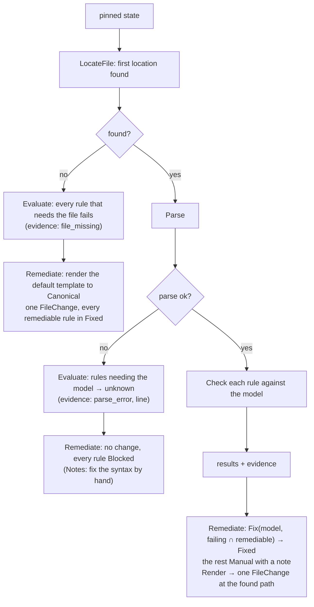

<!-- markdownlint-disable-file MD025 MD041 -->

# DESIGN-0031: Control framework: controls, control rules and file controls

<!--toc:start-->
- [Overview](#overview)
- [Goals and Non-Goals](#goals-and-non-goals)
  - [Goals](#goals)
  - [Non-Goals](#non-goals)
- [Background](#background)
- [Detailed Design](#detailed-design)
  - [Package layout](#package-layout)
  - [The interface](#the-interface)
    - [Supporting types](#supporting-types)
    - [Reader, PR observer and writer](#reader-pr-observer-and-writer)
  - [Rules and results](#rules-and-results)
  - [File controls](#file-controls)
  - [Built-in control types](#built-in-control-types)
    - [CODEOWNERS](#codeowners)
    - [Catalog info](#catalog-info)
    - [Dependency updates](#dependency-updates)
    - [Generic file (the escape hatch)](#generic-file-the-escape-hatch)
    - [API-remediated types](#api-remediated-types)
  - [The registry](#the-registry)
  - [Shared evaluation reads](#shared-evaluation-reads)
  - [Risks](#risks)
- [API / Interface Changes](#api--interface-changes)
- [Data Model](#data-model)
- [Testing Strategy](#testing-strategy)
- [Migration / Rollout Plan](#migration--rollout-plan)
- [Decisions](#decisions)
- [Adversarial Review](#adversarial-review)
  - [AR-0031-01 (critical): CODEOWNERS remediation orders the rules backwards](#ar-0031-01-critical-codeowners-remediation-orders-the-rules-backwards)
  - [AR-0031-02 (high): Owned resources and read dependencies are different sets](#ar-0031-02-high-owned-resources-and-read-dependencies-are-different-sets)
  - [AR-0031-03 (high): SHA-only reads cannot fingerprint or pin API resource state](#ar-0031-03-high-sha-only-reads-cannot-fingerprint-or-pin-api-resource-state)
  - [AR-0031-04 (high): Remediable is conditional, but the conformance guarantee is unconditional](#ar-0031-04-high-remediable-is-conditional-but-the-conformance-guarantee-is-unconditional)
  - [AR-0031-05 (high): Parser fallback cannot prove CODEOWNERS validity](#ar-0031-05-high-parser-fallback-cannot-prove-codeowners-validity)
  - [AR-0031-06 (high): API proposals and the client surface contradict the workflow design](#ar-0031-06-high-api-proposals-and-the-client-surface-contradict-the-workflow-design)
  - [AR-0031-07 (high): Missing catalog-info can leave stale managed properties indefinitely](#ar-0031-07-high-missing-catalog-info-can-leave-stale-managed-properties-indefinitely)
  - [AR-0031-08 (high): The proposed Go types form import cycles](#ar-0031-08-high-the-proposed-go-types-form-import-cycles)
  - [AR-0031-09 (medium): Framework results and input size need explicit validation](#ar-0031-09-medium-framework-results-and-input-size-need-explicit-validation)
- [Open Questions](#open-questions)
  - [OQ1: What does "pattern is owned by owners" mean for CODEOWNERS?](#oq1-what-does-pattern-is-owned-by-owners-mean-for-codeowners)
  - [OQ2: Can catalog-info remediation edit fields in an existing file?](#oq2-can-catalog-info-remediation-edit-fields-in-an-existing-file)
<!--toc:end-->

## Overview

A control is the expected state of one resource, and a control rule is one verifiable requirement of it. This document defines how controls are built in Go:

- the **`Control` interface**, with separate `Evaluate` (read-only) and `Remediate` (produces a change, writes nothing) methods, the two resource sets a control declares (`Owns`, `Reads`), and the types an evaluation and a change set are made of;
- **results**: how rule results combine into a control status, and what the framework validates before it derives one;
- **file controls**: the shared machinery to find, read, parse, render and edit a file, so each file kind's package contains only what is specific to that file;
- the **built-in control types**, starting with `codeowners`, the API-remediated types, and the generic `file` escape hatch.

Policies (who gets which control) are in DESIGN-0030. Running controls and applying their changes is in DESIGN-0032.

## Goals and Non-Goals

### Goals

- **All knowledge of a resource lives in one package.** For example, `internal/controls/codeowners` knows where GitHub looks for CODEOWNERS and how to write one; when DESIGN-0034 lands, the same package learns how to parse it and what "`.wiz` is owned by X" means.
- **Remediation is whole-control.** An absent file gets the full template, which satisfies every remediable rule at once. A present file gets the edits for exactly the failing rules, all in one change.
- **Evaluation cannot write.** `Evaluate` receives a reader with no write methods, enforced by the type system and backed by the Evaluation App (DESIGN-0032).
- **Remediation is a value.** `Remediate` returns a change set, and the workflow applies it. Controls stay testable without a GitHub fake that records writes.
- **Remediation is honest about what it fixed.** A change set names the failing rules it fixes (`Fixed`), the ones that need a human (`Manual`) and the ones the observed state blocks (`Blocked`), so a partial fix is reported rather than refused or claimed whole.
- **Built-in guarantees, tested per control type:**
  - remediating and re-evaluating passes every rule the change set reports as `Fixed`, and regresses no rule that passed before;
  - remediating twice changes nothing;
  - the default template passes every rule with `remediate = true`.

### Non-Goals

- **User-defined control types at runtime** (plugins, scripting). A control type is Go code and ships in a release.
- **Arbitrary assertions on arbitrary files.** The generic `file` control renders one template to one path. Anything requirement-level is a control type.
- **Applying changes.** Branches, commits and PRs belong to the remediation workflow (DESIGN-0032).

## Background

v1 evaluates rules with a generic mechanism (`exists` / `contains` / `exact` / `absent` plus regex and `yaml_path` assertions) and remediates by writing a rendered template to a target path. The engine knows nothing about the file it writes, and it evaluates each rule in isolation, so two rules on one file have no shared view of the result: one rule's cleanup could delete a file another rule still required. The catalog-info parser (`internal/catalog`) is the one place that understands a file's format, but only the `custom_properties` reconciler uses it.

## Detailed Design

### Package layout

```text
internal/control/              # the framework: interfaces, results, registry, file helpers
internal/control/controltest/  # the conformance suite every type runs
internal/controls/codeowners/
internal/controls/catalog_info/
internal/controls/dependency_updates/
internal/controls/file/        # the generic escape hatch
internal/controls/repo_settings/
internal/controls/branch_ruleset/
internal/controls/labels/
internal/controls/custom_properties/
```

`internal/control` is a dependency leaf (D17). It holds every value type a control produces or consumes (`Definition`, `Rule`, `RuleResult`, `Resource`, `ResourceRead`, `Evaluation`, `ChangeSet`, `FileChange`, `APIChange`), the `Type` and `Control` interfaces, the registry, and the consumer-side `Reader`, `PRObserver` and `Writer` interfaces with their value types (`RepositorySettings`, `Ruleset`, `Label`, `PullRequest`, `Commit`). It imports `internal/template` and nothing else of ours. `PRConfig` and `PRTemplate` move from `internal/policy` to `internal/template`, so a definition's `pr {}` block is a `template.PRConfig`. The edges, each enforced by a depguard rule:

```text
internal/template    ← control, policy, controls/*     (leaf: renderer, Vars, PRConfig)
internal/control     ← policy, github, controls/*, activities
internal/controls/*  ← activities                      (each type imports control and template only)
internal/policy      ← activities                      (imports control and template)
internal/github      ← activities                      (implements control.Reader, PRObserver, Writer)
internal/workflows   imports none of the above          (deterministic workflow code, as today)
```

The first draft had `control → github → control` (through `Writer.Commit`'s `FileChange` parameter) and `control → policy → control` (through `Definition.PR`), which Go cannot compile. A compiled skeleton of these packages is the first IMPL task, so the graph is a test rather than a diagram.

### The interface

```go
package control

// Type is a control type: Go code that knows one kind of resource.
// It validates a catalogue definition and builds a Control from it.
// One Type serves every catalogue version of its control; a version
// bump is catalogue data, not a new Type.
type Type interface {
    Name() string                                        // "codeowners"
    Semantics() int                                      // bumped when the evaluator's meaning changes; part of the revision digest (D19)
    RuleKinds() []RuleKindSpec                           // what rules a definition may declare, with their parameters
    Build(def Definition, env BuildEnv) (Control, error) // validates parameters at policy load; env carries templates and renderer
}

// Control is one catalogue definition, ready to run.
type Control interface {
    ID() ID            // {Slug: "codeowners", Version: 2}
    Owns() []Resource  // what it may write (DESIGN-0030 ownership); every ChangeSet is validated against it
    Reads() []Resource // what invalidates it: files read without owning, tree prefixes, every alternate location
    Rules() []Rule     // declared rules, in display order

    // Evaluate reads, never writes. The reader is pinned to one commit
    // of the default branch, or of a remediation PR's head (DESIGN-0032).
    Evaluate(ctx context.Context, in EvalInput) (Evaluation, error)

    // Remediate returns the change that makes the failing, remediable
    // rules pass where the observed state allows it, computed against
    // the same pinned state, and names the rules it could not fix.
    // It writes nothing.
    Remediate(ctx context.Context, in RemediationInput) (ChangeSet, error)
}
```

Two methods rather than one `Run(mode)` (D1), because the methods need different capabilities. `Evaluate` must be callable by a process that holds no write credentials. `Remediate` needs no credentials at all, because it returns a value.

`Owns` and `Reads` are different sets (D12). `Owns` is the write boundary: the framework rejects a `ChangeSet` that touches anything outside it before the change leaves `Remediate`, whatever the type returned. `Reads` is the invalidation set: every file the control reads without owning (`custom_properties` reads `catalog-info.yaml`), `tree:<prefix>` for a directory scan, and every alternate location of a file control including the ones that are absent, so that a higher-precedence file appearing (`.github/CODEOWNERS` above a root `CODEOWNERS`) invalidates a result read from the lower one. DESIGN-0032 selects controls on a push by matching the changed paths against `Owns ∪ Reads`. API resources have no push signal and are evaluated on the schedule.

#### Supporting types

```go
package control

// Definition is one catalogue entry after HCL decode and before Build:
// what the loader hands to Type.Build. It is data; the Control that
// Build returns is the behaviour.
type Definition struct {
    ID       ID
    Title    string
    Type     string            // the Type.Name() that builds it
    Rules    []Rule            // kinds and params validated by Type.Build; at least one
    Template string            // template store name; must pass every remediable rule
    PR       template.PRConfig // pr {} block: title, body, labels (DESIGN-0030); display-only, outside the revision
    Apply    string            // "recommend" (default) | "direct" | "workflow"; API-remediated types only (D15)
    Params   map[string]any    // type-level params: dependency_updates.tool, file.path, …
}

// BuildEnv is what Type.Build may depend on. It is passed explicitly so
// that no type reaches a package-level global for its templates (D17).
type BuildEnv struct {
    Templates TemplateSource     // the loaded template store, by name
    Renderer  *template.Renderer // the shared renderer (assumption A10)
}

// TemplateSource is the part of the template store Build needs.
type TemplateSource interface {
    Lookup(name string) (body string, ok bool)
}

// ID names one catalogue definition. Version is the integer the
// catalogue declares; policies reference it as "codeowners@2". Results
// bind to the revision digest, not to this pair (D19).
type ID struct {
    Slug    string
    Version int
}

// Resource is something exactly one active control may own, or that a
// control reads (DESIGN-0030). Kind is file, setting, ruleset, label,
// property or tree; Key is the path, property name, ruleset name, label
// name or directory prefix. Rendered as "file:.github/CODEOWNERS",
// "setting:delete_branch_on_merge" or "tree:.github/workflows".
//
// Keys are canonicalized by the framework, never by a type (DESIGN-0030
// AR-0030-02): a file path goes through path.Clean and is rejected when
// absolute, when it contains ".." or an empty segment, or when it starts
// with "./", then compares byte for byte as GitHub does; a label name is
// lower-cased because GitHub compares labels case-insensitively; the
// other kinds compare exactly. Ownership is whole-resource: there is no
// sub-field key. Keys are static per definition and never templated per
// repository.
type Resource struct {
    Kind string
    Key  string
}

// RuleKind is a check a Type offers, such as "exists" or "equals".
type RuleKind string

// RuleID is a rule's id: bare and unique within its control, matching
// ^[a-z][a-z0-9]*([_-][a-z0-9]+)*$, the same grammar as a control slug
// (DESIGN-0033 AR-0033-01).
type RuleID string

// RuleKindSpec is what a Type says about one of its kinds: the
// parameters it accepts and whether Remediate can fix it. The policy
// loader validates against it and the reference docs are generated
// from it, so the two cannot drift.
type RuleKindSpec struct {
    Kind       RuleKind
    Params     []ParamSpec
    Remediable bool // a rule of this kind may declare remediate = true
}

// ParamSpec is one parameter of a rule kind.
type ParamSpec struct {
    Name     string
    Type     string // "string", "bool", "list(string)", …
    Required bool
}

// Rule is one declared requirement of a control.
type Rule struct {
    ID        RuleID         // "no-wiki"; logs and the UI qualify it as repo_settings@1/no-wiki
    Number    string         // display only: "1.2"
    Title     string         // display only
    Kind      RuleKind       // one of Type.RuleKinds(); defaults to the id when the id names a kind
    Params    map[string]any // kind-specific, validated by Type.Build
    Remediate bool           // Remediate fixes this rule's failures when the observed state allows it (D14)
}

// RuleStatus is the outcome of one rule. The set is closed: the
// framework rejects any other value before deriving a control status.
type RuleStatus string

const (
    Pass          RuleStatus = "pass"
    Fail          RuleStatus = "fail"
    Error         RuleStatus = "error"          // could not be determined this run; transient, retried next run
    Unknown       RuleStatus = "unknown"        // cannot be determined until the input changes; not retried by itself
    NotApplicable RuleStatus = "not_applicable"
)

// RuleResult is one rule's outcome with its evidence. Evidence is typed,
// versioned and text-only (DESIGN-0027): scalars and arrays only, at most
// 16 KiB per rule, with evidence_kind and evidence_version always present
// (D18). The framework rejects anything else before status derivation.
type RuleResult struct {
    RuleID   RuleID
    Status   RuleStatus
    Evidence map[string]any
}

// ReadState is what an evaluation saw of one resource.
type ReadState string

const (
    Present   ReadState = "present"
    Absent    ReadState = "absent"
    ReadError ReadState = "error"
)

// ResourceRead records one resource the evaluation looked at (D13).
// A file read is pinned to the evaluated commit and its Digest is the
// blob SHA. An API read is a time-stamped observation: Digest is sha256
// over the canonical JSON of the observed value, Version carries the
// provider's ETag or updated_at where one exists, and ObservedAt is
// when it was fetched. An absent property and a present null value are
// different reads. DESIGN-0032's fingerprint is built from
// Evaluation.Results and Evaluation.Reads and from nothing else.
type ResourceRead struct {
    Resource   Resource
    State      ReadState
    Digest     string    // blob SHA for a file, sha256 of canonical JSON for an API value; empty when absent
    Version    string    // provider version (ETag, updated_at) where one exists
    ObservedAt time.Time // when an API resource was read; zero for a commit-pinned file
    Err        string    // why State is error
}

// Evaluation is what Evaluate returns. Validate checks it holds exactly
// one result per declared rule before StatusOf runs (D18).
type Evaluation struct {
    Results []RuleResult
    Reads   []ResourceRead
}

// RepoContext is the repository an evaluation runs against.
type RepoContext struct {
    Org           string
    Name          string
    DefaultBranch string
    SHA           string        // the pinned commit
    Vars          template.Vars // {{ .Org }}, {{ .Repo }}, …
}

// EvalInput is everything Evaluate may use.
type EvalInput struct {
    Repo   RepoContext
    Reader Reader // read-only; file reads pinned to Repo.SHA, every read cached
}

// RemediationInput is EvalInput plus the evaluation of the same state.
type RemediationInput struct {
    EvalInput
    Evaluation Evaluation
}

// FileChange is one file write or delete.
type FileChange struct {
    Path    string
    Content []byte // ignored when Delete is set
    Delete  bool
    Reason  string // missing | rule_failed:<rule id> | stale | orphan (DESIGN-0033 item 3; orphan is the bot's own obsolete delta on the proposal branch, never a default-branch file)
}

// APIChange is one direct change to a non-file resource.
type APIChange struct {
    Resource Resource
    Op       string // "set" or "delete"
    Value    any    // the resource kind's value type; nil clears
    Reason   string // as FileChange.Reason
}

// ChangeSet is what a remediation proposes (D14). Every failing rule of
// the control appears in exactly one of Fixed, Manual or Blocked: a
// Fixed rule passes once the change is applied; a Manual rule needs a
// human and has a note; a Blocked rule could not be remediated from this
// observation (an unparseable file, a prerequisite read that failed, a
// symlink or submodule at the path) and has a note. A change set with no
// Files and no API entries is a recommendation (DESIGN-0032).
type ChangeSet struct {
    Files   []FileChange // applied as one commit (DESIGN-0032); at most 100 files, 1 MiB each, regular files only
    API     []APIChange  // settings, rulesets, labels, properties; applied one resource at a time
    Fixed   []RuleID
    Manual  []RuleID
    Blocked []RuleID
    Notes   []string // manual steps for the rules in Manual and Blocked
}

// WorkflowApply is implemented by a Type whose API changes may be
// proposed with apply = "workflow" (D15): the remediation PR carries a
// workflow file that applies ChangeSet.API on merge. A control built
// from such a type with apply = "workflow" also owns
// file:.github/workflows/repo-guardian-<slug>.yml, so the Remediation
// App needs the Workflows: write permission, which GitHub requires for
// any write under .github/workflows/ (INV-0022). Today only
// custom_properties implements it.
type WorkflowApply interface {
    WorkflowFile(def Definition, changes []APIChange) (FileChange, error)
}
```

`template.Vars` is new: the variables a control template sees. It replaces `FileVars` for control code; the existing renderer is kept (assumption A10). `template.PRConfig` is the former `policy.PRConfig`, moved so that `control` need not import `policy` (D17). `Reason` on a change is not persisted; it feeds the PR body and the `repo-guardian evaluate --format json` preview (DESIGN-0032 D7).

Five functions belong to the framework rather than to any type, because both workflows must compute them the same way and no type may be trusted to validate itself:

```go
package control

// Validate checks an Evaluation before status derivation (D18): exactly
// one result per declared rule (a missing result becomes
// error{reason=missing_result} for that rule; a result for an undeclared
// id is a bug and fails the run), every status from the closed enum,
// evidence within its bounds. Both workflows call it; no type does.
func Validate(c Control, ev Evaluation) (Evaluation, error)

// StatusOf derives the control status from the rule results, in the
// order of the table under "Rules and results": any fail → non_compliant,
// else any error or unknown → unknown, else all not_applicable →
// not_applicable, else compliant.
func StatusOf(ev Evaluation) Status

// Fingerprint is what DESIGN-0032 compares between evaluations. It hashes
// the control revision, the sorted (rule id, status) pairs and the sorted
// (resource, state, digest) reads, and nothing else: not evidence wording,
// not timestamps, not the pinned commit. Because reads carry digests, an
// API value moving from one wrong value to another changes the
// fingerprint even when every rule status is unchanged (D13).
func Fingerprint(revision string, ev Evaluation) string

// Revision is the content digest results bind to (D19): sha256 over the
// canonical definition — id, version, type name, the type's Semantics,
// the rules with their parameters, apply, the template bytes and the
// bytes of every file the definition references. Title, description and
// the pr {} block are display-only and excluded, so a cosmetic edit
// changes nothing.
func Revision(t Type, def Definition, env BuildEnv) (string, error)

// ValidateChangeSet checks a ChangeSet before anything leaves Remediate
// (D18): unique paths, every path and API resource within c.Owns(), at
// most 100 files and 1 MiB per file (the limits of the commit mutation,
// DESIGN-0032 AR-0032-07), regular files only, and every failing rule of
// ev in exactly one of Fixed, Manual or Blocked.
func ValidateChangeSet(c Control, ev Evaluation, cs ChangeSet) error
```

#### Reader, PR observer and writer

Three interfaces, all scoped to one repository; the org and the installation are fixed when they are built. Controls receive only `Reader`. The evaluate activity and the remediation run use `PRObserver` for what they need to know about pull requests and branches. Only the remediator holds `Writer` (D7). All three are declared in `internal/control` and implemented by `internal/github` (D17), so the package that defines `FileChange` is the one that names the method taking it.

```go
package control

// Reader is everything a control may read. It has no write methods, and
// the Evaluation App's token backs it. File reads are pinned to one
// commit and cached, so every control in one evaluation sees the same
// tree. API reads (settings, rulesets, properties, labels, the org
// schema) are live observations: cached for the evaluation, but not
// atomic with the commit and not atomic with each other. Each read is
// recorded as a ResourceRead with its state and digest (D13).
type Reader interface {
    GetContents(ctx context.Context, path string) (content []byte, blobSHA string, found bool, err error)
    ListDirectory(ctx context.Context, path string) ([]string, error)
    GetRepository(ctx context.Context) (RepositorySettings, error)
    ListRulesets(ctx context.Context) ([]Ruleset, error)     // includes_parents=true, paginated, each fetched by id for its rules; Source from source_type: repository, organization or enterprise
    GetCustomProperties(ctx context.Context) (map[string]*string, error) // values; Metadata: read
    OrgPropertySchema(ctx context.Context) ([]string, error) // the property names the org schema defines; values only, never mutated
    ListLabels(ctx context.Context) ([]Label, error)
}

// PRObserver is what the workflows read about pull requests and
// branches. No control uses it. The Evaluation App's token backs it in
// the evaluate activity (PR observation, DESIGN-0032); the Remediation
// App's token backs it in the remediation run (find or adopt).
type PRObserver interface {
    ListPullRequests(ctx context.Context, headPrefix string) ([]PullRequest, error) // open PRs whose head branch starts with headPrefix; paginated to completion
    GetPullRequest(ctx context.Context, number int) (*PullRequest, error)           // with its authenticated author login and head repository id
    ListCommits(ctx context.Context, branch string) ([]Commit, error)
    GetRef(ctx context.Context, branch string) (sha string, exists bool, err error)
}

// Writer is what the remediation workflow applies a ChangeSet with.
// Controls never receive it. The Remediation App's token backs it.
type Writer interface {
    // Commit publishes changes as one commit on branch through GitHub's
    // createCommitOnBranch mutation with expectedHeadOid = baseSHA, so
    // GitHub itself rejects the write when the head is anything else: a
    // concurrent push, a rewind to an ancestor, a branch deleted and
    // recreated. It returns ErrExpectedHeadMismatch in that case (D8).
    // When the branch is absent it is created first through the REST ref
    // create, which fails if it already exists; the mutation itself needs
    // an existing branch. The commit is authored by the App and signed by
    // GitHub "if supported". The mutation has no file-mode field, so it
    // writes regular files only. It is GraphQL: the module has no GraphQL
    // client today, and its rate limit is a separate bucket (INV-0022).
    Commit(ctx context.Context, branch, baseSHA string, changes []FileChange, message string) (headSHA string, err error)
    CreateRef(ctx context.Context, branch, sha string) error                 // REST ref create; fails if the branch exists
    UpdateBranch(ctx context.Context, number int) error                      // GitHub's update-branch: merge the base into the PR head (DESIGN-0032 AR-0032-03)
    UpdatePullRequestBase(ctx context.Context, number int, base string) error // PATCH base when the default branch changes (DESIGN-0032 AR-0032-03)
    CreatePullRequest(ctx context.Context, head, base, title, body string) (*PullRequest, error)
    UpdatePullRequest(ctx context.Context, number int, title, body string) error
    ClosePullRequest(ctx context.Context, number int) error
    UpsertPRComment(ctx context.Context, number int, marker, body string) error
    UpdateRepository(ctx context.Context, settings RepositorySettings) error
    UpsertRuleset(ctx context.Context, rs Ruleset) error // repository-sourced rulesets only, by id
    SetCustomProperties(ctx context.Context, props map[string]*string) error
    UpsertLabel(ctx context.Context, l Label) error
    DeleteLabel(ctx context.Context, name string) error
}
```

`Reader` is the whole read surface a built-in type needs: file contents for every file control, directory listings for `dependency_updates`' location search, settings and rulesets for `repo_settings` and `branch_ruleset`, properties, the org property schema and labels for their types. The CODEOWNERS errors endpoint is not on it: it arrives with DESIGN-0034's `valid` rule, bound to the observed ref (D11). `PRObserver` is the whole read surface DESIGN-0032 needs beyond that: the open `repo-guardian/*` PRs and any tracked PR for observation, and the branch head and the PR's authenticated author for find or adopt; `ListPullRequests` paginates to completion and surfaces a failed page as an observation error, never as an empty list (DESIGN-0032 AR-0032-12). A 403 from one endpoint on a repository the Reader has already read at repository level is a control-local permission failure: the rule that needed it is `unknown{reason=permission}` whatever its kind, the rest of the evaluation proceeds, and the repository is never parked for it (DESIGN-0032 AR-0032-08). `Writer.Commit` is one commit per change set whatever the number of files, and the mutation's `expectedHeadOid` is the compare-and-swap that the REST ref update does not offer; the Contents API would be one commit per file, so a multi-file change set could be left half-applied. `Writer` carries one delete, `DeleteLabel` for a retired label. It has no `DeleteRef`: repo-guardian never deletes a branch, and cleaning up a finished branch is the repository's or the org's own setting, such as delete-branch-on-merge (*amended 2026-10-06, INV-0022*). `Ruleset` carries its id and `Source` so an inherited org or enterprise ruleset is never mistaken for a writable repository one.

*Amended 2026-10-06 (INV-0022).* Three facts about the read surface, checked against GitHub's documentation and the v2 client:

- **Rulesets** are listed with `includes_parents=true`, paginated to completion (go-github's `GetAllRulesets` returns 30 per page by default), and each is then fetched by id, because the list omits `rules`. `Source` comes from the API's `source_type`. The rc client passes `includes_parents=false` (`internal/github/client.go:653`), so inherited org and enterprise rulesets never appear and `unknown{reason=inherited}` could never fire; the adapter changes that.
- **Permissions for reads.** Listing and reading rulesets and reading custom property values need only Metadata: read. Creating, updating or deleting a ruleset needs Administration: write; writing property values needs repository Custom properties: write; `OrgPropertySchema` needs organization Custom properties: read. Pull requests read and write covers a PR's labels.
- **`Writer.Commit` is GraphQL.** `createCommitOnBranch` with `expectedHeadOid` is a real compare-and-swap (the schema describes `expectedHeadOid` as the commit "expected at the head of the branch prior to the commit"), but the module has no GraphQL client, and the throttle path knows only REST headers. The adapter adds a GraphQL client and the throttle classification for its rate limits (DESIGN-0032). The 100-file and 1 MiB limits AR-0031-09 adopts are not in the schema documentation; they are a phase-0 spike, together with the shape of the stale-head error.

### Rules and results

A rule is declared in the catalogue (DESIGN-0030) using a **rule kind** its control type provides, with parameters the type validates at load:

| Field | Meaning |
| ----- | ------- |
| `id` | stable slug, bare and unique within the control: `no-wiki`, matching `^[a-z][a-z0-9]*([_-][a-z0-9]+)*$`, the same grammar as a control slug (DESIGN-0033 AR-0033-01). Logs and the UI qualify it as `repo_settings@1/no-wiki` |
| `number`, `title` | display only: `1.1`, "The wiki is disabled". Rule numbers are a separate axis from the control's integer version |
| `kind` | a kind the type offers: `exists`, `equals`, `extends`, …, written `rule "<id>" { kind = "<kind>" }`. `kind` may be omitted only when the id equals a kind the type declares (`rule "exists" {}`); otherwise load fails with "rule <id>: kind is required" and a source location |
| parameters | kind-specific: `property`, `value`, `tool`, … |
| `remediate` | whether `Remediate` fixes this rule's failures (`remediate = true`); such a rule is **remediable**. Whether a particular observation can be fixed is reported per run by `ChangeSet.Fixed`, `Manual` and `Blocked` (D14) |

Evaluating a rule gives a **rule result**:

| Status | Meaning |
| ------ | ------- |
| `pass` | the requirement holds |
| `fail` | the requirement does not hold |
| `error` | could not be determined this run (API error, timeout). Transient: the next run retries it |
| `unknown` | cannot be determined until the input changes (an unparseable file the rule needs, a capability the provider does not offer, a ruleset inherited from the org, a permission the App lacks for that one resource). Retried only when something changes |
| `not_applicable` | the rule does not apply to this repository (for example a rule about a language the repository does not use) |

The brief's model is binary: every rule true means compliant, any rule false means non-compliant. `error`, `unknown` and `not_applicable` are an intentional extension of it. An API error or an unparseable file is not a failure, and reporting it as one would make transient trouble look like drift and send remediation after it; a rule that does not apply must count neither for nor against the repository. `unknown` is split from `error` (D14) so that a run can tell "try again" from "wait for the input to change": a parse error on a file nobody has touched will not resolve itself, and retrying it every run would only burn budget.

Each result carries **evidence**: typed, versioned, and text-only, the same contract the v2 UI already renders (DESIGN-0027). Evidence is scalars and arrays only, at most 16 KiB per rule, and always carries `evidence_kind` and `evidence_version` (D18); "text-only" alone did not make it bounded.

Before the status is derived, the framework validates the evaluation with `Validate` (D18): exactly one result per declared rule, so a missing result becomes `error{reason=missing_result}` for that rule and a result for an undeclared id fails the run as a bug; statuses are the closed enum above; evidence is within its bounds. A definition with no rules is a load error. An omitted failing rule or an empty result slice therefore cannot read as an accidental `compliant` or `not_applicable`.

The **control status** is derived from the rule results, in this order:

| Rule results | Control status |
| ------------ | -------------- |
| any `fail` | `non_compliant` |
| no `fail`, any `error` or `unknown` | `unknown` |
| all `not_applicable` | `not_applicable` |
| otherwise (every rule `pass` or `not_applicable`) | `compliant` |

`fail` outranks `error` and `unknown` deliberately. A control with one definite failure is non-compliant whatever its other rules could not determine, and that is what remediation acts on. An `error` or an `unknown` never triggers remediation by itself (DESIGN-0032), and a proposed write whose prerequisite read failed is returned as `Blocked`, never attempted (DESIGN-0032 AR-0032-08).

### File controls

Most controls own a file. The framework provides the shared parts, so a control type writes only what is specific to its file:

```go
package control

// FileSpec describes the file a file control owns.
type FileSpec struct {
    Locations []string // in the precedence GitHub (or the tool) uses; first found wins
    Canonical string   // where a new file is created
}

// LocateFile finds the file a tool would actually use. Every location is
// recorded as a ResourceRead, the absent ones included.
func LocateFile(ctx context.Context, r Reader, spec FileSpec) (path string, content []byte, found bool, err error)
```

A file control owns `file:<location>` for every location in its `FileSpec`, so a generic `file` control on any of those paths collides with it at policy load. It also lists every location in `Reads()`, the absent ones included, so a file appearing at a higher-precedence location invalidates a result that was read from a lower one (D12).

A file control type implements three things:

1. **Parse(content) → model.** For example, catalog-info's YAML node tree, or a Renovate JSON config as a node-preserving tree (D5).
2. **Check(model, rule) → result.** One rule kind, evaluated against the parsed model.
3. **Fix(model, failing rules) → model, and Render(model) → content.** Edits that leave unrelated lines byte-identical.

The framework turns those into `Evaluate` and `Remediate`:



The framework's rules for file remediation:

- **An absent file gets the template.** The template must pass every remediable rule of the control; that is tested at load and in the conformance suite (D2), so one write fixes everything the control can fix. Templates are rendered with the existing `internal/template` renderer (assumption A10).
- **A present file is edited at the path where it was found,** never moved to `Canonical`. Moving a working file is not a remediation anyone asked for.
- **An unparseable file is never overwritten.** Its rules report `unknown{reason=parse_error}`, which stands until the file changes; every rule is `Blocked` and remediation adds a manual note. Replacing a broken file with a template would discard whatever the team meant to write (the INV-0011 A1 principle).
- **Edits are minimal.** `Fix` changes only what failing rules require, as source-span edits on the original bytes, and `Render` must round-trip untouched content byte-for-byte. A property test enforces this per type, byte-exact, rather than assuming a node encoder preserves formatting (D18). Parsers carry a size cap.
- **Remediation may be partial, and says so.** A change set fixes what the observed state allows and reports the rest in `Manual` or `Blocked` with a note: `dependency_updates` deletes a Dependabot config and notes a JSON5 preset in the same run (D14). A change set with notes and no changes is recorded as a recommendation and is not retried until the generation changes (DESIGN-0032 AR-0032-11).

### Built-in control types

#### CODEOWNERS

This version is deliberately v1's check and nothing more: a CODEOWNERS file exists in one of GitHub's standard locations, and when it does not, the PR adds the operator's template. Ownership rules (which owners a pattern must have, effective ownership under last-match-wins, the CODEOWNERS errors endpoint) are **deferred to DESIGN-0034** and are not decided; repo-guardian is not the first tool to reach for that workflow today, and the control grows into it when a team needs it (D11).

| Aspect | Behaviour |
| ------ | --------- |
| Locations | `.github/CODEOWNERS`, `CODEOWNERS`, `docs/CODEOWNERS`; the first found is the one GitHub uses (assumption A21) |
| Owns | `file:.github/CODEOWNERS`, `file:CODEOWNERS`, `file:docs/CODEOWNERS` |
| Reads | the same three paths, absent ones included, so a `.github/CODEOWNERS` appearing above a root `CODEOWNERS` invalidates the result read from the root (D12) |
| Model | the file as text; this version does not parse entries |
| Rule kind `exists` | a CODEOWNERS file is found at one of the locations and has at least one non-comment, non-blank line. The only rule kind in this version |
| Fix | write the operator's `codeowners` template to `.github/CODEOWNERS` when no location has a file, as v1's `target` does today (`exists` in `Fixed`); an existing file is never edited, so with a file present the change set is empty |
| Template | the operator's `codeowners` template, a file under the policy root (DESIGN-0030), not under v1's separate `TEMPLATE_DIR` mount, so it is hashed into the revision with everything else the definition references; the embedded `codeowners.tmpl` (`* @org/CHANGEME` with a comment telling the team to replace it) is the fallback when the operator supplies none, as in v1. How templates are sourced under the policy root, and what the fallback contributes to the revision, is a phase-0 spike (*amended 2026-10-06, INV-0022*) |

Under this type: with no CODEOWNERS the template is written; with any CODEOWNERS present the control passes and never touches the file; an org that does not get the control is never evaluated there (DESIGN-0030), so it cannot touch the file either.

#### Catalog info

- **Locations:** `catalog-info.yaml`, `catalog-info.yml`. Owns `file:catalog-info.yaml`, `file:catalog-info.yml`; reads the same two paths.
- **Model:** `internal/catalog`'s parse (assumption A11), extended to keep the YAML node tree and source spans for minimal edits.
- **Rule kinds:**
  - `exists` and `kind` (the entity is a Component): remediable, the template satisfies both;
  - `field_set` (`spec.owner`, `spec.system`, …), optionally with a `contains`, `annotation_set` and `no_placeholders`: `remediate = false`. A template cannot know a repository's owner or system, and a placeholder that satisfies `field_set` is exactly what `no_placeholders` exists to catch.
- **Remediation:**
  - an absent file gets the template, which passes `exists` and `kind` (both in `Fixed`) and leaves the field rules in `Manual` with `Notes` until a human fills the PR in;
  - a present file gets no automatic remediation, because a filled-in catalog-info is owned by its team, and a failing field needs a human value. Every failing rule goes to `Manual` with a note, including `kind` on a present non-Component file: the kind is remediable as a capability, but not for this observation (D14). An unparseable file puts every rule in `Blocked`.
  - Field-level fixes are not allowed (OQ2, D9).

#### Dependency updates

One control for one opinion, which replaces v1's `renovate_config` and `dependabot` rules and the `when` gate between them:

- **Parameters:** `tool = "renovate" | "dependabot"`, and `renovate.extends = "github>org/preset"`.
- **Locations, owned as `file:<path>` and read as the same set:**
  - Dependabot: `.github/dependabot.yml`, `.github/dependabot.yaml`;
  - Renovate: `renovate.json`, `renovate.json5`, `.renovaterc`, `.renovaterc.json`, `.renovaterc.json5`, `.github/renovate.json`, `.github/renovate.json5`.
  - The `renovate` key of `package.json` is read, never owned: ownership is whole-resource (DESIGN-0030 AR-0030-02), and this control does not own a team's `package.json`. `file:package.json` is in `Reads()` only, so a `package.json` edit re-selects the control; when that key carries the other tool's config, `exclusive` fails non-remediably with a note naming it instead of editing the file.
- **Rule kinds:**
  - `configured` (the chosen tool's config exists);
  - `extends` (the Renovate config extends the preset);
  - `exclusive` (the other tool's config is absent).
- **Remediation:** write the chosen tool's config from its template, add the preset to `extends` in an existing Renovate config (JSON only; JSON5 gets a note, D5), and delete the other tool's config. All of it is one change set: one PR, with no loop possible. The change set is allowed to be partial (D14): with a Dependabot file and a JSON5 Renovate config missing the preset, one run deletes the Dependabot file (`exclusive` in `Fixed`) and notes the preset (`extends` in `Manual`).

#### Generic file (the escape hatch)

- **Parameters:** `path`, `template`, `mode`, where `mode` is exactly one of `exists` | `exact`.
- **Rules:**
  - `exists`: the file is present;
  - `exact`: the file equals the rendered template (YAML-semantic comparison for `.yml`/`.yaml`, byte comparison otherwise, as v1).
- **One mode, never both.** `exact` subsumes existence, because an absent file is never equal to the template, so declaring both would be redundant and would put two rules on one path. There is no `contains` (D6).
- **Remediation:** write the template (`exists` or `exact` in `Fixed`).
- **Owns `file:<path>`, and reads the same path.** That is one path and one owner, so a requirement-level check on that file means writing a control type.

#### API-remediated types

`repo_settings`, `branch_ruleset`, `labels` and `custom_properties` remediate through `ChangeSet.API`, not files. Each declares the resources it owns, so two definitions that manage the same label or property collide at policy load like two file controls on one path. API resources have no push signal: their `Reads` carry nothing a push can match, and the controls are evaluated on the schedule (D12). Their reads are live observations, digested and time-stamped rather than commit-pinned (D13). The one-commit atomicity guarantee is for files only; API changes are applied one resource at a time as read, write, read back, each journaled, with a failure part-way left visible rather than hidden (DESIGN-0032 AR-0032-10).

**Repository settings** (`repo_settings`)

| Aspect | Behaviour |
| ------ | --------- |
| Owns | `setting:<property>` for each property the definition names (`delete_branch_on_merge`, `allow_merge_commit`, …) |
| Reads | none with a push signal; evaluated on the schedule |
| Rule kind `equals` | the property has the declared value |
| Fix | `APIChange{setting:<property>, set, value}` |

**Branch ruleset** (`branch_ruleset`)

| Aspect | Behaviour |
| ------ | --------- |
| Owns | `ruleset:<name>`, resolved at evaluation to the repository-sourced ruleset of that name by its id |
| Reads | none with a push signal; evaluated on the schedule. The list is read with `includes_parents=true` and paginated, and each ruleset is fetched by id for its rules, so an inherited ruleset is seen and classified by `source_type` (*amended 2026-10-06, INV-0022*). Reading needs Metadata: read; writing needs Administration: write |
| Rule kind `exists` | a repository-sourced ruleset with that name is present and active |
| Rule kind `matches` | its rules equal the declared ruleset (YAML-semantic comparison, as v1). A ruleset of that name whose `Source` is the organization or the enterprise is never written: both rules are `unknown{reason=inherited}` with a note, because the repository object cannot change inherited policy and overwriting a same-named repository ruleset would not either |
| Fix | `APIChange{ruleset:<name>, set, ruleset}`, one upsert by id |

**Labels** (`labels`)

| Aspect | Behaviour |
| ------ | --------- |
| Owns | `label:<name>` for every label the definition manages, including the ones it retires; names are lower-cased for comparison because GitHub's are case-insensitive. How GitHub's create and update calls treat a name differing only in case is a phase-0 spike (*amended 2026-10-06, INV-0022*) |
| Reads | none with a push signal; evaluated on the schedule |
| Rule kind `present` | the label exists with the declared colour and description |
| Rule kind `absent` | a retired label is gone |
| Fix | `APIChange{label:<name>, set, label}` or `APIChange{label:<name>, delete, nil}`, the latter applied through `Writer.DeleteLabel` |

**Custom properties** (`custom_properties`)

| Aspect | Behaviour |
| ------ | --------- |
| Owns | `property:<key>` for every property the definition declares: the built-in `Owner` (source `spec.owner`) and `Component` (source `metadata.name`), plus each `annotation_properties` entry. Each property is repo-guardian's own definition with five facts — `source` (a catalog-info path or an annotation key), `normalize` (for example stripping a Backstage `group:default/` prefix), scope, rendered key and value pattern (DESIGN-0033 D6); a property without a source never enters the managed set, so adding one can never clear anything. Duplicate rendered keys are load errors. With `apply = "workflow"` the control also owns `file:.github/workflows/repo-guardian-custom_properties.yml` (D15) |
| Reads | `file:catalog-info.yaml`, `file:catalog-info.yml`, read through the shared reader and not owned, so a catalog edit selects this control as well as `catalog_info` (D12) |
| Rule kind `matches` | the property equals the value derived and normalized from `catalog-info.yaml`. The source state decides the outcome (D16): a valid Component with a mapped annotation removed → `fail`, remediable clear of that property; the catalog file absent → `fail` for the whole managed set, remediable clear (v1's clear-on-file-removal, so stale values cannot outlive their source); an unparseable file → `unknown{reason=parse_error}`, every value retained, `CatalogParseFailedTotal` increments, nothing written (IMPL-0020 A1); a valid non-Component entity → `not_applicable` with `entity_kind` in the evidence, every value retained, because a System or Resource entity is legitimately outside this control |
| Rule kind `value_pattern` | the normalized source value matches the property's declared pattern; `remediate = false`. A failure blocks the write of that one property and nothing else |
| Rule kind `defined` | the org schema defines the property; `remediate = false`. A property the schema does not define is never written, as v1's preflight already does; on a user-owned repository, which has no schema, the rule is `not_applicable` (D10) |
| Fix | `APIChange{property:<key>, set, value}`, with a nil value to clear. Every write is gated on its own property, independently of the control's aggregate status: a valid, normalized source value (or a deliberate clear from a valid or absent source) and a key the org schema defines. A property that fails either gate is `Blocked` with a note while the rest of the payload still syncs |

Each carries `remediation { apply = "recommend" | "direct" | "workflow" }` in its catalogue definition, default `recommend`, one vocabulary with DESIGN-0032 (D15). Under `recommend` the change is recorded as a recommendation with its before and after values and nothing is written to GitHub. Under `direct` the remediator applies it through `Writer`, one resource at a time, read, write, read back, and journaled per resource (DESIGN-0032 AR-0032-10); whether `direct` is allowed in `remediate` mode is DESIGN-0032 OQ4, and App permissions are per installation, so that opt-in narrows what repo-guardian does, not what its App may do. Under `workflow`, v1's `github-action` mode, the remediation PR carries a workflow file that applies the change on merge; the file is `.github/workflows/repo-guardian-<slug>.yml`, the control owns it like any other file, and only a type that implements `WorkflowApply` accepts the value, today `custom_properties`. GitHub gates every write under `.github/workflows/` on the Workflows permission, so an install with any `workflow` control grants the Remediation App Workflows: write (*amended 2026-10-06, INV-0022*). There is no `pr` value: a PR that proposes an API change is `workflow`, and a change that is only reported is `recommend`. The self-check after `Remediate` runs `Evaluate` against an overlay of the intended API state, and a direct apply reads each resource back and compares before success is recorded (D13).

### The registry

```go
control.Register(codeowners.Type{})
```

At policy load, every catalogue definition is decoded into a `Definition` and passed to its type's `Build` together with a `BuildEnv` holding the template store and the renderer, so no type reaches a global (D17). `Build` validates rule kinds and parameters against the type's `RuleKindSpec`s and compiles templates. Load fails on unknown types, unknown rule kinds, bad parameters, a definition with no rules, an `apply` value the type does not support (`workflow` on a type without `WorkflowApply`), or a template that fails its own remediable rules. The template check renders the template with the type's sample variables (org `example-org`, repository `example`) and evaluates the control against the output; it runs at load and again in the conformance suite (D2). A template whose output depends on real repository data is caught by the runtime self-check: after `Remediate`, the workflow evaluates the changed content — for an API change set, an overlay of the intended API state (D13) — and refuses a change under which a rule in `Fixed` does not pass or a rule that passed before regresses (D14, DESIGN-0032).

A definition's version is part of its `ID`. The same `Type` builds `codeowners@1` and `codeowners@2`, so bumping a version is a catalogue change, not a release. The version is the reference humans and policies write; the identity results bind to is the **revision** (`Revision`, D19): sha256 over the canonical definition — id, version, type name, the type's `Semantics`, the rules with their parameters, `apply`, the template bytes and the bytes of every file the definition references — with title, description and the `pr {}` block excluded as display-only. A type whose evaluator changes meaning bumps its `Semantics` constant, and a golden digest test per built-in type pins the value so an accidental change fails CI. A revision change is a policy-version change: DESIGN-0030 stores the digest on assignments and results, and DESIGN-0032 re-evaluates and re-remediates even an acknowledged generation when it moves, while a title edit changes nothing.

### Shared evaluation reads

Several controls read the same data. For example, `catalog_info` and `custom_properties` both read `catalog-info.yaml`: the first owns it, the second lists it in `Reads()`. The evaluation workflow gives every control in one evaluation the same `Reader`, which is pinned to one SHA for files, caches every read, and records each as a `ResourceRead` with its state and digest (D13). Each file is fetched once per evaluation, whatever the number of controls. DESIGN-0032's push selection matches the changed paths against `Owns() ∪ Reads()`, so a catalog edit selects both controls (D12); API resources have no push signal and are evaluated on the schedule. Controls stay independent: none reads another control's *results* (D4).

### Risks

- **CODEOWNERS is existence-only in this version.** A file that exists but names no valid owner passes `exists`; ownership, ordering under last-match-wins and validity are DESIGN-0034's scope, deferred, and the risks that came with them (fix ordering, the errors endpoint) moved there.
- **A template can pass the sample-variable check and fail on a real repository.** The runtime self-check after `Remediate` is the backstop, and it costs one extra evaluation per remediation; for an API change set it evaluates an overlay of the intended state, which is a model of GitHub rather than GitHub.
- **API reads are observations, not a snapshot.** Settings, labels, rulesets and properties cannot be pinned to a commit; two reads in one evaluation can straddle a human edit, and a direct apply can race one. The digest on every read and the read-back after a direct apply bound the damage (D13); nothing makes it atomic.
- **`apply = "direct"` has no review step.** DESIGN-0032 OQ4 decides whether it is allowed at all.
- **`apply = "workflow"` puts a workflow in the repository.** It runs with the repository's own `GITHUB_TOKEN` on merge, so it is an owned file that collides at load like any other, and property values reach it only through the IMPL-0020 A2 env-indirection shape, never inline.
- **Partial remediation can look like progress forever.** A change set whose `Manual` set never empties is a recommendation after its first run and is not retried until the generation moves (D14); the posture shows the control non-compliant with its notes, which is the intended signal, not a loop.
- **Minimal-edit source-span editors** for YAML and JSON are the hardest code in the set, and the byte-exact tests are what make them trustworthy. D5 keeps JSON5 out of it.
- **The leaf package layout touches v1 code.** Moving `PRConfig` to `internal/template` and the GitHub interfaces into `internal/control` reaches into packages v1 still uses until Phase 16 retires them; the depguard edges keep the graph honest while both coexist (D17).

## API / Interface Changes

- New packages `internal/control`, `internal/control/controltest` and `internal/controls/*`. `internal/control` is a dependency leaf holding the value types, the registry and the consumer-side interfaces; `internal/github` implements them, `internal/policy` imports `control` and `template`, `internal/activities` imports all of them and `internal/workflows` imports none, each edge a depguard rule (D17).
- `control.Reader`, `control.PRObserver` and `control.Writer` as defined above, with their value types (`RepositorySettings`, `Ruleset` with id and `Source`, `Label`, `PullRequest`, `Commit`). They replace the single `github.Client` for control, evaluation and remediation code (assumption A12). `Reader` carries `OrgPropertySchema`; `Writer` carries `DeleteLabel` and no `DeleteRef` (repo-guardian never deletes a branch), and its `Commit` is GitHub's `createCommitOnBranch` mutation with `expectedHeadOid`, returning `ErrExpectedHeadMismatch` (D8), which adds a GraphQL client to the module (INV-0022).
- `PRConfig` and `PRTemplate` move from `internal/policy` to `internal/template` (D17). `template.Vars`, the variables a control template sees, is new. `template.PRVars` gains `.Control` (`Slug`, `Version`, `Title`), `.Fixed` and `.Manual` (each a `[]RuleView` of `ID`, `Number`, `Title`: the rules the PR fixes and the rules it leaves to a human, from `ChangeSet`) and `.Notes` for the `pr {}` title and body.
- `Type.Semantics()` and `control.Revision` (D19); `Control.Owns()` and `Reads()` (D12); `ResourceRead{State, Digest, Version, ObservedAt, Err}` (D13); `RuleStatus` `unknown` and `ChangeSet.Fixed/Manual/Blocked` (D14); `control.Validate` and `control.ValidateChangeSet` (D18). DESIGN-0032 consumes all of these: the fingerprint takes the revision and the digests, push selection takes `Owns ∪ Reads`, the self-check takes `Fixed`, recommendation handling takes a notes-only change set.
- `apply = "recommend" | "direct" | "workflow"` on API-remediated definitions, default `recommend`; `pr` is not a value (D15). `WorkflowApply` is the optional interface a type implements to accept `workflow`.
- Catalogue HCL as in DESIGN-0030; control slugs and rule ids share the grammar `^[a-z][a-z0-9]*([_-][a-z0-9]+)*$`, and `kind` defaults to the rule id only when the id names a kind the type declares (DESIGN-0033 AR-0033-01). Rule kinds and parameters per type are documented from the types' own metadata (`RuleKinds()` returning `RuleKindSpec`), so the docs cannot drift from the code.

## Data Model

Controls are stateless. Results and evidence are persisted by the evaluation workflow (DESIGN-0032): `rule_results` is keyed `(repository_id, control_id, rule_id)` with the bare rule id, and `control_results` carries the integer `control_version` and the `revision` digest, the same digest DESIGN-0030 stores on `control_assignments` (D19), so a historical result names the definition and evaluator that produced it. Evidence is versioned JSON per `(control type, rule kind)`, bounded at 16 KiB per rule with `evidence_kind` and `evidence_version` required (D18), and the UI renders only versions it knows (the v2 evidence contract). The reads behind a fingerprint are not stored; the fingerprint is, and it is computed over their digests (D13). A `ChangeSet`'s `Fixed`, `Manual` and `Blocked` sets are persisted with the remediation that proposed them (DESIGN-0032), so the UI can show what a PR fixes and what it leaves to a human.

## Testing Strategy

Per control type, in its own package:

1. **Fixture tables:** repository states (no file, each location, each rule passing or failing, unparseable, multiple locations) × rules → expected results and evidence. `custom_properties` ships one fixture per source state — a mapped annotation removed, the catalog file absent, a malformed file, a non-Component entity — asserting the exact per-property writes or the deliberate retention, with the evidence that explains each (D16).
2. **Remediation property:** for every fixture, with `cs = remediate(state)` and `after = evaluate(apply(state, cs))`:

   ```text
   every rule in cs.Fixed passes in after
   no rule that passed in evaluate(state) fails in after
   every failing rule of evaluate(state) is in exactly one of cs.Fixed, cs.Manual, cs.Blocked
   cs.Manual and cs.Blocked are each explained by a note
   ```

   Partial remediation is therefore a passing case, not a failing one (D14): the malformed-file, non-Component-catalog and JSON5-plus-Dependabot fixtures run through this property with their rules in `Blocked` or `Manual`, and a notes-only change set must not be retried against an unchanged generation.

3. **Idempotence:** `remediate(apply(state, remediate(state)))` is an empty change set.
4. **Minimal edits:** untouched bytes are identical after `Fix`/`Render`, tested byte-exact against source spans rather than inferred from a node encoder (D18). Round-trip fuzzing of the parser (`Render(Parse(x)) == x`) covers this for every input the parser accepts, and every parser is tested at its size cap.
5. **Template passes its rules:** the default template (and any operator template in tests) evaluated with sample variables passes every remediable rule of the control.
6. **Two rules failing together:** every file type with more than one remediable rule kind ships a fixture where two of them fail at once (for `dependency_updates`, `configured` and `extends`, or `configured` and `exclusive`), and the remediated file must pass both. This is the test for the ordering class of bug; CODEOWNERS joins when DESIGN-0034 adds its ownership rules.
7. **Framework tests:** `LocateFile` precedence with every location recorded as a read; control-status derivation (every row of the table, `unknown` included); `Validate` against a missing result, a duplicate, an undeclared id, an unrecognised status and oversized or nested evidence; `ValidateChangeSet` against a duplicate path, a path outside `Owns()`, too many files, an oversized file, and a symlink or submodule at the path (which must land in `Blocked`); resource-key canonicalization (`.github/./CODEOWNERS` equals `.github/CODEOWNERS`, `../x` and `/x` are rejected, label names compare case-insensitively); and registry validation errors (unknown type, unknown kind, empty definition, unsupported `apply`). Recording and writing must fail safely with bounded diagnostics.
8. **Revision golden:** per built-in type, a golden `Revision` digest for a fixed definition. Editing the title, description or `pr {}` block leaves it unchanged; changing a rule parameter, a template byte, `apply` or the type's `Semantics` moves it (D19).
9. **Fingerprint over digests:** a label colour or a custom property moving from one wrong value to another with every rule status unchanged changes the fingerprint; an absent property and a present null value produce different reads (D13).
10. **Package graph:** a compiled skeleton of `internal/control`, `internal/controls/codeowners`, the `internal/github` adapter and the `internal/policy` loader, plus a depguard rule per edge that fails on either of the first draft's cycles (D17).

A shared conformance suite (`control/controltest`) runs properties 2–6 against any type given its fixtures. A new control type gets them by adding fixtures.

Resource-ownership collisions between controls are not this suite's job. They are a property of a policy, not of a type, and DESIGN-0030 catches them twice: a conservative pairwise warning at load and the fail-closed runtime check over the union of `Owns()` per repository (DESIGN-0030 AR-0030-01). What this suite does own is the write boundary of a single control: a change set that steps outside its own `Owns()` fails `ValidateChangeSet` here, whatever the policy says.

## Migration / Rollout Plan

Before any type, the package skeleton: `internal/control` with its value types, interfaces and registry, the `internal/github` adapter and the `internal/policy` loader edge, compiled with the depguard rules in place (IMPL phase 0.5, D17). A graph that does not compile is found there, not under the first control.

Phase 0 also carries the spikes INV-0022 raised for this design: `createCommitOnBranch`'s stale-head error and its file-count and size limits; that the Evaluation App's Metadata-only reads return rulesets with `source_type` and `rules`, and custom property values; label-name case handling on create and update; and template sourcing under the policy root.

The order in which types are built:

1. `codeowners` (existence plus template): the simplest file control and the reference implementation; its ownership rules are DESIGN-0034, deferred.
2. `file`.
3. `catalog_info`.
4. `dependency_updates`.
5. The API types.

The first evaluate-only rc needs only the types that v1's built-in defaults cover.

## Decisions

Former open questions this document settles.

- **D1 `Evaluate` + `Remediate`, not one `Run(mode)`** — two methods, with `Remediate` returning a `ChangeSet`. The type system enforces the capability split: evaluation workers call a method whose inputs hold no writer, and remediation is a pure function of state. A single `Run(ctx, mode, client)` needs a client capable of both, and a `Remediate` that writes through a `Writer` re-creates per-control commit logic and partial applies.
- **D2 The template check runs at load and in the conformance suite** — the template is rendered with the type's sample variables and the control is evaluated against the output; load fails at deploy, the suite fails in CI, and the runtime self-check after `Remediate` covers templates that depend on real repository data.
- **D3 `valid` is a separate CODEOWNERS rule kind** — *moved 2026-10-04 to DESIGN-0034.* GitHub's errors endpoint reports unknown owners and bad patterns; a separate kind leaves `exists` cheap and lets a policy choose. This version's `codeowners` has no `valid` (D11).
- **D4 Controls share reads, never results** — one cached reader per evaluation; `custom_properties` parses `catalog-info.yaml` itself through the shared parser. Evaluation order never matters, and one control's failure cannot cascade into another. Explicit dependencies would introduce a graph and order-dependent results.
- **D5 JSON Renovate configs get minimal edits; JSON5 gets a note** — a node-preserving JSON encoder for `.json`; a JSON5 `extends` failure becomes a manual note instead of rewriting a team's commented file through a JSON encoder.
- **D6 The generic `file` control is `exists` or `exact` only** — no `contains` and no `absent`. Anything that inspects inside a file is, by definition, a control type, and "this path must not exist" belongs to a type that knows why the file is forbidden.
- **D7 Three GitHub interfaces** — `Reader` is exactly what a control may read, `PRObserver` is what the workflows read about pull requests and branches, `Writer` is what the remediator applies. Putting PR reads on `Reader` would hand controls a surface none of them uses, and leaving them out left DESIGN-0032's PR observation and find-or-adopt with no method to call.
- **D8 `Writer.Commit` through GitHub's `createCommitOnBranch` mutation** — one commit per change set with `expectedHeadOid = baseSHA`, so GitHub itself rejects the write when the head is anything else (a concurrent push, a rewind to an ancestor, a branch deleted and recreated) and `Commit` returns `ErrExpectedHeadMismatch`; the branch is created through the REST ref create, which fails if it already exists, and the commit is authored by the App and signed by GitHub. *Amended 2026-10-04 (DESIGN-0032 AR-0032-07):* the first draft used the git-data API with a non-forced ref update and called that compare-and-swap, which it is not — the REST ref update has `sha` and `force` but no expected-old-SHA field, so a ref rewound to an ancestor would still fast-forward onto the bot's prepared commit. The Contents API is one commit per file, so a multi-file change set could be half-applied and the "nothing is half-applied, nothing is overwritten" guarantee in DESIGN-0032 would not hold. *Amended 2026-10-06 (INV-0022):* the compare-and-swap is confirmed against GitHub's GraphQL schema, with four consequences the first amendment did not state: the mutation is GraphQL, so the module gains a GraphQL client and the throttle path gains GraphQL rate-limit classification (DESIGN-0032); it needs an existing branch, hence the ref create first; it writes regular files only; and GitHub signs the commit only "if supported". The file-count and size limits and the stale-head error shape are a phase-0 spike.
- **D9 catalog-info remediation creates only** — the `catalog_info` control creates `catalog-info.yaml` from the template when it is absent and never edits fields in an existing file; a failing field becomes a manual note in the PR or the report (OQ2, resolved 2026-10-04). Field values need human knowledge, and inventing them produces plausible wrong data.
- **D10 Organisation-only resources on user-owned repositories are `not_applicable`** — a repository whose installation account is a user rather than an organisation has no teams and no custom property schema. A rule whose resource GitHub cannot provide there (a `property:<name>` today; DESIGN-0034's team owners when it lands) evaluates `not_applicable` with `account_type = user` in the evidence, so a personal-account installation (DESIGN-0030 D11) is measurable without failing every repository on features it cannot have. A policy written for a personal account names users (`@login`) as owners; the repository rulesets GitHub does offer on user accounts evaluate normally.
- **D11 CODEOWNERS is existence plus template in this version** — `codeowners` has one rule kind, `exists`, remediated by writing the operator's template when no standard location has a file: exactly v1's behaviour. Ownership rules (`owners`, `default_owner`), the `valid` rule, the local matcher and effective-ownership semantics are deferred to DESIGN-0034 and are not decided. repo-guardian should not be the first option used for that workflow; it will be used for a much more in-depth CODEOWNERS control later, and deferring keeps this version's control trivially correct (OQ1, deferred 2026-10-04). *Amended 2026-10-06 (INV-0022):* the operator's template is a file under the policy root, not under v1's `TEMPLATE_DIR`, and the embedded `codeowners.tmpl` is the fallback; template sourcing is a phase-0 spike.
- **D12 `Owns()` and `Reads()` are different sets** — `Owns` is what a control may write, and every `ChangeSet` is validated against it before anything leaves `Remediate`, whatever the type returned; `Reads` is what invalidates it: files read without owning, `tree:<prefix>` scans, and every alternate location of a file control including the absent higher-precedence ones. DESIGN-0032 selects on push by `Owns ∪ Reads`, which is how a `catalog-info.yaml` edit reaches `custom_properties`; API resources have no push signal and are evaluated on the schedule. Widening ownership to fix watching would have prohibited legitimate shared readers (AR-0031-02). Keys are canonicalized by the framework and ownership is whole-resource, so the `renovate` key of `package.json` is a read, never an owned sub-field (DESIGN-0030 AR-0030-02).
- **D13 A read is a state and a digest, not a blob SHA** — `ResourceRead{State, Digest, Version, ObservedAt, Err}`: a file read is commit-pinned with the blob SHA as its digest; an API read is a time-stamped observation digested from its canonical JSON, not atomic with the commit and not atomic with other reads, and the `Reader` contract says so. The fingerprint hashes digests, so a label colour or a property value moving between two wrong values invalidates remediation even with unchanged rule statuses, and an absent property is distinguishable from a present null. The self-check for an API change set evaluates an overlay of the intended state, and a direct apply reads back before success is recorded (AR-0031-03).
- **D14 Remediable is a capability; `Fixed`, `Manual` and `Blocked` report the observation** — `RuleKindSpec.Remediable` says a kind can be fixed; a `ChangeSet` says which failing rules this run fixes, which need a human and which the observed state blocks, each failing rule in exactly one set with a note for the last two. The conformance guarantee is "every `Fixed` rule passes and no passing rule regresses", so partial remediation is allowed and visible rather than refused. `unknown` joins `error` as a rule status: `unknown` waits for the input to change, `error` is retried next run, and `StatusOf` treats both as `unknown` for the control. A notes-only change set is a recommendation and is not retried until the generation moves (AR-0031-04).
- **D15 `apply` is `recommend`, `direct` or `workflow`** — one vocabulary with DESIGN-0032: `recommend` (default) records a recommendation and writes nothing; `direct` applies through `Writer`, read, write, read back, journaled per resource; `workflow` is v1's `github-action` mode with `.github/workflows/repo-guardian-<slug>.yml` as an owned resource, available only to a type implementing `WorkflowApply`, today `custom_properties`. `pr` is removed because it meant a workflow PR here and a recommendation in DESIGN-0032. `workflow` stays because it is the only way an org that refuses direct writes gets properties applied through review, and the file is explicit and owned, not hidden (AR-0031-06). `Reader` gains `OrgPropertySchema`, `Writer` gains `DeleteLabel` and `DeleteRef`, and an inherited ruleset is never written. *Amended 2026-10-06 (INV-0022):* `Writer` drops `DeleteRef`; repo-guardian never deletes a branch, and branch cleanup is left to the repository or org setting.
- **D16 Custom-property writes are gated per property on a valid source** — four source states, each with its own outcome: an annotation removed from a valid Component clears that property; the catalog file absent clears the managed set (v1's clear-on-file-removal, so stale values cannot outlive their source); an unparseable file retains every value with `unknown{reason=parse_error}` (IMPL-0020 A1); a non-Component entity retains every value with `not_applicable`. Every write is gated on its own property having a valid normalized source value and a key the org schema defines, independently of the control's aggregate status, so one bad value blocks one write and nothing else (AR-0031-07). The property definitions are repo-guardian's own, five facts each, with no external schema (DESIGN-0033 D6).
- **D17 `internal/control` is the leaf** — it holds the value types, the registry and the consumer-side `Reader`, `PRObserver` and `Writer`; `internal/github` implements those interfaces; `internal/policy` imports `control` and `template`; `PRConfig` and `PRTemplate` move to `internal/template`; `Type.Build` takes a `BuildEnv` instead of reaching a global. The first draft's graph had two cycles (`control → github → control` through `Writer.Commit`, `control → policy → control` through `Definition.PR`) and could not compile. A depguard rule per edge and a compiled skeleton in IMPL phase 0.5 make the graph a test (AR-0031-08).
- **D18 The framework validates results and change sets** — exactly one result per declared rule (missing → `error{reason=missing_result}`, undeclared → the run fails), a closed status enum, evidence of scalars and arrays at most 16 KiB per rule with `evidence_kind` and `evidence_version`, and an empty definition is a load error; a change set has unique paths within `Owns()`, at most 100 files and 1 MiB per file, regular files only with symlinks and submodules `Blocked`; parsers carry size caps and edits are source-span and byte-exact. No type is trusted to validate itself, so an omitted failing rule can no longer read as compliant (AR-0031-09).
- **D19 A control's identity for results is its revision digest** — `name@version` is what humans and policies write; `Revision` (sha256 over id, version, type name, `Type.Semantics()`, the rules with their parameters, `apply`, the template bytes and the bytes of every referenced file; title, description and `pr {}` excluded) is what assignments, results and the fingerprint bind to, so a changed template or evaluator re-evaluates an acknowledged generation while a cosmetic edit changes nothing. A golden digest test per built-in type pins it; storage is DESIGN-0030's (DESIGN-0029 AR-0029-04).

## Adversarial Review

Reviewed 2026-10-03 with the sibling policy/workflow designs. Severity meanings are in DESIGN-0029's Adversarial Review. The CODEOWNERS counterexample was checked against GitHub's [documented last-match-wins semantics](https://docs.github.com/en/repositories/managing-your-repositorys-settings-and-features/customizing-your-repository/about-code-owners).

**Responses (2026-10-03):** 7 accepted, 2 accepted with changes. Each finding below carries a **Response** giving the disposition and the concrete change.

**Reconciled 2026-10-04.** The accepted changes were applied to the body and the Decisions ledger, which are now authoritative: D8 is amended and D12 to D19 are added. Each finding keeps its text as the record of what was reviewed and ends with an **Applied** line naming where its change landed. AR-0031-01 and AR-0031-05 concern the CODEOWNERS ownership rules, which moved to DESIGN-0034 on 2026-10-04 and changed nothing here (D11). The same pass applied the sibling reviews' responses that reach this document: the control revision digest (DESIGN-0029 AR-0029-04 → D19), canonical resource keys and whole-resource ownership (DESIGN-0030 AR-0030-02 → `Resource`, `dependency_updates`, D12), the `createCommitOnBranch` primitive (DESIGN-0032 AR-0032-07 → D8), read-write-read-back for API resources (DESIGN-0032 AR-0032-10 → API-remediated types), `Blocked` as the per-write gate (DESIGN-0032 AR-0032-08 → Rules and results), the notes-only recommendation rule (DESIGN-0032 AR-0032-11 → File controls), and the shared slug grammar with `kind` defaulting (DESIGN-0033 AR-0033-01 → Rules and results). Where a response below names an external schema or a `pr` apply value, the later decisions (DESIGN-0033 D6, D15) win and the body reflects them.

### AR-0031-01 (critical): CODEOWNERS remediation orders the rules backwards

**Basis:** CODEOWNERS' Fix row, its three remediation examples and OQ1(a). The design correctly says last match wins, then inserts narrow patterns *before* a trailing `*` and writes a new `*` last. For `.wiz/config.yaml`, `.wiz @org/security` followed by `* @org/other` selects `@org/other`. The promised two-rules-fail fixture therefore cannot pass under real GitHub semantics. There is no universal specificity sort for arbitrary overlapping patterns that also preserves intentional ownership exceptions.

**Proposed correction:** Put the default fallback before overrides. Define the target path set for an `owners` requirement, evaluate effective ownership across matching paths, and edit ordering/owners without silently undoing unrelated exceptions. Decide how requirements on currently absent paths are checked. Do not use literal-line presence as a substitute for effective ownership.

**Verification:** Cover a trailing `*`, later overlapping wildcards, duplicate patterns, ownerless exceptions and simultaneous `default_owner`/`owners` failure. Check the evaluator against independently specified expected GitHub owners, not just the same parser used by the fixer.

**Response:** **Accepted.** The Fix row and all three wiz examples are wrong under GitHub's last-match-wins rule and are reversed: a `*` line is written first, or left where it is, and a required narrow line goes after it, appended at the end of the file so that it wins. `owners` is evaluated as effective ownership rather than line presence: the type carries a local matcher implementing GitHub's gitignore-style patterns and last-match-wins, computes the owners GitHub would request for the paths `pattern` covers, and passes only when every required owner is among them. `Fix` edits minimally: an identical pattern line has its owners extended in place; otherwise the line is appended; if a later line, or an ownerless exception, would still override the required owners for a covered path, the control does not reorder a human's exceptions, the rule fails with a note naming the overriding line, and that observation is non-remediable. A requirement on a path that does not exist yet is checked against the pattern alone, because GitHub applies patterns to paths that may not exist yet. OQ1(a) is amended to this definition and the "CODEOWNERS fix ordering" risk is rewritten around it. Verification: amended — the fixture's expected owners come from an independent table of GitHub-documented examples rather than from the type's own parser, and the integration suite compares the local matcher against the CODEOWNERS errors endpoint on real repositories.

The three examples read, corrected: with no CODEOWNERS the template is written with its `*` line first and the `.wiz` line after it; in a team's file without `.wiz` the `.wiz` line is appended at the end, after the team's `*` when there is one; with `default_owner` and `wiz-owners` both failing the new `*` line goes first and the `.wiz` line after it, so the default owner cannot override the owners it was written next to.

**Moved 2026-10-04:** this finding and its response concern the ownership rules, which are now DESIGN-0034's scope and deferred; this document's `codeowners` has only `exists` (D11). The text stays as the record of what was reviewed.

**Applied 2026-10-04:** moved to DESIGN-0034 together with OQ1; no body change here, since `codeowners` is `exists` plus template (D11) and the "two rules failing together" test (Testing Strategy property 6) names CODEOWNERS as joining when DESIGN-0034 lands.

### AR-0031-02 (high): Owned resources and read dependencies are different sets

**Basis:** `Resources()` is what a control owns, Shared evaluation reads, and DESIGN-0032's push selection. `custom_properties` owns properties but reads catalog-info; a catalog edit therefore selects `catalog_info` but not `custom_properties`. Other rules can read language manifests or the repository tree to decide applicability without owning those files. Widening ownership to fix watching would incorrectly prohibit legitimate readers or multiple controls using one input.

**Proposed correction:** Declare separate write ownership and invalidation/read dependencies, including file sub-fields, directory/tree searches and live API resources. Record missing higher-precedence locations as dependencies too: adding `.github/CODEOWNERS` must invalidate a result previously read from root. Validate every `ChangeSet` against current write ownership independently of its read set.

**Verification:** Modify/remove `catalog-info.yml`, add a higher-precedence CODEOWNERS file, and change a language manifest used by a rule. Select every dependent control promptly while rejecting undeclared writes and allowing shared reads.

**Response:** **Accepted.** `Control.Resources()` splits into `Owns() []Resource`, what the control may write, and `Reads() []Resource`, what invalidates it. `Owns` is the write set the framework validates every `ChangeSet` against before anything leaves `Remediate`. `Reads` lists the files a control reads without owning, `tree:<prefix>` for a directory scan, and every alternate location of a file control including the absent higher-precedence ones, so `codeowners` reads all three paths and adding `.github/CODEOWNERS` invalidates a result read from the root file. DESIGN-0032's push selection matches changed paths against `Owns ∪ Reads`, which is how a `catalog-info.yaml` edit now selects `custom_properties` as well as `catalog_info`. API resources have no push signal; they are evaluated on the schedule, and the resource tables say so. Verification: adopted.

**Applied 2026-10-04:** `Control.Owns()`/`Reads()` and the paragraph after The interface, `tree` on `Resource`, Owns and Reads rows on every built-in type's table, the `Reads()` sentence under File controls, Shared evaluation reads (push selection on `Owns ∪ Reads`), `ValidateChangeSet` against `Owns()`, D12; `package.json` became a read-only dependency per DESIGN-0030 AR-0030-02.

### AR-0031-03 (high): SHA-only reads cannot fingerprint or pin API resource state

**Basis:** `ResourceRead{BlobSHA, Present}`, `Fingerprint`, and the pinned `Reader` guarantee. Settings, labels, rulesets and custom properties are not Git blobs and cannot be pinned to a commit. With `Present = true` and an empty SHA, changing an API value while a rule remains failing leaves the fingerprint unchanged. A missing property can also be confused with a null value. Caching one API response does not make all API responses an atomic repository snapshot.

**Proposed correction:** Represent observation state as present/absent/error with canonical content digests or provider versions for non-file resources, including values used as remediation inputs. Separate commit-pinned file reads from time-stamped live observations and document their consistency limits. Self-check API changes against an overlay of intended API state, then confirm applied state by reading it back.

**Verification:** Change a label color and a custom property from one wrong value to another while keeping rule statuses identical. Both must invalidate remediation; API mutation during evaluation must not be presented as commit-pinned truth.

**Response:** **Accepted.** `ResourceRead` becomes `{Resource, State, Digest, Version, ObservedAt, Err}` with `State` one of `present`, `absent` or `error`, so an absent property and a present null value are different reads. For a file the digest is the blob SHA and the read is pinned to the evaluated commit; for an API resource the digest is sha256 over the canonical JSON of the observed value, `Version` carries the provider's ETag or `updated_at` where one exists, and the read is a time-stamped observation whose consistency limit is stated in the `Reader` contract: not atomic with the commit, not atomic across resources. `Fingerprint` hashes digests rather than blob SHAs, so a label colour or a property value moving from one wrong value to another invalidates remediation even though every rule status is unchanged. The self-check for an API change set runs `Evaluate` against an overlay of the intended API state, and a direct apply reads the resource back and compares before success is recorded (DESIGN-0032, AR-0032-10). Verification: adopted.

**Applied 2026-10-04:** `ReadState` and `ResourceRead{State, Digest, Version, ObservedAt, Err}` in Supporting types, `Fingerprint` over digests, the consistency limit in `Reader`'s contract, the overlay self-check and read-back in The registry and under API-remediated types, the "observations, not a snapshot" risk, Testing Strategy property 9, D13.

### AR-0031-04 (high): Remediable is conditional, but the conformance guarantee is unconditional

**Basis:** File remediation, Catalog info, Dependency updates and properties 2–6 of Testing Strategy. An unparseable file is never overwritten; an existing non-Component catalog has a remediable `kind` rule but no allowed automatic fix; a JSON5 `extends` failure gets only a note. Those fixtures cannot satisfy “every remediable rule passes after remediation.” A runtime self-check enforcing that claim would also reject useful partial changes, such as removing Dependabot while a JSON5 preset still needs a human.

**Proposed correction:** Separate a rule kind's potential repair capability from repairability for a particular observation. Return explicit fixed, manual and blocked rule sets. Define self-check scope, preserve already-passing requirements and require no regression, while permitting clearly reported partial remediation where intended. Decide whether malformed CODEOWNERS is a definite syntax failure or an evaluation error consistently across `exists` and file helpers.

**Verification:** Run conformance on malformed files, non-Component catalogs and JSON5 plus a removable competing config. Assert allowed partial progress, visible manual work, no destructive fallback and no endless retries of a notes-only change.

**Response:** **Accepted.** `RuleKindSpec.Remediable` stays as the kind's capability; what a particular observation can repair is reported by `ChangeSet`, which gains `Fixed`, `Manual` and `Blocked []RuleID`. The conformance property becomes: after applying the change set every rule in `Fixed` passes, no rule that passed before regresses, and every failing rule is in exactly one of `Fixed`, `Manual` or `Blocked` with a note. Partial remediation is allowed and reported, so `dependency_updates` removes the Dependabot config and notes the JSON5 preset in one run. A notes-only change set is recorded as a recommendation and is not retried until the generation changes (AR-0032-11). `RuleStatus` gains `unknown` for an outcome that cannot be determined until the input changes, beside `error`, which stays transient and is retried on the next run; `StatusOf` treats both as it treats `error` today. Malformed CODEOWNERS is then defined once: `exists` passes because the file is there, `valid` fails definitively on a syntax error, the owner rules are `unknown{reason=unparseable}`, the control is non-compliant, and every rule is `Blocked`, so an unparseable file is never overwritten. Verification: adopted.

**Applied 2026-10-04:** `ChangeSet.Fixed/Manual/Blocked` and `RuleStatus.Unknown` in Supporting types, the `unknown` rows and the split from `error` in Rules and results, the rewritten flowchart and remediation rules in File controls (partial remediation, notes-only recommendation), the Goals guarantee, catalog-info and dependency-updates remediation bullets, Testing Strategy property 2, D14. The malformed-CODEOWNERS definition travels with `valid` to DESIGN-0034; here a present file passes `exists` and is never edited (D11).

### AR-0031-05 (high): Parser fallback cannot prove CODEOWNERS validity

**Basis:** `valid` and Reader's `CodeownersErrors()` method. When the endpoint is unsupported, the design reports `pass` based on local syntax even though the stated requirement includes unknown owners and invalid patterns. Evidence saying `validator = parser` does not repair a false compliant verdict. GitHub also requires eligible users/teams with write access and ignores CODEOWNERS over its size limit. The errors endpoint must use the same ref as the file read; the proposed interface does not state that binding for PR-head self-checks.

**Proposed correction:** Use unknown/unsupported for unverified validity, or expose a deliberately narrower parser-only rule with different semantics. Bind GitHub validation to the observed ref, check documented size/owner semantics and distinguish unsupported capability from transient or permission errors. Keep self-checks local where external validation of an uncommitted overlay is impossible.

**Verification:** Include nonexistent/ineligible owners, an oversized file, unsupported endpoint and different main/PR CODEOWNERS contents. None may yield a full-validity pass solely because the local parser accepted text.

**Response:** **Accepted.** The parser fallback is removed. When the CODEOWNERS errors endpoint is unsupported the `valid` rule is `unknown{reason=capability_unsupported}` with a note, never `pass`; a permission error is `unknown{reason=permission}`; a transient failure is `error`. `Reader.CodeownersErrors` takes the ref and is called with the observed commit, which the endpoint accepts (a branch, tag or commit, checked against GitHub's documentation), so validation is bound to the file that was read. `valid` is declared per definition, so an operator on an instance without the endpoint omits it from the catalogue rather than carrying a permanent unknown. The local parser additionally enforces GitHub's size limit and reports an oversized file as a definite failure. A self-check on an uncommitted PR-head overlay cannot reach the endpoint, so it uses the local parser only and its evidence says `validator = parser`. The "`valid` depends on an endpoint" risk is rewritten accordingly. Verification: adopted.

**Moved 2026-10-04:** this finding and its response concern the ownership rules, which are now DESIGN-0034's scope and deferred; this document's `codeowners` has only `exists` (D11). The text stays as the record of what was reviewed.

**Applied 2026-10-04:** moved to DESIGN-0034; no body change here. The one consistency edit is that `CodeownersErrors` left `Reader` along with `valid` (D11); it returns, ref-bound as this response requires, when DESIGN-0034 lands.

### AR-0031-06 (high): API proposals and the client surface contradict the workflow design

**Basis:** API-remediated types and DESIGN-0032 API remediations. Here `apply = "pr"` generates a workflow PR that applies on merge; DESIGN-0032 instead records a recommendation and writes nothing. Generated workflow files have no declared owner/branch model under the former interpretation. The declared Reader cannot fetch the org schema required by `defined`; Writer cannot delete the retired labels or branches the designs promise. Ruleset names alone also do not identify whether a repository or an inherited org/enterprise ruleset is writable.

**Proposed correction:** Settle one API proposal contract across the documents, preferably with a name that distinguishes recommendations from PRs. Define exact client capabilities, supported operations and permission metadata. Resolve managed API objects by stable provider identity and origin; never try to remediate inherited policy by overwriting a repository object with the same display name.

**Verification:** Implement a recommendation-only setting, a retired-label delete, org-schema lookup, branch cleanup and an inherited ruleset fixture. Every promised operation must have a defined method and permission, and recommendation mode must produce no hidden workflow file.

**Response:** **Accepted with changes.** One contract across the documents: `apply` is `recommend` (the default; a recommendation is recorded and nothing is written to GitHub), `direct` (the remediator applies the change through `Writer`), or `workflow` (v1's `github-action` mode: the PR carries a workflow that applies the change on merge, the control then owns `file:.github/workflows/repo-guardian-<slug>.yml`, and only a type that declares `WorkflowApply` may use it, today `custom_properties`). The value `pr` is removed, and DESIGN-0032's API remediations section adopts the same three values. The rejected part is "never generate a workflow": `workflow` stays because it is the only way an org that refuses direct writes still gets properties applied through review, and it is an explicit, owned file rather than a hidden one. The client surface is completed: `Reader` gains `OrgPropertySchema`, `Writer` gains `DeleteLabel` and `DeleteRef`, and `Ruleset` carries its id and `source` (repository, organization or enterprise). An inherited ruleset is never written; its rules are `unknown{reason=inherited}` with a note. Verification: adopted.

**Applied 2026-10-04:** `Definition.Apply` and the `apply` paragraph under API-remediated types (`recommend`/`direct`/`workflow`, no `pr`), the `WorkflowApply` interface, `Reader.OrgPropertySchema`, `Writer.DeleteLabel`/`DeleteRef`, the branch-ruleset table (resolution by id and `Source`, inherited → `unknown`), the owned workflow file on the custom-properties table, the `workflow` risk, API / Interface Changes, D15.

### AR-0031-07 (high): Missing catalog-info can leave stale managed properties indefinitely

**Basis:** Custom properties' `matches` rule, absent/non-Component `not_applicable`, and nil-clears Fix. Remove a catalog that previously supplied Owner/Component: the rule becomes not-applicable, so the stale values never produce a failing remediable result. This differs from a missing mapped annotation, which is supposed to clear. Treating malformed/non-Component input as desired empty values would cause the opposite failure: destructive clears when no valid source was obtained.

**Proposed correction:** Specify separate policies for valid-source field removal, whole-source removal, malformed source and non-Component source. Preserve values on invalid/unreadable sources; decide explicitly whether whole-file removal clears or retains them and how retained stale values appear in posture. Validate source values/schema compatibility before constructing a write, independently of aggregate control status.

**Verification:** Seed real values, remove one annotation, remove the catalog, corrupt it, and replace it with another entity kind. Assert exact per-property writes or deliberate retention, with evidence explaining each outcome.

**Response:** **Accepted with changes.** The source-state policy is made explicit and follows the v1 contracts that already exist (IMPL-0020 A1, IMPL-0021 A3), with every API write gated per property on a valid source value and an org schema that defines it, independently of the aggregate control status. The rejected part is retaining values when the whole file is removed: that is the stale-forever case the finding describes, and v1 already clears on file removal. The `matches` row of the custom properties table changes from `not_applicable` on an absent file to a failing, remediable clear. Verification: adopted.

- A valid Component with a mapped annotation removed: that property is cleared (remediable).
- The catalog file absent: the whole managed set is cleared, so `matches` fails and the fix is a clear (v1's clear-on-file-removal).
- A malformed file: every value is retained, `matches` is `unknown{reason=parse_error}`, `CatalogParseFailedTotal` increments and nothing is written.
- A valid non-Component entity: values are retained and `matches` is `not_applicable` with `entity_kind` in the evidence, because a System or Resource entity is legitimately outside this control.

**Applied 2026-10-04:** the custom-properties table — Owns from repo-guardian's own five-fact property definitions (DESIGN-0033 D6 wins over any external schema this response could imply), `matches` decided by the four source states, the `value_pattern` rule, per-property write gating in the Fix row — plus the per-source-state fixtures in Testing Strategy property 1 and D16.

### AR-0031-08 (high): The proposed Go types form import cycles

**Basis:** Supporting types and Reader/Writer declarations. `control.EvalInput` imports `github.Reader`, while `github.Writer.Commit` imports `control.FileChange`: `control → github → control`. `control.Definition` also imports `policy.PRConfig`, while `policy.Snapshot.Control` returns `control.Control`: `control → policy → control`. Go cannot compile these package graphs, so the interface split as written cannot be implemented literally.

**Proposed correction:** Put shared value types/PR configuration in dependency-leaf packages, or place narrow reader/writer contracts on the consuming side with concrete GitHub adapters depending on them. Draw and enforce the package dependency graph before implementing registry construction. Also specify how `Type.Build` obtains template/renderer dependencies without hidden globals.

**Verification:** Compile a minimal skeleton containing the proposed packages and constructors. Add dependency rules that prohibit the rejected cycles and keep workflow code independent of controls and GitHub adapters.

**Response:** **Accepted.** The package graph is fixed with leaves. The framework package `internal/control` holds `Definition`, `Rule`, `RuleResult`, `Resource`, `ResourceRead`, `Evaluation`, `ChangeSet`, `FileChange`, `APIChange`, `Type`, the registry, and the consumer-side `Reader`, `PRObserver` and `Writer` interfaces, which move here from `internal/github`. `PRConfig` and `PRTemplate` move from `internal/policy` to `internal/template`, so `Definition.PR` is `template.PRConfig`. `internal/policy` imports `control` and `template`; `internal/github` imports `control` to implement its interfaces; `internal/activities` imports all of them; `internal/workflows` imports none. `Type.Build(def Definition, env BuildEnv)` receives the template store and renderer explicitly, so no type reaches a global. A depguard rule per edge and a compiled skeleton in IMPL phase 0.5 make the graph a test rather than a diagram. Verification: adopted.

**Applied 2026-10-04:** Package layout (the dependency edges and the two cycles named), `package control` on the three interfaces with their value types, `Definition.PR template.PRConfig`, `Type.Build(def, env BuildEnv)` with `BuildEnv` and `TemplateSource`, `EvalInput.Reader`/`LocateFile` taking `Reader`, API / Interface Changes, the skeleton step in Migration / Rollout Plan and Testing Strategy property 10, the leaf-layout risk, D17.

### AR-0031-09 (medium): Framework results and input size need explicit validation

**Basis:** `Evaluation.Results`, `Evidence map[string]any`, `ChangeSet` and registry validation. There is no stated check that each declared rule returns exactly one result. Omitting a failing rule or returning an empty slice could produce an accidental compliant/not-applicable status. Duplicate changes to one path, invalid status strings or unbounded text evidence likewise have no specified boundary. “Text-only” does not mean bounded, despite DESIGN-0032's staged-payload claim.

**Proposed correction:** Validate result completeness/uniqueness and recognized statuses before status derivation; reject empty definitions unless explicitly meaningful. Define evidence/schema versions, byte/count limits, duplicate-change behavior, file path/type/mode handling and parse limits. Preserve untouched bytes through source-span edits rather than assuming a YAML node encoder round-trips all formatting.

**Verification:** Inject missing/duplicate rule results, oversized evidence, duplicate file writes and unsupported repository entry types. Recording and writing must fail safely with bounded diagnostics; accepted parser fixtures must retain untouched bytes exactly.

**Response:** **Accepted.** The framework validates before status derivation and before any write. An `Evaluation` must hold exactly one result per declared rule: a missing result becomes `error{reason=missing_result}` for that rule, a result for an undeclared id is a bug that fails the run, statuses are a closed enum, and an empty definition is a load error. Evidence is bounded at 16 KiB per rule, scalars and arrays only, with `evidence_kind` and `evidence_version` required. A `ChangeSet` must have unique paths, each within `Owns()`, at most 100 files and 1 MiB per file, the limits of the commit path chosen in AR-0032-07 (not in GitHub's schema documentation; confirmed by a phase-0 spike, INV-0022), and regular files only; a path that is a symlink or a submodule in the tree is `Blocked`. Parsers carry size caps, and `Fix` and `Render` are source-span edits that preserve untouched bytes, tested byte-exact rather than assumed from a node encoder. Verification: adopted.

**Applied 2026-10-04:** `Validate` and `ValidateChangeSet` beside `StatusOf`, the validation paragraph and bounded-evidence sentence in Rules and results, the bounds on `RuleResult`, `RuleStatus` and `ChangeSet` in Supporting types, source-span edits and parser size caps in File controls, Data Model, Testing Strategy properties 4 and 7, the empty-definition and unsupported-`apply` load errors in The registry, D18.

## Open Questions

### OQ1: What does "`pattern` is owned by `owners`" mean for CODEOWNERS?

**Deferred 2026-10-04 to DESIGN-0034.** This version's `codeowners` control is existence plus template (D11), so the question does not arise here. The ownership-semantics question, amended after AR-0031-01 and the `.wiz` example, moves to DESIGN-0034 OQ1 with its options intact and stays undecided until that design is picked up.

### OQ2: Can catalog-info remediation edit fields in an existing file?

**Resolved 2026-10-04: (a).**

- (a) ✅ recommended: **no, only create from the template when absent; failing fields become manual notes in the PR or report.** Field values (owner, system) need human knowledge, and inventing them produces plausible-looking wrong data.
- (b) Fill missing fields with placeholders. Every rule then passes structurally, but `no_placeholders` fails forever. It recreates a loop in a new form.
- (c) Per-rule opt-in (`remediate = true` on a field rule with a `value` parameter). Only for fields with an org-wide constant value.
- other:
