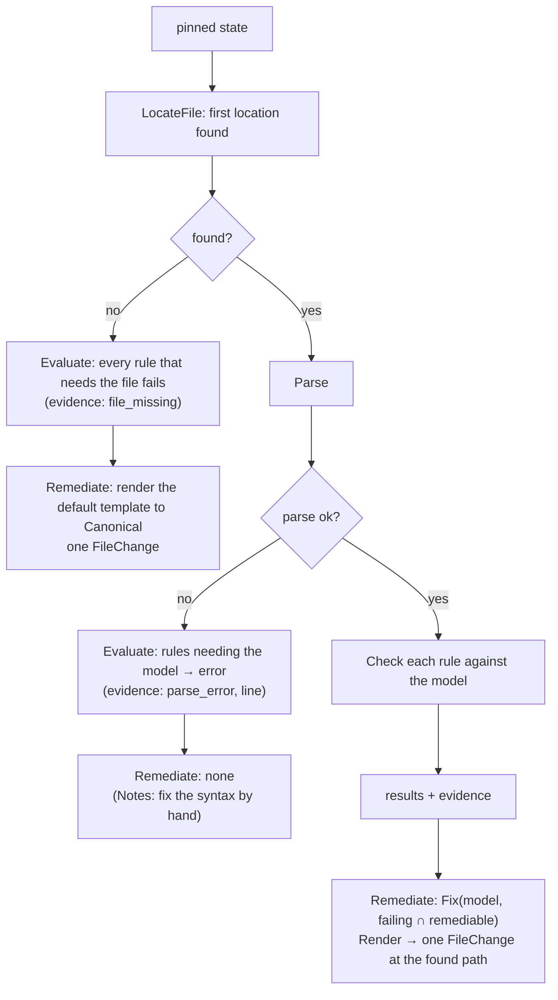

<!-- markdownlint-disable-file MD025 MD041 -->

# DESIGN-0031: Control framework: controls, control rules and file controls

<!--toc:start-->
- [Overview](#overview)
- [Goals and Non-Goals](#goals-and-non-goals)
  - [Goals](#goals)
  - [Non-Goals](#non-goals)
- [Background](#background)
- [Detailed Design](#detailed-design)
  - [Package layout](#package-layout)
  - [The interface](#the-interface)
    - [Supporting types](#supporting-types)
    - [Reader, PR observer and writer](#reader-pr-observer-and-writer)
  - [Rules and results](#rules-and-results)
  - [File controls](#file-controls)
  - [Built-in control types](#built-in-control-types)
    - [CODEOWNERS](#codeowners)
    - [Catalog info](#catalog-info)
    - [Dependency updates](#dependency-updates)
    - [Generic file (the escape hatch)](#generic-file-the-escape-hatch)
    - [API-remediated types](#api-remediated-types)
  - [The registry](#the-registry)
  - [Shared evaluation reads](#shared-evaluation-reads)
  - [Risks](#risks)
- [API / Interface Changes](#api--interface-changes)
- [Data Model](#data-model)
- [Testing Strategy](#testing-strategy)
- [Migration / Rollout Plan](#migration--rollout-plan)
- [Decisions](#decisions)
- [Adversarial Review](#adversarial-review)
  - [AR-0031-01 (critical): CODEOWNERS remediation orders the rules backwards](#ar-0031-01-critical-codeowners-remediation-orders-the-rules-backwards)
  - [AR-0031-02 (high): Owned resources and read dependencies are different sets](#ar-0031-02-high-owned-resources-and-read-dependencies-are-different-sets)
  - [AR-0031-03 (high): SHA-only reads cannot fingerprint or pin API resource state](#ar-0031-03-high-sha-only-reads-cannot-fingerprint-or-pin-api-resource-state)
  - [AR-0031-04 (high): Remediable is conditional, but the conformance guarantee is unconditional](#ar-0031-04-high-remediable-is-conditional-but-the-conformance-guarantee-is-unconditional)
  - [AR-0031-05 (high): Parser fallback cannot prove CODEOWNERS validity](#ar-0031-05-high-parser-fallback-cannot-prove-codeowners-validity)
  - [AR-0031-06 (high): API proposals and the client surface contradict the workflow design](#ar-0031-06-high-api-proposals-and-the-client-surface-contradict-the-workflow-design)
  - [AR-0031-07 (high): Missing catalog-info can leave stale managed properties indefinitely](#ar-0031-07-high-missing-catalog-info-can-leave-stale-managed-properties-indefinitely)
  - [AR-0031-08 (high): The proposed Go types form import cycles](#ar-0031-08-high-the-proposed-go-types-form-import-cycles)
  - [AR-0031-09 (medium): Framework results and input size need explicit validation](#ar-0031-09-medium-framework-results-and-input-size-need-explicit-validation)
- [Open Questions](#open-questions)
  - [OQ1: What does "pattern is owned by owners" mean for CODEOWNERS?](#oq1-what-does-pattern-is-owned-by-owners-mean-for-codeowners)
  - [OQ2: Can catalog-info remediation edit fields in an existing file?](#oq2-can-catalog-info-remediation-edit-fields-in-an-existing-file)
<!--toc:end-->

## Overview

A control is the expected state of one resource, and a control rule is one verifiable requirement of it. This document defines how controls are built in Go:

- the **`Control` interface**, with separate `Evaluate` (read-only) and `Remediate` (produces a change, writes nothing) methods, and the types an evaluation and a change set are made of;
- **results**: how rule results combine into a control status;
- **file controls**: the shared machinery to find, read, parse, render and edit a file, so each file kind's package contains only what is specific to that file;
- the **built-in control types**, starting with `codeowners`, the API-remediated types, and the generic `file` escape hatch.

Policies (who gets which control) are in DESIGN-0030. Running controls and applying their changes is in DESIGN-0032.

## Goals and Non-Goals

### Goals

- **All knowledge of a resource lives in one package.** For example, `internal/controls/codeowners` knows where GitHub looks for CODEOWNERS, how to parse it, what "`.wiz` is owned by X" means, and how to fix it.
- **Remediation is whole-control.** An absent file gets the full template, which satisfies every remediable rule at once. A present file gets the edits for exactly the failing rules, all in one change.
- **Evaluation cannot write.** `Evaluate` receives a reader with no write methods, enforced by the type system and backed by the Evaluation App (DESIGN-0032).
- **Remediation is a value.** `Remediate` returns a change set, and the workflow applies it. Controls stay testable without a GitHub fake that records writes.
- **Built-in guarantees, tested per control type:**
  - remediating and re-evaluating passes every remediable rule;
  - remediating twice changes nothing;
  - the default template passes every rule with `remediate = true`.

### Non-Goals

- **User-defined control types at runtime** (plugins, scripting). A control type is Go code and ships in a release.
- **Arbitrary assertions on arbitrary files.** The generic `file` control renders one template to one path. Anything requirement-level is a control type.
- **Applying changes.** Branches, commits and PRs belong to the remediation workflow (DESIGN-0032).

## Background

v1 evaluates rules with a generic mechanism (`exists` / `contains` / `exact` / `absent` plus regex and `yaml_path` assertions) and remediates by writing a rendered template to a target path. The engine knows nothing about the file it writes, and it evaluates each rule in isolation, so two rules on one file have no shared view of the result: one rule's cleanup could delete a file another rule still required. The catalog-info parser (`internal/catalog`) is the one place that understands a file's format, but only the `custom_properties` reconciler uses it.

## Detailed Design

### Package layout

```text
internal/control/              # the framework: interfaces, results, registry, file helpers
internal/control/controltest/  # the conformance suite every type runs
internal/controls/codeowners/
internal/controls/catalog_info/
internal/controls/dependency_updates/
internal/controls/file/        # the generic escape hatch
internal/controls/repo_settings/
internal/controls/branch_ruleset/
internal/controls/labels/
internal/controls/custom_properties/
```

### The interface

```go
package control

// Type is a control type: Go code that knows one kind of resource.
// It validates a catalogue definition and builds a Control from it.
// One Type serves every catalogue version of its control; a version
// bump is catalogue data, not a new Type.
type Type interface {
    Name() string                          // "codeowners"
    RuleKinds() []RuleKindSpec             // what rules a definition may declare, with their parameters
    Build(def Definition) (Control, error) // validates parameters at policy load
}

// Control is one catalogue definition, ready to run.
type Control interface {
    ID() ID                // {Slug: "codeowners", Version: 2}
    Resources() []Resource // what it owns (DESIGN-0030 ownership)
    Rules() []Rule         // declared rules, in display order

    // Evaluate reads, never writes. The reader is pinned to one commit
    // of the default branch, or of a remediation PR's head (DESIGN-0032).
    Evaluate(ctx context.Context, in EvalInput) (Evaluation, error)

    // Remediate returns the change that makes the failing, remediable
    // rules pass, computed against the same pinned state. It writes nothing.
    Remediate(ctx context.Context, in RemediationInput) (ChangeSet, error)
}
```

Two methods rather than one `Run(mode)` (D1), because the methods need different capabilities. `Evaluate` must be callable by a process that holds no write credentials. `Remediate` needs no credentials at all, because it returns a value.

#### Supporting types

```go
package control

// Definition is one catalogue entry after HCL decode and before Build:
// what the loader hands to Type.Build. It is data; the Control that
// Build returns is the behaviour.
type Definition struct {
    ID       ID
    Title    string
    Type     string          // the Type.Name() that builds it
    Rules    []Rule          // kinds and params validated by Type.Build
    Template string          // template store name; must pass every remediable rule
    PR       policy.PRConfig // pr {} block: title, body, labels (DESIGN-0030)
    Apply    string          // "pr" (default) | "direct"; API-remediated types only
    Params   map[string]any  // type-level params: dependency_updates.tool, file.path, …
}

// ID names one catalogue definition. Version is the integer the
// catalogue declares; policies reference it as "codeowners@2".
type ID struct {
    Slug    string
    Version int
}

// Resource is something exactly one active control may own (DESIGN-0030).
// Kind is file, setting, ruleset, label or property; Key is the path,
// property name, ruleset name or label name. Rendered as
// "file:.github/CODEOWNERS" or "setting:delete_branch_on_merge".
type Resource struct {
    Kind string
    Key  string
}

// RuleKind is a check a Type offers, such as "exists" or "owners".
type RuleKind string

// RuleKindSpec is what a Type says about one of its kinds: the
// parameters it accepts and whether Remediate can fix it. The policy
// loader validates against it and the reference docs are generated
// from it, so the two cannot drift.
type RuleKindSpec struct {
    Kind       RuleKind
    Params     []ParamSpec
    Remediable bool // a rule of this kind may declare remediate = true
}

// ParamSpec is one parameter of a rule kind.
type ParamSpec struct {
    Name     string
    Type     string // "string", "bool", "list(string)", …
    Required bool
}

// Rule is one declared requirement of a control.
type Rule struct {
    ID        string         // bare and unique within the control: "wiz-owners"
    Number    string         // display only: "1.2"
    Title     string         // display only
    Kind      RuleKind       // one of Type.RuleKinds()
    Params    map[string]any // kind-specific, validated by Type.Build
    Remediate bool           // Remediate fixes this rule's failures
}

// RuleStatus is the outcome of one rule.
type RuleStatus string

const (
    Pass          RuleStatus = "pass"
    Fail          RuleStatus = "fail"
    Error         RuleStatus = "error"
    NotApplicable RuleStatus = "not_applicable"
)

// RuleResult is one rule's outcome with its evidence.
type RuleResult struct {
    RuleID   string
    Status   RuleStatus
    Evidence map[string]any // typed, versioned, text-only (DESIGN-0027)
}

// ResourceRead records one resource the evaluation looked at.
// DESIGN-0032's fingerprint is built from Evaluation.Results and
// Evaluation.Reads and from nothing else.
type ResourceRead struct {
    Resource Resource
    BlobSHA  string // empty when absent or when the resource is not a blob
    Present  bool
}

// Evaluation is what Evaluate returns.
type Evaluation struct {
    Results []RuleResult
    Reads   []ResourceRead
}

// RepoContext is the repository an evaluation runs against.
type RepoContext struct {
    Org           string
    Name          string
    DefaultBranch string
    SHA           string        // the pinned commit
    Vars          template.Vars // {{ .Org }}, {{ .Repo }}, …
}

// EvalInput is everything Evaluate may use.
type EvalInput struct {
    Repo   RepoContext
    Reader github.Reader // read-only, pinned to Repo.SHA, cached
}

// RemediationInput is EvalInput plus the evaluation of the same state.
type RemediationInput struct {
    EvalInput
    Evaluation Evaluation
}

// FileChange is one file write or delete.
type FileChange struct {
    Path    string
    Content []byte // ignored when Delete is set
    Delete  bool
    Reason  string // missing | rule_failed:<rule id> | stale | orphan (DESIGN-0033 item 3)
}

// APIChange is one direct change to a non-file resource.
type APIChange struct {
    Resource Resource
    Op       string // "set" or "delete"
    Value    any    // the resource kind's value type; nil clears
    Reason   string // as FileChange.Reason
}

// ChangeSet is what a remediation proposes.
type ChangeSet struct {
    Files []FileChange // applied as one commit (DESIGN-0032)
    API   []APIChange  // settings, rulesets, labels, properties
    Notes []string     // manual steps for failing rules with no remediation
}
```

`template.Vars` is new: the variables a control template sees. It replaces `FileVars` for control code; the existing renderer is kept (assumption A10). `Reason` on a change is not persisted; it feeds the PR body and the `repo-guardian evaluate --format json` preview (DESIGN-0032 D7).

Two functions belong to the framework rather than to any type, because both workflows must compute them the same way:

```go
package control

// StatusOf derives the control status from the rule results, in the
// order of the table under "Rules and results": any fail → non_compliant,
// else any error → unknown, else all not_applicable → not_applicable,
// else compliant.
func StatusOf(ev Evaluation) Status

// Fingerprint is what DESIGN-0032 compares between evaluations. It hashes
// the control id and version, the sorted (rule id, status) pairs and the
// sorted (resource, blob SHA or "absent") reads, and nothing else: not
// evidence wording, not timestamps, not the pinned commit.
func Fingerprint(id ID, ev Evaluation) string
```

#### Reader, PR observer and writer

Three interfaces, all scoped to one repository; the org and the installation are fixed when they are built. Controls receive only `Reader`. The evaluate activity and the remediation run use `PRObserver` for what they need to know about pull requests and branches. Only the remediator holds `Writer` (D7).

```go
package github

// Reader is everything a control may read. It is pinned to one commit
// and caches, so every control in one evaluation sees the same state.
// It has no write methods. The Evaluation App's token backs it.
type Reader interface {
    GetContents(ctx context.Context, path string) (content []byte, blobSHA string, found bool, err error)
    ListDirectory(ctx context.Context, path string) ([]string, error)
    GetRepository(ctx context.Context) (RepositorySettings, error)
    ListRulesets(ctx context.Context) ([]Ruleset, error)
    GetCustomProperties(ctx context.Context) (map[string]*string, error)
    ListLabels(ctx context.Context) ([]Label, error)
    CodeownersErrors(ctx context.Context) ([]CodeownersError, error)
}

// PRObserver is what the workflows read about pull requests and
// branches. No control uses it. The Evaluation App's token backs it in
// the evaluate activity (PR observation, DESIGN-0032); the Remediation
// App's token backs it in the remediation run (find or adopt).
type PRObserver interface {
    ListPullRequests(ctx context.Context, headPrefix string) ([]PullRequest, error) // open PRs whose head branch starts with headPrefix
    GetPullRequest(ctx context.Context, number int) (*PullRequest, error)
    ListCommits(ctx context.Context, branch string) ([]Commit, error) // each with its author App identity, for find or adopt
    GetRef(ctx context.Context, branch string) (sha string, exists bool, err error)
}

// Writer is what the remediation workflow applies a ChangeSet with.
// Controls never receive it. The Remediation App's token backs it.
type Writer interface {
    // Commit builds blobs, a tree and one commit on top of baseSHA through
    // the git-data API, then fast-forwards branch to it, creating the
    // branch when absent. It returns ErrNotFastForward when the ref no
    // longer points at baseSHA (D8).
    Commit(ctx context.Context, branch, baseSHA string, changes []control.FileChange, message string) (headSHA string, err error)
    CreatePullRequest(ctx context.Context, head, base, title, body string) (*PullRequest, error)
    UpdatePullRequest(ctx context.Context, number int, title, body string) error
    ClosePullRequest(ctx context.Context, number int) error
    UpsertPRComment(ctx context.Context, number int, marker, body string) error
    UpdateRepository(ctx context.Context, settings RepositorySettings) error
    UpsertRuleset(ctx context.Context, rs Ruleset) error
    SetCustomProperties(ctx context.Context, props map[string]*string) error
    UpsertLabel(ctx context.Context, l Label) error
}
```

`Reader` is the whole read surface a built-in type needs: file contents for every file control, directory listings for `dependency_updates`' location search, settings and rulesets for `repo_settings` and `branch_ruleset`, properties and labels for their types, and the CODEOWNERS errors endpoint for the `valid` rule kind. `PRObserver` is the whole read surface DESIGN-0032 needs beyond that: the open `repo-guardian/*` PRs and any tracked PR for observation, and the branch head and its commits' authors for find or adopt. `Writer.Commit` is one commit per change set whatever the number of files; the Contents API would be one commit per file, so a multi-file change set could be left half-applied.

### Rules and results

A rule is declared in the catalogue (DESIGN-0030) using a **rule kind** its control type provides, with parameters the type validates at load:

| Field | Meaning |
| ----- | ------- |
| `id` | stable slug, bare and unique within the control: `wiz-owners`. Logs and the UI qualify it as `codeowners@2/wiz-owners` |
| `number`, `title` | display only: `1.2`, ".wiz is owned by …". Rule numbers are a separate axis from the control's integer version |
| `kind` | a kind the type offers: `exists`, `owners`, … |
| parameters | kind-specific: `pattern`, `owners`, … |
| `remediate` | whether `Remediate` fixes this rule's failures (`remediate = true`); such a rule is **remediable** |

Evaluating a rule gives a **rule result**:

| Status | Meaning |
| ------ | ------- |
| `pass` | the requirement holds |
| `fail` | the requirement does not hold |
| `error` | could not be determined (API error, unparseable input the rule needs) |
| `not_applicable` | the rule does not apply to this repository (for example a rule about a language the repository does not use) |

The brief's model is binary: every rule true means compliant, any rule false means non-compliant. `error` and `not_applicable` are an intentional extension of it. An API error or an unparseable file is not a failure, and reporting it as one would make transient trouble look like drift and send remediation after it; a rule that does not apply must count neither for nor against the repository.

Each result carries **evidence**: typed, versioned, and text-only, the same contract the v2 UI already renders (DESIGN-0027).

The **control status** is derived from the rule results, in this order:

| Rule results | Control status |
| ------------ | -------------- |
| any `fail` | `non_compliant` |
| no `fail`, any `error` | `unknown` |
| all `not_applicable` | `not_applicable` |
| otherwise (every rule `pass` or `not_applicable`) | `compliant` |

`fail` outranks `error` deliberately. A control with one definite failure is non-compliant whatever its other rules could not determine, and that is what remediation acts on. An `error` never triggers remediation (DESIGN-0032).

### File controls

Most controls own a file. The framework provides the shared parts, so a control type writes only what is specific to its file:

```go
package control

// FileSpec describes the file a file control owns.
type FileSpec struct {
    Locations []string // in the precedence GitHub (or the tool) uses; first found wins
    Canonical string   // where a new file is created
}

// LocateFile finds the file a tool would actually use.
func LocateFile(ctx context.Context, r github.Reader, spec FileSpec) (path string, content []byte, found bool, err error)
```

A file control owns `file:<location>` for every location in its `FileSpec`, so a generic `file` control on any of those paths collides with it at policy load.

A file control type implements three things:

1. **Parse(content) → model.** For example, CODEOWNERS entries with their line numbers and comments preserved.
2. **Check(model, rule) → result.** One rule kind, evaluated against the parsed model.
3. **Fix(model, failing rules) → model, and Render(model) → content.** Edits that leave unrelated lines byte-identical.

The framework turns those into `Evaluate` and `Remediate`:



The framework's rules for file remediation:

- **An absent file gets the template.** The template must pass every remediable rule of the control; that is tested at load and in the conformance suite (D2), so one write fixes everything the control can fix. Templates are rendered with the existing `internal/template` renderer (assumption A10).
- **A present file is edited at the path where it was found,** never moved to `Canonical`. Moving a working file is not a remediation anyone asked for.
- **An unparseable file is never overwritten.** Its rules report `error`, and remediation adds a manual note. Replacing a broken file with a template would discard whatever the team meant to write (the INV-0011 A1 principle).
- **Edits are minimal.** `Fix` changes only what failing rules require, and `Render` must round-trip untouched content byte-for-byte. A property test enforces this per type.

### Built-in control types

#### CODEOWNERS

| Aspect | Behaviour |
| ------ | --------- |
| Locations | `.github/CODEOWNERS`, `CODEOWNERS`, `docs/CODEOWNERS`; the first found is the one GitHub uses (assumption A21) |
| Resources | `file:.github/CODEOWNERS`, `file:CODEOWNERS`, `file:docs/CODEOWNERS` |
| Model | ordered entries `{pattern, owners, line}`, with comments and blank lines preserved |
| Rule kind `exists` | a CODEOWNERS file is found and parses. "Parses" means the parser accepts every line and the file has at least one non-comment entry with at least one owner; a syntax error fails `exists` with the line as evidence |
| Rule kind `valid` | GitHub's CODEOWNERS errors endpoint reports no errors (D3, assumption A22). `remediate = false`: unknown owners and bad patterns need a human. When the endpoint is unsupported for the installation, the rule passes on parser evidence (`validator = parser`); a transient endpoint error is `error` |
| Rule kind `owners` | `pattern` is owned by at least `owners` (OQ1 defines "owned") |
| Rule kind `default_owner` | `*` has an owner |
| Fix for `owners` and `default_owner` | write the missing `pattern owner…` lines ordered least- to most-specific. CODEOWNERS is last-match-wins across **every** pattern that matches a path, not per identical pattern, so a narrow pattern is inserted before any trailing `*` line and never appended after it; a new `*` line goes last |
| Template | the operator's `codeowners` template, which must satisfy every remediable rule (tested) |

The wiz example under this type:

- **No CODEOWNERS:** the template is written, and it already contains the `.wiz` line, because the template must pass `wiz-owners`.
- **A team's CODEOWNERS without `.wiz`:** one line is inserted before the file's `*` line, or appended when there is none, and the team's file is otherwise untouched.
- **`default_owner` and `wiz-owners` both failing:** the `.wiz` line is written before the new `*` line, so the default owner cannot override the `.wiz` owners it was written next to.
- **An org that does not get the control:** it is never evaluated there (DESIGN-0030), so it cannot touch the file.

#### Catalog info

- **Locations:** `catalog-info.yaml`, `catalog-info.yml`. Resources `file:catalog-info.yaml`, `file:catalog-info.yml`.
- **Model:** `internal/catalog`'s parse (assumption A11), extended to keep the YAML node tree for minimal edits.
- **Rule kinds:**
  - `exists` and `kind` (the entity is a Component): remediable, the template satisfies both;
  - `field_set` (`spec.owner`, `spec.system`, …), optionally with a `contains`, `annotation_set` and `no_placeholders`: `remediate = false`. A template cannot know a repository's owner or system, and a placeholder that satisfies `field_set` is exactly what `no_placeholders` exists to catch.
- **Remediation:**
  - an absent file gets the template, which passes `exists` and `kind` and leaves the field rules failing with `Notes` until a human fills the PR in;
  - a present file gets no automatic remediation by default, because a filled-in catalog-info is owned by its team, and a failing field needs a human value. Failing rules produce `Notes` in the PR.
  - Whether field-level fixes are allowed is OQ2.

#### Dependency updates

One control for one opinion, which replaces v1's `renovate_config` and `dependabot` rules and the `when` gate between them:

- **Parameters:** `tool = "renovate" | "dependabot"`, and `renovate.extends = "github>org/preset"`.
- **Locations, all owned as `file:<path>`:**
  - Dependabot: `.github/dependabot.yml`, `.github/dependabot.yaml`;
  - Renovate: `renovate.json`, `renovate.json5`, `.renovaterc`, `.renovaterc.json`, `.renovaterc.json5`, `.github/renovate.json`, `.github/renovate.json5`, and the `renovate` key of `package.json`.
- **Rule kinds:**
  - `configured` (the chosen tool's config exists);
  - `extends` (the Renovate config extends the preset);
  - `exclusive` (the other tool's config is absent).
- **Remediation:** write the chosen tool's config from its template, add the preset to `extends` in an existing Renovate config (JSON only; JSON5 gets a note, D5), and delete the other tool's config. All of it is one change set: one PR, with no loop possible.

#### Generic file (the escape hatch)

- **Parameters:** `path`, `template`, `mode`, where `mode` is exactly one of `exists` | `exact`.
- **Rules:**
  - `exists`: the file is present;
  - `exact`: the file equals the rendered template (YAML-semantic comparison for `.yml`/`.yaml`, byte comparison otherwise, as v1).
- **One mode, never both.** `exact` subsumes existence, because an absent file is never equal to the template, so declaring both would be redundant and would put two rules on one path. There is no `contains` (D6).
- **Remediation:** write the template.
- **Owns `file:<path>`.** That is one path and one owner, so a requirement-level check on that file means writing a control type.

#### API-remediated types

`repo_settings`, `branch_ruleset`, `labels` and `custom_properties` remediate through `ChangeSet.API`, not files. Each declares the resources it owns, so two definitions that manage the same label or property collide at policy load like two file controls on one path.

**Repository settings** (`repo_settings`)

| Aspect | Behaviour |
| ------ | --------- |
| Resources | `setting:<property>` for each property the definition names (`delete_branch_on_merge`, `allow_merge_commit`, …) |
| Rule kind `equals` | the property has the declared value |
| Fix | `APIChange{setting:<property>, set, value}` |

**Branch ruleset** (`branch_ruleset`)

| Aspect | Behaviour |
| ------ | --------- |
| Resources | `ruleset:<name>` |
| Rule kind `exists` | a ruleset with that name is present and active |
| Rule kind `matches` | its rules equal the declared ruleset (YAML-semantic comparison, as v1) |
| Fix | `APIChange{ruleset:<name>, set, ruleset}`, one upsert |

**Labels** (`labels`)

| Aspect | Behaviour |
| ------ | --------- |
| Resources | `label:<name>` for every label the definition manages, including the ones it retires |
| Rule kind `present` | the label exists with the declared colour and description |
| Rule kind `absent` | a retired label is gone |
| Fix | `APIChange{label:<name>, set, label}` or `APIChange{label:<name>, delete, nil}` |

**Custom properties** (`custom_properties`)

| Aspect | Behaviour |
| ------ | --------- |
| Resources | `property:<name>` for `Owner`, `Component` and every mapped annotation (the managed set of DESIGN-0019). It reads `catalog-info.yaml` through the shared reader but does not own it |
| Rule kind `matches` | the property equals the value derived from `catalog-info.yaml`; `not_applicable` when the file is absent or is not a Component |
| Rule kind `defined` | the org schema defines the property; `remediate = false` |
| Fix | `APIChange{property:<name>, set, value}`, with a nil value to clear |

Each carries `remediation { apply = "pr" | "direct" }` in its catalogue definition, default `pr`. Under `pr` the change is proposed, not applied: the remediation PR carries a workflow that applies it on merge (v1's `github-action` mode) and the notes describe it. Under `direct` the remediator applies it through `github.Writer` with no review step. Whether `direct` is allowed in `remediate` mode is DESIGN-0032 OQ4; App permissions are per installation, so that opt-in narrows what repo-guardian does, not what its App may do.

### The registry

```go
control.Register(codeowners.Type{})
```

At policy load, every catalogue definition is decoded into a `Definition` and passed to its type's `Build`, which validates rule kinds and parameters against the type's `RuleKindSpec`s and compiles templates. Load fails on unknown types, unknown rule kinds, bad parameters, or a template that fails its own remediable rules. The template check renders the template with the type's sample variables (org `example-org`, repository `example`) and evaluates the control against the output; it runs at load and again in the conformance suite (D2). A template whose output depends on real repository data is caught by the runtime self-check: after `Remediate`, the workflow evaluates the changed content and refuses a change that does not pass (DESIGN-0032).

A definition's version is part of its `ID`. The same `Type` builds `codeowners@1` and `codeowners@2`, so bumping a version is a catalogue change, not a release.

### Shared evaluation reads

Several controls read the same data. For example, `catalog_info` and `custom_properties` both read `catalog-info.yaml`. The evaluation workflow gives every control in one evaluation the same `github.Reader`, which is pinned to one SHA and caches reads. Each file is fetched once per evaluation, whatever the number of controls. Controls stay independent: none reads another control's *results* (D4).

### Risks

- **CODEOWNERS fix ordering** is where a wrong assumption about last-match-wins would reproduce v1's two-rules-on-one-file conflict inside one control. The two-rules-fail-together fixture in the conformance suite is the guard.
- **`valid` depends on an endpoint not every installation has** (assumption A22). The parser fallback hides unknown-owner errors there; the `validator = parser` evidence makes that visible.
- **A template can pass the sample-variable check and fail on a real repository.** The runtime self-check after `Remediate` is the backstop, and it costs one extra evaluation per remediation.
- **`apply = "direct"` has no review step.** DESIGN-0032 OQ4 decides whether it is allowed at all.
- **Minimal-edit encoders** for YAML and JSON are the hardest code in the set. D5 keeps JSON5 out of it.

## API / Interface Changes

- New packages `internal/control`, `internal/control/controltest` and `internal/controls/*`.
- `github.Reader`, `github.PRObserver` and `github.Writer` as defined above. They replace the single `github.Client` for control, evaluation and remediation code (assumption A12).
- `template.Vars`, the variables a control template sees. `template.PRVars` gains `.Control` (`Slug`, `Version`, `Title`), `.Failing` (a `[]RuleView` of `ID`, `Number`, `Title` for the rules the PR fixes) and `.Notes` for the `pr {}` title and body.
- Catalogue HCL as in DESIGN-0030; rule kinds and parameters per type, documented from the types' own metadata (`RuleKinds()` returning `RuleKindSpec`), so the docs cannot drift from the code.

## Data Model

Controls are stateless. Results and evidence are persisted by the evaluation workflow (DESIGN-0032): `rule_results` is keyed `(repository_id, control_id, rule_id)` with the bare rule id, and `control_results` carries the integer `control_version`. Evidence is versioned JSON per `(control type, rule kind)`, and the UI renders only versions it knows (the v2 evidence contract).

## Testing Strategy

Per control type, in its own package:

1. **Fixture tables:** repository states (no file, each location, each rule passing or failing, unparseable, multiple locations) × rules → expected results and evidence.
2. **Remediation property:** for every fixture, the following must hold for every remediable rule:

   ```text
   evaluate(apply(state, remediate(state))) passes every remediable rule
   ```

3. **Idempotence:** `remediate(apply(state, remediate(state)))` is an empty change set.
4. **Minimal edits:** untouched lines are byte-identical after `Fix`/`Render`. Round-trip fuzzing of the parser (`Render(Parse(x)) == x`) covers this for every input the parser accepts.
5. **Template passes its rules:** the default template (and any operator template in tests) evaluated with sample variables passes every remediable rule of the control.
6. **Two rules failing together:** every file type with more than one remediable rule kind ships a fixture where two of them fail at once (for CODEOWNERS, `default_owner` and an `owners` rule), and the remediated file must pass both. This is the test for the ordering class of bug.
7. **Framework tests:** `LocateFile` precedence, control-status derivation (every row of the table), and registry validation errors.

A shared conformance suite (`control/controltest`) runs properties 2–6 against any type given its fixtures. A new control type gets them by adding fixtures.

Resource-ownership collisions between controls are not this suite's job. They are a property of a policy, not of a type, and DESIGN-0030's load-time validator (its resolution section) catches them.

## Migration / Rollout Plan

The order in which types are built:

1. `codeowners`: the motivating case, and the reference implementation of a file control.
2. `file`.
3. `catalog_info`.
4. `dependency_updates`.
5. The API types.

The first evaluate-only rc needs only the types that v1's built-in defaults cover.

## Decisions

Former open questions this document settles.

- **D1 `Evaluate` + `Remediate`, not one `Run(mode)`** — two methods, with `Remediate` returning a `ChangeSet`. The type system enforces the capability split: evaluation workers call a method whose inputs hold no writer, and remediation is a pure function of state. A single `Run(ctx, mode, client)` needs a client capable of both, and a `Remediate` that writes through a `Writer` re-creates per-control commit logic and partial applies.
- **D2 The template check runs at load and in the conformance suite** — the template is rendered with the type's sample variables and the control is evaluated against the output; load fails at deploy, the suite fails in CI, and the runtime self-check after `Remediate` covers templates that depend on real repository data.
- **D3 `valid` is a separate CODEOWNERS rule kind** — GitHub's errors endpoint reports unknown owners and bad patterns, the common real-world failure. Keeping it separate leaves `exists` cheap and lets a policy choose.
- **D4 Controls share reads, never results** — one cached reader per evaluation; `custom_properties` parses `catalog-info.yaml` itself through the shared parser. Evaluation order never matters, and one control's failure cannot cascade into another. Explicit dependencies would introduce a graph and order-dependent results.
- **D5 JSON Renovate configs get minimal edits; JSON5 gets a note** — a node-preserving JSON encoder for `.json`; a JSON5 `extends` failure becomes a manual note instead of rewriting a team's commented file through a JSON encoder.
- **D6 The generic `file` control is `exists` or `exact` only** — no `contains` and no `absent`. Anything that inspects inside a file is, by definition, a control type, and "this path must not exist" belongs to a type that knows why the file is forbidden.
- **D7 Three GitHub interfaces** — `Reader` is exactly what a control may read, `PRObserver` is what the workflows read about pull requests and branches, `Writer` is what the remediator applies. Putting PR reads on `Reader` would hand controls a surface none of them uses, and leaving them out left DESIGN-0032's PR observation and find-or-adopt with no method to call.
- **D8 `Writer.Commit` through the git-data API** — one commit per change set, non-forced ref update, `ErrNotFastForward` when a human pushed in between. The Contents API is one commit per file, so a multi-file change set could be half-applied and the "nothing is half-applied, nothing is overwritten" guarantee in DESIGN-0032 would not hold.
- **D9 catalog-info remediation creates only** — the `catalog_info` control creates `catalog-info.yaml` from the template when it is absent and never edits fields in an existing file; a failing field becomes a manual note in the PR or the report (OQ2, resolved 2026-10-04). Field values need human knowledge, and inventing them produces plausible wrong data.
- **D10 Organisation-only resources on user-owned repositories are `not_applicable`** — a repository whose installation account is a user rather than an organisation has no teams and no custom property schema. A rule whose resource GitHub cannot provide there (an `@org/team` owner, a `property:<name>`) evaluates `not_applicable` with `account_type = user` in the evidence, so a personal-account installation (DESIGN-0030 D11) is measurable without failing every repository on features it cannot have. A policy written for a personal account names users (`@login`) as owners; the repository rulesets GitHub does offer on user accounts evaluate normally.

## Adversarial Review

Reviewed 2026-10-03 with the sibling policy/workflow designs. **Disposition: changes required before using the framework as a correctness guarantee.** Findings are unresolved; severity meanings are in DESIGN-0029's Adversarial Review. The CODEOWNERS counterexample is also checked against GitHub's [documented last-match-wins semantics](https://docs.github.com/en/repositories/managing-your-repositorys-settings-and-features/customizing-your-repository/about-code-owners).

**Responses (2026-10-03):** 7 accepted, 2 accepted with changes. Each finding below carries a **Response** giving the disposition and the concrete change. Accepted changes are applied to the body and the Decisions ledger in the follow-up reconciliation pass; until then, where a response and the body differ, the response is the current position.

### AR-0031-01 (critical): CODEOWNERS remediation orders the rules backwards

**Basis:** CODEOWNERS' Fix row, its three remediation examples and OQ1(a). The design correctly says last match wins, then inserts narrow patterns *before* a trailing `*` and writes a new `*` last. For `.wiz/config.yaml`, `.wiz @org/security` followed by `* @org/other` selects `@org/other`. The promised two-rules-fail fixture therefore cannot pass under real GitHub semantics. There is no universal specificity sort for arbitrary overlapping patterns that also preserves intentional ownership exceptions.

**Proposed correction:** Put the default fallback before overrides. Define the target path set for an `owners` requirement, evaluate effective ownership across matching paths, and edit ordering/owners without silently undoing unrelated exceptions. Decide how requirements on currently absent paths are checked. Do not use literal-line presence as a substitute for effective ownership.

**Verification:** Cover a trailing `*`, later overlapping wildcards, duplicate patterns, ownerless exceptions and simultaneous `default_owner`/`owners` failure. Check the evaluator against independently specified expected GitHub owners, not just the same parser used by the fixer.

**Response:** **Accepted.** The Fix row and all three wiz examples are wrong under GitHub's last-match-wins rule and are reversed: a `*` line is written first, or left where it is, and a required narrow line goes after it, appended at the end of the file so that it wins. `owners` is evaluated as effective ownership rather than line presence: the type carries a local matcher implementing GitHub's gitignore-style patterns and last-match-wins, computes the owners GitHub would request for the paths `pattern` covers, and passes only when every required owner is among them. `Fix` edits minimally: an identical pattern line has its owners extended in place; otherwise the line is appended; if a later line, or an ownerless exception, would still override the required owners for a covered path, the control does not reorder a human's exceptions, the rule fails with a note naming the overriding line, and that observation is non-remediable. A requirement on a path that does not exist yet is checked against the pattern alone, because GitHub applies patterns to paths that may not exist yet. OQ1(a) is amended to this definition and the "CODEOWNERS fix ordering" risk is rewritten around it. Verification: amended — the fixture's expected owners come from an independent table of GitHub-documented examples rather than from the type's own parser, and the integration suite compares the local matcher against the CODEOWNERS errors endpoint on real repositories.

The three examples read, corrected: with no CODEOWNERS the template is written with its `*` line first and the `.wiz` line after it; in a team's file without `.wiz` the `.wiz` line is appended at the end, after the team's `*` when there is one; with `default_owner` and `wiz-owners` both failing the new `*` line goes first and the `.wiz` line after it, so the default owner cannot override the owners it was written next to.

### AR-0031-02 (high): Owned resources and read dependencies are different sets

**Basis:** `Resources()` is what a control owns, Shared evaluation reads, and DESIGN-0032's push selection. `custom_properties` owns properties but reads catalog-info; a catalog edit therefore selects `catalog_info` but not `custom_properties`. Other rules can read language manifests or the repository tree to decide applicability without owning those files. Widening ownership to fix watching would incorrectly prohibit legitimate readers or multiple controls using one input.

**Proposed correction:** Declare separate write ownership and invalidation/read dependencies, including file sub-fields, directory/tree searches and live API resources. Record missing higher-precedence locations as dependencies too: adding `.github/CODEOWNERS` must invalidate a result previously read from root. Validate every `ChangeSet` against current write ownership independently of its read set.

**Verification:** Modify/remove `catalog-info.yml`, add a higher-precedence CODEOWNERS file, and change a language manifest used by a rule. Select every dependent control promptly while rejecting undeclared writes and allowing shared reads.

**Response:** **Accepted.** `Control.Resources()` splits into `Owns() []Resource`, what the control may write, and `Reads() []Resource`, what invalidates it. `Owns` is the write set the framework validates every `ChangeSet` against before anything leaves `Remediate`. `Reads` lists the files a control reads without owning, `tree:<prefix>` for a directory scan, and every alternate location of a file control including the absent higher-precedence ones, so `codeowners` reads all three paths and adding `.github/CODEOWNERS` invalidates a result read from the root file. DESIGN-0032's push selection matches changed paths against `Owns ∪ Reads`, which is how a `catalog-info.yaml` edit now selects `custom_properties` as well as `catalog_info`. API resources have no push signal; they are evaluated on the schedule, and the resource tables say so. Verification: adopted.

### AR-0031-03 (high): SHA-only reads cannot fingerprint or pin API resource state

**Basis:** `ResourceRead{BlobSHA, Present}`, `Fingerprint`, and the pinned `Reader` guarantee. Settings, labels, rulesets and custom properties are not Git blobs and cannot be pinned to a commit. With `Present = true` and an empty SHA, changing an API value while a rule remains failing leaves the fingerprint unchanged. A missing property can also be confused with a null value. Caching one API response does not make all API responses an atomic repository snapshot.

**Proposed correction:** Represent observation state as present/absent/error with canonical content digests or provider versions for non-file resources, including values used as remediation inputs. Separate commit-pinned file reads from time-stamped live observations and document their consistency limits. Self-check API changes against an overlay of intended API state, then confirm applied state by reading it back.

**Verification:** Change a label color and a custom property from one wrong value to another while keeping rule statuses identical. Both must invalidate remediation; API mutation during evaluation must not be presented as commit-pinned truth.

**Response:** **Accepted.** `ResourceRead` becomes `{Resource, State, Digest, Version, ObservedAt, Err}` with `State` one of `present`, `absent` or `error`, so an absent property and a present null value are different reads. For a file the digest is the blob SHA and the read is pinned to the evaluated commit; for an API resource the digest is sha256 over the canonical JSON of the observed value, `Version` carries the provider's ETag or `updated_at` where one exists, and the read is a time-stamped observation whose consistency limit is stated in the `Reader` contract: not atomic with the commit, not atomic across resources. `Fingerprint` hashes digests rather than blob SHAs, so a label colour or a property value moving from one wrong value to another invalidates remediation even though every rule status is unchanged. The self-check for an API change set runs `Evaluate` against an overlay of the intended API state, and a direct apply reads the resource back and compares before success is recorded (DESIGN-0032, AR-0032-10). Verification: adopted.

### AR-0031-04 (high): Remediable is conditional, but the conformance guarantee is unconditional

**Basis:** File remediation, Catalog info, Dependency updates and properties 2–6 of Testing Strategy. An unparseable file is never overwritten; an existing non-Component catalog has a remediable `kind` rule but no allowed automatic fix; a JSON5 `extends` failure gets only a note. Those fixtures cannot satisfy “every remediable rule passes after remediation.” A runtime self-check enforcing that claim would also reject useful partial changes, such as removing Dependabot while a JSON5 preset still needs a human.

**Proposed correction:** Separate a rule kind's potential repair capability from repairability for a particular observation. Return explicit fixed, manual and blocked rule sets. Define self-check scope, preserve already-passing requirements and require no regression, while permitting clearly reported partial remediation where intended. Decide whether malformed CODEOWNERS is a definite syntax failure or an evaluation error consistently across `exists` and file helpers.

**Verification:** Run conformance on malformed files, non-Component catalogs and JSON5 plus a removable competing config. Assert allowed partial progress, visible manual work, no destructive fallback and no endless retries of a notes-only change.

**Response:** **Accepted.** `RuleKindSpec.Remediable` stays as the kind's capability; what a particular observation can repair is reported by `ChangeSet`, which gains `Fixed`, `Manual` and `Blocked []RuleID`. The conformance property becomes: after applying the change set every rule in `Fixed` passes, no rule that passed before regresses, and every failing rule is in exactly one of `Fixed`, `Manual` or `Blocked` with a note. Partial remediation is allowed and reported, so `dependency_updates` removes the Dependabot config and notes the JSON5 preset in one run. A notes-only change set is recorded as a recommendation and is not retried until the generation changes (AR-0032-11). `RuleStatus` gains `unknown` for an outcome that cannot be determined until the input changes, beside `error`, which stays transient and is retried on the next run; `StatusOf` treats both as it treats `error` today. Malformed CODEOWNERS is then defined once: `exists` passes because the file is there, `valid` fails definitively on a syntax error, the owner rules are `unknown{reason=unparseable}`, the control is non-compliant, and every rule is `Blocked`, so an unparseable file is never overwritten. Verification: adopted.

### AR-0031-05 (high): Parser fallback cannot prove CODEOWNERS validity

**Basis:** `valid` and Reader's `CodeownersErrors()` method. When the endpoint is unsupported, the design reports `pass` based on local syntax even though the stated requirement includes unknown owners and invalid patterns. Evidence saying `validator = parser` does not repair a false compliant verdict. GitHub also requires eligible users/teams with write access and ignores CODEOWNERS over its size limit. The errors endpoint must use the same ref as the file read; the proposed interface does not state that binding for PR-head self-checks.

**Proposed correction:** Use unknown/unsupported for unverified validity, or expose a deliberately narrower parser-only rule with different semantics. Bind GitHub validation to the observed ref, check documented size/owner semantics and distinguish unsupported capability from transient or permission errors. Keep self-checks local where external validation of an uncommitted overlay is impossible.

**Verification:** Include nonexistent/ineligible owners, an oversized file, unsupported endpoint and different main/PR CODEOWNERS contents. None may yield a full-validity pass solely because the local parser accepted text.

**Response:** **Accepted.** The parser fallback is removed. When the CODEOWNERS errors endpoint is unsupported the `valid` rule is `unknown{reason=capability_unsupported}` with a note, never `pass`; a permission error is `unknown{reason=permission}`; a transient failure is `error`. `Reader.CodeownersErrors` takes the ref and is called with the observed commit, which the endpoint accepts (a branch, tag or commit, checked against GitHub's documentation), so validation is bound to the file that was read. `valid` is declared per definition, so an operator on an instance without the endpoint omits it from the catalogue rather than carrying a permanent unknown. The local parser additionally enforces GitHub's size limit and reports an oversized file as a definite failure. A self-check on an uncommitted PR-head overlay cannot reach the endpoint, so it uses the local parser only and its evidence says `validator = parser`. The "`valid` depends on an endpoint" risk is rewritten accordingly. Verification: adopted.

### AR-0031-06 (high): API proposals and the client surface contradict the workflow design

**Basis:** API-remediated types and DESIGN-0032 API remediations. Here `apply = "pr"` generates a workflow PR that applies on merge; DESIGN-0032 instead records a recommendation and writes nothing. Generated workflow files have no declared owner/branch model under the former interpretation. The declared Reader cannot fetch the org schema required by `defined`; Writer cannot delete the retired labels or branches the designs promise. Ruleset names alone also do not identify whether a repository or an inherited org/enterprise ruleset is writable.

**Proposed correction:** Settle one API proposal contract across the documents, preferably with a name that distinguishes recommendations from PRs. Define exact client capabilities, supported operations and permission metadata. Resolve managed API objects by stable provider identity and origin; never try to remediate inherited policy by overwriting a repository object with the same display name.

**Verification:** Implement a recommendation-only setting, a retired-label delete, org-schema lookup, branch cleanup and an inherited ruleset fixture. Every promised operation must have a defined method and permission, and recommendation mode must produce no hidden workflow file.

**Response:** **Accepted with changes.** One contract across the documents: `apply` is `recommend` (the default; a recommendation is recorded and nothing is written to GitHub), `direct` (the remediator applies the change through `Writer`), or `workflow` (v1's `github-action` mode: the PR carries a workflow that applies the change on merge, the control then owns `file:.github/workflows/repo-guardian-<slug>.yml`, and only a type that declares `WorkflowApply` may use it, today `custom_properties`). The value `pr` is removed, and DESIGN-0032's API remediations section adopts the same three values. The rejected part is "never generate a workflow": `workflow` stays because it is the only way an org that refuses direct writes still gets properties applied through review, and it is an explicit, owned file rather than a hidden one. The client surface is completed: `Reader` gains `OrgPropertySchema`, `Writer` gains `DeleteLabel` and `DeleteRef`, and `Ruleset` carries its id and `source` (repository, organization or enterprise). An inherited ruleset is never written; its rules are `unknown{reason=inherited}` with a note. Verification: adopted.

### AR-0031-07 (high): Missing catalog-info can leave stale managed properties indefinitely

**Basis:** Custom properties' `matches` rule, absent/non-Component `not_applicable`, and nil-clears Fix. Remove a catalog that previously supplied Owner/Component: the rule becomes not-applicable, so the stale values never produce a failing remediable result. This differs from a missing mapped annotation, which is supposed to clear. Treating malformed/non-Component input as desired empty values would cause the opposite failure: destructive clears when no valid source was obtained.

**Proposed correction:** Specify separate policies for valid-source field removal, whole-source removal, malformed source and non-Component source. Preserve values on invalid/unreadable sources; decide explicitly whether whole-file removal clears or retains them and how retained stale values appear in posture. Validate source values/schema compatibility before constructing a write, independently of aggregate control status.

**Verification:** Seed real values, remove one annotation, remove the catalog, corrupt it, and replace it with another entity kind. Assert exact per-property writes or deliberate retention, with evidence explaining each outcome.

**Response:** **Accepted with changes.** The source-state policy is made explicit and follows the v1 contracts that already exist (IMPL-0020 A1, IMPL-0021 A3), with every API write gated per property on a valid source value and an org schema that defines it, independently of the aggregate control status. The rejected part is retaining values when the whole file is removed: that is the stale-forever case the finding describes, and v1 already clears on file removal. The `matches` row of the custom properties table changes from `not_applicable` on an absent file to a failing, remediable clear. Verification: adopted.

- A valid Component with a mapped annotation removed: that property is cleared (remediable).
- The catalog file absent: the whole managed set is cleared, so `matches` fails and the fix is a clear (v1's clear-on-file-removal).
- A malformed file: every value is retained, `matches` is `unknown{reason=parse_error}`, `CatalogParseFailedTotal` increments and nothing is written.
- A valid non-Component entity: values are retained and `matches` is `not_applicable` with `entity_kind` in the evidence, because a System or Resource entity is legitimately outside this control.

### AR-0031-08 (high): The proposed Go types form import cycles

**Basis:** Supporting types and Reader/Writer declarations. `control.EvalInput` imports `github.Reader`, while `github.Writer.Commit` imports `control.FileChange`: `control → github → control`. `control.Definition` also imports `policy.PRConfig`, while `policy.Snapshot.Control` returns `control.Control`: `control → policy → control`. Go cannot compile these package graphs, so the interface split as written cannot be implemented literally.

**Proposed correction:** Put shared value types/PR configuration in dependency-leaf packages, or place narrow reader/writer contracts on the consuming side with concrete GitHub adapters depending on them. Draw and enforce the package dependency graph before implementing registry construction. Also specify how `Type.Build` obtains template/renderer dependencies without hidden globals.

**Verification:** Compile a minimal skeleton containing the proposed packages and constructors. Add dependency rules that prohibit the rejected cycles and keep workflow code independent of controls and GitHub adapters.

**Response:** **Accepted.** The package graph is fixed with leaves. The framework package `internal/control` holds `Definition`, `Rule`, `RuleResult`, `Resource`, `ResourceRead`, `Evaluation`, `ChangeSet`, `FileChange`, `APIChange`, `Type`, the registry, and the consumer-side `Reader`, `PRObserver` and `Writer` interfaces, which move here from `internal/github`. `PRConfig` and `PRTemplate` move from `internal/policy` to `internal/template`, so `Definition.PR` is `template.PRConfig`. `internal/policy` imports `control` and `template`; `internal/github` imports `control` to implement its interfaces; `internal/activities` imports all of them; `internal/workflows` imports none. `Type.Build(def Definition, env BuildEnv)` receives the template store and renderer explicitly, so no type reaches a global. A depguard rule per edge and a compiled skeleton in IMPL phase 0.5 make the graph a test rather than a diagram. Verification: adopted.

### AR-0031-09 (medium): Framework results and input size need explicit validation

**Basis:** `Evaluation.Results`, `Evidence map[string]any`, `ChangeSet` and registry validation. There is no stated check that each declared rule returns exactly one result. Omitting a failing rule or returning an empty slice could produce an accidental compliant/not-applicable status. Duplicate changes to one path, invalid status strings or unbounded text evidence likewise have no specified boundary. “Text-only” does not mean bounded, despite DESIGN-0032's staged-payload claim.

**Proposed correction:** Validate result completeness/uniqueness and recognized statuses before status derivation; reject empty definitions unless explicitly meaningful. Define evidence/schema versions, byte/count limits, duplicate-change behavior, file path/type/mode handling and parse limits. Preserve untouched bytes through source-span edits rather than assuming a YAML node encoder round-trips all formatting.

**Verification:** Inject missing/duplicate rule results, oversized evidence, duplicate file writes and unsupported repository entry types. Recording and writing must fail safely with bounded diagnostics; accepted parser fixtures must retain untouched bytes exactly.

**Response:** **Accepted.** The framework validates before status derivation and before any write. An `Evaluation` must hold exactly one result per declared rule: a missing result becomes `error{reason=missing_result}` for that rule, a result for an undeclared id is a bug that fails the run, statuses are a closed enum, and an empty definition is a load error. Evidence is bounded at 16 KiB per rule, scalars and arrays only, with `evidence_kind` and `evidence_version` required. A `ChangeSet` must have unique paths, each within `Owns()`, at most 100 files and 1 MiB per file, the limits of the commit path chosen in AR-0032-07, and regular files only; a path that is a symlink or a submodule in the tree is `Blocked`. Parsers carry size caps, and `Fix` and `Render` are source-span edits that preserve untouched bytes, tested byte-exact rather than assumed from a node encoder. Verification: adopted.

## Open Questions

### OQ1: What does "`pattern` is owned by `owners`" mean for CODEOWNERS?

**Open.** Amended 2026-10-04: the original (a) ordered the fix backwards under GitHub's last-match-wins rule (AR-0031-01, accepted), and the `.wiz` example that motivates the control needs exclusivity ("only these two teams can approve"), which the original "include every listed owner" wording did not give. The GitHub facts the options rest on: later lines override earlier ones for the paths they match, so a `* @org/default` line at the top is the fallback and a `.wiz @org/security @org/platform` line after it wins for every `.wiz` path; a pattern without a leading slash matches at any depth, so `.wiz` already means "any `.wiz` file in the repository"; a later `/services/foo/ @org/foo` line takes `services/foo/.wiz` back for `@org/foo`; and with "require review from code owners" on, an approval from **any one** owner on the matching line satisfies it, so an extra owner on the effective line is an extra approver.

- (a) ✅ recommended: **effective ownership, exact set.** Using a local matcher that implements GitHub's gitignore-style patterns and last-match-wins over the whole file, the owners GitHub would request for every path `pattern` covers are exactly `owners`: no missing owner, no extra approver. Remediation appends the control's own `pattern owners…` line at the end of the file (or, if a line with exactly this pattern exists, rewrites its owners to the required set and moves it to the end when a later line would override it), so it is the last match for the paths it covers. A narrow pattern only ever matches its own paths, so this never changes who owns anything else, which is what "enforce these owners on this path without breaking the rest of the file" means; the control never reorders or edits a human's lines. A later human line that *specifically* targets covered paths (a pattern equal to or narrower than ours that matches nothing else, or an ownerless `.wiz` exception) is a deliberate conflict: the rule fails with a note naming the line and is non-remediable until a human resolves it. A requirement on a path that does not exist yet is checked against the pattern alone, as GitHub applies patterns to paths that may not exist.
- (b) Effective ownership, superset: every required owner is among the owners GitHub would request; extra owners are allowed. Weaker for the exclusivity case, since any extra owner can approve. Could be offered later as a per-rule relaxation of (a) if a policy needs it.
- (c) A literal line: there is a line whose pattern is exactly `.wiz` with exactly those owners. Rejected by AR-0031-01: a broader later line silently overrides it and the check still passes.
- (d) A literal line *and* effective ownership. Strict, but it fails files that are correct under (a) and written differently.
- other:

### OQ2: Can catalog-info remediation edit fields in an existing file?

**Resolved 2026-10-04: (a).**

- (a) ✅ recommended: **no, only create from the template when absent; failing fields become manual notes in the PR or report.** Field values (owner, system) need human knowledge, and inventing them produces plausible-looking wrong data.
- (b) Fill missing fields with placeholders. Every rule then passes structurally, but `no_placeholders` fails forever. It recreates a loop in a new form.
- (c) Per-rule opt-in (`remediate = true` on a field rule with a `value` parameter). Only for fields with an org-wide constant value.
- other:
