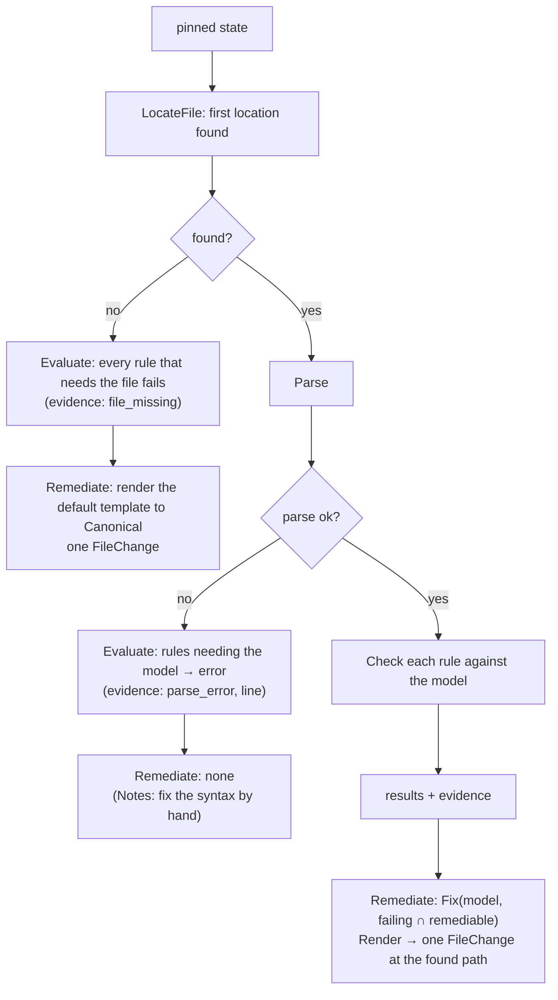

<!-- markdownlint-disable-file MD025 MD041 -->

# DESIGN-0031: Control framework: controls, control rules and file controls

<!--toc:start-->
- [Overview](#overview)
- [Goals and Non-Goals](#goals-and-non-goals)
  - [Goals](#goals)
  - [Non-Goals](#non-goals)
- [Background](#background)
- [Detailed Design](#detailed-design)
  - [Package layout](#package-layout)
  - [The interface](#the-interface)
    - [Supporting types](#supporting-types)
    - [Reader and writer](#reader-and-writer)
  - [Rules and results](#rules-and-results)
  - [File controls](#file-controls)
  - [Built-in control types](#built-in-control-types)
    - [CODEOWNERS](#codeowners)
    - [Catalog info](#catalog-info)
    - [Dependency updates](#dependency-updates)
    - [Generic file (the escape hatch)](#generic-file-the-escape-hatch)
    - [API-remediated types](#api-remediated-types)
  - [The registry](#the-registry)
  - [Shared evaluation reads](#shared-evaluation-reads)
  - [Risks](#risks)
- [API / Interface Changes](#api--interface-changes)
- [Data Model](#data-model)
- [Testing Strategy](#testing-strategy)
- [Migration / Rollout Plan](#migration--rollout-plan)
- [Decisions](#decisions)
- [Open Questions](#open-questions)
  - [OQ1: What does "pattern is owned by owners" mean for CODEOWNERS?](#oq1-what-does-pattern-is-owned-by-owners-mean-for-codeowners)
  - [OQ2: Can catalog-info remediation edit fields in an existing file?](#oq2-can-catalog-info-remediation-edit-fields-in-an-existing-file)
<!--toc:end-->

## Overview

A control is the expected state of one resource, and a control rule is one verifiable requirement of it. This document defines how controls are built in Go:

- the **`Control` interface**, with separate `Evaluate` (read-only) and `Remediate` (produces a change, writes nothing) methods, and the types an evaluation and a change set are made of;
- **results**: how rule results combine into a control status;
- **file controls**: the shared machinery to find, read, parse, render and edit a file, so each file kind's package contains only what is specific to that file;
- the **built-in control types**, starting with `codeowners`, the API-remediated types, and the generic `file` escape hatch.

Policies (who gets which control) are in DESIGN-0030. Running controls and applying their changes is in DESIGN-0032.

## Goals and Non-Goals

### Goals

- **All knowledge of a resource lives in one package.** For example, `internal/controls/codeowners` knows where GitHub looks for CODEOWNERS, how to parse it, what "`.wiz` is owned by X" means, and how to fix it.
- **Remediation is whole-control.** An absent file gets the full template, which satisfies every remediable rule at once. A present file gets the edits for exactly the failing rules, all in one change.
- **Evaluation cannot write.** `Evaluate` receives a reader with no write methods, enforced by the type system and backed by the Evaluation App (DESIGN-0032).
- **Remediation is a value.** `Remediate` returns a change set, and the workflow applies it. Controls stay testable without a GitHub fake that records writes.
- **Built-in guarantees, tested per control type:**
  - remediating and re-evaluating passes every remediable rule;
  - remediating twice changes nothing;
  - the default template passes every rule with `remediate = true`.

### Non-Goals

- **User-defined control types at runtime** (plugins, scripting). A control type is Go code and ships in a release.
- **Arbitrary assertions on arbitrary files.** The generic `file` control renders one template to one path. Anything requirement-level is a control type.
- **Applying changes.** Branches, commits and PRs belong to the remediation workflow (DESIGN-0032).

## Background

v1 evaluates rules with a generic mechanism (`exists` / `contains` / `exact` / `absent` plus regex and `yaml_path` assertions) and remediates by writing a rendered template to a target path. The engine knows nothing about the file it writes, and it evaluates each rule in isolation, so two rules on one file have no shared view of the result: one rule's cleanup could delete a file another rule still required. The catalog-info parser (`internal/catalog`) is the one place that understands a file's format, but only the `custom_properties` reconciler uses it.

## Detailed Design

### Package layout

```text
internal/control/              # the framework: interfaces, results, registry, file helpers
internal/control/controltest/  # the conformance suite every type runs
internal/controls/codeowners/
internal/controls/catalog_info/
internal/controls/dependency_updates/
internal/controls/file/        # the generic escape hatch
internal/controls/repo_settings/
internal/controls/branch_ruleset/
internal/controls/labels/
internal/controls/custom_properties/
```

### The interface

```go
package control

// Type is a control type: Go code that knows one kind of resource.
// It validates a catalogue definition and builds a Control from it.
// One Type serves every catalogue version of its control; a version
// bump is catalogue data, not a new Type.
type Type interface {
    Name() string                          // "codeowners"
    RuleKinds() []RuleKind                 // what rules a definition may declare
    Build(def Definition) (Control, error) // validates parameters at policy load
}

// Control is one catalogue definition, ready to run.
type Control interface {
    ID() ID                // {Slug: "codeowners", Version: 2}
    Resources() []Resource // what it owns (DESIGN-0030 ownership)
    Rules() []Rule         // declared rules, in display order

    // Evaluate reads, never writes. The reader is pinned to one commit
    // of the default branch, or of a remediation PR's head (DESIGN-0032).
    Evaluate(ctx context.Context, in EvalInput) (Evaluation, error)

    // Remediate returns the change that makes the failing, remediable
    // rules pass, computed against the same pinned state. It writes nothing.
    Remediate(ctx context.Context, in RemediationInput) (ChangeSet, error)
}
```

Two methods rather than one `Run(mode)` (D1), because the methods need different capabilities. `Evaluate` must be callable by a process that holds no write credentials. `Remediate` needs no credentials at all, because it returns a value.

#### Supporting types

```go
package control

// ID names one catalogue definition. Version is the integer the
// catalogue declares; policies reference it as "codeowners@2".
type ID struct {
    Slug    string
    Version int
}

// Resource is something exactly one active control may own (DESIGN-0030).
// Kind is file, setting, ruleset, label or property; Key is the path,
// property name, ruleset name or label name. Rendered as
// "file:.github/CODEOWNERS" or "setting:delete_branch_on_merge".
type Resource struct {
    Kind string
    Key  string
}

// RuleKind is a check a Type offers, such as "exists" or "owners".
type RuleKind string

// Rule is one declared requirement of a control.
type Rule struct {
    ID        string         // bare and unique within the control: "wiz-owners"
    Number    string         // display only: "1.2"
    Title     string         // display only
    Kind      RuleKind       // one of Type.RuleKinds()
    Params    map[string]any // kind-specific, validated by Type.Build
    Remediate bool           // Remediate fixes this rule's failures
}

// RuleStatus is the outcome of one rule.
type RuleStatus string

const (
    Pass          RuleStatus = "pass"
    Fail          RuleStatus = "fail"
    Error         RuleStatus = "error"
    NotApplicable RuleStatus = "not_applicable"
)

// RuleResult is one rule's outcome with its evidence.
type RuleResult struct {
    RuleID   string
    Status   RuleStatus
    Evidence map[string]any // typed, versioned, text-only (DESIGN-0027)
}

// ResourceRead records one resource the evaluation looked at.
// DESIGN-0032's fingerprint is built from Evaluation.Results and
// Evaluation.Reads and from nothing else.
type ResourceRead struct {
    Resource Resource
    BlobSHA  string // empty when absent or when the resource is not a blob
    Present  bool
}

// Evaluation is what Evaluate returns.
type Evaluation struct {
    Results []RuleResult
    Reads   []ResourceRead
}

// RepoContext is the repository an evaluation runs against.
type RepoContext struct {
    Org           string
    Name          string
    DefaultBranch string
    SHA           string        // the pinned commit
    Vars          template.Vars // {{ .Org }}, {{ .Repo }}, …
}

// EvalInput is everything Evaluate may use.
type EvalInput struct {
    Repo   RepoContext
    Reader github.Reader // read-only, pinned to Repo.SHA, cached
}

// RemediationInput is EvalInput plus the evaluation of the same state.
type RemediationInput struct {
    EvalInput
    Evaluation Evaluation
}

// FileChange is one file write or delete.
type FileChange struct {
    Path    string
    Content []byte // ignored when Delete is set
    Delete  bool
}

// APIChange is one direct change to a non-file resource.
type APIChange struct {
    Resource Resource
    Op       string // "set" or "delete"
    Value    any    // the resource kind's value type; nil clears
}

// ChangeSet is what a remediation proposes.
type ChangeSet struct {
    Files []FileChange // applied as one commit (DESIGN-0032)
    API   []APIChange  // settings, rulesets, labels, properties
    Notes []string     // manual steps for failing rules with no remediation
}
```

`template.Vars` is new: the variables a control template sees. It replaces `FileVars` for control code; the existing renderer is kept (assumption A10).

#### Reader and writer

Both interfaces are scoped to one repository; the org and the installation are fixed when they are built.

```go
package github

// Reader is everything a control may read. It is pinned to one commit
// and caches, so every control in one evaluation sees the same state.
// It has no write methods. The Evaluation App's token backs it.
type Reader interface {
    GetContents(ctx context.Context, path string) (content []byte, blobSHA string, found bool, err error)
    ListDirectory(ctx context.Context, path string) ([]string, error)
    GetRepository(ctx context.Context) (RepositorySettings, error)
    ListRulesets(ctx context.Context) ([]Ruleset, error)
    GetCustomProperties(ctx context.Context) (map[string]*string, error)
    ListLabels(ctx context.Context) ([]Label, error)
    CodeownersErrors(ctx context.Context) ([]CodeownersError, error)
}

// Writer is what the remediation workflow applies a ChangeSet with.
// Controls never receive it. The Remediation App's token backs it.
type Writer interface {
    CreateOrUpdateFile(ctx context.Context, branch, path string, content []byte, message string) error
    DeleteFile(ctx context.Context, branch, path, message string) error
    UpdateRef(ctx context.Context, branch, sha string, create bool) error
    CreatePullRequest(ctx context.Context, head, base, title, body string) (*PullRequest, error)
    UpdatePullRequest(ctx context.Context, number int, title, body string) error
    ClosePullRequest(ctx context.Context, number int) error
    UpsertPRComment(ctx context.Context, number int, marker, body string) error
    UpdateRepository(ctx context.Context, settings RepositorySettings) error
    UpsertRuleset(ctx context.Context, rs Ruleset) error
    SetCustomProperties(ctx context.Context, props map[string]*string) error
    UpsertLabel(ctx context.Context, l Label) error
}
```

`Reader` is the whole read surface a built-in type needs: file contents for every file control, directory listings for `dependency_updates`' location search, settings and rulesets for `repo_settings` and `branch_ruleset`, properties and labels for their types, and the CODEOWNERS errors endpoint for the `valid` rule kind.

### Rules and results

A rule is declared in the catalogue (DESIGN-0030) using a **rule kind** its control type provides, with parameters the type validates at load:

| Field | Meaning |
| ----- | ------- |
| `id` | stable slug, bare and unique within the control: `wiz-owners`. Logs and the UI qualify it as `codeowners@2/wiz-owners` |
| `number`, `title` | display only: `1.2`, ".wiz is owned by …". Rule numbers are a separate axis from the control's integer version |
| `kind` | a kind the type offers: `exists`, `owners`, … |
| parameters | kind-specific: `pattern`, `owners`, … |
| `remediate` | whether `Remediate` fixes this rule's failures (`remediate = true`); such a rule is **remediable** |

Evaluating a rule gives a **rule result**:

| Status | Meaning |
| ------ | ------- |
| `pass` | the requirement holds |
| `fail` | the requirement does not hold |
| `error` | could not be determined (API error, unparseable input the rule needs) |
| `not_applicable` | the rule does not apply to this repository (for example a rule about a language the repository does not use) |

The brief's model is binary: every rule true means compliant, any rule false means non-compliant. `error` and `not_applicable` are an intentional extension of it. An API error or an unparseable file is not a failure, and reporting it as one would make transient trouble look like drift and send remediation after it; a rule that does not apply must count neither for nor against the repository.

Each result carries **evidence**: typed, versioned, and text-only, the same contract the v2 UI already renders (DESIGN-0027).

The **control status** is derived from the rule results, in this order:

| Rule results | Control status |
| ------------ | -------------- |
| any `fail` | `non_compliant` |
| no `fail`, any `error` | `unknown` |
| all `not_applicable` | `not_applicable` |
| otherwise (every rule `pass` or `not_applicable`) | `compliant` |

`fail` outranks `error` deliberately. A control with one definite failure is non-compliant whatever its other rules could not determine, and that is what remediation acts on. An `error` never triggers remediation (DESIGN-0032).

### File controls

Most controls own a file. The framework provides the shared parts, so a control type writes only what is specific to its file:

```go
package control

// FileSpec describes the file a file control owns.
type FileSpec struct {
    Locations []string // in the precedence GitHub (or the tool) uses; first found wins
    Canonical string   // where a new file is created
}

// LocateFile finds the file a tool would actually use.
func LocateFile(ctx context.Context, r github.Reader, spec FileSpec) (path string, content []byte, found bool, err error)
```

A file control owns `file:<location>` for every location in its `FileSpec`, so a generic `file` control on any of those paths collides with it at policy load.

A file control type implements three things:

1. **Parse(content) → model.** For example, CODEOWNERS entries with their line numbers and comments preserved.
2. **Check(model, rule) → result.** One rule kind, evaluated against the parsed model.
3. **Fix(model, failing rules) → model, and Render(model) → content.** Edits that leave unrelated lines byte-identical.

The framework turns those into `Evaluate` and `Remediate`:



The framework's rules for file remediation:

- **An absent file gets the template.** The template must pass every remediable rule of the control; that is tested at load and in the conformance suite (D2), so one write fixes everything the control can fix. Templates are rendered with the existing `internal/template` renderer (assumption A10).
- **A present file is edited at the path where it was found,** never moved to `Canonical`. Moving a working file is not a remediation anyone asked for.
- **An unparseable file is never overwritten.** Its rules report `error`, and remediation adds a manual note. Replacing a broken file with a template would discard whatever the team meant to write (the INV-0011 A1 principle).
- **Edits are minimal.** `Fix` changes only what failing rules require, and `Render` must round-trip untouched content byte-for-byte. A property test enforces this per type.

### Built-in control types

#### CODEOWNERS

| Aspect | Behaviour |
| ------ | --------- |
| Locations | `.github/CODEOWNERS`, `CODEOWNERS`, `docs/CODEOWNERS`; the first found is the one GitHub uses (assumption A21) |
| Resources | `file:.github/CODEOWNERS`, `file:CODEOWNERS`, `file:docs/CODEOWNERS` |
| Model | ordered entries `{pattern, owners, line}`, with comments and blank lines preserved |
| Rule kind `exists` | a CODEOWNERS file is found and parses. "Parses" means the parser accepts every line and the file has at least one non-comment entry with at least one owner; a syntax error fails `exists` with the line as evidence |
| Rule kind `valid` | GitHub's CODEOWNERS errors endpoint reports no errors (D3, assumption A22). `remediate = false`: unknown owners and bad patterns need a human. When the endpoint is unsupported for the installation, the rule passes on parser evidence (`validator = parser`); a transient endpoint error is `error` |
| Rule kind `owners` | `pattern` is owned by at least `owners` (OQ1 defines "owned") |
| Rule kind `default_owner` | `*` has an owner |
| Fix for `owners` and `default_owner` | write the missing `pattern owner…` lines ordered least- to most-specific. CODEOWNERS is last-match-wins across **every** pattern that matches a path, not per identical pattern, so a narrow pattern is inserted before any trailing `*` line and never appended after it; a new `*` line goes last |
| Template | the operator's `codeowners` template, which must satisfy every remediable rule (tested) |

The wiz example under this type:

- **No CODEOWNERS:** the template is written, and it already contains the `.wiz` line, because the template must pass `wiz-owners`.
- **A team's CODEOWNERS without `.wiz`:** one line is inserted before the file's `*` line, or appended when there is none, and the team's file is otherwise untouched.
- **`default_owner` and `wiz-owners` both failing:** the `.wiz` line is written before the new `*` line, so the default owner cannot override the `.wiz` owners it was written next to.
- **An org that does not get the control:** it is never evaluated there (DESIGN-0030), so it cannot touch the file.

#### Catalog info

- **Locations:** `catalog-info.yaml`, `catalog-info.yml`. Resources `file:catalog-info.yaml`, `file:catalog-info.yml`.
- **Model:** `internal/catalog`'s parse (assumption A11), extended to keep the YAML node tree for minimal edits.
- **Rule kinds:**
  - `exists` and `kind` (the entity is a Component): remediable, the template satisfies both;
  - `field_set` (`spec.owner`, `spec.system`, …), optionally with a `contains`, `annotation_set` and `no_placeholders`: `remediate = false`. A template cannot know a repository's owner or system, and a placeholder that satisfies `field_set` is exactly what `no_placeholders` exists to catch.
- **Remediation:**
  - an absent file gets the template, which passes `exists` and `kind` and leaves the field rules failing with `Notes` until a human fills the PR in;
  - a present file gets no automatic remediation by default, because a filled-in catalog-info is owned by its team, and a failing field needs a human value. Failing rules produce `Notes` in the PR.
  - Whether field-level fixes are allowed is OQ2.

#### Dependency updates

One control for one opinion, which replaces v1's `renovate_config` and `dependabot` rules and the `when` gate between them:

- **Parameters:** `tool = "renovate" | "dependabot"`, and `renovate.extends = "github>org/preset"`.
- **Locations, all owned as `file:<path>`:**
  - Dependabot: `.github/dependabot.yml`, `.github/dependabot.yaml`;
  - Renovate: `renovate.json`, `renovate.json5`, `.renovaterc`, `.renovaterc.json`, `.renovaterc.json5`, `.github/renovate.json`, `.github/renovate.json5`, and the `renovate` key of `package.json`.
- **Rule kinds:**
  - `configured` (the chosen tool's config exists);
  - `extends` (the Renovate config extends the preset);
  - `exclusive` (the other tool's config is absent).
- **Remediation:** write the chosen tool's config from its template, add the preset to `extends` in an existing Renovate config (JSON only; JSON5 gets a note, D5), and delete the other tool's config. All of it is one change set: one PR, with no loop possible.

#### Generic file (the escape hatch)

- **Parameters:** `path`, `template`, `mode`, where `mode` is exactly one of `exists` | `exact`.
- **Rules:**
  - `exists`: the file is present;
  - `exact`: the file equals the rendered template (YAML-semantic comparison for `.yml`/`.yaml`, byte comparison otherwise, as v1).
- **One mode, never both.** `exact` subsumes existence, because an absent file is never equal to the template, so declaring both would be redundant and would put two rules on one path. There is no `contains` (D6).
- **Remediation:** write the template.
- **Owns `file:<path>`.** That is one path and one owner, so a requirement-level check on that file means writing a control type.

#### API-remediated types

`repo_settings`, `branch_ruleset`, `labels` and `custom_properties` remediate through `ChangeSet.API`, not files. Each declares the resources it owns, so two definitions that manage the same label or property collide at policy load like two file controls on one path.

**Repository settings** (`repo_settings`)

| Aspect | Behaviour |
| ------ | --------- |
| Resources | `setting:<property>` for each property the definition names (`delete_branch_on_merge`, `allow_merge_commit`, …) |
| Rule kind `equals` | the property has the declared value |
| Fix | `APIChange{setting:<property>, set, value}` |

**Branch ruleset** (`branch_ruleset`)

| Aspect | Behaviour |
| ------ | --------- |
| Resources | `ruleset:<name>` |
| Rule kind `exists` | a ruleset with that name is present and active |
| Rule kind `matches` | its rules equal the declared ruleset (YAML-semantic comparison, as v1) |
| Fix | `APIChange{ruleset:<name>, set, ruleset}`, one upsert |

**Labels** (`labels`)

| Aspect | Behaviour |
| ------ | --------- |
| Resources | `label:<name>` for every label the definition manages, including the ones it retires |
| Rule kind `present` | the label exists with the declared colour and description |
| Rule kind `absent` | a retired label is gone |
| Fix | `APIChange{label:<name>, set, label}` or `APIChange{label:<name>, delete, nil}` |

**Custom properties** (`custom_properties`)

| Aspect | Behaviour |
| ------ | --------- |
| Resources | `property:<name>` for `Owner`, `Component` and every mapped annotation (the managed set of DESIGN-0019). It reads `catalog-info.yaml` through the shared reader but does not own it |
| Rule kind `matches` | the property equals the value derived from `catalog-info.yaml`; `not_applicable` when the file is absent or is not a Component |
| Rule kind `defined` | the org schema defines the property; `remediate = false` |
| Fix | `APIChange{property:<name>, set, value}`, with a nil value to clear |

Each carries `remediation { apply = "pr" | "direct" }` in its catalogue definition, default `pr`. Under `pr` the change is proposed, not applied: the remediation PR carries a workflow that applies it on merge (v1's `github-action` mode) and the notes describe it. Under `direct` the remediator applies it through `github.Writer` with no review step. Whether `direct` is allowed in `remediate` mode is DESIGN-0032 OQ4; App permissions are per installation, so that opt-in narrows what repo-guardian does, not what its App may do.

### The registry

```go
control.Register(codeowners.Type{})
```

At policy load, every catalogue definition is passed to its type's `Build`, which validates rule kinds and parameters and compiles templates. Load fails on unknown types, unknown rule kinds, bad parameters, or a template that fails its own remediable rules. The template check renders the template with the type's sample variables (org `example-org`, repository `example`) and evaluates the control against the output; it runs at load and again in the conformance suite (D2). A template whose output depends on real repository data is caught by the runtime self-check: after `Remediate`, the workflow evaluates the changed content and refuses a change that does not pass (DESIGN-0032).

A definition's version is part of its `ID`. The same `Type` builds `codeowners@1` and `codeowners@2`, so bumping a version is a catalogue change, not a release.

### Shared evaluation reads

Several controls read the same data. For example, `catalog_info` and `custom_properties` both read `catalog-info.yaml`. The evaluation workflow gives every control in one evaluation the same `github.Reader`, which is pinned to one SHA and caches reads. Each file is fetched once per evaluation, whatever the number of controls. Controls stay independent: none reads another control's *results* (D4).

### Risks

- **CODEOWNERS fix ordering** is where a wrong assumption about last-match-wins would reproduce v1's two-rules-on-one-file conflict inside one control. The two-rules-fail-together fixture in the conformance suite is the guard.
- **`valid` depends on an endpoint not every installation has** (assumption A22). The parser fallback hides unknown-owner errors there; the `validator = parser` evidence makes that visible.
- **A template can pass the sample-variable check and fail on a real repository.** The runtime self-check after `Remediate` is the backstop, and it costs one extra evaluation per remediation.
- **`apply = "direct"` has no review step.** DESIGN-0032 OQ4 decides whether it is allowed at all.
- **Minimal-edit encoders** for YAML and JSON are the hardest code in the set. D5 keeps JSON5 out of it.

## API / Interface Changes

- New packages `internal/control`, `internal/control/controltest` and `internal/controls/*`.
- `github.Reader` and `github.Writer` as defined above. They replace the single `github.Client` for control and remediation code (assumption A12).
- `template.Vars`, the variables a control template sees.
- Catalogue HCL as in DESIGN-0030; rule kinds and parameters per type, documented from the types' own metadata (`RuleKinds()`), so the docs cannot drift from the code.

## Data Model

Controls are stateless. Results and evidence are persisted by the evaluation workflow (DESIGN-0032): `rule_results` is keyed `(repository_id, control_id, rule_id)` with the bare rule id, and `control_results` carries the integer `control_version`. Evidence is versioned JSON per `(control type, rule kind)`, and the UI renders only versions it knows (the v2 evidence contract).

## Testing Strategy

Per control type, in its own package:

1. **Fixture tables:** repository states (no file, each location, each rule passing or failing, unparseable, multiple locations) × rules → expected results and evidence.
2. **Remediation property:** for every fixture, the following must hold for every remediable rule:

   ```text
   evaluate(apply(state, remediate(state))) passes every remediable rule
   ```

3. **Idempotence:** `remediate(apply(state, remediate(state)))` is an empty change set.
4. **Minimal edits:** untouched lines are byte-identical after `Fix`/`Render`. Round-trip fuzzing of the parser (`Render(Parse(x)) == x`) covers this for every input the parser accepts.
5. **Template passes its rules:** the default template (and any operator template in tests) evaluated with sample variables passes every remediable rule of the control.
6. **Two rules failing together:** every file type with more than one remediable rule kind ships a fixture where two of them fail at once (for CODEOWNERS, `default_owner` and an `owners` rule), and the remediated file must pass both. This is the test for the ordering class of bug.
7. **Framework tests:** `LocateFile` precedence, control-status derivation (every row of the table), and registry validation errors.

A shared conformance suite (`control/controltest`) runs properties 2–6 against any type given its fixtures. A new control type gets them by adding fixtures.

Resource-ownership collisions between controls are not this suite's job. They are a property of a policy, not of a type, and DESIGN-0030's load-time validator (its resolution section) catches them.

## Migration / Rollout Plan

The order in which types are built:

1. `codeowners`: the motivating case, and the reference implementation of a file control.
2. `file`.
3. `catalog_info`.
4. `dependency_updates`.
5. The API types.

The first evaluate-only rc needs only the types that v1's built-in defaults cover.

## Decisions

Former open questions this document settles.

- **D1 `Evaluate` + `Remediate`, not one `Run(mode)`** — two methods, with `Remediate` returning a `ChangeSet`. The type system enforces the capability split: evaluation workers call a method whose inputs hold no writer, and remediation is a pure function of state. A single `Run(ctx, mode, client)` needs a client capable of both, and a `Remediate` that writes through a `Writer` re-creates per-control commit logic and partial applies.
- **D2 The template check runs at load and in the conformance suite** — the template is rendered with the type's sample variables and the control is evaluated against the output; load fails at deploy, the suite fails in CI, and the runtime self-check after `Remediate` covers templates that depend on real repository data.
- **D3 `valid` is a separate CODEOWNERS rule kind** — GitHub's errors endpoint reports unknown owners and bad patterns, the common real-world failure. Keeping it separate leaves `exists` cheap and lets a policy choose.
- **D4 Controls share reads, never results** — one cached reader per evaluation; `custom_properties` parses `catalog-info.yaml` itself through the shared parser. Evaluation order never matters, and one control's failure cannot cascade into another. Explicit dependencies would introduce a graph and order-dependent results.
- **D5 JSON Renovate configs get minimal edits; JSON5 gets a note** — a node-preserving JSON encoder for `.json`; a JSON5 `extends` failure becomes a manual note instead of rewriting a team's commented file through a JSON encoder.
- **D6 The generic `file` control is `exists` or `exact` only** — no `contains` and no `absent`. Anything that inspects inside a file is, by definition, a control type, and "this path must not exist" belongs to a type that knows why the file is forbidden.

## Open Questions

### OQ1: What does "`pattern` is owned by `owners`" mean for CODEOWNERS?

- (a) ✅ recommended: **effective ownership.** Using last-match-wins over the whole file, the owners GitHub would request for a path matching `pattern` include every listed owner. That is what the requirement means in practice, and the ordered insert (narrow patterns before any trailing `*`) satisfies it by construction.
- (b) A literal line: there is a line whose pattern is exactly `.wiz` with exactly those owners. Simple to check, but a broader later line (for example `* @org/other`) silently overrides it and the check still passes.
- (c) A literal line *and* effective ownership. Strict, but it fails files that are correct under (a) and written differently.
- other:

### OQ2: Can catalog-info remediation edit fields in an existing file?

- (a) ✅ recommended: **no, only create from the template when absent; failing fields become manual notes in the PR or report.** Field values (owner, system) need human knowledge, and inventing them produces plausible-looking wrong data.
- (b) Fill missing fields with placeholders. Every rule then passes structurally, but `no_placeholders` fails forever. It recreates a loop in a new form.
- (c) Per-rule opt-in (`remediate = true` on a field rule with a `value` parameter). Only for fields with an org-wide constant value.
- other:
