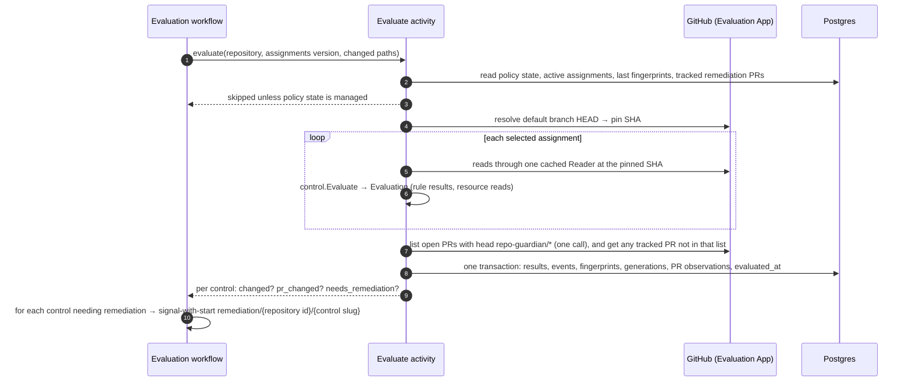
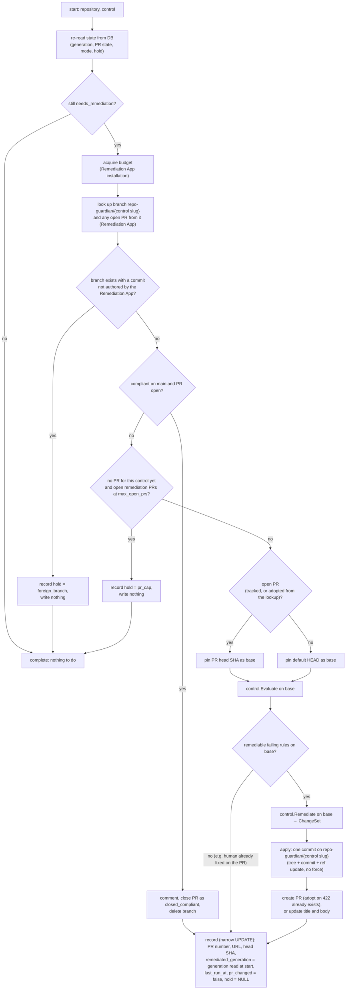
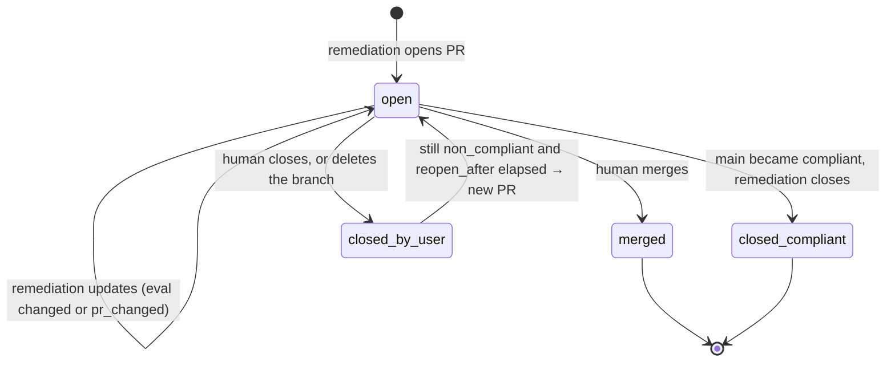

<!-- markdownlint-disable-file MD025 MD041 -->

# DESIGN-0032: Evaluation and remediation workflows: change-driven remediation with per-control PRs

<!--toc:start-->
- [Overview](#overview)
- [Goals and Non-Goals](#goals-and-non-goals)
  - [Goals](#goals)
  - [Non-Goals](#non-goals)
- [Background](#background)
- [Detailed Design](#detailed-design)
  - [Two GitHub Apps](#two-github-apps)
  - [Roles](#roles)
  - [Evaluation](#evaluation)
    - [When it runs](#when-it-runs)
    - [What one evaluation does](#what-one-evaluation-does)
    - [Change detection: fingerprints and generations](#change-detection-fingerprints-and-generations)
    - [PR observation](#pr-observation)
  - [Remediation](#remediation)
    - [Workflow shape](#workflow-shape)
    - [What one run does](#what-one-run-does)
    - [PR lifecycle](#pr-lifecycle)
  - [API remediations](#api-remediations)
- [Data Model](#data-model)
- [API / Interface Changes](#api--interface-changes)
- [Metrics](#metrics)
- [Failure semantics](#failure-semantics)
- [Temporal mapping](#temporal-mapping)
- [Testing Strategy](#testing-strategy)
- [Migration / Rollout Plan](#migration--rollout-plan)
- [Decisions](#decisions)
- [Open Questions](#open-questions)
  - [OQ1: How is "something changed" tracked for remediation?](#oq1-how-is-something-changed-tracked-for-remediation)
  - [OQ2: Per-control PRs only, or a cap on how many open at once?](#oq2-per-control-prs-only-or-a-cap-on-how-many-open-at-once)
  - [OQ3: What happens after a human closes a remediation PR while the control still fails?](#oq3-what-happens-after-a-human-closes-a-remediation-pr-while-the-control-still-fails)
  - [OQ4: Do API remediations (settings, rulesets, labels, properties) apply directly?](#oq4-do-api-remediations-settings-rulesets-labels-properties-apply-directly)
<!--toc:end-->

## Overview

This document specifies how controls run.

- **Evaluation** runs every assigned control (DESIGN-0030) against a repository's default branch, through the read-only **Evaluation App**. It records the results, and detects whether anything *changed* since the last evaluation. It runs on a schedule and on events, and it is always safe to run again. It only looks at repositories whose policy state is `managed`: parked, excluded and unmanaged repositories (DESIGN-0030) are never read.
- **Remediation** runs through the separate, write-capable **Remediation App**, only for assignments in `remediate` mode, and only when there is a reason:
  - the evaluation changed;
  - a human edited the remediation PR;
  - a human closed it while the control still fails.

  It keeps **one PR per control** and records the PR's whole lifecycle.

The two are connected by the database and by **eval generations**: per-control counters that make "has anything changed since remediation last acted?" a comparison rather than a flag that can be lost.

## Goals and Non-Goals

### Goals

- **Evaluation is idempotent and current.** Every evaluation reads the default branch at a pinned commit, writes results, and updates `evaluated_at` (the brief's "last reconciled"), so the UI always shows the latest known posture.
- **Remediation acts only on change.** A repository that fails the same way on every evaluation gets one PR and then silence.
- **Humans win.** A human's edits to a remediation PR are built on, never overwritten. A closed PR is respected for a cooldown. A merged PR is never reopened. A branch that carries someone else's commits is never written to.
- **Every PR is accounted for.** Number, URL, branch, created, last run, head SHA, state and close reason are stored, so "open remediation PRs older than 30 days, by org and control" is one query.
- **Least privilege by construction.** The evaluation path holds a key that cannot write. Orgs in evaluate mode never install the Remediation App.
- **Nothing blocks in a handler, and nothing half-applies.** The IMPL-0022 rules still apply: deferral, not sleep. A remediation lands as one commit (a ref update), or not at all.

### Non-Goals

- **Detecting humans' own fix PRs.** v1 matched other PRs by `search_terms` (D5).
- **Batching several controls into one PR** (OQ2).
- **Auto-merging remediation PRs.**

## Background

v2 today runs one `RepoWorkflow` per repository. It calls a check activity that both evaluates and remediates through v1's engine — one pass per rule, with no shared view of the result — under a single App with write permissions. `findings` record a per-rule verdict plus a `remediation` facet (`pr_open`, `foreign_pr`, …). This design keeps the per-repository workflow shape (assumption A1) and separates the two halves.

## Detailed Design

### Two GitHub Apps

repo-guardian runs as **two GitHub Apps** (D1). The private key is the security boundary: a process holding a write-capable App's key can mint a write token whatever it intends, so the evaluator holds a key that *cannot* write. Each App is installed per org, has its own installation id, its own rate budget, its own Temporal task queue and its own worker role, so evaluation and remediation scale independently and evaluation load never starves remediation.

| | Evaluation App | Remediation App |
| --- | --- | --- |
| Installed on | every org in the enterprise policy | only orgs with any `remediate` assignment |
| Repository permissions | Metadata: read · Contents: read · Pull requests: read · Issues: read · Administration: read · Custom properties: read | Contents: read and write · Pull requests: read and write · plus **read and write** on every resource kind a registered control type can remediate: Administration (`repo_settings`, `branch_ruleset`), Custom properties (`custom_properties`), Issues (`labels`) |
| Webhooks | `installation`, `installation_repositories`, `repository`, `push`, `pull_request` — including `pull_request` events for PRs the Remediation App opened, because webhooks are delivered per repository, not per author App | none |
| Key held by | evaluator workers (ingest holds only the webhook secret) | remediator workers |
| Budget workflow | `installation/eval/<installation id>` | `installation/remediate/<installation id>` |
| Task queue · role | `repo-guardian-eval` · `evaluator` | `repo-guardian-remediate` · `remediator` |

- **The Remediation App's permission set is derived, not hand-listed.** The control registry (DESIGN-0031) knows which resource kinds the registered types can remediate; the binary prints the required set at startup and the operator docs list it. The exact GitHub permission names are an assumption to verify (A23).
- **The Remediation App needs the read half too**, because a remediation run re-evaluates the base it is about to write (see [What one run does](#what-one-run-does)); it does not trust an evaluation that may be minutes old.
- **Separate rate budgets.** Each App installation has its own id and its own rate limit. v2's budget workflow is keyed by installation id alone today (assumption A2 is rewritten: the key gains an app dimension), so the workflow id becomes `installation/<app>/<installation id>` and the two budgets never interact.
- **Installations are stored per App.** `installations` gains `app IN ('eval', 'remediate')`. A repository is evaluable when the Evaluation App's installation covers it, and remediable when the Remediation App's does too. Resolution (DESIGN-0030) reads both: an org without the Remediation App resolves every assignment to `mode = 'evaluate'` with `mode_reason = 'remediation_app_not_installed'`, so such assignments never reach the remediator.
- **Ingest** validates the Evaluation App's webhook secret, as today (the `ingest` role holds no private key).

### Roles

| Role | Holds | Runs | Scales on |
| ---- | ----- | ---- | --------- |
| `ingest` | Evaluation App webhook secret | webhook → `WebhookWorkflow` (A13) | HTTP load |
| `evaluator` | Evaluation App key, store | discovery, resolution, evaluation, snapshot workflows on task queue `repo-guardian-eval` | KEDA on the `repo-guardian-eval` backlog |
| `remediator` | Remediation App key, store | remediation workflows on task queue `repo-guardian-remediate` | KEDA on the `repo-guardian-remediate` backlog |
| `api` | read-only store DSN | API | HTTP load |

Splitting `worker` into `evaluator` and `remediator` (D2) gives the secret-scoping guarantee in v2's chart-helper form: `roleHasRemediationKey` is true only for `remediator` and `all`, mirroring how `ingest` already refuses the App key. `all` runs every role for small installs.

### Evaluation

#### When it runs

| Trigger | Signal to the repository's evaluation workflow | Controls evaluated |
| ------- | --------------------------------------------- | ------------------ |
| schedule (`EVAL_INTERVAL`, jittered) | timer | all active assignments |
| push to the default branch | `recheck` (priority 2), carrying the changed paths | only controls whose `Resources()` (DESIGN-0031) intersect the changed paths; all when the paths are unknown (a push payload over GitHub's 20-commit limit) |
| `pull_request` event on a `repo-guardian/*` branch | `pr_event` (priority 2) | the control the branch belongs to (PR observation only) |
| assignments changed (policy rollout, discovery) | `policy_changed`, spread over the rollout window | all |
| manual (API or UI "re-evaluate") | `recheck` (priority 1) | all |

These reuse `RepoWorkflow`'s selector, coalescing and priority keys (assumption A1). The workflow id stays `repo/<repository id>`. Scoping push rechecks by `Resources()` is what v1's watched-path set did; v1's `workflow_sync` reconciler, whose only function was feeding that set, is absorbed by it.

The evaluator first reads `repository_policy_state` (DESIGN-0030) and skips any repository whose `state` is not `managed`: a parked repository (archived, fork, removed, access denied) is never read, and only discovery un-parks it, exactly as today.

#### What one evaluation does



#### Change detection: fingerprints and generations

For each (repository, control), evaluation computes a **fingerprint** from the `Evaluation` the control returned (DESIGN-0031: `Results` and `Reads`):

```text
fingerprint = sha256( control id@version
                    , for each rule result: (rule id, status)
                    , for each resource read: (resource, blob SHA or "absent") )
```

- Rule *statuses* catch compliance changes.
- Resource *blob SHAs* catch "still failing, but the file changed" (D3). For example, a team edited CODEOWNERS on main without adding `.wiz`. The open PR may now conflict, so remediation must rebase its change onto the new content.
- Timestamps, evidence wording and the pinned commit SHA are excluded, so an unrelated push does not count as a change.

**A missing prior row is a change.** The first evaluation of a (repository, control) inserts the row with `eval_generation = 1`; the column default of 0 is what `remediated_generation` starts at, never what an evaluation writes. Onboarding therefore triggers remediation on the first evaluation: `1 > 0`.

If the fingerprint differs from the stored one, the evaluation **bumps `eval_generation`** for that control and records the transition in `result_events` (with the control version that produced it). Otherwise it updates only `evaluated_at`.

**Why a generation counter, not a `changed_since_last_eval` boolean (OQ1).** A boolean that the *next evaluation* resets loses changes whenever two evaluations run before remediation does. That happens with remediation backlogged, the Remediation App not yet installed, or the mode switched to `remediate` later:

| Step | Boolean | Generation |
| ---- | ------- | ---------- |
| first evaluation, new row | `changed = true` | `eval_gen = 1`, `remediated_gen = 0` |
| eval 1: result changes | `changed = true` | `eval_gen = 5` |
| eval 2: no change, remediation has not run yet | `changed = false` ← **change lost** | `eval_gen = 5` |
| remediation runs | sees `false`, skips forever | `remediated_gen = 4 < 5` → runs, then sets `remediated_gen = 5` |

Only remediation advances `remediated_generation`, and only after it has acted. So no evaluation can erase a pending change.

#### PR observation

Each evaluation also observes the remediation PRs it tracks, through the Evaluation App. `pull_request` webhooks reach the Evaluation App whichever App opened the PR, so no polling is needed between schedules.

| Observation | Recorded as | Effect |
| ----------- | ----------- | ------ |
| PR head SHA ≠ `head_sha_at_last_remediation` | `pr_changed = true` | a human pushed to the PR, so remediation re-runs on the PR head |
| PR closed, not merged, not by repo-guardian | state `closed_by_user`, `closed_at` | remediation may open a new PR after the cooldown (OQ3) |
| PR merged | state `merged` | nothing; the next evaluation of main sees the result |
| PR missing (branch or PR deleted) | state `closed_by_user` | same as closed |

`needs_remediation` for a control is:

```text
repository policy state = managed
AND mode = remediate                                   -- already false when mode_reason = remediation_app_not_installed
AND (
      ( status = non_compliant AND any failing rule has remediate = true
        AND ( eval_generation > remediated_generation  -- true for a new row: 1 > 0
              OR pr_changed
              OR (state = closed_by_user AND reopen_after elapsed) ) )
   OR ( status = compliant AND state = open )          -- close it as compliant
)
```

An `unknown` status never triggers remediation. Not knowing is not a reason to write.

### Remediation

#### Workflow shape

One workflow per (repository, control): `remediation/<repository id>/<control slug>`, started by **signal-with-start** from the evaluation workflow. A signal arriving while a run is in progress sets a "re-check at end" flag rather than starting a second run, so at most one remediation runs per control at a time (D6). When a run ends, it **re-reads `eval_generation` and `pr_changed` from the database**; if either moved past what the run started from, or the flag is set, it loops once more before completing. The reloop does not depend on a signal having been delivered.

A periodic backstop (`remediation-sweep` schedule, hourly) queries for `needs_remediation` rows with no running workflow and signals them. It only matters if a signal was lost, or a run ended on a hold (PR cap) that has since cleared.

#### What one run does



Key behaviours:

- **Find or adopt before any write.** The run looks up the branch `repo-guardian/<control slug>` and any open PR whose head is that branch, through the Remediation App, independently of the `remediations` row. A branch whose every commit was authored by the Remediation App is adopted (this is how a run recovers from "PR create failed after the commit"). A branch with any other commit is **not touched**: the run records `hold = 'foreign_branch'`, writes nothing, and the failure table says so. A replayed create-PR that returns 422 "a pull request already exists" lists PRs by head and adopts the existing one.
- **Evaluating the PR head, not main, when a PR exists.** If a human filled in data on the PR branch (catalog-info, for example), those rules now pass on the base, and remediation adds only what is still failing. It never reverts the human's work.
- **Re-evaluate before writing.** The run re-evaluates the base itself instead of trusting the evaluation's results. State may have moved since, and this costs a few reads (which is why the Remediation App holds read permissions).
- **One commit, optimistic.** The ref update is not forced. If the branch moved between pinning and writing (a human pushed), the run defers and retries, re-pinning the new head. Nothing is half-applied, and nothing is overwritten.
- **A new branch is cut from default HEAD.** Branch name `repo-guardian/<control slug>` (D4).
- **The PR cap.** `remediation.max_open_prs` (DESIGN-0030, default 3) bounds open remediation PRs per repository. Controls are processed in enterprise-policy order. When the cap is reached and this control has no PR yet, the run records `hold = 'pr_cap'` and ends without writing; `needs_remediation` stays true, and the next PR close or merge on the repository (observed by evaluation) or the backstop sweep picks it up. A control that already has an open PR is never held by the cap: updating it opens nothing new.
- **The PR body is rendered from the evaluation:** each failing rule with its number and title, what this PR changes, and `Notes` for failing rules with no remediation. Title and body templates come from the control's `pr {}` block (DESIGN-0030), rendered with `internal/template` (assumption A10).
- **`remediated_generation` is the generation read at the start of the run,** not the current one. An evaluation that changed during the run is therefore picked up by the end-of-run loop.
- **Invariant: record-is-narrow.** The record step is an `UPDATE` of exactly `remediated_generation`, `pr_changed = false`, `hold` and the PR columns. It never writes `eval_generation`, `status`, `fingerprint` or `evaluated_at`, which belong to evaluation. A full-row save here would clobber a concurrent evaluation's bump with the stale start-of-run value — the exact loss the generation counters exist to prevent — and the reloop would then have nothing to see.

#### PR lifecycle



Each transition writes a `remediation_events` row. A new PR after `closed_by_user` is a new `remediations` row, and the closed one keeps its history. A hold (`pr_cap`, `foreign_branch`) is not a PR state: it lives on `control_results` because there may be no PR yet.

### API remediations

Controls whose `ChangeSet` has `API` changes (`repo_settings`, `branch_ruleset`, `labels`, `custom_properties`) have no PR to review. The catalogue entry for such a control carries `remediation { apply = "pr" | "direct" }` (DESIGN-0030), default `pr`. For an API resource, `pr` means the change is **reported, never written**: the run records a `remediations` row of kind `api` in state `recommended` with the before/after values, shown in the UI as a recommended change. `direct` applies it through the Remediation App and records the applied change with before/after values as a `remediation_events` row. OQ4 is whether `direct` should exist at all.

## Data Model

These tables replace `findings`, `finding_events`, `rule_state`-style posture and v2's `remediation` facet (assumption A5). `checks` becomes the evaluation log (A6). `control_assignments` and `repository_policy_state`, which these join on `(repository_id, control_id)` and `repository_id`, are DESIGN-0030's.

```sql
CREATE TABLE control_results (            -- current state, one row per repository and control
    repository_id          BIGINT NOT NULL REFERENCES repositories(id),
    control_id             TEXT   NOT NULL,
    control_version        INT    NOT NULL,
    status                 TEXT   NOT NULL CHECK (status IN ('compliant','non_compliant','unknown','not_applicable')),
    fingerprint            TEXT   NOT NULL,
    eval_generation        BIGINT NOT NULL,            -- evaluation inserts 1 on the first row
    remediated_generation  BIGINT NOT NULL DEFAULT 0,  -- only remediation writes it
    pr_changed             BOOLEAN NOT NULL DEFAULT false,
    hold                   TEXT   CHECK (hold IN ('pr_cap','foreign_branch','permission')),
    hold_since             TIMESTAMPTZ,
    evaluated_sha          TEXT   NOT NULL,            -- default-branch commit evaluated
    evaluated_at           TIMESTAMPTZ NOT NULL,       -- the brief's "last reconciled"
    last_changed_at        TIMESTAMPTZ NOT NULL,
    PRIMARY KEY (repository_id, control_id)
);

CREATE TABLE rule_results (               -- current state, one row per rule
    repository_id    BIGINT NOT NULL,
    control_id       TEXT   NOT NULL,
    rule_id          TEXT   NOT NULL,                  -- bare id, unique within the control
    status           TEXT   NOT NULL CHECK (status IN ('pass','fail','error','not_applicable')),
    remediate        BOOLEAN NOT NULL,                 -- the rule's remediate attribute
    evidence         JSONB  NOT NULL,
    evidence_version SMALLINT NOT NULL,
    PRIMARY KEY (repository_id, control_id, rule_id),
    FOREIGN KEY (repository_id, control_id) REFERENCES control_results
);

CREATE TABLE result_events (              -- append-only transitions (grant-enforced, as finding_events)
    id              BIGSERIAL PRIMARY KEY,
    repository_id   BIGINT NOT NULL,
    control_id      TEXT   NOT NULL,
    control_version INT    NOT NULL,                   -- the version that produced the transition
    rule_id         TEXT,                              -- NULL for a control-status transition
    from_status     TEXT,
    to_status       TEXT   NOT NULL,
    eval_generation BIGINT NOT NULL,
    occurred_at     TIMESTAMPTZ NOT NULL
);

CREATE TABLE remediations (               -- one row per PR, or per API remediation
    id                     BIGSERIAL PRIMARY KEY,
    repository_id          BIGINT NOT NULL,
    control_id             TEXT   NOT NULL,
    kind                   TEXT   NOT NULL CHECK (kind IN ('pull_request','api')),
    state                  TEXT   NOT NULL CHECK (state IN ('open','merged','closed_compliant','closed_by_user','recommended','applied','failed')),
    pr_number              INT,
    pr_url                 TEXT,
    branch                 TEXT,
    head_sha_at_last_remediation TEXT,
    remediated_generation  BIGINT NOT NULL,
    created_at             TIMESTAMPTZ NOT NULL,
    last_run_at            TIMESTAMPTZ NOT NULL,       -- last remediation run that touched this row
    closed_at              TIMESTAMPTZ,
    close_reason           TEXT
);
-- at most one open PR per repository and control
CREATE UNIQUE INDEX remediations_one_open
    ON remediations (repository_id, control_id) WHERE state = 'open';

CREATE TABLE remediation_events (         -- append-only: opened, updated, closed, applied, failed
    id              BIGSERIAL PRIMARY KEY,
    remediation_id  BIGINT NOT NULL REFERENCES remediations(id),
    kind            TEXT   NOT NULL,
    detail          JSONB  NOT NULL,                   -- before/after values for API changes
    occurred_at     TIMESTAMPTZ NOT NULL
);
```

Two writers share `control_results` by column, never by row: evaluation owns `status`, `fingerprint`, `eval_generation`, `evaluated_sha`, `evaluated_at`, `last_changed_at` and sets `pr_changed = true`; remediation owns `remediated_generation`, `hold`, `hold_since` and clears `pr_changed` (record-is-narrow).

The **compliance snapshots** become `(org, control_id, source, snapshot_at)`, carrying compliant, non-compliant, unknown, not-applicable and excluded counts. That keeps the one-shared-SQL-query rule (IMPL-0025 Phase 8) with the new keys.

## API / Interface Changes

The resources replace `/rules` and `/findings` (assumption A14):

| Endpoint | Returns |
| -------- | ------- |
| `/controls`, `/controls/{id}` | catalogue entry plus fleet compliance and per-org breakdown |
| `/policies` | the loaded snapshot summary: enterprise orgs, org policies, exclusions |
| `/orgs/{org}` | baseline-versus-org compliance, worst controls, exclusions |
| `/repositories/{id}/controls` | assignments with provenance and mode reason, statuses, rule results, evidence, holds and the latest remediation |
| `/repositories/{id}/events` | assignment, result and remediation events merged into one timeline |
| `/remediations` | filter by state, org, control, age; open PRs older than N days |
| `/summary`, `/status` | as today, with evaluation freshness and remediation backlog |

Every query keeps the scope predicate (assumption A14).

Configuration and chart:

| Change | Detail |
| ------ | ------ |
| `EVAL_INTERVAL` | replaces `CHECK_INTERVAL`; the evaluation schedule |
| `TEMPORAL_TASK_QUEUE` | split into `repo-guardian-eval` and `repo-guardian-remediate`; each role registers on its own |
| roles | `worker` becomes `evaluator` and `remediator`; chart helpers `roleHasEvalKey`, `roleHasRemediationKey` |
| secrets | two App keys and two webhook secrets are never mounted into the same role except `all` |
| KEDA | one `ScaledObject` per task queue |

## Metrics

| Metric | Labels |
| ------ | ------ |
| `evaluations_total` | `org`, `outcome` = `evaluated`/`error`/`skipped` |
| `evaluation_errors_total` | `org`, `control` — a fleet-wide permission failure shows as every control of an org erroring, which `evaluations_total` alone cannot distinguish from sporadic per-repository errors |
| `evaluation_changes_total` | `org`, `control` |
| `controls_status` (leader-exported gauge, IMPL-0023 pattern; query with `max by`) | `org`, `control`, `status` |
| `remediation_runs_total` | `org`, `control`, `result` = `opened`/`updated`/`noop`/`closed_compliant`/`deferred`/`error` |
| `remediation_prs_open` (gauge) | `org`, `control`, `age_bucket` |
| `remediation_blocked_total` | `org`, `reason` = `app_not_installed`/`permission`/`foreign_branch`/`pr_cap`/`cooldown` |

No metric carries a repository or PR label (IMPL-0023); "which repository" is answered by logs and the API.

## Failure semantics

| Situation | Behaviour |
| --------- | --------- |
| Throttled (either App) | `AsThrottled` → defer (IMPL-0022); evaluation records nothing for a deferred run |
| Evaluation App denied access to a repository (403/404) | the repository is parked, as today; discovery is the only un-parker |
| Read error in a control | rule `error` → control `unknown` → no remediation |
| Branch exists with a commit not authored by the Remediation App | `hold = 'foreign_branch'`, nothing written, `remediation_blocked_total{reason="foreign_branch"}`, alert; cleared when the branch is deleted or its PR closes |
| Ref update not fast-forward | defer and retry the run; re-pin the head |
| PR create fails after commit | the run errors; the next run's lookup finds the branch, every commit is the Remediation App's, so it adopts the branch and creates the PR |
| PR create returns 422 "already exists" | list PRs by head branch, adopt the open one, update title and body |
| Open PRs at `max_open_prs` | `hold = 'pr_cap'`, nothing written; picked up on the next PR close or merge, or by the sweep |
| Remediation App not installed for the org | resolution sets `mode = 'evaluate'`, `mode_reason = 'remediation_app_not_installed'`; the remediator never sees the assignment; `remediation_blocked_total{reason="app_not_installed"}` |
| Remediation App lacks a permission for a resource kind | `hold = 'permission'`, `remediation_blocked_total{reason="permission"}`, alert; evaluation unaffected |
| Store write fails after GitHub write | Temporal retries the record activity; the PR exists, so the retry re-reads it by branch |

## Temporal mapping

| Workflow | Id | Task queue | Status |
| -------- | -- | ---------- | ------ |
| evaluation (per repository) | `repo/<repository id>` | `repo-guardian-eval` | adapted from `RepoWorkflow`: new `Evaluate` activity, plus signal-with-start of remediation (A1) |
| remediation (per repository and control) | `remediation/<repository id>/<control slug>` | `repo-guardian-remediate` | new |
| budget (per App installation) | `installation/<app>/<installation id>` | the App's queue | reused; A2 is rewritten: the key gains an app dimension |
| discovery, webhook, snapshot, policy rollout | unchanged ids | `repo-guardian-eval` | reused, with resolution added to discovery and rollout (A3, A7) |
| remediation sweep | schedule `remediation-sweep` | `repo-guardian-remediate` | new |

The replay tests and history capture apply to both new workflow types. Before GA no version gates are needed beyond the one that already exists (assumption A16).

## Testing Strategy

- **Change detection tables:** fingerprint inputs (status change, blob change, unrelated push) → bump or no bump. The generation race above as a test: two evaluations, then a remediation, and the remediation still runs. A first evaluation inserts `eval_generation = 1`.
- **`needs_remediation` truth table:** every combination of policy state, mode and mode reason, status, remediable, generations (including the first-evaluation row `1 > 0`), PR state and cooldown.
- **Record-is-narrow:** an evaluation that bumps `eval_generation` while a remediation run is in flight survives the run's record step, and the run loops once more.
- **Remediation workflow (time-skipping environment, GitHub fake with real merge and push semantics):**
  - onboarding opens the PR on the first evaluation;
  - a no-change evaluation does nothing;
  - a human edits the PR, and remediation adds only what is missing;
  - a human closes the PR, then the cooldown passes and a new PR opens;
  - main becomes compliant, and the PR is closed as `closed_compliant`;
  - merged is terminal;
  - a branch moved mid-run is deferred, not overwritten;
  - a branch with a foreign commit is held and never written;
  - a PR create that failed after the commit is adopted by the next run; a replayed create that returns 422 adopts the existing PR;
  - the cap holds the fourth control and releases it when a PR merges;
  - a signal during a run produces one extra loop, not a second run.
- **Capability test:** the evaluator role's dependency graph cannot reach `github.Writer` (depguard, as `internal/workflows` already does for engine imports).
- **API:** every new query is under `apitest` with kin-openapi response validation, and `TestAPIQueries_AreScoped` extends to the new tables.

## Migration / Rollout Plan

1. **Evaluation only.**
   - New tables; the evaluation activity; the API and UI views.
   - Remediation workflow types are registered but no assignment is in `remediate` mode.
   - Compare posture with v1 in the homelab.
2. **Remediation in one org,** with the Remediation App installed there only and `mode = "remediate"` in that org's policy.
3. **Remaining orgs** by policy change. No deploy is needed.
4. **Cutover from v1:**
   - v1's open `repo-guardian/add-missing-files` PRs are closed with a comment pointing at the per-control PRs (D4);
   - `TestPRIdentity_IsFrozen` (checker and reconciler) is retired deliberately in the cutover PR: its literals pin v1's branch name, titles and reconcile-log marker so that v1 and v2 adopt each other's PRs, and per-control branches end that adoption on purpose;
   - v1's App is uninstalled, or becomes the Evaluation App if its permissions are reduced (D1).

## Decisions

- **D1 Two GitHub Apps.** An Evaluation App that can only read and a Remediation App that can write, each with its own installations, budget, task queue and worker role. The private key is the boundary: one App with down-scoped tokens would still put a write-capable key in every evaluator, and a token broker would add a service to the critical path for the same guarantee.
- **D2 Separate `evaluator` and `remediator` roles** on separate task queues, with `all` running both for small installs. The Remediation App key exists only in remediator pods; one shared `worker` role would defeat D1.
- **D3 Resource content changes count as changes.** Blob SHAs of every resource a control read are part of the fingerprint, so a stale PR is rebuilt on the new content instead of sitting until it is unmergeable.
- **D4 Branch `repo-guardian/<control slug>`,** unversioned, so a version bump updates the same PR. At cutover v1's single PR is closed with a pointer comment; adopting it through a transition window would re-introduce the multi-control PR this design removes.
- **D5 No foreign-PR detection.** v1's `search_terms` substring matching produced false positives. If a human's PR fixes the same thing and merges first, the next evaluation sees compliance on main and closes ours as `closed_compliant`.
- **D6 One run at a time per (repository, control),** signals set a re-check flag, and the run re-reads generation and `pr_changed` from the database before completing. A fresh workflow per signal can drop one that arrives just before completion; a permanently running workflow per control multiplies idle executions.
- **D7 Evaluate mode previews remediation, in a later phase.** `Remediate` needs no write credentials, so the evaluator can compute the change set and store a summary ("would add 1 line to .github/CODEOWNERS") that makes evaluate mode a real dry run before remediation is enabled.

## Open Questions

### OQ1: How is "something changed" tracked for remediation?

This confirms a departure from the brief, which described a boolean.

- (a) ✅ recommended: **per-control `eval_generation` bumped by evaluation and `remediated_generation` advanced only by remediation, plus a `pr_changed` flag cleared by remediation.** No change can be lost to an evaluation that runs before remediation (see the race table), and a new row is a change by construction.
- (b) A `change_since_last_eval` boolean on the repository, set and cleared by evaluation, as in the brief. Simplest, but it loses changes whenever two evaluations run between remediations, which is the normal state while remediation is off, backlogged or not yet installed.
- (c) Remediation diffs the latest `result_events` against its last run. Correct, but it puts event-log scans on every remediation decision.
- other:

### OQ2: Per-control PRs only, or a cap on how many open at once?

- (a) ✅ recommended: **per-control PRs, with a per-repository cap on open remediation PRs** (`remediation.max_open_prs`, default 3, set at enterprise or org level in DESIGN-0030). Onboarding a bare repository with six failing controls opens the first three in enterprise-policy order, holds the rest with `hold = 'pr_cap'`, and releases them as PRs merge or close. That keeps the "one control, one PR" model without flooding a team.
- (b) No cap: every failing control opens its PR immediately. Matches the brief literally, but onboarding a large org can open thousands of PRs in an hour.
- (c) An onboarding exception: the first remediation of a repository bundles every control into one PR, then switches to per-control. Fewer PRs at onboarding, but two PR shapes to build, track and explain.
- other:

### OQ3: What happens after a human closes a remediation PR while the control still fails?

- (a) ✅ recommended: **open a new PR after a cooldown** (`remediation.reopen_after`, default 14 days, set at enterprise or org level in DESIGN-0030). Sooner only if the evaluation changes in the meantime. The closure is recorded and shown, and excluding the control in the org policy is the way to stop it permanently. Closing a PR is often "not now", so a cooldown respects that without letting a control silently stay failing forever.
- (b) Open a new PR on the next remediation run, as the brief describes. Simple, but it immediately reopens what a human just closed, and that reads as the bot fighting the team.
- (c) Never reopen automatically; the UI shows "closed by user, still failing" and a human re-triggers. Respectful, but failing controls quietly stay failing.
- other:

### OQ4: Do API remediations (settings, rulesets, labels, properties) apply directly?

GitHub App permissions are granted per installation, not per control. The opt-in below narrows what repo-guardian *does*, not what the Remediation App *may* do: once any control in an org opts in, the App holds that write permission for every repository in the installation.

- (a) ✅ recommended: **only with a per-control opt-in (`remediation { apply = "direct" }` in the catalogue) in `remediate` mode. Otherwise they are recorded as recommended changes and shown in the UI.** A direct change has no review step, so applying it should be a separate, explicit decision from opening PRs.
- (b) Apply directly whenever the mode is `remediate`, as v1's setting remediation does. Consistent, but turning on remediation for an org then silently changes repository settings.
- (c) Never apply directly; open a tracking issue instead. Always reviewed, but issues are easy to ignore and need Issues: write.
- other:
