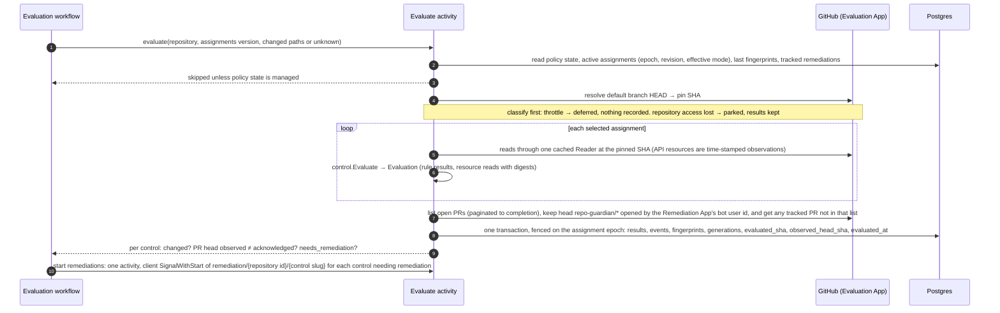
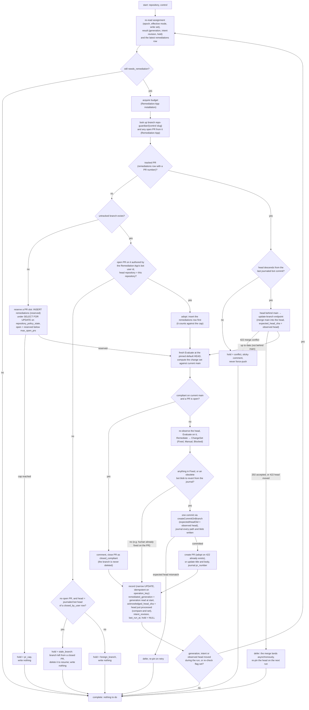
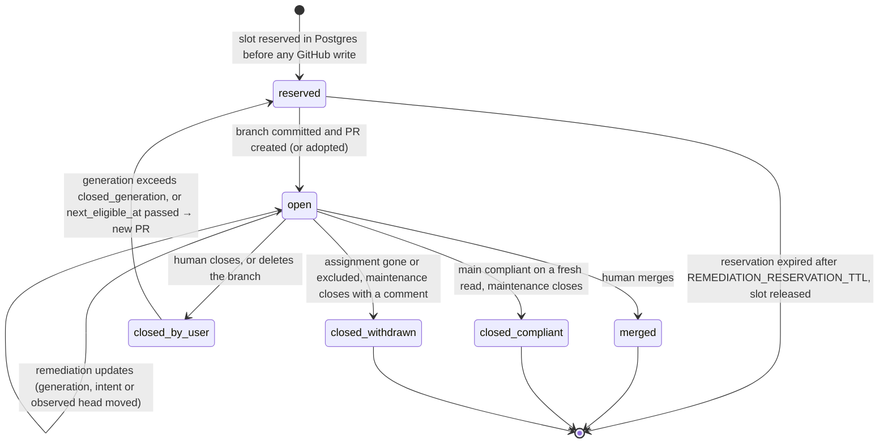
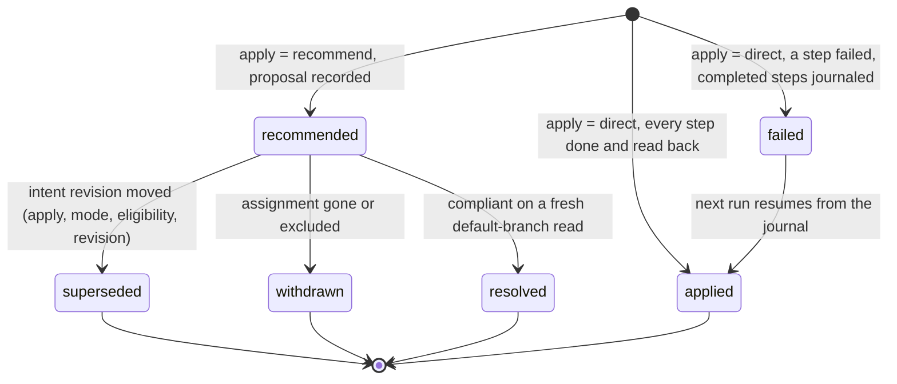

<!-- markdownlint-disable-file MD025 MD041 -->

# DESIGN-0032: Evaluation and remediation workflows: change-driven remediation with per-control PRs

<!--toc:start-->
- [Overview](#overview)
- [Goals and Non-Goals](#goals-and-non-goals)
  - [Goals](#goals)
  - [Non-Goals](#non-goals)
- [Background](#background)
- [Detailed Design](#detailed-design)
  - [Two GitHub Apps](#two-github-apps)
  - [Roles](#roles)
  - [Evaluation](#evaluation)
    - [When it runs](#when-it-runs)
    - [What one evaluation does](#what-one-evaluation-does)
    - [Change detection: fingerprints and generations](#change-detection-fingerprints-and-generations)
    - [PR observation](#pr-observation)
  - [Remediation](#remediation)
    - [Workflow shape](#workflow-shape)
    - [What one run does](#what-one-run-does)
    - [PR lifecycle](#pr-lifecycle)
  - [API remediations](#api-remediations)
- [Data Model](#data-model)
  - [Two application roles](#two-application-roles)
- [API / Interface Changes](#api--interface-changes)
- [Metrics](#metrics)
- [Failure semantics](#failure-semantics)
- [Temporal mapping](#temporal-mapping)
- [Testing Strategy](#testing-strategy)
- [Migration / Rollout Plan](#migration--rollout-plan)
- [Decisions](#decisions)
- [Adversarial Review](#adversarial-review)
  - [AR-0032-01 (high): A narrow update still loses concurrent PR changes](#ar-0032-01-high-a-narrow-update-still-loses-concurrent-pr-changes)
  - [AR-0032-02 (high): Adoption both rejects human collaboration and misidentifies ownership](#ar-0032-02-high-adoption-both-rejects-human-collaboration-and-misidentifies-ownership)
  - [AR-0032-03 (high): Re-evaluating an old PR head does not rebase onto new main](#ar-0032-03-high-re-evaluating-an-old-pr-head-does-not-rebase-onto-new-main)
  - [AR-0032-04 (high): Withdrawal cleanup is unreachable through the due predicate](#ar-0032-04-high-withdrawal-cleanup-is-unreachable-through-the-due-predicate)
  - [AR-0032-05 (high): The PR cap races across per-control workflows](#ar-0032-05-high-the-pr-cap-races-across-per-control-workflows)
  - [AR-0032-06 (high): Retry safety needs durable operations and assignment epochs](#ar-0032-06-high-retry-safety-needs-durable-operations-and-assignment-epochs)
  - [AR-0032-07 (high): Non-forced ref updates are not compare-and-swap](#ar-0032-07-high-non-forced-ref-updates-are-not-compare-and-swap)
  - [AR-0032-08 (high): Error classification and fresh-state gating are incomplete](#ar-0032-08-high-error-classification-and-fresh-state-gating-are-incomplete)
  - [AR-0032-09 (high): The proposed schema and grants cannot perform the stated transactions](#ar-0032-09-high-the-proposed-schema-and-grants-cannot-perform-the-stated-transactions)
  - [AR-0032-10 (high): API remediation has neither atomic apply nor complete invalidation](#ar-0032-10-high-api-remediation-has-neither-atomic-apply-nor-complete-invalidation)
  - [AR-0032-11 (medium): Cooldown and freshness need their own persisted state](#ar-0032-11-medium-cooldown-and-freshness-need-their-own-persisted-state)
  - [AR-0032-12 (medium): Event and API boundaries need precise completeness and scope rules](#ar-0032-12-medium-event-and-api-boundaries-need-precise-completeness-and-scope-rules)
- [Open Questions](#open-questions)
  - [OQ1: How is "something changed" tracked for remediation?](#oq1-how-is-something-changed-tracked-for-remediation)
  - [OQ2: Per-control PRs only, or a cap on how many open at once?](#oq2-per-control-prs-only-or-a-cap-on-how-many-open-at-once)
  - [OQ3: What happens after a human closes a remediation PR while the control still fails?](#oq3-what-happens-after-a-human-closes-a-remediation-pr-while-the-control-still-fails)
  - [OQ4: Do API remediations (settings, rulesets, labels, properties) apply directly?](#oq4-do-api-remediations-settings-rulesets-labels-properties-apply-directly)
<!--toc:end-->

## Overview

This document specifies how controls run.

- **Evaluation** runs every assigned control (DESIGN-0030) against a repository's default branch, through the read-only **Evaluation App**. It records the results, and detects whether anything *changed* since the last evaluation. It runs on a schedule and on events, and it is always safe to run again. It only looks at repositories whose policy state is `managed`: parked, excluded and unmanaged repositories (DESIGN-0030) are never read.
- **Remediation** runs through the separate, write-capable **Remediation App**, only for assignments whose effective mode is `remediate`, and only when there is a reason:
  - the evaluation changed;
  - a human pushed to the remediation PR;
  - a human closed it while the control still fails, and the cooldown has passed;
  - the remediation's intent changed (its `apply` setting, effective mode or control revision) without any file changing.

  It keeps **one PR per control**, as a durable operation with a journal of every external step, and records the PR's whole lifecycle.

The two are connected by the database and by **eval generations**: per-control counters that make "has anything changed since remediation last acted?" a comparison rather than a flag that can be lost. PR edits are tracked the same way, as an **observed** head SHA the evaluator writes and an **acknowledged** head SHA the remediator advances by compare-and-set.

## Goals and Non-Goals

### Goals

- **Evaluation is idempotent and current.** Every evaluation reads the default branch at a pinned commit, writes results, and updates `evaluated_at` (the brief's "last reconciled"), so the UI always shows the latest known posture.
- **Remediation acts only on change.** A repository that fails the same way on every evaluation gets one PR and then silence.
- **Humans win.** A human's commits on a remediation PR are built on, never overwritten: main is merged into the PR and the remaining delta is added on top. A closed PR is respected for a cooldown. A merged PR is never reopened. An untracked branch, and a tracked branch a human has replaced, are never written to, and nothing is ever force-pushed.
- **Every PR is accounted for.** Number, URL, branch, created, last run, observed and acknowledged head SHAs, state, close reason and every step the bot took are stored, so "open remediation PRs older than 30 days, by org and control" is one query.
- **Least privilege by construction.** The evaluation path holds a key that cannot write. Orgs in evaluate mode never install the Remediation App. This holds for `topology: split`; `all` is a combined-trust topology (DESIGN-0029 AR-0029-02).
- **Nothing blocks in a handler, and nothing silently half-applies.** The IMPL-0022 rules still apply: deferral, not sleep. A file remediation lands as one commit, published against an expected head, or not at all. An API remediation is journaled per resource, so a partial application is visible and resumed, never hidden.

### Non-Goals

- **Detecting humans' own fix PRs.** v1 matched other PRs by `search_terms` (D5).
- **Batching several controls into one PR** (OQ2).
- **Auto-merging remediation PRs.**

## Background

v2 today runs one `RepoWorkflow` per repository. It calls a check activity that both evaluates and remediates through v1's engine — one pass per rule, with no shared view of the result — under a single App with write permissions. `findings` record a per-rule verdict plus a `remediation` facet (`pr_open`, `foreign_pr`, …). This design keeps the per-repository workflow shape (assumption A1) and separates the two halves.

## Detailed Design

### Two GitHub Apps

repo-guardian runs as **two GitHub Apps** (D1). The private key is the security boundary: a process holding a write-capable App's key can mint a write token whatever it intends, so the evaluator holds a key that *cannot* write. Each App is installed per org, has its own installation id, its own rate budget, its own Temporal task queue and its own worker role, so evaluation and remediation scale independently and evaluation load never starves remediation.

| | Evaluation App | Remediation App |
| --- | --- | --- |
| Installed on | every org in the enterprise policy | only orgs with any `remediate` assignment |
| Repository permissions | Metadata: read (repository settings, rulesets, custom property values) · Contents: read · Pull requests: read (pull requests and labels) · Administration: read, only for the vulnerability-alerts read · Custom properties (organization): read, for the org schema behind `OrgPropertySchema` (INV-0021 A23, amended by INV-0022) | Contents: read and write · Pull requests: read and write · plus **read and write** on every resource kind a registered control type can remediate: Administration (`repo_settings`, `branch_ruleset`), Custom properties (`custom_properties`), Issues (`labels`), and **Workflows** when a registered type declares workflow apply (a file under `.github/workflows/`) |
| Webhooks | `installation`, `installation_repositories`, `repository`, `push`, `pull_request` — including `pull_request` events for PRs the Remediation App opened, because webhooks are delivered per repository, not per author App — at `/webhooks/github/eval` | `installation`, `installation_repositories` only: its own lifecycle (suspension, removal, repository selection), signed with its own secret and delivered to its own URL, `/webhooks/github/remediate` |
| Key held by | evaluator workers (ingest holds only the two webhook secrets) | remediator workers |
| Budget workflow | `installation/eval/<installation id>` | `installation/remediate/<installation id>` |
| Task queue · role | `repo-guardian-eval` · `evaluator` | `repo-guardian-remediate` · `remediator` |
| Temporal worker deployment | `repo-guardian-eval` | `repo-guardian-remediate` |

- **The Remediation App's permission set is derived, not hand-listed.** The control registry (DESIGN-0031) knows which resource kinds the registered types can remediate; the binary prints the required set at startup and the operator docs list it. GitHub gates every write under `.github/workflows/` on the **Workflows** permission in addition to Contents, so the printer adds Workflows: read and write whenever a registered type declares workflow apply (INV-0022). The read-side names were checked against GitHub's permission tables: rulesets, custom property values and repository settings are Metadata reads, so the Evaluation App needs neither Issues nor repository Custom properties (INV-0022, correcting A23).
- **The Remediation App needs the read half too**, because a remediation run re-evaluates the base it is about to write (see [What one run does](#what-one-run-does)); it does not trust an evaluation that may be minutes old.
- **Separate rate budgets.** Each App installation has its own id and its own rate limit. v2's budget workflow is keyed by installation id alone today (assumption A2 is rewritten: the key gains an app dimension), so the workflow id becomes `installation/<app>/<installation id>` and the two budgets never interact.
- **Installations and repository membership are stored per App** (DESIGN-0030 AR-0030-04). `app_installations (app, account_login, installation_id, suspended_at, repository_selection, seen_at)` holds each App's installations and `app_repository_access (repository_id, app, installation_id, seen_at)` holds which repositories each installation actually includes, because a GitHub App can be installed on selected repositories and an org-level installation says nothing about this repository. Each App refreshes its own facts: the Evaluation App through discovery, as today, and the Remediation App through its own discovery, which only lists repositories and runs on the remediator. `repositories.installation_id` does not exist in the controls schema: the `app = 'eval'` row is the only record, and discovery writes the repository row and its access row in one transaction (DESIGN-0030 D19, INV-0021 OQ2). A repository is *evaluable* when the Evaluation App has access to it and *remediable* when the Remediation App has access to it and is not suspended; both booleans are exposed on `/repositories`. Resolution (DESIGN-0030) stores `requested_mode`, `effective_mode` and `mode_reason` per assignment: the effective mode is the requested one when the repository is remediable and `evaluate` otherwise, so an assignment on a repository the Remediation App cannot reach never reaches the remediator.
- **Ingest** serves one webhook URL per App, `/webhooks/github/eval` and `/webhooks/github/remediate`, and holds no private key. The path selects the secret and the App: the body is read once and checked against that App's secret, and the `app` dimension of everything downstream is the App whose secret validated, never a header (D29). GitHub's `X-GitHub-Hook-Installation-Target-*` headers are documented but their values are not, so nothing depends on them (INV-0022). An `installation` or `installation_repositories` payload whose `installation.app_id` is not the path's App is rejected, so a leaked Evaluation App secret cannot forge Remediation App lifecycle events. Both Apps' lifecycle events route to the same `WebhookWorkflow`, which upserts the matching `app_installations` and `app_repository_access` rows; the push filter over `Owns() ∪ Reads()` is computed from the policy snapshot alone, so ingest still holds no store DSN (INV-0021 A13).

### Roles

| Role | Holds | Runs | Scales on |
| ---- | ----- | ---- | --------- |
| `ingest` | both Apps' webhook secrets | webhook → `WebhookWorkflow` (A13), for both Apps' deliveries | HTTP load |
| `evaluator` | Evaluation App key, `rg_evaluator` DSN | Evaluation App discovery, resolution, evaluation, snapshot and rollout workflows on task queue `repo-guardian-eval` | KEDA on the `repo-guardian-eval` backlog, `EVALUATOR_CONCURRENCY` activity slots per pod |
| `remediator` | Remediation App key, `rg_remediator` DSN | remediation workflows, the remediation sweep and lifecycle maintenance, and the Remediation App's repository-listing discovery on task queue `repo-guardian-remediate` | KEDA on the `repo-guardian-remediate` backlog, `REMEDIATOR_CONCURRENCY` activity slots per pod |
| `api` | read-only store DSN, optional Temporal identity limited to signalling and `DescribeTaskQueue` on both queues (the status page's backlog) | API | HTTP load |

Splitting `worker` into `evaluator` and `remediator` (D2) gives the secret-scoping guarantee in v2's chart-helper form: `roleHasRemediationKey` is true only for `remediator` and `all`, mirroring how `ingest` already refuses the App key. The least-privilege claim is a property of `topology: split`, and helm-unittest asserts by env and secret name that a split evaluator pod carries neither the Remediation App key nor the remediator DSN. `all` runs every role for small installs and is a **combined-trust topology**: both App keys sit in one process and its database role is a member of both writers (DESIGN-0029 AR-0029-02). A deployment-level info series, not the per-installation `installation_info` join gauge (which gains an `app` label instead), carries the `topology` label, and the status page shows it, so an operator can see which boundary a deployment actually has (INV-0022).

Each role is its own **Temporal worker deployment**, `repo-guardian-eval` and `repo-guardian-remediate`, versioned by build ID (D28). The deployment name is a stable identity and carries no release; the build ID is the version. Two consequences follow. A role promotes its build without waiting for the other, so a remediator scaled to zero, or not installed at all, never blocks an evaluator upgrade; Temporal refuses to make a version current until it polls every queue the deployment's current version has polled, and a single shared deployment would tie the two roles together. And the rc line's `repo-guardian` deployment is left untouched, so cutover needs no drain of the old queue before promotion, and rollback finds the rc build still current. `all` runs one worker per queue in one process, each registered under its role's deployment and registration set; the replay suite registers the union.

**Configuration.** `EVALUATOR_CONCURRENCY`, `REMEDIATOR_CONCURRENCY`, `EVALUATOR_DB_POOL_SIZE` and `REMEDIATOR_DB_POOL_SIZE` replace `WORKER_ACTIVITY_CONCURRENCY` and `STORE_POSTGRES_MAX_CONNS`, which are removed with the `worker` role. The chart renders one KEDA `ScaledObject` per role, each with a query scoped to its own queue, and the schedules a pod reconciles at start are partitioned by role.

### Evaluation

#### When it runs

| Trigger | Signal to the repository's evaluation workflow | Controls evaluated |
| ------- | --------------------------------------------- | ------------------ |
| schedule (`EVAL_INTERVAL`, jittered) | timer | all active assignments |
| push to the default branch | `recheck` (priority 2), carrying the changed paths, or "unknown" | only controls whose `Owns() ∪ Reads()` (DESIGN-0031 AR-0031-02) intersect the changed paths, so a `catalog-info.yaml` edit selects `custom_properties` as well as `catalog_info`; all when the paths are unknown. The payload lists at most 2048 commits and carries a top-level `forced` flag: when the list is at that cap or the push is forced, the changed paths are unknown. API resources have no push signal and are evaluated on the schedule |
| `pull_request` event on a `repo-guardian/*` branch | `pr_event` (priority 2) | the control the branch belongs to (PR observation only) |
| assignments changed (policy rollout, discovery) | `policy_changed`, spread over the rollout window | all |
| manual (API or UI "re-evaluate") | `recheck` (priority 1) | all |

`EvaluationWorkflow` reuses `RepoWorkflow`'s selector, coalescing and priority keys (assumption A1) under a **new workflow type name and a new id, `evaluation/<repository id>`**, so no Phase 10–13 history can replay into it and no `GetVersion` gate is needed (DESIGN-0029 AR-0029-03). Coalescing **unions** the changed paths of every buffered signal, and an unknown set dominates: one unknown-path push in the buffer selects every control. Scoping push rechecks by `Owns() ∪ Reads()` is what v1's watched-path set did; v1's `workflow_sync` reconciler, whose only function was feeding that set, is absorbed by it.

The evaluator first reads `repository_policy_state` (DESIGN-0030) and skips any repository whose `state` is not `managed`: a parked repository (archived, fork, removed, access denied) is never read, and only discovery un-parks it, exactly as today. Parking never removes assignments and, for `access_denied` and `suspended`, never removes results either: the repository keeps its last-known posture and is reported as `unmeasurable{reason=access_denied|suspended}` (DESIGN-0029 AR-0029-01). An assignment in state `conflict` (DESIGN-0030 AR-0030-01) is skipped the same way and reported as `unmeasurable{reason=conflict}`.

#### What one evaluation does



#### Change detection: fingerprints and generations

For each (repository, control), evaluation computes a **fingerprint** from the `Evaluation` the control returned (DESIGN-0031: `Results` and the `ResourceRead` list):

```text
fingerprint = sha256( control id@version, control revision
                    , for each rule result: (rule id, status)
                    , for each resource read: (resource, state, digest) )
```

- Rule *statuses* catch compliance changes.
- Resource *digests* catch "still failing, but the resource changed" (D3). For a file the digest is the blob SHA, pinned to the evaluated commit; for an API resource (a label, a ruleset, a property) it is a digest of the canonical observed value, so a label colour moving from one wrong value to another is a change even though every rule status is unchanged (DESIGN-0031 AR-0031-03). `state` is `present`, `absent` or `error`, so an absent property and a present null value are different reads. For example, a team edited `renovate.json` on main without adding the preset the `extends` rule requires. The open PR may now conflict, so remediation must merge main into it and rebuild its delta on the new content.
- The *control revision* (DESIGN-0029 AR-0029-04), a digest of the definition's semantics (rules and parameters, `apply`, template and schema bytes, the type's `Semantics` constant), is part of the input, so a changed template or rule parameter re-evaluates and re-remediates even an acknowledged generation. Title, description and PR text are excluded from the revision, so a cosmetic edit changes nothing.
- Timestamps, evidence wording and the pinned commit SHA are excluded, so an unrelated push does not count as a change.

**A missing prior row is a change.** The first evaluation of a (repository, control) inserts the row with `eval_generation = 1`; the column default of 0 is what `remediated_generation` starts at, never what an evaluation writes. Onboarding therefore triggers remediation on the first evaluation: `1 > 0`.

**Generations are scoped to the assignment epoch** (DESIGN-0030 AR-0030-03). `control_results.assignment_epoch` records which epoch produced the row; the record step writes a result only if the assignment is still active at that epoch, otherwise the result is discarded as stale, logged and counted in `results_discarded_total{reason=stale_epoch}`. A control excluded and re-added starts a new epoch at `eval_generation = 1`, and a run that read the old epoch cannot acknowledge it (AR-0032-06). The record step is idempotent on the check key, as `RecordCheck` already is.

If the fingerprint differs from the stored one, the evaluation **bumps `eval_generation`** for that control and records the transition in `result_events` (with the control version and revision that produced it). Whatever the fingerprint did, every evaluation refreshes `evaluated_sha`, `evaluated_at` and the evidence of the controls it **selected**: an unrelated commit or changed validation evidence never leaves those stale, and the generation moves only on a semantic change. Controls a push did not select keep their previous values, and a `pr_event` run observes PRs only and touches none of these columns (AR-0032-11). The evaluator also writes `control_results.intent_revision`, a hash of the epoch, the generation, the control's `apply`, the effective mode, whether any failing rule is remediable, and the control revision: it is what remediation should now do, and the remediator records the intent it acted on beside it (AR-0032-10).

**Why a generation counter, not a `changed_since_last_eval` boolean (OQ1).** A boolean that the *next evaluation* resets loses changes whenever two evaluations run before remediation does. That happens with remediation backlogged, the Remediation App not yet installed, or the mode switched to `remediate` later:

| Step | Boolean | Generation |
| ---- | ------- | ---------- |
| first evaluation, new row | `changed = true` | `eval_gen = 1`, `remediated_gen = 0` |
| eval 1: result changes | `changed = true` | `eval_gen = 5` |
| eval 2: no change, remediation has not run yet | `changed = false` ← **change lost** | `eval_gen = 5` |
| remediation runs | sees `false`, skips forever | `remediated_gen = 4 < 5` → runs, then sets `remediated_gen = 5` |

Only remediation advances `remediated_generation`, and only after it has acted. So no evaluation can erase a pending change.

#### PR observation

Each evaluation also observes the remediation PRs it tracks, through the Evaluation App. GitHub's `head` filter on the pull-request list is an exact `owner:ref`, not a prefix, so the listing reads every open PR and filters client-side, capturing each PR's `user` and `head.repo.id`: a PR is the Remediation App's when its author's user id is that App's bot user and its type is `Bot`, never by comparing a login string (INV-0022). `pull_request` webhooks reach the Evaluation App whichever App opened the PR, so no polling is needed between schedules. The listing paginates to completion; a failed page is an observation `error` that changes nothing, never an absence (AR-0032-12). PR observation freshness (`remediations.observed_at`) is tracked separately from default-branch evaluation freshness (`control_results.evaluated_at`).

| Observation | Recorded as | Effect |
| ----------- | ----------- | ------ |
| PR head SHA ≠ `observed_head_sha` | `observed_head_sha` ← head, `observed_at` | the PR is **due while `observed_head_sha` differs from `acknowledged_head_sha`**: a human pushed, so remediation merges main into the head, re-runs on it and acknowledges exactly that head |
| PR closed, not merged, not by repo-guardian | state `closed_by_user`, `closed_at`, `closed_generation` = the current `eval_generation`, `next_eligible_at` = `closed_at + reopen_after` | a new PR may open when `next_eligible_at` passes, or sooner only when `eval_generation` exceeds `closed_generation` (D13); a PR edit before the closure does not bypass the cooldown |
| PR merged | state `merged` | nothing; the next evaluation of main sees the result |
| PR missing (branch or PR deleted) after a complete listing | state `closed_by_user`, as above | same as closed |
| a page of the listing fails | observation `error`, nothing written | a truncated list never means a PR disappeared |

Each observed transition writes a `remediation_events` row; the evaluator holds INSERT on that table and column UPDATE on the observation columns for exactly this (AR-0032-09). The two head columns advance independently (AR-0032-01): the evaluator writes `observed_head_sha` on every observation and never `acknowledged_head_sha`; the remediator acknowledges only the head it processed, by compare-and-set (`UPDATE remediations SET acknowledged_head_sha = $processed WHERE id = $id AND acknowledged_head_sha IS NOT DISTINCT FROM $previous`), and after its own commit it acknowledges the new head in the same record step, so it does not loop on its own commit. An H2 observed immediately before or immediately after H1's record step therefore stays due in both interleavings, and the next run processes it exactly once.

`needs_remediation` for a control governs **new remediation only** (AR-0032-04); closing, withdrawing and superseding what already exists is lifecycle maintenance, which runs from the durable `remediations` rows and needs no current failing result:

```text
repository policy state = managed
AND assignment active at the current epoch              -- a conflicted or withdrawn assignment is never due
AND effective_mode = remediate                          -- already evaluate when the Remediation App cannot reach the repository
AND status = non_compliant AND any failing rule has remediate = true
AND CASE latest remediations row
      WHEN none, or terminal (merged, closed_compliant, closed_withdrawn, superseded, withdrawn, resolved, applied)
                             THEN eval_generation > remediated_generation      -- true for a new row: 1 > 0
                               OR control_results.intent_revision ≠ remediations.intent_revision
      WHEN open               THEN eval_generation > remediated_generation
                               OR control_results.intent_revision ≠ remediations.intent_revision
                               OR observed_head_sha ≠ acknowledged_head_sha
      WHEN closed_by_user     THEN eval_generation > closed_generation OR next_eligible_at <= now()
      WHEN failed             THEN true                                         -- a direct apply resumes from its journal
      WHEN reserved, recommended THEN false                                     -- a run holds it, or maintenance supersedes it first
    END
```

An `unknown` status never triggers remediation. Not knowing is not a reason to write. A control with one failing and one errored rule is non-compliant and due, but every proposed write is gated on its own prerequisite reads having succeeded, which DESIGN-0031 AR-0031-04 reports as `Blocked` (AR-0032-08). The predicate is the `remediation_due` view in the Data Model.

### Remediation

#### Workflow shape

One `RemediationWorkflow` per (repository, control): `remediation/<repository id>/<control slug>`, started by **signal-with-start** from the evaluation. The Go SDK has no workflow-side signal-with-start, so the evaluation workflow runs one activity per evaluation that calls `client.SignalWithStartWorkflow` for every control needing remediation, as `startRepo` already does for discovery; batching the starts into one activity keeps the evaluation's history to one event pair however many controls are due (INV-0022). A signal arriving while a run is in progress sets a "re-check at end" flag rather than starting a second run, so at most one remediation runs per control at a time (D6). When a run ends, it **drains the signal channel** (a signal received but never read is lost when the run completes) and **re-reads `eval_generation`, `intent_revision` and `observed_head_sha` from the database**; if any moved past what the run started from, or a drained signal or the flag says so, it loops once more before completing. The reloop does not depend on a signal having been delivered.

Every run is a **durable operation** (AR-0032-06): its `remediations` row carries `operation_key` (the check key), the intent it formed (`base_sha`, `branch`, `expected_head`, `intent_revision`, `assignment_epoch`) and a `remediation_steps` journal written as each external step completes. Activities heartbeat and carry a `ScheduleToClose` timeout; an attempt that overlaps a timed-out predecessor takes the operation row with `SELECT ... FOR UPDATE SKIP LOCKED` and exits when it is already held, so two attempts never act on one operation. The row lock lasts only while its transaction is open, so an activity holds one database connection for the length of its GitHub calls; `REMEDIATOR_DB_POOL_SIZE` is sized to `REMEDIATOR_CONCURRENCY` plus headroom for that reason (INV-0022).

A periodic backstop (`remediation-sweep` schedule, hourly) runs two queries in batches (`REMEDIATION_SWEEP_BATCH`, `REMEDIATION_MAINTENANCE_BATCH`): `remediation_due`, for rows needing new remediation with no running workflow, which it signals in priority order; and `remediation_maintenance` (AR-0032-04), for durable rows whose lifecycle needs a write: expired reservations, withdrawal, close-as-compliant after a fresh default-branch read, and supersession of a recommendation whose intent moved. The due half only matters if a signal was lost or a run ended on a hold that has since cleared; the maintenance half is the only path for a PR or recommendation whose control no longer has a failing result.

#### What one run does



Key behaviours:

- **Tracked PRs collaborate; untracked branches are adopted by identity or held** (AR-0032-02). A *tracked* PR, meaning a `remediations` row with a PR number, allows human commits: it is evaluated at its head and never holds `foreign_branch`. *Adoption* applies only to an untracked branch, and only by authenticated identity, never by commit author text: the open PR on that branch must be authored by the Remediation App's bot user, matched on its user id and type `Bot` rather than the login string (INV-0022), which GitHub authenticates, its head repository id must equal this repository (a PR from a fork is never adopted, whatever its branch is called), and the range inspected is the PR's commits, not main's history. An untracked branch with no such PR is held `foreign_branch` and never written, except a branch whose head equals the journaled bot head of a `closed_by_user` row: that is this control's own branch left behind by a PR a human closed without merging, and it is held `stale_branch` instead, reported as "branch left from a closed PR; delete it to resume" (D30). A tracked branch a human has replaced, whose head no longer descends from the last journaled bot commit, is held `conflict` with a sticky comment and is never force-pushed. A replayed create-PR that returns 422 "a pull request already exists" lists PRs by head and adopts the one authored by the App.
- **Reserve a slot before anything external** (AR-0032-05). The cap is enforced in Postgres: the run inserts its `remediations` row in state `reserved` inside a transaction that locks the repository's `repository_policy_state` row with `SELECT ... FOR UPDATE` and counts `open + reserved < max_open_prs`. Adopted PRs count because adoption inserts the row first. A reservation with no PR recorded against it expires after `REMEDIATION_RESERVATION_TTL` (`reserved_until`), so a crash between reservation and PR creation frees the slot. A control that already has an open PR is never held by the cap: updating it opens nothing new.
- **Merge main into the PR, then validate the merge result, not the isolated head** (AR-0032-03). If a tracked PR's head is behind main, the run calls GitHub's update-branch endpoint for that PR with `expected_head_sha` set to the head it observed, to merge main into the head. A 422 "merge conflict" holds the PR `conflict` with a sticky comment; a 422 because the head moved is a deferral; any other 422 is an error. A 202 means the merge was accepted and runs in the background, so the run defers through the one throttle mechanism (a `RetryAfterError`, never a poll or a sleep) and the next run re-pins the new head (INV-0022). Once the head is not behind main, the run re-observes it, runs `Remediate` on it and commits only the remaining delta, so a human who filled in data on the branch (catalog-info, for example) keeps that work and remediation adds only what is still failing. Obsolete bot edits, from a retired rule or a version that moved a file, are reverted from the `remediation_steps` journal of every path and blob the bot wrote, and only where the current blob still equals the bot's: v1's orphan semantics, on the branch only and never on main (DESIGN-0033 AR-0033-02). A default-branch rename re-bases the PR with a PATCH. A generation is acknowledged only once a mergeable current proposal exists, so a stale PR is never silently accepted.
- **Re-evaluate before writing, and gate each write on its reads** (AR-0032-08). The run re-evaluates current main itself instead of trusting an evaluation that may be minutes old (which is why the Remediation App holds read permissions), and `closed_compliant` is decided on that fresh read, never on stored status. Each proposed write is gated on the reads it depends on having succeeded; a rule whose prerequisite read failed is `Blocked` and its change is not written, even when the control as a whole is non-compliant.
- **One commit against an expected head** (AR-0032-07). `Writer.Commit` is GitHub's GraphQL `createCommitOnBranch` mutation with `expectedHeadOid` set to the head the run observed. It is the first GraphQL call in the codebase: go-github is REST-only, so it brings a GraphQL client dependency, and the one throttle mechanism (DESIGN-0021) must classify GraphQL rate limits, which arrive as HTTP 200 with an error body (secondary limits as 200 or 403), as well as REST 429, and keep a budget snapshot per `x-ratelimit-resource` bucket so GraphQL points never overwrite the core budget (INV-0022). The mutation requires the branch to exist and writes regular files only (no file mode). GitHub rejects the mutation when the head is anything else, including a rewind to an ancestor or a branch deleted and recreated at another commit, so the compare-and-swap is the provider's, not a GET followed by a PATCH. The commit is authored by the App and signed by GitHub, which is also what makes the App the authenticated author of every commit it makes. On an expected-head mismatch the run defers and retries, re-pinning the new head. The mutation's limits, cited as 100 files and 1 MiB per file (DESIGN-0031 AR-0031-09), are not in GitHub's schema or changelog and are confirmed by a phase-0 spike, together with the shape of the stale-OID error. Nothing is half-applied, and nothing is overwritten.
- **A new branch is cut from default HEAD** through the REST ref create, which fails if the branch already exists. Branch name `repo-guardian/<control slug>` (D4). **repo-guardian never deletes a branch** (D30). Deleting merged branches is the repository's or org's setting ("automatically delete head branches"), not the engine's, and an engine that also deleted would fight that setting and widen what a write-capable key can destroy. A branch left by a PR a human closed without merging is held `stale_branch` until a human or the org's tooling removes it; the next run then cuts a fresh branch.
- **The PR cap.** `remediation.max_open_prs` (DESIGN-0030, default 3) bounds open remediation PRs per repository. Priority is deterministic: the order of the enterprise `controls` list, then the org's additions, then `repos` additions, stored on the assignment as `ordinal`. When the cap is reached and this control has no PR yet, the run records `hold = 'pr_cap'` and ends without writing; `needs_remediation` stays true, and the next PR close or merge on the repository (observed by evaluation) or the backstop sweep, which re-checks held controls in that order, picks it up. Starvation is bounded by the cap turning over.
- **The PR body is rendered from the evaluation:** each failing rule with its number and title, what this PR changes (`Fixed`), and `Notes` for rules in `Manual` or `Blocked` (DESIGN-0031 AR-0031-04). Title and body templates come from the control's `pr {}` block (DESIGN-0030), rendered with `internal/template` (assumption A10). A change set with nothing in `Fixed` is recorded as a recommendation, acknowledges the generation, and is not retried until the generation or intent changes.
- **Fence every external write on the assignment epoch** (DESIGN-0030 AR-0030-03). Immediately before each write the run re-reads the assignment (effective mode, epoch, write set, remediable) and stops if any of them moved; it records `remediations.assignment_epoch`. A write that completes in the window after a withdrawal is not prevented, it is withdrawn by lifecycle maintenance on the next pass.
- **`remediated_generation` is the generation read at the start of the run,** not the current one. An evaluation that changed during the run is therefore picked up by the end-of-run loop.
- **Invariant: record-is-narrow.** The record step is an `UPDATE` of exactly `remediated_generation`, `hold` and `hold_since` on `control_results`, and of `acknowledged_head_sha` (compare-and-set), `intent_revision`, `state`, `last_run_at` and the PR columns on `remediations`. It never writes `eval_generation`, `status`, `fingerprint`, `evaluated_sha`, `evaluated_at` or `observed_head_sha`, which belong to evaluation. A full-row save here would clobber a concurrent evaluation's bump with the stale start-of-run value — the exact loss the generation counters exist to prevent — and the reloop would then have nothing to see.

#### PR lifecycle



Each transition writes a `remediation_events` row, whether the remediator made it or the evaluator observed it. A new PR after `closed_by_user` is a new `remediations` row, and the closed one keeps its history, its `closed_generation` and its `next_eligible_at`. When a control stops being assigned to the repository while its PR is open, lifecycle maintenance closes the PR with a comment and records `closed_withdrawn` (D10); the row is kept. When the write access that cleanup needs is gone, after a mode downgrade that uninstalled the Remediation App, parking, or loss of repository access, the row records `hold = 'permission'` and the UI shows **blocked cleanup** rather than a promise. A hold (`pr_cap`, `foreign_branch`, `stale_branch`, `conflict`, `permission`) is not a PR state: it lives on `control_results` because there may be no PR yet, and on `remediations` for blocked cleanup because there may be no result any more. Terminal states never delete the branch (D30): a merged PR's branch goes by the repository's delete-on-merge setting, and a closed one is left for a human.

### API remediations

Controls whose `ChangeSet` has `API` changes (`repo_settings`, `branch_ruleset`, `labels`, `custom_properties`) have no file to commit. The catalogue entry for such a control carries `remediation { apply = "recommend" | "direct" | "workflow" }` (DESIGN-0030; the vocabulary is DESIGN-0031 AR-0031-06's, and `pr` is gone):

- `recommend` (the default) means the change is **reported, never written**: the run records a `remediations` row of kind `api` in state `recommended`, with the per-resource before and after values in `proposal JSONB`, shown in the UI as a recommended change. Nothing reaches GitHub.
- `direct` applies the change through the Remediation App (D14). Application is **journaled per resource** in `remediation_steps (resource_key, status, before, after, error)`, in order and idempotent on re-run; each resource is gated on its own read prerequisites and ownership, and is written as "read, write, read back", because GitHub offers no conditional write for these resources (AR-0032-10, DESIGN-0031 AR-0031-03). A failure part-way leaves the row `failed` with the completed steps visible, and the next run resumes from the journal instead of starting over. The one-commit atomicity claim is for files only.
- `workflow` is v1's `github-action` mode: the PR carries a workflow file that applies the change on merge, the control then owns `file:.github/workflows/repo-guardian-<slug>.yml`, and only a type that declares `WorkflowApply` may use it (today `custom_properties`). It follows the PR lifecycle above.

**Intent is versioned separately from observation.** `remediations.intent_revision` hashes the epoch, the generation, `apply`, the effective mode, `remediable` and the control revision, so moving `apply` from `recommend` to `direct`, or restoring the Remediation App's access, creates work without any file changing: the evaluator's `control_results.intent_revision` moves, the recommendation is `superseded` by maintenance, and a new row runs. Recommendations therefore have terminal states (AR-0032-04): `superseded` when the intent moves, `withdrawn` when the assignment is gone or excluded, `resolved` when a fresh default-branch read finds the control compliant. Every terminal state releases the `remediations_one_open` slot.



## Data Model

These tables replace `findings`, `finding_events`, `rule_state`-style posture and v2's `remediation` facet (assumption A5). `checks` becomes the evaluation log (A6). `control_assignments` and `repository_policy_state`, which these join on `(repository_id, control_id)` and `repository_id`, are DESIGN-0030's.

```sql
CREATE TABLE control_results (            -- current state, one row per repository and control
    repository_id          BIGINT NOT NULL REFERENCES repositories(id),
    control_id             TEXT   NOT NULL,
    control_version        INT    NOT NULL,
    revision               TEXT   NOT NULL,            -- control revision digest (DESIGN-0029 AR-0029-04)
    assignment_epoch       BIGINT NOT NULL,            -- the assignment epoch that produced the row (DESIGN-0030 AR-0030-03)
    status                 TEXT   NOT NULL CHECK (status IN ('compliant','non_compliant','unknown','not_applicable')),
    fingerprint            TEXT   NOT NULL,
    intent_revision        TEXT   NOT NULL,            -- what remediation should now do: sha256(epoch, generation, apply, effective mode, remediable, revision)
    eval_generation        BIGINT NOT NULL,            -- evaluation inserts 1 on the first row of an epoch
    remediated_generation  BIGINT NOT NULL DEFAULT 0,  -- only remediation writes it
    hold                   TEXT   CHECK (hold IN ('pr_cap','foreign_branch','stale_branch','conflict','permission')),
    hold_since             TIMESTAMPTZ,
    evaluated_sha          TEXT   NOT NULL,            -- default-branch commit evaluated, refreshed on every evaluation that selected the control
    evaluated_at           TIMESTAMPTZ NOT NULL,       -- the brief's "last reconciled"
    last_changed_at        TIMESTAMPTZ NOT NULL,       -- last fingerprint change
    PRIMARY KEY (repository_id, control_id)
);

CREATE TABLE rule_results (               -- current state, one row per rule
    repository_id    BIGINT NOT NULL,
    control_id       TEXT   NOT NULL,
    rule_id          TEXT   NOT NULL,                  -- bare id, unique within the control
    status           TEXT   NOT NULL CHECK (status IN ('pass','fail','error','unknown','not_applicable')),
    remediate        BOOLEAN NOT NULL,                 -- the rule's remediate attribute
    evidence         JSONB  NOT NULL,                  -- bounded at 16 KiB (DESIGN-0031 AR-0031-09)
    evidence_kind    TEXT   NOT NULL,
    evidence_version SMALLINT NOT NULL,
    PRIMARY KEY (repository_id, control_id, rule_id),
    FOREIGN KEY (repository_id, control_id) REFERENCES control_results ON DELETE CASCADE
);

CREATE TABLE result_events (              -- append-only transitions (grant-enforced, as finding_events)
    id               BIGSERIAL PRIMARY KEY,
    repository_id    BIGINT NOT NULL,
    control_id       TEXT   NOT NULL,
    control_version  INT    NOT NULL,                  -- the version that produced the transition
    revision         TEXT   NOT NULL,                  -- and the revision
    assignment_epoch BIGINT NOT NULL,
    rule_id          TEXT,                             -- NULL for a control-status transition
    from_status      TEXT,
    to_status        TEXT,                             -- NULL when the result is withdrawn (DESIGN-0030 D6)
    eval_generation  BIGINT NOT NULL,
    occurred_at      TIMESTAMPTZ NOT NULL
);

CREATE TABLE remediations (               -- one durable operation per PR, recommendation or direct apply
    id                     BIGSERIAL PRIMARY KEY,
    repository_id          BIGINT NOT NULL REFERENCES repositories(id),
    control_id             TEXT   NOT NULL,
    assignment_epoch       BIGINT NOT NULL,            -- re-read immediately before every external write
    operation_key          TEXT   NOT NULL UNIQUE,     -- the check key: recording is idempotent on it
    kind                   TEXT   NOT NULL CHECK (kind IN ('pull_request','api')),
    state                  TEXT   NOT NULL CHECK (state IN (
                               'reserved','open','merged','closed_compliant','closed_by_user','closed_withdrawn',
                               'recommended','superseded','withdrawn','resolved','applied','failed')),
    intent_revision        TEXT   NOT NULL,            -- the intent this operation acted on (compare with control_results.intent_revision)
    -- intent, written before the first external step
    base_sha               TEXT,                       -- default-branch commit the change set was computed against
    branch                 TEXT,
    expected_head          TEXT,                       -- head the next createCommitOnBranch is conditioned on
    reserved_until         TIMESTAMPTZ,                -- created_at + REMEDIATION_RESERVATION_TTL while reserved
    -- outcome
    pr_number              INT,
    pr_url                 TEXT,
    observed_head_sha      TEXT,                       -- evaluator: last head seen on the PR
    observed_at            TIMESTAMPTZ,                -- evaluator: PR observation freshness, distinct from evaluated_at
    acknowledged_head_sha  TEXT,                       -- remediator, compare-and-set: last head a run processed
    proposal               JSONB,                      -- recommendation payload: per resource, before and after
    remediated_generation  BIGINT NOT NULL,
    closed_generation      BIGINT,                     -- eval_generation when closed_by_user was observed
    next_eligible_at       TIMESTAMPTZ,                -- closed_at + reopen_after
    hold                   TEXT   CHECK (hold IN ('permission')),  -- blocked cleanup, when the result row is already gone
    created_at             TIMESTAMPTZ NOT NULL,
    last_run_at            TIMESTAMPTZ NOT NULL,       -- last remediation run that touched this row
    closed_at              TIMESTAMPTZ,
    close_reason           TEXT,
    CHECK (kind <> 'pull_request' OR state IN ('reserved','open','merged','closed_compliant','closed_by_user','closed_withdrawn')),
    CHECK (kind <> 'api'          OR state IN ('recommended','superseded','withdrawn','resolved','applied','failed')),
    CHECK (state <> 'reserved'    OR reserved_until IS NOT NULL)
);
-- at most one slot-holding or resumable row per repository and control
CREATE UNIQUE INDEX remediations_one_open
    ON remediations (repository_id, control_id) WHERE state IN ('reserved', 'open', 'recommended', 'failed');
-- the rows the cap counts
CREATE INDEX remediations_slots
    ON remediations (repository_id) WHERE state IN ('reserved', 'open');

CREATE TABLE remediation_steps (          -- append-only journal of every external step, written as each completes
    id              BIGSERIAL PRIMARY KEY,
    remediation_id  BIGINT NOT NULL REFERENCES remediations(id),
    operation_key   TEXT   NOT NULL,
    seq             INT    NOT NULL,
    kind            TEXT   NOT NULL CHECK (kind IN ('branch_created','branch_updated','committed','reverted',
                                                   'pr_created','pr_updated','pr_rebased','pr_closed','api_write')),
    resource_key    TEXT,                              -- file:<path>, label:<name>, ... (NULL for PR-level steps)
    blob_sha        TEXT,                              -- blob the bot wrote at that path, for later reverts
    committed_sha   TEXT,                              -- commit produced, or the head after the step
    pr_number       INT,
    status          TEXT   NOT NULL CHECK (status IN ('done','failed')),
    before          JSONB,                             -- API resources: value read before the write
    after           JSONB,                             -- API resources: value read back after it
    error           TEXT,
    occurred_at     TIMESTAMPTZ NOT NULL,
    UNIQUE (remediation_id, seq)
);

CREATE TABLE remediation_events (         -- append-only: reserved, opened, updated, observed, closed, superseded, applied, failed
    id              BIGSERIAL PRIMARY KEY,
    remediation_id  BIGINT NOT NULL REFERENCES remediations(id),
    kind            TEXT   NOT NULL,
    detail          JSONB  NOT NULL,                   -- who observed or made the transition, and why
    occurred_at     TIMESTAMPTZ NOT NULL
);
```

The two predicates the remediator schedules from are views, so the sweep, the API and the tests read one definition. `remediation_due` is `needs_remediation` as SQL; `remediation_maintenance` is the lifecycle query of AR-0032-04. `control_assignments` here is DESIGN-0030's table with `epoch`, `revision`, `effective_mode` and the priority `ordinal`, and `repository_policy_state` carries the resolved `max_open_prs` and `reopen_after` (DESIGN-0030 D7).

```sql
CREATE VIEW remediation_due AS            -- new remediation only
SELECT cr.repository_id, cr.control_id, ca.ordinal
FROM control_results cr
JOIN control_assignments ca
  ON (ca.repository_id, ca.control_id) = (cr.repository_id, cr.control_id)
 AND ca.state = 'active' AND ca.epoch = cr.assignment_epoch
JOIN repository_policy_state ps ON ps.repository_id = cr.repository_id
LEFT JOIN LATERAL (
    SELECT r.* FROM remediations r
    WHERE (r.repository_id, r.control_id) = (cr.repository_id, cr.control_id)
    ORDER BY r.id DESC LIMIT 1
) r ON true
WHERE ps.state = 'managed'
  AND ca.effective_mode = 'remediate'
  AND cr.status = 'non_compliant'
  AND EXISTS (SELECT 1 FROM rule_results rr
              WHERE (rr.repository_id, rr.control_id) = (cr.repository_id, cr.control_id)
                AND rr.status = 'fail' AND rr.remediate)
  AND CASE
        WHEN r.id IS NULL
          OR r.state IN ('merged','closed_compliant','closed_withdrawn','superseded','withdrawn','resolved','applied')
             THEN cr.eval_generation > cr.remediated_generation
               OR cr.intent_revision IS DISTINCT FROM r.intent_revision
        WHEN r.state = 'open'
             THEN cr.eval_generation > cr.remediated_generation
               OR cr.intent_revision IS DISTINCT FROM r.intent_revision
               OR r.observed_head_sha IS DISTINCT FROM r.acknowledged_head_sha
        WHEN r.state = 'closed_by_user'
             THEN cr.eval_generation > r.closed_generation OR r.next_eligible_at <= now()
        WHEN r.state = 'failed'
             THEN true                                   -- resume from the journal
        ELSE false                                       -- reserved: a run holds it. recommended: maintenance supersedes it first
      END;

CREATE VIEW remediation_maintenance AS    -- lifecycle of durable rows, independent of a current failing result
SELECT m.* FROM (
    SELECT r.id AS remediation_id, r.repository_id, r.control_id, r.kind, r.state,
           CASE
             WHEN r.state = 'reserved' AND r.reserved_until < now()                                    THEN 'expire'
             WHEN ca.repository_id IS NULL OR ps.state <> 'managed'                                    THEN 'withdraw'
             WHEN r.state = 'recommended' AND cr.intent_revision IS DISTINCT FROM r.intent_revision    THEN 'supersede'
             WHEN cr.status = 'compliant'                                                              THEN 'close_compliant'
           END AS action
    FROM remediations r
    LEFT JOIN control_assignments ca
           ON (ca.repository_id, ca.control_id) = (r.repository_id, r.control_id) AND ca.state = 'active'
    LEFT JOIN repository_policy_state ps ON ps.repository_id = r.repository_id
    LEFT JOIN control_results cr
           ON (cr.repository_id, cr.control_id) = (r.repository_id, r.control_id)
    WHERE r.state IN ('reserved', 'open', 'recommended')
) m
WHERE m.action IS NOT NULL;
```

`expire` deletes the reservation and releases the slot. `withdraw` closes a PR with a comment (`closed_withdrawn`) or ends a recommendation (`withdrawn`); it fires on a parked repository too, and when the write it needs is refused, the row holds `permission`. `supersede` ends a recommendation whose intent moved. `close_compliant` is a *candidate*: the maintenance run performs a fresh default-branch evaluation and closes (`closed_compliant`, or `resolved` for a recommendation) only if that read agrees (AR-0032-08).

Two writers share `control_results` and `remediations` by column, never by row: on `control_results` evaluation owns `status`, `fingerprint`, `intent_revision`, `eval_generation`, `control_version`, `revision`, `assignment_epoch`, `evaluated_sha`, `evaluated_at` and `last_changed_at`, and remediation owns `remediated_generation`, `hold` and `hold_since` (record-is-narrow); on `remediations` evaluation owns the observation columns `observed_head_sha`, `observed_at`, `closed_generation` and `next_eligible_at` and writes `state`, `closed_at` and `close_reason` for the closures and merges it observes, and remediation owns everything else, acknowledging a head only by compare-and-set. No column is acknowledged with by one role and written by the other (AR-0032-01).

`checks` keeps its shape as the evaluation log: the `trigger` CHECK gains `pr_event` and `manual`, and `pending_result` stays JSONB, holding per control the status, fingerprint, rule results and resource reads until the record step commits them; evidence is bounded at 16 KiB per rule, scalars and arrays only (DESIGN-0031 AR-0031-09), so the staged payload is bounded. `result_events`, `remediation_events` **and** `remediation_steps` are append-only by grant, as `finding_events` is today. When an assignment is withdrawn or excluded by policy, resolution, running as `rg_evaluator`, deletes the control's `control_results` row, which cascades to `rule_results`, and writes a `result_events` row with `to_status = NULL` (DESIGN-0030 D6 as amended by AR-0030-05), so a control that no longer applies cannot linger in posture; an open PR or recommendation it leaves behind is closed by lifecycle maintenance, not by this delete. Parking for `archived`, `fork` or `removed` clears results the same way (definitive non-applicability); parking for `access_denied` or `suspended` keeps them (DESIGN-0029 AR-0029-01). `max_open_prs` and `reopen_after` are resolved per repository onto `repository_policy_state` (DESIGN-0030 D7), so the remediation run and the sweep read them from the row rather than from the snapshot; the slot reservation also sets `repository_policy_state.last_remediation_at`, which is the one column the remediator may update there and what gives `SELECT ... FOR UPDATE` its required privilege.

On `repositories`, `next_due_at`, `last_error`, `active`, `park_reason` and `parked_at` stay. `last_check_outcome`, `policy_version` and `catalog_parse_ok` are rule-engine posture superseded by `control_results.evaluated_at`, `repository_policy_state.policy_version` and `catalog_info` evidence, and the controls schema omits all four, `installation_id` included (DESIGN-0030 D19); nothing is dropped from a live database, because cutover is a fresh one (D27).

The **compliance snapshots** become `(org, control_id, decision, snapshot_at)`, where `decision` is DESIGN-0030's baseline lineage (`baseline`, `replaced`, `org_added`), carrying the posture buckets of DESIGN-0030 AR-0030-05: compliant, non-compliant, pending (assigned, no result yet), stale (a result from an older epoch or revision), unmeasurable by reason (`access_denied`, `suspended`, `conflict`), not-applicable, unknown and excluded counts, plus `coverage` measured over assigned. The percentage stays `compliant/(compliant+non_compliant)` and is NULL, shown as "no data", on an empty denominator; that one definition is shared by the query, the API, the report, the snapshots and the gauges. Queries start from active assignments with a LEFT JOIN to results at the matching epoch and revision, so a newly assigned control is `pending`, never invisible. That keeps the one-shared-SQL-query rule (IMPL-0025 Phase 8) with the new keys.

### Two application roles

The evaluator and the remediator connect as separate database roles, `rg_evaluator` and `rg_remediator`; `all` connects as a role that is a member of both (D8). **The operator or the chart provisions the roles; migrations grant to them and never create them** (D31), because `CREATE ROLE` needs `CREATEROLE`, which the migrating role should not hold, and today's read-only API role is already provisioned this way. `cnpg` mode declares them as CNPG managed roles, `baked` mode creates them in the StatefulSet's init script, and `external` mode documents the SQL. Each role has its own Secret and DSN (`STORE_DSN` splits into the evaluator's, the remediator's and the migrating owner's), mounted only into the role that uses it. The matrix below is the complete writer boundary (AR-0032-09): every table either role touches, with SELECT, INSERT, UPDATE by column, DELETE and sequence usage. Both roles hold SELECT on every table; surrogate keys are `GENERATED ALWAYS AS IDENTITY`, which needs no sequence grant (a `BIGSERIAL` column would). UPDATE, DELETE and TRUNCATE are never granted to either role on `result_events`, `remediation_events` and `remediation_steps`; the owner is a separate role, so there is nothing to revoke. Where a table has row-level security, each role's write policy is paired with a `FOR SELECT ... USING (true)` policy: a policy declared without a command is `FOR ALL` and filters reads too, which would hide the Remediation App's access rows from resolution and silently resolve every `remediate` assignment to `evaluate`. A write the policy fences affects zero rows without an error, so code that relies on the fence checks the affected-row count. Amended 2026-10-07 (INV-0022 Phase-0 results).

| Table | `rg_evaluator` | `rg_remediator` |
| ----- | -------------- | --------------- |
| `repositories` | INSERT; UPDATE (identity columns, `active`, `park_reason`, `parked_at`, `next_due_at`, `last_error`): discovery, identity and parking | — |
| `repository_events` | INSERT | — |
| `app_installations`, `app_repository_access` | SELECT on every row (`FOR SELECT TO rg_evaluator, rg_remediator USING (true)`: resolution reads both Apps' access); INSERT, UPDATE, DELETE on rows with `app = 'eval'` (`TO rg_evaluator USING (app = 'eval')`) | SELECT on every row (same policy); INSERT, UPDATE, DELETE on rows with `app = 'remediate'` (`TO rg_remediator USING (app = 'remediate')`) |
| `policy_versions` | INSERT; UPDATE (`activated_at`, `rollout_completed_at`) | — |
| `repository_policy_state` | INSERT, UPDATE, DELETE: resolution | UPDATE (`last_remediation_at`), which is what `SELECT ... FOR UPDATE` on the row requires |
| `control_assignments` | INSERT, UPDATE, DELETE: resolution | — |
| `control_results` | INSERT; UPDATE (`status`, `fingerprint`, `intent_revision`, `eval_generation`, `control_version`, `revision`, `assignment_epoch`, `evaluated_sha`, `evaluated_at`, `last_changed_at`); DELETE: withdrawal, cascading to `rule_results` | UPDATE (`remediated_generation`, `hold`, `hold_since`) |
| `rule_results` | INSERT, UPDATE, DELETE | — |
| `result_events` | INSERT | — |
| `checks` | INSERT; UPDATE (staging and finalisation columns); DELETE: retention prune | — |
| `remediations` | UPDATE (`state`, `closed_at`, `close_reason`, `closed_generation`, `next_eligible_at`, `observed_head_sha`, `observed_at`): PR observation | INSERT; UPDATE (every column except `observed_head_sha`, `observed_at`, `closed_generation`, `next_eligible_at`); DELETE on rows in state `reserved`: expiry |
| `remediation_steps` | — | INSERT |
| `remediation_events` | INSERT: observed transitions | INSERT |
| `compliance_snapshots` | INSERT | — |
| `service_runs` | INSERT: discovery, rollout, snapshot | INSERT: sweep, maintenance, Remediation App discovery |

Record-is-narrow stops being a sentence to remember and becomes a constraint: a remediator that saves a whole `control_results` row fails at the database instead of silently clobbering an evaluation's generation bump, and an evaluator that touches `acknowledged_head_sha` fails the same way. The grant tests run **as** `rg_evaluator` and `rg_remediator`, never as the owner. `pgtest.AppRole` today creates one role that owns the schema and runs the migrations, so it is extended to an owner role plus the two application roles, created by the harness the way the chart provisions them (INV-0022): a test that runs as the owner cannot fail on a missing grant. They execute the real transactions, resolution, evaluation, PR observation, withdrawal, reservation and recommendation, and assert that every stated operation succeeds and every cross-writer operation is refused.

## API / Interface Changes

The resources replace `/rules` and `/findings` (assumption A14):

| Endpoint | Returns |
| -------- | ------- |
| `/controls`, `/controls/{id}` | catalogue entry plus fleet compliance and per-org breakdown |
| `/policies` | the loaded snapshot summary, scoped to the principal's visible orgs: org policies and exclusions for those orgs; the enterprise-wide fields (enterprise orgs, baseline) only for a principal that sees every org (AR-0032-12) |
| `/orgs/{org}` | baseline-versus-org compliance with coverage, worst controls, exclusions |
| `/repositories` | today's resource without `installation_id`, `last_check_outcome` and `policy_version` (the columns `00001_core` drops), plus `policy_state`, `policy_reason`, `evaluable` (the Evaluation App has access to the repository) and `remediable` (the Remediation App has access and is not suspended) |
| `/repositories/{id}/controls` | assignments with provenance, requested and effective mode with reason, epoch and revision; posture bucket, statuses, rule results, evidence, holds, and the latest remediation with its observed and acknowledged heads and its steps |
| `/repositories/{id}/events` | assignment, result and remediation events merged into one timeline |
| `/repositories/{id}/evaluations` | the evaluation log (today's `/repositories/{id}/checks`, renamed with the table's new role) |
| `POST /repositories/{id}/evaluate` | checks visibility through `APIScope`, then sends `recheck` at priority 1 to `evaluation/<id>`; `202` with no body; `409 workflow_missing` when no `evaluation/<id>` execution is running, `409 parked` for a parked repository; `501` when the api role has no Temporal client; at most one signal per repository per minute, later requests within the minute return `202` without signalling (D9) |
| `/remediations` | filter by kind, state, org, control, age, hold; open PRs older than N days; recommendations outstanding; blocked cleanup |
| `/summary`, `/status` | as today, with evaluation freshness, coverage and remediation backlog |

Every query keeps the scope predicate (assumption A14), including `/policies`. `TestAPIQueries_AreScoped` scans only the `api_*.sql` queries, and `/policies` filters `policy.Summarize` output in Go, so it gets its own Go-level test, `TestPoliciesSummary_IsScoped`, which asserts a principal sees no org outside its scope (INV-0022).

What happens to every endpoint and field the rc spec and UI use (D32):

| Today | Controls line | UI view affected |
| ----- | ------------- | ---------------- |
| `/rules` | replaced by `/controls` | Rules view becomes the Controls view |
| `/rules/{kind}/{name}` | replaced by `/controls/{id}` | Rule view becomes the Control view (per-org breakdown, versions) |
| `/findings` | removed; per-repository results are `/repositories/{id}/controls`, fleet-wide work is `/remediations`, fleet compliance is `/controls` | Findings view is removed; its filters move to the Remediations view, and the fleet and org views link to controls instead |
| `/orgs`, `/orgs/{org}` | kept; `/orgs/{org}` becomes baseline-versus-org compliance | Orgs and Org views re-keyed from rules to controls |
| `/repositories/{id}` | kept, with the field changes above | Repository view gains the controls tab |
| `/repositories/{id}/checks` | renamed `/repositories/{id}/evaluations` | Repository view's evaluation log |
| `/compliance/history` | kept; rows become `(org, control_id, decision, snapshot_at)` with the posture buckets, so its `rule` filter becomes `control` | History view re-keyed from rules to controls |
| `/policy` | replaced by `/policies`, scoped to the visible orgs | Policy view |
| `/installations` | removed with its table; each App's installations are `app_installations`, shown on `/status` per App | no view uses it today |
| `Repository.installation_id`, `last_check_outcome`, `policy_version` | removed; `evaluable`, `remediable` and the per-control evaluation time replace them | Repository and Fleet views |
| `/summary`, `/status`, `/me` | kept | `/status` adds both queues' backlog and each App's installations |

The CLI gains `repo-guardian evaluate --repo <org>/<name> [--format json]` (DESIGN-0033 AR-0033-07). JSON output ships with the first `evaluate` release and carries `schema_version` and the evaluated commit. Exit codes: 0 compliant or nothing measured, 1 non-compliant (a mixed fail-plus-error run is 1, with the errors in the JSON), 2 usage or configuration error, 3 operational failure. There is no `--detailed-exitcode` flag; the codes are the contract. The remediation preview (D7) is the only part that arrives later, and it never writes.

The `POST` is the one write the API performs, and it writes nothing to the store. The `api` role gains an **optional** Temporal client used to signal and to read both task queues' backlog through `DescribeTaskQueue`, which the status page already does for one queue today: it never starts workflows and never reads the store through Temporal. It is enabled when `TEMPORAL_ADDRESS` is set for the role; without it the endpoint returns `501` and the UI hides the button. This limit is a property of the api role's **code**, not of the server: self-hosted Temporal authorizes per namespace, so the role builds a client that reaches only `SignalWorkflow` and `DescribeTaskQueue`, under a dedicated mTLS identity so its calls are attributable, and the limitation is recorded as a risk in DESIGN-0029 (AR-0032-12). The UI's BFF, which proxies `GET` and `HEAD` only today, proxies this one `POST` with the same Origin check it applies to logout. Authorization is the org visibility the `GET` on the same repository already requires, checked before the signal is sent.

Shapes worth pinning in the spec:

- `/controls/{id}` is keyed by slug. Its per-org breakdown carries `version` and `revision` (an org on `codeowners@2` through `replace` sits beside one on `@1`), and fleet totals sum over `control_id` across versions, which is what DESIGN-0030's version-free result key intends. Every compliance object carries the posture buckets and `coverage`, and its percentage is `null` on an empty denominator.
- `/policies` returns `policy.Summarize` output filtered to the visible orgs: `version`, `first_seen_at`, `activated_at`, `rollout_completed_at`, and per visible org its mode, added, replaced and excluded controls with reasons, and `excluded_repos`; the enterprise orgs, mode and controls appear only for a principal that sees every org.
- The remediation object carries `kind`, `state`, `intent_revision`, `observed_head_sha`, `acknowledged_head_sha`, `hold`, `proposal` for a recommendation, and `steps`, so the UI can show a partial direct apply exactly as far as it got.
- Evidence objects carry `evidence_kind = "<control type>/<rule kind>"` and `evidence_version` as the `oneOf` discriminator; the UI renders only kinds and versions it knows, as it does for `reason` today.
- The spec's existing `Remediation` schema is the findings remediation facet enum. It leaves with `/findings`, and the new remediation object takes the name in the same spec change.

Configuration and chart:

| Change | Detail |
| ------ | ------ |
| `EVAL_INTERVAL` | replaces `CHECK_INTERVAL`; the evaluation schedule |
| `REMEDIATION_RESERVATION_TTL` | how long a `reserved` slot with no PR recorded against it is held before maintenance expires it (default 1h; AR-0032-05) |
| `EVALUATOR_CONCURRENCY`, `REMEDIATOR_CONCURRENCY` | activity slots per pod for each role (DESIGN-0029 AR-0029-05); they replace `WORKER_ACTIVITY_CONCURRENCY`, which goes with the `worker` role |
| `REMEDIATION_SWEEP_BATCH`, `REMEDIATION_MAINTENANCE_BATCH` | rows one sweep run signals or maintains before yielding |
| `EVALUATOR_DB_POOL_SIZE`, `REMEDIATOR_DB_POOL_SIZE` | per-role Postgres pool sizes, replacing `STORE_POSTGRES_MAX_CONNS`; the roles share one Postgres, so the pools are sized together, and the remediator's covers one connection held per running operation (the `FOR UPDATE SKIP LOCKED` row lock) |
| `STORE_DSN_EVALUATOR`, `STORE_DSN_REMEDIATOR` | one DSN per database role, each from its own Secret and mounted only into that role's pods; the migrate Job keeps the owner DSN, `STORE_DSN` (D31) |
| `EVAL_GITHUB_APP_ID`, `EVAL_GITHUB_PRIVATE_KEY_PATH`, `EVAL_WEBHOOK_SECRET` | the Evaluation App's credentials, replacing the single-App `GITHUB_APP_ID`, `GITHUB_PRIVATE_KEY_PATH` and `GITHUB_WEBHOOK_SECRET` |
| `REMEDIATE_GITHUB_APP_ID`, `REMEDIATE_GITHUB_PRIVATE_KEY_PATH`, `REMEDIATE_WEBHOOK_SECRET` | the Remediation App's credentials |
| webhook URLs | `/webhooks/github/eval` and `/webhooks/github/remediate`, one per App; each App's webhook URL is set to its own path (D29) |
| Temporal worker deployments | `repo-guardian-eval` and `repo-guardian-remediate`, one per role, versioned by build ID (D28) |
| `POLICY_ROLLOUT_WINDOW` | unchanged; it is the fan-out limit for a fleet-wide re-evaluation |
| `TEMPORAL_TASK_QUEUE` | split into `repo-guardian-eval` and `repo-guardian-remediate`; each role registers on its own |
| roles | `worker` becomes `evaluator` and `remediator`; chart helpers `roleHasEvalKey`, `roleHasRemediationKey`; `topology: split` is the credential-isolated shape, `all` the combined-trust one |
| secrets | the two App keys are never mounted into the same role except `all`; `ingest` holds both webhook secrets and no key |
| KEDA | one `ScaledObject` per role, each with a backlog query scoped to its own task queue (DESIGN-0028's default query names the single rc queue and is split the same way) |

## Metrics

| Metric | Labels |
| ------ | ------ |
| `evaluations_total` | `org`, `outcome` = `evaluated`/`error`/`skipped` |
| `evaluation_errors_total` | `org`, `control` — a fleet-wide permission failure shows as every control of an org erroring, which `evaluations_total` alone cannot distinguish from sporadic per-repository errors |
| `evaluation_changes_total` | `org`, `control` |
| `results_discarded_total` | `org`, `reason` = `stale_epoch` — a record fenced out by an assignment epoch that moved during the run (DESIGN-0030 AR-0030-03) |
| `controls_status` (leader-exported gauge, IMPL-0023 pattern; query with `max by`) | `org`, `control`, `bucket` = `compliant`/`non_compliant`/`pending`/`stale`/`unmeasurable`/`not_applicable`/`unknown` (DESIGN-0030 AR-0030-05), plus `controls_coverage` with `org`, `control` |
| `evaluation_freshness_seconds` (histogram: age of the previous `evaluated_at` when a control is re-evaluated) | `org` — its p95 is the freshness SLO an operator sets per deployment (DESIGN-0029 AR-0029-05) |
| `remediation_runs_total` | `org`, `control`, `result` = `reserved`/`opened`/`updated`/`noop`/`closed_compliant`/`withdrawn`/`superseded`/`applied`/`deferred`/`error` |
| `remediation_prs_open` (gauge) | `org`, `control`, `age_bucket` |
| `remediation_blocked_total` | `org`, `reason` = `remediation_app_no_access`/`remediation_app_suspended`/`permission`/`foreign_branch`/`stale_branch`/`conflict`/`pr_cap`/`cooldown` |
| `remediation_reservations_expired_total` | `org` — a crash between reservation and PR creation, reclaimed by maintenance |
| `remediation_cleanup_latency_seconds` (histogram: withdrawal or compliance observed → closing write) | `org` |
| `store_pool_wait_seconds` (histogram) | `role` — Postgres is shared capacity, so pool wait is where evaluation and remediation load meet |

No metric carries a repository or PR label (IMPL-0023); "which repository" is answered by logs and the API. Evaluation freshness, cleanup latency and pool wait are the operational SLOs DESIGN-0029 AR-0029-05 declined to fix at design time: they are measured here and set per deployment.

The posture gauge is new work on v2, not a re-pointing: today `PostureExporter` reads v1's `rule_state` and is wired only into the `v1` role, so nothing feeds the E1 and E2 panels on v2 (INV-0021 A19). The controls exporter reads `control_results` under the same leader-only, `max by` contract (IMPL-0023), and `monitoring.Derive` is re-pointed from `PolicyConfig` to the catalogue and policy snapshot, keyed on control id.

## Failure semantics

| Situation | Behaviour |
| --------- | --------- |
| Any write to a PR or branch | repo-guardian closes or updates only PRs and branches recorded in `remediations` and its `remediation_steps` journal; it adopts an untracked branch only through an open PR authored by the Remediation App's bot user (by user id) whose head repository is this repository, never by commit author text; it never force-pushes and never deletes a branch (D30; the lock-bounded principle, DESIGN-0033) |
| Webhook delivered to one App's path but signed with the other's secret, or an installation payload whose `installation.app_id` is not the path's App | 401 for a bad signature; a mismatched `app_id` is rejected and logged; nothing reaches Temporal (D29) |
| Classification order, every run | throttle first, then repository-level access loss, then rule outcomes (AR-0032-08); a throttle is never recorded as a rule error |
| Throttled (either App) | `AsThrottled` → defer (IMPL-0022); evaluation records nothing for a deferred run |
| Evaluation App denied access to the whole repository (403/404) | parked `access_denied`, as today; results are **kept** and the repository is reported `unmeasurable` (DESIGN-0029 AR-0029-01); discovery is the only un-parker |
| Control-local permission failure (one endpoint 403, for example no `administration` permission for rulesets) | that rule is `unknown{reason=permission}`; the repository is **not** parked; the control is `unknown` unless another rule definitely fails |
| Transient read error in a control | rule `error` → control `unknown` when no rule definitely fails → no remediation; retried on the next run |
| One rule fails and another rule errors | the control is `non_compliant` and due, but each proposed write is gated on its own prerequisite reads: the errored rule's change is `Blocked` and not written; the failing rule's is, if its reads succeeded |
| Untracked branch with no PR authored by the Remediation App | `hold = 'foreign_branch'`, nothing written, `remediation_blocked_total{reason="foreign_branch"}`, alert; cleared when the branch is deleted |
| Tracked PR whose head no longer descends from the last journaled bot commit, or update-branch reports a merge conflict | `hold = 'conflict'`, sticky comment on the PR, never force-pushed, `remediation_blocked_total{reason="conflict"}`; cleared when the head descends again or the PR closes |
| Expected head mismatch (`createCommitOnBranch` rejected, including a rewind to an ancestor or a deleted and recreated branch) | defer and retry the run; re-pin the head (AR-0032-07) |
| Branch left by a PR a human closed without merging | `hold = 'stale_branch'`, nothing written, `remediation_blocked_total{reason="stale_branch"}`, shown as "branch left from a closed PR; delete it to resume"; cleared when a human or the org's tooling deletes the branch. repo-guardian never deletes it (D30) |
| update-branch | called with `expected_head_sha`; `422` merge conflict → `hold = 'conflict'`; `422` head moved → defer; any other `422` → error; `202` → defer, and the next run re-pins the head the background merge produced |
| GraphQL or REST rate limit (GraphQL `200` with a rate-limit error, `403` or `429`) | classified by the one throttle mechanism as a deferral, per rate-limit resource bucket; never a rule error |
| PR create fails after commit | the journal has `committed_sha`; the next attempt finds the branch at exactly that SHA, under the same `operation_key`, and creates the PR |
| PR create returns 422 "already exists" | list PRs by head branch, adopt the open one authored by the App, update title and body |
| Open PRs at `max_open_prs` | the reservation fails, `hold = 'pr_cap'`, nothing written; picked up on the next PR close or merge, or by the sweep in `ordinal` order |
| Crash between reservation and PR creation | the `reserved` row expires after `REMEDIATION_RESERVATION_TTL`, maintenance deletes it, the slot is free, `remediation_reservations_expired_total` |
| A timed-out activity attempt still running when its replacement starts | the replacement takes the operation row with `FOR UPDATE SKIP LOCKED`, finds it held, and exits; one attempt acts per operation |
| Assignment changed during a run (mode, epoch, write set) | the pre-write re-read stops the run; a result from the old epoch is discarded (`results_discarded_total{reason="stale_epoch"}`); a write that completed in the window after a withdrawal is withdrawn by maintenance on the next pass (DESIGN-0030 AR-0030-03) |
| Remediation App has no access to the repository (not installed, suspended, or the repository is not in its selection) | resolution sets `effective_mode = 'evaluate'` with `mode_reason` `remediation_app_no_access` or `remediation_app_suspended` (DESIGN-0030 AR-0030-04); the remediator never sees the assignment; `remediation_blocked_total{reason="remediation_app_no_access"}` |
| Remediation App lacks a permission for a resource kind | `hold = 'permission'`, `remediation_blocked_total{reason="permission"}`, alert; evaluation unaffected |
| Control no longer assigned while its PR or recommendation is outstanding | maintenance closes the PR with a comment (`closed_withdrawn`) or ends the recommendation (`withdrawn`); the row is kept (D10). When the write is refused because the repository no longer grants it, the row holds `permission` and is shown as blocked cleanup (AR-0032-04) |
| Direct API apply fails part-way | the row is `failed` with the completed steps visible in `remediation_steps`; the next run resumes from the journal; unrelated human state is never touched because each step writes only its own resource (AR-0032-10) |
| Recommendation whose intent moved | `superseded`, slot released, a new row runs with the new intent |
| Store write fails after GitHub write | Temporal retries the record activity, which is idempotent on `operation_key`; the journal names the branch at its SHA and the PR number, so the retry re-reads them by exact identity rather than by author |

## Temporal mapping

| Workflow | Id | Task queue | Status |
| -------- | -- | ---------- | ------ |
| `EvaluationWorkflow` (per repository) | `evaluation/<repository id>` | `repo-guardian-eval` | new type and id, adapted from `RepoWorkflow`'s selector: new `Evaluate` activity, plus one activity per evaluation that signal-with-starts the due remediations through the client (A1) |
| `RemediationWorkflow` (per repository and control) | `remediation/<repository id>/<control slug>` | `repo-guardian-remediate` | new; started after a change at priority 3 and by the sweep at priority 4, so change-driven runs go before the sweep's re-checks on the remediation queue |
| budget (per App installation) | `installation/<app>/<installation id>` | the App's queue | reused type under a new id; A2 is rewritten: the key gains an app dimension. `DefaultLeaseTTL` (today the check timeout plus 5m) is sized per App, so the Remediation App's lease covers its activities' `ScheduleToClose`, and the lease holder, which is the workflow id, takes the new id format |
| `ControlsDiscoveryWorkflow` (Evaluation App) | schedule `controls-discovery`, or `controls-discovery/installation/<id>/<delivery>` from lifecycle events | `repo-guardian-eval` | new type: discovery with resolution added (A3, A7) |
| Remediation App discovery | schedule `controls-discovery-remediate` | `repo-guardian-remediate` | new: lists repositories only and refreshes the `app = 'remediate'` rows of `app_installations` and `app_repository_access` |
| webhook | `webhook/<delivery id>` | `repo-guardian-eval` | reused: each delivery is its own short execution, so no long history can replay into changed code; the router now handles both Apps' lifecycle events, with the App taken from the webhook path (D29), and starts a Remediation App lifecycle change on `repo-guardian-remediate` |
| snapshot, policy rollout | schedule `controls-snapshot`, `controls-rollout/<policy version>` | `repo-guardian-eval` | reused types under new ids, with resolution added to rollout |
| remediation sweep and lifecycle maintenance | schedule `remediation-sweep` | `repo-guardian-remediate` | new |

**Priorities order tasks within one task queue only** (INV-0022), so they rank work inside each role, not evaluation against remediation; the two queues isolate that instead. On `repo-guardian-eval`, a manual re-evaluation is priority 1, a constant added by this design (`TaskPriority` defines 2, 3 and 4 today), pushes and PR events are 2, and the schedule and rollout follow at 3 and 4 as today (INV-0021 A18). On `repo-guardian-remediate`, change-driven runs are 3 and the sweep is 4.

Each role registers on its own **worker deployment**, `repo-guardian-eval` or `repo-guardian-remediate` (D28), and promotes its own build at startup with the existing promotion code, which gains the deployment name as a parameter. A shared deployment would not work: Temporal refuses to make a version current until it polls every task queue the current version polls, so the evaluator could not promote while remediator pods of the same build were absent. The schedules a pod ensures at start are partitioned by role, so an evaluator never recreates the remediation sweep.

**History growth is bounded.** The router filters a push's changed paths to the loaded policy's `Owns() ∪ Reads()` before it signals, and a filtered set larger than 256 paths is sent as the unknown set instead, so a `recheck` carries at most 256 paths and the union an evaluation carries through ContinueAsNew is bounded by the policy rather than by push traffic. Starting the due remediations is one activity per evaluation however many controls are due. The phase-0 spike measured why the filter is required: 100 iterations of 200-path signals produce 1.4 MB of history, 2048-path signals (one path per commit of a maximal push) 13 MB, past Temporal's 10 MB warning, and raw 20,000-path signals 1.26 MB per iteration, past the 50 MB limit by iteration 40 (INV-0022 Phase-0 results, spike 5). Amended 2026-10-07 (INV-0022 Phase-0 results).

The controls workflows carry **new type names and new ids**, so no Phase 10–13 history can replay into them and no `GetVersion` gate is needed; replay compatibility with the pre-controls histories is not attempted (DESIGN-0029 AR-0029-03). Assumption A16 holds with that qualification. The replay tests and history capture apply to the new types from their first capture. Remediation activities heartbeat and carry a `ScheduleToClose` timeout; an attempt that overlaps a timed-out predecessor exits on `FOR UPDATE SKIP LOCKED` (AR-0032-06). Per-role activity concurrency is `EVALUATOR_CONCURRENCY` and `REMEDIATOR_CONCURRENCY`; what the two queues do **not** isolate is Temporal, Postgres, egress and GitHub's secondary limits, which the two roles share (DESIGN-0029 AR-0029-05). Secondary-limit throttles defer under IMPL-0022's one-mechanism rule, and no new gate is added for them.

## Testing Strategy

- **Change detection tables:** fingerprint inputs (status change, file blob change, API resource value change with unchanged statuses, control revision change, cosmetic title edit, unrelated push) → bump or no bump. The generation race above as a test: two evaluations, then a remediation, and the remediation still runs. A first evaluation inserts `eval_generation = 1`. Every evaluation refreshes `evaluated_sha` and evidence for the controls it selected and nothing else; a `pr_event` run touches no evaluation column.
- **Epoch fencing:** a record whose assignment epoch moved during the run is discarded and counted; an assignment deleted and recreated during a record retry ends at generation 1 with no acknowledgement from the old run.
- **`remediation_due` truth table:** every combination of policy state, assignment state and epoch, effective mode and mode reason, status, remediable, generations (including the first-evaluation row `1 > 0`), intent revision, latest remediation state, observed versus acknowledged head, `closed_generation` and `next_eligible_at`, run as SQL against the view.
- **Observed and acknowledged heads:** H2 observed immediately before H1's record step and immediately after it both leave the PR due; the next run processes H2 exactly once and does not loop on its own commit.
- **Record-is-narrow:** an evaluation that bumps `eval_generation` while a remediation run is in flight survives the run's record step, and the run loops once more.
- **Remediation workflow (time-skipping environment, GitHub fake with real merge, `createCommitOnBranch` expected-head and push semantics):**
  - onboarding opens the PR on the first evaluation;
  - a no-change evaluation does nothing;
  - a human edits the PR, main is merged into it, and remediation adds only what is still missing;
  - main changes the same file the PR changes: the run yields a mergeable current proposal, or holds `conflict` with a comment, and never acknowledges an unusable PR; a retired rule's bot edit is reverted from the journal, a human's edit to the same path is not;
  - a human edits the PR and then closes it: no reopen until the cooldown passes or the generation exceeds `closed_generation`; the leftover branch holds `stale_branch` and is never deleted; once a human deletes it, a new PR opens from a fresh branch;
  - main becomes compliant, and maintenance closes the PR as `closed_compliant` only after a fresh read agrees; drift immediately before the close keeps the PR open;
  - merged is terminal, and repo-guardian makes no call that deletes its branch (the GitHub fake records none);
  - an expected-head mismatch (concurrent push, rewind to an ancestor, branch deleted and recreated) is deferred, not overwritten;
  - update-branch returning `202`, a `422` merge conflict and a `422` head-moved defers, holds `conflict` and defers respectively, and the run after a `202` re-pins the merged head;
  - a tracked PR with human commits is collaborated on; an untracked branch with spoofed bot author metadata and a fork PR with the same branch name are both refused;
  - a PR create that failed after the commit is recovered by the next attempt from the journaled SHA; a replayed create that returns 422 adopts the PR authored by the App;
  - all failing controls start at once near the cap, with crashes injected between reservation, commit, PR creation and record: GitHub's open count never exceeds the cap, expired reservations are reclaimed, and held controls proceed in `ordinal` order;
  - overlapping attempts of one activity act once;
  - a signal during a run produces one extra loop, not a second run.
- **Lifecycle maintenance:** withdraw a control, exclude and park its repository, remove its org, and switch it to evaluate, each with a PR or a recommendation outstanding; every artifact reaches its terminal state or is shown as blocked cleanup, with no fresh failing result required.
- **Classification:** inject a throttle, one failing plus one errored rule, an endpoint-specific 403, and default-branch drift before a close: deferral writes no posture, the local 403 parks nothing, the errored rule's write is `Blocked`, and nothing destructive runs on stale input.
- **Direct API apply:** fail the second of three writes, mutate a target concurrently, toggle `apply` from `recommend` to `direct` without a file change, and restore the Remediation App's access: unrelated human state survives, the row shows exactly the completed steps, the recommendation is superseded and the direct change runs.
- **Event boundaries:** coalesce disjoint pushes and an unknown-path signal; observe more than one page of PRs with one page failing; query `/policies` as a single-org principal; `POST /evaluate` on an absent and on a parked workflow.
- **Grants, as the roles:** every stated transaction runs as `rg_evaluator` or `rg_remediator` through the extended `pgtest` harness (an owner role plus the two application roles, provisioned as the chart provisions them, D31); the prohibited cross-writer operations fail; nothing in this suite runs as the owner.
- **Capability tests:** the `Writer` implementation lives in its own package, separate from the `Reader`, because depguard denies imports by package and a package implementing both could not be denied to the evaluator (INV-0022). The evaluator role's dependency graph cannot reach that package (depguard, as `internal/workflows` already does for engine imports); helm-unittest asserts by env and secret name that a split evaluator pod carries neither the Remediation App key nor the remediator DSN.
- **Webhooks:** a delivery on each App's path validates only with that App's secret; a payload signed with the other App's secret is a 401; an installation payload whose `installation.app_id` is not the path's App is rejected (D29).
- **Throttle classification:** a GraphQL `200` carrying a rate-limit error, a REST `429` and a secondary-limit `403` all defer, and a GraphQL response does not overwrite the core budget snapshot.
- **Replay:** histories are captured for `EvaluationWorkflow` and `RemediationWorkflow` and replayed in CI, as today, through new capture tests (today's capture is wired to `TestIntegration_OneCheck`). Removing `RepoWorkflow` removes only its fixture, `check_then_park.json`; `installation_grant_report.json` is an `InstallationWorkflow` history, a type this design keeps, and is recaptured when its input gains the App, so the fixture directory never empties (INV-0022, correcting INV-0021 A16). Live `repo/<id>` executions are terminated by the cutover runbook because nothing on the controls line polls their queue, not because a new build would receive their tasks: the controls workers poll only `repo-guardian-eval` and `repo-guardian-remediate`.
- **API:** every new query is under `apitest` with kin-openapi response validation; `TestAPIQueries_AreScoped` extends to the new tables, and `/policies`, which is filtered in Go, gets `TestPoliciesSummary_IsScoped`.

## Migration / Rollout Plan

1. **Evaluation only.**
   - The first implementation phase also deletes the v1 runtime that IMPL-0025 Phase 16 left in place (the `v1` subcommand and the packages only it uses), since the controls line needs neither it nor its tables (INV-0022).
   - New tables; the evaluation activity; the API and UI views.
   - Remediation workflow types are registered but no assignment is in `remediate` mode.
   - Compare posture with v1 in the homelab.
2. **Remediation in one org,** with the Remediation App installed there only and `mode = "remediate"` in that org's policy.
3. **Remaining orgs** by policy change. No deploy is needed.
4. **Cutover from v1 and from the pre-controls v2** is an ordered runbook, because a deployment can hold live rc workflows, staged checks and open PRs even without GA users (DESIGN-0029 AR-0029-03). The cutover is a fresh install: an existing v1 or rc deployment is stopped, never upgraded, and its open PRs are recorded and closed with rgctl. A deployment may also simply be uninstalled and replaced, with the same order (stop writers, record PRs, install fresh, close PRs). This reset is the only supported path:
   1. scale the v2 `worker` role to zero and confirm no v1 pods run, so no old writer can reopen or re-create anything;
   2. delete the `discovery` and `snapshot` schedules, then terminate every running execution on task queue `repo-guardian` (`temporal workflow terminate --query 'TaskQueue="repo-guardian" AND ExecutionStatus="Running"'`): `repo/*`, `installation/*`, `policy-rollout/*`, `bootstrap/v1`, `discovery/installation/*`, in-flight `webhook/*` and any run a schedule started, not only the named prefixes (INV-0022);
   3. reconcile external writes before anything closes them: list every open repo-guardian PR from GitHub and record it, so a GitHub write whose database record failed is found by exact identity rather than recreated (`rgctl prs list --org <org> --format json --out <org>.json`, [rgctl](https://github.com/donaldgifford/repo-guardian/blob/main/docs/operations/rgctl.md), DESIGN-0035);
   4. install the release against a fresh database: the migrate job applies the controls schema, one goose chain on an empty database (D27);
   5. deploy the new roles and bootstrap; each role's build becomes current on its own new worker deployment at first start, with nothing to drain (D28); a check in flight at step 1 is simply re-run, since checks are idempotent on their check key;
   6. only then close v1's open PRs on its three frozen branches (`repo-guardian/add-missing-files`, `repo-guardian/add-catalog-info`, `repo-guardian/set-custom-properties`; INV-0021 A17) with a comment pointing at the per-control PRs (D4, A17); a v1 PR a human has edited is adopted as a tracked PR (AR-0032-02), not recreated (`rgctl prs close --from <org>.json --yes --delete-branch`, which skips edited PRs and never deletes their branches).

   Rollback is the previous chart pointed back at the previous database, which the cutover never read or modified; there is no in-place upgrade path from v1 or from the rc line (D27). Temporal needs no rollback step: the rc build is still the current version of the rc's `repo-guardian` deployment, because the controls builds were promoted on their own deployments (D28), so rc workers resume as soon as they start. Executions terminated at step 2 are not restored; the rc's bootstrap recreates them. `TestPRIdentity_IsFrozen` (checker and reconciler) is retired deliberately in the cutover PR, since its literals pin v1's branch name, titles and reconcile-log marker so that v1 and v2 adopt each other's PRs, and per-control branches end that adoption on purpose. Parity tests are retired **per scenario**, and only when the IMPL names the replacement test for that scenario. v1's App is uninstalled, or becomes the Evaluation App if its permissions are reduced (D1).

The controls schema is a fresh goose chain applied to an empty database (D27), not a set of migrations over the rc schema. One file per area, numbered up front so parallel lanes cannot collide:

- `00001_core`: the surviving v2 tables re-created in their final shape: `repositories` without `last_check_outcome`, `policy_version`, `catalog_parse_ok` and `installation_id`; `repository_events` with the extended `kind` CHECK; `policy_versions` with `activated_at` (DESIGN-0030 D14: rollout follows the version activated most recently, so a revert is honoured); `checks` with the `pr_event` and `manual` triggers; `service_runs` with its `kind` CHECK extended to `sweep`, `maintenance` and Remediation App discovery, the rows the remediator writes (INV-0022).
- `00002_controls_policy`: DESIGN-0030's `repository_policy_state` (with `max_open_prs`, `reopen_after`, `last_remediation_at`) and `control_assignments` (with `epoch`, `revision`, `requested_mode`, `effective_mode`, `mode_reason`, `ordinal`, `state` including `conflict`, `error`, `baseline_control`, `decision`, `source_block`), the `repository_events.kind` CHECK, and `app_installations` and `app_repository_access`, created empty: on a fresh database there is nothing to backfill (D27), so they are filled by `ControlsDiscoveryWorkflow` and by both Apps' `installation` and `installation_repositories` events. The two `app_*` tables carry their row-level security policies here.
- `00003_controls_results`: this document's tables including `remediation_steps`, the `remediation_due` and `remediation_maintenance` views, the append-only revokes, and the grant matrix to the two operator-provisioned application roles (D8, D31).
- `00004_compliance`: the new snapshot shape with the posture buckets and coverage (the rc history is not carried over, DESIGN-0029 A20).

**Phase-0 spikes.** Each settles a GitHub or Temporal behaviour this design relies on and that neither the code nor the documentation confirms (INV-0022); the implementation plan expands them:

- `createCommitOnBranch` through the transport chain: the stale-`expectedHeadOid` error shape, file-count and size limits, and its rate-limit responses;
- update-branch on an up-to-date branch, on a conflict and with a stale `expected_head_sha`, and how long the background merge takes;
- the Evaluation App's minimal permission set: repository settings, rulesets with `source_type` and `rules`, and custom property values are all readable;
- whether `installation_repositories` fires for an "all repositories" installation when a repository is created;
- Temporal: signal-with-start into a `RemediationWorkflow` that is completing, per-queue backlog metrics for KEDA and the status page, and evaluation history size under maximum-size signals;
- database role provisioning in `baked`, `cnpg` and `external` modes, and the extended `pgtest` harness;
- an upgrade and rollback rehearsal from the rc line, confirming both new deployments promote at first start and the rc resumes on rollback.

`SchemaVersion` is 4 on the controls line. `migrate --dry-run` applies the whole chain to an empty database in one rolled-back transaction, so the rc line's hand-wired per-file replay goes away. There is no drop migration: `findings`, `finding_events`, `installations` and v1's tables exist only in databases the controls release never opens.

## Decisions

- **D1 Two GitHub Apps.** An Evaluation App that can only read and a Remediation App that can write, each with its own installations, budget, task queue and worker role. The private key is the boundary: one App with down-scoped tokens would still put a write-capable key in every evaluator, and a token broker would add a service to the critical path for the same guarantee.
- **D2 Separate `evaluator` and `remediator` roles** on separate task queues, with `all` running both for small installs. The Remediation App key exists only in remediator pods; one shared `worker` role would defeat D1.
- **D3 Resource content changes count as changes.** Digests of every resource a control read are part of the fingerprint, the blob SHA for a file and a digest of the canonical observed value for an API resource (DESIGN-0031 AR-0031-03), so a stale PR is rebuilt on the new content instead of sitting until it is unmergeable, and a label or property moving from one wrong value to another is a change.
- **D4 Branch `repo-guardian/<control slug>`,** unversioned, so a version bump updates the same PR. At cutover v1's PRs on its three frozen branches (`add-missing-files`, `add-catalog-info`, `set-custom-properties`) are closed with a pointer comment; adopting it through a transition window would re-introduce the multi-control PR this design removes.
- **D5 No foreign-PR detection.** v1's `search_terms` substring matching produced false positives. If a human's PR fixes the same thing and merges first, the next evaluation sees compliance on main and closes ours as `closed_compliant`.
- **D6 One run at a time per (repository, control),** signals set a re-check flag, and the run re-reads generation, intent revision and the observed PR head from the database before completing. A fresh workflow per signal can drop one that arrives just before completion; a permanently running workflow per control multiplies idle executions.
- **D7 Evaluate mode previews remediation, in a later phase.** `Remediate` needs no write credentials, so the evaluator can compute the change set and store a summary ("would create .github/CODEOWNERS from the template") that makes evaluate mode a real dry run before remediation is enabled. JSON output of the evaluation itself is not deferred: it ships with the first `evaluate` release (DESIGN-0033 AR-0033-07); only the preview waits.
- **D8 Column-level grants enforce record-is-narrow, and the full grant matrix is tested as the roles.** Two database roles turn the prose invariant into a constraint: a remediator that saves a whole `control_results` row fails at the database. The matrix covers every table either role touches, with INSERT, UPDATE by column, DELETE and sequence usage, not UPDATE alone, and the grant tests run as `rg_evaluator` and `rg_remediator`, never as the owner, because an owner cannot fail on a missing grant (AR-0032-09). The cost is one more role and a membership for `all`; the alternative, trusting every future writer to remember which columns are theirs, is how the v1 orphan-cleanup bug happened.
- **D9 Manual re-evaluate is an API `POST` backed by a signal-only Temporal client.** The `api` role keeps its read-only store access and gains nothing but the ability to signal `evaluation/<id>`, after checking visibility through `APIScope`; a missing execution is `409 workflow_missing`, a parked repository `409 parked`, and requests dedupe to one signal per repository per minute. Without `TEMPORAL_ADDRESS` the endpoint is `501` and the UI hides the button. "Signal-only" is enforced by the role's code under a dedicated mTLS identity, not by the Temporal server, which authorizes per namespace; that limitation is a recorded risk (AR-0032-12). A CLI-only trigger was considered and rejected because the button is the whole point for a non-operator reading the UI. **Amended 2026-10-06 (INV-0022):** the client also calls `DescribeTaskQueue` on both task queues for the status page's backlog, which the api role already does for one queue on the rc line; it still never starts workflows.
- **D10 `closed_withdrawn`.** A PR whose control is no longer assigned is closed by repo-guardian with a comment rather than left open: leaving it would keep proposing a change nobody asked for, and recording it as `closed_compliant` or `closed_by_user` would lie about why.
- **D11 Generation counters.** Change detection is a per-control `eval_generation` bumped by evaluation and a `remediated_generation` advanced only by remediation, scoped to the assignment epoch, plus observed and acknowledged PR head SHAs that advance independently (D15 replaces the `pr_changed` flag OQ1(a) named) (OQ1, resolved 2026-10-04). No change can be lost to an evaluation that runs before remediation, and a new row is a change by construction.
- **D12 Per-control PRs under a per-repository cap.** One PR per control, at most `remediation.max_open_prs` (default 3) open per repository; the rest are held with `hold = 'pr_cap'` in enterprise-policy order and released as PRs merge or close (OQ2, resolved 2026-10-04; the cap is a Postgres slot reservation per AR-0032-05).
- **D13 Reopen after a cooldown.** A remediation PR a human closed while the control still fails is reopened after `remediation.reopen_after` (default 14 days), sooner only if the evaluation changes; the closure is recorded and shown, and excluding the control in the org policy is how to stop it permanently (OQ3, resolved 2026-10-04).
- **D14 Direct API remediation is a per-control opt-in.** Settings, rulesets, labels and properties apply directly only with the catalogue's direct `apply` setting and `remediate` mode; otherwise they are recorded as recommended changes and shown in the UI (OQ4, resolved 2026-10-04; the `apply` vocabulary is settled by AR-0031-06).
- **D15 Observed and acknowledged PR heads, not a flag.** The evaluator writes `remediations.observed_head_sha` on every observation and the remediator advances `acknowledged_head_sha` only by compare-and-set against the head it processed; the PR is due while the two differ. A boolean that one writer sets and the other clears loses an edit that lands beside the clearing step, however narrow the UPDATE (AR-0032-01).
- **D16 Tracked PRs collaborate; untracked branches are adopted by authenticated identity or held.** A `remediations` row with a PR number allows human commits and is never `foreign_branch`. Adopting an untracked branch requires an open PR authored by the Remediation App's bot login whose head repository is this repository; commit author text is never authority, because it is not authenticated. A tracked branch whose head no longer descends from the last journaled bot commit holds `conflict` and is never force-pushed (AR-0032-02). **Amended 2026-10-06 (INV-0022):** the author is matched on the Remediation App's bot user id and type `Bot`, not on the login string, and the PR listing captures `user` and `head.repo.id` for it.
- **D17 Merge main into the PR and validate the merge result.** A tracked PR behind main is updated through GitHub's update-branch endpoint before `Remediate` runs on its head; obsolete bot edits are reverted from the step journal only where the blob is still the bot's; a generation is acknowledged only once a mergeable current proposal exists. Evaluating the isolated head kept human edits but never integrated main (AR-0032-03). **Amended 2026-10-06 (INV-0022):** update-branch is called with `expected_head_sha` set to the observed head; a `422` merge conflict holds `conflict`, a `422` head mismatch defers, and a `202` defers so the next run re-pins the head the background merge produced.
- **D18 Lifecycle maintenance is separate from the due predicate.** `remediation_due` governs new remediation; `remediation_maintenance` drives withdrawal, close-as-compliant after a fresh read, recommendation supersession and reservation expiry from the durable rows, so cleanup needs no current failing result. Recommendations have terminal states, and cleanup the repository no longer permits is shown as blocked, never promised (AR-0032-04).
- **D19 Reservation TTL and deterministic priority complete the cap.** The slot of D12 is a `reserved` row inserted under `SELECT ... FOR UPDATE` on the repository's policy-state row and expiring after `REMEDIATION_RESERVATION_TTL`; priority is the assignment `ordinal` (enterprise list, then org additions, then `repos` additions), so held controls progress in a declared order and starvation is bounded by the cap turning over (AR-0032-05).
- **D20 Every remediation is a durable operation fenced by the assignment epoch.** `operation_key`, the intent columns and the `remediation_steps` journal make recovery a lookup by exact identity; recording is idempotent on the check key and discarded on a stale epoch; overlapping attempts resolve on `FOR UPDATE SKIP LOCKED`. Generation comparison alone is not a fence (AR-0032-06).
- **D21 `createCommitOnBranch` with `expectedHeadOid` is the commit primitive.** The REST ref update carries no expected-old-SHA and cannot refuse a rewind to an ancestor; the GraphQL mutation can, and GitHub signs the commit as the App. The compare-and-swap claim was made true by changing the primitive, not the wording. Branch deletion keeps its documented residual window (AR-0032-07). **Amended 2026-10-06 (INV-0022):** this is the codebase's first GraphQL call, so it adds a GraphQL client dependency, and the one throttle mechanism classifies GraphQL rate limits (HTTP 200 with an error body) and REST 429 and keeps a budget snapshot per rate-limit resource. The mutation needs an existing branch and writes regular files only; its size limits are a phase-0 spike.
- **D22 Classify repository-level first; gate each write on its reads.** Throttle, then repository access loss, then rule outcomes; a control-local 403 is `unknown{reason=permission}` and never parks; a write whose prerequisite read failed is `Blocked` even inside a non-compliant control; `closed_compliant` is decided on a fresh read in the same run, never on stored status (AR-0032-08).
- **D23 Remediation intent is versioned separately from observation.** `intent_revision` hashes the epoch, generation, `apply`, effective mode, remediability and control revision, so an `apply` or eligibility change creates work without a file change and supersedes an outstanding recommendation; direct API application is journaled per resource as read, write, read back, and resumes from the journal. The one-commit atomicity claim is for files only (AR-0032-10).
- **D24 Cooldown and freshness have their own columns.** `closed_generation` and `next_eligible_at` decide reopening, so a PR edit before closure cannot bypass the cooldown; every evaluation refreshes `evaluated_sha` and evidence for the controls it selected while the generation moves only on a fingerprint change; a `pr_event` run touches no evaluation column (AR-0032-11).
- **D25 Event completeness and API scope are explicit.** A push is complete only below 2048 commits and when not forced, otherwise every control is selected; coalescing unions paths and unknown dominates; PR listing paginates to completion and a failed page is an error, not an absence; `/policies` is scoped to visible orgs; `POST /evaluate` checks visibility first, returns `409` for a missing or parked workflow and dedupes per repository per minute (AR-0032-12).
- **D26 New workflow types and ids; cutover is a reset.** `EvaluationWorkflow`, `RemediationWorkflow` and `ControlsDiscoveryWorkflow` carry new names and ids, so no pre-controls history replays into them and no `GetVersion` gate is needed; cutover follows the six-step runbook, stopping old writers first and closing v1's PRs last, and rollback is restore-and-redeploy (DESIGN-0029 AR-0029-03). On 2026-10-05 the reset was extended to the database itself (D27).
- **D27 A fresh database, no in-place upgrade path.** v2.0.0 starts on an empty database with the controls schema as its own goose chain; neither v1's tables nor the rc line's `findings` schema are read or migrated, so migrations over the rc schema, the v1 backfill, `bootstrap_pending`, verify-shadow and the per-file dry-run wiring do not exist on the controls line, and the chart carries one database rather than an upgrade shape. Repository ids and the rename/transfer history restart, which the reset already accepted (DESIGN-0029 D8, A20); closing v1's PRs with pointer comments remains the one cutover action against GitHub (D4). Rollback is the previous chart against the previous database. Decided 2026-10-05 (INV-0021 OQ2 and OQ3; DESIGN-0029 D11).
- **D28 One Temporal worker deployment per role.** `repo-guardian-eval` and `repo-guardian-remediate`, versioned by build ID. The name is a stable identity and carries no release, because the build ID is the version and a name per release would discard the current-version pointer, ramping and draining; a generation suffix is added only at a future cutover that, like this one, cannot share a deployment. Separate deployments let each role promote without the other, since Temporal refuses a current version that does not poll every queue the deployment has polled, and leave the rc's `repo-guardian` deployment untouched, so cutover does not wait for the old queue to drain and rollback needs no `set-current-version`. Decided 2026-10-06 (INV-0022).
- **D29 One webhook URL per App.** `/webhooks/github/eval` and `/webhooks/github/remediate`; the path selects the secret, and the App recorded downstream is the one whose secret validated. GitHub documents the `X-GitHub-Hook-Installation-Target-*` headers but not their values, so nothing depends on them, and an installation payload whose `installation.app_id` is not the path's App is rejected. Decided 2026-10-06 (INV-0022).
- **D30 repo-guardian never deletes a branch.** Deleting merged branches is the repository's or org's "automatically delete head branches" setting; an engine that also deleted would fight it and widen what the write-capable key can destroy. A branch left by a PR a human closed without merging holds the control in `stale_branch`, reported as "branch left from a closed PR; delete it to resume", until a human or the org's tooling removes it. `Writer.DeleteRef` is removed (DESIGN-0031). `rgctl prs close --delete-branch` is an operator's opt-in migration tool and is unaffected. Decided 2026-10-06 (INV-0022).
- **D31 The operator or the chart provisions the database roles.** `rg_evaluator` and `rg_remediator` are created like the rc's read-only API role, as CNPG managed roles, by the baked StatefulSet's init script, or by documented SQL for an external database, each with its own Secret and DSN; migrations grant to them and never create them, so the migrating role needs no `CREATEROLE`. The `pgtest` harness provisions an owner role and the two application roles the same way. Decided 2026-10-06 (INV-0022).
- **D32 Every rc endpoint and field has a stated fate.** The API section maps `/rules`, `/rules/{kind}/{name}`, `/findings`, `/policy`, `/installations`, `/compliance/history`, `/repositories/{id}/checks` and the three dropped `Repository` fields to their replacement or removal, with the UI view each affects, so the spec change and the UI change are planned together. Decided 2026-10-06 (INV-0022).

## Adversarial Review

Reviewed 2026-10-03 against DESIGN-0029–0033, including race and retry interleavings. **Disposition at review: changes required before enabling remediation.** The findings are kept below, unedited, as the record of the review; severity meanings are in DESIGN-0029's Adversarial Review. Git ref behavior below is checked against GitHub's [reference-update API](https://docs.github.com/en/rest/git/refs#update-a-reference).

**Responses (2026-10-03):** 11 accepted, 1 accepted with changes. Each finding below carries a **Response** giving the disposition and the concrete change, and an **Applied** line naming where the change landed. The accepted changes were applied to the body and the Decisions ledger on 2026-10-04 (D3, D6, D7, D8, D9 and D11 amended; D15–D26 added), together with the responses from DESIGN-0029, DESIGN-0030 and DESIGN-0031 that reach into this document; the body and the Decisions ledger are now authoritative.

### AR-0032-01 (high): A narrow update still loses concurrent PR changes

**Basis:** PR observation, record-is-narrow and the end-of-run reloop. Remediation pins PR head H1; a human pushes H2; evaluation sets `pr_changed = true`; remediation records H1 and unconditionally clears the flag. If main's fingerprint did not change, the final re-read sees neither an advanced generation nor a flag. The human edit is lost as a trigger. Evaluator permission to update `head_sha_at_last_remediation` can also move the acknowledgement baseline without remediation acting.

**Proposed correction:** Replace the boolean with observed/acknowledged PR revisions or head SHAs, advanced independently. A record acknowledges only the revision it actually processed and must compare-and-set against that revision. Separate last-observed from last-remediated head/state. Column grants restrict writers but do not solve same-column races.

**Verification:** Observe H2 immediately before H1's record step and again immediately after it. Both interleavings must leave H2 due; the next run must process H2 exactly once without looping on the bot's own commit.

**Response:** **Accepted.** The boolean is replaced by two SHAs that advance independently: `remediations.observed_head_sha`, written by the evaluator on every PR observation, and `remediations.acknowledged_head_sha`, written by the remediator only through a compare-and-set `UPDATE ... WHERE acknowledged_head_sha IS NOT DISTINCT FROM $previous`. The PR is due while the two differ, so an H2 observed on either side of the record step stays due, and a run acknowledges exactly the head it processed; after its own commit it acknowledges the new head in the same step record, so it does not loop on its own commit. `pr_changed` and `head_sha_at_last_remediation` are dropped from `control_results` and `remediations`, the PR observation table and the `needs_remediation` predicate are rewritten in terms of the two columns, and the evaluator's column grant no longer includes anything the remediator acknowledges with. Verification: adopted.

**Applied 2026-10-04:** Overview, Goals, PR observation (table, the compare-and-set paragraph and the rewritten `needs_remediation` predicate), the run flowchart and the record-is-narrow bullet, the writer-split paragraph and the `remediations` DDL (`observed_head_sha`, `observed_at`, `acknowledged_head_sha`; `pr_changed` and `head_sha_at_last_remediation` dropped), the grant matrix and Testing Strategy; D6 and D11 amended, D15 added.

### AR-0032-02 (high): Adoption both rejects human collaboration and misidentifies ownership

**Basis:** Humans win, find-or-adopt and the foreign-branch hold. Every branch inherits the default branch's human-authored commits, so “every commit is the App's” fails unless the range is explicitly limited. Even with a branch-only range, a human filling in an owned catalog PR triggers `foreign_branch` before the promised PR-head evaluation. Git commit author metadata is not authenticated proof of who pushed or created a branch. A PR from a fork can also share a head branch name.

**Proposed correction:** Separate already-tracked PRs that allow human collaboration from untracked branches eligible for adoption. Bound adoption to an exact repository/ref/PR identity, recorded operation/base/head and independently verified App-created PR/commit information; do not use author text alone as authority. Define what happens when an owned branch is replaced or gains unrelated changes.

**Verification:** Use ordinary human history on main, a human-edited tracked PR, an untracked branch with spoofed bot author metadata, and a fork PR with the same branch name. Permit the declared collaboration while refusing foreign adoption.

**Response:** **Accepted.** Two cases the design conflated are separated. A tracked PR, meaning a `remediations` row with a PR number, allows human commits: it is evaluated at its head and never holds `foreign_branch`. Adoption applies only to an untracked branch, and only by authenticated identity, never by commit author text: the open PR on that branch must be authored by the Remediation App's bot login, which GitHub authenticates, its head repository id must equal the repository (a fork PR is never adopted), and the range inspected is the PR's commits, not main's history. With `createCommitOnBranch` (AR-0032-07) the App is also the authenticated author of every commit it makes. An untracked branch with no such PR is held `foreign_branch`; an owned branch a human replaced, whose head no longer descends from the last journaled bot commit, is held `conflict` with a sticky comment and is never force-pushed. The find-or-adopt bullet and the first row of Failure semantics are rewritten accordingly. Verification: adopted.

**Applied 2026-10-04:** Goals, the run flowchart (tracked versus untracked branch, the identity check) and the first Key behaviour, the `conflict` hold in the `control_results` DDL and in Metrics, the first row and the two branch rows of Failure semantics, Testing Strategy; D16 added.

### AR-0032-03 (high): Re-evaluating an old PR head does not rebase onto new main

**Basis:** Fingerprint D3, PR-head base selection and unversioned branch D4. Main changes CODEOWNERS while still failing; the PR head already contains the prior fix, so it passes. The run takes the no-failure record path and acknowledges the new generation without integrating main. The PR remains conflicted or stale. A version change that retires a previously added line or switches file locations has the same issue: adding current fixes does not remove old bot changes.

**Proposed correction:** Define how to recompute the bot-owned delta against current main and combine it with human PR edits, with conflict/hold behavior and tracked base/diff ownership. Validate the proposed merge result, not only the isolated head. Handle obsolete bot edits, control-version changes, default-branch changes and old closed/merged branch reuse explicitly.

**Verification:** Change the same file on main and on the PR, retire a rule, switch versions/tool choice and leave a branch after merge/closure. Each run must yield a mergeable current proposal or a visible conflict; it must not silently acknowledge an unusable PR.

**Response:** **Accepted.** The run validates the merge result, not the isolated head, and acknowledges a generation only once a mergeable current proposal exists, so a stale PR is never silently accepted. The run becomes:

1. compute the change set against current main;
2. if a tracked PR exists and its head is behind main, call GitHub's update-branch endpoint for that PR to merge main into the head; a reported conflict holds the PR `conflict` with a sticky comment;
3. re-observe the head, run `Remediate` on it, and commit any remaining delta by compare-and-swap (AR-0032-07);
4. revert obsolete bot edits from `remediation_steps`, which journals every path and blob the bot wrote, reverting only where the current blob still equals the bot's (v1's orphan semantics, branch only);
5. on a default-branch change, re-base the PR with a PATCH;
6. delete the branch on terminal states, so a new PR always starts a fresh branch from current main.

**Amended 2026-10-06 (INV-0022):** step 6 is withdrawn by D30. repo-guardian never deletes a branch; a merged PR's branch goes by the repository's delete-on-merge setting, and a branch left by a closed PR holds `stale_branch` until a human removes it. Step 2 now passes `expected_head_sha` and defers on a `202` (D17, amended).

Steps 2 to 4 replace the "Evaluating the PR head, not main" bullet, which kept human edits but never integrated main. Verification: adopted.

**Applied 2026-10-04:** the run flowchart (update-branch, journal revert) and the "Merge main into the PR" bullet, which replaces "Evaluating the PR head, not main"; the `remediation_steps` DDL (`blob_sha`, `pr_rebased`), the branch-deletion bullet, the PR lifecycle paragraph, Testing Strategy; D17 added. The CODEOWNERS case in the Basis now reads as an existence-only control, since ownership rules are DESIGN-0034's.

### AR-0032-04 (high): Withdrawal cleanup is unreachable through the due predicate

**Basis:** D10, DESIGN-0030 D6, remediation sweep and the due predicate. Resolution removes the assignment and result when a control is withdrawn. The due predicate requires a managed repository, remediation mode and a current status, so there is then no due row to close its PR. Switching to evaluate also blocks compliant-PR cleanup. An API recommendation has no terminal transition when the control becomes compliant, unknown or withdrawn and may keep the unique “open” slot forever.

**Proposed correction:** Separate new-remediation eligibility from lifecycle maintenance. Drive cleanup/recommendation invalidation from durable `remediations` rows and assignment changes, even when current results are gone. Define which cleanup writes are allowed after mode downgrade, parking or App access loss, and show blocked cleanup instead of promising success without credentials.

**Verification:** Withdraw a control, exclude/park its repository, remove its org and switch it to evaluate with a PR or recommendation outstanding. Every artifact must reach the specified terminal or blocked-cleanup state without requiring a fresh failure result.

**Response:** **Accepted.** Lifecycle maintenance is separated from the due predicate. A `remediation_maintenance` query over `remediations WHERE state IN ('open', 'recommended')`, joined to the current assignment and result, drives three outcomes without depending on a current failing result: withdrawal when the assignment is gone or excluded (close with a comment, `closed_withdrawn`), `closed_compliant` after a fresh default-branch read (AR-0032-08), and supersession of a recommendation when its intent changes (AR-0032-10). Recommendations gain the terminal states `superseded`, `withdrawn` and `resolved`, so the `remediations_one_open` slot is always released. Cleanup that needs write access the repository no longer grants, after a mode downgrade, parking or loss of the Remediation App, is recorded as `hold:permission` and shown as blocked cleanup rather than promised. `needs_remediation` keeps governing new remediation only. Verification: adopted.

**Applied 2026-10-04:** Overview, the `needs_remediation` paragraph (new remediation only), Workflow shape (the sweep runs both queries), the `remediation_maintenance` view and its action paragraph in Data Model, the recommendation state diagram and terminal states in API remediations, the `remediations` DDL (`superseded`, `withdrawn`, `resolved`, `hold`), the PR lifecycle paragraph (blocked cleanup), Failure semantics, Testing Strategy; D18 added.

### AR-0032-05 (high): The PR cap races across per-control workflows

**Basis:** One workflow per control and PR cap/OQ2. With two PRs open and a cap of three, four different controls can concurrently read `open_count = 2` and each create a PR. Serialization per control and a per-control unique index do not protect a repository-wide limit. Signalling controls in enterprise order does not guarantee their independent workers act in that order, and org-added controls have no specified ordering.

**Proposed correction:** Reserve repository-wide PR slots atomically before external creation, keyed by an idempotent remediation operation, or arbitrate starts through a repository-scoped coordinator. Include adopted/unrecorded PRs, reservation recovery, deterministic priority and starvation policy. Release slots on terminal outcomes and reconcile them after failures.

**Verification:** Start all failing controls simultaneously near the cap; crash between reservation, commit, PR creation and record. GitHub's actual open PR count must stay within the cap, and held controls must progress in the declared order.

**Response:** **Accepted.** The cap is enforced in Postgres before anything external happens. The remediator inserts a `remediations` row in a new state `reserved` inside a transaction that locks the repository's `repository_policy_state` row with `SELECT ... FOR UPDATE` and counts `open + reserved < max_open_prs`; adopted PRs count because adoption inserts the row first. A reservation expires after `REMEDIATION_RESERVATION_TTL` if no PR is recorded against it, so a crash between reservation and PR creation frees the slot. Priority is deterministic: the catalogue order of the enterprise `controls` list, then the org's, then `repos` additions; held controls re-check in that order each sweep, so starvation is bounded by the cap turning over. Slots are released on terminal states and reconciled by maintenance (AR-0032-04) after failures. Verification: adopted.

**Applied 2026-10-04:** the run flowchart (reserve step), the "Reserve a slot" and "PR cap" bullets, the `remediations` DDL (`reserved`, `reserved_until`, the `remediations_slots` index), `remediation_due`'s `ordinal`, `REMEDIATION_RESERVATION_TTL` in the configuration table, `repository_policy_state.last_remediation_at` as the lock privilege, the PR lifecycle diagram, Failure semantics, Metrics, Testing Strategy; D12 already names the reservation, D19 adds the TTL and the priority order.

### AR-0032-06 (high): Retry safety needs durable operations and assignment epochs

**Basis:** One-run-at-a-time/D6, store-failure recovery, result deletion and the staged evaluation log. Temporal activities are retryable external operations; a timed-out attempt can still be running when its replacement starts. GitHub success followed by database failure is not a transaction. Retrying a ref update with the old base can fail after its own successful write. Excluding and re-adding a control resets its result generation to 1, so an old run with a higher generation can acknowledge or contaminate the new row. Generation comparison alone is not a fence.

**Proposed correction:** Persist an operation/check key, assignment epoch, expected base/head, intent and completed steps. Make result recording idempotent under that key and fence stale attempts. Recover GitHub side effects by exact identity and content, not author-only branch lookup. Define retry/cancellation handling and completion/signal handoff for workflows that are finishing.

**Verification:** Lose responses after ref update and PR creation, overlap timed-out activity attempts, and delete/recreate an assignment during a record retry. Assert one logical event/generation acknowledgement and no stale write into the replacement assignment.

**Response:** **Accepted.** Every remediation becomes a durable operation. `remediations` gains `operation_key` (the check key), the intent columns `base_sha`, `branch` and `expected_head`, and a `remediation_steps` journal written as each external step completes: `committed_sha`, `pr_number` and per-resource API steps. Recovery is by exact identity, the branch at the journaled SHA and a PR authored by the App on that branch (AR-0032-02), never by author-only branch lookup. Result recording is idempotent on the check key, as `RecordCheck` already is, and fenced by the assignment epoch of DESIGN-0030 AR-0030-03; generations are scoped per epoch, so a recreated assignment starting at generation 1 cannot be acknowledged by a run that read the old epoch. Activities heartbeat and carry a `ScheduleToClose` timeout, and an overlapping attempt takes the operation row with `FOR UPDATE SKIP LOCKED` and exits when it is already held. Verification: adopted.

**Applied 2026-10-04:** Workflow shape (the durable-operation paragraph), the "Fence every external write" bullet, Change detection (epoch-scoped generations, idempotent record), the `remediations` DDL (`operation_key`, `assignment_epoch`, `base_sha`, `expected_head`) and the new `remediation_steps` table, `control_results.assignment_epoch`, three new Failure semantics rows, Temporal mapping (heartbeat, `ScheduleToClose`, `SKIP LOCKED`), Metrics (`results_discarded_total`), Testing Strategy; D20 added.

### AR-0032-07 (high): Non-forced ref updates are not compare-and-swap

**Basis:** DESIGN-0031 `Writer.Commit` promises `ErrNotFastForward` whenever the ref differs from `baseSHA`. GitHub's PATCH ref body has `sha` and `force`, not an expected-old-SHA field. A normal concurrent child commit is rejected safely, but a ref moved back to an ancestor can still fast-forward to the bot's prepared commit. A deleted/recreated branch can similarly violate the claimed identity check. A preliminary GET does not make the subsequent PATCH atomic.

**Proposed correction:** State the actual provider guarantee: atomic tree publication and fast-forward validation, with explicit limitations around force-push/deletion/recreation. Choose a supported lease/conditional mechanism if strict expected-head identity is required; otherwise define bounded checks, holds and recovery without claiming a CAS primitive the API lacks. Branch deletion also needs a deliberate policy for concurrent human changes.

**Verification:** Exercise ordinary concurrent pushes, rewind to an ancestor, branch deletion/recreation and deletion after a human push. Distinguish what the provider rejects atomically from what must be detected or deliberately left untouched.

**Response:** **Accepted.** The compare-and-swap claim was wrong for the REST ref update, and it is made true by changing the primitive rather than the claim. `Writer.Commit` is implemented over GitHub's GraphQL `createCommitOnBranch` mutation with `expectedHeadOid = baseSHA`, which GitHub rejects when the head is anything else, including a rewind to an ancestor or a branch deleted and recreated at a different commit; the commit is authored by the App and signed by GitHub. DESIGN-0031 D8 is amended from the git-data API to this mutation; the branch itself is still created through the REST ref create, which fails if it already exists. Branch deletion has no precondition, so the remediator re-reads the head and deletes only when it equals the last journaled bot head; the residual window is documented in Failure semantics together with GitHub's ability to restore a PR's branch. The "Ref update not fast-forward" row becomes "expected head mismatch". Verification: adopted.

**Applied 2026-10-04:** Goals, the "One commit against an expected head" and "A new branch is cut from default HEAD" bullets, the run flowchart, Failure semantics ("Expected head mismatch" replaces "Ref update not fast-forward", plus the branch-deletion window row), Testing Strategy; D21 added. The DESIGN-0031 D8 amendment is reported for that document.

### AR-0032-08 (high): Error classification and fresh-state gating are incomplete

**Basis:** Failure semantics' “read error → unknown,” DESIGN-0031's fail-over-error status order, and the run flow. A control can have one definite fail and one read error, yielding non-compliant rather than unknown and triggering remediation. Treating a throttle as a rule error also violates the promise that deferred runs record nothing. The close-compliant path uses stored main status before the advertised fresh evaluation, so it can close a still-needed PR after main drifted again.

**Proposed correction:** Classify throttles and repository-level access loss before constructing rule outcomes; distinguish control-local permission/parse failures from whole-repository access denial. Gate each proposed write on successfully read prerequisites, not just aggregate status. Re-read current default-branch state before close-compliant decisions, and make failed observations non-destructive. Keep PR observation freshness distinct from default-branch evaluation freshness.

**Verification:** Inject throttle, one failing plus one errored rule, endpoint-specific 403, and default-branch drift immediately before close. Verify deferral without false posture writes, no repository-wide parking for a local capability gap, and no destructive action based on stale/unknown inputs.

**Response:** **Accepted.** Classification is fixed in order and repository-level first: throttle (deferred, nothing recorded), repository access loss (parked, results kept per DESIGN-0029 AR-0029-01), then rule outcomes. A control-local 403, for example no `administration` permission for rulesets, is `unknown{reason=permission}` for that rule and never parks the repository. A control with one failing and one errored rule is non-compliant, but remediation is gated per proposed write on its prerequisite reads having succeeded, which DESIGN-0031 AR-0031-04 returns as `Blocked`. `closed_compliant` is decided on a fresh default-branch evaluation performed in the same run, never on stored status, and PR observation freshness is tracked separately from evaluation freshness (AR-0032-11). The "Read error in a control" row is split into these cases. Verification: adopted.

**Applied 2026-10-04:** the evaluation sequence diagram (classification note), the `needs_remediation` paragraph (`Blocked`), the "Re-evaluate before writing, and gate each write on its reads" bullet, the flowchart's fresh-read close step, the maintenance view's `close_compliant` candidate rule, the Failure semantics rows that split "Read error in a control" into four cases plus the classification-order row, `remediations.observed_at` for PR freshness, Testing Strategy; D22 added.

### AR-0032-09 (high): The proposed schema and grants cannot perform the stated transactions

**Basis:** Data Model and Two application roles. `result_events.to_status` is NOT NULL although withdrawal writes NULL. Resolution deletes `control_results`, but the evaluator has no DELETE grant there and `rule_results` has no cascading delete. Every PR transition needs an event, yet the evaluator observes closures/merges without INSERT on `remediation_events`. API recommendation before/after data has no defined current-state column/event contract. The named `remediation_due` view is scheduled for migration but is not specified as SQL here.

**Proposed correction:** Reconcile DDL, transition contracts, transaction ordering and the complete grant matrix, including identity/discovery/policy/service tables, check staging/finalization and sequence use. Define legal nullable terminal statuses, kind/state constraints and recommendation payload persistence. Review column-level INSERT rights too: a restricted UPDATE alone is not the entire writer boundary.

**Verification:** Run actual resolution, evaluation, PR observation, withdrawal and recommendation transactions as non-owner evaluator/remediator roles. Assert valid operations succeed and prohibited cross-writer operations fail; owner/superuser tests cannot prove this contract.

**Response:** **Accepted.** The DDL and the grant matrix are reconciled so the stated transactions run as written. `result_events.to_status` becomes nullable for withdrawal; resolution runs as the evaluator role, which gains DELETE on `control_results` with `rule_results` declared `ON DELETE CASCADE`; the evaluator gains INSERT on `remediation_events` and column UPDATE on `remediations (state, observed_head_sha)` for the closures and merges it observes; recommendation payloads persist in `remediations.proposal JSONB`; and `remediation_due` and `remediation_maintenance` are specified as SQL in the Data Model.

The Two application roles table is replaced by the full matrix: every table either role touches, with SELECT, INSERT, UPDATE by column, DELETE and sequence usage. The grant tests run as `rg_evaluator` and `rg_remediator` through the existing `pgtest.AppRole` pattern, never as the owner, because a test that runs as the owner cannot fail on a missing grant. Verification: adopted.

**Applied 2026-10-04:** the Data Model DDL (`to_status` nullable, `ON DELETE CASCADE`, `proposal JSONB`, both views as SQL), the withdrawal paragraph (resolution runs as `rg_evaluator`), the grant matrix that replaces the Two application roles table and the test-as-roles paragraph, Testing Strategy; D8 amended.

### AR-0032-10 (high): API remediation has neither atomic apply nor complete invalidation

**Basis:** API remediations/OQ4, generation triggering and “nothing half-applies.” A settings/labels/properties change set spans independent API calls; failure after the first write leaves partial state. Fresh reads do not provide conditional writes against a concurrent human edit. A recommendation can acknowledge generation N, then policy changes `apply = "pr"` to `direct` with unchanged rule statuses/read SHAs; no new generation is guaranteed, so the direct change never runs. Similar acknowledgement problems arise after mode/App eligibility changes.

**Proposed correction:** Track remediation-intent revision separately from observed-resource generation, including apply mode and eligibility changes. Define recommendation supersession and terminal resolution. Journal per-resource direct operations, validate their read prerequisites and ownership, apply idempotently with provider-supported conditions where available, and expose partial/failed application. Limit the one-commit atomicity claim to files.

**Verification:** Fail the second of several API writes, mutate a target concurrently, toggle recommendation to direct, and restore App eligibility without file drift. Recovery must preserve unrelated human state and finish or explicitly report pending/partial work.

**Response:** **Accepted.** Intent is versioned separately from observation. `remediations.intent_revision` hashes the generation, `apply`, the effective mode, `remediable` and the control revision (DESIGN-0029 AR-0029-04), so moving `apply` from a recommendation to `direct` (DESIGN-0031 AR-0031-06 settles the names) or restoring App eligibility creates work without a file change, and a recommendation is `superseded` when its intent revision moves. Direct API application is journaled per resource in `remediation_steps (resource_key, status, before, after, error)`, applied in order and idempotent on re-run, with each resource gated on its own read prerequisites and ownership; a failure part-way leaves the row `failed` with the completed steps visible, and the next run resumes from the journal. The one-commit atomicity claim is limited to files; for API resources the document states "read, write, read back", because GitHub offers no conditional write for them. Verification: adopted.

**Applied 2026-10-04:** Overview (intent as a reason), Change detection (`control_results.intent_revision`), API remediations rewritten around `recommend | direct | workflow` with per-resource journaling and the recommendation state diagram, `remediations.intent_revision` and `remediation_steps (resource_key, status, before, after, error)` in the DDL, the intent comparisons in `remediation_due` and `remediation_maintenance`, Goals (atomicity limited to files), Failure semantics, Testing Strategy; D23 added, D14 already names the per-control opt-in.

### AR-0032-11 (medium): Cooldown and freshness need their own persisted state

**Basis:** PR observation, due predicate/OQ3 and unchanged-fingerprint recording. If a PR is edited and then closed before remediation, a retained `pr_changed` flag bypasses cooldown even when no evaluation change occurred, contrary to “sooner only if evaluation changes.” Closed history alone does not record the generation observed at closure. Separately, updating only `evaluated_at` on unchanged fingerprints leaves `evaluated_sha` and evidence stale after an unrelated commit or changed validation evidence. A `pr_event` observation-only run must not freshen a main evaluation that never happened.

**Proposed correction:** Persist closure-generation/intent and an explicit next-eligible time, with a rule for which changes bypass cooldown. Always refresh the selected controls' observation SHA/evidence independently of fingerprint changes, while incrementing generations only for defined semantic changes. Keep PR-only observations and partial-control evaluations from refreshing untouched controls.

**Verification:** Edit then close a PR, wait through cooldown, evaluate an unrelated new commit, change evidence without changing status, and send a PR-only event. Reopening and every freshness field must reflect the work actually performed.

**Response:** **Accepted.** Cooldown and freshness get their own columns. `remediations` gains `closed_generation` and `next_eligible_at`; a PR reopens only when the generation exceeds `closed_generation` or `next_eligible_at` has passed, so PR edits before closure do not bypass the cooldown. Every evaluation refreshes `evaluated_sha` and the evidence of the controls it selected, while the generation increments only on a fingerprint change; the "otherwise it updates only `evaluated_at`" sentence is corrected accordingly. A `pr_event` run writes PR observation columns only and never touches `evaluated_at` for controls it did not evaluate. Verification: adopted.

**Applied 2026-10-04:** the PR observation table (`closed_generation`, `next_eligible_at`), the `closed_by_user` arm of `needs_remediation` and `remediation_due`, Change detection (every evaluation refreshes `evaluated_sha` and evidence for the controls it selected; `pr_event` runs write no evaluation column), the `remediations` DDL, the grant matrix (the evaluator writes the two columns at closure), the PR lifecycle diagram, Testing Strategy; D24 added.

### AR-0032-12 (medium): Event and API boundaries need precise completeness and scope rules

**Basis:** When it runs, PR observation's one-call listing, `/policies` and manual evaluate D9. A push payload's completeness cannot be inferred from the stated “20-commit limit” without verifying the webhook contract. Coalescing must union changed paths; choosing only the highest-priority signal can drop dependencies. PR lists can paginate; truncated results must not mean a PR disappeared. `/policies` exposes an enterprise-wide summary despite org-scoped callers. A Temporal client described as “signal-only” still needs enforceable credentials/authorization, and a signal-only POST cannot start a missing workflow.

**Proposed correction:** Define event completeness, changed-path union/unknown fallback, pagination and webhook reorder/redelivery handling. Scope policy metadata and catalogue visibility explicitly, not only SQL counts. Specify POST failure/status behavior, request deduplication/rate limits and Temporal permissions; verify repository visibility before signalling and return a defined response when `repo/<id>` is absent.

**Verification:** Coalesce disjoint pushes and an unknown-path signal, observe more than one page of PRs, query policies as a single-org principal, and manually evaluate an absent/parked workflow. No dependency or PR may disappear through truncation, and no cross-org metadata/workflow signal may escape the declared scope.

**Response:** **Accepted with changes.** The push contract is corrected: the payload carries at most 2048 commits, not 20, and a top-level `forced` flag; when the list is at the cap or the push is forced, the changed paths are unknown and every control is selected; coalescing unions the paths of buffered signals, and an unknown set dominates. PR listing paginates to completion, and a failed page is an observation `error`, never an absence. `/policies` is scoped to the principal's visible orgs, with enterprise-wide fields only for a principal that sees every org. `POST /repositories/{id}/evaluate` checks visibility through `APIScope` before signalling, returns `409` with `workflow_missing` when `repo/<id>` is absent and `409` with `parked` for a parked repository, and dedupes to one signal per repository per minute. The rejected part is server-enforced signal-only authorization: self-hosted Temporal authorizes per namespace, so "signal-only" is a property of the api role's code, which builds a client that reaches only `SignalWorkflow` under a dedicated mTLS identity, and that limitation is recorded as a risk (DESIGN-0029 Risks). Verification: adopted.

**Applied 2026-10-04:** When it runs (2048-commit cap, `forced`, union coalescing, unknown dominates), PR observation (pagination to completion, a failed page is an error), the API table (`/policies` scoping, `POST /evaluate` visibility check, `409 workflow_missing`, `409 parked`, per-minute dedupe) and the signal-only paragraph, Testing Strategy; D9 amended, D25 added. The rejected part changed nothing here beyond that paragraph; the DESIGN-0029 risk entry is reported for that document.

## Open Questions

### OQ1: How is "something changed" tracked for remediation?

**Resolved 2026-10-04: (a).**

This confirms a departure from the brief, which described a boolean.

- (a) ✅ recommended: **per-control `eval_generation` bumped by evaluation and `remediated_generation` advanced only by remediation, plus a `pr_changed` flag cleared by remediation.** No change can be lost to an evaluation that runs before remediation (see the race table), and a new row is a change by construction.
- (b) A `change_since_last_eval` boolean on the repository, set and cleared by evaluation, as in the brief. Simplest, but it loses changes whenever two evaluations run between remediations, which is the normal state while remediation is off, backlogged or not yet installed.
- (c) Remediation diffs the latest `result_events` against its last run. Correct, but it puts event-log scans on every remediation decision.
- other:

### OQ2: Per-control PRs only, or a cap on how many open at once?

**Resolved 2026-10-04: (a).**

- (a) ✅ recommended: **per-control PRs, with a per-repository cap on open remediation PRs** (`remediation.max_open_prs`, default 3, set at enterprise or org level in DESIGN-0030). Onboarding a bare repository with six failing controls opens the first three in enterprise-policy order, holds the rest with `hold = 'pr_cap'`, and releases them as PRs merge or close. That keeps the "one control, one PR" model without flooding a team.
- (b) No cap: every failing control opens its PR immediately. Matches the brief literally, but onboarding a large org can open thousands of PRs in an hour.
- (c) An onboarding exception: the first remediation of a repository bundles every control into one PR, then switches to per-control. Fewer PRs at onboarding, but two PR shapes to build, track and explain.
- other:

### OQ3: What happens after a human closes a remediation PR while the control still fails?

**Resolved 2026-10-04: (a).**

- (a) ✅ recommended: **open a new PR after a cooldown** (`remediation.reopen_after`, default 14 days, set at enterprise or org level in DESIGN-0030). Sooner only if the evaluation changes in the meantime. The closure is recorded and shown, and excluding the control in the org policy is the way to stop it permanently. Closing a PR is often "not now", so a cooldown respects that without letting a control silently stay failing forever.
- (b) Open a new PR on the next remediation run, as the brief describes. Simple, but it immediately reopens what a human just closed, and that reads as the bot fighting the team.
- (c) Never reopen automatically; the UI shows "closed by user, still failing" and a human re-triggers. Respectful, but failing controls quietly stay failing.
- other:

### OQ4: Do API remediations (settings, rulesets, labels, properties) apply directly?

**Resolved 2026-10-04: (a).**

GitHub App permissions are granted per installation, not per control. The opt-in below narrows what repo-guardian *does*, not what the Remediation App *may* do: once any control in an org opts in, the App holds that write permission for every repository in the installation.

- (a) ✅ recommended: **only with a per-control opt-in (`remediation { apply = "direct" }` in the catalogue) in `remediate` mode. Otherwise they are recorded as recommended changes and shown in the UI.** A direct change has no review step, so applying it should be a separate, explicit decision from opening PRs.
- (b) Apply directly whenever the mode is `remediate`, as v1's setting remediation does. Consistent, but turning on remediation for an org then silently changes repository settings.
- (c) Never apply directly; open a tracking issue instead. Always reviewed, but issues are easy to ignore and need Issues: write.
- other:
