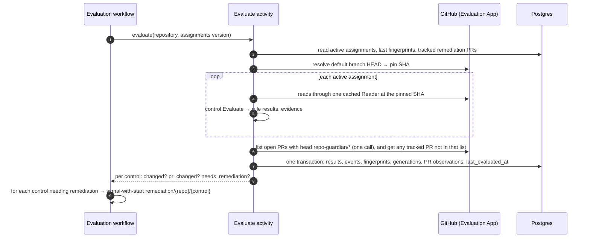
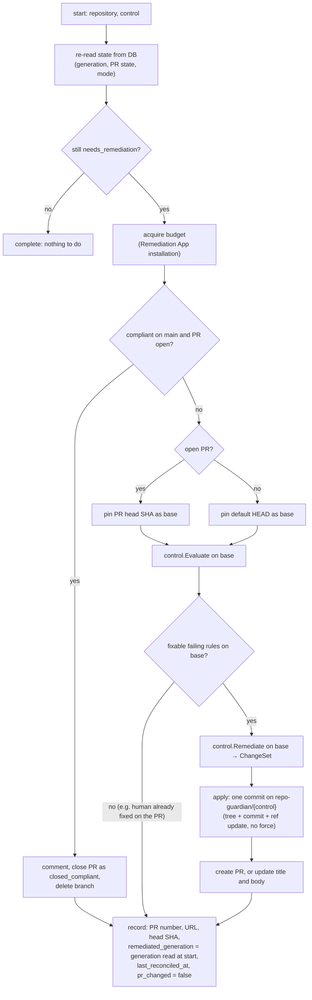
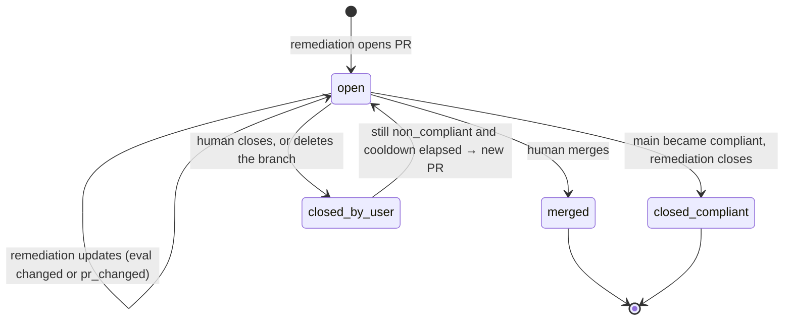

<!-- markdownlint-disable-file MD025 MD041 -->

# DESIGN-0032: Evaluation and remediation workflows: change-driven remediation with per-control PRs

<!--toc:start-->
- [Overview](#overview)
- [Goals and Non-Goals](#goals-and-non-goals)
  - [Goals](#goals)
  - [Non-Goals](#non-goals)
- [Background](#background)
- [Detailed Design](#detailed-design)
  - [Two GitHub Apps](#two-github-apps)
  - [Roles](#roles)
  - [Evaluation](#evaluation)
    - [When it runs](#when-it-runs)
    - [What one evaluation does](#what-one-evaluation-does)
    - [Change detection: fingerprints and generations](#change-detection-fingerprints-and-generations)
    - [PR observation](#pr-observation)
  - [Remediation](#remediation)
    - [Workflow shape](#workflow-shape)
    - [What one run does](#what-one-run-does)
    - [PR lifecycle](#pr-lifecycle)
  - [API remediations](#api-remediations)
  - [Data model](#data-model)
  - [API and UI](#api-and-ui)
  - [Metrics](#metrics)
  - [Failure semantics](#failure-semantics)
  - [Temporal mapping](#temporal-mapping)
- [Testing Strategy](#testing-strategy)
- [Migration / Rollout Plan](#migration--rollout-plan)
- [Open Questions](#open-questions)
  - [OQ1: Two GitHub Apps, or one App with down-scoped tokens?](#oq1-two-github-apps-or-one-app-with-down-scoped-tokens)
  - [OQ2: Separate evaluator and remediator roles?](#oq2-separate-evaluator-and-remediator-roles)
  - [OQ3: How is "something changed" tracked for remediation?](#oq3-how-is-something-changed-tracked-for-remediation)
  - [OQ4: Does a resource content change without a status change count as a change?](#oq4-does-a-resource-content-change-without-a-status-change-count-as-a-change)
  - [OQ5: Per-control PRs only, or a cap on how many open at once?](#oq5-per-control-prs-only-or-a-cap-on-how-many-open-at-once)
  - [OQ6: Branch naming and v1 cutover?](#oq6-branch-naming-and-v1-cutover)
  - [OQ7: What happens after a human closes a remediation PR while the control still fails?](#oq7-what-happens-after-a-human-closes-a-remediation-pr-while-the-control-still-fails)
  - [OQ8: Do API remediations (settings, rulesets, labels, properties) apply directly?](#oq8-do-api-remediations-settings-rulesets-labels-properties-apply-directly)
  - [OQ9: Is v1's foreign-PR detection (search terms) carried over?](#oq9-is-v1s-foreign-pr-detection-search-terms-carried-over)
  - [OQ10: How do signals during a running remediation coalesce?](#oq10-how-do-signals-during-a-running-remediation-coalesce)
  - [OQ11: Should evaluate mode show what remediation would change?](#oq11-should-evaluate-mode-show-what-remediation-would-change)
<!--toc:end-->

## Overview

This document specifies how controls run.

- **Evaluation** runs every assigned control (DESIGN-0030) against a repository's default branch, through a **read-only GitHub App**. It records the results, and detects whether anything *changed* since the last evaluation. It runs on a schedule and on events, and it is always safe to run again.
- **Remediation** runs through a separate **write-capable GitHub App**, only for assignments in `remediate` mode, and only when there is a reason:
  - the evaluation changed;
  - a human edited the remediation PR;
  - a human closed it while the control still fails.

  It keeps **one PR per control** and records the PR's whole lifecycle.

The two are connected by the database and by **eval generations**: per-control counters that make "has anything changed since remediation last acted?" a comparison rather than a flag that can be lost.

## Goals and Non-Goals

### Goals

- **Evaluation is idempotent and current.** Every evaluation reads the default branch at a pinned commit, writes results, and updates `last_evaluated_at`, so the UI always shows the latest known posture.
- **Remediation acts only on change.** A repository that fails the same way on every evaluation gets one PR and then silence.
- **Humans win.** A human's edits to a remediation PR are built on, never overwritten. A closed PR is respected for a cooldown. A merged PR is never reopened.
- **Every PR is accounted for.** Number, URL, branch, created, last reconciled, head SHA, state and close reason are stored, so "open remediation PRs older than 30 days, by org and control" is one query.
- **Least privilege by construction.** The evaluation path cannot write. Orgs in evaluate mode never install the remediation App.
- **Nothing blocks in a handler, and nothing half-applies.** The IMPL-0022 rules still apply: deferral, not sleep. A remediation lands as one commit (a ref update), or not at all.

### Non-Goals

- **Detecting humans' own fix PRs.** v1 matched other PRs by `search_terms` (OQ9).
- **Batching several controls into one PR** (OQ5).
- **Auto-merging remediation PRs.**

## Background

v2 today runs one `RepoWorkflow` per repository. It calls a check activity that both evaluates and remediates through v1's engine, under a single App with write permissions. `findings` record a per-rule verdict plus a `remediation` facet (`pr_open`, `foreign_pr`, …). This design keeps the per-repository workflow shape (assumption A1) and separates the two halves.

## Detailed Design

### Two GitHub Apps

| | Evaluation App | Remediation App |
| --- | --- | --- |
| Installed on | every org in the enterprise policy | only orgs with any `remediate` assignment |
| Repository permissions | Metadata: read · Contents: read · Pull requests: read · Administration: read · Custom properties: read | Contents: write · Pull requests: write · Administration: write *(only if API remediations are enabled)* · Custom properties: write *(ditto)* |
| Webhooks | `installation`, `installation_repositories`, `repository`, `push`, `pull_request` | none |
| Key held by | ingest (webhook secret only), evaluator workers | remediator workers |

The exact permission set is an assumption to verify (A23). In particular, reading rulesets and some settings may need Administration: read.

- **Separate rate budgets come for free.** An App's installation has its own id and its own rate limit, so evaluation load never starves remediation. v2's per-installation budget workflow keys on the installation id (assumption A2).
- **Installations are stored per App.** `installations` gains `app IN ('evaluation', 'remediation')`. A repository is evaluable when the evaluation App's installation covers it, and remediable when the remediation App's does too.
- **Ingest** validates the evaluation App's webhook secret, as today (the `ingest` role holds no private key).

### Roles

| Role | Holds | Runs |
| ---- | ----- | ---- |
| `ingest` | evaluation webhook secret | webhook → `WebhookWorkflow` (A13) |
| `evaluator` | evaluation App key, store | discovery, resolution, evaluation, snapshot workflows |
| `remediator` | remediation App key, store | remediation workflows |
| `api` | read-only store DSN | API |

Splitting `worker` into `evaluator` and `remediator` gives the secret-scoping guarantee in v2's chart helpers form: `roleHasRemediationKey` is true only for `remediator` and `all` (OQ2).

### Evaluation

#### When it runs

| Trigger | Signal to the repository's evaluation workflow |
| ------- | --------------------------------------------- |
| schedule (`EVAL_INTERVAL`, jittered) | timer |
| push to the default branch | `recheck` (priority 2) |
| `pull_request` event on a `repo-guardian/*` branch | `pr_event` (priority 2) |
| assignments changed (policy rollout, discovery) | `policy_changed`, spread over the rollout window |
| manual (API or UI "re-evaluate") | `recheck` (priority 1) |

These reuse `RepoWorkflow`'s selector, coalescing and priority keys (assumption A1). The workflow id stays `repo/<repository id>`.

#### What one evaluation does



#### Change detection: fingerprints and generations

For each (repository, control), evaluation computes a **fingerprint**:

```text
fingerprint = sha256( control id@version
                    , for each rule: (rule id, status)
                    , for each resource the control read: (path, blob SHA or "absent") )
```

- Rule *statuses* catch compliance changes.
- Resource *blob SHAs* catch "still failing, but the file changed". For example, a team edited CODEOWNERS on main without adding `.wiz`. The open PR may now conflict, so remediation must rebase its change onto the new content (OQ4).
- Timestamps, evidence wording and the pinned commit SHA are excluded, so an unrelated push does not count as a change.

If the fingerprint differs from the stored one, the evaluation **bumps `eval_generation`** for that control and records the transition in `result_events`. Otherwise it updates only `last_evaluated_at`.

**Why a generation counter, not a `changed_since_last_eval` boolean (OQ3).** A boolean that the *next evaluation* resets loses changes whenever two evaluations run before remediation does. That happens with remediation backlogged, the remediation App not yet installed, or the mode switched to `remediate` later:

| Step | Boolean | Generation |
| ---- | ------- | ---------- |
| eval 1: result changes | `changed = true` | `eval_gen = 5` |
| eval 2: no change, remediation has not run yet | `changed = false` ← **change lost** | `eval_gen = 5` |
| remediation runs | sees `false`, skips forever | `remediated_gen = 4 < 5` → runs, then sets `remediated_gen = 5` |

Only remediation advances `remediated_generation`, and only after it has acted. So no evaluation can erase a pending change.

#### PR observation

Each evaluation also observes the remediation PRs it tracks, through the read-only App:

| Observation | Recorded as | Effect |
| ----------- | ----------- | ------ |
| PR head SHA ≠ `head_sha_at_last_remediation` | `pr_changed = true` | a human pushed to the PR, so remediation re-runs on the PR head |
| PR closed, not merged, not by repo-guardian | state `closed_by_user`, `closed_at` | remediation may open a new PR after the cooldown (OQ7) |
| PR merged | state `merged` | nothing; the next evaluation of main sees the result |
| PR missing (branch or PR deleted) | state `closed_by_user` | same as closed |

`needs_remediation` for a control is:

```text
mode = remediate
AND remediation App installed for the repository
AND (
      ( status = non_compliant AND any failing rule has remediate = true
        AND ( eval_generation > remediated_generation
              OR pr_changed
              OR (state = closed_by_user AND cooldown elapsed) ) )
   OR ( status = compliant AND state = open )          -- close it as compliant
)
```

An `unknown` status never triggers remediation. Not knowing is not a reason to write.

### Remediation

#### Workflow shape

One workflow per (repository, control): `remediation/<repository id>/<control slug>`, started by **signal-with-start** from the evaluation workflow. A signal arriving while a run is in progress sets a "re-check at end" flag rather than starting a second run, so at most one remediation runs per control at a time. When a run ends with the flag set, or with `eval_generation` advanced during the run, it loops once more before completing (OQ10).

A periodic backstop (`remediation-sweep` schedule, hourly) queries for `needs_remediation` rows with no running workflow and signals them. It only matters if a signal was lost.

#### What one run does



Key behaviours:

- **Evaluating the PR head, not main, when a PR exists.** If a human filled in data on the PR branch (catalog-info, for example), those rules now pass on the base, and remediation adds only what is still failing. It never reverts the human's work.
- **Re-evaluate before writing.** The run re-evaluates the base itself instead of trusting the evaluation's results. State may have moved since, and this costs a few reads.
- **One commit, optimistic.** The ref update is not forced. If the branch moved between pinning and writing (a human pushed), the run defers and retries, re-pinning the new head. Nothing is half-applied, and nothing is overwritten.
- **A new branch is cut from default HEAD.** Branch name `repo-guardian/<control slug>` (OQ6).
- **The PR body is rendered from the evaluation:** each failing rule with its number and title, what this PR changes, and `Notes` for failing rules with no remediation. Title and body templates come from the control's `pr {}` block (DESIGN-0030), rendered with `internal/template` (assumption A10).
- **`remediated_generation` is the generation read at the start of the run,** not the current one. An evaluation that changed during the run is therefore picked up by the end-of-run loop.

#### PR lifecycle



Each transition writes a `remediation_events` row. A new PR after `closed_by_user` is a new `remediations` row, and the closed one keeps its history.

### API remediations

Controls whose `ChangeSet` has `API` changes (`repo_settings`, `branch_ruleset`, `labels`, `custom_properties`) have no PR to review. OQ8 decides whether they apply directly in `remediate` mode, or need a per-control `apply = "direct"` opt-in, recording each applied change as a `remediation_events` row with before/after values.

### Data model

These tables replace `findings`, `finding_events`, `rule_state`-style posture and v2's `remediation` facet (assumption A5). `checks` becomes the evaluation log (A6).

```sql
CREATE TABLE control_results (            -- current state, one row per repository and control
    repository_id          BIGINT NOT NULL REFERENCES repositories(id),
    control_id             TEXT   NOT NULL,
    control_version        TEXT   NOT NULL,
    status                 TEXT   NOT NULL CHECK (status IN ('compliant','non_compliant','unknown','not_applicable')),
    fingerprint            TEXT   NOT NULL,
    eval_generation        BIGINT NOT NULL DEFAULT 0,
    remediated_generation  BIGINT NOT NULL DEFAULT 0,
    pr_changed             BOOLEAN NOT NULL DEFAULT false,
    evaluated_sha          TEXT   NOT NULL,          -- default-branch commit evaluated
    last_evaluated_at      TIMESTAMPTZ NOT NULL,
    last_changed_at        TIMESTAMPTZ NOT NULL,
    PRIMARY KEY (repository_id, control_id)
);

CREATE TABLE rule_results (               -- current state, one row per rule
    repository_id   BIGINT NOT NULL,
    control_id      TEXT   NOT NULL,
    rule_id         TEXT   NOT NULL,
    status          TEXT   NOT NULL CHECK (status IN ('pass','fail','error','not_applicable')),
    remediable      BOOLEAN NOT NULL,
    evidence        JSONB  NOT NULL,
    evidence_version INT   NOT NULL,
    PRIMARY KEY (repository_id, control_id, rule_id),
    FOREIGN KEY (repository_id, control_id) REFERENCES control_results
);

CREATE TABLE result_events (              -- append-only transitions (grant-enforced, as finding_events)
    id             BIGSERIAL PRIMARY KEY,
    repository_id  BIGINT NOT NULL,
    control_id     TEXT   NOT NULL,
    rule_id        TEXT,                     -- NULL for a control-status transition
    from_status    TEXT,
    to_status      TEXT   NOT NULL,
    eval_generation BIGINT NOT NULL,
    occurred_at    TIMESTAMPTZ NOT NULL
);

CREATE TABLE remediations (               -- one row per PR (or direct API remediation)
    id                     BIGSERIAL PRIMARY KEY,
    repository_id          BIGINT NOT NULL,
    control_id             TEXT   NOT NULL,
    kind                   TEXT   NOT NULL CHECK (kind IN ('pull_request','api')),
    state                  TEXT   NOT NULL CHECK (state IN ('open','merged','closed_compliant','closed_by_user','applied','failed')),
    pr_number              INT,
    pr_url                 TEXT,
    branch                 TEXT,
    head_sha_at_last_remediation TEXT,
    remediated_generation  BIGINT NOT NULL,
    created_at             TIMESTAMPTZ NOT NULL,
    last_reconciled_at     TIMESTAMPTZ NOT NULL,
    closed_at              TIMESTAMPTZ,
    close_reason           TEXT
);
-- at most one open PR per repository and control
CREATE UNIQUE INDEX remediations_one_open
    ON remediations (repository_id, control_id) WHERE state = 'open';

CREATE TABLE remediation_events (         -- append-only: opened, updated, closed, applied, failed
    id              BIGSERIAL PRIMARY KEY,
    remediation_id  BIGINT NOT NULL REFERENCES remediations(id),
    kind            TEXT   NOT NULL,
    detail          JSONB  NOT NULL,
    occurred_at     TIMESTAMPTZ NOT NULL
);
```

The **compliance snapshots** become `(org, control_id, source, snapshot_at)`, carrying compliant, non-compliant, unknown, not-applicable and excluded counts. That keeps the one-shared-SQL-query rule (IMPL-0025 Phase 8) with the new keys.

### API and UI

The resources replace `/rules` and `/findings` (assumption A14):

| Endpoint | Returns |
| -------- | ------- |
| `/controls`, `/controls/{id}` | catalogue entry plus fleet compliance and per-org breakdown |
| `/policies` | the loaded snapshot summary: enterprise orgs, org policies, exclusions |
| `/orgs/{org}` | baseline-versus-org compliance, worst controls, exclusions |
| `/repositories/{id}/controls` | assignments with provenance, statuses, rule results and evidence |
| `/repositories/{id}/events` | assignment, result and remediation events merged into one timeline |
| `/remediations` | filter by state, org, control, age; open PRs older than N days |
| `/summary`, `/status` | as today, with evaluation freshness and remediation backlog |

Every query keeps the scope predicate (assumption A14).

### Metrics

| Metric | Labels |
| ------ | ------ |
| `evaluations_total` | `org`, `outcome` |
| `evaluation_changes_total` | `org`, `control` |
| `controls_status` (leader-exported gauge, IMPL-0023 pattern; query with `max by`) | `org`, `control`, `status` |
| `remediation_runs_total` | `org`, `control`, `result` = `opened`/`updated`/`noop`/`closed_compliant`/`deferred`/`error` |
| `remediation_prs_open` (gauge) | `org`, `control`, `age_bucket` |
| `remediation_blocked_total` | `org`, `reason` = `app_not_installed`/`cooldown` |

### Failure semantics

| Situation | Behaviour |
| --------- | --------- |
| Throttled (either App) | `AsThrottled` → defer (IMPL-0022); evaluation records nothing for a deferred run |
| Read error in a control | rule `error` → control `unknown` → no remediation |
| Ref update not fast-forward | defer and retry the run; re-pin the head |
| PR create fails after commit | the run errors; the next run finds the branch and creates the PR |
| Remediation App lacks permission | `remediation_blocked`, alert; evaluation unaffected |
| Store write fails after GitHub write | Temporal retries the record activity; the PR exists, so the retry re-reads it by branch |

### Temporal mapping

| Workflow | Id | Status |
| -------- | -- | ------ |
| evaluation (per repository) | `repo/<id>` | adapted from `RepoWorkflow`: new `Evaluate` activity, plus signal-with-start of remediation (A1) |
| remediation (per repository and control) | `remediation/<id>/<control>` | new |
| budget (per App installation) | `installation/<app>/<installation id>` | reused; the id gains the App (A2) |
| discovery, webhook, snapshot, policy rollout | unchanged ids | reused, with resolution added to discovery and rollout (A3, A7) |
| remediation sweep | schedule `remediation-sweep` | new |

The replay tests and history capture apply to both new workflow types. Before GA no version gates are needed (assumption A16).

## Testing Strategy

- **Change detection tables:** fingerprint inputs (status change, blob change, unrelated push) → bump or no bump. The generation race above as a test: two evaluations, then a remediation, and the remediation still runs.
- **`needs_remediation` truth table:** every combination of mode, status, fixable, generations, PR state and cooldown.
- **Remediation workflow (time-skipping environment, GitHub fake with real merge and push semantics):**
  - onboarding opens the PR;
  - a no-change evaluation does nothing;
  - a human edits the PR, and remediation adds only what is missing;
  - a human closes the PR, then the cooldown passes and a new PR opens;
  - main becomes compliant, and the PR is closed as `closed_compliant`;
  - merged is terminal;
  - a branch moved mid-run is deferred, not overwritten;
  - a signal during a run produces one extra loop, not a second run.
- **Capability test:** the evaluator role's dependency graph cannot reach `github.Writer` (depguard, as `internal/workflows` already does for engine imports).
- **API:** every new query is under `apitest` with kin-openapi response validation, and `TestAPIQueries_AreScoped` extends to the new tables.

## Migration / Rollout Plan

1. **Evaluation only.**
   - New tables; the evaluation activity; the API and UI views.
   - Remediation workflow types are registered but no assignment is in `remediate` mode.
   - Compare posture with v1 in the homelab.
2. **Remediation in one org,** with the remediation App installed there only and `mode = "remediate"` in that org's policy.
3. **Remaining orgs** by policy change. No deploy is needed.
4. **Cutover from v1:**
   - v1's open `repo-guardian/add-missing-files` PRs are closed with a comment pointing at the per-control PRs (OQ6);
   - v1's App is uninstalled, or becomes the evaluation App if its permissions are reduced (OQ1).

## Open Questions

### OQ1: Two GitHub Apps, or one App with down-scoped tokens?

- (a) ✅ recommended: **two Apps.** The private key is the security boundary. A process holding a write App's key can mint a write token whatever it intends, so the evaluator must hold a key that *cannot* write. Two Apps also give separate rate budgets, and let evaluate-only orgs never grant write.
- (b) One App, with evaluation workers requesting installation tokens restricted to read permissions. One installation to manage, but every evaluator still holds a key that can mint write tokens, so the guarantee is a convention.
- (c) One App plus a token-broker service that alone holds the key and hands out scoped tokens. It achieves (a)'s boundary with one App, at the cost of a new service on the critical path.
- other:

### OQ2: Separate `evaluator` and `remediator` roles?

- (a) ✅ recommended: **yes, two worker roles on separate task queues** (`repo-guardian-eval`, `repo-guardian-remediate`), with `all` running both for small installs. The remediation key then exists only in remediator pods, mirroring how `ingest` already refuses the App key.
- (b) One `worker` role holding both keys, with activities choosing the client. Simpler to deploy, but every worker holds write credentials, which defeats much of OQ1.
- other:

### OQ3: How is "something changed" tracked for remediation?

- (a) ✅ recommended: **per-control `eval_generation` bumped by evaluation and `remediated_generation` advanced only by remediation, plus a `pr_changed` flag cleared by remediation.** No change can be lost to an evaluation that runs before remediation (see the race table).
- (b) A `change_since_last_eval` boolean on the repository, set and cleared by evaluation, as in the brief. Simplest, but it loses changes whenever two evaluations run between remediations, which is the normal state while remediation is off, backlogged or not yet installed.
- (c) Remediation diffs the latest `result_events` against its last run. Correct, but it puts event-log scans on every remediation decision.
- other:

### OQ4: Does a resource content change without a status change count as a change?

- (a) ✅ recommended: **yes; resource blob SHAs are part of the fingerprint.** If CODEOWNERS changed on main and still fails, the open PR's edit may now conflict or be stale. Remediation must rebuild it on the new content.
- (b) Statuses only. Fewer remediation runs, but a stale PR sits until something else changes, and may become unmergeable.
- other:

### OQ5: Per-control PRs only, or a cap on how many open at once?

- (a) ✅ recommended: **per-control PRs, with a per-repository cap on open remediation PRs** (default 3, configurable per org policy). Onboarding a bare repository with six failing controls opens the three highest-priority ones first, and the rest follow as those merge. That keeps the "one control, one PR" model without flooding a team.
- (b) No cap: every failing control opens its PR immediately. Matches the brief literally, but onboarding a large org can open thousands of PRs in an hour.
- (c) An onboarding exception: the first remediation of a repository bundles every control into one PR, then switches to per-control. Fewer PRs at onboarding, but two PR shapes to build, track and explain.
- other:

### OQ6: Branch naming and v1 cutover?

- (a) ✅ recommended: **`repo-guardian/<control slug>`** (for example `repo-guardian/codeowners`), unversioned so a version bump updates the same PR. At cutover, v1's `repo-guardian/add-missing-files` PRs are closed with a pointer comment. This ends v1/v2 PR adoption (assumption A17), which is acceptable at a planned cutover.
- (b) `repo-guardian/<control slug>-v<major>`. A version bump opens a fresh PR, which is cleaner history but closes and reopens churn on every version bump.
- (c) Keep adopting v1's single PR during a transition window. It re-introduces the multi-control PR that this design removes.
- other:

### OQ7: What happens after a human closes a remediation PR while the control still fails?

- (a) ✅ recommended: **open a new PR after a cooldown** (default 14 days, configurable per org policy). Sooner only if the evaluation changes in the meantime. The closure is recorded and shown, and excluding the control in the org policy is the way to stop it permanently. Closing a PR is often "not now", so a cooldown respects that without letting a control silently stay failing forever.
- (b) Open a new PR on the next remediation run, as the brief describes. Simple, but it immediately reopens what a human just closed, and that reads as the bot fighting the team.
- (c) Never reopen automatically; the UI shows "closed by user, still failing" and a human re-triggers. Respectful, but failing controls quietly stay failing.
- other:

### OQ8: Do API remediations (settings, rulesets, labels, properties) apply directly?

- (a) ✅ recommended: **only with a per-control opt-in (`apply = "direct"`) in `remediate` mode. Otherwise they are reported as recommended changes in the UI.** A direct change has no review step, so applying it should be a separate, explicit decision from opening PRs.
- (b) Apply directly whenever the mode is `remediate`, as v1's setting remediation does. Consistent, but turning on remediation for an org then silently changes repository settings.
- (c) Never apply directly; open a tracking issue instead. Always reviewed, but issues are easy to ignore and need Issues: write.
- other:

### OQ9: Is v1's foreign-PR detection (search terms) carried over?

- (a) ✅ recommended: **no.** Remediation creates its own per-control PR. If a human's PR fixes the same thing and merges first, the next evaluation sees compliance on main and closes ours as `closed_compliant`. Substring matching was a source of false positives (INV-0021 R8).
- (b) Keep it as an optional per-control `pr { search_terms }`: skip opening if a matching open PR exists. Avoids duplicate PRs, but it brings back the fragile matching.
- other:

### OQ10: How do signals during a running remediation coalesce?

- (a) ✅ recommended: **one long-lived execution per run, with signals setting a re-check flag and an end-of-run loop when the flag is set or the generation advanced.** At most one write path per control, and nothing is dropped.
- (b) Start a fresh workflow per signal, with `WorkflowIDReusePolicy` rejecting duplicates while one runs. Simpler code, but a signal that arrives just before completion can be dropped, and the backstop sweep then has to catch it.
- (c) A permanently running workflow per (repository, control), like `RepoWorkflow`. Uniform with evaluation, but it multiplies long-lived workflows by the number of controls, most of them idle.
- other:

### OQ11: Should evaluate mode show what remediation would change?

- (a) ✅ recommended: **yes, in a later phase: compute `Remediate` during evaluation and store the change set summary as a preview,** shown in the UI as "would open PR: add 1 line to .github/CODEOWNERS". `Remediate` needs no write credentials, so the evaluator can compute it safely. It makes evaluate mode a real dry run for deciding when to enable remediation.
- (b) No preview; evaluate mode shows only failing rules. Less work, but operators enable remediation without seeing what it will do.
- other:
