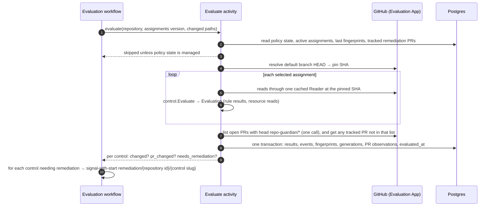
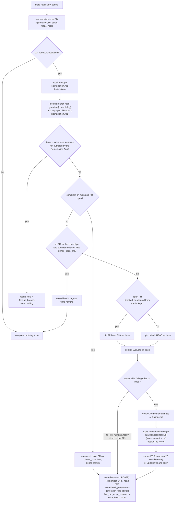
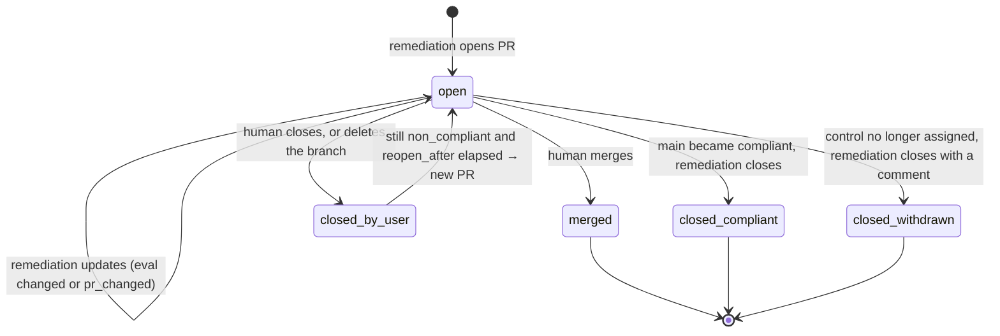

<!-- markdownlint-disable-file MD025 MD041 -->

# DESIGN-0032: Evaluation and remediation workflows: change-driven remediation with per-control PRs

<!--toc:start-->
- [Overview](#overview)
- [Goals and Non-Goals](#goals-and-non-goals)
  - [Goals](#goals)
  - [Non-Goals](#non-goals)
- [Background](#background)
- [Detailed Design](#detailed-design)
  - [Two GitHub Apps](#two-github-apps)
  - [Roles](#roles)
  - [Evaluation](#evaluation)
    - [When it runs](#when-it-runs)
    - [What one evaluation does](#what-one-evaluation-does)
    - [Change detection: fingerprints and generations](#change-detection-fingerprints-and-generations)
    - [PR observation](#pr-observation)
  - [Remediation](#remediation)
    - [Workflow shape](#workflow-shape)
    - [What one run does](#what-one-run-does)
    - [PR lifecycle](#pr-lifecycle)
  - [API remediations](#api-remediations)
- [Data Model](#data-model)
  - [Two application roles](#two-application-roles)
- [API / Interface Changes](#api--interface-changes)
- [Metrics](#metrics)
- [Failure semantics](#failure-semantics)
- [Temporal mapping](#temporal-mapping)
- [Testing Strategy](#testing-strategy)
- [Migration / Rollout Plan](#migration--rollout-plan)
- [Decisions](#decisions)
- [Adversarial Review](#adversarial-review)
  - [AR-0032-01 (high): A narrow update still loses concurrent PR changes](#ar-0032-01-high-a-narrow-update-still-loses-concurrent-pr-changes)
  - [AR-0032-02 (high): Adoption both rejects human collaboration and misidentifies ownership](#ar-0032-02-high-adoption-both-rejects-human-collaboration-and-misidentifies-ownership)
  - [AR-0032-03 (high): Re-evaluating an old PR head does not rebase onto new main](#ar-0032-03-high-re-evaluating-an-old-pr-head-does-not-rebase-onto-new-main)
  - [AR-0032-04 (high): Withdrawal cleanup is unreachable through the due predicate](#ar-0032-04-high-withdrawal-cleanup-is-unreachable-through-the-due-predicate)
  - [AR-0032-05 (high): The PR cap races across per-control workflows](#ar-0032-05-high-the-pr-cap-races-across-per-control-workflows)
  - [AR-0032-06 (high): Retry safety needs durable operations and assignment epochs](#ar-0032-06-high-retry-safety-needs-durable-operations-and-assignment-epochs)
  - [AR-0032-07 (high): Non-forced ref updates are not compare-and-swap](#ar-0032-07-high-non-forced-ref-updates-are-not-compare-and-swap)
  - [AR-0032-08 (high): Error classification and fresh-state gating are incomplete](#ar-0032-08-high-error-classification-and-fresh-state-gating-are-incomplete)
  - [AR-0032-09 (high): The proposed schema and grants cannot perform the stated transactions](#ar-0032-09-high-the-proposed-schema-and-grants-cannot-perform-the-stated-transactions)
  - [AR-0032-10 (high): API remediation has neither atomic apply nor complete invalidation](#ar-0032-10-high-api-remediation-has-neither-atomic-apply-nor-complete-invalidation)
  - [AR-0032-11 (medium): Cooldown and freshness need their own persisted state](#ar-0032-11-medium-cooldown-and-freshness-need-their-own-persisted-state)
  - [AR-0032-12 (medium): Event and API boundaries need precise completeness and scope rules](#ar-0032-12-medium-event-and-api-boundaries-need-precise-completeness-and-scope-rules)
- [Open Questions](#open-questions)
  - [OQ1: How is "something changed" tracked for remediation?](#oq1-how-is-something-changed-tracked-for-remediation)
  - [OQ2: Per-control PRs only, or a cap on how many open at once?](#oq2-per-control-prs-only-or-a-cap-on-how-many-open-at-once)
  - [OQ3: What happens after a human closes a remediation PR while the control still fails?](#oq3-what-happens-after-a-human-closes-a-remediation-pr-while-the-control-still-fails)
  - [OQ4: Do API remediations (settings, rulesets, labels, properties) apply directly?](#oq4-do-api-remediations-settings-rulesets-labels-properties-apply-directly)
<!--toc:end-->

## Overview

This document specifies how controls run.

- **Evaluation** runs every assigned control (DESIGN-0030) against a repository's default branch, through the read-only **Evaluation App**. It records the results, and detects whether anything *changed* since the last evaluation. It runs on a schedule and on events, and it is always safe to run again. It only looks at repositories whose policy state is `managed`: parked, excluded and unmanaged repositories (DESIGN-0030) are never read.
- **Remediation** runs through the separate, write-capable **Remediation App**, only for assignments in `remediate` mode, and only when there is a reason:
  - the evaluation changed;
  - a human edited the remediation PR;
  - a human closed it while the control still fails.

  It keeps **one PR per control** and records the PR's whole lifecycle.

The two are connected by the database and by **eval generations**: per-control counters that make "has anything changed since remediation last acted?" a comparison rather than a flag that can be lost.

## Goals and Non-Goals

### Goals

- **Evaluation is idempotent and current.** Every evaluation reads the default branch at a pinned commit, writes results, and updates `evaluated_at` (the brief's "last reconciled"), so the UI always shows the latest known posture.
- **Remediation acts only on change.** A repository that fails the same way on every evaluation gets one PR and then silence.
- **Humans win.** A human's edits to a remediation PR are built on, never overwritten. A closed PR is respected for a cooldown. A merged PR is never reopened. A branch that carries someone else's commits is never written to.
- **Every PR is accounted for.** Number, URL, branch, created, last run, head SHA, state and close reason are stored, so "open remediation PRs older than 30 days, by org and control" is one query.
- **Least privilege by construction.** The evaluation path holds a key that cannot write. Orgs in evaluate mode never install the Remediation App.
- **Nothing blocks in a handler, and nothing half-applies.** The IMPL-0022 rules still apply: deferral, not sleep. A remediation lands as one commit (a ref update), or not at all.

### Non-Goals

- **Detecting humans' own fix PRs.** v1 matched other PRs by `search_terms` (D5).
- **Batching several controls into one PR** (OQ2).
- **Auto-merging remediation PRs.**

## Background

v2 today runs one `RepoWorkflow` per repository. It calls a check activity that both evaluates and remediates through v1's engine — one pass per rule, with no shared view of the result — under a single App with write permissions. `findings` record a per-rule verdict plus a `remediation` facet (`pr_open`, `foreign_pr`, …). This design keeps the per-repository workflow shape (assumption A1) and separates the two halves.

## Detailed Design

### Two GitHub Apps

repo-guardian runs as **two GitHub Apps** (D1). The private key is the security boundary: a process holding a write-capable App's key can mint a write token whatever it intends, so the evaluator holds a key that *cannot* write. Each App is installed per org, has its own installation id, its own rate budget, its own Temporal task queue and its own worker role, so evaluation and remediation scale independently and evaluation load never starves remediation.

| | Evaluation App | Remediation App |
| --- | --- | --- |
| Installed on | every org in the enterprise policy | only orgs with any `remediate` assignment |
| Repository permissions | Metadata: read · Contents: read · Pull requests: read · Issues: read · Administration: read · Custom properties: read | Contents: read and write · Pull requests: read and write · plus **read and write** on every resource kind a registered control type can remediate: Administration (`repo_settings`, `branch_ruleset`), Custom properties (`custom_properties`), Issues (`labels`) |
| Webhooks | `installation`, `installation_repositories`, `repository`, `push`, `pull_request` — including `pull_request` events for PRs the Remediation App opened, because webhooks are delivered per repository, not per author App | none |
| Key held by | evaluator workers (ingest holds only the webhook secret) | remediator workers |
| Budget workflow | `installation/eval/<installation id>` | `installation/remediate/<installation id>` |
| Task queue · role | `repo-guardian-eval` · `evaluator` | `repo-guardian-remediate` · `remediator` |

- **The Remediation App's permission set is derived, not hand-listed.** The control registry (DESIGN-0031) knows which resource kinds the registered types can remediate; the binary prints the required set at startup and the operator docs list it. The exact GitHub permission names are an assumption to verify (A23).
- **The Remediation App needs the read half too**, because a remediation run re-evaluates the base it is about to write (see [What one run does](#what-one-run-does)); it does not trust an evaluation that may be minutes old.
- **Separate rate budgets.** Each App installation has its own id and its own rate limit. v2's budget workflow is keyed by installation id alone today (assumption A2 is rewritten: the key gains an app dimension), so the workflow id becomes `installation/<app>/<installation id>` and the two budgets never interact.
- **Installations are stored per App.** `installations` gains `app IN ('eval', 'remediate')` and an index on `(account_login, app)`. `repositories.installation_id` references the **Evaluation App's** installation, because discovery runs through it; the Remediation App's installation is looked up by `(account_login = org, app = 'remediate')` and is never stored on the repository row. A repository is *evaluable* when its installation is live (neither suspended nor removed) and *remediable* when its org also has a live `remediate` installation; both booleans are exposed on `/repositories`. Resolution (DESIGN-0030) reads both: an org without the Remediation App resolves every assignment to `mode = 'evaluate'` with `mode_reason = 'remediation_app_not_installed'`, so such assignments never reach the remediator.
- **Ingest** validates the Evaluation App's webhook secret, as today (the `ingest` role holds no private key).

### Roles

| Role | Holds | Runs | Scales on |
| ---- | ----- | ---- | --------- |
| `ingest` | Evaluation App webhook secret | webhook → `WebhookWorkflow` (A13) | HTTP load |
| `evaluator` | Evaluation App key, store | discovery, resolution, evaluation, snapshot workflows on task queue `repo-guardian-eval` | KEDA on the `repo-guardian-eval` backlog |
| `remediator` | Remediation App key, store | remediation workflows on task queue `repo-guardian-remediate` | KEDA on the `repo-guardian-remediate` backlog |
| `api` | read-only store DSN | API | HTTP load |

Splitting `worker` into `evaluator` and `remediator` (D2) gives the secret-scoping guarantee in v2's chart-helper form: `roleHasRemediationKey` is true only for `remediator` and `all`, mirroring how `ingest` already refuses the App key. `all` runs every role for small installs.

### Evaluation

#### When it runs

| Trigger | Signal to the repository's evaluation workflow | Controls evaluated |
| ------- | --------------------------------------------- | ------------------ |
| schedule (`EVAL_INTERVAL`, jittered) | timer | all active assignments |
| push to the default branch | `recheck` (priority 2), carrying the changed paths | only controls whose `Resources()` (DESIGN-0031) intersect the changed paths; all when the paths are unknown (a push payload over GitHub's 20-commit limit) |
| `pull_request` event on a `repo-guardian/*` branch | `pr_event` (priority 2) | the control the branch belongs to (PR observation only) |
| assignments changed (policy rollout, discovery) | `policy_changed`, spread over the rollout window | all |
| manual (API or UI "re-evaluate") | `recheck` (priority 1) | all |

These reuse `RepoWorkflow`'s selector, coalescing and priority keys (assumption A1). The workflow id stays `repo/<repository id>`. Scoping push rechecks by `Resources()` is what v1's watched-path set did; v1's `workflow_sync` reconciler, whose only function was feeding that set, is absorbed by it.

The evaluator first reads `repository_policy_state` (DESIGN-0030) and skips any repository whose `state` is not `managed`: a parked repository (archived, fork, removed, access denied) is never read, and only discovery un-parks it, exactly as today.

#### What one evaluation does



#### Change detection: fingerprints and generations

For each (repository, control), evaluation computes a **fingerprint** from the `Evaluation` the control returned (DESIGN-0031: `Results` and `Reads`):

```text
fingerprint = sha256( control id@version
                    , for each rule result: (rule id, status)
                    , for each resource read: (resource, blob SHA or "absent") )
```

- Rule *statuses* catch compliance changes.
- Resource *blob SHAs* catch "still failing, but the file changed" (D3). For example, a team edited CODEOWNERS on main without adding `.wiz`. The open PR may now conflict, so remediation must rebase its change onto the new content.
- Timestamps, evidence wording and the pinned commit SHA are excluded, so an unrelated push does not count as a change.

**A missing prior row is a change.** The first evaluation of a (repository, control) inserts the row with `eval_generation = 1`; the column default of 0 is what `remediated_generation` starts at, never what an evaluation writes. Onboarding therefore triggers remediation on the first evaluation: `1 > 0`.

If the fingerprint differs from the stored one, the evaluation **bumps `eval_generation`** for that control and records the transition in `result_events` (with the control version that produced it). Otherwise it updates only `evaluated_at`.

**Why a generation counter, not a `changed_since_last_eval` boolean (OQ1).** A boolean that the *next evaluation* resets loses changes whenever two evaluations run before remediation does. That happens with remediation backlogged, the Remediation App not yet installed, or the mode switched to `remediate` later:

| Step | Boolean | Generation |
| ---- | ------- | ---------- |
| first evaluation, new row | `changed = true` | `eval_gen = 1`, `remediated_gen = 0` |
| eval 1: result changes | `changed = true` | `eval_gen = 5` |
| eval 2: no change, remediation has not run yet | `changed = false` ← **change lost** | `eval_gen = 5` |
| remediation runs | sees `false`, skips forever | `remediated_gen = 4 < 5` → runs, then sets `remediated_gen = 5` |

Only remediation advances `remediated_generation`, and only after it has acted. So no evaluation can erase a pending change.

#### PR observation

Each evaluation also observes the remediation PRs it tracks, through the Evaluation App. `pull_request` webhooks reach the Evaluation App whichever App opened the PR, so no polling is needed between schedules.

| Observation | Recorded as | Effect |
| ----------- | ----------- | ------ |
| PR head SHA ≠ `head_sha_at_last_remediation` | `pr_changed = true` | a human pushed to the PR, so remediation re-runs on the PR head |
| PR closed, not merged, not by repo-guardian | state `closed_by_user`, `closed_at` | remediation may open a new PR after the cooldown (OQ3) |
| PR merged | state `merged` | nothing; the next evaluation of main sees the result |
| PR missing (branch or PR deleted) | state `closed_by_user` | same as closed |

`needs_remediation` for a control is:

```text
repository policy state = managed
AND mode = remediate                                   -- already false when mode_reason = remediation_app_not_installed
AND (
      ( status = non_compliant AND any failing rule has remediate = true
        AND ( eval_generation > remediated_generation  -- true for a new row: 1 > 0
              OR pr_changed
              OR (state = closed_by_user AND reopen_after elapsed) ) )
   OR ( status = compliant AND state = open )          -- close it as compliant
)
```

An `unknown` status never triggers remediation. Not knowing is not a reason to write.

### Remediation

#### Workflow shape

One workflow per (repository, control): `remediation/<repository id>/<control slug>`, started by **signal-with-start** from the evaluation workflow. A signal arriving while a run is in progress sets a "re-check at end" flag rather than starting a second run, so at most one remediation runs per control at a time (D6). When a run ends, it **re-reads `eval_generation` and `pr_changed` from the database**; if either moved past what the run started from, or the flag is set, it loops once more before completing. The reloop does not depend on a signal having been delivered.

A periodic backstop (`remediation-sweep` schedule, hourly) queries for `needs_remediation` rows with no running workflow and signals them. It only matters if a signal was lost, or a run ended on a hold (PR cap) that has since cleared.

#### What one run does



Key behaviours:

- **Find or adopt before any write.** The run looks up the branch `repo-guardian/<control slug>` and any open PR whose head is that branch, through the Remediation App, independently of the `remediations` row. A branch whose every commit was authored by the Remediation App is adopted (this is how a run recovers from "PR create failed after the commit"). A branch with any other commit is **not touched**: the run records `hold = 'foreign_branch'`, writes nothing, and the failure table says so. A replayed create-PR that returns 422 "a pull request already exists" lists PRs by head and adopts the existing one.
- **Evaluating the PR head, not main, when a PR exists.** If a human filled in data on the PR branch (catalog-info, for example), those rules now pass on the base, and remediation adds only what is still failing. It never reverts the human's work.
- **Re-evaluate before writing.** The run re-evaluates the base itself instead of trusting the evaluation's results. State may have moved since, and this costs a few reads (which is why the Remediation App holds read permissions).
- **One commit, optimistic.** The ref update is not forced. If the branch moved between pinning and writing (a human pushed), the run defers and retries, re-pinning the new head. Nothing is half-applied, and nothing is overwritten.
- **A new branch is cut from default HEAD.** Branch name `repo-guardian/<control slug>` (D4).
- **The PR cap.** `remediation.max_open_prs` (DESIGN-0030, default 3) bounds open remediation PRs per repository. Controls are processed in enterprise-policy order. When the cap is reached and this control has no PR yet, the run records `hold = 'pr_cap'` and ends without writing; `needs_remediation` stays true, and the next PR close or merge on the repository (observed by evaluation) or the backstop sweep picks it up. A control that already has an open PR is never held by the cap: updating it opens nothing new.
- **The PR body is rendered from the evaluation:** each failing rule with its number and title, what this PR changes, and `Notes` for failing rules with no remediation. Title and body templates come from the control's `pr {}` block (DESIGN-0030), rendered with `internal/template` (assumption A10).
- **`remediated_generation` is the generation read at the start of the run,** not the current one. An evaluation that changed during the run is therefore picked up by the end-of-run loop.
- **Invariant: record-is-narrow.** The record step is an `UPDATE` of exactly `remediated_generation`, `pr_changed = false`, `hold` and the PR columns. It never writes `eval_generation`, `status`, `fingerprint` or `evaluated_at`, which belong to evaluation. A full-row save here would clobber a concurrent evaluation's bump with the stale start-of-run value — the exact loss the generation counters exist to prevent — and the reloop would then have nothing to see.

#### PR lifecycle



Each transition writes a `remediation_events` row. A new PR after `closed_by_user` is a new `remediations` row, and the closed one keeps its history. When a control stops being assigned to the repository while its PR is open, the next run closes the PR with a comment and records `closed_withdrawn` (D10); the row is kept. A hold (`pr_cap`, `foreign_branch`) is not a PR state: it lives on `control_results` because there may be no PR yet.

### API remediations

Controls whose `ChangeSet` has `API` changes (`repo_settings`, `branch_ruleset`, `labels`, `custom_properties`) have no PR to review. The catalogue entry for such a control carries `remediation { apply = "pr" | "direct" }` (DESIGN-0030), default `pr`. For an API resource, `pr` means the change is **reported, never written**: the run records a `remediations` row of kind `api` in state `recommended` with the before/after values, shown in the UI as a recommended change. `direct` applies it through the Remediation App and records the applied change with before/after values as a `remediation_events` row. OQ4 is whether `direct` should exist at all.

## Data Model

These tables replace `findings`, `finding_events`, `rule_state`-style posture and v2's `remediation` facet (assumption A5). `checks` becomes the evaluation log (A6). `control_assignments` and `repository_policy_state`, which these join on `(repository_id, control_id)` and `repository_id`, are DESIGN-0030's.

```sql
CREATE TABLE control_results (            -- current state, one row per repository and control
    repository_id          BIGINT NOT NULL REFERENCES repositories(id),
    control_id             TEXT   NOT NULL,
    control_version        INT    NOT NULL,
    status                 TEXT   NOT NULL CHECK (status IN ('compliant','non_compliant','unknown','not_applicable')),
    fingerprint            TEXT   NOT NULL,
    eval_generation        BIGINT NOT NULL,            -- evaluation inserts 1 on the first row
    remediated_generation  BIGINT NOT NULL DEFAULT 0,  -- only remediation writes it
    pr_changed             BOOLEAN NOT NULL DEFAULT false,
    hold                   TEXT   CHECK (hold IN ('pr_cap','foreign_branch','permission')),
    hold_since             TIMESTAMPTZ,
    evaluated_sha          TEXT   NOT NULL,            -- default-branch commit evaluated
    evaluated_at           TIMESTAMPTZ NOT NULL,       -- the brief's "last reconciled"
    last_changed_at        TIMESTAMPTZ NOT NULL,
    PRIMARY KEY (repository_id, control_id)
);

CREATE TABLE rule_results (               -- current state, one row per rule
    repository_id    BIGINT NOT NULL,
    control_id       TEXT   NOT NULL,
    rule_id          TEXT   NOT NULL,                  -- bare id, unique within the control
    status           TEXT   NOT NULL CHECK (status IN ('pass','fail','error','not_applicable')),
    remediate        BOOLEAN NOT NULL,                 -- the rule's remediate attribute
    evidence         JSONB  NOT NULL,
    evidence_version SMALLINT NOT NULL,
    PRIMARY KEY (repository_id, control_id, rule_id),
    FOREIGN KEY (repository_id, control_id) REFERENCES control_results
);

CREATE TABLE result_events (              -- append-only transitions (grant-enforced, as finding_events)
    id              BIGSERIAL PRIMARY KEY,
    repository_id   BIGINT NOT NULL,
    control_id      TEXT   NOT NULL,
    control_version INT    NOT NULL,                   -- the version that produced the transition
    rule_id         TEXT,                              -- NULL for a control-status transition
    from_status     TEXT,
    to_status       TEXT   NOT NULL,
    eval_generation BIGINT NOT NULL,
    occurred_at     TIMESTAMPTZ NOT NULL
);

CREATE TABLE remediations (               -- one row per PR, or per API remediation
    id                     BIGSERIAL PRIMARY KEY,
    repository_id          BIGINT NOT NULL,
    control_id             TEXT   NOT NULL,
    kind                   TEXT   NOT NULL CHECK (kind IN ('pull_request','api')),
    state                  TEXT   NOT NULL CHECK (state IN ('open','merged','closed_compliant','closed_by_user','closed_withdrawn','recommended','applied','failed')),
    pr_number              INT,
    pr_url                 TEXT,
    branch                 TEXT,
    head_sha_at_last_remediation TEXT,
    remediated_generation  BIGINT NOT NULL,
    created_at             TIMESTAMPTZ NOT NULL,
    last_run_at            TIMESTAMPTZ NOT NULL,       -- last remediation run that touched this row
    closed_at              TIMESTAMPTZ,
    close_reason           TEXT
);
-- at most one open PR or outstanding recommendation per repository and control
CREATE UNIQUE INDEX remediations_one_open
    ON remediations (repository_id, control_id) WHERE state IN ('open', 'recommended');

CREATE TABLE remediation_events (         -- append-only: opened, updated, closed, applied, failed
    id              BIGSERIAL PRIMARY KEY,
    remediation_id  BIGINT NOT NULL REFERENCES remediations(id),
    kind            TEXT   NOT NULL,
    detail          JSONB  NOT NULL,                   -- before/after values for API changes
    occurred_at     TIMESTAMPTZ NOT NULL
);
```

Two writers share `control_results` by column, never by row: evaluation owns `status`, `fingerprint`, `eval_generation`, `evaluated_sha`, `evaluated_at`, `last_changed_at` and sets `pr_changed = true`; remediation owns `remediated_generation`, `hold`, `hold_since` and clears `pr_changed` (record-is-narrow).

`checks` keeps its shape as the evaluation log: the `trigger` CHECK gains `pr_event` and `manual`, and `pending_result` stays JSONB, holding per control the status, fingerprint, rule results and resource reads until the record step commits them; evidence is text-only (DESIGN-0027), so the staged payload is bounded. `result_events` **and** `remediation_events` are append-only by grant, as `finding_events` is today. When an assignment stops being active, resolution clears the control's `control_results` and `rule_results` rows and writes a `result_events` row with `to_status = NULL` (DESIGN-0030 D6), so a control that no longer applies cannot linger in posture. `max_open_prs` and `reopen_after` are resolved per repository onto `repository_policy_state` (DESIGN-0030 D7), so the remediation run and the sweep read them from the row rather than from the snapshot.

On `repositories`, `next_due_at`, `last_error`, `active`, `park_reason` and `parked_at` stay. `last_check_outcome`, `policy_version` and `catalog_parse_ok` are rule-engine posture superseded by `control_results.evaluated_at`, `repository_policy_state.policy_version` and `catalog_info` evidence; they are dropped at cutover (see Migration).

The **compliance snapshots** become `(org, control_id, source, snapshot_at)`, carrying compliant, non-compliant, unknown, not-applicable and excluded counts. That keeps the one-shared-SQL-query rule (IMPL-0025 Phase 8) with the new keys.

### Two application roles

The evaluator and the remediator connect as separate database roles, `rg_evaluator` and `rg_remediator`; `all` connects as a role that is a member of both (D8). The migrating role creates them, the way `pgtest.AppRole` already stands in for the application role when the append-only revoke on `finding_events` is tested.

| Role | May write |
| ---- | --------- |
| `rg_evaluator` | INSERT on `control_results`, `rule_results`, `result_events`, `checks`; UPDATE on `control_results (status, fingerprint, eval_generation, control_version, evaluated_sha, evaluated_at, last_changed_at, pr_changed)`; UPDATE on `remediations (state, closed_at, close_reason, head_sha_at_last_remediation)` for PR observation; DELETE on `rule_results` (rules dropped by a version bump) |
| `rg_remediator` | INSERT on `remediations`, `remediation_events`; UPDATE on `control_results (remediated_generation, pr_changed, hold, hold_since)`; UPDATE on `remediations` |
| both | SELECT everywhere; UPDATE, DELETE and TRUNCATE revoked on `result_events` and `remediation_events` |

Record-is-narrow stops being a sentence to remember and becomes a constraint: a remediator that saves a whole `control_results` row fails at the database instead of silently clobbering an evaluation's generation bump.

## API / Interface Changes

The resources replace `/rules` and `/findings` (assumption A14):

| Endpoint | Returns |
| -------- | ------- |
| `/controls`, `/controls/{id}` | catalogue entry plus fleet compliance and per-org breakdown |
| `/policies` | the loaded snapshot summary: enterprise orgs, org policies, exclusions |
| `/orgs/{org}` | baseline-versus-org compliance, worst controls, exclusions |
| `/repositories` | as today, plus `policy_state`, `policy_reason`, `evaluable` and `remediable` |
| `/repositories/{id}/controls` | assignments with provenance and mode reason, statuses, rule results, evidence, holds and the latest remediation |
| `/repositories/{id}/events` | assignment, result and remediation events merged into one timeline |
| `/repositories/{id}/evaluations` | the evaluation log (today's `/repositories/{id}/checks`, renamed with the table's new role) |
| `POST /repositories/{id}/evaluate` | sends `recheck` at priority 1 to `repo/<id>`; `202` with no body; `501` when the api role has no Temporal client (D9) |
| `/remediations` | filter by state, org, control, age; open PRs older than N days |
| `/summary`, `/status` | as today, with evaluation freshness and remediation backlog |

Every query keeps the scope predicate (assumption A14).

The `POST` is the one write the API performs, and it writes nothing to the store. The `api` role gains an **optional** Temporal client used only to signal: it never starts workflows and never reads the store through Temporal. It is enabled when `TEMPORAL_ADDRESS` is set for the role; without it the endpoint returns `501` and the UI hides the button. The UI's BFF, which proxies `GET` and `HEAD` only today, proxies this one `POST` with the same Origin check it applies to logout. Authorization is the org visibility the `GET` on the same repository already requires.

Shapes worth pinning in the spec:

- `/controls/{id}` is keyed by slug. Its per-org breakdown carries `version` (an org on `codeowners@2` through `replace` sits beside one on `@1`), and fleet totals sum over `control_id` across versions, which is what DESIGN-0030's version-free result key intends.
- `/policies` returns `policy.Summarize` output: `version`, `first_seen_at`, `rollout_completed_at`, the enterprise orgs, mode and controls, and per org its mode, added, replaced and excluded controls with reasons, and `excluded_repos`.
- Evidence objects carry `evidence_kind = "<control type>/<rule kind>"` and `evidence_version` as the `oneOf` discriminator; the UI renders only kinds and versions it knows, as it does for `reason` today.
- The spec's existing `Remediation` schema is the findings remediation facet enum. It leaves with `/findings`, and the new remediation object takes the name in the same spec change.

Configuration and chart:

| Change | Detail |
| ------ | ------ |
| `EVAL_INTERVAL` | replaces `CHECK_INTERVAL`; the evaluation schedule |
| `TEMPORAL_TASK_QUEUE` | split into `repo-guardian-eval` and `repo-guardian-remediate`; each role registers on its own |
| roles | `worker` becomes `evaluator` and `remediator`; chart helpers `roleHasEvalKey`, `roleHasRemediationKey` |
| secrets | two App keys and two webhook secrets are never mounted into the same role except `all` |
| KEDA | one `ScaledObject` per task queue |

## Metrics

| Metric | Labels |
| ------ | ------ |
| `evaluations_total` | `org`, `outcome` = `evaluated`/`error`/`skipped` |
| `evaluation_errors_total` | `org`, `control` — a fleet-wide permission failure shows as every control of an org erroring, which `evaluations_total` alone cannot distinguish from sporadic per-repository errors |
| `evaluation_changes_total` | `org`, `control` |
| `controls_status` (leader-exported gauge, IMPL-0023 pattern; query with `max by`) | `org`, `control`, `status` |
| `remediation_runs_total` | `org`, `control`, `result` = `opened`/`updated`/`noop`/`closed_compliant`/`deferred`/`error` |
| `remediation_prs_open` (gauge) | `org`, `control`, `age_bucket` |
| `remediation_blocked_total` | `org`, `reason` = `app_not_installed`/`permission`/`foreign_branch`/`pr_cap`/`cooldown` |

No metric carries a repository or PR label (IMPL-0023); "which repository" is answered by logs and the API.

## Failure semantics

| Situation | Behaviour |
| --------- | --------- |
| Any write to a PR or branch | repo-guardian closes, updates or deletes only PRs and branches recorded in `remediations`, and adopts a branch only when every commit is the Remediation App's (the lock-bounded principle, DESIGN-0033) |
| Throttled (either App) | `AsThrottled` → defer (IMPL-0022); evaluation records nothing for a deferred run |
| Evaluation App denied access to a repository (403/404) | the repository is parked, as today; discovery is the only un-parker |
| Read error in a control | rule `error` → control `unknown` → no remediation |
| Branch exists with a commit not authored by the Remediation App | `hold = 'foreign_branch'`, nothing written, `remediation_blocked_total{reason="foreign_branch"}`, alert; cleared when the branch is deleted or its PR closes |
| Ref update not fast-forward | defer and retry the run; re-pin the head |
| PR create fails after commit | the run errors; the next run's lookup finds the branch, every commit is the Remediation App's, so it adopts the branch and creates the PR |
| PR create returns 422 "already exists" | list PRs by head branch, adopt the open one, update title and body |
| Open PRs at `max_open_prs` | `hold = 'pr_cap'`, nothing written; picked up on the next PR close or merge, or by the sweep |
| Remediation App not installed for the org | resolution sets `mode = 'evaluate'`, `mode_reason = 'remediation_app_not_installed'`; the remediator never sees the assignment; `remediation_blocked_total{reason="app_not_installed"}` |
| Remediation App lacks a permission for a resource kind | `hold = 'permission'`, `remediation_blocked_total{reason="permission"}`, alert; evaluation unaffected |
| Control no longer assigned while its PR is open | the next run closes the PR with a comment, state `closed_withdrawn`; the row is kept (D10) |
| Store write fails after GitHub write | Temporal retries the record activity; the PR exists, so the retry re-reads it by branch |

## Temporal mapping

| Workflow | Id | Task queue | Status |
| -------- | -- | ---------- | ------ |
| evaluation (per repository) | `repo/<repository id>` | `repo-guardian-eval` | adapted from `RepoWorkflow`: new `Evaluate` activity, plus signal-with-start of remediation (A1) |
| remediation (per repository and control) | `remediation/<repository id>/<control slug>` | `repo-guardian-remediate` | new |
| budget (per App installation) | `installation/<app>/<installation id>` | the App's queue | reused; A2 is rewritten: the key gains an app dimension |
| discovery, webhook, snapshot, policy rollout | unchanged ids | `repo-guardian-eval` | reused, with resolution added to discovery and rollout (A3, A7) |
| remediation sweep | schedule `remediation-sweep` | `repo-guardian-remediate` | new |

The replay tests and history capture apply to both new workflow types. Before GA no version gates are needed beyond the one that already exists (assumption A16).

## Testing Strategy

- **Change detection tables:** fingerprint inputs (status change, blob change, unrelated push) → bump or no bump. The generation race above as a test: two evaluations, then a remediation, and the remediation still runs. A first evaluation inserts `eval_generation = 1`.
- **`needs_remediation` truth table:** every combination of policy state, mode and mode reason, status, remediable, generations (including the first-evaluation row `1 > 0`), PR state and cooldown.
- **Record-is-narrow:** an evaluation that bumps `eval_generation` while a remediation run is in flight survives the run's record step, and the run loops once more.
- **Remediation workflow (time-skipping environment, GitHub fake with real merge and push semantics):**
  - onboarding opens the PR on the first evaluation;
  - a no-change evaluation does nothing;
  - a human edits the PR, and remediation adds only what is missing;
  - a human closes the PR, then the cooldown passes and a new PR opens;
  - main becomes compliant, and the PR is closed as `closed_compliant`;
  - merged is terminal;
  - a branch moved mid-run is deferred, not overwritten;
  - a branch with a foreign commit is held and never written;
  - a PR create that failed after the commit is adopted by the next run; a replayed create that returns 422 adopts the existing PR;
  - the cap holds the fourth control and releases it when a PR merges;
  - a signal during a run produces one extra loop, not a second run.
- **Capability test:** the evaluator role's dependency graph cannot reach `github.Writer` (depguard, as `internal/workflows` already does for engine imports).
- **API:** every new query is under `apitest` with kin-openapi response validation, and `TestAPIQueries_AreScoped` extends to the new tables.

## Migration / Rollout Plan

1. **Evaluation only.**
   - New tables; the evaluation activity; the API and UI views.
   - Remediation workflow types are registered but no assignment is in `remediate` mode.
   - Compare posture with v1 in the homelab.
2. **Remediation in one org,** with the Remediation App installed there only and `mode = "remediate"` in that org's policy.
3. **Remaining orgs** by policy change. No deploy is needed.
4. **Cutover from v1:**
   - v1's open `repo-guardian/add-missing-files` PRs are closed with a comment pointing at the per-control PRs (D4);
   - `TestPRIdentity_IsFrozen` (checker and reconciler) is retired deliberately in the cutover PR: its literals pin v1's branch name, titles and reconcile-log marker so that v1 and v2 adopt each other's PRs, and per-control branches end that adoption on purpose;
   - v1's App is uninstalled, or becomes the Evaluation App if its permissions are reduced (D1).

Schema changes land as four goose migrations, numbered up front so parallel work cannot collide:

- `00004_controls_policy`: DESIGN-0030's `repository_policy_state` and `control_assignments`, the `repository_events.kind` CHECK, `installations.app` with a backfill to `'eval'` and the `(account_login, app)` index.
- `00005_controls_results`: this document's tables, the `remediation_due` view, the `checks` and `service_runs` CHECK extensions, the append-only revokes and the two application roles (D8).
- `00006_compliance_rekey`: the new snapshot shape; old rows are dropped, since cutover starts from a fresh evaluation (DESIGN-0029 A20).
- `00007_drop_findings`: after cutover, in its own PR; drops `findings`, `finding_events` and the three `repositories` columns named under Data Model.

`SchemaVersion` moves from 3 to 7, and each SQL file must be added to `postgres.DryRun`'s hand-wired replay, or `migrate --dry-run` will not exercise it.

## Decisions

- **D1 Two GitHub Apps.** An Evaluation App that can only read and a Remediation App that can write, each with its own installations, budget, task queue and worker role. The private key is the boundary: one App with down-scoped tokens would still put a write-capable key in every evaluator, and a token broker would add a service to the critical path for the same guarantee.
- **D2 Separate `evaluator` and `remediator` roles** on separate task queues, with `all` running both for small installs. The Remediation App key exists only in remediator pods; one shared `worker` role would defeat D1.
- **D3 Resource content changes count as changes.** Blob SHAs of every resource a control read are part of the fingerprint, so a stale PR is rebuilt on the new content instead of sitting until it is unmergeable.
- **D4 Branch `repo-guardian/<control slug>`,** unversioned, so a version bump updates the same PR. At cutover v1's single PR is closed with a pointer comment; adopting it through a transition window would re-introduce the multi-control PR this design removes.
- **D5 No foreign-PR detection.** v1's `search_terms` substring matching produced false positives. If a human's PR fixes the same thing and merges first, the next evaluation sees compliance on main and closes ours as `closed_compliant`.
- **D6 One run at a time per (repository, control),** signals set a re-check flag, and the run re-reads generation and `pr_changed` from the database before completing. A fresh workflow per signal can drop one that arrives just before completion; a permanently running workflow per control multiplies idle executions.
- **D7 Evaluate mode previews remediation, in a later phase.** `Remediate` needs no write credentials, so the evaluator can compute the change set and store a summary ("would add 1 line to .github/CODEOWNERS") that makes evaluate mode a real dry run before remediation is enabled.
- **D8 Column-level grants enforce record-is-narrow.** Two database roles turn the prose invariant into a constraint: a remediator that saves a whole `control_results` row fails at the database. The cost is one more role and a membership for `all`; the alternative, trusting every future writer to remember which columns are theirs, is how the v1 orphan-cleanup bug happened.
- **D9 Manual re-evaluate is an API `POST` backed by a signal-only Temporal client.** The `api` role keeps its read-only store access and gains nothing but the ability to signal `repo/<id>`; without `TEMPORAL_ADDRESS` the endpoint is `501` and the UI hides the button. A CLI-only trigger was considered and rejected because the button is the whole point for a non-operator reading the UI.
- **D10 `closed_withdrawn`.** A PR whose control is no longer assigned is closed by repo-guardian with a comment rather than left open: leaving it would keep proposing a change nobody asked for, and recording it as `closed_compliant` or `closed_by_user` would lie about why.

## Adversarial Review

Reviewed 2026-10-03 against DESIGN-0029–0033, including race and retry interleavings. **Disposition: changes required before enabling remediation.** Findings are unresolved, not additions to the Decisions ledger; severity meanings are in DESIGN-0029's Adversarial Review. Git ref behavior below is checked against GitHub's [reference-update API](https://docs.github.com/en/rest/git/refs#update-a-reference).

**Responses (2026-10-03):** 11 accepted, 1 accepted with changes. Each finding below carries a **Response** giving the disposition and the concrete change. Accepted changes are applied to the body and the Decisions ledger in the follow-up reconciliation pass; until then, where a response and the body differ, the response is the current position.

### AR-0032-01 (high): A narrow update still loses concurrent PR changes

**Basis:** PR observation, record-is-narrow and the end-of-run reloop. Remediation pins PR head H1; a human pushes H2; evaluation sets `pr_changed = true`; remediation records H1 and unconditionally clears the flag. If main's fingerprint did not change, the final re-read sees neither an advanced generation nor a flag. The human edit is lost as a trigger. Evaluator permission to update `head_sha_at_last_remediation` can also move the acknowledgement baseline without remediation acting.

**Proposed correction:** Replace the boolean with observed/acknowledged PR revisions or head SHAs, advanced independently. A record acknowledges only the revision it actually processed and must compare-and-set against that revision. Separate last-observed from last-remediated head/state. Column grants restrict writers but do not solve same-column races.

**Verification:** Observe H2 immediately before H1's record step and again immediately after it. Both interleavings must leave H2 due; the next run must process H2 exactly once without looping on the bot's own commit.

**Response:** **Accepted.** The boolean is replaced by two SHAs that advance independently: `remediations.observed_head_sha`, written by the evaluator on every PR observation, and `remediations.acknowledged_head_sha`, written by the remediator only through a compare-and-set `UPDATE ... WHERE acknowledged_head_sha IS NOT DISTINCT FROM $previous`. The PR is due while the two differ, so an H2 observed on either side of the record step stays due, and a run acknowledges exactly the head it processed; after its own commit it acknowledges the new head in the same step record, so it does not loop on its own commit. `pr_changed` and `head_sha_at_last_remediation` are dropped from `control_results` and `remediations`, the PR observation table and the `needs_remediation` predicate are rewritten in terms of the two columns, and the evaluator's column grant no longer includes anything the remediator acknowledges with. Verification: adopted.

### AR-0032-02 (high): Adoption both rejects human collaboration and misidentifies ownership

**Basis:** Humans win, find-or-adopt and the foreign-branch hold. Every branch inherits the default branch's human-authored commits, so “every commit is the App's” fails unless the range is explicitly limited. Even with a branch-only range, a human filling in an owned catalog PR triggers `foreign_branch` before the promised PR-head evaluation. Git commit author metadata is not authenticated proof of who pushed or created a branch. A PR from a fork can also share a head branch name.

**Proposed correction:** Separate already-tracked PRs that allow human collaboration from untracked branches eligible for adoption. Bound adoption to an exact repository/ref/PR identity, recorded operation/base/head and independently verified App-created PR/commit information; do not use author text alone as authority. Define what happens when an owned branch is replaced or gains unrelated changes.

**Verification:** Use ordinary human history on main, a human-edited tracked PR, an untracked branch with spoofed bot author metadata, and a fork PR with the same branch name. Permit the declared collaboration while refusing foreign adoption.

**Response:** **Accepted.** Two cases the design conflated are separated. A tracked PR, meaning a `remediations` row with a PR number, allows human commits: it is evaluated at its head and never holds `foreign_branch`. Adoption applies only to an untracked branch, and only by authenticated identity, never by commit author text: the open PR on that branch must be authored by the Remediation App's bot login, which GitHub authenticates, its head repository id must equal the repository (a fork PR is never adopted), and the range inspected is the PR's commits, not main's history. With `createCommitOnBranch` (AR-0032-07) the App is also the authenticated author of every commit it makes. An untracked branch with no such PR is held `foreign_branch`; an owned branch a human replaced, whose head no longer descends from the last journaled bot commit, is held `conflict` with a sticky comment and is never force-pushed. The find-or-adopt bullet and the first row of Failure semantics are rewritten accordingly. Verification: adopted.

### AR-0032-03 (high): Re-evaluating an old PR head does not rebase onto new main

**Basis:** Fingerprint D3, PR-head base selection and unversioned branch D4. Main changes CODEOWNERS while still failing; the PR head already contains the prior fix, so it passes. The run takes the no-failure record path and acknowledges the new generation without integrating main. The PR remains conflicted or stale. A version change that retires a previously added line or switches file locations has the same issue: adding current fixes does not remove old bot changes.

**Proposed correction:** Define how to recompute the bot-owned delta against current main and combine it with human PR edits, with conflict/hold behavior and tracked base/diff ownership. Validate the proposed merge result, not only the isolated head. Handle obsolete bot edits, control-version changes, default-branch changes and old closed/merged branch reuse explicitly.

**Verification:** Change the same file on main and on the PR, retire a rule, switch versions/tool choice and leave a branch after merge/closure. Each run must yield a mergeable current proposal or a visible conflict; it must not silently acknowledge an unusable PR.

**Response:** **Accepted.** The run validates the merge result, not the isolated head, and acknowledges a generation only once a mergeable current proposal exists, so a stale PR is never silently accepted. The run becomes:

1. compute the change set against current main;
2. if a tracked PR exists and its head is behind main, call GitHub's update-branch endpoint for that PR to merge main into the head; a reported conflict holds the PR `conflict` with a sticky comment;
3. re-observe the head, run `Remediate` on it, and commit any remaining delta by compare-and-swap (AR-0032-07);
4. revert obsolete bot edits from `remediation_steps`, which journals every path and blob the bot wrote, reverting only where the current blob still equals the bot's (v1's orphan semantics, branch only);
5. on a default-branch change, re-base the PR with a PATCH;
6. delete the branch on terminal states, so a new PR always starts a fresh branch from current main.

Steps 2 to 4 replace the "Evaluating the PR head, not main" bullet, which kept human edits but never integrated main. Verification: adopted.

### AR-0032-04 (high): Withdrawal cleanup is unreachable through the due predicate

**Basis:** D10, DESIGN-0030 D6, remediation sweep and the due predicate. Resolution removes the assignment and result when a control is withdrawn. The due predicate requires a managed repository, remediation mode and a current status, so there is then no due row to close its PR. Switching to evaluate also blocks compliant-PR cleanup. An API recommendation has no terminal transition when the control becomes compliant, unknown or withdrawn and may keep the unique “open” slot forever.

**Proposed correction:** Separate new-remediation eligibility from lifecycle maintenance. Drive cleanup/recommendation invalidation from durable `remediations` rows and assignment changes, even when current results are gone. Define which cleanup writes are allowed after mode downgrade, parking or App access loss, and show blocked cleanup instead of promising success without credentials.

**Verification:** Withdraw a control, exclude/park its repository, remove its org and switch it to evaluate with a PR or recommendation outstanding. Every artifact must reach the specified terminal or blocked-cleanup state without requiring a fresh failure result.

**Response:** **Accepted.** Lifecycle maintenance is separated from the due predicate. A `remediation_maintenance` query over `remediations WHERE state IN ('open', 'recommended')`, joined to the current assignment and result, drives three outcomes without depending on a current failing result: withdrawal when the assignment is gone or excluded (close with a comment, `closed_withdrawn`), `closed_compliant` after a fresh default-branch read (AR-0032-08), and supersession of a recommendation when its intent changes (AR-0032-10). Recommendations gain the terminal states `superseded`, `withdrawn` and `resolved`, so the `remediations_one_open` slot is always released. Cleanup that needs write access the repository no longer grants, after a mode downgrade, parking or loss of the Remediation App, is recorded as `hold:permission` and shown as blocked cleanup rather than promised. `needs_remediation` keeps governing new remediation only. Verification: adopted.

### AR-0032-05 (high): The PR cap races across per-control workflows

**Basis:** One workflow per control and PR cap/OQ2. With two PRs open and a cap of three, four different controls can concurrently read `open_count = 2` and each create a PR. Serialization per control and a per-control unique index do not protect a repository-wide limit. Signalling controls in enterprise order does not guarantee their independent workers act in that order, and org-added controls have no specified ordering.

**Proposed correction:** Reserve repository-wide PR slots atomically before external creation, keyed by an idempotent remediation operation, or arbitrate starts through a repository-scoped coordinator. Include adopted/unrecorded PRs, reservation recovery, deterministic priority and starvation policy. Release slots on terminal outcomes and reconcile them after failures.

**Verification:** Start all failing controls simultaneously near the cap; crash between reservation, commit, PR creation and record. GitHub's actual open PR count must stay within the cap, and held controls must progress in the declared order.

**Response:** **Accepted.** The cap is enforced in Postgres before anything external happens. The remediator inserts a `remediations` row in a new state `reserved` inside a transaction that locks the repository's `repository_policy_state` row with `SELECT ... FOR UPDATE` and counts `open + reserved < max_open_prs`; adopted PRs count because adoption inserts the row first. A reservation expires after `REMEDIATION_RESERVATION_TTL` if no PR is recorded against it, so a crash between reservation and PR creation frees the slot. Priority is deterministic: the catalogue order of the enterprise `controls` list, then the org's, then `repos` additions; held controls re-check in that order each sweep, so starvation is bounded by the cap turning over. Slots are released on terminal states and reconciled by maintenance (AR-0032-04) after failures. Verification: adopted.

### AR-0032-06 (high): Retry safety needs durable operations and assignment epochs

**Basis:** One-run-at-a-time/D6, store-failure recovery, result deletion and the staged evaluation log. Temporal activities are retryable external operations; a timed-out attempt can still be running when its replacement starts. GitHub success followed by database failure is not a transaction. Retrying a ref update with the old base can fail after its own successful write. Excluding and re-adding a control resets its result generation to 1, so an old run with a higher generation can acknowledge or contaminate the new row. Generation comparison alone is not a fence.

**Proposed correction:** Persist an operation/check key, assignment epoch, expected base/head, intent and completed steps. Make result recording idempotent under that key and fence stale attempts. Recover GitHub side effects by exact identity and content, not author-only branch lookup. Define retry/cancellation handling and completion/signal handoff for workflows that are finishing.

**Verification:** Lose responses after ref update and PR creation, overlap timed-out activity attempts, and delete/recreate an assignment during a record retry. Assert one logical event/generation acknowledgement and no stale write into the replacement assignment.

**Response:** **Accepted.** Every remediation becomes a durable operation. `remediations` gains `operation_key` (the check key), the intent columns `base_sha`, `branch` and `expected_head`, and a `remediation_steps` journal written as each external step completes: `committed_sha`, `pr_number` and per-resource API steps. Recovery is by exact identity, the branch at the journaled SHA and a PR authored by the App on that branch (AR-0032-02), never by author-only branch lookup. Result recording is idempotent on the check key, as `RecordCheck` already is, and fenced by the assignment epoch of DESIGN-0030 AR-0030-03; generations are scoped per epoch, so a recreated assignment starting at generation 1 cannot be acknowledged by a run that read the old epoch. Activities heartbeat and carry a `ScheduleToClose` timeout, and an overlapping attempt takes the operation row with `FOR UPDATE SKIP LOCKED` and exits when it is already held. Verification: adopted.

### AR-0032-07 (high): Non-forced ref updates are not compare-and-swap

**Basis:** DESIGN-0031 `Writer.Commit` promises `ErrNotFastForward` whenever the ref differs from `baseSHA`. GitHub's PATCH ref body has `sha` and `force`, not an expected-old-SHA field. A normal concurrent child commit is rejected safely, but a ref moved back to an ancestor can still fast-forward to the bot's prepared commit. A deleted/recreated branch can similarly violate the claimed identity check. A preliminary GET does not make the subsequent PATCH atomic.

**Proposed correction:** State the actual provider guarantee: atomic tree publication and fast-forward validation, with explicit limitations around force-push/deletion/recreation. Choose a supported lease/conditional mechanism if strict expected-head identity is required; otherwise define bounded checks, holds and recovery without claiming a CAS primitive the API lacks. Branch deletion also needs a deliberate policy for concurrent human changes.

**Verification:** Exercise ordinary concurrent pushes, rewind to an ancestor, branch deletion/recreation and deletion after a human push. Distinguish what the provider rejects atomically from what must be detected or deliberately left untouched.

**Response:** **Accepted.** The compare-and-swap claim was wrong for the REST ref update, and it is made true by changing the primitive rather than the claim. `Writer.Commit` is implemented over GitHub's GraphQL `createCommitOnBranch` mutation with `expectedHeadOid = baseSHA`, which GitHub rejects when the head is anything else, including a rewind to an ancestor or a branch deleted and recreated at a different commit; the commit is authored by the App and signed by GitHub. DESIGN-0031 D8 is amended from the git-data API to this mutation; the branch itself is still created through the REST ref create, which fails if it already exists. Branch deletion has no precondition, so the remediator re-reads the head and deletes only when it equals the last journaled bot head; the residual window is documented in Failure semantics together with GitHub's ability to restore a PR's branch. The "Ref update not fast-forward" row becomes "expected head mismatch". Verification: adopted.

### AR-0032-08 (high): Error classification and fresh-state gating are incomplete

**Basis:** Failure semantics' “read error → unknown,” DESIGN-0031's fail-over-error status order, and the run flow. A control can have one definite fail and one read error, yielding non-compliant rather than unknown and triggering remediation. Treating a throttle as a rule error also violates the promise that deferred runs record nothing. The close-compliant path uses stored main status before the advertised fresh evaluation, so it can close a still-needed PR after main drifted again.

**Proposed correction:** Classify throttles and repository-level access loss before constructing rule outcomes; distinguish control-local permission/parse failures from whole-repository access denial. Gate each proposed write on successfully read prerequisites, not just aggregate status. Re-read current default-branch state before close-compliant decisions, and make failed observations non-destructive. Keep PR observation freshness distinct from default-branch evaluation freshness.

**Verification:** Inject throttle, one failing plus one errored rule, endpoint-specific 403, and default-branch drift immediately before close. Verify deferral without false posture writes, no repository-wide parking for a local capability gap, and no destructive action based on stale/unknown inputs.

**Response:** **Accepted.** Classification is fixed in order and repository-level first: throttle (deferred, nothing recorded), repository access loss (parked, results kept per DESIGN-0029 AR-0029-01), then rule outcomes. A control-local 403, for example no `administration` permission for rulesets, is `unknown{reason=permission}` for that rule and never parks the repository. A control with one failing and one errored rule is non-compliant, but remediation is gated per proposed write on its prerequisite reads having succeeded, which DESIGN-0031 AR-0031-04 returns as `Blocked`. `closed_compliant` is decided on a fresh default-branch evaluation performed in the same run, never on stored status, and PR observation freshness is tracked separately from evaluation freshness (AR-0032-11). The "Read error in a control" row is split into these cases. Verification: adopted.

### AR-0032-09 (high): The proposed schema and grants cannot perform the stated transactions

**Basis:** Data Model and Two application roles. `result_events.to_status` is NOT NULL although withdrawal writes NULL. Resolution deletes `control_results`, but the evaluator has no DELETE grant there and `rule_results` has no cascading delete. Every PR transition needs an event, yet the evaluator observes closures/merges without INSERT on `remediation_events`. API recommendation before/after data has no defined current-state column/event contract. The named `remediation_due` view is scheduled for migration but is not specified as SQL here.

**Proposed correction:** Reconcile DDL, transition contracts, transaction ordering and the complete grant matrix, including identity/discovery/policy/service tables, check staging/finalization and sequence use. Define legal nullable terminal statuses, kind/state constraints and recommendation payload persistence. Review column-level INSERT rights too: a restricted UPDATE alone is not the entire writer boundary.

**Verification:** Run actual resolution, evaluation, PR observation, withdrawal and recommendation transactions as non-owner evaluator/remediator roles. Assert valid operations succeed and prohibited cross-writer operations fail; owner/superuser tests cannot prove this contract.

**Response:** **Accepted.** The DDL and the grant matrix are reconciled so the stated transactions run as written. `result_events.to_status` becomes nullable for withdrawal; resolution runs as the evaluator role, which gains DELETE on `control_results` with `rule_results` declared `ON DELETE CASCADE`; the evaluator gains INSERT on `remediation_events` and column UPDATE on `remediations (state, observed_head_sha)` for the closures and merges it observes; recommendation payloads persist in `remediations.proposal JSONB`; and `remediation_due` and `remediation_maintenance` are specified as SQL in the Data Model.

The Two application roles table is replaced by the full matrix: every table either role touches, with SELECT, INSERT, UPDATE by column, DELETE and sequence usage. The grant tests run as `rg_evaluator` and `rg_remediator` through the existing `pgtest.AppRole` pattern, never as the owner, because a test that runs as the owner cannot fail on a missing grant. Verification: adopted.

### AR-0032-10 (high): API remediation has neither atomic apply nor complete invalidation

**Basis:** API remediations/OQ4, generation triggering and “nothing half-applies.” A settings/labels/properties change set spans independent API calls; failure after the first write leaves partial state. Fresh reads do not provide conditional writes against a concurrent human edit. A recommendation can acknowledge generation N, then policy changes `apply = "pr"` to `direct` with unchanged rule statuses/read SHAs; no new generation is guaranteed, so the direct change never runs. Similar acknowledgement problems arise after mode/App eligibility changes.

**Proposed correction:** Track remediation-intent revision separately from observed-resource generation, including apply mode and eligibility changes. Define recommendation supersession and terminal resolution. Journal per-resource direct operations, validate their read prerequisites and ownership, apply idempotently with provider-supported conditions where available, and expose partial/failed application. Limit the one-commit atomicity claim to files.

**Verification:** Fail the second of several API writes, mutate a target concurrently, toggle recommendation to direct, and restore App eligibility without file drift. Recovery must preserve unrelated human state and finish or explicitly report pending/partial work.

**Response:** **Accepted.** Intent is versioned separately from observation. `remediations.intent_revision` hashes the generation, `apply`, the effective mode, `remediable` and the control revision (DESIGN-0029 AR-0029-04), so moving `apply` from a recommendation to `direct` (DESIGN-0031 AR-0031-06 settles the names) or restoring App eligibility creates work without a file change, and a recommendation is `superseded` when its intent revision moves. Direct API application is journaled per resource in `remediation_steps (resource_key, status, before, after, error)`, applied in order and idempotent on re-run, with each resource gated on its own read prerequisites and ownership; a failure part-way leaves the row `failed` with the completed steps visible, and the next run resumes from the journal. The one-commit atomicity claim is limited to files; for API resources the document states "read, write, read back", because GitHub offers no conditional write for them. Verification: adopted.

### AR-0032-11 (medium): Cooldown and freshness need their own persisted state

**Basis:** PR observation, due predicate/OQ3 and unchanged-fingerprint recording. If a PR is edited and then closed before remediation, a retained `pr_changed` flag bypasses cooldown even when no evaluation change occurred, contrary to “sooner only if evaluation changes.” Closed history alone does not record the generation observed at closure. Separately, updating only `evaluated_at` on unchanged fingerprints leaves `evaluated_sha` and evidence stale after an unrelated commit or changed validation evidence. A `pr_event` observation-only run must not freshen a main evaluation that never happened.

**Proposed correction:** Persist closure-generation/intent and an explicit next-eligible time, with a rule for which changes bypass cooldown. Always refresh the selected controls' observation SHA/evidence independently of fingerprint changes, while incrementing generations only for defined semantic changes. Keep PR-only observations and partial-control evaluations from refreshing untouched controls.

**Verification:** Edit then close a PR, wait through cooldown, evaluate an unrelated new commit, change evidence without changing status, and send a PR-only event. Reopening and every freshness field must reflect the work actually performed.

**Response:** **Accepted.** Cooldown and freshness get their own columns. `remediations` gains `closed_generation` and `next_eligible_at`; a PR reopens only when the generation exceeds `closed_generation` or `next_eligible_at` has passed, so PR edits before closure do not bypass the cooldown. Every evaluation refreshes `evaluated_sha` and the evidence of the controls it selected, while the generation increments only on a fingerprint change; the "otherwise it updates only `evaluated_at`" sentence is corrected accordingly. A `pr_event` run writes PR observation columns only and never touches `evaluated_at` for controls it did not evaluate. Verification: adopted.

### AR-0032-12 (medium): Event and API boundaries need precise completeness and scope rules

**Basis:** When it runs, PR observation's one-call listing, `/policies` and manual evaluate D9. A push payload's completeness cannot be inferred from the stated “20-commit limit” without verifying the webhook contract. Coalescing must union changed paths; choosing only the highest-priority signal can drop dependencies. PR lists can paginate; truncated results must not mean a PR disappeared. `/policies` exposes an enterprise-wide summary despite org-scoped callers. A Temporal client described as “signal-only” still needs enforceable credentials/authorization, and a signal-only POST cannot start a missing workflow.

**Proposed correction:** Define event completeness, changed-path union/unknown fallback, pagination and webhook reorder/redelivery handling. Scope policy metadata and catalogue visibility explicitly, not only SQL counts. Specify POST failure/status behavior, request deduplication/rate limits and Temporal permissions; verify repository visibility before signalling and return a defined response when `repo/<id>` is absent.

**Verification:** Coalesce disjoint pushes and an unknown-path signal, observe more than one page of PRs, query policies as a single-org principal, and manually evaluate an absent/parked workflow. No dependency or PR may disappear through truncation, and no cross-org metadata/workflow signal may escape the declared scope.

**Response:** **Accepted with changes.** The push contract is corrected: the payload carries at most 2048 commits, not 20, and a top-level `forced` flag; when the list is at the cap or the push is forced, the changed paths are unknown and every control is selected; coalescing unions the paths of buffered signals, and an unknown set dominates. PR listing paginates to completion, and a failed page is an observation `error`, never an absence. `/policies` is scoped to the principal's visible orgs, with enterprise-wide fields only for a principal that sees every org. `POST /repositories/{id}/evaluate` checks visibility through `APIScope` before signalling, returns `409` with `workflow_missing` when `repo/<id>` is absent and `409` with `parked` for a parked repository, and dedupes to one signal per repository per minute. The rejected part is server-enforced signal-only authorization: self-hosted Temporal authorizes per namespace, so "signal-only" is a property of the api role's code, which builds a client that reaches only `SignalWorkflow` under a dedicated mTLS identity, and that limitation is recorded as a risk (DESIGN-0029 Risks). Verification: adopted.

## Open Questions

### OQ1: How is "something changed" tracked for remediation?

This confirms a departure from the brief, which described a boolean.

- (a) ✅ recommended: **per-control `eval_generation` bumped by evaluation and `remediated_generation` advanced only by remediation, plus a `pr_changed` flag cleared by remediation.** No change can be lost to an evaluation that runs before remediation (see the race table), and a new row is a change by construction.
- (b) A `change_since_last_eval` boolean on the repository, set and cleared by evaluation, as in the brief. Simplest, but it loses changes whenever two evaluations run between remediations, which is the normal state while remediation is off, backlogged or not yet installed.
- (c) Remediation diffs the latest `result_events` against its last run. Correct, but it puts event-log scans on every remediation decision.
- other:

### OQ2: Per-control PRs only, or a cap on how many open at once?

- (a) ✅ recommended: **per-control PRs, with a per-repository cap on open remediation PRs** (`remediation.max_open_prs`, default 3, set at enterprise or org level in DESIGN-0030). Onboarding a bare repository with six failing controls opens the first three in enterprise-policy order, holds the rest with `hold = 'pr_cap'`, and releases them as PRs merge or close. That keeps the "one control, one PR" model without flooding a team.
- (b) No cap: every failing control opens its PR immediately. Matches the brief literally, but onboarding a large org can open thousands of PRs in an hour.
- (c) An onboarding exception: the first remediation of a repository bundles every control into one PR, then switches to per-control. Fewer PRs at onboarding, but two PR shapes to build, track and explain.
- other:

### OQ3: What happens after a human closes a remediation PR while the control still fails?

- (a) ✅ recommended: **open a new PR after a cooldown** (`remediation.reopen_after`, default 14 days, set at enterprise or org level in DESIGN-0030). Sooner only if the evaluation changes in the meantime. The closure is recorded and shown, and excluding the control in the org policy is the way to stop it permanently. Closing a PR is often "not now", so a cooldown respects that without letting a control silently stay failing forever.
- (b) Open a new PR on the next remediation run, as the brief describes. Simple, but it immediately reopens what a human just closed, and that reads as the bot fighting the team.
- (c) Never reopen automatically; the UI shows "closed by user, still failing" and a human re-triggers. Respectful, but failing controls quietly stay failing.
- other:

### OQ4: Do API remediations (settings, rulesets, labels, properties) apply directly?

GitHub App permissions are granted per installation, not per control. The opt-in below narrows what repo-guardian *does*, not what the Remediation App *may* do: once any control in an org opts in, the App holds that write permission for every repository in the installation.

- (a) ✅ recommended: **only with a per-control opt-in (`remediation { apply = "direct" }` in the catalogue) in `remediate` mode. Otherwise they are recorded as recommended changes and shown in the UI.** A direct change has no review step, so applying it should be a separate, explicit decision from opening PRs.
- (b) Apply directly whenever the mode is `remediate`, as v1's setting remediation does. Consistent, but turning on remediation for an org then silently changes repository settings.
- (c) Never apply directly; open a tracking issue instead. Always reviewed, but issues are easy to ignore and need Issues: write.
- other:
