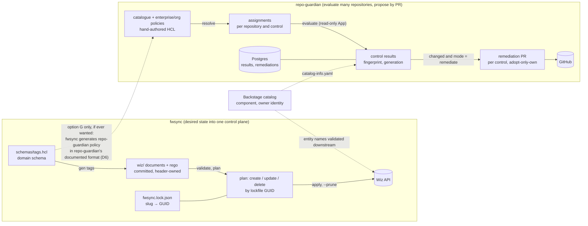
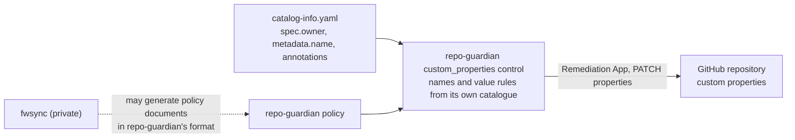

<!-- markdownlint-disable-file MD025 MD041 -->

# DESIGN-0033: fwsync as inspiration: shared HCL concepts and whether to reuse it

<!--toc:start-->
- [Overview](#overview)
- [Goals and Non-Goals](#goals-and-non-goals)
  - [Goals](#goals)
  - [Non-Goals](#non-goals)
- [Background](#background)
- [Detailed Design](#detailed-design)
  - [Two pipelines side by side](#two-pipelines-side-by-side)
  - [Concept mapping](#concept-mapping)
  - [What transfers, and where it lands](#what-transfers-and-where-it-lands)
  - [What does not transfer](#what-does-not-transfer)
  - [Reuse options evaluated](#reuse-options-evaluated)
  - [The tag schema: evaluated and rejected](#the-tag-schema-evaluated-and-rejected)
  - [Assumptions about fwsync](#assumptions-about-fwsync)
- [API / Interface Changes](#api--interface-changes)
- [Data Model](#data-model)
- [Testing Strategy](#testing-strategy)
- [Migration / Rollout Plan](#migration--rollout-plan)
- [Decisions](#decisions)
- [Adversarial Review](#adversarial-review)
  - [AR-0033-01 (high): The adopted slug grammar rejects the design's own catalogue](#ar-0033-01-high-the-adopted-slug-grammar-rejects-the-designs-own-catalogue)
  - [AR-0033-02 (high): orphan cleanup adds an undeclared and potentially destructive mechanism](#ar-0033-02-high-orphan-cleanup-adds-an-undeclared-and-potentially-destructive-mechanism)
  - [AR-0033-03 (high): A shared decoder or copied fixture is not a shared schema revision](#ar-0033-03-high-a-shared-decoder-or-copied-fixture-is-not-a-shared-schema-revision)
  - [AR-0033-04 (high): Three facts per tag are insufficient to derive safe writes](#ar-0033-04-high-three-facts-per-tag-are-insufficient-to-derive-safe-writes)
  - [AR-0033-05 (high): The casing migration needs a provider and consumer contract](#ar-0033-05-high-the-casing-migration-needs-a-provider-and-consumer-contract)
  - [AR-0033-06 (medium): In-root references need filesystem and snapshot semantics](#ar-0033-06-medium-in-root-references-need-filesystem-and-snapshot-semantics)
  - [AR-0033-07 (medium): Preview availability and exit codes have conflicting contracts](#ar-0033-07-medium-preview-availability-and-exit-codes-have-conflicting-contracts)
- [Open Questions](#open-questions)
  - [OQ1: Who owns GitHub repository custom properties?](#oq1-who-owns-github-repository-custom-properties)
  - [OQ2: How does repo-guardian read the governed tag definitions?](#oq2-how-does-repo-guardian-read-the-governed-tag-definitions)
  - [OQ3: What are the GitHub property keys called?](#oq3-what-are-the-github-property-keys-called)
  - [OQ4: Should repo-guardian publish repository compliance into Wiz?](#oq4-should-repo-guardian-publish-repository-compliance-into-wiz)
- [References](#references)
<!--toc:end-->

## Overview

[fwsync](https://github.com/donaldgifford/fwsync) is the maintainer's other HCL-schema-driven governance tool: Wiz configuration (security frameworks, cloud configuration rules, scan policies, projects) kept as HCL documents in git and diff-applied to the Wiz API, with a generator that compiles a compact domain schema into those documents. It was designed a few weeks before the controls model in DESIGN-0029 to DESIGN-0032, by the same author, against the same Backstage-centred platform, and its vocabulary — framework, subcategory, rule, policy, scope, audit-first ratchet — reads like ours.

This document does two things. It maps fwsync's concepts onto the controls model so the overlap and the real differences are explicit, and it names what transfers (seven conventions and a test kit, each landing in a specific place in DESIGN-0030 to DESIGN-0032). Then it evaluates every way repo-guardian could *use* fwsync — to manage the policy, to manage the controls, to consume its output, to feed it, or as a library — and recommends against all of them. The governed tag schema was evaluated as a possible shared seam and rejected on 2026-10-04 (D6): repo-guardian declares its own property names and value rules in its catalogue, and the only relationship the two tools may have is fwsync generating repo-guardian policy in repo-guardian's documented format.

## Goals and Non-Goals

### Goals

- A concept-by-concept mapping between fwsync's document model and the controls model, naming what each concept solves in each tool.
- A concrete list of fwsync conventions to adopt, each with the DESIGN-0030/0031/0032 section it amends.
- A decision on each reuse option: fwsync managing the policy, managing the catalogue, its output as our input, our output as its input, fwsync as a Go library.
- A recorded boundary for the one concern both tools touch, GitHub repository custom properties: repo-guardian writes them from its own control, and nothing is shared.

### Non-Goals

- Changing fwsync, or depending on it. fwsync is a private repository with its own target. If it ever generates repo-guardian policy, that is fwsync tooling emitting repo-guardian's documented format, designed in fwsync's docs.
- Re-litigating DESIGN-0029 to DESIGN-0032. This document amends them with specific conventions; it does not reopen their decisions.
- Pushing repo-guardian compliance into Wiz. Evaluated and rejected for v2 (OQ4, D7), not designed.
- Rego anywhere in repo-guardian. Controls are typed Go (DESIGN-0031 D1); fwsync's rego conventions are noted for the *shape* they share, not adopted.

## Background

fwsync (RFC-0001, DESIGN-0001, ADR-0001 to ADR-0007, IMPL-0001; all at commit `14fbbef`) exists because the cloud estate carries two ungoverned tagging conventions, and the fix was one schema as the source of truth enforced through Wiz at PR time, at Kubernetes admission and on the deployed estate. Its two layers:

- **An applier core.** HCL documents of four kinds (`framework`, `rule`, `scan_policy`, `project`; `control` designed and deferred) decoded into a typed model, validated (slug grammar, reference resolution, dead subcategories, duplicate slugs), planned against live Wiz objects fetched by GUID through a committed lockfile, and applied with staged concurrency. Pruning is lock-bounded: fwsync deletes only what it created.
- **A generator layer.** `fwsync gen tags` compiles `schemas/tags.hcl` — tags with value grammars, facets, enforcement levels, an attribute map of where tags live per native type — into the committed `wiz/` tree: documents plus rego whose only varying part is a marked data region.

Its three Draft designs extend this: DESIGN-0002 adds an IaC governance framework where "policies gate, rules detect, controls verify" under one requirement identity, and DESIGN-0003 carries the governed tags to Docker labels, Kubernetes labels and **GitHub repository custom properties** (`component`, `owner`, kebab-case), with the note that for GitHub "the Backstage scaffolder sets repo custom properties at creation; the Backstage↔Wiz sync reconciles drift for existing repos".

repo-guardian's controls model (DESIGN-0029 to DESIGN-0032) is the other side of that platform: it evaluates GitHub repositories against opinionated controls assigned by enterprise and org policies and remediates by PR. Its `custom_properties` control (DESIGN-0031) already writes `Owner` and `Component` to repositories from `catalog-info.yaml` — it is, in practice, the reconciliation fwsync's DESIGN-0003 assumes someone else performs.

## Detailed Design

### Two pipelines side by side

The shapes rhyme — schema in, validate, plan, act, record what you own — and the directions differ. fwsync owns its target: Wiz holds exactly what the documents say, and a plan is a diff of desired against observed. repo-guardian never owns a repository: evaluation observes and classifies, remediation *proposes*, and a human merges. That difference decides most of what follows.

### Concept mapping

| fwsync | repo-guardian (DESIGN-0029 to 0032) | Same idea | Different because |
| ------ | ----------------------------------- | --------- | ----------------- |
| `framework` with `category` / `subcategory` (a Wiz object; subcategories are surface-agnostic requirements) | control catalogue; a `control "name@N"` is the requirement (DESIGN-0030) | one requirement identity that every surface reports into; the rollup answers "compliant?" once | a framework is data pushed to Wiz; a control is Go behaviour registered in the binary |
| `rule` (Wiz cloud configuration rule: rego matcher, native types, `subcategories = [...]`) | control rule with a `kind` implemented in Go (DESIGN-0031) | a rule reports into exactly one requirement; "detect" is separate from "verify" | rego evaluated by Wiz over exported objects vs typed Go evaluated by us over repository content and settings |
| `scan_policy` (CI/CD gate: fail builds over a severity budget) | `mode = evaluate \| remediate` per enterprise, org, `repos` block, control (DESIGN-0030) | the gate is written separately from the check, and ratchets per tier | fwsync's gate blocks a build; ours gates whether a PR is opened |
| `project` (scope by account tags) and DESIGN-0002 `tier` facets | `enterprise.orgs`, org policy, `repos { match }` globs (DESIGN-0030) | scoping lives in policy, not in rules | fwsync scopes by facts (tag values, facets); we scope by org and repository name only (DESIGN-0030 D4) |
| domain schema → `gen` → committed documents | hand-authored catalogue; no generator | documents are data, reviewed as diffs | our catalogue is a dozen controls with no per-tier expansion; a generator earns nothing yet (D4 here) |
| `file("rego/<slug>/rule.rego")` — content is a referenced file, never inlined | templates referenced by name from the template store; rule `params` | content lives beside the document and is reviewed as a file diff | our templates are Go `text/template` programs, not data (see "What does not transfer") |
| lockfile `slug → {id, type}`, written per completed create; lock-bounded prune | `remediations` row per (repository, control) with PR number, URL, head SHA and a journal of every path and blob the bot wrote; an untracked branch adopted only by authenticated identity, never by commit author text (DESIGN-0032 AR-0032-02) | act only on what you created, recorded at the moment you created it | fwsync commits a file to git; we record in Postgres, because our "lock" changes on every evaluation |
| `plan` = diff desired vs observed by GUID; `--detailed-exitcode` 2 on changes | evaluation = observe at a pinned SHA, classify, fingerprint; `repo-guardian evaluate` JSON, with remediation preview once DESIGN-0032 D7 lands | a plan is data with reasons, rendered separately | we never "apply" a repository; the plan becomes a PR. Our exit codes keep a usage error (`2`) apart from measured non-compliance (`1`) and operational failure (`3`) (D5) |
| `gen --check` drift: `missing`, `stale`, `orphan` by generated header | `exact` file control; the template-passes-rules load check (DESIGN-0031 D2) | ownership is declared in the artifact and checked mechanically | our ownership is `Owns()` on the control (DESIGN-0031 AR-0031-02), not a header in the file; and our `orphan` is the bot's own obsolete delta on an open proposal, never a file on the default branch (D9) |
| `validate`: slug grammar, dangling reference = error, dead subcategory = warning, cross-file duplicates | policy load validation: slug grammar, explicit rule kinds, ownership collisions, unknown control refs, required reasons (DESIGN-0030) | validate the whole tree before anything acts | the grammar is ours, not fwsync's: underscores are legal, so v1's rule names survive (D8) |
| audit-first ratchet (RFC-0001 Phases 1 to 3) | evaluate is the default mode; remediate per org, then per control (DESIGN-0030 modes) | nothing enforces until the numbers have been looked at | — |
| ADR-0007 attribute map: where a tag lives per native type; rego dispatches on the value's actual shape, so a wrong entry is "path unused", never a false positive | `FileSpec.Locations` per file control, `dependency_updates` location list, `catalog_info` annotation map (DESIGN-0031) | "where the fact lives" is data; a wrong row fails safe | — |

### What transfers, and where it lands

Each item below is an amendment to a sibling design, applied in the IMPL plan, not a new mechanism.

1. **Documents are data (ADR-0002) for the catalogue and policies.** The policy decoder evaluates HCL with an empty `EvalContext`: no variables, and no function except `file()`, which returns a path and never contents. The allowed expression forms are literals and `file()` only; a syntactic check rejects anything else where a literal is required. In-root means resolved, not lexical: the loader resolves the policy root and every referenced file with `filepath.EvalSymlinks` and requires the resolved file to lie under the resolved root, which admits Kubernetes ConfigMap projection links (they resolve inside the mount) and rejects links that escape it. Referenced files are capped at 1 MiB, and a missing file is a load error. The catalogue, policies, templates and every referenced file are read in one pass at load and hashed from those bytes, so the policy version is the digest of what was actually read; there is no hot reload, as today, so a change to the mount takes effect on restart and two loads can never mix versions. *Lands in* DESIGN-0030 "Validation". Today's loader uses `hclparse` + `Content()` with a fixed schema, which already rejects unknown attributes; the addition is the empty `EvalContext`, the path function and the resolution rule.
2. **Slugs are stable identifiers, and references resolve.** Control ids and rule ids share one grammar, `^[a-z][a-z0-9]*([_-][a-z0-9]+)*$` (lower-case, no leading or trailing separator, no doubled separator), which accepts `catalog_info`, `custom_properties` and `wiz-owners` alike and keeps v1's rule names. fwsync's dash-only spelling is not adopted as a constraint: what transfers is the idea, not the regex. Go type names are identifiers, not slugs, and are never written in policy. References resolve or load fails, and a catalogue control assigned by no policy is a load **warning** (fwsync's "dead subcategory"). Rule-kind syntax is `rule "<id>" { kind = "<kind>" }`; `kind` may be omitted only when the id equals a rule kind the type declares (`rule "exists" {}`), otherwise load fails with "rule <id>: kind is required" and a source location, and DESIGN-0030's `setting` example is corrected to `equals`. Every example catalogue and policy in DESIGN-0029 to DESIGN-0032 and in `examples/` is loaded through the strict loader in a test, so the text cannot diverge from its schema again. *Lands in* DESIGN-0029 D2 and DESIGN-0030 "Validation".
3. **Plan as data with reasons.** `repo-guardian evaluate --repo org/name --format json` emits the control results from the first `evaluate` release; the payload carries a `schema_version` and the evaluated commit. When DESIGN-0032 D7 lands, the same command in remediate preview adds the `ChangeSet` with a `Reason` per change (`missing`, `rule_failed:<id>`, `orphan` — the last naming only the bot's own obsolete delta on an open proposal, item 5). Preview never writes to GitHub. Exit codes keep a bad command apart from measured drift: `0` compliant or nothing measured, `1` non-compliant (any failing control; a mixed fail-plus-error result is `1` with the errors listed in the JSON), `2` usage or configuration error, `3` operational failure (only unknown or error outcomes, or an API failure). fwsync's Terraform-style contract, where `2` is both a usage error and a diff, is not borrowed, and fwsync has no JSON mode; we add one from the start. *Lands in* DESIGN-0032 "API / Interface Changes".
4. **Lock-bounded action, stated as a principle.** repo-guardian closes, updates or deletes only PRs and branches recorded in `remediations`, and adopts an untracked branch only by authenticated identity: the open PR on it is authored by the Remediation App's bot login and its head repository is this repository, never by commit author text (DESIGN-0032 AR-0032-02). DESIGN-0032 already does both; this names the invariant so later features (API remediations, label sync) inherit it. *Lands in* DESIGN-0032 "Failure semantics" as the first row.
5. **Ownership drift with three verdicts.** The `exact` file control's evidence distinguishes `missing`, `stale` (present, differs) and — on an open, unmerged proposal only — `orphan`: a path the bot itself wrote, identified by the journal of paths and blobs it committed (DESIGN-0032 AR-0032-03), that no current change set claims any more. Orphan cleanup means exactly what v1 does today: the bot's own obsolete delta is reverted on the branch, only where the current blob is still the bot's, and never on the default branch. Withdrawing a control closes its PR with a comment (DESIGN-0032 D10) and never deletes a merged file; a merged-file retirement would need a design of its own, and none is proposed. *Lands in* DESIGN-0031 "Generic file" for the evidence and DESIGN-0032 "Failure semantics" for the cleanup rule.
6. **Schema-owned addressing with fail-safe lookup (ADR-0007).** Every "where does this fact live" list (`FileSpec.Locations`, `dependency_updates` locations, the annotation map) is data on the control definition with a conformance test that a wrong entry yields `not found`, never a false `pass`. *Lands in* DESIGN-0031 "Conformance suite".
7. **The test kit.** Golden tree (`gen.Check` over the committed tree inside `go test`), seeded-change tests (one schema edit touches exactly the expected files), one `testdata/<defect>/` directory per failure class with a table test on a diagnostic substring, a stateful fake target that records call order and injects failures, and a recorded `RoundTripper` for the external API. repo-guardian already has the golden-tree pattern in `make lint-monitoring` and the stateful fake in the checker tests; the defect-directory and seeded-change patterns are new. *Lands in* DESIGN-0030 and DESIGN-0031 "Testing Strategy".

Also worth a look during the IMPL, not a design decision: fwsync decodes through `hclkit`, which gives every declaration its own source range (`def_range`, `label_range`, `attr_value_range` tags on the model) so diagnostics point at the exact line. Our loader reports file-level errors. If `hclkit` is importable it replaces hand-rolled range plumbing.

### What does not transfer

- **Committed generation (ADR-0003) for the catalogue.** fwsync generates because one tag expands into N rules × M surfaces × tiers. Our catalogue has no such product; hand-authored documents are the whole thing. repo-guardian already uses committed generation where it earns its keep (dashboards and alerts, `make monitoring-generate` + drift gate).
- **Data-region rego and sibling byte-identity (ADR-0005, ADR-0006).** No rego here. The *shape* survives as "a control type is one Go implementation, versions differ only in catalogue data" (DESIGN-0029 D3).
- **Templates as data.** fwsync forbids logic in documents; our file templates are `text/template` programs with curated helpers and `ValidateZero`. That stays — a CODEOWNERS template genuinely needs the org and team names interpolated — but the controls model narrows where it matters: the template is rendered once, by `Remediate`, and must pass every remediable rule at load (DESIGN-0031 D2). The program is contained, not eliminated.
- **The lockfile as a git artifact.** Our ownership record changes on every evaluation and lives beside the results; committing it would be noise.
- **Facts as a scoping dimension.** fwsync's facets and `project.scope.account_tags` select by what a thing *is*. DESIGN-0030 D4 chose name globs only. Not reopened; noted because the first request for "apply this control to every repository with `type: service`" will have fwsync's facets as the obvious shape.

### Reuse options evaluated

| Option | What it would mean | Verdict | Why |
| ------ | ------------------ | ------- | --- |
| A. fwsync manages repo-guardian's **policy** | enterprise/org policies as fwsync documents, synced to repo-guardian | **No** | fwsync syncs into Wiz only: its target interfaces are typed on `wizclient` structs, its four kinds are hardcoded in plan ordering, apply switches and lock validation, and nothing is importable (everything is `internal/`). repo-guardian's policy is a mounted ConfigMap loaded at start (DESIGN-0030 D3); git plus the chart is already its delivery, and the policy-rollout workflow is its "apply" |
| B. fwsync manages the **control catalogue** | same, for `control` documents | **No** | same reasons; and a generator layer in front of the catalogue earns nothing (D4 here) |
| C. repo-guardian **consumes fwsync output** | read the committed `wiz/` tree, the lockfile or `plan` text | **No** | fwsync's outputs are Wiz rules, rego and a slug→GUID lock; none is an input repo-guardian evaluates. The *input* side, `schemas/tags.hcl`, was evaluated as a shared definition of the governed tags and rejected (next section, D6) |
| D. fwsync **consumes repo-guardian output** | repository compliance rolled into a Wiz framework so the heatmap shows repo governance next to cloud posture | **No in v2 (OQ4, D7)** | Wiz frameworks roll up Wiz *findings*; there is no external-findings input (assumption F9). If a consumer ever wants repo-guardian's posture, it reads the `/rules`, `/orgs` endpoints or the compliance snapshots; an exporter would be its own design |
| E. fwsync as a **Go library** (plan/apply engine, decoder, lockfile) | import or fork `internal/plan`, `internal/apply`, `internal/decode` | **No** | not importable, Wiz-typed, builds only with the private `wiz-go-gen` SDK and `WIZ_*` credentials, and the direction is wrong: repo-guardian never applies a repository, it proposes a PR. Patterns transfer (previous section); code does not |
| F. **Shared decode layer** (`hclkit`) | both tools decode HCL with the same range-aware kit | **IMPL question** | depends on whether `hclkit` is published; no design impact |
| G. fwsync **generates repo-guardian policy** | fwsync's generator emits enterprise or org policy, or catalogue documents, in repo-guardian's format | **Allowed, outside this design** | the dependency points one way, fwsync → repo-guardian, through the documented policy format; repo-guardian neither knows nor cares who wrote its policy. Designed in fwsync's docs if it is ever wanted |

### The tag schema: evaluated and rejected

fwsync's `schemas/tags.hcl` defines *what the platform tags things with*: `component`, `owner`, `account-class`, each with meaning, remediation text, scope and per-platform key rendering, and its DESIGN-0003 sketches rendering them as kebab-case GitHub custom properties. repo-guardian's `custom_properties` control writes `Owner` and `Component` from `catalog-info.yaml` plus any annotation mapped by `annotation_properties`. The first draft of this document treated the overlap as a shared seam and proposed one definition read by both tools (a promoted `tagschema` module, or a copied file with an agreement test).

That was rejected on 2026-10-04 (OQ1 to OQ3, D6). repo-guardian has its own policy, controls and rules; the custom-properties write is one of its API-backed controls, fed by the catalog-info control, and it is the same whether or not Wiz, fwsync or anything else ever looks at the result. fwsync is a private repository aimed at a different control plane, and tying repo-guardian's catalogue to a schema it does not own would make a private tool's revision history part of repo-guardian's policy version. The two tools are designed closely, by the same author, against the same platform, and they stay separate: the only relationship allowed is fwsync *generating* repo-guardian policy in repo-guardian's documented format, which needs nothing from this design.

What survives from the evaluation is the shape of a property definition, which AR-0033-04 showed needs five facts rather than three: a `source` (a catalog-info path such as `spec.owner`, or an annotation key), a `normalize` rule (for example stripping a Backstage entity-reference prefix such as `group:default/` to the bare name), the scope, the rendered key and a value pattern. Those become fields of repo-guardian's own `custom_properties` catalogue entries; a property without a source never enters the managed set, so adding one can never clear anything. Duplicate rendered keys, and an annotation whose target collides with a built-in key, are load errors (v1 already rejects the latter). Each property's write is gated on its own valid, normalized source value and on the org schema defining its key, independently of the control's aggregate status (DESIGN-0031 AR-0031-07), so a failing value pattern withholds the write of that one property and nothing else. What happens when the whole source is absent, malformed or a non-Component entity is DESIGN-0031's source-state policy, not restated here.

### Assumptions about fwsync

Verified against commit `14fbbef` unless marked.

| # | Assumption | If wrong |
| - | ---------- | -------- |
| F1 | Every fwsync package is under `internal/`; there is no `pkg/` and no importable API | option E gets cheaper; it stays wrong in direction |
| F2 | fwsync has no machine-readable output; `plan` and `apply` render human text only | option C gains a surface, still not one we need |
| F3 | The four document kinds are hardcoded in plan ordering, apply dispatch and lock validation; there is no kind or surface registry | options A/B remain wrong in direction even if they become possible |
| F4 | fwsync has not been applied to a live tenant (no `wiz/fwsync.lock.json` in the repo); IMPL-0001's integration suite is deferred | none for us; it bounds how much to lean on its conventions as proven |
| F5 | The `control` kind is designed (DESIGN-0002) and rejected by the decoder today | none |
| F6 | `schemas/tags.hcl` has no `platform "github"` block yet; DESIGN-0003's GitHub carrier is a sketch, and `tagschema` decodes `platform` blocks only for `k8s` | nothing, since D6: repo-guardian reads no fwsync schema |
| F7 | fwsync builds only with the private `wiz-go-gen` module (`GOPRIVATE`, PAT) | reinforces E = no |
| F8 | fwsync's decoder is `hclkit` (external); whether it is importable by repo-guardian is unknown | option F |
| F9 | *Unverified.* Wiz has no API for ingesting findings produced outside Wiz; framework rollups come only from Wiz rules and controls | if wrong, option D becomes a design of its own, not a deferral |
| F10 | DESIGN-0003's GitHub carrier depends on an open question in fwsync (can repo-scan findings bind to custom subcategories; do VCS native types expose custom properties) | if it never ships, repo-guardian is the only enforcement of repository properties, which is D6's position either way |

## API / Interface Changes

No new surface in repo-guardian from this document alone. The conventions above amend:

- `repo-guardian evaluate --repo <org>/<name> [--format json]` ships JSON output in its first release, with `schema_version` and the evaluated commit in the payload, and exits `0` compliant or nothing measured, `1` non-compliant, `2` usage or configuration error, `3` operational failure (D5). The remediation preview, the `ChangeSet` with a `Reason` per change, is added to the same command when DESIGN-0032 D7 lands, and never writes to GitHub. There is no `--detailed-exitcode` flag: the codes are the contract.
- `repo-guardian policy validate` reports slug-grammar failures (D8), a rule without a `kind` whose id is not itself a kind, unresolved references, an escaping or oversized `file()` reference (D10) and unassigned catalogue controls (warning), with exit codes `0` valid (warnings permitted), `1` invalid policy, `2` usage error — fwsync's `validate` codes, which have no diff case to conflate.
- The `custom_properties` catalogue definition declares its managed properties itself (the built-in `Owner` and `Component` plus `annotation_properties`), each with the five facts AR-0033-04 added (source, normalize, scope, key, value pattern); duplicate rendered keys and annotation targets that collide with a built-in key fail load, and each property's write is gated on its own valid source and a key the org schema defines (DESIGN-0031 AR-0031-07). There is no external schema reference (D6).

There is no ask on the fwsync side.

## Data Model

None. `custom_properties` evidence records the `source` (a catalog-info path or an annotation key) per managed name so the UI can show where a value came from, and, when a property's write is withheld, which gate withheld it (no valid source value, or a key the org schema does not define).

## Testing Strategy

- **Property definitions are table-tested.** Every managed property's five facts are exercised by a fixture per property: a catalog-info sample, the normalised value and the rendered key. The table includes a qualified and an unqualified Backstage owner (`group:default/platform` and `platform` normalise to the same bare name), a value that fails its pattern (that property's write is withheld with evidence while its siblings proceed), and an annotation mapped to a built-in key (load error). There is no external schema to agree with (D6).
- **Defect directories** for the policy loader: `testdata/bad-slug/`, `missing-kind/`, `dangling-control/`, `unassigned-control/` (warning), `expression-in-document/`, `escape-path/` (traversal, an absolute path and a symlink that resolves outside the root), `oversized-reference/` and `missing-reference/`, each asserting a diagnostic substring — fwsync's `internal/decode` and `internal/validate` layout. One positive fixture, `projected-link/`, mirrors a Kubernetes ConfigMap projection (a symlink that resolves inside the root) and must load. A mount change mid-load is covered by the no-reload rule rather than a fixture: a load reads every file once and hashes those bytes, and a change to the mount takes effect on restart (D10).
- **Examples load.** Every example catalogue and policy in DESIGN-0029 to DESIGN-0032 and in `examples/` is extracted and loaded through the strict loader; every reference resolves and every type builds, and intentionally invalid slugs and unknown rule kinds still fail with a source location (D8).
- **CLI exit codes.** `evaluate` cases for compliant, non-compliant, unknown-only, mixed fail-plus-error, invalid usage and a preview request on a release without preview: automation must read `0`, `1`, `3`, `1` (errors listed in the JSON), `2` and `2` respectively, and preview output must come from the same pinned commit the JSON reports (D5).
- **Orphan cleanup is bounded to the proposal.** Remove a file control before and after its PR merges, then edit the file by hand: withdrawal closes the open PR and preserves merged and human-owned content, and cleanup reverts only the journaled bot delta on the unmerged branch, and only where the blob is still the bot's (D9). The fixture lives with DESIGN-0032's convergence tests.
- **Seeded-change tests** on resolution: one policy edit changes exactly the expected assignments and nothing else (fwsync's `gen` seeded-change pattern applied to `resolve`).
- **Fail-safe lookup** in the conformance suite: for every file control, a fixture where the file exists at a path *not* in `Locations` yields `not found`, never a pass or a parse of the wrong file.

## Migration / Rollout Plan

1. Fold items 1 to 7 of "What transfers" into DESIGN-0030/0031/0032 as one amendment PR, then into the IMPL plan as tasks.
2. Rewrite the `custom_properties` control under DESIGN-0031 with catalogue-declared property definitions; the built-in keys stay `Owner` and `Component`, so no org schema migration is needed (OQ3, D6).
3. Option D stays outside v2 (OQ4, D7); a consumer that wants repo-guardian's posture reads its API or snapshots.

## Decisions

- **D1 No runtime or library dependency on fwsync** — nothing in repo-guardian imports, forks, shells out to or reads the output of fwsync. Its packages are `internal/`, its target is Wiz, and its direction (apply into a control plane you own) is not ours (propose by PR into repositories you do not).
- **D2 Borrow conventions, not code** — the seven items in "What transfers" are adopted as amendments to DESIGN-0030/0031/0032 and tasks in the IMPL plan; this document is their provenance.
- **D3 One definition of the governed tags** — *superseded 2026-10-04 by D6.* The first draft had repo-guardian derive its governed property names and value patterns from fwsync's tag schema; it now declares them itself.
- **D4 No generator layer in front of the catalogue** — the catalogue is hand-authored data. A `repo-guardian gen` compiling a compact schema into controls is reconsidered only if per-org or per-tier expansion appears.
- **D5 `evaluate` emits JSON from its first release, adds remediation preview when DESIGN-0032 D7 lands, and its exit codes keep a bad command apart from measured drift** — `0` compliant or nothing measured, `1` non-compliant (a mixed fail-plus-error result is `1` with the errors in the JSON), `2` usage or configuration error, `3` operational failure; the payload carries `schema_version` and the evaluated commit, and preview never writes to GitHub. fwsync's missing JSON mode and its Terraform-style `2` for both usage and diff are the two gaps in an otherwise sound CLI contract; we repeat neither (amended 2026-10-04, AR-0033-07).
- **D6 No shared code, schema or definition with fwsync** — repo-guardian declares its own custom-property names and value rules in its control catalogue; the built-in keys stay `Owner` and `Component`; it reads no fwsync artefact and fwsync reads nothing of repo-guardian's. The one permitted relationship is fwsync generating repo-guardian policy in repo-guardian's documented format, owned and designed in fwsync. The tools are designed closely and kept separate (OQ1 to OQ3, resolved 2026-10-04).
- **D7 Compliance is not published into Wiz in v2** — anything that wants repo-guardian's posture reads its API or its compliance snapshots; an exporter is a separate design if ever wanted (OQ4, resolved 2026-10-04).
- **D8 One slug grammar, ours** — control ids and rule ids match `^[a-z][a-z0-9]*([_-][a-z0-9]+)*$`; fwsync's dash-only spelling is not a constraint, so v1's rule names survive and Go type names never appear in policy. `kind` is explicit on every rule except where the id is itself a rule kind the type declares, and every example catalogue and policy in DESIGN-0029 to DESIGN-0032 and `examples/` loads through the strict loader in a test (AR-0033-01, 2026-10-04).
- **D9 `orphan` is the bot's own delta on an open proposal, never a file on the default branch** — orphan cleanup is v1's: revert the journaled, obsolete bot writes on the unmerged branch where the blob is still the bot's. Withdrawing a control closes its PR with a comment and never deletes a merged file; merged-file retirement would be a design of its own, and none is proposed (AR-0033-02, 2026-10-04).
- **D10 In-root means resolved, not lexical** — the loader resolves the policy root and every `file()` reference with `filepath.EvalSymlinks` and requires the resolved file under the resolved root, admitting ConfigMap projection links and rejecting links that escape. Literals and `file()` are the only expression forms, referenced files are capped at 1 MiB, a missing file fails load, and everything is read in one pass and hashed from the bytes read, with no hot reload (AR-0033-06, 2026-10-04).

## Adversarial Review

Reviewed 2026-10-03 as an amendment to DESIGN-0029–0032. **Disposition: changes required before adopting the shared-schema seam or the transferred conventions as contracts.** Findings are unresolved, with severity meanings defined in DESIGN-0029's Adversarial Review. This pass reviews the fwsync claims as recorded at `14fbbef`; it does not independently re-verify that external repository or the unverified Wiz assumptions F9/F10.

**Responses (2026-10-03):** 4 accepted, 2 accepted with changes, 1 deferred. Each finding below carries a **Response** giving the disposition and the concrete change. **Reconciled 2026-10-04:** the accepted changes were applied to the body and the Decisions ledger on 2026-10-04 (each finding carries an **Applied** line naming where its change landed), and three findings, AR-0033-03, AR-0033-04 and AR-0033-05, are superseded by D6. The body and the Decisions ledger are now authoritative; the findings and responses below stay as the record of the review.

### AR-0033-01 (high): The adopted slug grammar rejects the design's own catalogue

**Basis:** What transfers item 2 and the sibling catalogue examples. `^[a-z0-9]+(-[a-z0-9]+)*$` rejects `catalog_info`, `dependency_updates`, `repo_settings`, `branch_ruleset` and `custom_properties` used throughout the set as control IDs. Separately, DESIGN-0030's settings example declares kind `setting`, while DESIGN-0031 offers `equals`; `rule "exists"` omits `kind` without defining whether IDs imply kinds. A strict decoder/registry cannot accept the examples as written.

**Proposed correction:** Distinguish Go type identifiers from catalogue slugs, choose a consistent slug/reference grammar and update the examples together. Define explicit rule-kind syntax or a documented defaulting rule. Make the shipped examples executable inputs to the actual strict loader rather than illustrative text that silently diverges from its schema.

**Verification:** Extract/load every non-hypothetical example catalogue and policy with the proposed strict grammar. Resolve all references and build every type; assert that intentionally invalid slugs and unknown rule kinds still fail with source locations.

**Response:** **Accepted with changes.** The dash-only grammar is not adopted; the catalogue's names are. One grammar covers control slugs and rule ids, `^[a-z][a-z0-9]*([_-][a-z0-9]+)*$` (lower-case, no leading or trailing separator, no doubled separator), which accepts `catalog_info`, `custom_properties` and `wiz-owners` alike and keeps v1's rule names; Go type names are identifiers, not slugs, and are never written in policy. Rule-kind syntax is `rule "<id>" { kind = "<kind>" }`, and `kind` may be omitted only when the id equals a rule kind the type declares (`rule "exists" {}`); otherwise load fails with "rule <id>: kind is required" and a source location, and DESIGN-0030's `setting` example is corrected to `equals`. Every example catalogue and policy in the four documents and in `examples/` is loaded through the strict loader in a test, so the text cannot diverge from its schema again. The rejected part is item 2's dash convention as a constraint: what transfers is "slugs are stable identifiers", not fwsync's spelling. Verification: adopted.

**Applied 2026-10-04:** item 2 of "What transfers" and the `validate` row of the concept mapping carry the grammar and the rule-kind syntax, `policy validate` in API / Interface Changes reports the new failures, Testing Strategy gains `missing-kind/` and the examples-load test, and D8 records the decision.

### AR-0033-02 (high): `orphan` cleanup adds an undeclared and potentially destructive mechanism

**Basis:** What transfers item 5, DESIGN-0031's generic file control and DESIGN-0032's withdrawal lifecycle. A file no active control claims has no evaluator to report it, no ownership set authorizing its deletion and no stored per-file ownership history. DESIGN-0032 closes withdrawn PRs; it does not specify deletion of files already merged to main. Borrowing lockfile prune terminology cannot grant ownership of arbitrary repository files. Per-control PRs can still contain obsolete bot edits after a version change, but that is a different problem.

**Proposed correction:** Restrict orphan handling to removing tracked, obsolete bot deltas from an owned unmerged proposal unless a separate merged-file retirement design is accepted. Specify creation/base/content provenance and human-edit conflict behavior for any cleanup. Do not treat removing a control from policy as permission to delete its former file from main.

**Verification:** Remove a generic file control before and after its PR merges, then modify the file by hand. Withdrawal must preserve merged/human-owned content; cleanup may only remove the explicitly tracked proposal delta under its chosen ownership contract.

**Response:** **Accepted.** The transferred convention was over-stated. Orphan cleanup means exactly what v1 does today: removing the bot's own obsolete delta from an open, unmerged proposal, identified by the journal of paths and blobs the bot wrote (DESIGN-0032 AR-0032-03), and never from the default branch. Withdrawing a control closes its PR with a comment (DESIGN-0032 D10) and never deletes a merged file; a merged-file retirement would need a design of its own, and none is proposed. Item 5 is reworded so that `orphan` names the tracked proposal delta only, and the lockfile-prune analogy is dropped from it. Verification: adopted.

**Applied 2026-10-04:** item 5 of "What transfers" and the drift row of the concept mapping define `orphan` as the journaled proposal delta, item 3's `orphan` reason points at that definition, Testing Strategy gains the before-and-after-merge withdrawal case, and D9 records the decision.

### AR-0033-03 (high): A shared decoder or copied fixture is not a shared schema revision

**Basis:** D1/D3, OQ2, Data Model's “nothing stored” and the agreement test. A Go module can share decoding/rendering code while each tool reads different tag data. A test against a copied fixture stays green if fwsync changes and repo-guardian's copy never updates. An embedded-default/module upgrade or external `tag_schema` edit can change desired keys/patterns without changing any catalogue text. Without a recorded digest, historical results cannot identify which schema applied, and a fingerprint limited to `id@version`/statuses/blobs may not trigger remediation.

**Proposed correction:** Identify the canonical data artifact separately from its parser library, pin its revision/digest, include effective schema bytes/rendering semantics in control and policy revisions, and expose that provenance in results/summaries. Define update ownership and a cross-consumer compatibility check tied to the canonical revision. Clarify D1's shared-library exception if OQ2(a) is chosen.

**Verification:** Change only a tag pattern, rendered key, embedded default or decoder rendering behavior. Both tools must either agree on the new pinned revision or visibly remain on different revisions; stale fixtures must not claim agreement with current upstream data.

**Response:** **Accepted.** The canonical artifact is the tag data, not the decoder. OQ2 is settled as a copied schema file referenced by `tag_schema = file(...)`, whose bytes enter the control revision digest of DESIGN-0029 AR-0029-04, and whose digest is recorded in `policy_versions.summary` as `tag_schema_digest` together with the upstream fwsync revision it was copied from. The agreement test compares that recorded upstream revision with fwsync's current one and fails when they differ, so a stale copy cannot claim agreement; a changed pattern or rendered key changes the digest, the control revision, and therefore re-evaluates and re-remediates. The Data Model's "nothing stored" is corrected accordingly, and D1 needs no exception because nothing shared is code. Verification: adopted.

**Superseded 2026-10-04:** OQ2 is resolved as no external schema (D6); the copied file, its digest and the upstream-revision agreement test fall away with it.

**Applied 2026-10-04:** superseded by D6; nothing applied beyond what D6 and "The tag schema: evaluated and rejected" already say, and Data Model stays "None".

### AR-0033-04 (high): Three facts per tag are insufficient to derive safe writes

**Basis:** The governed-tag seam's managed-set union and `value_pattern` proposal. Knowing tag scope, GitHub key and regex does not say where a new repo-scoped tag gets its value. Adding such a tag can expand the managed set with no catalog source and accidentally clear an existing property. `spec.owner` can be a Backstage entity reference rather than a bare group slug; value grammar needs a normalization contract. A failing non-remediable `value_pattern` does not block a failing remediable `matches` rule under DESIGN-0031's fail-over-error/whole-control behavior.

**Proposed correction:** Require a source mapping and value/type/normalization contract per governed property, plus explicit missing/invalid-source behavior. Reject duplicate rendered keys and annotation targets colliding with governed names. Gate writes on valid source and org-schema compatibility per resource, regardless of aggregate status; do not derive destructive empty values from an unmapped tag.

**Verification:** Add a repo-scoped tag with no source, use qualified/unqualified Backstage owners, introduce a malformed value and map an annotation to a governed key. Preserve valid existing properties and reject ambiguous or invalid writes with specific evidence.

**Response:** **Accepted.** Three facts are not enough, and the seam is extended to five: every governed property carries a `source` (a catalog-info path such as `spec.owner`, or an annotation key) and a `normalize` rule (for example stripping a Backstage entity-reference prefix such as `group:default/` to the bare name) beside its scope, rendered key and value pattern. A tag without a source never enters the managed set, so adding one can never clear anything. Duplicate rendered keys, and an annotation whose target collides with a governed key, are load errors. Writes are gated per property on a valid, normalized source value and a property the org schema defines, independently of the control's aggregate status (DESIGN-0031 AR-0031-07), so a failing `value_pattern` blocks the write of that one property and nothing else. Verification: adopted.

**Superseded 2026-10-04:** the five facts survive as the fields of repo-guardian's own property definitions (D6); the seam they extended no longer exists.

**Applied 2026-10-04:** superseded by D6; the five facts, the two load errors and the per-property write gate are stated once in "The tag schema: evaluated and rejected" and mirrored in API / Interface Changes, Data Model and Testing Strategy.

### AR-0033-05 (high): The casing migration needs a provider and consumer contract

**Basis:** OQ3(a) and Migration step 2. “Write both until old keys are removed” assumes GitHub permits the two names to coexist with the intended case semantics and that both have compatible types and are writable. The app does not own org schema creation. Consumers such as Backstage, workflows, selectors and future Wiz rules may still depend on PascalCase. A partial dual-write can leave contradictory values, and the proposed single writer still needs to account for the existing scaffolder/sync mentioned in Background.

**Proposed correction:** Verify GitHub naming/case behavior and org-property types/defaults/allowed values before selecting migration mechanics. Assign an operator to schema creation and define canonical keys, aliases, per-key eligibility, consumer cutover and retirement criteria. Coordinate all existing writers. Keep key renaming separate from source-value normalization so either can be diagnosed and rolled back.

**Verification:** Exercise the real provider's schema behavior, an org missing one alias, incompatible property types and a consumer still using legacy names. Show convergent values, visible partial migration and a reversible consumer cutover before retiring old keys.

**Response:** **Deferred.** Migration mechanics are not chosen until the INV verifies, on a real org, whether GitHub treats property names case-insensitively, whether two names differing only in case can coexist in one schema, and whether the types and allowed values of the old and new keys match. Until then OQ3(a) is a preference, not a plan, and Migration step 2's dual-write window is conditional on that answer. What is decided now: the operator owns org schema creation (the App never creates schema, as DESIGN-0019 already requires); every existing writer, including the scaffolder and the Backstage-to-Wiz sync named in Background, is inventoried before any cutover; key renaming is a separate step from source-value normalization so each can be rolled back alone; and every consumer still reading PascalCase is listed with an owner before the old keys are retired. Verification: amended — the provider behaviour test is the INV's first task and gates the rest.

**Superseded 2026-10-04:** no casing migration: keys are catalogue-declared and the built-in defaults stay `Owner` and `Component` (OQ3, D6). The investigation into GitHub's case handling is no longer needed.

**Applied 2026-10-04:** superseded by D6; nothing applied beyond Migration step 2, which already says no org schema migration is needed.

### AR-0033-06 (medium): In-root references need filesystem and snapshot semantics

**Basis:** Documents-are-data item 1 and `tag_schema = file(...)`. Returning a cleaned relative path does not prove the eventual file read is in-root: symlinks can escape, and the mounted policy tree can change between enumerating HCL files and reading referenced schemas/templates. Kubernetes ConfigMap projections themselves use symlinks, so blindly banning all symlinks can also break the stated delivery model. An empty HCL evaluation context is not itself a literal-expression grammar; the promised syntactic validation must be precise.

**Proposed correction:** Specify approved literal/reference expression forms, path resolution and symlink handling for projected volumes, allowed artifact types and byte limits. Load catalogue, policies, templates and referenced schema from one coherent immutable snapshot and hash those actual bytes. Define startup/reload behavior when a file is missing or changes mid-load.

**Verification:** Cover traversal, absolute paths, escaping symlinks, legitimate projected ConfigMap links, nested references and a mount revision change mid-load. Accept one coherent snapshot or fail clearly; never mix versions or read unrelated filesystem contents.

**Response:** **Accepted.** In-root means resolved, not lexical. The loader resolves the policy root and each referenced file with `filepath.EvalSymlinks` and requires the resolved file to lie under the resolved root, which admits Kubernetes ConfigMap projection links (they resolve inside the mount) and rejects links that escape it. The allowed expression forms are literals and `file()` only; referenced files are capped at 1 MiB; and the catalogue, policies, templates and referenced schema are read in one pass at load and hashed from those bytes, so the policy version is the digest of what was actually read. A missing file is a load error. There is no hot reload, as today: a change to the mount takes effect on restart, so two loads can never mix versions. Item 1 and DESIGN-0030 "Validation" are amended with these rules. Verification: adopted.

**Applied 2026-10-04:** item 1 of "What transfers" carries the resolved-path rule, the two expression forms, the 1 MiB cap and the one-pass read, `policy validate` in API / Interface Changes reports escaping and oversized references, Testing Strategy's defect directories cover traversal, escaping and projected links, and D10 records the decision.

### AR-0033-07 (medium): Preview availability and exit codes have conflicting contracts

**Basis:** What transfers item 3, D5 and DESIGN-0032 D7. This document promises JSON remediation preview from the first release; DESIGN-0032 defers it to a later phase. Exit code 2 is described both as usage error and as non-compliance/diff, which makes automation unable to distinguish a bad command from measured drift. The evaluation result model has unknown/error/not-applicable outcomes, but their CLI precedence is unspecified for mixed results.

**Proposed correction:** Set one preview delivery phase and separate normal evaluation output from optional remediation preview. Specify CLI exit precedence: usage/config/operational failure versus measured non-compliance, unknown-only results and empty/not-applicable denominators. Version the JSON payload, state which snapshot it uses and ensure preview never writes GitHub state.

**Verification:** Run CLI cases for compliant, non-compliant, unknown-only, mixed fail/error, invalid usage and an unavailable preview capability. Automation must distinguish errors from drift, and preview output must match the same pinned inputs used for its reported evaluation.

**Response:** **Accepted with changes.** Delivery is aligned: JSON output ships with the first `evaluate` release, and remediation preview ships when DESIGN-0032 D7 lands; D5 is amended to say so. Exit codes are separated: `0` compliant or nothing measured, `1` non-compliant (any failing control), `2` usage or configuration error, `3` operational failure (only unknown or error outcomes, or an API failure); a mixed fail-plus-error result is `1` with the errors listed in the JSON, which carries a `schema_version` and the evaluated commit. Preview never writes to GitHub. The rejected part is the Terraform exit-code mapping as written in item 3, because it conflated a usage error with measured drift. Verification: adopted.

**Applied 2026-10-04:** item 3 of "What transfers", the `plan` row of the concept mapping and the `evaluate` bullet of API / Interface Changes carry the four exit codes, the payload fields and the preview phase, Testing Strategy gains the CLI cases, and D5 is rewritten.

## Open Questions

### OQ1: Who owns GitHub repository custom properties?

**Resolved 2026-10-04: other.** repo-guardian writes custom properties as one of its own API-backed controls, fed by the catalog-info control, with no dependency on or reference to Wiz or fwsync; what, if anything, audits them afterwards is outside this design (D6).

- (a) ✅ recommended: **repo-guardian writes, Wiz detects.** repo-guardian's `custom_properties` control is the reconciliation DESIGN-0003 assumes exists (it has the catalog file and write credentials per repository); fwsync's GitHub carrier, if it ships, is an independent audit of the same properties. Both read one tag definition (OQ2).
- (b) The Backstage↔Wiz sync writes properties; repo-guardian drops the `custom_properties` control and only evaluates presence. Loses the per-repository catalog-info read that makes the values correct.
- (c) Both write. Last writer wins and nobody can explain a value.
- other:

### OQ2: How does repo-guardian read the governed tag definitions?

**Resolved 2026-10-04: other.** It does not. Property names and value rules are declared in repo-guardian's own catalogue (D6).

- (a) ✅ recommended: **a public `tagschema` Go module** promoted out of fwsync (decode only, no Wiz dependency), imported by both tools; repo-guardian's control derives managed names and patterns from it. Until it exists, a copied fixture with an agreement test.
- (b) repo-guardian reads `schemas/tags.hcl` by path at policy load (`tag_schema = file(...)`), with its own minimal decoder. Two decoders of one grammar drift.
- (c) Duplicate the three facts per tag by hand in the catalogue, guarded only by the agreement test. Cheapest now; the test is the whole safety net.
- other:

### OQ3: What are the GitHub property keys called?

**Resolved 2026-10-04: other.** Whatever the catalogue declares; the built-in defaults stay `Owner` and `Component`, and there is no fwsync-driven migration (D6).

- (a) ✅ recommended: **kebab-case `component` / `owner`, as fwsync DESIGN-0003 renders them**, and repo-guardian migrates off `Owner` / `Component`. One rendering rule across every carrier (`platform_key_style.github = "kebab-case"`); the org property schema carries both keys for a migration window and repo-guardian writes both until the old keys are removed.
- (b) PascalCase `Component` / `Owner` everywhere on GitHub; fwsync sets `platform_key_style.github = "PascalCase"`. No repo-guardian migration; GitHub becomes the one carrier that does not follow the kebab-case convention.
- (c) Keep both tools as they are. Two keys for one fact on every repository.
- other:

### OQ4: Should repo-guardian publish repository compliance into Wiz?

**Resolved 2026-10-04: (a).** Not in v2, and not as a repo-guardian concern: a consumer reads the API or the snapshots (D7).

- (a) ✅ recommended: **not in v2.** Revisit when fwsync's DESIGN-0003 binding question is answered and if Wiz exposes an external-findings input (assumption F9). repo-guardian's `/rules`, `/orgs` endpoints and compliance snapshots are the data source either way.
- (b) Design a Wiz exporter now, assuming an ingestion path exists.
- (c) Never; Backstage is the shared hub and repository compliance surfaces there (a separate design).
- other:

## References

- fwsync at commit `14fbbef`: README; RFC-0001 Tag Governance Enforcement; DESIGN-0001 Wiz desired-state management and tag-compliance generation; DESIGN-0002 IaC governance framework; DESIGN-0003 Tag compliance extension (containers, Kubernetes, GitHub); ADR-0001 to ADR-0007; IMPL-0001; `schemas/tags.hcl`; `internal/model`, `internal/decode`, `internal/plan`, `internal/apply`, `internal/lockfile`, `internal/gen`.
- DESIGN-0029 Controls and policies (overview); DESIGN-0030 Policy model; DESIGN-0031 Control framework; DESIGN-0032 Evaluation and remediation workflows.
- DESIGN-0019 / IMPL-0017 — the current `custom_properties` reconciler (managed set `Owner`, `Component`, `annotation_properties`).
- `docs/operations/monitoring-generation.md` — repo-guardian's existing committed-generation pattern.
