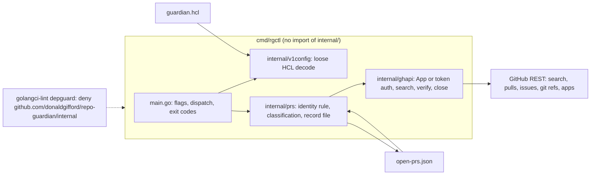
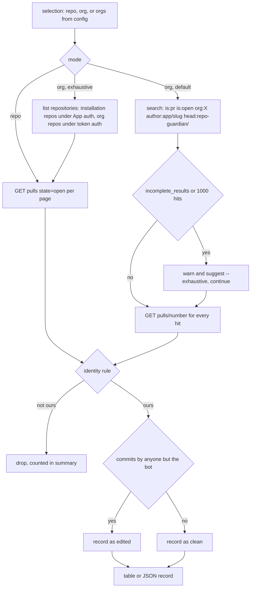
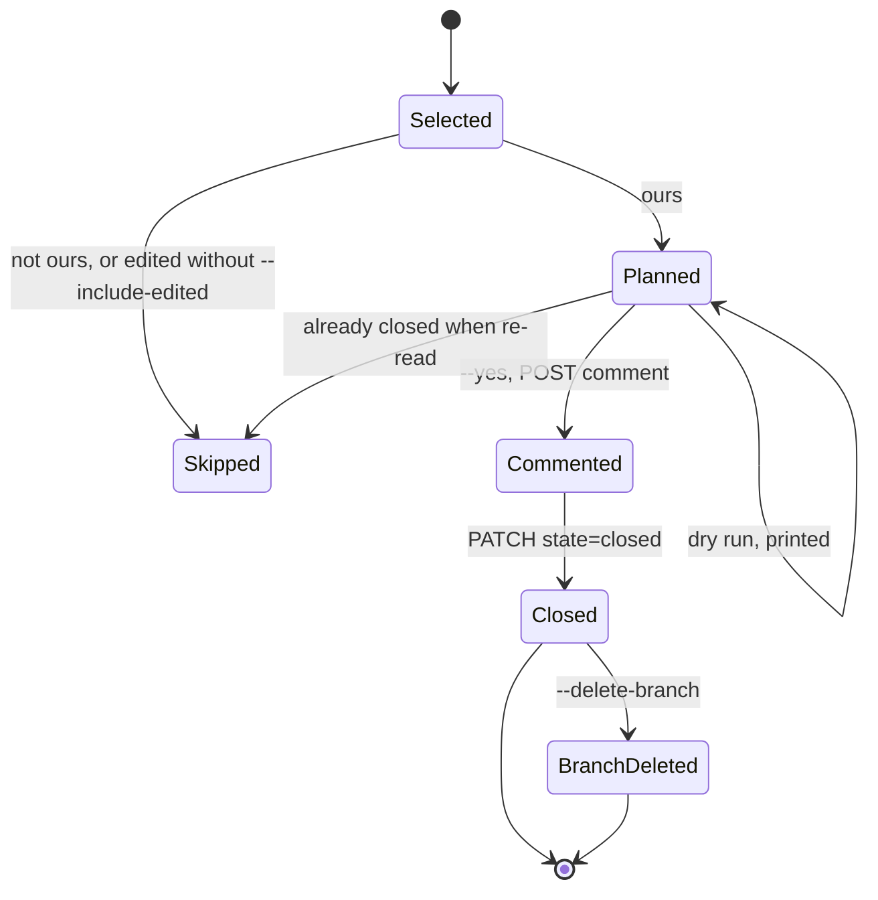

<!-- markdownlint-disable-file MD025 MD041 -->

# DESIGN-0035: rgctl: a standalone CLI to inspect v1 policy and find or close repo-guardian pull requests

<!--toc:start-->
- [Overview](#overview)
- [Goals and Non-Goals](#goals-and-non-goals)
  - [Goals](#goals)
  - [Non-Goals](#non-goals)
- [Background](#background)
- [Detailed Design](#detailed-design)
  - [Shape](#shape)
  - [Commands](#commands)
  - [Identity rule](#identity-rule)
  - [Finding PRs](#finding-prs)
  - [Closing PRs](#closing-prs)
  - [Reading a v1 policy](#reading-a-v1-policy)
  - [Output and exit codes](#output-and-exit-codes)
  - [Guarantees](#guarantees)
- [API / Interface Changes](#api--interface-changes)
- [Data Model](#data-model)
- [Testing Strategy](#testing-strategy)
- [Migration / Rollout Plan](#migration--rollout-plan)
- [Decisions](#decisions)
- [Open Questions](#open-questions)
  - [OQ1: Where does the tool live?](#oq1-where-does-the-tool-live)
  - [OQ2: What is it called?](#oq2-what-is-it-called)
  - [OQ3: Which command-line framework?](#oq3-which-command-line-framework)
  - [OQ4: How does an org scan find PRs by default?](#oq4-how-does-an-org-scan-find-prs-by-default)
  - [OQ5: What happens to a PR a human has pushed to?](#oq5-what-happens-to-a-pr-a-human-has-pushed-to)
  - [OQ6: Which credentials?](#oq6-which-credentials)
  - [OQ7: Is the branch deleted when a PR is closed?](#oq7-is-the-branch-deleted-when-a-pr-is-closed)
  - [OQ8: How much of the v1 policy does config show understand?](#oq8-how-much-of-the-v1-policy-does-config-show-understand)
  - [OQ9: How is it distributed?](#oq9-how-is-it-distributed)
  - [OQ10: What does the default pointer comment say?](#oq10-what-does-the-default-pointer-comment-say)
- [References](#references)
<!--toc:end-->

## Overview

`rgctl` is a small Go command-line tool that answers two operator questions repo-guardian itself cannot answer once it is switched off: *which pull requests did repo-guardian leave open in this org or repository*, and *what did its v1 policy file say*. It reads a v1 `guardian.hcl`, lists the orgs, rules, reconcilers and PR templates it declares, scans an org or a repository for open pull requests authored by the App on `repo-guardian/*` branches, prints them with their links, records them as JSON, and on request closes them with a pointer comment.

It lives outside the engine on purpose. Turning v1 off in an org leaves its pull requests open, and v2 does not reap them: the controls model opens one branch per control and ends the frozen-identity adoption that let v1 and v2 recognise each other's PRs (DESIGN-0032 D4, D27). The cutover runbook already needs this tool twice, to record every open repo-guardian PR before anything closes it (step 3) and to close v1's PRs with a pointer comment after the new release is up (step 6). The v1 packages that know how those PRs were made are scheduled for deletion, so the tool depends on none of them: it talks to GitHub through go-github and reads HCL through hclparse, and a lint rule keeps it that way.

## Goals and Non-Goals

### Goals

- **Inventory open repo-guardian PRs** for one repository, one org, or every org a v1 policy names, with repository, number, branch, title, age, URL and whether a human has pushed to the branch.
- **Record and close.** Write the inventory as JSON, and close exactly the recorded PRs with a pointer comment, idempotently, with a dry run as the default.
- **Show what a v1 policy says** without the v1 loader: orgs, `guardian {}` knobs, rules by kind with paths and check mode, reconcilers, PR templates.
- **Outlive v1.** No import of `internal/`, no shared build tag, no database. The binary builds at any tag of this repository and after v2 fast-forwards `main`.
- **Be safe to point at production.** Act only on PRs authored by the configured App login, never on a PR a human has pushed to unless asked, never on a branch that is not `repo-guardian/*`.

### Non-Goals

- Evaluating or remediating anything. `rgctl` never creates a PR, never commits, never edits policy.
- Reading or writing repo-guardian's database. The record is a file, not a table.
- Replacing `repo-guardian evaluate` or `policy validate`. `config show` describes a v1 file; it does not validate it against the v1 schema.
- Managing GitHub App installations, secrets or webhooks.
- Closing PRs from other tools. The author and branch rules are deliberately narrow.

## Background

**How a v1 PR is recognisable.** v1 opens PRs from an installation token, so GitHub records the author as the App's bot account, `<app slug>[bot]`. The head branch is one of three fixed names pinned by `TestPRIdentity_IsFrozen`: `repo-guardian/add-missing-files` (the engine, title `chore: add missing repo configuration files`), `repo-guardian/add-catalog-info` (`chore: add catalog-info.yaml`) and `repo-guardian/set-custom-properties` (`chore: set repository custom properties`). Titles and bodies are operator-templated since IMPL-0012, so they are not identity. The sticky reconcile-log comment carries the marker `<!-- repo-guardian:reconcile-log:v1 -->` on its first line, which is a strong confirmation but absent on PRs that never had a second reconcile. The controls model keeps the `repo-guardian/` prefix with one branch per control (`repo-guardian/<control slug>`), so the same two facts, App author plus branch prefix, identify repo-guardian PRs on both lines.

**Why v2 will not clean up after v1.** On the current `v2` line the frozen literals let the two engines adopt each other's PRs. DESIGN-0032 ends that: per-control branches, a tracked-PR model keyed by the Remediation App's own login, a fresh database at cutover with no in-place upgrade path (D27). Its runbook step 3 records every open repo-guardian PR from GitHub so a write whose record was lost is found by exact identity, and step 6 closes v1's PRs with a comment pointing at the per-control PRs, adopting any PR a human has edited instead of closing it. Both steps are this tool.

**What GitHub search can do.** The issues-and-pull-requests search accepts `is:pr is:open org:<org> author:app/<slug> head:<branch>`; `author:app/` selects an integration account, and `head:` matches branch names *beginning with* the given text, so `head:repo-guardian/` selects every repo-guardian branch in one query per org. Search is limited to 30 requests per minute, returns at most 1000 results per query in pages of 100, and may return `incomplete_results = true` on timeout. A search hit is an index entry, not the PR: before anything acts on it the tool reads the PR itself.

**Precedent in this repository.** `cmd/rg-burst` is a side binary in `cmd/` with its own build tag. `.golangci.yml` on the `v2` line uses `depguard` three times to keep packages apart (workflow code may not import the engine, the API may not import the GitHub client); `main` has no `depguard` configuration yet. `cmd/repo-guardian` parses flags with the standard library and dispatches subcommands by hand. `internal/github/client_test.go` mocks the GitHub API with `httptest.Server`.

## Detailed Design

### Shape

`cmd/rgctl/internal/...` is importable only from under `cmd/rgctl`, which is the point: the tool's own packages are private to it, and the repository's `internal/` tree is denied to it by lint. The three external dependencies, go-github v68, ghinstallation v2 and hcl v2, are already in `go.mod`.

### Commands

| Command | What it does |
| ------- | ------------ |
| `rgctl config show <guardian.hcl>` | prints the orgs in `scope`, the `guardian {}` knobs, every `rule` by kind with its paths, check mode and reconcilers, `ignore` patterns and `defaults.pr`; `--format json` for scripting |
| `rgctl prs list` | finds open repo-guardian PRs in `--repo org/name`, `--org org`, or every org of `--config guardian.hcl`; table by default, `--format json` writes the record |
| `rgctl prs close` | closes the PRs in `--from open-prs.json`, or the result of the same selection flags as `list`; dry run unless `--yes`; comment, then close, then optionally delete the branch |
| `rgctl version` | build info |

Selection flags shared by `list` and `close`:

| Flag | Meaning | Default |
| ---- | ------- | ------- |
| `--repo org/name` | one repository, listed through the Pull Requests API | |
| `--org org` | one org, through search then verification | |
| `--config path` | every org in the file's `scope { orgs }`; without a `scope` block the installations of the App, since legacy mode applies to every installed org | |
| `--branch name` | restrict to one head branch, repeatable; default is the prefix `repo-guardian/` | prefix |
| `--exhaustive` | list every repository and its open PRs instead of searching, for the final cutover pass or when search reports incomplete results | off |
| `--include-edited` | also act on PRs with commits by someone other than the App | off |
| `--format table \| json` | output | table |

Auth flags, read from flags or environment, never from positional arguments:

| Flag | Env | Meaning |
| ---- | --- | ------- |
| `--app-id` | `RGCTL_APP_ID` | the GitHub App id; with the key, installation tokens are minted per org |
| `--private-key-file` | `RGCTL_PRIVATE_KEY_FILE` | path to the App's PEM; the value is a path, the key is never a flag |
| `--token` is not a flag | `GH_TOKEN` | a personal or fine-grained token for an operator; then `--bot-login` names the App account to match |
| `--bot-login` | `RGCTL_BOT_LOGIN` | `<slug>[bot]`; discovered from `GET /app` under App auth, required under token auth |
| `--github-host` | `RGCTL_GITHUB_HOST` | GitHub Enterprise Server base URL, default `github.com` |

### Identity rule

A pull request is repo-guardian's when, read from the Pull Requests API, all of these hold:

1. it is open;
2. its author login equals the configured bot login (`<slug>[bot]`), compared case-insensitively;
3. its head branch starts with `repo-guardian/` (or equals one of the `--branch` names);
4. its head repository is the repository itself, not a fork.

The reconcile-log marker on a comment is reported when present (`reconcile_log: true`) but is not required, because a PR that was reconciled once has no comment. Title is never used. A PR is **edited** when any commit on it has an author or committer login other than the bot, or a commit whose GitHub author is unresolved and whose committer is not the bot; the tool lists commits until it finds the first such commit, so the cost is one page for a clean PR.

### Finding PRs

Search is the default for an org because it is one request per page of 100 PRs rather than one per repository, which matters at twenty-plus orgs. Every hit is then read through the Pull Requests API, so the index can only add work, never a wrong action: a stale hit for a PR that has since closed is dropped at verification. The two search limits are surfaced, not hidden: `incomplete_results` and a 1000th hit both produce a warning naming `--exhaustive`, and the summary line says how many hits were verified, dropped, clean and edited. The 30-per-minute search budget is respected by pacing search calls, and both auth modes use go-github's rate-limit handling for the core API.

`--exhaustive` lists repositories, through the installation's repository list under App auth (which is also the set v1 could see) or the org's repository list under token auth, and reads each repository's open PRs. It is the authoritative pass for the cutover and the fallback when search is incomplete.

### Closing PRs

`prs close` re-reads every PR immediately before acting, so a record from `prs list` that has gone stale is handled rather than trusted: a PR closed by a human in the meantime is reported as already closed and skipped. The order is comment, then close, then branch, so a failure leaves a PR that still explains itself. Each step is idempotent on re-run: a comment whose first line is the tool's marker `<!-- rgctl:closed-by-migration:v1 -->` is not posted twice, a closed PR is not closed again, a missing branch is not an error. The default comment names the tool and the date and says the repository is now managed by the per-control PRs of repo-guardian v2; `--comment` replaces it. The branch is deleted only with `--delete-branch`, and never for an edited PR even with `--include-edited`, because a human's commits are on it.

`--from open-prs.json` is the cutover shape: the record written by step 3 is the only input to step 6, so the close pass acts on exact identities rather than on a fresh search that might see a different set.

### Reading a v1 policy

`config show` decodes the file with `hclparse` and a body schema that names what it understands, `locals`, `guardian`, `ignore`, `scope`, `defaults` and `rule <type> <name>`, using `PartialContent` so a block or attribute it does not know is listed under *unrecognised* rather than failing. Attribute values are rendered as their source text, not evaluated: there is no evaluation context, `locals` are shown as declared, and a `file()` or interpolation is shown verbatim. The output is structured as:

| Section | Content |
| ------- | ------- |
| orgs | `scope.orgs`, or "every installed org (legacy mode)" when there is no `scope` block |
| guardian | every attribute of `guardian {}` as written, so a `dry_run = true` or `auto_close_pr = false` is visible |
| rules | one row per `rule`: type, name, enabled, paths, check mode, template, scope, ignore patterns, `when` gate, reconcilers with their types and `watch` |
| pr | `defaults.pr` and any per-rule or per-reconciler `pr` block, title and body as source text, labels |
| ignore | global patterns |
| unrecognised | anything the schema did not name, with its source location |

This is deliberately a reader, not a loader. The v1 loader's strict decode, merge order, env overrides and validation stay in `internal/policy` and are not reproduced; when they are deleted the reader keeps working because it never depended on them.

### Output and exit codes

The table is for a person; `--format json` is the record. Exit codes follow the convention the controls CLI adopts (DESIGN-0033 AR-0033-07): `0` nothing found or every planned action done, `1` open repo-guardian PRs found (`list`) or PRs skipped as edited (`close`), `2` usage or configuration error, `3` operational failure (auth, rate limit exhausted, API error). A runbook can therefore gate on `rgctl prs list --org X; test $? -eq 0`.

### Guarantees

- Nothing is written without `--yes`, and nothing is ever written by `list` or `config show`.
- No PR is touched whose author is not the configured bot login, whatever its branch.
- No PR with a human commit is touched without `--include-edited`, and its branch is never deleted.
- Every write is preceded by a fresh read of the PR.
- The tool never holds a database connection, never reads repo-guardian's own config env vars, and imports nothing under `internal/`.

## API / Interface Changes

- **New binary** `rgctl` from `cmd/rgctl`, with `cmd/rgctl/internal/{v1config,ghapi,prs}` as its private packages.
- **Lint.** `depguard` is enabled on `main` for the first time, with one rule: files under `cmd/rgctl/` may not import `github.com/donaldgifford/repo-guardian/internal`. The rule is probed once in the PR that adds it (a deliberate bad import must turn `make lint` red, then is removed), because the glob form that works on this golangci-lint version had to be found by experiment on the `v2` line.
- **Build and release.** `make build-rgctl` beside `build-core`; a second `builds:` entry in `.goreleaser.yml` (`id: rgctl`, `main: ./cmd/rgctl`, the package directory, never a file) in the same release as `repo-guardian`, same platforms, same signing.
- **CI.** The `go` paths filter already covers `cmd/**`; no new job.
- **Docs.** `docs/operations/rgctl.md` with the three commands and the cutover usage; DESIGN-0032's runbook steps 3 and 6 gain a pointer to this tool.

## Data Model

There is no database. The record file written by `prs list --format json` and read by `prs close --from` is:

| Field | Type | Meaning |
| ----- | ---- | ------- |
| `schema_version` | int | `1` |
| `generated_at` | RFC 3339 | when the list ran |
| `selection` | object | the flags that produced it: repo, org, config path, branches, exhaustive |
| `bot_login` | string | the App login matched |
| `prs[].repository` | string | `org/name` |
| `prs[].number` | int | PR number |
| `prs[].url` | string | HTML URL |
| `prs[].head_branch` | string | head ref |
| `prs[].head_sha` | string | head at listing time, compared at close time and reported if moved |
| `prs[].title` | string | as seen |
| `prs[].created_at`, `prs[].updated_at` | RFC 3339 | from the PR |
| `prs[].edited` | bool | a commit by someone other than the bot |
| `prs[].edited_by` | []string | the logins found, when edited |
| `prs[].reconcile_log` | bool | the v1 sticky comment marker was present |
| `summary` | object | hits, verified, dropped, clean, edited, incomplete |

`prs close` writes the same shape plus a `result` per PR: `planned`, `commented`, `closed`, `branch_deleted`, `already_closed`, `skipped_edited`, `skipped_not_ours`, `error` with a message.

## Testing Strategy

- **GitHub API mocks** with `httptest.Server`, the pattern of `internal/github/client_test.go`, covering: search pages and a 1000th hit, `incomplete_results`, a stale hit that verifies as closed, a hit whose author is not the bot, a fork head, a PR with a human commit on page two, close idempotency (marker comment present, PR already closed, branch already gone), and the comment-close-delete order under a failure at each step.
- **Identity rule table test** over author, branch, state and head-repository combinations, including case differences in the login.
- **Config reader goldens**: every v1 example in `examples/` and the chart's default policy decode to a golden JSON; a file with an unknown block lands it under `unrecognised` with a location; a file that does not parse exits `2` with the HCL diagnostic.
- **Exit code tests** for each of the four codes.
- **Lint probe**, once: add `import _ "github.com/donaldgifford/repo-guardian/internal/policy"` to `cmd/rgctl/main.go`, confirm `make lint` fails with the rule's message, remove it.
- **Homelab smoke** (human): `prs list --org <org>` against the homelab installation, compare with the GitHub UI, then `prs close --from` on one throwaway PR with `--yes`.

## Migration / Rollout Plan

1. Ship `rgctl` in the next v1 release from `main`, so it is available before anyone turns v1 off anywhere.
2. Use it whenever v1 is removed from an org: `prs list --org X --format json > X.json`, review, `prs close --from X.json --yes`.
3. At the v2.0.0 cutover it is runbook steps 3 and 6 (DESIGN-0032): the step-3 record is the step-6 input. Edited PRs are left for the controls engine to adopt as tracked PRs.
4. After v2 fast-forwards `main`, the tool keeps building because it never imported the deleted packages; the lint rule is what makes that true rather than lucky.

## Decisions

- **D1 Identity is author plus branch prefix** — a PR is repo-guardian's when the App's bot login authored it and its head branch starts with `repo-guardian/`; titles and bodies are operator-templated and the reconcile-log marker is absent on first-reconcile PRs, so neither can be required. The same two facts hold for v2's per-control branches, so the tool is not v1-only.
- **D2 Search finds, the Pull Requests API decides** — every search hit is re-read before it is listed and again before it is acted on; the index is a shortcut, never evidence.
- **D3 Dry run is the default and every write re-reads first** — `--yes` is required to act, and comment, close and branch deletion are each idempotent so a re-run after a partial failure is safe.
- **D4 The tool imports nothing under `internal/`** — enforced by `depguard`, probed once; this is the whole reason it can outlive v1.
- **D5 The record file is the cutover contract** — step 3 writes it, step 6 reads it, and the close pass acts on exact identities rather than on a fresh search.

## Open Questions

### OQ1: Where does the tool live?

- (a) ✅ recommended: `cmd/rgctl` in this repository, private packages under `cmd/rgctl/internal`, guarded by the `depguard` rule. One repository, one release pipeline, the dependencies already present, and the lint rule makes the "outlives v1" promise mechanical.
- (b) A separate repository (`repo-guardian-tools`). Cleaner separation, but a second goreleaser, signing and renovate setup for one small binary, and nothing stops it importing this module later.
- (c) A `prs` subcommand of `cmd/repo-guardian`. Rejected by the premise: it would be deleted with the v1 code or rewritten with the controls CLI.
- other:

### OQ2: What is it called?

- (a) ✅ recommended: `rgctl`. Short, does not collide with `rg` (ripgrep) or the user's `forge`, and reads as "repo-guardian control" beside `kubectl`.
- (b) `rg-prs`. Says what it does today, but `config show` and any later subcommand do not fit the name.
- (c) `repo-guardian-cli`. Unambiguous and long.
- other:

### OQ3: Which command-line framework?

- (a) ✅ recommended: the standard library `flag` package with hand-written subcommand dispatch, as `cmd/repo-guardian` does. Three subcommands and a dozen flags do not need a framework, and no new dependency enters `go.mod`.
- (b) `spf13/cobra`. Completion and help for free, one more dependency and a different style from the main binary.
- (c) `urfave/cli`. Same trade as (b).
- other:

### OQ4: How does an org scan find PRs by default?

- (a) ✅ recommended: search first, verify every hit through the Pull Requests API, `--exhaustive` as an opt-in that lists every repository. One request per 100 PRs instead of one per repository, with the index's two failure modes (timeout, 1000-result cap) surfaced as warnings that name the fallback.
- (b) Exhaustive by default, search never. Always correct, but one request per repository per org, which at twenty-plus orgs is thousands of calls for a handful of PRs.
- (c) Search only, no verification. Fewer calls, but a stale index hit could be acted on.
- other:

### OQ5: What happens to a PR a human has pushed to?

- (a) ✅ recommended: skipped and reported, with `--include-edited` to close it anyway and its branch never deleted. This matches DESIGN-0032's runbook, which adopts edited PRs as tracked PRs rather than closing them.
- (b) Closed like any other, with the comment. Simpler, but discards human work that v2 would otherwise pick up.
- (c) Commented but never closed, even with a flag. Safest, and leaves the operator doing the close by hand.
- other:

### OQ6: Which credentials?

- (a) ✅ recommended: both an App id plus private-key file (installation tokens per org, bot login discovered from `GET /app`, repository set equal to what v1 could see) and a `GH_TOKEN` operator token (then `--bot-login` is required). App auth is the natural cutover shape; token auth is what an operator reaches for on a laptop.
- (b) App auth only. One code path, but every use needs the key file.
- (c) Token only. Simplest, but the closing comment and the close itself are attributed to a person, and listing an org's repositories needs the token's own org access.
- other:

### OQ7: Is the branch deleted when a PR is closed?

- (a) ✅ recommended: only with `--delete-branch`, and never for an edited PR. Closing is reversible, deleting a branch is not, and GitHub keeps a closed PR's branch restorable only while the PR exists.
- (b) Always delete. Tidier, and the default most people want at cutover, but one flag away either way.
- (c) Never delete. Leaves `repo-guardian/*` branches behind in every repository.
- other:

### OQ8: How much of the v1 policy does `config show` understand?

- (a) ✅ recommended: a loose reader, the six top-level block types and the attributes of `rule` and `reconcile` blocks, with everything else listed as unrecognised and no evaluation. Enough to answer "what orgs, what rules, what mode" from any v1 file, and nothing to keep in step with the v1 schema.
- (b) A vendored copy of the v1 schema and merge rules. Exact, but a second copy of code that is being deleted.
- (c) No `config show`; orgs come from `--org` flags only. Smaller, and loses the "what did v1 say" answer the tool is partly for.
- other:

### OQ9: How is it distributed?

- (a) ✅ recommended: a second `builds:` entry in `.goreleaser.yml`, shipped, signed and attached to the same release as `repo-guardian`, plus `go install github.com/donaldgifford/repo-guardian/cmd/rgctl@<tag>`.
- (b) `go install` only. No release work, but no signed artifact and a Go toolchain required on the operator's machine.
- (c) Its own release cadence and tags. Only worth it if the tool moves to its own repository (OQ1 b).
- other:

### OQ10: What does the default pointer comment say?

- (a) ✅ recommended: a fixed text naming the tool, the date and that the repository is now managed by repo-guardian v2's per-control PRs, overridable with `--comment`, always preceded by the tool's marker line so a re-run never posts twice.
- (b) `--comment` required, no default. Forces the operator to write something accurate, and makes the cutover command longer.
- (c) No comment, just close. Leaves readers of the closed PR with no explanation.
- other:

## References

- DESIGN-0032 Evaluation and remediation workflows: cutover runbook (steps 3 and 6), D4, D26, D27.
- DESIGN-0029 D8 and D11: cutover is a reset on a fresh database.
- DESIGN-0033 AR-0033-07: evaluate CLI exit codes, reused here.
- `internal/checker/engine.go` (`BranchName`, `PRTitle`), `internal/reconciler/custom_properties.go` (`PropertiesBranchName`, `CatalogInfoBranchName`), `internal/checker/drift.go` (`reconcileLogMarker`), `TestPRIdentity_IsFrozen`.
- GitHub docs: searching issues and pull requests (`author:app/`, `head:` prefix match); REST search (30 requests per minute, 1000 results per query, `incomplete_results`).
- `.golangci.yml` on the `v2` line: the three existing `depguard` rules; CLAUDE.md note that `**/internal/workflows/*.go` was the glob form that matched.
- `cmd/rg-burst`: precedent for a side binary under `cmd/`.
