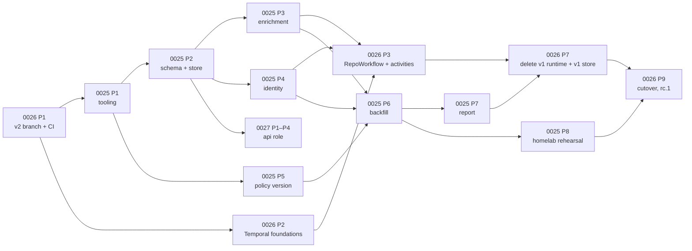

<!-- markdownlint-disable-file MD025 MD041 -->

# IMPL 0025: v2 findings model and v1 data migration

**Status:** Draft
**Author:** Donald Gifford
**Date:** 2026-09-25

<!--toc:start-->
- [Objective](#objective)
- [Scope](#scope)
  - [In Scope](#in-scope)
  - [Out of Scope](#out-of-scope)
- [Execution order across IMPL-0025/0026/0027](#execution-order-across-impl-002500260027)
- [Pre-implementation audit (2026-09-25)](#pre-implementation-audit-2026-09-25)
- [Implementation Phases](#implementation-phases)
  - [Phase 1: Tooling — goose, sqlc, the migrate subcommand, adoption](#phase-1-tooling--goose-sqlc-the-migrate-subcommand-adoption)
    - [Tasks](#tasks)
    - [Success Criteria](#success-criteria)
  - [Phase 2: Schema and the v2 store](#phase-2-schema-and-the-v2-store)
    - [Tasks](#tasks-1)
    - [Success Criteria](#success-criteria-1)
  - [Phase 3: Engine outcome enrichment and the parity suite](#phase-3-engine-outcome-enrichment-and-the-parity-suite)
    - [Tasks](#tasks-2)
    - [Success Criteria](#success-criteria-2)
  - [Phase 4: Identity — repository IDs, matching, cross-kind names](#phase-4-identity--repository-ids-matching-cross-kind-names)
    - [Tasks](#tasks-3)
    - [Success Criteria](#success-criteria-3)
  - [Phase 5: Policy version v2](#phase-5-policy-version-v2)
    - [Tasks](#tasks-4)
    - [Success Criteria](#success-criteria-4)
  - [Phase 6: v1 backfill, dry run, rollback test](#phase-6-v1-backfill-dry-run-rollback-test)
    - [Tasks](#tasks-5)
    - [Success Criteria](#success-criteria-5)
  - [Phase 7: Report on findings](#phase-7-report-on-findings)
    - [Tasks](#tasks-6)
    - [Success Criteria](#success-criteria-6)
  - [Phase 8: Homelab rehearsal and docs](#phase-8-homelab-rehearsal-and-docs)
    - [Tasks](#tasks-7)
    - [Success Criteria](#success-criteria-7)
- [File Changes](#file-changes)
- [Testing Plan](#testing-plan)
- [Dependencies](#dependencies)
- [Open Questions](#open-questions)
- [References](#references)
<!--toc:end-->

## Objective

Build DESIGN-0025 on the `v2` branch:

- the three-facet findings model (status × reason × remediation, with
  typed evidence);
- the v2 schema with goose migrations and sqlc queries;
- the `Writer`/`Reader` store split with an idempotent `RecordCheck`;
- engine outcome enrichment that is **provably** action-neutral;
- a v1 → v2 data migration that lets v2 swap in for a live v1 and
  resume against the same repositories with the same policy.

**Implements:** DESIGN-0025 (from INV-0018, INV-0019)

## Scope

### In Scope

- goose v3 (Provider API, embedded, pgx stdlib, session locker) and
  the `repo-guardian migrate` subcommand, including `--dry-run` and
  `--freshness`.
- The v2 schema: `installations`, `repositories`, `findings`,
  `finding_events`, `checks`, `repository_events`, `policy_versions`,
  `service_runs` and `compliance_snapshots`, plus indexes and grants.
- sqlc (`pgx/v5`) with `make generate-sql` and a CI drift gate.
- `store.Writer` / `store.Reader` and their Postgres implementation,
  mocks, and property tests for `RecordCheck`.
- `checker.RuleOutcome` facets and evidence at every site, with
  `Actionable()` as a derived method and a parity suite.
- `ghclient.Repository.ID`, the identity matching order, and the
  cross-kind duplicate-name warning.
- `policy.VersionV2` over an explicit, json-tagged input struct, with a
  golden test and a field-classification test.
- `00003_backfill_v1`, the recent-write guard, migration tests and the
  rollback test.
- `repo-guardian report` on findings (sqlc, reason column).
- The chart's migrate hook Job template. Chart 2.0.0 as a whole
  belongs to IMPL-0026.

### Out of Scope

- Wiring `RecordCheck` into a runtime. The v1 worker keeps its v1
  write-back on the branch until IMPL-0026 replaces it with the
  `RecordCheck` activity (see OQ1).
- Deleting the v1 store, `rule_state` write-back and the posture
  exporter. That happens in IMPL-0026 Phase 7, together with the code
  that calls them.
- API read queries (`api_*.sql`), which belong to IMPL-0027.
- The v2.1 migration that drops the v1 tables (DESIGN-0025 OQ6).
- The operator cutover runbook (`docs/operations/v2-migration.md`),
  which IMPL-0026 owns. This IMPL supplies its data-migration section.

## Execution order across IMPL-0025/0026/0027

The three plans share one branch and depend on each other. This order
keeps `v2` building and green after every merge.

## Pre-implementation audit (2026-09-25)

Code at `main` @ `5d9c440`. The audit confirmed most of DESIGN-0025's
assumptions, and found these deltas:

- **`findOurPR` runs after evaluation, not before.** The design says
  the open PR is found first. In fact `findActionableRules` runs at
  `engine_policy.go:42` and `findOurPR` at `:47`. The `pr_open`
  remediation is therefore annotated **after** `findOurPR` returns, on
  the already-built outcomes (task 3.7). Evaluation is not reordered,
  because reordering is exactly the kind of change the parity suite
  exists to forbid.
- **No action path reads `RuleOutcome.Actionable`.** The only
  production reader is `worker.go:561` (the write-back copy). Actions
  are driven by the `actionable []policy.FileRuleConfig` slice
  (`engine_policy.go:289-355`) and by local bools in the setting and
  branch-protection evaluators. The field is converted to a method
  without touching any action path, which lowers the risk of Phase 3.
- **Only three append sites exist:** `engine_policy.go:347`,
  `engine_settings.go:60` and `engine_branch_protection.go:60`.
- **Skip branches with no outcome today:**
  - file rules, `engine_policy.go`: disabled `297-299`, scope
    `303-308`, ignore `310-315`, gate `322-328`;
  - setting rules, `engine_settings.go`: disabled `35-37`, scope
    `41-46`, ignore `48-53`;
  - branch protection, `engine_branch_protection.go`: the same lines;
  - repo level: empty repository (`engine.go:144`), global ignore
    (`engine.go:152`), policy out of scope (`engine_policy.go:29`).
- **Two pieces of evidence need small API additions:**
  - `IgnoreConfig.Matches` returns only a bool, so the
    `ignored_*` `{pattern}` evidence needs a `MatchPattern` that also
    returns the matched glob (task 3.3).
  - `gateResult{open, reason}` (`gate.go:25-28`) drops the referee
    error at `gate.go:135-138`, so `gate_error` `{referee, error}` needs
    an `err` field on the memoized result (task 3.4).
- **Foreign-PR short-circuit** (`engine_policy.go:385-393`) returns
  before `findExistingFile`, so the "reason the file would otherwise
  have had" is not computed today. Computing it would add GitHub calls,
  which DESIGN-0025 OQ9 forbids. Task 3.6 records a dedicated reason,
  `foreign_pr_open`, with the rule's check mode in evidence (OQ3).
- **`ghclient.Repository` has no ID**, but both constructors have one
  to hand and drop it: `r.GetID()` at `client.go:184-196` and
  `repo.GetID()` at `client.go:378-391`. About 90 test literals use
  keyed fields, so adding `ID` breaks nothing.
- **Store consumers of v1 methods** are the webhook handler, sweep,
  posture, snapshot, discoverer, worker and `main.go`. Test fakes
  implement or embed `store.Store` in six places (sweep, snapshot,
  posture, posture-integration, discoverer, worker). Replacing the
  interface in place would break all of them before IMPL-0026 has
  replacements. Hence OQ1: the v2 interfaces live alongside v1's until
  IMPL-0026 Phase 7.
- **golang-migrate runs at every pod start** (`main.go:510-518`), and
  `postgres.New` does no schema-version check. On the branch, v1's
  startup migrate keeps running until IMPL-0026 deletes the v1 runtime.
  It is harmless, because it only ever reaches version 3 and goose owns
  a different version table.
- **Four copies of the Postgres testcontainer helper** exist:
  `store/postgres/postgres_integration_test.go:35`,
  `checker/posture_integration_test.go:44`,
  `checker/multireplica_integration_test.go:33` and
  `worker/worker_integration_test.go:39`. Phase 2 adds a shared
  `internal/store/postgres/pgtest` helper instead of a fifth copy.
- **`make test-integration` does not run in CI** (it is not in
  `ci.yml`). Migration and `RecordCheck` correctness are integration
  tests by nature, so Phase 1 adds a CI job (OQ2).
- **`policy.Version`** hashes `json.Marshal(PolicyConfig)`, and
  `types.go` has **zero** json tags. `ParsedScheduleInterval` has
  `hcl:"-"` but is still marshalled. `version_test.go` has eight tests
  and no golden test.
- **There is no cross-kind duplicate check.** Per-kind checks live at
  `validate.go:356-362`, `:417-423` and `:429-447`. The cross-kind
  warning goes next to `warnLegacyPerRuleScope` (`loader.go:98`, emits
  at `:138`), which is the existing load-time warn pattern.
- **Report path:**
  - `internal/report` keys snapshots by `(org, rule)` with no kind
    (`model.go:156-159`);
  - `CompliantPercent` is `(Tracked - Actionable) / Tracked`
    (`model.go:86-94`);
  - there are 11 golden files under `internal/report/testdata/`.
- **Tooling gaps:** no goose, sqlc or oapi-codegen in go.mod, and no
  sqlc in `mise.toml`. go.mod is `go 1.26.6`, with pgx v5.9.2 and
  testcontainers v0.42.0.

## Implementation Phases

Each phase builds on the previous one. A phase is complete when all
its tasks are checked off and its success criteria are met. Every task
leaves `make lint && make test` green on `v2`.

---

### Phase 1: Tooling — goose, sqlc, the migrate subcommand, adoption

Establishes the migration runner, code generation and CI gates, with
an adoption migration that recognizes a v1 database. No v2 tables yet.

#### Tasks

- [ ] 1.1 Add `github.com/pressly/goose/v3` and use `pgx/v5/stdlib`
  (already transitively available through pgx). Pin `sqlc` in
  `mise.toml`.
- [ ] 1.2 Create `internal/store/postgres/migrations_v2/` (embedded;
  kept apart from v1's `migrations/` so golang-migrate never sees goose
  files). Add `internal/store/postgres/goose.go`:
  - `NewMigrator(db *sql.DB) (*goose.Provider, error)`, using
    `goose.NewProvider(goose.DialectPostgres, db, fsys,
    goose.WithSessionLocker(lock.NewPostgresSessionLocker()))`;
  - version table `goose_db_version`.
- [ ] 1.3 `00001_adopt_v1` as a Go migration, following the
  DESIGN-0025 flowchart:
  - `schema_migrations` absent: fresh install, no-op;
  - present at `version = 3 AND NOT dirty`: record adoption in a
    `v2_meta(key, value)` row `adopted_v1_at`;
  - present at any other version, or dirty: return an error naming
    "upgrade to the last v1.x first, or resolve the dirty migration".
- [ ] 1.4 `repo-guardian migrate` subcommand:
  - add `cmdMigrate` to `dispatch` (`main.go:78-97`) and to the usage
    text (`:111-122`); new file `cmd/repo-guardian/migrate.go`;
  - flags `--dsn` (default `STORE_DSN`), `--dry-run` and `--freshness`
    (default `RECONCILE_FRESHNESS`, else `24h`);
  - output: applied versions and row counts, in human-readable and
    `--json` form.
- [ ] 1.5 Recent-write guard. Before applying anything when
  `repo_state` exists, `SELECT max(last_checked_at) > now() - interval
  '60 seconds'` must be false. Otherwise fail with "v1 appears to be
  running; scale it to zero first". `--force-running` exists for tests
  only and is hidden from usage.
- [ ] 1.6 sqlc config `sqlc.yaml`:
  - `engine: postgresql`, `schema: internal/store/postgres/migrations_v2`;
  - `queries: internal/store/postgres/queries`;
  - `gen.go.package: sqlcdb`, `out: internal/store/postgres/sqlcdb`,
    `sql_package: pgx/v5`, `emit_json_tags: false`;
  - `overrides` for `jsonb` → `json.RawMessage` and `timestamptz` →
    `time.Time`.
- [ ] 1.7 Make targets:
  - `generate-sql` (runs `sqlc generate`);
  - `lint-sql` (`sqlc vet`, plus the drift gate: generate into
    `build/sqlc`, then `diff -r -u` against `sqlcdb`, the same shape as
    `lint-monitoring`).
- [ ] 1.8 CI on `v2` (`ci.yml`):
  - an `sql` paths-filter output (`internal/store/**`, `sqlc.yaml`)
    that gates a `lint-sql` job;
  - a `test-integration` job running `make test-integration` on
    `go || sql`, with the Docker service available on the runner
    (OQ2).
- [ ] 1.9 Shared test helper `internal/store/postgres/pgtest`:
  - `Start(t) (dsn string)` with the image pinned to the chart's baked
    Postgres image;
  - `SeedV1(t, dsn)`, which runs v1's golang-migrate migrations to
    version 3 from the existing embed (the "vendored fixture" is the v1
    migrations directory itself, which stays until the v2.1 drop).
- [ ] 1.10 Migration tests (integration):
  - fresh database → adoption no-op, version 1;
  - v1 at version 3 → adopted;
  - v1 at version 2 → refuses;
  - dirty v1 → refuses;
  - a second run is a no-op;
  - the recent-write guard refuses when a row was written in the last
    60s.

#### Success Criteria

- `repo-guardian migrate` against a fresh database and against a seeded
  v1 database both exit 0; version 2 and dirty v1 databases exit
  non-zero with the documented message.
- `make lint-sql` passes, and fails after a hand edit to a generated
  file. Prove this once, then revert.
- The `test-integration` CI job runs on a `v2` PR and is green.

---

### Phase 2: Schema and the v2 store

Creates the v2 tables and the new store interfaces with an idempotent
`RecordCheck`. The runtime keeps using the v1 `store.Store` (OQ1).

#### Tasks

- [ ] 2.1 `00002_v2_schema.sql`:
  - every table, index and CHECK constraint from DESIGN-0025 § Data
    model;
  - `repository_events(kind CHECK IN ('discovered','renamed',
    'transferred','parked','unparked','removed'))`;
  - `policy_versions(summary JSONB NOT NULL DEFAULT '{}')`;
  - `service_runs(kind CHECK IN ('discovery','snapshot',
    'policy_rollout','bootstrap'))`;
  - `repositories_org` on `lower(org) WHERE active`;
  - `checks.outcome` CHECK including `pending`;
  - a partial unique index on `checks(check_key)`;
  - `-- +goose Down` drops the v2 tables only.
- [ ] 2.2 Grants, in the same migration, through a `DO $$` block:
  - the migrating role owns the tables;
  - if a role named by the `app_role` setting exists (default: the
    current user), grant `SELECT, INSERT, UPDATE, DELETE`, except
    `finding_events`, which gets `SELECT, INSERT` only;
  - if `repoguardian_ro` exists, grant `SELECT` and set
    `ALTER DEFAULT PRIVILEGES`; otherwise `RAISE NOTICE`;
  - never `CREATE ROLE` (DESIGN-0025 OQ12).

  Integration tests cover both "role present" and "role absent".
- [ ] 2.3 Domain types in `internal/store/findings.go`:
  - `Status`, `Reason`, `Remediation` and `ParkReason` string types
    with the DESIGN-0025 enumerations;
  - `Finding`, `FindingTransition`, `CheckRecord` (`CheckKey`,
    `RepositoryID`, `Trigger`, `PolicyVersion`, `StartedAt`,
    `FinishedAt`, `Outcomes`, `CatalogParseOK`, `Rate`, `Observed`
    repository fields for ID/name updates), `CheckErrorRecord`,
    `CheckApplied{Transitions, AlreadyFinal bool}`,
    `DiscoveredRepo`, `UpsertResult{ID, Created, Reactivated,
    Renamed}`, `Installation`, `RateSnapshot`, `PolicySummary` and
    `ServiceRun`.
  - Evidence is marshalled from `checker.Evidence` values, so the store
    package does not import checker. The type lives in a leaf package,
    `internal/findings` (OQ4).
- [ ] 2.4 `internal/store/v2.go`: the `Writer` and `Reader` interfaces
  exactly as DESIGN-0025 § Store interface, plus the one method the
  design implies but does not list: `StageCheck(ctx, CheckRecord)`,
  which writes the `pending` row with `pending_result` for the
  DESIGN-0026 OQ17 handoff. `RecordCheck` accepts either a staged key
  (read `pending_result` back) or inline outcomes.
- [ ] 2.5 Queries in `internal/store/postgres/queries/`:
  - `repositories.sql`, `installations.sql`, `findings.sql`,
    `checks.sql`, `events.sql`, `policy.sql`, `service_runs.sql`,
    `snapshots.sql`;
  - `make generate-sql`, and commit `sqlcdb/`.
- [ ] 2.6 `internal/store/postgres/v2store.go`: the `V2Store` type
  wrapping `*sqlcdb.Queries` and the pool, which owns transactions.
  Implement `RecordCheck` as the DESIGN-0025 flowchart:
  - read `checks` by key, and return the stored transitions if the row
    is final;
  - `BEGIN`, then `SELECT … FOR UPDATE` the findings;
  - diff in Go (OQ5): "change" means a different status, reason or
    remediation;
  - finalize the checks row, upsert the findings (`status_since` moves
    only when status changes), insert events for created, changed and
    removed findings, and delete the findings not in the outcomes;
  - update `repositories` and the `installations` rate snapshot, where
    the newest `rate_observed_at` wins;
  - `COMMIT`.

  Stored transitions for the already-final path come from
  `finding_events WHERE check_id = $1`.
- [ ] 2.7 `RecordCheckError`, `Park(repoID, reason, clearFindings)`
  (writing a `repository_events` `parked` row, and deleting findings
  with `to_status = NULL` events when `clearFindings`),
  `UpsertDiscovered` (a stub matching by name only; Phase 4 completes
  the identity rules), `UpsertInstallation`,
  `MarkInstallationRemoved`, `RecordPolicyVersion`,
  `CompletePolicyRollout`, `RecordServiceRun`,
  `InsertComplianceSnapshot` (per-status counts, idempotent on
  `(org, kind, rule, at)`), `PruneChecks`, `GetRepository` and
  `ListActiveRepositories` (keyset on `id`).
- [ ] 2.8 Schema-version check: `postgres.RequireSchema(ctx, pool,
  minVersion)` reads `goose_db_version`. It is used by IMPL-0026's
  roles for readiness, and exported now so tests can pin it.
- [ ] 2.9 Mocks: add `Writer` and `Reader` entries to `.mockery.yaml`
  (the `internal/store` package; filenames `writer_mock.go` and
  `reader_mock.go`), then run `make mocks`.
- [ ] 2.10 `RecordCheck` property tests (integration, `pgtest`):
  - the same `check_key` twice → one set of events, and the second
    call returns `AlreadyFinal=true` with identical transitions;
  - identical outcomes under two keys → no events, and
    `last_evaluated_at` advances;
  - a rule removed → a removal event and the row deleted;
  - a status change → `status_since` moves;
  - an evidence-only change → the row is updated with no event, and
    `status_since` does not move;
  - a staged key → the payload is read, then NULLed on commit;
  - an older rate observation does not overwrite a newer one.
- [ ] 2.11 Nil/clear contract tests:
  - `RecordCheckError` never touches findings;
  - `Park(access_denied, false)` keeps findings;
  - `Park(archived, true)` deletes them and writes removal events;
  - `finding_events` rejects `UPDATE` and `DELETE` under the
    application role (grant test).

#### Success Criteria

- `goose up` on a fresh database and on an adopted v1 database both
  produce the v2 schema. `goose down` to version 1 drops only v2
  objects, and v1 tables are byte-identical before and after (compared
  with `pg_dump --schema-only -t 'repo_state|rule_state|…'`).
- Every property test in 2.10 and 2.11 passes under `-race`.
- `make lint-sql` and `make mocks` leave no diff.

---

### Phase 3: Engine outcome enrichment and the parity suite

Widens `RuleOutcome` and records a finding for every enabled rule
without changing a single GitHub write.

#### Tasks

- [ ] 3.1 Capture parity goldens **before** changing the engine (OQ6):
  - add a recording decorator `recordingClient` in
    `internal/checker/parity_test.go` that wraps the existing fake and
    logs every write-method call (`CreateBranch`, `CreateOrUpdateFile`,
    `DeleteFile`, `CreatePullRequest`, `UpdatePullRequest`,
    `ClosePullRequest`, `UpsertPRComment`, `AddLabelsToPR`,
    `DeleteBranch`, `UpdateRepoSettings`, ruleset create/update,
    custom-property writes) with normalized arguments;
  - run every scenario in `engine_test.go`, `engine_policy_test.go`,
    `convergence_test.go`, `drift_test.go`, `gate_test.go` and
    `scope_test.go` through it;
  - commit the logs as `testdata/parity/<test>.golden.json`, generated
    with `-update-parity` against the unmodified engine.
- [ ] 3.2 `internal/findings`, a leaf package:
  - `Status`, `Reason`, `Remediation`;
  - an `Evidence` interface with `Version() int` and one struct per
    reason (json-tagged, DESIGN-0025 evidence table);
  - `PREvidence{Number, URL, CreatedAt}`,
    `ForeignPREvidence{Number, URL, Head, MatchedTerm}`, and
    `RemediationEvidence`;
  - `Clip(string, 1024)`, which reuses `store.Truncate`'s rune-aware
    logic (moved here; `store.Truncate` becomes a thin wrapper until
    IMPL-0026 deletes the worker).
- [ ] 3.3 `policy.IgnoreConfig.MatchPattern(owner, repo) (string,
  bool)`. `Matches` delegates to it. Unit tests cover the first-match
  ordering.
- [ ] 3.4 Change `gate.go`'s `gateResult` to `{open bool; reason
  string; err error}` and store `err` at `:135-138`. `gateOpen` keeps
  its signature. Add `gateStatus` → `gateDetail(referee)
  (reason string, err error)` for the outcome site.
- [ ] 3.5 Widen `checker.RuleOutcome` in `result.go:40-44` to
  `{RuleName, Kind, Status, Reason, Remediation, Evidence}` and add
  `func (o RuleOutcome) Actionable() bool`. The latter returns true iff
  `Status == non_compliant && Remediation ∉ {foreign_pr}`, which
  reproduces v1 exactly:
  - v1 recorded a foreign PR as non-actionable;
  - remediated settings as non-actionable;
  - dry-run settings as actionable.

  Replace `(*CheckResult).add` with `record(RuleOutcome)`. Update
  `worker.go:561` to call `o.Actionable()`.
- [ ] 3.6 File rules, `engine_policy.go`:
  - `evaluateRule` returns `(bool, outcomeDetail)`, where
    `outcomeDetail` carries the reason and evidence from
    `evaluateAbsent`, `evaluateExists`, `evaluateContains`,
    `evaluateExact` and `compareContent`;
  - the foreign-PR branch at `385-393` sets remediation `foreign_pr`
    with `ForeignPREvidence` and reason `foreign_pr_open` (OQ3);
  - add `not_applicable` outcomes at scope `303-308`, ignore `310-315`
    and gate `322-328` (`gate_closed`, or `unknown`/`gate_error` when
    the referee errored);
  - metric increments stay in place and stay primary-pass-only;
  - `reconcilerRuleApplies` (`210-235`) appends nothing, and a test
    asserts it.
- [ ] 3.7 Annotate `pr_open` after `findOurPR` (`engine_policy.go:47`).
  When our PR exists, every file outcome with `Actionable()` becomes
  `remediation = pr_open` with `PREvidence` from the
  `ghclient.PullRequest` in hand. When `DryRun`, actionable file
  outcomes become `dry_run` (`would: open_pr`). This is a pure data
  pass over `result.Outcomes`, placed after the action decision.
- [ ] 3.8 Setting rules, `engine_settings.go`:
  - scope, ignore → `not_applicable`;
  - mismatch → `setting_mismatch` `{property, expected, actual}`;
  - `!Remediate` → remediation `disabled`;
  - dry-run → `dry_run` (`would: apply`);
  - applied → `compliant`, remediation `applied` with `{at}`. v1
    recorded remediated as not actionable, so it is compliant after
    remediation.
- [ ] 3.9 Branch protection, `engine_branch_protection.go`:
  - scope, ignore → `not_applicable`;
  - branch missing `95-98` → `not_applicable`/`branch_missing`;
  - `existing == nil` → `ruleset_missing`;
  - mismatches → `ruleset_mismatch` `{branch, ruleset_id,
    mismatches}`;
  - remediation facets as for settings.
- [ ] 3.10 Repo-level not-applicable:
  - empty repository (`engine.go:144`), global ignore (`:152`) and
    policy out of scope (`engine_policy.go:29`) return one
    `not_applicable` outcome per **enabled** rule of each kind, with
    reasons `empty_repository`, `ignored_global` `{pattern}` and
    `out_of_scope_policy`;
  - add a helper `notApplicableForAll(policy, reason, evidence)`;
  - archived/fork still returns `nil, &SkippedError` (unchanged).
- [ ] 3.11 Update tests that pinned the v1 "no outcome" rule:
  - `result_test.go:196` (`_IgnoredRuleProducesNoOutcome`) becomes
    `_IgnoredRuleIsNotApplicable`;
  - `:232` (`_SkipPathsReturnEmptyNotNil`) becomes
    `_SkipPathsReturnNotApplicable`;
  - `engine_test.go:671-672` (empty repo → zero outcomes) becomes one
    `not_applicable` per enabled rule;
  - `writeback_test.go` keeps working through the `Actionable()`
    method.
- [ ] 3.12 Parity suite, `parity_test.go`:
  - re-run 3.1's scenarios on the enriched engine;
  - assert the recorded write calls equal the goldens byte for byte;
  - assert, for every outcome, that `Actionable()` equals the v1
    boolean in the golden, which records `(kind, name, actionable)`
    per scenario.

  Verify non-vacuously: flip one `Actionable()` clause, watch the suite
  fail, then restore.
- [ ] 3.13 Outcome golden tests: one scenario per reason code and per
  remediation value in `outcomes_test.go`, asserting status, reason,
  remediation and marshalled evidence JSON.

#### Success Criteria

- The parity suite is green, and was proven to fail on a deliberate
  `Actionable()` change.
- Every row of DESIGN-0025's reason table and remediation table has a
  passing golden scenario.
- `grep -n 'result.add(' internal/checker` returns nothing: every
  append goes through `record`.
- No new `github.Client` method is called anywhere in the diff (review
  `git diff` for `client.` call sites). This is DESIGN-0025 OQ9.

---

### Phase 4: Identity — repository IDs, matching, cross-kind names

#### Tasks

- [ ] 4.1 Add `ID int64` to `ghclient.Repository` (`github.go:42-49`).
  Set it in `GetRepository` (`client.go:189-196`, `r.GetID()`) and in
  `ListInstallationRepos` (`client.go:384-391`, `repo.GetID()`).
  Extend `client_test.go`'s httptest fixtures with `"id"`.
- [ ] 4.2 `CheckResult` gains `Repository RepoIdentity{ID, Owner,
  Name}` from `GetRepository`, so `RecordCheck` can fill
  `provider_repo_id` and correct the display case at no extra call
  cost.
- [ ] 4.3 Implement the matching order in `UpsertDiscovered` and in
  `RecordCheck`'s repository update:
  - by `(provider, host, provider_repo_id)`;
  - else by `(provider, host, lower(org), lower(name))` with
    `provider_repo_id IS NULL`, then fill the ID;
  - an ID match with a different org or name → update, plus a
    `repository_events` `renamed` or `transferred` row (transferred
    when the org changes).
  - `UpsertDiscovered` un-parks (`active = true`, `park_reason = NULL`,
    an `unparked` event). It remains the only un-parker (INV-0015), and
    a test asserts that `RecordCheck` never sets `active`.
- [ ] 4.4 `host` handling: `host` comes from config (`GITHUB_HOST`,
  default `github.com`, as used for GHEC data residency `*.ghe.com`)
  and is passed through the discovered and check records. No per-org
  hosts in v2.0 (OQ7).
- [ ] 4.5 Cross-kind name warning in `loader.go` next to
  `warnLegacyPerRuleScope` (`:98`). It emits one `slog.Warn("rule name
  used by more than one kind", "name", n, "kinds", […])` per collision.
  Test with a captured handler. `validateWhenGates` already restricts
  referees to file rules, so gates are unaffected (verify with a test
  that has a file and a setting rule both named `renovate`).
- [ ] 4.6 Integration tests:
  - a rename by ID → one row, a `renamed` event, and findings intact;
  - a transfer → `org` and `installation_id` updated;
  - a case-only rename → the display case is updated, with no event;
  - a backfilled NULL-ID row gains its ID on first match;
  - two rows that would collide by case cannot be inserted (unique
    index).

#### Success Criteria

- Renamed and transferred repositories keep their `repositories.id`
  and findings history in tests.
- `RecordCheck` fills `provider_repo_id` without a new API call (the
  fake client's call counts are unchanged versus Phase 3's parity
  goldens).

---

### Phase 5: Policy version v2

#### Tasks

- [ ] 5.1 `internal/policy/version_v2.go`:
  - `type versionInput struct` with explicit `json:"…"` tags;
  - it contains the hashed set from DESIGN-0025 § Policy version v2:
    rules of all three kinds with all their fields, reconcilers,
    top-level and per-rule scope and ignore, `defaults.pr`, templates
    (name and content), `dry_run`, `skip_forks`, `skip_archived`,
    `auto_close_pr` and `orphan_cleanup`;
  - build it by explicit field copy from `PolicyConfig`, never by
    embedding;
  - `VersionV2(cfg, templates) (string, error)` returns `"v2:" +
    hex(sha256)`. The prefix makes a v2 hash visibly distinct from v1's
    unprefixed and backfilled `v1:` values.
- [ ] 5.2 Golden test: a fixture policy in
  `testdata/version/fixture.hcl` plus templates → a pinned version
  string. A deliberate change requires `-update`.
- [ ] 5.3 Classification test:
  - reflect over `GuardianConfig`, `FileRuleConfig`,
    `SettingRuleConfig`, `BranchProtectionRuleConfig`,
    `ReconcilerConfig`, `DefaultsConfig`, `PRConfig`, `WhenConfig`,
    `AssertionConfig`, `IgnoreConfig` and `ScopeConfig`;
  - every exported field must appear in a `hashed` or `notHashed`
    table in the test, and an unclassified field fails with its path.
    `LogLevel`, `RateLimitThreshold` and the removed attributes are
    `notHashed`.
- [ ] 5.4 Operational-knob tests: changing `log_level` or
  `rate_limit_threshold` gives the same version; changing `dry_run`, a
  rule path or template content gives a different one.
- [ ] 5.5 `PolicySummary` builder, `policy.Summarize(cfg)`: kind, name,
  description, check mode, scope orgs, and ignore patterns (as a count
  or a list), with no template bodies. It is JSON for
  `policy_versions.summary` (DESIGN-0027 OQ12).
- [ ] 5.6 Keep v1's `Version` in place until IMPL-0026 Phase 7 (the
  v1 sweep still uses it). Add a `// TODO(IMPL-0026 P7): delete with
  the stale sweep` annotation in todo-comments format.

#### Success Criteria

- The golden version is stable across `go test -count=3` and across
  field reordering in the fixture.
- Adding a dummy field to `GuardianConfig` fails the classification
  test. Prove it once, then revert.

---

### Phase 6: v1 backfill, dry run, rollback test

#### Tasks

- [ ] 6.1 `00003_backfill_v1` as a Go migration, a no-op unless
  `v2_meta.adopted_v1_at` is set. It runs in one transaction,
  following DESIGN-0025 steps 1–6:
  - installations from `DISTINCT installation_id, owner`, with the
    multi-owner case logged (take the most recent);
  - repositories, where:
    - `park_reason` follows v1's reconstruction
      (`postgres.go:557-567` semantics);
    - `policy_version = 'v1:' || policy_version`;
    - `next_due_at` = `last_checked_at + freshness`, or a uniform
      spread over one freshness window for NULL rows, with the random
      source seeded from the migration time and logged for
      reproducibility;
  - case collisions keep the most recently checked row and log the
    rest;
  - findings from `rule_state`;
  - `finding_events` created with `to_reason = migrated_from_v1`;
  - `compliance_snapshots` from `compliance_snapshot`, with the kind
    resolved from `rule_state` names and a fallback of `file`;
  - no `policy_versions` row.

  Freshness reaches the Go migration through a context value set by
  the `migrate` subcommand.
- [ ] 6.2 `--dry-run`:
  - run the adoption checks, `00002` and `00003` inside one outer
    transaction (goose `WithAllowOutofOrder(false)` and a
    `*sql.Tx`-scoped provider, or a hand-driven apply in a transaction;
    see OQ8);
  - print per-table row counts, collisions, the multi-owner list and
    the parked-reason histogram, then `ROLLBACK`.
- [ ] 6.3 Seeded migration tests (`pgtest.SeedV1`), with a dataset
  covering:
  - a parked repo for each of access_denied, archived and fork, plus an
    `unknown` one;
  - a never-checked repo;
  - actionable rows with and without `actionable_since`;
  - a compliant row;
  - case-colliding names;
  - an installation with two owners;
  - v1 snapshots.

  Assert every mapping in DESIGN-0025 steps 1–6 row by row. Also
  assert that re-running `migrate` is a no-op and that `--dry-run`
  leaves no v2 rows.
- [ ] 6.4 Rollback test: after `migrate`, run v1's `postgres.Migrate`
  (a no-op at version 3), then v1's `StaleRepos` and `UpsertRuleStates`
  against the database, and assert that they work and that v1 tables
  are unchanged by `migrate`. This uses the v1 store code still on the
  branch. When IMPL-0026 Phase 7 deletes that code, the test keeps
  working by pinning a copy of the two v1 queries under `pgtest/v1sql`.
- [ ] 6.5 Chart migrate hook template, `templates/migrate-job.yaml`:
  - `helm.sh/hook: pre-install,pre-upgrade`,
    `hook-delete-policy: before-hook-creation,hook-succeeded`;
  - runs `repo-guardian migrate` with `STORE_DSN` and `--freshness`
    from values;
  - helm-unittest for rendering and the hook annotations.

  Values wiring lands with chart 2.0.0 in IMPL-0026 Phase 8. This task
  delivers the template behind `migrate.enabled` (default false until
  then).

#### Success Criteria

- The seeded migration test proves every mapping, including each park
  reason and collision rule.
- The rollback test passes: a v1 build can run against a migrated
  database.
- `migrate --dry-run` against the seeded database prints counts equal
  to the real run's, and leaves the database unchanged.

---

### Phase 7: Report on findings

#### Tasks

- [ ] 7.1 Move report SQL to sqlc (`queries/report.sql`) over findings,
  with one shared compliance query:
  `compliant / (compliant + non_compliant)` over active repositories,
  with `not_applicable` and `unknown` counted separately. IMPL-0027
  reuses the same query for `/rules`, `/orgs` and the snapshot writer.
- [ ] 7.2 `internal/report`:
  - key by `(org, kind, rule)`: `snapshotKey` gains kind
    (`model.go:156-159`);
  - `RuleLine` becomes `{Compliant, NonCompliant, NotApplicable,
    Unknown, Delta}`;
  - `CompliantPercent` keeps "empty denominator → unmeasured" and
    floors to one decimal;
  - `Finding` gains `Reason` and `Remediation`, plus a PR link from
    evidence (a structured field, never a free-text URL).
- [ ] 7.3 `report.md.tmpl`:
  - add a Reason column to the findings table at `:29/:32`;
  - add N/A and Unknown columns to the rules table at `:14/:17`;
  - repository text is rendered through the existing escaping (a test
    uses an assertion message containing `|` and a backtick).
- [ ] 7.4 `Enrich`: the live `GitHubLinker` is replaced by the evidence
  PR link (DESIGN-0027 § api role). Keep `--no-links` as a no-op flag
  for one release, with a deprecation warning.
- [ ] 7.5 Regenerate the 11 goldens in `internal/report/testdata`.
  Review the diff by hand for the reason column only, with no other
  drift.
- [ ] 7.6 `cmd/repo-guardian/report.go` builds a `V2Store` Reader
  instead of `pgstore.New` + `ReportData`. `runReport` calls
  `RequireSchema`.

#### Success Criteria

- `repo-guardian report` against the Phase 6 seeded, migrated database
  renders every backfilled non-compliant finding with reason
  `migrated_from_v1` and its original `since`.
- Compliance numbers from `report` equal those from the shared SQL
  query (a unit test). IMPL-0027 extends this parity test to the API.

---

### Phase 8: Homelab rehearsal and docs

#### Tasks

- [ ] 8.1 Restore a `pg_dump` of the homelab v1 database into a
  scratch Postgres (a new database on the homelab CNPG cluster). Run
  `migrate --dry-run`, then `migrate`, and record the counts in this
  doc under a "Rehearsal results" subsection.
- [ ] 8.2 Run `report` against the rehearsed database and compare the
  headline numbers to v1's report from the same dump. They should be
  identical except for the documented divergences, which is expected
  with no v2 checks yet.
- [ ] 8.3 `docs/operations/migrations.md`:
  - a v2 section covering goose, the `migrate` subcommand, the hook
    Job, the adoption rules, the dry run, the rollback window and the
    grants;
  - mark the golang-migrate sections "v1 only".
- [ ] 8.4 `docs/operations/compliance-reports.md`: the new denominator,
  the reason column and the reporting-divergence table from DESIGN-0025.
- [ ] 8.5 Draft the "Data migration" section for
  `docs/operations/v2-migration.md`. IMPL-0026 Phase 9 owns the file
  and folds this in.
- [ ] 8.6 CLAUDE.md, on `v2`:
  - replace the posture-state contract and the nil-vs-empty paragraph
    with the findings contract (`RecordCheck` idempotency, `Park`
    `clearFindings`, `finding_events` append-only, evidence never adds
    an API call, `Actionable()` is derived and parity-tested);
  - add goose/sqlc commands to the build list.

#### Success Criteria

- The homelab rehearsal completes with counts recorded, and the report
  comparison shows only documented divergences.
- The docs describe the v2 migration path end to end.

---

## File Changes

| File | Action | Description |
| ---- | ------ | ----------- |
| `internal/store/postgres/migrations_v2/00001_adopt_v1.go` | Create | adoption check |
| `internal/store/postgres/migrations_v2/00002_v2_schema.sql` | Create | v2 DDL and grants |
| `internal/store/postgres/migrations_v2/00003_backfill_v1.go` | Create | backfill |
| `internal/store/postgres/goose.go` | Create | provider, `RequireSchema` |
| `internal/store/postgres/v2store.go` | Create | `Writer`/`Reader` implementation |
| `internal/store/postgres/queries/*.sql` | Create | sqlc queries |
| `internal/store/postgres/sqlcdb/` | Create (generated) | sqlc output |
| `internal/store/postgres/pgtest/` | Create | shared testcontainer helper, v1 seed |
| `internal/store/v2.go`, `internal/store/findings.go` | Create | interfaces and domain types |
| `internal/store/mocks/{writer,reader}_mock.go` | Create (generated) | mocks |
| `internal/findings/` | Create | status, reason, remediation, evidence, clip |
| `internal/checker/result.go` | Modify | widened `RuleOutcome`, `record`, `Actionable()` |
| `internal/checker/engine.go`, `engine_policy.go`, `engine_settings.go`, `engine_branch_protection.go`, `gate.go` | Modify | outcome sites |
| `internal/checker/parity_test.go`, `outcomes_test.go`, `testdata/parity/` | Create | parity and golden suites |
| `internal/policy/types.go` | Modify | `IgnoreConfig.MatchPattern` |
| `internal/policy/loader.go` | Modify | cross-kind warning |
| `internal/policy/version_v2.go`, `summary.go` (+tests, testdata) | Create | version v2, summary |
| `internal/github/github.go`, `client.go` | Modify | `Repository.ID` |
| `internal/report/*`, `report.md.tmpl`, `testdata/*.golden.md` | Modify | findings-based report |
| `cmd/repo-guardian/main.go`, `migrate.go`, `report.go` | Modify / Create | `migrate` subcommand |
| `internal/worker/worker.go` | Modify | `o.Actionable()` (one line) |
| `charts/repo-guardian/templates/migrate-job.yaml` (+test) | Create | hook Job |
| `sqlc.yaml`, `mise.toml`, `Makefile`, `.mockery.yaml`, `.github/workflows/ci.yml` | Modify | tooling and gates |
| `docs/operations/migrations.md`, `compliance-reports.md`, `CLAUDE.md` | Modify | docs |

## Testing Plan

- [ ] Migration tests (Phase 1, 6): adoption matrix, seeded backfill,
  dry-run, re-run, recent-write guard.
- [ ] Rollback test (6.4).
- [ ] `RecordCheck` property and nil/clear contract tests (2.10, 2.11).
- [ ] Grant tests for the application and read-only roles (2.2, 2.11).
- [ ] Parity suite with pre-enrichment goldens, proven non-vacuous (3.1,
  3.12).
- [ ] Outcome golden per reason and remediation (3.13).
- [ ] Identity tests: rename, transfer, case, ID fill (4.6).
- [ ] Policy version golden and classification tests (5.2–5.4).
- [ ] Report goldens and compliance-math parity (7.5, Phase 7 criteria).
- [ ] `make lint-sql` drift gate and the `test-integration` CI job.

## Dependencies

- IMPL-0026 Phase 1: the `v2` branch and its CI triggers must exist
  before Phase 1 merges.
- New modules: `github.com/pressly/goose/v3`; sqlc (tool, via mise).
- Docker on CI runners for `test-integration` (GitHub-hosted
  `ubuntu-latest` has it).
- A homelab v1 database dump for Phase 8.
- Consumers: IMPL-0026 Phase 3 needs Phases 2–4; IMPL-0027 Phase 1
  needs Phase 2; IMPL-0026 Phase 7 deletes the v1 store after Phase 7
  here.

## Open Questions

1. **v1 and v2 store coexistence on the branch.** The v1 worker,
   sweep, posture exporter, discoverer and webhook call v1 `Store`
   methods until IMPL-0026 replaces them.
   - (a) Add `Writer`/`Reader` **alongside** `store.Store`. The v1
     implementation and its callers stay compiling until IMPL-0026
     Phase 7 deletes them together. The branch always builds, and the
     v1 runtime keeps working for comparison runs.
   - (b) Replace `store.Store` in Phase 2 and adapt the v1 callers to
     the new methods (throwaway glue in six packages that IMPL-0026
     then deletes).
   - (c) Do IMPL-0026's deletion first, leaving the branch without a
     runnable server until IMPL-0026 Phase 3 lands.
   - other:

2. **Integration tests in CI.** `make test-integration` is not run by
   CI today, and this IMPL's core guarantees are integration tests.
   - (a) Add a `test-integration` job on `v2`, gated by the `go || sql`
     paths-filter, and bring it to `main` at v2.0.0.
   - (b) Run integration tests only locally and in the homelab, as
     today.
   - (c) Add the job on `main` too, now (a separate small PR).
   - other:

3. **Reason recorded when a rule yields to a foreign PR.** v1 returns
   before checking the file (`engine_policy.go:385-393`), so the real
   reason is unknown without extra API calls, which DESIGN-0025 OQ9
   forbids.
   - (a) Reason `foreign_pr_open` (a new code: status `non_compliant`,
     remediation `foreign_pr`, evidence `{pr…, check_mode}`). It is
     honest about what we know, and makes no extra calls.
   - (b) Evaluate the file anyway (one or two extra contents reads per
     foreign-PR rule), which breaks OQ9 for this case only.
   - (c) Record `unknown` / `foreign_pr_open` so it is excluded from the
     denominator. This contradicts DESIGN-0025 OQ2 (a).
   - other:

4. **Where the finding domain types live.**
   - (a) A leaf package, `internal/findings`, imported by both
     `checker` and `store`, with no import cycle.
   - (b) In `internal/store`, with `checker` importing `store`
     (`checker` does today only for tests).
   - (c) In `internal/checker`, with the store taking `any` for
     evidence.
   - other:

5. **Diff location in `RecordCheck`.**
   - (a) In Go, inside the transaction after `SELECT … FOR UPDATE`.
     Readable and testable, and the per-repository row count is ~10.
   - (b) A single SQL statement (CTE with `MERGE … RETURNING`) that
     emits events, which gives fewer round trips but is harder to
     test.
   - other:

6. **How the parity suite gets its "without enrichment" baseline.**
   - (a) Golden recordings captured from the unmodified engine (task
     3.1) and committed; enrichment must reproduce them byte for byte.
   - (b) A build tag or flag that disables enrichment at runtime, so
     both modes run in the same test. This leaves dead code in
     production.
   - (c) Run the suite against `main` and `v2` in CI and compare the
     artifacts.
   - other:

7. **`host` source.**
   - (a) One `GITHUB_HOST` per deployment (default `github.com`), set
     for GHEC data residency. It is stored per row, so multi-host is a
     later additive change.
   - (b) Derive it per installation from the App installation's
     `html_url`.
   - other:

8. **Dry-run mechanics with goose.** goose's Provider applies each
   migration in its own transaction.
   - (a) `--dry-run` applies `00002` and `00003` by hand, through the
     same embedded SQL and Go functions, inside one outer transaction
     that rolls back. goose is used only for real runs. Postgres DDL is
     transactional, so this is faithful.
   - (b) Dry-run into a temporary cloned database
     (`CREATE DATABASE … TEMPLATE`), run goose for real, report, and
     drop it. This needs `CREATEDB` and an idle source database.
   - (c) Report only projected counts from read-only `SELECT`s without
     applying anything.
   - other:

## References

- DESIGN-0025 — v2 findings model and v1 data migration
- DESIGN-0026 / IMPL-0026 — Temporal control plane, cutover runbook
- DESIGN-0027 / IMPL-0027 — read-only API reads these tables
- INV-0018, INV-0019 — v2 re-topology, Temporal
- IMPL-0023 — posture state, nil vs empty `CheckResult`
- INV-0015 — parking and the subset invariant
- IMPL-0024 — IMPL format and removed-value guard pattern
- [goose Provider](https://pressly.github.io/goose/documentation/provider/) ·
  [sqlc pgx/v5](https://docs.sqlc.dev/en/latest/guides/using-go-and-pgx.html)
