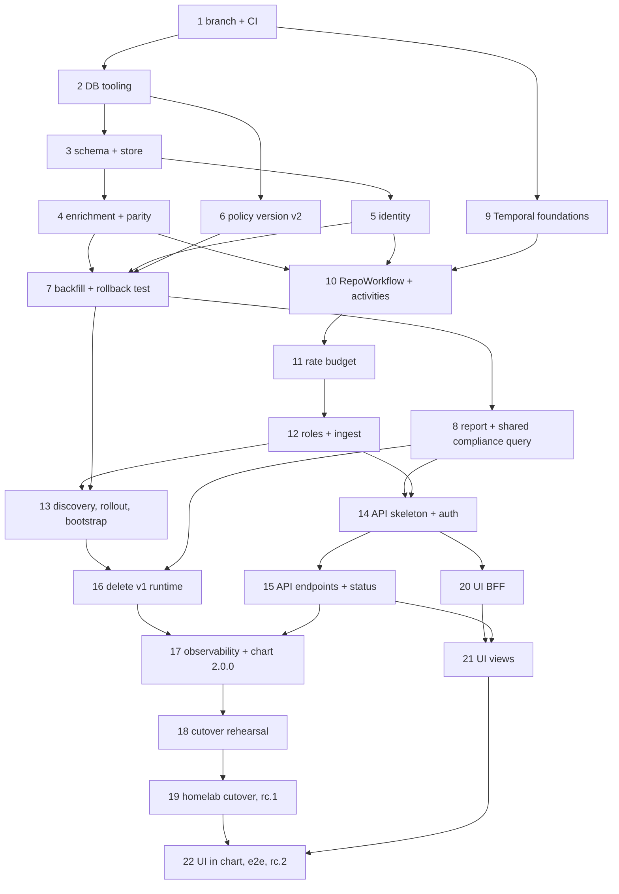

<!-- markdownlint-disable-file MD024 MD025 MD041 -->

# IMPL 0025: v2: findings model, Temporal control plane, read-only API and UI

**Status:** Draft
**Author:** Donald Gifford
**Date:** 2026-09-25

<!--toc:start-->
- [Objective](#objective)
- [Scope](#scope)
  - [In Scope](#in-scope)
  - [Out of Scope](#out-of-scope)
- [How the phases are ordered](#how-the-phases-are-ordered)
- [Pre-implementation audit (2026-09-25)](#pre-implementation-audit-2026-09-25)
  - [Findings model and store](#findings-model-and-store)
  - [Control plane and runtime](#control-plane-and-runtime)
  - [API, UI and chart](#api-ui-and-chart)
- [Implementation Phases](#implementation-phases)
  - [Phase 1: The v2 branch, CI and release plumbing](#phase-1-the-v2-branch-ci-and-release-plumbing)
    - [Tasks](#tasks)
    - [Success Criteria](#success-criteria)
  - [Phase 2: Database tooling — goose, sqlc, migrate, adoption](#phase-2-database-tooling--goose-sqlc-migrate-adoption)
    - [Tasks](#tasks-1)
    - [Success Criteria](#success-criteria-1)
  - [Phase 3: v2 schema and store](#phase-3-v2-schema-and-store)
    - [Tasks](#tasks-2)
    - [Success Criteria](#success-criteria-2)
  - [Phase 4: Engine outcome enrichment and the parity suite](#phase-4-engine-outcome-enrichment-and-the-parity-suite)
    - [Tasks](#tasks-3)
    - [Success Criteria](#success-criteria-3)
  - [Phase 5: Repository identity](#phase-5-repository-identity)
    - [Tasks](#tasks-4)
    - [Success Criteria](#success-criteria-4)
  - [Phase 6: Policy version v2](#phase-6-policy-version-v2)
    - [Tasks](#tasks-5)
    - [Success Criteria](#success-criteria-5)
  - [Phase 7: v1 backfill, dry run, rollback test](#phase-7-v1-backfill-dry-run-rollback-test)
    - [Tasks](#tasks-6)
    - [Success Criteria](#success-criteria-6)
  - [Phase 8: Report on findings and the shared compliance query](#phase-8-report-on-findings-and-the-shared-compliance-query)
    - [Tasks](#tasks-7)
    - [Success Criteria](#success-criteria-7)
  - [Phase 9: Temporal foundations](#phase-9-temporal-foundations)
    - [Tasks](#tasks-8)
    - [Success Criteria](#success-criteria-8)
  - [Phase 10: RepoWorkflow and the check activities](#phase-10-repoworkflow-and-the-check-activities)
    - [Tasks](#tasks-9)
    - [Success Criteria](#success-criteria-9)
  - [Phase 11: Rate budget — InstallationWorkflow, fairness, priority](#phase-11-rate-budget--installationworkflow-fairness-priority)
    - [Tasks](#tasks-10)
    - [Success Criteria](#success-criteria-10)
  - [Phase 12: Roles and ingest](#phase-12-roles-and-ingest)
    - [Tasks](#tasks-11)
    - [Success Criteria](#success-criteria-11)
  - [Phase 13: Discovery, snapshots, policy rollout, bootstrap](#phase-13-discovery-snapshots-policy-rollout-bootstrap)
    - [Tasks](#tasks-12)
    - [Success Criteria](#success-criteria-12)
  - [Phase 14: API contract, skeleton, authentication and authorization](#phase-14-api-contract-skeleton-authentication-and-authorization)
    - [Tasks](#tasks-13)
    - [Success Criteria](#success-criteria-13)
  - [Phase 15: API read endpoints and the status page](#phase-15-api-read-endpoints-and-the-status-page)
    - [Tasks](#tasks-14)
    - [Success Criteria](#success-criteria-14)
  - [Phase 16: Delete the v1 runtime](#phase-16-delete-the-v1-runtime)
    - [Tasks](#tasks-15)
    - [Success Criteria](#success-criteria-15)
  - [Phase 17: Observability and chart 2.0.0](#phase-17-observability-and-chart-200)
    - [Tasks](#tasks-16)
    - [Success Criteria](#success-criteria-16)
  - [Phase 18: Cutover rehearsal — runbook, shadow run, data-migration rehearsal](#phase-18-cutover-rehearsal--runbook-shadow-run-data-migration-rehearsal)
    - [Tasks](#tasks-17)
    - [Success Criteria](#success-criteria-17)
  - [Phase 19: Homelab cutover and v2.0.0-rc.1](#phase-19-homelab-cutover-and-v200-rc1)
    - [Tasks](#tasks-18)
    - [Success Criteria](#success-criteria-18)
  - [Phase 20: UI — the Bun BFF](#phase-20-ui--the-bun-bff)
    - [Tasks](#tasks-19)
    - [Success Criteria](#success-criteria-19)
  - [Phase 21: UI — views](#phase-21-ui--views)
    - [Tasks](#tasks-20)
    - [Success Criteria](#success-criteria-20)
  - [Phase 22: UI in the chart, end-to-end, docs, rc.2](#phase-22-ui-in-the-chart-end-to-end-docs-rc2)
    - [Tasks](#tasks-21)
    - [Success Criteria](#success-criteria-21)
- [File Changes](#file-changes)
- [Testing Plan](#testing-plan)
- [Dependencies](#dependencies)
- [Open Questions](#open-questions)
- [References](#references)
<!--toc:end-->

## Objective

Build v2 on one long-lived `v2` branch: DESIGN-0025, DESIGN-0026 and
DESIGN-0027 as a single ordered plan. At the end, v2 can be swapped in
for a live v1 on the same Postgres, and it resumes operations. It
discovers the same repositories and applies the same policy with the
same GitHub actions, then records the results as findings. Operators
get the Temporal control plane, and users get a read-only API, a
status page and a business UI.

One plan replaces three because the order of operations crosses all
three designs. For example:

- the backfill must exist before bootstrap;
- the report's compliance query must exist before the API reuses it;
- the v1 store cannot be deleted until the v1 runtime that calls it
  is.

The homelab Temporal cluster is the test bed throughout, and there is
no separate spike.

**Implements:** DESIGN-0025, DESIGN-0026, DESIGN-0027 (from INV-0018,
INV-0019, INV-0009)

This IMPL consolidates three per-design drafts that briefly existed as
IMPL-0025/0026/0027. They were merged on 2026-09-25 so the order of
operations across the designs is explicit in one place.

## Scope

### In Scope

- **Branch and release:** the `v2` branch, CI triggers, rc-only
  publishing, and never tagging `latest` from a pre-release.
- **Data:** goose migrations, sqlc queries, the `migrate` subcommand,
  the v2 schema, `Writer`/`Reader` with an idempotent `RecordCheck`,
  and the v1 adoption, backfill and rollback path.
- **Engine:** the finding facets and evidence at every outcome site,
  plus a parity suite proving that GitHub writes are unchanged.
- **Identity and versioning:** GitHub repository IDs, rename and
  transfer handling, and policy version v2.
- **Report:** the report reads findings through a compliance query
  that the API and snapshots share.
- **Control plane:**
  - Temporal client and worker plumbing;
  - every workflow in DESIGN-0026, including the rate budget, fairness
    and priority;
  - roles (`ingest`, `worker`, `api`, `migrate`, `all`) and ingest with
    the full webhook event table.
- **API:** the `api` role with an OpenAPI 3.1 contract, OIDC, group→org
  authorization in SQL, a read-only pool, every endpoint, and the
  status page.
- **Removal:** the v1 runtime (queue, scheduler, reaper, sweep, posture
  exporter, worker, Valkey, v1 store), the removed metrics, env vars,
  HCL attributes and chart values, each with a migration error.
- **Monitoring and chart:** the monitoring generator (E1/E2 deleted,
  E3 rebuilt, E4 trimmed) and the v2 alert catalogue; chart 2.0.0 with
  topology, KEDA, secret scoping, guards, the migrate hook, the API,
  the UI and the read-only role.
- **UI:** the Bun BFF (Hono, `openid-client`, an encrypted cookie
  session) and the React views.
- **Cutover:** the runbook, `migrate verify-shadow`, the homelab
  rehearsal, cutover and rollback drill, and `v2.0.0-rc.1` / `rc.2`.

### Out of Scope

- `v2.0.0` GA and fast-forwarding `main`, which follow an rc soak.
- The v2.1 migration that drops the v1 tables (DESIGN-0025 OQ6).
- Notifications on finding transitions (a later design).
- Upgrade-on-Continue-as-New (waits for GA, DESIGN-0026 OQ7).
- Any write path in the API or UI.
- Rendering the OpenAPI spec inside mkdocs (deferred, OQ27).

## How the phases are ordered

Phases are strictly sequential on `v2`. Each lands as one or more PRs
into `v2` (OQ29) and leaves `make ci` and `make test-integration`
green. A phase may start early when its inputs are done. The graph
shows what really depends on what; the numbering is the order to merge
in when nothing else decides it.

Three rules hold the order together:

- **The v1 runtime keeps building and running until Phase 16.** The v2
  store interfaces live beside v1's `store.Store` (OQ1), so the branch
  always has a working server to compare against.
- **Anything a test locks is changed in the same commit as the code.**
  That covers the LogQL contract lines, the parity goldens, the policy
  version golden and generated code (sqlc, oapi-codegen, monitoring).
- **Every workflow change after Phase 10 is a `GetVersion` patch**,
  gated by the replay tests.

## Pre-implementation audit (2026-09-25)

The audit read the code at `main` @ `5d9c440`. It lists deltas from
the three designs, and facts the phases depend on.

### Findings model and store

- **Our open PR is found after evaluation, not before.**
  `findActionableRules` runs at `engine_policy.go:42`, and `findOurPR`
  at `:47`. `pr_open` is therefore added to the finished outcomes
  (task 4.7) rather than reordering evaluation.
- **Nothing that decides an action reads `RuleOutcome.Actionable`.**
  The only production reader is the write-back copy at `worker.go:561`.
  Actions come from the `actionable []policy.FileRuleConfig` slice
  (`engine_policy.go:289-355`) and from local bools in the setting and
  branch-protection evaluators. Turning the field into a method touches
  no action path.
- **Outcomes are appended in exactly three places:**
  `engine_policy.go:347`, `engine_settings.go:60` and
  `engine_branch_protection.go:60`.
- **Skip branches that produce no outcome today:**
  - file rules: disabled `engine_policy.go:297-299`, scope `303-308`,
    ignore `310-315`, gate `322-328`;
  - setting rules: disabled `engine_settings.go:35-37`, scope `41-46`,
    ignore `48-53`;
  - branch-protection rules: the same lines in
    `engine_branch_protection.go`;
  - whole repository: empty (`engine.go:144`), global ignore
    (`engine.go:152`), policy out of scope (`engine_policy.go:29`).
- **Evidence needs two small API additions.**
  - `IgnoreConfig.Matches` returns only a bool, and `{pattern}`
    evidence needs the matched glob.
  - `gateResult{open, reason}` (`gate.go:25-28`) drops the referee
    error at `gate.go:135-138`.
- **The foreign-PR short-circuit returns before the file is read**
  (`engine_policy.go:385-393`). The underlying reason is therefore
  unknown without extra API calls, which DESIGN-0025 OQ9 forbids (OQ3).
- **Branch-protection semantics:**
  - a missing branch returns false (compliant) at
    `engine_branch_protection.go:95-98`;
  - `!Remediate` and dry-run return true (actionable);
  - applied returns false.

  Setting rules match (`engine_settings.go:88-112`).
- **`ghclient.Repository` has no ID field** (`github.go:42-49`), yet
  both constructors have one to hand and drop it. These are `r.GetID()`
  at `client.go:184-196` and `repo.GetID()` at `client.go:378-391`.
  About 90 test literals use keyed fields, so adding `ID` breaks
  nothing.
- **v1 `Store` consumers:**
  - production: webhook, sweep, posture, snapshot, discoverer, worker
    and `main.go`;
  - six test fakes implement or embed the interface;
  - generated-mock users are `writeback_test.go` and
    `webhook/discovery_test.go`.
- **golang-migrate runs at every pod start** (`main.go:510-518`), with
  no schema-version check in `postgres.New`.
- **Four copies of the Postgres testcontainer helper exist:**
  - `store/postgres/postgres_integration_test.go:35`;
  - `checker/posture_integration_test.go:44`;
  - `checker/multireplica_integration_test.go:33`;
  - `worker/worker_integration_test.go:39`.
- **`make test-integration` is not run in CI.**
- **`policy.Version` has no stable input.** It hashes
  `json.Marshal(PolicyConfig)`, and `types.go` has zero json tags.
  `ParsedScheduleInterval` has `hcl:"-"` but is still marshalled. There
  is no golden test.
- **No check catches a rule name reused across kinds.** Per-kind checks
  sit at `validate.go:356-362, 417-423, 429-447`. The load-time warning
  pattern to copy is `warnLegacyPerRuleScope` (`loader.go:98`, `:138`).
- **The report keys snapshots by `(org, rule)` with no kind**
  (`model.go:156-159`). `CompliantPercent` is at `model.go:86-94`, and
  there are 11 golden files.
- **Tooling is missing:** no goose, sqlc, Temporal, oapi-codegen,
  go-oidc or kin-openapi. `go 1.26.6`, pgx v5.9.2, testcontainers
  v0.42.0.

### Control plane and runtime

- **What Phase 16 deletes:**
  - `internal/queue` (`valkey.go` 602 LOC, `reaper.go` 229, an
    807-line integration test);
  - `internal/scheduler` (the discoverer is reused as activity logic);
  - `internal/worker` (579 LOC, plus 1,469 LOC of tests);
  - `checker/{sweep,posture}` and `multireplica_integration_test.go`;
  - `observability/valkey.go`;
  - five non-test and five test files importing go-redis.
- **The LogQL contract test locks lines that Phase 16 deletes.**
  `TestLogLines_AreStillEmittedByTheBinary` checks the constants in
  `e4.go:17-33`:
  - five lines from `worker.go`;
  - "stale-sweep complete" from `sweep.go`;
  - "failed to enqueue job" from `handler.go`.

  The parking line survives, because the `Park` activity re-emits it.
- **The alert catalogue has 24 alerts** (`monitoring/alert/alert.go`).
  - Deleted, 17: PostureExportStalled, StaleOpenPRs, PRDrift,
    SettingRemediationChurn, BranchProtectionChurn, RuleNeverApplies,
    PropertySchemaMissing, CatalogParseFailures, PRBurst,
    QueueDepthHigh, ReaperRequeues, QueueBackpressure, JobsExhausted,
    NoSchedulerLeader, RateLimitThrottling, RepoAccessDenied,
    NoRepoChecks.
  - Kept or reworked:
    - HighErrorRate and AllChecksFailing become CheckErrorRate;
    - SlowChecks, NoWebhooks, WebhookRejectionsHigh and
      RateLimitNearExhaustion stay;
    - StoreQueryErrors becomes StoreErrors.
  - New: ScheduleToStartLatencyHigh, NoWorkerPollers,
    WorkflowTaskFailures, TemporalUnreachable.

  The chart hand-mirrors 12 of these.
- **Dashboards.** E1 and E2 read business metrics only, so both are
  deleted. E3 reads 14 `repo_guardian_*` series, 9 of which disappear.
- **Removed config is spread across several files:**
  - `config.go` reads 13 removed env vars (234–349) and runs
    `validateBackend` for queue and scheduler (402, 410);
  - HCL is parsed at `types.go:76-78`, `loader.go:371-373, 409-414` and
    `validate.go:36,40`;
  - five `examples/` files set the removed knobs, and
    `examples/examples_test.go` exercises them.
- **Readiness checks nothing today.** `handleReadyz` (`main.go:706`)
  returns 503 only after shutdown starts. `gracefulShutdown`
  (`main.go:572`) takes a queue, a redis client and a worker pool.
- **Release plumbing:**
  - `docker-bake.hcl:34`, `ghcr.yml:80-83` and `ecr.yml:110-113` tag
    `latest` unconditionally;
  - `release.yml` runs on pushes to `main` only;
  - `ct.yaml:5` targets `main`;
  - `changelog-update.yml:29` checks out `main`.
- **Local dev hard-codes Valkey.** `make run-local` uses Valkey DSNs,
  and `docker-compose.dev.yaml` runs `valkey/valkey:9.1-alpine`.
- **CLAUDE.md** describes v1 queue, scheduler and posture contracts in
  14 paragraphs (:166–:243).

### API, UI and chart

- **HTTP plumbing to reuse:**
  - `observability.Handler`;
  - the uninstrumented health handlers (`main.go:698, 706`);
  - `startServer` (`:549`) and `newMetricsServer` (`:538`).
- **The API has no GitHub client, so it cannot use the live PR
  linker.** The report's `newPRLinker` (`report.go:122`) needs one, so
  PR links come from evidence instead.
- **The chart has no Ingress template** (IMPL-0024). DESIGN-0027 brings
  back one optional Ingress, for the UI host only.
- **Baked Postgres has no init-SQL hook for extra roles,** and CNPG has
  no `spec.managed.roles`. Existing baked volumes will never run
  first-boot SQL again (OQ24).
- **`repo-guardian-ui` does not exist on GitHub, and
  `docs/usage/api.md` does not exist.**
- **reservedEnvVars is out of step.** It (`_helpers.tpl:84-85`) lists
  9 removed vars but lacks `MAX_JOB_ATTEMPTS` and
  `POSTURE_EXPORT_INTERVAL`. `validateRemovedValues`
  (`_helpers.tpl:218`) is the guard pattern to extend.
- **Chart test suites that reference removed keys:**

  | Suite | Hits |
  | --- | --- |
  | `backend_shapes_test.yaml` | 44 |
  | `deployment_env_test.yaml` | 12 |
  | `prometheusrule_test.yaml` | 7 |
  | `values_guard_test.yaml` | 15 |

## Implementation Phases

Each phase lists tasks to check off and the success criteria that close
it. Task IDs are `<phase>.<n>`.

---

### Phase 1: The v2 branch, CI and release plumbing

#### Tasks

- [ ] 1.1 **Deferred — human required:** work happens on the current branch per the operator; creating, pushing and protecting `v2` on GitHub is a repo-admin action — Create `v2` from `main`, push it, and protect it: PR
  required, with the same required checks as `main`.
- [x] 1.2 On `v2`, set `branches: [main, v2]` in `ci.yml:7,9`,
  `license-check.yml:7,9` and `security.yml:5-7`. `release.yml` and
  `gh-pages.yml` stay `main`-only.
- [x] 1.3 On `v2`, set `ct.yaml` to `target-branch: v2`.
- [x] 1.4 Stop pre-releases from tagging `latest`:
  - in `docker-bake.hcl` `tags()` (`:28-36`), emit `latest` only when
    `VERSION` has no pre-release suffix;
  - in `ghcr.yml:80-83` and `ecr.yml:110-113`, change the `latest` tag
    to `type=raw,value=latest,enable=${{ !contains(inputs.tag, '-') }}`;
  - land the same change on `main` too, in a small separate PR. **Deferred — human required:** the `main` PR is an outward action for the operator; the change is committed here.
- [x] 1.5 Add a `ref` input (default `main`) to `changelog-update.yml`.
- [x] 1.6 On `v2`, set the chart to `version: 2.0.0-rc.0`. The first
  publish is rc.1, in Phase 19.
- [x] 1.7 Add an `integration` job to `ci.yml` on `v2`. It runs
  `make test-integration` when the paths filter reports `go` or `sql`
  changes (OQ2).
- [x] 1.8 Document the branch workflow in CLAUDE.md on `v2`:
  - engine fixes land on `main` first and merge forward;
  - rc tags are cut by hand, with `dont-release` PRs;
  - publishing is by `workflow_dispatch` with the tag (OQ9).
- [ ] 1.9 **Deferred — human required:** needs the real `v2` branch on GitHub and a merge PR — Drill a merge-forward: merge `main` into `v2` and confirm CI
  runs on the merge PR.

#### Success Criteria

- A PR into `v2` runs `ci`, `license-check`, `security` and
  `integration`.
- A push to `v2` does not run `release.yml`.
- A dry-run dispatch of `ghcr.yml` with `v2.0.0-rc.0` produces a tag
  list without `latest`.

---

### Phase 2: Database tooling — goose, sqlc, migrate, adoption

#### Tasks

- [x] 2.1 Add `github.com/pressly/goose/v3` to go.mod, use pgx's
  `stdlib` driver, and pin `sqlc` in `mise.toml`.
- [x] 2.2 Set up the goose migrations:
  - put them in `internal/store/postgres/migrations_v2/`, embedded and
    kept apart from v1's `migrations/`;
  - `goose.go` exposes `NewMigrator(db)`, which uses
    `goose.NewProvider(DialectPostgres, db, fsys,
    WithSessionLocker(lock.NewPostgresSessionLocker()))`;
  - the version table is `goose_db_version`.
- [x] 2.3 Write `00001_adopt_v1` as a Go migration:
  - no `schema_migrations` table: a fresh install, so do nothing;
  - `version = 3 AND NOT dirty`: write `v2_meta.adopted_v1_at`;
  - anything else: fail with "upgrade to the last v1.x first, or
    resolve the dirty migration".
- [x] 2.4 Add the `repo-guardian migrate` subcommand:
  - new file `cmd/repo-guardian/migrate.go`, wired into `dispatch`
    (`main.go:78-97`) and the usage text (`:111-122`);
  - flags: `--dsn` (default `STORE_DSN`), `--dry-run`, `--freshness`
    (default `RECONCILE_FRESHNESS`, else `24h`) and `--json`.
- [x] 2.5 Add a recent-write guard:
  - if `repo_state` has `max(last_checked_at)` within the last 60s,
    refuse with "v1 appears to be running; scale it to zero first";
  - a hidden `--force-running` flag bypasses it, for tests only.
- [x] 2.6 Write `sqlc.yaml`:
  - `engine: postgresql`;
  - schema from `migrations_v2`, queries from `queries/`;
  - generated code in package `sqlcdb`, with `sql_package: pgx/v5`;
  - overrides: `jsonb` → `json.RawMessage`, `timestamptz` → `time.Time`.
- [x] 2.7 Add Make targets:
  - `generate-sql`;
  - `lint-sql`, which runs `sqlc vet`, generates into `build/sqlc`, and
    `diff -r` against the committed code;
  - a CI job gated on an `sql` paths-filter output.
- [x] 2.8 Add the shared test helper `internal/store/postgres/pgtest`:
  - `Start(t) dsn`, using the chart's baked Postgres image;
  - `SeedV1(t, dsn)`, which runs v1's own golang-migrate migrations up
    to version 3.
- [x] 2.9 Migration tests. Each case asserts the result on a real
  database:
  - fresh: no-op;
  - v1 at version 3: adopted;
  - version 2: refused;
  - dirty: refused;
  - re-run: no-op;
  - a recent write: refused by the guard.

#### Success Criteria

- `migrate` exits 0 on a fresh database and on a seeded v1 database.
- `migrate` exits non-zero with the documented message on a version-2
  or dirty database.
- `make lint-sql` fails after a hand edit to generated code. Prove this
  once, then revert.
  *(Proven in task 3.6, the first task that produces generated code.)*

---

### Phase 3: v2 schema and store

#### Tasks

- [x] 3.1 Write `00002_v2_schema.sql` with every table, index and
  CHECK from DESIGN-0025 § Data model, plus:
  - `repository_events.kind` limited to discovered, renamed,
    transferred, parked, unparked and removed;
  - `service_runs.kind` limited to discovery, snapshot, policy_rollout
    and bootstrap;
  - the `repositories_org` index on `lower(org) WHERE active`;
  - a `pending` value in `checks.outcome`;
  - a unique `check_key`;
  - a Down migration that drops only the v2 objects.
- [x] 3.2 Add grants in a `DO $$` block:
  - the application role gets `SELECT, INSERT, UPDATE, DELETE`, except
    `finding_events`, which gets `SELECT, INSERT`;
  - if `repoguardian_ro` exists, grant it `SELECT` and set
    `ALTER DEFAULT PRIVILEGES`; otherwise `RAISE NOTICE`;
  - never `CREATE ROLE`.
- [x] 3.3 Create the leaf package `internal/findings` (OQ4):
  - `Status`, `Reason` and `Remediation` types;
  - an `Evidence` interface, with one json-tagged struct per reason;
  - `PREvidence` and `ForeignPREvidence`;
  - `Clip(s, 1024)`, rune-aware. `store.Truncate` wraps it until
    Phase 16.
- [x] 3.4 Add domain types in `internal/store/findings.go`:
  - `Finding`, `FindingTransition`, `CheckRecord` and
    `CheckErrorRecord`;
  - `CheckApplied{Transitions, AlreadyFinal}`;
  - `DiscoveredRepo`, `UpsertResult{ID, Created, Reactivated,
    Renamed}`;
  - `Installation`, `RateSnapshot`, `PolicySummary`, `ServiceRun`,
    `ParkReason` and `Scope`.
- [x] 3.5 Declare `Writer` and `Reader` in `internal/store/v2.go`,
  beside v1's `Store` (OQ1). They follow DESIGN-0025 § Store interface,
  plus `StageCheck(ctx, CheckRecord)`, which writes the `pending` row
  and `pending_result` (DESIGN-0026 OQ17). `RecordCheck` accepts either
  a staged key or inline outcomes.
- [x] 3.6 Write the sqlc query files in `queries/`:
  `repositories.sql`, `installations.sql`, `findings.sql`, `checks.sql`,
  `events.sql`, `policy.sql`, `service_runs.sql` and `snapshots.sql`.
  Then run `make generate-sql` and commit the output.
- [x] 3.7 Implement `RecordCheck` in `V2Store`
  (`internal/store/postgres/v2store.go`), following the DESIGN-0025
  flowchart:
  - if the check is already final, return the stored transitions,
    read from `finding_events` by `check_id`;
  - otherwise, in one transaction:
    - `SELECT … FOR UPDATE` the repository's findings, and diff in Go
      (OQ5); "change" means status, reason or remediation;
    - finalize the check and upsert the findings. `status_since` moves
      only when the status changes;
    - write events for created, changed and removed findings;
    - delete findings that are no longer in the outcomes;
    - update `repositories`, and the installation's rate snapshot when
      the observation is newer.
- [x] 3.8 Implement the rest of the store:
  - `RecordCheckError`;
  - `Park(repoID, reason, clearFindings)`, which writes a `parked`
    event and, when `clearFindings` is set, deletes findings with
    removal events;
  - `UpsertDiscovered`, matching by name only for now (Phase 5
    completes it);
  - `UpsertInstallation`, `MarkInstallationRemoved`;
  - `RecordPolicyVersion`, `CompletePolicyRollout`;
  - `RecordServiceRun`;
  - `InsertComplianceSnapshot`, idempotent on `(org, kind, rule, at)`;
  - `PruneChecks`;
  - `GetRepository`, and `ListActiveRepositories` with keyset paging.
- [x] 3.9 Add `RequireSchema(ctx, pool, minVersion)`. It reads
  `goose_db_version` and is used by role readiness.
- [x] 3.10 Add `Writer` and `Reader` to `.mockery.yaml`, then run
  `make mocks`.
- [x] 3.11 `RecordCheck` property tests:
  - the same key twice gives one set of events, and `AlreadyFinal`
    returns the same transitions;
  - identical outcomes under two keys give no events, while
    `last_evaluated_at` advances;
  - removing a rule writes an event and deletes the row;
  - a status change moves `status_since`;
  - an evidence-only change updates the row with no event and no
    `status_since` move;
  - a staged payload is NULLed on commit;
  - an older rate observation never wins.
- [x] 3.12 Nil and clear contract tests:
  - `RecordCheckError` never touches findings;
  - `Park(access_denied, false)` keeps them;
  - `Park(archived, true)` deletes them and writes events;
  - `finding_events` refuses `UPDATE` and `DELETE` under the
    application role.

#### Success Criteria

- `goose up` produces the v2 schema on both fresh and adopted
  databases.
- `goose down` to version 1 leaves the v1 tables byte-identical, as
  checked with `pg_dump --schema-only`.
- Every test in 3.11 and 3.12 passes under `-race`.
- `make lint-sql` and `make mocks` leave no diff.

---

### Phase 4: Engine outcome enrichment and the parity suite

#### Tasks

- [x] 4.1 Capture parity goldens **before** touching the engine (OQ6):
  - wrap the existing fake client in a recording decorator
    (`internal/checker/parity_test.go`);
  - log every GitHub write call with normalized arguments;
  - run every scenario in `engine_test.go`, `engine_policy_test.go`,
    `convergence_test.go`, `drift_test.go`, `gate_test.go` and
    `scope_test.go`;
  - store the calls, plus each `(kind, name, actionable)`, in
    `testdata/parity/*.golden.json`, written with `-update-parity`.
- [x] 4.2 Add `policy.IgnoreConfig.MatchPattern(owner, repo) (string,
  bool)`. `Matches` delegates to it.
- [x] 4.3 Change `gate.go`'s `gateResult` to carry `err`. Set it at
  `:135-138`, and add `gateDetail(referee)`.
- [x] 4.4 Widen `checker.RuleOutcome` to `{RuleName, Kind, Status,
  Reason, Remediation, Evidence}`:
  - `Actionable()` returns true only when the status is `non_compliant`
    and the remediation is not `foreign_pr`;
  - `(*CheckResult).add` becomes `record(RuleOutcome)`;
  - `worker.go:561` calls `o.Actionable()`.
- [x] 4.5 Enrich file rules:
  - `evaluateRule` returns `(bool, outcomeDetail)`, with the reason and
    evidence from `evaluateAbsent`, `evaluateExists`,
    `evaluateContains`, `evaluateExact` and `compareContent`;
  - a foreign PR records remediation `foreign_pr` and reason
    `foreign_pr_open` (OQ3);
  - scope and ignore skips record `not_applicable`;
  - a closed gate records `not_applicable` with `gate_closed`, or
    `unknown` with `gate_error` when the referee errored;
  - metric increments stay in place and primary-pass-only;
  - `reconcilerRuleApplies` records nothing, and a test asserts it.
- [x] 4.6 Enrich setting and branch-protection rules:
  - scope and ignore skips record `not_applicable`;
  - `setting_mismatch`, `ruleset_missing` and `ruleset_mismatch`
    record their evidence;
  - a missing branch records `not_applicable` with `branch_missing`;
  - remediation is `disabled`, `dry_run` or `applied`; `applied` means
    status `compliant`.
- [x] 4.7 After `findOurPR` (`engine_policy.go:47`), mark actionable
  file outcomes `pr_open` with `PREvidence`, or `dry_run` when
  `DryRun` is set. This is a data-only pass that runs after the action
  decision.
- [x] 4.8 Add a helper, `notApplicableForAll(policy, reason,
  evidence)`, for repository-level skips: empty repository, global
  ignore and policy out of scope. Archived and forked repositories are
  unchanged: they still return `nil, &SkippedError`.
- [x] 4.9 Update the tests that pinned v1's "no outcome" rule:
  `result_test.go:196, :232` and `engine_test.go:671-672`.
- [x] 4.10 Parity suite: the enriched engine must reproduce the goldens
  byte for byte, and `Actionable()` must equal the v1 boolean for every
  outcome. Prove it is non-vacuous by flipping one clause, watching the
  suite fail, and restoring.
  *(Proven 2026-09-25: dropping the `foreign_pr` clause from
  `Actionable()` failed `TestCheckRepo_MissingFiles_ThirdPartyPR`'s
  golden; restored green. `TestParity_GoldensExist` guards against an
  empty golden set.)*
- [x] 4.11 Add one golden scenario per reason code and per remediation
  value, in `outcomes_test.go`.

#### Success Criteria

- The parity suite is green, and proven non-vacuous.
- Every reason and remediation has a golden test.
- `grep -rn 'result.add(' internal/checker` returns nothing.
- The diff adds no calls to `github.Client` (DESIGN-0025 OQ9).

---

### Phase 5: Repository identity

#### Tasks

- [x] 5.1 Add `ID int64` to `ghclient.Repository`. Set it in
  `GetRepository` and `ListInstallationRepos`, and add `id` to the
  `client_test.go` fixtures.
- [x] 5.2 `CheckResult.Repository` carries `{ID, Owner, Name}` from
  `GetRepository`, at no extra call cost.
- [x] 5.3 Match repositories in `UpsertDiscovered` and `RecordCheck`:
  - first by `provider_repo_id`;
  - then by `lower(org), lower(name)` where `provider_repo_id IS
    NULL`, filling in the ID;
  - an ID match with a different name or org writes a `renamed` or
    `transferred` event.

  `UpsertDiscovered` is the only code that un-parks a repository, and a
  test asserts that `RecordCheck` never sets `active`.
- [x] 5.4 Add `GITHUB_HOST` (default `github.com`), passed through to
  every record (OQ7).
- [x] 5.5 At load, emit one warning per rule name that is used by more
  than one kind. Put it next to `warnLegacyPerRuleScope`. Test that
  gates still resolve to the file rule.
- [x] 5.6 Integration tests:
  - a rename keeps the ID, the history and a `renamed` event;
  - a transfer updates org and installation;
  - a case-only rename writes no event;
  - a NULL ID is filled on the first match;
  - two names differing only by case collide on the unique index.

#### Success Criteria

- Renames and transfers keep `repositories.id` and history.
- The fake client's call counts are unchanged against the Phase 4
  goldens.

---

### Phase 6: Policy version v2

#### Tasks

- [x] 6.1 Add `VersionV2(cfg, templates)` in
  `internal/policy/version_v2.go`:
  - hash an explicit, json-tagged `versionInput`, built by copying
    fields rather than embedding;
  - hash exactly the set in DESIGN-0025 § Policy version v2;
  - return `"v2:" + hex(sha256)`.
- [x] 6.2 Add a golden test: a fixture policy and its templates must
  produce a pinned version.
- [x] 6.3 Add a classification test. It reflects over every policy
  struct and fails on any exported field that is in neither the
  `hashed` table nor the `notHashed` table.
- [x] 6.4 Operational knobs such as `log_level` and
  `rate_limit_threshold` keep the version unchanged. `dry_run`, rule
  paths and template content change it.
- [x] 6.5 Add `policy.Summarize(cfg)` for `policy_versions.summary`.
  It lists kind, name, description, check mode, scope and ignore, and
  never template bodies.
- [x] 6.6 Leave v1's `Version` in place until Phase 16, marked with a
  `TODO(IMPL-0025 P16)` comment in todo-comments format.

#### Success Criteria

- The golden version is stable across runs and across fixture field
  order.
- Adding an unclassified field fails the classification test. Prove it
  once, then revert.

  Proved 2026-09-25: adding `GuardianConfig.ProbeField` failed
  `TestVersionV2_EveryFieldClassified` with "policy field
  GuardianConfig.ProbeField is unclassified"; reverted.

---

### Phase 7: v1 backfill, dry run, rollback test

#### Tasks

- [x] 7.1 Write `00003_backfill_v1` as a Go migration. It is a no-op
  unless the database was adopted from v1, and it runs DESIGN-0025
  steps 1–6 in one transaction:
  - **installations:** handle the multi-owner case, keeping the most
    recent owner and logging the rest;
  - **repositories:**
    - use v1's park-reason reconstruction;
    - prefix `policy_version` with `v1:`;
    - set `next_due_at` to `last_checked_at + freshness`, and spread
      never-checked repositories evenly over one freshness window
      (seeded, with the seed logged);
    - on a case collision, keep the most recently checked row;
  - **findings:** migrate from `rule_state`;
  - **events:** write one `created` event per finding with
    `migrated_from_v1`;
  - **snapshots:** copy them, taking the kind from the `rule_state`
    names and defaulting to `file`;
  - **policy_versions:** write no row.

  `migrate` passes freshness to the migration through the context.
- [x] 7.2 Implement `--dry-run` (OQ8). Run adoption, `00002` and
  `00003` in one outer transaction, print the counts, collisions,
  multiple owners and the park-reason histogram, then roll back.
- [x] 7.3 Seeded migration tests. Seed repositories parked for each
  reason plus one `unknown`, a never-checked repository, actionable
  rows with and without `actionable_since`, compliant rows, case
  collisions, a two-owner installation and snapshots. Then assert:
  - every mapping row by row;
  - that a re-run is a no-op;
  - that `--dry-run` leaves no v2 rows.
- [x] 7.4 Rollback test. After `migrate`, v1's `Migrate`, `StaleRepos`
  and `UpsertRuleStates` still work against the database, and the v1
  tables are unchanged. Copy the two queries into `pgtest/v1sql` so the
  test survives Phase 16.
- [x] 7.5 Add the chart template `templates/migrate-job.yaml`:
  - hook `pre-install,pre-upgrade`;
  - delete policy `before-hook-creation,hook-succeeded`;
  - behind `migrate.enabled` (default false until Phase 17);
  - covered by helm-unittest.

#### Success Criteria

- Every backfill mapping is proven by the seeded test, including each
  park reason and collision.
- The rollback test passes.
- The dry run's counts equal the real run's, and it leaves the database
  unchanged.

---

### Phase 8: Report on findings and the shared compliance query

#### Tasks

- [x] 8.1 Add `queries/compliance.sql` with one shared query:
  - `compliant / (compliant + non_compliant)` over active
    repositories;
  - `not_applicable` and `unknown` reported separately;
  - an empty denominator returns null;
  - the value is floored to one decimal.

  It is scoped by `Scope`, so the API reuses it unchanged. The snapshot
  writer uses the same counts.
- [x] 8.2 Rework `internal/report`:
  - key by `(org, kind, rule)`;
  - `RuleLine` becomes `{Compliant, NonCompliant, NotApplicable,
    Unknown, Delta}`;
  - `Finding` gains `Reason`, `Remediation`, and a PR link built from
    evidence fields.
- [x] 8.3 In `report.md.tmpl`, add a reason column to findings
  (`:29/:32`) and N/A and Unknown columns to rules (`:14/:17`).
  Repository text is escaped, tested with `|` and a backtick.
- [x] 8.4 Replace `Enrich`'s live linker with evidence links. Keep
  `--no-links` for one release as a deprecated no-op.
- [x] 8.5 Regenerate the 11 goldens and review the diff by hand.
- [x] 8.6 `cmd/repo-guardian/report.go` uses the `V2Store` Reader and
  `RequireSchema`.
- [x] 8.7 Compliance parity test: for the same seed, `report.Build` and
  `InsertComplianceSnapshot` must agree. Phase 15 extends the test to
  the API.

#### Success Criteria

- On a seeded, migrated database, `report` shows the backfilled
  findings as `migrated_from_v1`, each with its original `since`.
- The report and snapshot percentages are identical.

---

### Phase 9: Temporal foundations

This phase can start right after Phase 1.

#### Tasks

- [ ] 9.1 **Deferred — human required:** needs read access to the operator's homelab Temporal cluster to record the version, stores, fairness flag, TLS and namespace baseline — Audit the homelab Temporal cluster and record the results
  here, under "Homelab Temporal baseline":
  - server version, which must be at least 1.31;
  - persistence and visibility stores;
  - `matching.enableFairness`;
  - frontend TLS;
  - whether the `repo-guardian` namespace exists.
- [x] 9.2 Add `contrib/temporal/` with every file in DESIGN-0026's
  table, plus a README. Pin the upstream chart, and add
  `make lint-temporal-contrib`, which runs `helm template` on each
  combination.
- [ ] 9.3 **Deferred — human required:** changes the operator's homelab cluster to match contrib/temporal/ — Bring the homelab in line with `contrib/temporal/` and
  record any deviations.
- [x] 9.4 Add `go.temporal.io/sdk` and its OpenTelemetry contrib
  module, both pinned.
- [x] 9.5 Build the `internal/temporal` package:
  - `Config` read from the `TEMPORAL_*` env vars;
  - `Dial`, with mTLS, an `slog` adapter and OTel metrics on the
    existing meter provider;
  - `CheckServerVersion(ctx, c, "1.31.0")`;
  - `Ping`.
- [x] 9.6 Update the local dev loop (OQ11). Add a `temporal` service
  to `docker-compose.dev.yaml` (`start-dev`, UI on 8233), and move
  Valkey behind a `v1` profile until Phase 16. Update `run-local` and
  `dev-services` to match.
- [x] 9.7 Add a `temporaltest.Start(t)` harness using
  `testsuite.StartDevServer` with a pinned CLI (OQ10).
- [ ] 9.8 **Deferred — human required:** needs homelab mTLS client certs and network reachability to the homelab frontend — Smoke test: from a dev machine, run and delete a throwaway
  workflow on the homelab over mTLS.

#### Success Criteria

- The homelab runs Temporal ≥ 1.31 with fairness enabled, and the
  baseline is recorded.
- The client connects to both the dev server and the homelab, and
  refuses a server below the version floor.
- SDK metrics appear on `/metrics`.

---

### Phase 10: RepoWorkflow and the check activities

#### Tasks

- [x] 10.1 Build the `internal/activities` package (OQ12):
  - `Activities{engine, Writer/Reader, ghFactory, policyVersion,
    logger}`;
  - activity names as constants in `internal/workflows/names.go`;
  - a depguard rule that stops `internal/workflows` importing the
    engine, store or GitHub packages.
- [x] 10.2 Add the `CheckRepo` activity. It classifies results in v1's
  order (`worker.processJob` 173-245):
  1. `AsThrottled` → `Deferred{Until}`, returned as a value, not an
     error;
  2. `IsAccessDenied` → `Parked{access_denied}`;
  3. `AsSkipped` → `Parked{archived|fork}`;
  4. anything else → error.

  On success it calls `StageCheck` and returns `Checked{CheckKey,
  Calls, Rate}`.
- [x] 10.3 Add the `RecordCheck`, `RecordCheckError` and `Park`
  activities. `Park` re-emits "parking repository until discovery sees
  it again" with v1's keys.
- [x] 10.4 Add `RepoWorkflow`, the DESIGN-0026 loop:
  - a selector over the timer and the `recheck`, `policy_changed` and
    `park` signals;
  - signals coalesce, keeping the highest priority;
  - `next_due` gets ±10% jitter via `SideEffect`;
  - `Deferred` waits on a durable timer;
  - `Parked` parks and returns;
  - a check that still fails after retries records the error and the
    loop continues;
  - ContinueAsNew on the SDK's suggestion, or after 100 iterations.

  The budget acquire is stubbed behind `GetVersion("budget-v1")`.
- [x] 10.5 Build `check_key` as `<workflowID>/<runID>/<iteration>`.
- [x] 10.6 Activity options, per DESIGN-0026's table:
  - `CheckRepo`: 15m timeout, retries backing off 30s→30m, 10 attempts;
  - store activities: 30s timeout, unlimited retries backing off
    1s→1m.
- [x] 10.7 Worker bootstrap:
  - `WORKER_ACTIVITY_CONCURRENCY` (default 10);
  - deployment versioning, with the build ID set to the binary version
    and `AutoUpgrade`.
- [x] 10.8 Workflow tests, with time-skipping:
  - the timer loop;
  - 20 signals producing at most 2 checks;
  - `policy_changed` pulling `next_due` in;
  - `Deferred` consuming no retry attempt;
  - `Parked` completing the workflow;
  - failure then continue;
  - ContinueAsNew carrying state over.
- [x] 10.9 Activity tests, using the hand-written GitHub fakes and the
  store mocks:
  - the classification table, including a secondary-rate-limit 403
    that must count as throttled;
  - the `StageCheck` → `RecordCheck` handoff;
  - the E4 parking log line.
- [x] 10.10 Integration test with the dev server, `pgtest` and an
  `httptest` GitHub:
  - one check writes findings and a `checks` row;
  - a worker killed mid-check and restarted still leaves exactly one
    final row for the key.
- [x] 10.11 Replay harness `internal/workflows/replay_test.go` (OQ13):
  - start from one history taken from the integration suite, then
    capture homelab histories after this phase's homelab deploy
    (**Deferred — human required:** the homelab captures; the
    integration-suite history is committed);
  - add a CI job gated on `internal/workflows/**`.

#### Success Criteria

- On the homelab, `RepoWorkflow` checks a few repositories while v1
  keeps running separately. The resulting findings match v1's
  `rule_state` on `Actionable()`.
- The replay job fails on a deliberate non-deterministic edit. Prove it
  once.

---

### Phase 11: Rate budget — InstallationWorkflow, fairness, priority

#### Tasks

- [x] 11.1 Add `InstallationWorkflow`:
  - state `{Limit, Remaining, Reset, Reserved, Estimate (EWMA, seeded
    at 20), Leases}`;
  - an Update, `acquire`, which returns `Granted` or `Wait`, with a
    validator;
  - a Signal, `report`;
  - a lease-expiry sweep;
  - reserve = `Limit × RATE_LIMIT_THRESHOLD`;
  - optimistic grants when the budget is unknown;
  - ContinueAsNew per OQ14.
- [x] 11.2 `RepoWorkflow`, behind `budget-v1`:
  - calls `UpdateWithStartWorkflow` on `installation/<id>`;
  - on `Wait`, waits on a durable timer, then retries;
  - after the check, sends `report`;
  - on `Deferred`, reports `remaining=0`.
- [x] 11.3 Set `Priority{PriorityKey, FairnessKey: "<installation_id>"}`
  on every activity and workflow start. The priority is 2 for webhooks
  and pushes, 3 for scheduled checks, and 4 for rollout and bootstrap.
- [x] 11.4 Add a counting transport in `internal/github`:
  - it records calls and the last `X-RateLimit-*` values seen;
  - it sits inside otelhttp and inside the rate-limit transport, so
    `TestTransportOrder_ThrottledRequestIsStillMeasured` keeps passing;
  - `github.Client` gains no methods.
- [ ] 11.5 Add the metrics `budget_acquire_total{result}` and
  `rate_limit_remaining{installation_id}`, set from the activity layer.
- [ ] 11.6 Workflow tests:
  - a grant;
  - deny → wait → grant;
  - lease expiry;
  - `Deferred` closing the gate;
  - EWMA convergence;
  - ContinueAsNew keeping the leases.
- [ ] 11.7 Burst test on the homelab (`cmd/rg-burst`, behind the
  `burst` build tag):
  - 20,000 acquire/report pairs against one installation;
  - record p50/p99 latency, history size and frontend CPU here;
  - set the ContinueAsNew threshold from those numbers.
- [ ] 11.8 Deploy this build over the live Phase 10 executions:
  - they must take the `budget-v1` branch with zero
    `WorkflowTaskFailed`;
  - capture new histories.

#### Success Criteria

- The burst numbers and the chosen threshold are recorded.
- The live patch deploy causes no workflow task failures.
- The transport-ordering test is still green.

---

### Phase 12: Roles and ingest

#### Tasks

- [ ] 12.1 Dispatch: `ingest | worker | api | all | migrate | report |
  monitoring | help`. No arguments means `all`. Add `runIngest`,
  `runWorker` and `runAll`, and a `runAPI` stub for Phase 14.
- [ ] 12.2 Validate config per role:
  - `ingest` refuses to start if the App key or `STORE_DSN` is set;
  - `worker` requires the App key, Temporal, `STORE_DSN` and the
    policy.
- [ ] 12.3 Readiness:
  - `temporal.Ping`, plus `RequireSchema` on `worker` and `api`;
  - evaluated every 10s in the background, and cached.
- [ ] 12.4 Build `internal/ingest`:
  - HMAC validation, unchanged: 401 and
    `webhook_rejected_total{reason="signature"}`;
  - stateless filtering: tag pushes, non-default branches, no watched
    path touched (removed files included), and unhandled types, all
    answered 204;
  - otherwise start `WebhookWorkflow(webhook/<X-GitHub-Delivery>,
    RejectDuplicate)` and answer 202, including for a duplicate
    delivery;
  - if Temporal is unreachable, answer 503 and increment
    `webhook_temporal_errors_total`.

  The log line "failed to enqueue job" becomes "failed to start webhook
  workflow", with the E4 constant changed in the same commit.
- [ ] 12.5 Add `WebhookWorkflow` and the `RouteWebhook` activity,
  covering the full DESIGN-0026 event table:
  - repositories that are created, added, unarchived or unsuspended
    trigger discovery for that installation;
  - a push triggers a recheck at priority 2;
  - renames and transfers match by `provider_repo_id`;
  - deleted and removed repositories are parked `removed`;
  - a deleted installation is marked removed, and its repositories are
    parked `installation_removed`;
  - a suspended installation is marked so that `acquire` answers
    `Wait`.
- [ ] 12.6 Tests:
  - table tests for ingest;
  - a duplicate delivery starts exactly one workflow;
  - 503 when Temporal is unreachable;
  - per-event tests for `RouteWebhook`;
  - integration: webhook POST → findings.

#### Success Criteria

- `ingest` runs without App-key or database env vars, and refuses to
  start with them.
- On the homelab, a push to a watched path produces a check within 1
  minute.
- A redelivered webhook is deduplicated.
- A rename keeps the workflow ID.

---

### Phase 13: Discovery, snapshots, policy rollout, bootstrap

#### Tasks

- [ ] 13.1 `DiscoveryWorkflow` and its activities:
  - move the discoverer's filter logic into
    `internal/activities/discovery.go`, keeping the `SkipArchived` and
    `SkipForks` fields;
  - upsert repositories in batches of 100;
  - park `removed` only after a complete listing;
  - SignalWithStart each new or reactivated repository, jittered across
    one `CHECK_INTERVAL`;
  - write a `service_runs` row.
- [ ] 13.2 The worker ensures the Schedules idempotently:
  - `discovery` and `snapshot`, with overlap policy skip;
  - an interval change updates the Schedule's spec;
  - `DISCOVERY_ENABLED=false` removes `discovery`.
- [ ] 13.3 `SnapshotWorkflow`: `InsertComplianceSnapshot`, then
  `PruneChecks(now − CHECKS_RETENTION)`, then a `service_runs` row.
- [ ] 13.4 `PolicyRolloutWorkflow`:
  - worker startup calls `RecordPolicyVersion(VersionV2,
    Summarize(cfg))`, and on first sight starts
    `policy-rollout/<v>`;
  - page the active repositories 500 at a time, signalling
    `policy_changed{v, by}`;
  - wait for the window to end, then re-signal stragglers once;
  - `CompletePolicyRollout`.
- [ ] 13.5 `BootstrapWorkflow(bootstrap/v1)`:
  - how it is started is decided by OQ15;
  - page the active repositories and SignalWithStart each with
    `next_due = next_due_at` at priority 4;
  - skip parked repositories;
  - it is idempotent.
- [ ] 13.6 Tests:
  - discovery with a complete listing versus a failed one;
  - the subset invariant;
  - rollout signalling every repository, plus the straggler pass;
  - bootstrap covering only active repositories, and idempotent;
  - schedule reconciliation.

#### Success Criteria

- On the homelab, run v2 against a scratch database with a full
  discovery. Every active repository gets a workflow. Checks are spread
  across the rollout window. By the window's end, every repository's
  `policy_version` equals v2's.
- Snapshots are written daily, and old checks are pruned.

---

### Phase 14: API contract, skeleton, authentication and authorization

This phase can start after Phase 8 and 12.1. It runs in parallel with
Phase 13.

#### Tasks

- [ ] 14.1 Write `api/openapi.yaml` in OpenAPI 3.1:
  - `Problem` (RFC 9457), `Cursor`, and open enums for status, reason,
    remediation, park reason and component state;
  - the paths `/me`, `/summary`, `/status` and `/openapi.yaml`;
  - the `bearerAuth` scheme, with `/status` and `/openapi.yaml`
    public.

  Use only constructs oapi-codegen v2.8 supports.
- [ ] 14.2 Code generation:
  - pin oapi-codegen ≥ v2.8.0 as a Go tool;
  - `api/oapi-codegen.yaml` configures `std-http-server`,
    `strict-server`, `models` and `embedded-spec`, generating into
    `internal/api/gen`;
  - an Overlay is used only if a construct fails.
- [ ] 14.3 Add `make generate-api` and `make lint-api` (a drift check
  plus a spec lint, OQ27), and a CI job gated on the `api` paths.
- [ ] 14.4 Build `internal/api/server.go` on `ServeMux` and the strict
  handlers. Middleware, outermost first:
  1. otelhttp;
  2. request ID and access log;
  3. panic recovery;
  4. authentication;
  5. authorization.
- [ ] 14.5 Add a read-only pool (`ropool.go`):
  - at most 8 connections;
  - `AfterConnect` sets `default_transaction_read_only = on` and a
    `statement_timeout` of 5s;
  - every handler runs in a read-only transaction;
  - `STORE_RO_DSN` is required in `split`, while `all` may fall back
    to `STORE_DSN` (DESIGN-0027 OQ11).
- [ ] 14.6 Fill in `runAPI`:
  - `API_LISTEN_ADDR`;
  - readiness from a pool ping and `RequireSchema`;
  - in `all`, the API runs on its own listener.
- [ ] 14.7 Authentication (`authn.go`, coreos/go-oidc v3):
  - discovery with retry, and readiness stays false until it succeeds;
  - `ClientID = OIDC_AUDIENCE`;
  - 60s clock skew;
  - RS256/ES256 only;
  - reject ID tokens;
  - failures return 401 with `WWW-Authenticate`, and increment
    `api_auth_failures_total{reason}`.

  `API_AUTH_ENABLED=false` logs a loud warning and grants all orgs.
- [ ] 14.8 Authorization (`authz.go`):
  - `API_AUTHZ_CONFIG` defines `groups`, `defaultOrgs` and `clients`
    (the `azp` mapping, OQ22);
  - the file is read at startup (OQ26).
- [ ] 14.9 Scope is enforced in SQL:
  - every API query takes `Scope` and filters
    `(@scope_all OR lower(org) = ANY(@scope_orgs))`;
  - a lint test fails on any `api_*.sql` query without the predicate;
  - a principal with no visible orgs gets 403 everywhere except `/me`;
  - an org the caller cannot see answers 404, the same response as an
    unknown ID.
- [ ] 14.10 Add the test issuer `internal/api/oidctest` (OQ21). It
  mints tokens for each case: valid, expired, wrong audience, wrong
  issuer, bad signature, ID-token shaped, and no groups.
- [ ] 14.11 Add the contract harness: every handler test validates its
  response with kin-openapi, and the helper cannot be bypassed.
- [ ] 14.12 Build the first handlers, `/me` and `/summary`, with
  two-org authz tests.

#### Success Criteria

- `/summary` validates against the spec on a seeded database.
- Every token rejection returns 401 with the correct reason label.
- The scope lint and the generated-code drift gate each fail on a
  probe. Prove both once.
- An `INSERT` through the read-only pool fails.

---

### Phase 15: API read endpoints and the status page

#### Tasks

- [ ] 15.1 Add the remaining endpoints from DESIGN-0027 to the spec.
  Lists use keyset pagination with a default of 50 and a max of 200.
  Evidence is a `oneOf` keyed by reason.
- [ ] 15.2 Write `queries/api_*.sql`, one file per resource. Each uses
  keyset paging and the scope predicate, and they reuse the Phase 8
  compliance query.
- [ ] 15.3 Cursors are base64url JSON carrying the sort key, the ID and
  a hash of the filters (OQ23). Reusing a cursor with different filters
  returns 400.
- [ ] 15.4 Compute `pr_stale` in SQL, with `PR_STALE_AFTER` (default
  720h) and a `?stale_after=` override bounded to 1h–8760h.
- [ ] 15.5 Build the merged events timeline (`UNION ALL`) with keyset
  paging, and `/policy`, which shows the current version, rollout state
  and summary.
- [ ] 15.6 Per-endpoint tests:
  - contract validation;
  - two-org authz, where an invisible org answers 404;
  - pagination stays stable while writes happen;
  - filter tables.
- [ ] 15.7 Compliance parity: the same seed must give identical
  percentages through `report`, `/rules`, `/orgs` and the snapshot
  writer.
- [ ] 15.8 Build the status page (`status.go`):
  - a 30s cache that the refresher alone queries, returning `unknown`
    until its first refresh;
  - component rules follow DESIGN-0027's table;
  - an optional read-only Temporal `DescribeTaskQueue` probe;
  - fleet compliance is unscoped;
  - the `api_status_refresh_seconds` metric;
  - `STATUS_PUBLIC=false` requires authentication.
- [ ] 15.9 Status tests:
  - threshold tables;
  - zero queries per request, checked with a counting pool;
  - a privacy guard that fails if the schema gains a free-text field.
- [ ] 15.10 Performance fixture (`perf` tag, run by hand): 20k repos,
  200k findings and about 1M events. Target p99 < 100ms for
  `/summary`, `/rules`, `/orgs` and a filtered `/findings` page. Record
  the results here, and cache any endpoint that misses the target.

#### Success Criteria

- Every endpoint validates against the spec and passes the authz and
  pagination tests.
- The compliance parity check passes across report, API and snapshot.
- The status page runs zero queries per request.
- The privacy guard is proven by a probe.
- The perf numbers are recorded.

---

### Phase 16: Delete the v1 runtime

Land this phase as one PR, so the branch is never half-migrated.

#### Tasks

- [ ] 16.1 Delete the v1 runtime:
  - `internal/queue/**`, `internal/scheduler/**` and
    `internal/worker/**`;
  - `checker/{sweep,posture}*` and `multireplica_integration_test.go`;
  - `observability/valkey*`;
  - the v1 store implementation and interface, and its mock. The v1
    `migrations/` directory and `pgtest/v1sql` stay as test fixtures.
- [ ] 16.2 In `main.go`, remove `bringUp`, `newQueue`, `newScheduler`,
  `scheduleHandlers`, `podID` and `newStore`. Rewrite shutdown per role:
  - `worker.Stop` drains within `shutdownTimeout`;
  - then close the client and pool, and shut down the HTTP servers.
- [ ] 16.3 Metrics:
  - reconcile the removal list against the 52 current registrations
    and record it here;
  - delete the business and queue/scheduler series,
    `github_rate_remaining` and `installation_info`;
  - add `checks_total{outcome}`;
  - `metrics_test.go` asserts the exact set of names.
- [ ] 16.4 In `e4.go`, in the same commit as 16.1:
  - remove the five deleted log lines;
  - add "check deferred until budget reset" and "check failed after
    retries".
- [ ] 16.5 Remove config:
  - add the 13 env vars to `removedEnvVars`, so they warn and are
    ignored, with a link to the runbook (OQ17);
  - remove the three HCL attributes in lockstep (schema, set and
    merge); they now fail load with a migration hint, and a regression
    test is proven non-vacuous;
  - fix the five `examples/` files and `examples_test.go` in the same
    commit.
- [ ] 16.6 Drop go-redis, redisotel and rediscmd, and run
  `go mod tidy`. Remove the `v1` compose profile and Valkey. Remove v1
  `Version` (the TODO from 6.6).
- [ ] 16.7 Remove the queue, scheduler and v1 `Store` entries from
  `.mockery.yaml`, then run `make mocks`.
- [ ] 16.8 Rewrite the runtime contracts in CLAUDE.md on `v2`:
  - payloads carry IDs only;
  - `Deferred` is a result, and nothing blocks inside an activity;
  - `repo/<id>` is the lock;
  - discovery is the only un-parker;
  - replay tests gate workflow edits;
  - logic lives in activities;
  - the findings contract.

  Keep the transport-ordering contract.

#### Success Criteria

- A grep for go-redis, queue, scheduler or worker imports returns
  nothing.
- `make ci`, `make test-integration`, `lint-monitoring` and the LogQL
  contract test are all green.
- `all` starts against the dev compose with no Valkey.

---

### Phase 17: Observability and chart 2.0.0

#### Tasks

- [ ] 17.1 Monitoring generator:
  - delete E1 and E2;
  - rebuild E3 around otelhttp, otelpgx, the Temporal SDK series,
    `checks_total`, the budget and rate series, discovery, and an API
    row;
  - trim E4;
  - regenerate `contrib/generated/`.
- [ ] 17.2 Alert catalogue: apply the audit's lists. Confirm the
  Temporal metric names against the homelab's real `/metrics` output
  before committing. Update
  `TestCatalogue_RareEventAlertsCatchTheFirstIncrement`.
- [ ] 17.3 Chart templates for `topology: split|all`:
  - `ingest` Deployment, Service and PDB;
  - `worker` Deployment, with an optional KEDA ScaledObject;
  - an `all` Deployment;
  - `api` Deployment, ClusterIP Service and PDB;
  - an authz ConfigMap with a checksum annotation.

  Every template carries `namespace:`, and every role gets a `/metrics`
  port and ServiceMonitor.
- [ ] 17.4 Secret scoping, with helm-unittest asserting each absence:
  - the App key goes only to `worker` and `all`;
  - the webhook secret goes only to `ingest` and `all`;
  - the Temporal mTLS secret goes to every role that dials Temporal;
  - `api` gets no App key and no webhook secret.
- [ ] 17.5 Values:
  - add `temporal.*`, `checkInterval`, `policyRolloutWindow`,
    `checksRetention`, `worker.*`, `ingest.*`, `api.*` (DESIGN-0027) and
    `migrate.{enabled: true, freshness}`;
  - remove `queue.*`, `scheduler.*`, `staleSweep.*`,
    `posture.exportInterval` and `config.{workerCount, queueSize,
    scheduleInterval, maxJobAttempts}`;
  - remove the Valkey templates and helpers.
- [ ] 17.6 Guards:
  - `validateRemovedValues` and schema `const` entries for every
    removed key, each linking the runbook;
  - `api.auth.enabled` requires an issuer;
  - `split` plus `api.enabled` requires a read-only DSN source;
  - update `reservedEnvVars`;
  - a negative test for each guard.
- [ ] 17.7 Add `checksum/policy` and `checksum/templates` annotations
  on worker, ingest and `all`.
- [ ] 17.8 Read-only role, per Postgres mode:
  - **baked:** init SQL for new volumes, plus OQ24 for existing ones;
  - **CNPG:** `spec.managed.roles`, with the `-ro` Service;
  - **external:** the operator provides a Secret.
- [ ] 17.9 Mirror the new alert catalogue in `prometheusrule.yaml`.
  `make lint-alerts-chart` stays green.
- [ ] 17.10 Rewrite the chart test suites and add `topology_test.yaml`.
  `ci/ci-values.yaml` gets `temporal.address`.
- [ ] 17.11 Regenerate NOTES.txt and the README
  (`README.md.gotmpl`, then `make helm-docs`).

#### Success Criteria

- `make helm-test`, `lint-alerts`, `lint-monitoring` and `ct lint` all
  pass on `v2`.
- Both topologies render, and every removed key is rejected by name.
- The namespace check, `helm template | grep -E
  '^kind:|^  namespace:'`, pairs every kind with the release
  namespace.

---

### Phase 18: Cutover rehearsal — runbook, shadow run, data-migration rehearsal

#### Tasks

- [ ] 18.1 Write `docs/operations/v2-migration.md`, covering:
  - prerequisites;
  - removed env vars, values and HCL, with their replacements;
  - the data migration (dry run, `pg_dump`, adoption rules);
  - the reporting-divergence table;
  - the step list from DESIGN-0026 § Cutover;
  - webhook redelivery;
  - rollback;
  - what resumes, and why.
- [ ] 18.2 Update `docs/operations/migrations.md` for goose and the
  hook Job, and mark the golang-migrate sections as v1-only. Update
  `compliance-reports.md` for the new denominator and the reason
  column.
- [ ] 18.3 Add `repo-guardian migrate verify-shadow --v1-dsn
  --v2-dsn`:
  - diff v2 findings against v1 `rule_state` on `Actionable()`;
  - classify the documented divergences;
  - exit non-zero on anything unexplained.
- [ ] 18.4 Add a PR-identity lock test. The branch name, title
  constant, reconcile-log marker and hash tag format must equal literal
  strings.
- [ ] 18.5 Rehearse the data migration. Restore the homelab v1 dump
  into a scratch database, run `migrate --dry-run` and then `migrate`,
  and record the counts here. Compare `report` with v1's report from
  the same dump.
- [ ] 18.6 Cut `v2.0.0-rc.1` (OQ9):
  - a `dont-release` PR bumps the chart to `2.0.0-rc.1` and sets
    `appVersion`;
  - tag it and dispatch the publish;
  - verify that `latest` did not move, that cosign signatures and SLSA
    provenance are present, and that the chart is on OCI.
- [ ] 18.7 Shadow run (OQ16):
  - restore the live v1 database to a scratch database;
  - deploy rc.1 there with `DRY_RUN=true`, its own Temporal namespace
    and `all` topology;
  - let one rollout window pass, run `verify-shadow`, and record the
    results.

#### Success Criteria

- The rehearsal counts are recorded.
- The report differences are only the documented divergences.
- `verify-shadow` reports only documented divergences.
- rc.1 is published without moving `latest`.

---

### Phase 19: Homelab cutover and v2.0.0-rc.1

#### Tasks

- [ ] 19.1 Cut the homelab over from its live v1 instance, following
  the runbook step by step:
  1. `pg_dump`;
  2. `migrate --dry-run`;
  3. scale v1 to 0;
  4. upgrade the chart to rc.1 (the migrate hook runs, then bootstrap);
  5. point the ingress at `ingest`;
  6. redeliver webhooks.

  Watch one rollout window, and record the timings, budget use and any
  runbook edits.
- [ ] 19.2 Enable `api` against the homelab's existing Keycloak (OQ28):
  register the UI client and the `repo-guardian-api` audience, add a
  groups mapper, and create two groups
  mapped to different orgs. Verify that each group sees different orgs,
  that a machine client can read `/findings`, and that `/status` works
  anonymously.
- [ ] 19.3 Rollback drill:
  - scale v2 to 0, then redeploy the last v1 chart;
  - v1 must start, sweep, and adopt a PR that v2 updated;
  - then roll forward again.
- [ ] 19.4 Update the docz statuses and CLAUDE.md on `v2` with what
  the cutover taught us.

#### Success Criteria

Within one `POLICY_ROLLOUT_WINDOW` after the cutover:

- every active repository has a v2 check;
- no `migrated_from_v1` reasons remain;
- there are no duplicate repo-guardian PRs;
- v1's PRs were updated in place.

Also:

- the rollback drill succeeds;
- `latest` still points at the last v1 release.

---

### Phase 20: UI — the Bun BFF

The UI is in scope for rc.2, not rc.1 (OQ18). It lives in a `ui/`
directory on `v2` (OQ19; DESIGN-0027 amended to match).

#### Tasks

- [ ] 20.1 Scaffold `ui/`:
  - `ui/server/` (Hono) and `ui/web/` (React + Vite);
  - Bun pinned in `mise.toml`;
  - `bun run gen:api` generates `openapi-typescript` types directly
    from `api/openapi.yaml`, with no vendoring;
  - a `ui` paths-filter CI job runs `bun test` and the type-gen drift
    check.
- [ ] 20.2 Config:
  - env validation, failing fast: `OIDC_ISSUER`, `OIDC_CLIENT_ID`,
    `OIDC_CLIENT_SECRET`, `OIDC_SCOPES`, `API_UPSTREAM`,
    `UI_SESSION_KEYS` (at least 32 bytes each), `UI_SESSION_TTL` and
    `PUBLIC_URL`;
  - `/ui/config` exposes display-safe values only.
- [ ] 20.3 Sessions:
  - `jose` `dir`+A256GCM; the first key encrypts, and any listed key
    decrypts;
  - the `__Host-rg_session` cookie is HttpOnly, Secure,
    `SameSite=Lax`, `Path=/` and has no Domain;
  - it is split into chunks above 3,800 bytes;
  - the absolute `UI_SESSION_TTL` is stored inside the payload.
- [ ] 20.4 OIDC with `openid-client` v6:
  - login uses PKCE, with `state` and `nonce` in a short-lived
    encrypted cookie;
  - the callback checks `state` and redirects only to a same-origin
    relative path;
  - `POST /auth/logout` checks `Origin`, revokes per RFC 7009, clears
    the cookies and uses `end_session_endpoint`.
- [ ] 20.5 Proxy:
  - `/api/*` accepts GET and HEAD only;
  - it forwards only to `API_UPSTREAM`;
  - it strips `Cookie` and hop-by-hop headers;
  - it passes the caller's own Bearer through untouched, or uses the
    session's token;
  - it refreshes the token within 60s of expiry;
  - public endpoints go without a token;
  - `X-Request-ID` is propagated.
- [ ] 20.6 Static serving and headers:
  - hashed assets cached long, `index.html` no-cache;
  - SPA fallback;
  - app paths redirect to login, while `/status` is public;
  - CSP `default-src 'self'; connect-src 'self'; frame-ancestors
    'none'; script-src 'self'`, plus `nosniff` and `Referrer-Policy`.
- [ ] 20.7 Health: `/healthz`, and `/readyz` (issuer discovery loaded
  and the upstream `/healthz` reachable, cached for 10s).
- [ ] 20.8 The `bun test` matrix against a mock issuer (OQ25) and a
  stub upstream:
  - state mismatch;
  - cookie attributes;
  - chunking;
  - key rotation;
  - refresh;
  - expiry;
  - proxy method and header hygiene;
  - the single upstream;
  - Bearer passthrough;
  - open-redirect rejection.
- [ ] 20.9 Image:
  - `ui/Dockerfile`: a Bun build stage and a Bun distroless runtime,
    running non-root with a read-only root filesystem, as one process
    with no nginx;
  - a `ui` target in `docker-bake.hcl`;
  - `ghcr.yml` publishes `ghcr.io/donaldgifford/repo-guardian-ui` with
    the same tag, cosign and SLSA flow (OQ20);
  - flip the new GHCR package to public after its first push.

#### Success Criteria

- `bun test` is green in CI.
- Locally, the BFF logs in against the homelab IdP, and holds the
  session only in the HttpOnly cookie.
- It proxies `/api/v1/me` to a running `api`.

---

### Phase 21: UI — views

#### Tasks

- [ ] 21.1 Foundations:
  - React 19, strict TypeScript, Tailwind, shadcn/ui with Recharts;
  - TanStack Router and Query;
  - `openapi-fetch` against same-origin `/api`;
  - an error boundary that renders RFC 9457 problems.
- [ ] 21.2 Build Fleet and Repository first, as DESIGN-0027 sketches
  them. Evidence gets a renderer per reason, and PR links are built
  from structured fields.
- [ ] 21.3 Then Rules, Orgs, Findings (URL filters, client-side CSV),
  History, Policy and the public Status view.
- [ ] 21.4 Evidence rules:
  - text only, with an ESLint rule banning `dangerouslySetInnerHTML`;
  - no markdown;
  - an unknown `evidence_version` shows only the reason code;
  - `migrated_from_v1` reads "last checked by v1; details on next
    check";
  - external links use `rel="noopener noreferrer"`.
- [ ] 21.5 The org filter is kept in the URL, and `/me` drives the
  "ask for access" page.
- [ ] 21.6 Unit tests for view models, including percent flooring that
  matches the API.

#### Success Criteria

- Every view renders against a seeded API.
- The ESLint ban is proven by a probe.
- Fleet → Rule → Repository navigation works against the homelab API.

---

### Phase 22: UI in the chart, end-to-end, docs, rc.2

#### Tasks

- [ ] 22.1 Chart:
  - `ui` Deployment, Service and PDB;
  - `ingress-ui.yaml`, sending the whole host to `ui`;
  - `API_UPSTREAM` points at the `api` Service, or at `all`'s API
    port;
  - `ui.image.tag` defaults to `appVersion`, because both images ship
    together (OQ19).
- [ ] 22.2 Chart guards:
  - `ui.enabled` requires `api.enabled` and `api.auth.enabled`;
  - `ui.ingress.enabled` requires auth;
  - `ui.enabled` requires `ui.existingSecret`.

  Each guard has a negative test, and secret scoping covers `ui`.
- [ ] 22.3 Update `docs/operations/ingress.md`: the UI host is the only
  Ingress the chart renders, and the webhook path stays operator-owned.
- [ ] 22.4 Playwright suite against the mock issuer and an `api`
  container on a seeded Postgres:
  - login;
  - navigation;
  - filters;
  - the anonymous status page;
  - HTML in evidence rendered as text;
  - `document.cookie` shows no session and no token.
- [ ] 22.5 Docs:
  - `docs/usage/api.md` (Keycloak example, authz, status, pagination,
    errors, compatibility);
  - `docs/usage/ui.md` (views, sessions, key rotation);
  - the spec attached to releases through goreleaser `extra_files`.
- [ ] 22.6 Cut `v2.0.0-rc.2`. On the homelab, enable `ui` and
  `ui.ingress`, then verify login, per-group visibility and the
  anonymous status page.
- [ ] 22.7 Mark DESIGN-0025/0026/0027 Implemented and this IMPL
  Completed at GA, not at rc.2.

#### Success Criteria

- Playwright is green in CI.
- The homelab serves the UI and API on one host, with working login,
  per-group scoping and an anonymous status page.
- The docs are published.

---

## File Changes

| File | Action | Phase |
| ---- | ------ | ----- |
| `.github/workflows/*`, `ct.yaml`, `docker-bake.hcl` | Modify | 1, 20 |
| `internal/store/postgres/{migrations_v2,goose.go,v2store.go,ropool.go,queries,sqlcdb,pgtest}` | Create | 2, 3, 7, 14, 15 |
| `internal/store/{v2.go,findings.go}`, `internal/findings/` | Create | 3 |
| `internal/checker/{result,engine,engine_policy,engine_settings,engine_branch_protection,gate}.go` + parity/outcome tests | Modify / Create | 4 |
| `internal/github/{github,client,counting}.go` | Modify / Create | 5, 11 |
| `internal/policy/{types,loader,version_v2,summary}.go` | Modify / Create | 4, 5, 6, 16 |
| `internal/report/**` | Modify | 8 |
| `contrib/temporal/**`, `internal/temporal/**` | Create | 9 |
| `internal/{workflows,activities,ingest}/**` | Create | 10–13 |
| `api/**`, `internal/api/**` | Create | 14, 15 |
| `cmd/repo-guardian/{main,migrate,report,roles}.go` | Modify / Create | 2, 8, 12, 14, 16, 18 |
| `internal/{queue,scheduler,worker}/**`, `checker/{sweep,posture}*`, v1 store, `observability/valkey*` | Delete | 16 |
| `internal/metrics/**`, `internal/monitoring/**`, `contrib/generated/**` | Modify | 16, 17 |
| `internal/config/config.go`, `examples/**` | Modify | 12, 16 |
| `charts/repo-guardian/**` | Modify / Create | 7, 17, 22 |
| `ui/**` | Create | 20–22 |
| `docker-compose.dev.yaml`, `Makefile`, `mise.toml`, `sqlc.yaml`, `.mockery.yaml`, `go.mod` | Modify | 2, 9, 16, 20 |
| `docs/operations/{v2-migration,migrations,compliance-reports,ingress}.md`, `docs/usage/{api,ui}.md`, `CLAUDE.md` | Create / Modify | 1, 16, 18, 22 |

## Testing Plan

- [ ] Migration: adoption matrix, seeded backfill, dry run, rollback
  (2, 7).
- [ ] `RecordCheck` properties and nil/clear contracts (3).
- [ ] Engine parity suite and outcome goldens, proven non-vacuous (4).
- [ ] Identity: rename, transfer, case, ID fill (5).
- [ ] Policy version golden and classification (6).
- [ ] Compliance parity across report, snapshot and API (8, 15).
- [ ] Workflow unit tests, replay CI gate, activity classification
  (10–13).
- [ ] Integration: dev server + Postgres + httptest GitHub, crash
  idempotency, webhook → findings (10, 12).
- [ ] API: contract validation, authn matrix, authz scoping, scope
  lint, read-only pool, status privacy, perf fixture (14, 15).
- [ ] Removed-knob regressions: env, HCL, chart values (16, 17).
- [ ] Chart: topology, secret scoping, guards, alerts (17, 22).
- [ ] BFF `bun test` matrix and Playwright e2e (20, 22).
- [ ] Homelab: burst, patched deploy, rehearsal, shadow run, cutover,
  rollback drill (11, 18, 19).

## Dependencies

- **Homelab infrastructure:**
  - a Temporal cluster ≥ 1.31 with fairness enabled, mTLS certificates
    and CNPG;
  - a v1 database dump;
  - the existing homelab Keycloak (OQ28).
- **New Go modules:** `pressly/goose/v3`, `go.temporal.io/sdk` and its
  OpenTelemetry contrib, `coreos/go-oidc/v3`, `getkin/kin-openapi`
  (tests), and `oapi-codegen` (tool).
- **New tools:** sqlc and Bun (mise).
- **CI runners:** Docker, for the integration tests.

## Open Questions

**All 29 resolved 2026-09-25** (operator review): 1–26 (a); 27
other (spec lint keeps (a)'s `vacuum`, mkdocs rendering deferred); 28
other (the homelab's existing Keycloak); 29 (a). Decisions are folded
into the tasks above; the options are kept below for the record.

1. **v1 and v2 store coexistence on the branch.**
   **Resolved 2026-09-25: (a).**
   - (a) Add `Writer`/`Reader` beside `store.Store`. v1 callers keep
     compiling until Phase 16 deletes them together, so the branch
     always builds and the v1 runtime stays available for comparison
     runs.
   - (b) Replace `store.Store` in Phase 3 and adapt the v1 callers.
     This is throwaway glue in six packages.
   - (c) Delete the v1 runtime first, which leaves the branch with no
     runnable server until Phase 10.
   - other:

2. **Integration tests in CI.**
   **Resolved 2026-09-25: (a).**
   - (a) An `integration` job on `v2` from Phase 1, brought to `main`
     at GA.
   - (b) Run them locally and on the homelab only.
   - (c) Add the job on `main` now as well.
   - other:

3. **Reason recorded when a rule yields to a foreign PR.** The real
   reason is unknown without extra calls.
   **Resolved 2026-09-25: (a).**
   - (a) A new reason, `foreign_pr_open` (status `non_compliant`,
     remediation `foreign_pr`, evidence including the check mode). It
     is honest about what is known and makes no extra calls.
   - (b) Evaluate the file anyway, which breaks DESIGN-0025 OQ9 for
     this case.
   - (c) Record `unknown` and exclude it from the denominator, which
     contradicts DESIGN-0025 OQ2.
   - other:

4. **Where the finding domain types live.**
   **Resolved 2026-09-25: (a).**
   - (a) A leaf package, `internal/findings`, imported by both checker
     and store.
   - (b) `internal/store`, with checker importing store.
   - (c) `internal/checker`, with the store taking `any` for evidence.
   - other:

5. **Where `RecordCheck` computes the diff.**
   **Resolved 2026-09-25: (a).**
   - (a) In Go, inside the transaction after `SELECT … FOR UPDATE`
     (about 10 rows per repository).
   - (b) A single SQL `MERGE … RETURNING` statement.
   - other:

6. **The parity suite's "without enrichment" baseline.**
   **Resolved 2026-09-25: (a).**
   - (a) Goldens recorded from the unmodified engine before Phase 4
     touches it.
   - (b) A runtime flag that disables enrichment, leaving dead code in
     production.
   - (c) Run on both `main` and `v2` in CI and compare the artifacts.
   - other:

7. **Source of `host`.**
   **Resolved 2026-09-25: (a).**
   - (a) One `GITHUB_HOST` per deployment (default `github.com`), stored
     on every row, so multi-host support can be added later without
     breaking anything.
   - (b) Derived per installation from its `html_url`.
   - other:

8. **Dry-run mechanics with goose**, which applies each migration in
   its own transaction.
   **Resolved 2026-09-25: (a).**
   - (a) The dry run applies `00002` and `00003` by hand, inside one
     outer transaction that rolls back; Postgres DDL is transactional.
   - (b) Clone to a temporary database with `CREATE DATABASE …
     TEMPLATE`. This needs `CREATEDB` and an idle source.
   - (c) Report projected counts from `SELECT`s only.
   - other:

9. **How rc images are published from `v2`.**
   **Resolved 2026-09-25: (a).**
   - (a) Push the tag by hand, then `workflow_dispatch` `ghcr.yml` (and
     `ecr.yml` when enabled) with it.
   - (b) A `push: tags: ['v2.*-rc.*']` trigger that calls the registry
     workflows automatically.
   - (c) Per-commit `v2-<sha>` images for the homelab, plus manual rc
     tags.
   - other:

10. **Temporal server for integration tests.**
    **Resolved 2026-09-25: (a).**
    - (a) The SDK's `testsuite.StartDevServer` with a pinned CLI; no
      Docker needed for Temporal.
    - (b) A testcontainers `temporalio/temporal` container.
    - (c) The homelab cluster only.
    - other:

11. **Local dev loop.**
    **Resolved 2026-09-25: (a).**
    - (a) A `temporal` service in `docker-compose.dev.yaml`, with Valkey
      behind a `v1` profile until Phase 16.
    - (b) The Temporal CLI via mise, started by a make target.
    - (c) Point local runs at the homelab with a dev namespace.
    - other:

12. **Package layout.**
    **Resolved 2026-09-25: (a).**
    - (a) `internal/workflows` (deterministic code only, enforced by
      depguard), `internal/activities`, `internal/temporal` and
      `internal/ingest`.
    - (b) One `internal/controlplane` package.
    - other:

13. **Source of replay histories.**
    **Resolved 2026-09-25: (a).**
    - (a) Captured from the homelab after each deploy that changes a
      workflow, plus one from the integration suite so the CI gate
      starts non-empty.
    - (b) Generated by the integration suite only.
    - other:

14. **`InstallationWorkflow` ContinueAsNew trigger, until the burst
    test sizes it.**
    **Resolved 2026-09-25: (a).**
    - (a) The SDK's suggestion, or 2,000 handled Updates and Signals,
      whichever comes first.
    - (b) A fixed 500.
    - (c) The SDK's suggestion only.
    - other:

15. **Who starts `BootstrapWorkflow`.**
    **Resolved 2026-09-25: (a).**
    - (a) `migrate` sets `v2_meta.bootstrap_pending`. The worker starts
      `bootstrap/v1` at startup and clears the flag when it completes,
      so the migrate Job needs no Temporal credentials.
    - (b) `migrate` dials Temporal and starts it directly.
    - other:

16. **Homelab cutover path.**
    **Resolved 2026-09-25: (a).**
    - (a) A shadow run on a restored copy (18.7), then cut over the live
      instance.
    - (b) Cut over directly; the shadow run is optional.
    - other:

17. **Removed env vars in v2.0.**
    **Resolved 2026-09-25: (a).**
    - (a) Warn and ignore, with a link to the runbook. The HCL
      attributes and chart values fail hard.
    - (b) Fail startup.
    - other:

18. **Release cadence for the UI.**
    **Resolved 2026-09-25: (a).**
    - (a) rc.1 ships ingest, worker, migrate and api (Phase 19). The UI
      follows in rc.2 (Phase 22), so the cutover does not wait on the
      UI.
    - (b) rc.1 waits for the UI.
    - other:

19. **Where the UI code lives** (new with the merge; DESIGN-0027 said
    a separate repository).
    **Resolved 2026-09-25: (a).**
    - (a) A `ui/` directory in this repository, on `v2`. Everything
      stays on one branch, the UI generates types from
      `api/openapi.yaml` directly, the UI and API can never drift in
      version, and one release publishes both images. DESIGN-0027 is
      amended to match.
    - (b) A separate `repo-guardian-ui` repository, as designed. That
      adds spec vendoring, a Renovate tag bump, and its own CI and
      release pipeline.
    - other:

20. **UI image publishing.**
    **Resolved 2026-09-25: (a).**
    - (a) A second `docker-bake.hcl` target published by the existing
      `ghcr.yml` (and `ecr.yml`), with the same tag, cosign and SLSA
      flow as the main image.
    - (b) A separate UI workflow with cosign only, no SLSA, until GA.
    - other:

21. **Go test OIDC issuer.**
    **Resolved 2026-09-25: (a).**
    - (a) A hand-written `internal/api/oidctest` that controls every
      malformed-token case.
    - (b) `oauth2-proxy/mockoidc`, which makes some of those cases hard
      to mint.
    - other:

22. **Machine-client authorization.**
    **Resolved 2026-09-25: (a).**
    - (a) Ship `api.authz.clients: {<azp>: [groups]}` in v2.0.
    - (b) Require the IdP to put groups on client tokens.
    - other:

23. **Cursor integrity.**
    **Resolved 2026-09-25: (a).**
    - (a) Unsigned base64url JSON plus a filter hash. SQL scoping on
      every page means tampering cannot escape the caller's orgs.
    - (b) HMAC-signed cursors, which need a key in values.
    - other:

24. **Read-only role for existing baked-Postgres installs.**
    **Resolved 2026-09-25: (a).**
    - (a) A baked-mode-only chart `post-install,post-upgrade` hook Job
      that uses the admin Secret to create `repoguardian_ro` if it is
      missing and re-run the grants. Migrations still never create
      roles.
    - (b) Document a manual `CREATE ROLE` step for existing installs.
    - (c) Baked mode runs `api` on the app DSN with read-only session
      settings.
    - other:

25. **Mock issuer for BFF tests and Playwright.**
    **Resolved 2026-09-25: (a).**
    - (a) `oauth2-mock-server` in CI, plus the real homelab IdP in 19.2
      and 22.6.
    - (b) A Keycloak container in CI.
    - other:

26. **Authz config changes.**
    **Resolved 2026-09-25: (a).**
    - (a) Read at startup; a checksum annotation rolls the `api` pods.
    - (b) Hot-reload through fsnotify.
    - other:

27. **Spec lint and mkdocs rendering.**
    **Resolved 2026-09-25: other — spec lint uses `vacuum` from (a); mkdocs rendering is deferred (out of scope).**
    - (a) `vacuum` (a Go binary, via mise) and `mkdocs-swagger-ui-tag`.
    - (b) Redocly CLI and `neoteroi-mkdocs`.
    - other:

28. **Homelab IdP.**
    **Resolved 2026-09-25: other — the homelab already runs Keycloak; use it.**
    - (a) Deploy Keycloak in the homelab. It is the design's example and
      doubles as the docs walkthrough.
    - (b) An IdP already running in the homelab (name it under "other").
    - other:

29. **How phases map to PRs** (new with the merge).
    **Resolved 2026-09-25: (a).**
    - (a) One PR per phase into `v2`, labelled `dont-release`, with a
      large phase (4, 10, 16, 17) allowed to split into sub-PRs that
      each keep `v2` green. The IMPL checkboxes are ticked in the same
      PR.
    - (b) One PR per group of phases (data 2–8, control plane 9–13, API
      14–15, removal and chart 16–17, cutover 18–19, UI 20–22).
    - other:

## References

- DESIGN-0025 — findings model and v1 data migration
- DESIGN-0026 — Temporal control plane and role split
- DESIGN-0027 — read-only API, business UI and status page
- INV-0018, INV-0019, INV-0009
- IMPL-0022 (delayed requeue), IMPL-0023 (posture, OTel, monitoring
  generator), IMPL-0024 (removed-value guards), INV-0015 (parking)
- [goose](https://pressly.github.io/goose/) · [sqlc](https://docs.sqlc.dev) ·
  [Temporal Go SDK](https://github.com/temporalio/sdk-go) ·
  [Priority and Fairness](https://docs.temporal.io/develop/task-queue-priority-fairness) ·
  [Worker Versioning](https://docs.temporal.io/production-deployment/worker-deployments/worker-versioning) ·
  [oapi-codegen v2.8.0](https://github.com/oapi-codegen/oapi-codegen/releases/tag/v2.8.0) ·
  [go-oidc](https://github.com/coreos/go-oidc) ·
  [openid-client](https://github.com/panva/openid-client) · [Hono](https://hono.dev)
