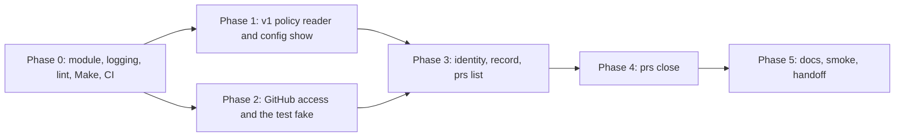

<!-- markdownlint-disable-file MD025 MD041 -->

# IMPL-0027: rgctl: standalone CLI in tools/rgctl to inspect v1 policy and find or close repo-guardian PRs

<!--toc:start-->
- [Objective](#objective)
- [Scope](#scope)
  - [In Scope](#in-scope)
  - [Out of Scope](#out-of-scope)
- [Ground truth checked before planning](#ground-truth-checked-before-planning)
- [Implementation Phases](#implementation-phases)
  - [Phase 0: Module skeleton and guardrails](#phase-0-module-skeleton-and-guardrails)
    - [Tasks](#tasks)
    - [Success Criteria](#success-criteria)
  - [Phase 1: v1 policy reader and config show](#phase-1-v1-policy-reader-and-config-show)
    - [Tasks](#tasks-1)
    - [Success Criteria](#success-criteria-1)
  - [Phase 2: GitHub access and the test fake](#phase-2-github-access-and-the-test-fake)
    - [Tasks](#tasks-2)
    - [Success Criteria](#success-criteria-2)
  - [Phase 3: Identity, the record, and prs list](#phase-3-identity-the-record-and-prs-list)
    - [Tasks](#tasks-3)
    - [Success Criteria](#success-criteria-3)
  - [Phase 4: prs close](#phase-4-prs-close)
    - [Tasks](#tasks-4)
    - [Success Criteria](#success-criteria-4)
  - [Phase 5: Docs, smoke, handoff](#phase-5-docs-smoke-handoff)
    - [Tasks](#tasks-5)
    - [Success Criteria](#success-criteria-5)
- [File Changes](#file-changes)
- [Testing Plan](#testing-plan)
- [Dependencies](#dependencies)
- [Open Questions](#open-questions)
  - [OQ1: Which go-github major version does the module use?](#oq1-which-go-github-major-version-does-the-module-use)
  - [OQ2: Where does the lint configuration for the module live?](#oq2-where-does-the-lint-configuration-for-the-module-live)
  - [OQ3: How many pull requests?](#oq3-how-many-pull-requests)
  - [OQ4: Which semver label do the PRs carry?](#oq4-which-semver-label-do-the-prs-carry)
  - [OQ5: How is GitHub faked in tests?](#oq5-how-is-github-faked-in-tests)
  - [OQ6: What does --config do in legacy mode under token auth?](#oq6-what-does---config-do-in-legacy-mode-under-token-auth)
  - [OQ7: How is the table rendered?](#oq7-how-is-the-table-rendered)
  - [OQ8: Is the module's coverage reported?](#oq8-is-the-modules-coverage-reported)
  - [OQ9: Where do the reader's fixtures come from?](#oq9-where-do-the-readers-fixtures-come-from)
- [References](#references)
<!--toc:end-->

## Objective

**Implements:** DESIGN-0035 (D1–D15, all open questions resolved 2026-10-05).

Build `rgctl`, a cobra CLI in its own Go module at `tools/rgctl`, that reads a v1 `guardian.hcl` without the v1 loader (`config show`), finds open repo-guardian pull requests by App author plus `repo-guardian/` branch prefix with every search hit verified through the Pull Requests API (`prs list`), writes them as a JSON record, and closes exactly the recorded PRs with a pointer comment, dry run by default (`prs close`). The module never requires the parent module, so the tool keeps building after v1's packages are deleted and after `v2` fast-forwards `main`.

## Scope

### In Scope

- `tools/rgctl`: its own `go.mod`, `main.go`, `internal/{v1config,ghapi,prs}`, tests and an `httptest` fake of the GitHub endpoints it uses.
- Make targets `build-rgctl`, `lint-rgctl`, `test-rgctl`, `test-coverage-rgctl`, wired into `lint`, `test`, `test-coverage`, `build` and `ci`.
- CI: a lint step for the module, the module's tests in the existing test job, and the `go` paths filter widened to nested `go.mod` and `go.sum` files.
- The depguard rule and the module-boundary check, probed once.
- `docs/operations/rgctl.md`, a `tools/rgctl/README.md`, a CLAUDE.md note, and the status flips on DESIGN-0035 and this plan.

### Out of Scope

- A goreleaser entry, signing or a `tools/rgctl/vX.Y.Z` tag: `go install ...@main` only (DESIGN-0035 D13).
- A bubbletea TUI (D12, deferred to v2 against the API).
- Any change to the product module, its `go.mod`, the chart or the database.
- Editing DESIGN-0032's cutover runbook: that lives on the `v2` line and gets its pointer to `rgctl` in a separate PR against `v2` (Phase 5 records the follow-up).
- Creating or uninstalling GitHub Apps, and the homelab smoke itself, which is operator-run.

## Ground truth checked before planning

| Fact | Where | Consequence |
| ---- | ----- | ----------- |
| ghinstallation v2.17.0 requires go-github **v75** | its `go.mod` | the module uses v75, not the product's v68 (OQ1) |
| cobra v1.10.2, charmbracelet/log v0.4.2, hcl v2.24.0 are current | Go module proxy | pinned in Phase 0 |
| `make lint` is `golangci-lint run ./...` at the root; `make test` and `make test-coverage` are `go test ./...` at the root | `Makefile` | none of them descend into a nested module, so the module needs its own targets and the aggregate targets must call them |
| CI lint uses `golangci/golangci-lint-action@v9` at the repository root with version `v2.12.2` | `.github/workflows/ci.yml` | a second step with `working-directory: tools/rgctl` is needed |
| the `go` paths filter is `**/*.go`, `go.mod`, `go.sum` | `ci.yml` | a renovate bump touching only `tools/rgctl/go.mod` and `go.sum` would skip every Go job; widen to `**/go.mod`, `**/go.sum` |
| `main` has no `depguard` configuration; the `v2` line has three rules and found by experiment that `**/internal/workflows/*.go` matched where `/**` did not | `.golangci.yml` on both lines, CLAUDE.md | the rule's glob is probed, not assumed |
| v1 PR identity: branches `repo-guardian/add-missing-files`, `repo-guardian/add-catalog-info`, `repo-guardian/set-custom-properties`; reconcile-log marker `<!-- repo-guardian:reconcile-log:v1 -->`; author `<app slug>[bot]` | `internal/checker/engine.go`, `internal/reconciler/custom_properties.go`, `internal/checker/drift.go` | copied as string constants into the tool with a comment naming the source; never imported |
| GitHub search: `author:app/<slug>`, `head:` is a prefix match, 30 requests per minute, 1000 results per query, `incomplete_results` | GitHub docs, checked 2026-10-05 | search pacing and the two warnings in Phase 2 and 3 |
| v1 example policies: `examples/guardian-full.hcl`, `examples/guardian-enterprise.hcl`; the chart ships `policy.config: ""` | repository | fixtures for the reader's goldens come from the two examples plus a hand-written legacy-mode file (OQ9) |

## Implementation Phases

Each phase builds on the previous one. A phase is complete when all its tasks are checked off and its success criteria are met.

Phases 1 and 2 are independent and can be built in parallel after Phase 0.

**Delivery (OQ3, OQ4):** one PR against `main` carries every phase, labelled `dont-release`; the phases are the order of work on the branch and are checked off here as they land, not separate reviews.

---

### Phase 0: Module skeleton and guardrails

Establishes the module, the command surface, logging, the lint boundary and the build and CI wiring, so every later phase lands inside a green `make ci`.

#### Tasks

- [x] 0.1 Create `tools/rgctl/go.mod` (`module github.com/donaldgifford/repo-guardian/tools/rgctl`, `go 1.26`) and `main.go`: cobra root command `rgctl` with persistent flags `--log-level` (default `info`) and `--no-color`, a `version` subcommand reading `debug.ReadBuildInfo` (module version, VCS revision, dirty flag), and the `config` and `prs` parent commands as empty groups. Pin cobra v1.10.2 and charmbracelet/log v0.4.2 now; go-github v75.0.0, ghinstallation v2.17.0 and hcl v2.24.0 are added by the phases that first import them, since `go mod tidy` drops an unused requirement.
- [x] 0.2 Exit codes: an `exitError{code int, err error}` type returned by commands and mapped once in `main` (0 none or done, 1 found or skipped, 2 usage or configuration, 3 operational), with cobra's own usage errors mapped to 2. `SilenceUsage` and `SilenceErrors` on, so the tool prints one error line through the logger, never a usage dump after a runtime failure.
- [x] 0.3 Logging: `internal/clog` builds a `*slog.Logger` from `charmbracelet/log` (`log.NewWithOptions(w, log.Options{ReportTimestamp: true, Level: ...})` wrapped by `slog.New`); colour follows the terminal, `NO_COLOR` and `--no-color`; a `Streams{Out, Log io.Writer}` value is threaded to commands so Phase 3 can move the log to stderr when a JSON record goes to stdout (DESIGN-0035 D15).
- [x] 0.4 Lint boundary (OQ2): enable `depguard` in the root `.golangci.yml` with one rule, files glob scoped to `tools/rgctl`, denying `github.com/donaldgifford/repo-guardian/internal` with the message "rgctl must outlive v1 and the controls rewrite", and `make lint-rgctl` (`cd tools/rgctl && golangci-lint run --config ../../.golangci.yml ./...`) also failing if `tools/rgctl/go.mod` contains a `require` on `github.com/donaldgifford/repo-guardian`. Probe once: add `import _ "github.com/donaldgifford/repo-guardian/internal/policy"` to `main.go`, run `make lint-rgctl`, confirm it fails with the rule's message (and that `go build` fails to resolve the import), remove the line, note the failing output in the PR description. Because the root config is shared, confirm `make lint` on the product module is unchanged by the enable (the glob matches nothing there).
  - **Probe result (2026-10-05).** Three layers, each observed failing, then restored to `0 issues`:
    1. The bare import does not resolve: `no required module provides package github.com/donaldgifford/repo-guardian/internal/policy` (typecheck, so depguard never runs).
    2. With `require` plus `replace => ../..` added to `go.mod`, the grep in `make lint-rgctl` fails first: `✗ tools/rgctl/go.mod names the product module; rgctl must not depend on it (DESIGN-0035 D4)`.
    3. Running golangci-lint past the grep: `main.go:16:2 depguard import 'github.com/donaldgifford/repo-guardian/internal/policy' is not allowed from list 'rgctl-boundary': rgctl must outlive v1 and the controls rewrite; it imports nothing from the product module`. The glob is `**/tools/rgctl/**` (a trailing `/**/*.go` would miss files directly in `tools/rgctl`).
    - Product lint: no new findings from enabling depguard. Locally it shows two typecheck errors from a stale, gitignored `build/api/api.gen.go` left by v2 work; CI checks out clean and never sees them.
- [x] 0.5 Makefile: `build-rgctl` (`cd tools/rgctl && go build -o ../../build/bin/rgctl .`), `lint-rgctl`, `test-rgctl` (`go test -v -race ./...` in the module), `test-coverage-rgctl` (profile to `coverage-rgctl.out` beside the root `coverage.out`, removed by `clean`); add them as prerequisites of `build`, `lint`, `test` and `test-coverage` so `make ci` and `make check` cover the module. One Makefile, no include.
- [x] 0.6 CI: in `ci.yml` add a second `golangci-lint-action@v9` step to the lint job with `working-directory: tools/rgctl` and `args: --config ../../.golangci.yml`; confirm the test job's `make test-coverage` now runs the module; widen the `go` paths filter with `'**/go.mod'` and `'**/go.sum'`; add a second `codecov-action` step uploading `coverage-rgctl.out` with `flags: rgctl`, and a `flags.rgctl` entry (`paths: [tools/rgctl/]`) in `.codecov.yml`. Check the PR's Codecov status: if the product's project number moved, exclude `tools/rgctl/` from the default status so the flag is the only place the tool is measured (OQ8).
- [x] 0.7 `tools/rgctl/README.md` stub with the `go install github.com/donaldgifford/repo-guardian/tools/rgctl@main` line and the three commands; confirm renovate's `gomod` manager lists the new `go.mod` in its next dependency dashboard run (observe, no config change expected).
  - Renovate observation is `deferred - human required`: it shows up on the next dependency-dashboard run after merge. The `gomod` manager discovers every `go.mod` by default, so no config change is expected.
- [x] 0.8 Tests: `main_test.go` table test for the exit-code mapping; `clog` test that `--no-color` and `NO_COLOR` produce no escape sequences and that the level flag is honoured.

#### Success Criteria

- `make ci` is green and its log shows `lint-rgctl`, `test-rgctl` and `build-rgctl` running.
- From a clean clone, `cd tools/rgctl && go install .` produces a binary whose `rgctl version` prints the module path and revision. (`go install ./tools/rgctl` from the root cannot work: the root is a different module. Verified 2026-10-05.)
- `git diff --stat -- go.mod go.sum` against `main` is empty: the product module is untouched.
- The depguard probe is recorded in the PR description with the failing lint output.
- The CI run for the PR shows the module lint step and the module's tests in the test job.

---

### Phase 1: v1 policy reader and `config show`

Delivers `rgctl config show`, a loose reader of a v1 policy file that depends on hclparse only (DESIGN-0035 D12). Also provides the org list that `prs list --config` uses in Phase 3.

#### Tasks

- [x] 1.1 `internal/v1config` types: `Document{Path, Orgs []string, LegacyMode bool, Guardian []Attr, Locals []Attr, Ignore []string, Defaults *PRBlock, Rules []Rule, Unrecognised []Item}`, `Rule{Type, Name string, Enabled *bool, Paths []string, Check, Template, Target string, Scope []string, Ignore []string, When *Attr, Assertions []Attr, Reconcilers []Reconciler, PR *PRBlock}`, `Reconciler{Type string, Attrs []Attr}`, `Attr{Name, Source string, Line int}`, `Item{Kind, Name, Source string, Line int}`. Every value carries its source text; evaluation is never attempted.
- [x] 1.2 Reader: `hclparse.NewParser().ParseHCLFile`; `body.PartialContent` with the six top-level block types (`locals`, `guardian`, `ignore`, `scope`, `defaults`, `rule <type> <name>`); per block, `PartialContent` again with the attributes and nested blocks the tool understands (`scope`, `ignore`, `when`, `assertion`, `reconcile <type>`, `pr`); everything left in the remaining body goes to `Unrecognised` with its range. Literal lists (`paths`, `orgs`, `labels`) are decoded with a nil evaluation context only when `expr.Variables()` is empty; otherwise the source text is kept.
  - **Implementation note.** The reader walks the `hclsyntax` body against the same per-block schemas instead of calling `PartialContent`: the remaining body `PartialContent` returns hides the consumed items in unexported fields, so it cannot enumerate the unknown blocks and attributes this task needs to list. Behaviour is as specified: known items decode, everything else lands in `Unrecognised` with its line. Rule kinds known: `file`, `setting`, `branch_protection`, with the attribute lists of `internal/policy` as of 2026-10-05; kind-specific attributes go in `Rule.Attrs`.
- [x] 1.3 `config show <file>`: table output grouped as orgs, guardian, rules, pr, ignore, unrecognised (the sections of DESIGN-0035's reader table); `--format json` emits `Document`; a parse diagnostic or a missing file exits 2 with the HCL diagnostic text; a file with no `scope` block reports `LegacyMode: true` and the orgs line "every installed org (legacy mode)".
- [x] 1.4 Fixtures (OQ9): `testdata/guardian-full.hcl` and `testdata/guardian-enterprise.hcl` copied from `examples/` with a header comment naming the source and date, plus `testdata/legacy-mode.hcl` (no `scope`), `testdata/unknown-block.hcl` (a `widget {}` block and an unknown rule attribute) and `testdata/broken.hcl`. Golden JSON per fixture under `testdata/golden/`, regenerated with `-update`.
- [x] 1.5 Tests: goldens; unknown block and attribute land under `Unrecognised` with the right line; `locals` and an interpolated attribute show source text; `broken.hcl` exits 2; `Orgs()` helper returns the explicit list or legacy mode.
- [x] 1.6 `rgctl config show examples/guardian-full.hcl` run by hand and pasted into the PR.
  - Ran 2026-10-05: exit 0, no warnings, `UNRECOGNISED (none)`; all 12 rules (7 file, 4 setting, 1 branch protection), every `pr` block and both reconcilers rendered. Output pasted into the PR description.

#### Success Criteria

- All five fixtures have passing goldens; `go test -race ./internal/v1config/...` is green.
- An unknown top-level block, an unknown rule attribute and an unknown reconciler attribute each appear under `unrecognised` with a line number, and nothing else about the file changes.
- `make lint-rgctl` is green with no import of `internal/policy` (the depguard rule would say otherwise).
- Both example policies render through `config show` without warnings.

---

### Phase 2: GitHub access and the test fake

Delivers `internal/ghapi`, the only package that talks to GitHub, with both credential shapes (D10), and a stateful `httptest` fake the later phases test against.

#### Tasks

- [x] 2.1 `Credentials` from flags and environment: `--app-id`/`RGCTL_APP_ID`, `--private-key-file`/`RGCTL_PRIVATE_KEY_FILE`, `GH_TOKEN` (env only), `--bot-login`/`RGCTL_BOT_LOGIN`, `--github-host`/`RGCTL_GITHUB_HOST`. Validation: App auth needs id and key file; token auth needs `--bot-login`; both present → App wins with a warning; neither → exit 2. The key is read from the path at startup and never logged.
- [x] 2.2 App mode: `ghinstallation.NewAppsTransportKeyFromFile` → JWT client → `Apps.Get(ctx, "")` for the slug, bot login `<slug>[bot]`; `Apps.ListInstallations` paginated into a map of account login → installation id; `ghinstallation.NewFromAppsTransport(atr, id)` per org; GHES through the transport's `BaseURL` and `gh.NewClient(...).WithEnterpriseURLs`.
- [x] 2.3 Token mode: `gh.NewClient(nil).WithAuthToken(token)`, GHES the same way; org repository listing through `Repositories.ListByOrg`.
- [x] 2.4 Operations behind a small `Client` interface, one method per endpoint the design names: `SearchOpenPRs(ctx, org, botLogin, headPrefix) (hits, Status)` paging 100 per page to the 1000th result with `Status{Incomplete, Capped, Pages}`; `GetPR`; `ListPRCommits` (page until the first non-bot author or committer); `ListOpenPRs(repo)` paginated; `ListInstallationRepos` and `ListOrgRepos` paginated; `ListComments`, `CreateComment`; `ClosePR` (`PullRequests.Edit` with `state=closed`); `DeleteBranch` (`Git.DeleteRef("heads/…")`, a 422 "Reference does not exist" is success).
- [x] 2.5 Rate limits: a `pacer` that spaces search calls at least 2 s apart (30 per minute) through an injectable clock; `*gh.RateLimitError` and `*gh.AbuseRateLimitError` are retried once after `Reset`/`RetryAfter` with a log line, then surfaced as operational errors (exit 3). Every request carries a `User-Agent` of `rgctl/<version>`.
- [x] 2.6 `internal/ghapi/ghapitest`: an `httptest.Server` fake with handlers for `/app`, `/app/installations`, `/installation/repositories`, `/orgs/{org}/repos`, `/search/issues`, `/repos/{o}/{r}/pulls`, `/repos/{o}/{r}/pulls/{n}`, `/repos/{o}/{r}/pulls/{n}/commits`, `/repos/{o}/{r}/issues/{n}/comments`, `/repos/{o}/{r}/git/refs/heads/{b}`. It is **stateful**: a created comment is returned by the next list, a closed PR reads as closed, a deleted ref 422s afterwards (the mock-fidelity rule from CLAUDE.md). It records every request (method, path) for call-count assertions and can inject `incomplete_results`, a page count that reaches 1000, a 403 with `Retry-After`, and a failure on any one route.
- [x] 2.7 Tests per operation against the fake, both auth modes (the App path asserts the `Authorization: Bearer` JWT on `/app` and the installation token afterwards), GHES base URL, the pacer (timestamps from the injected clock), the single retry on 403, and the 422-on-delete success.

#### Success Criteria

- Every `Client` method has a test against the fake and none opens a network connection (`-race`, no `GITHUB_TOKEN` in the environment).
- A search that returns `incomplete_results: true` or a 1000th hit sets `Status.Incomplete` or `Status.Capped`.
- A 403 with `Retry-After: 1` on one call succeeds on the retry and logs once; a second 403 exits 3.
- Credentials validation table test covers the six combinations (App only, token only, both, neither, App without key, token without bot login).

---

### Phase 3: Identity, the record, and `prs list`

Delivers `rgctl prs list` end to end (D1, D2, D8), the JSON record (D5), and the stream rule for logs (D15).

#### Tasks

- [x] 3.1 `internal/prs` identity: `Identity{BotLogin string, Prefix string, Branches []string}` and `Match(pr) (ok bool, reason string)`: open, author login equal case-insensitively, head ref has the prefix or equals a listed branch, head repository id equals the base repository id (a fork is never ours). The three v1 branch names and the reconcile-log marker are string constants with a comment naming their source files.
- [x] 3.2 Classification: `edited` when any commit's author or committer login is not the bot (an unresolved author with a non-bot committer counts), reading commit pages until the first such commit; `reconcile_log` when any comment's first line is the v1 marker; `edited_by` collects the logins seen.
- [x] 3.3 Record types matching DESIGN-0035's Data Model exactly (`schema_version: 1`, `generated_at`, `selection`, `bot_login`, `prs[]`, `summary{hits, verified, dropped, clean, edited, incomplete}`), JSON tags in snake_case, `Load`/`Save` with a schema-version check.
- [x] 3.4 Selection: `--repo org/name` → `ListOpenPRs`; `--org` → search then `GetPR` per hit, or `--exhaustive` → repositories then `ListOpenPRs`; `--config path` → `v1config.Orgs()`; legacy mode under App auth → every installation; legacy mode under token auth → exit 2 naming App credentials or an explicit `--org` (OQ6). `--branch` repeatable narrows the identity to exact names.
- [x] 3.5 Warnings and summary: `Incomplete` or `Capped` → one warning naming `--exhaustive`; per-org progress line "org X: N pages, H hits, V verified, D dropped"; a verify that finds the PR closed drops it; an org that fails continues to the next and the run exits 3 at the end.
- [x] 3.6 Output: `text/tabwriter` table (OQ7) (repository, number, branch, age, edited, URL) or `--format json` to `--out <path>` or stdout; when the record goes to stdout the log moves to stderr for the run (Phase 0.3's `Streams`).
- [x] 3.7 Exit codes: 0 none found, 1 found, 2 usage, 3 any org failed.
- [x] 3.8 Tests: identity table test (author case, prefix versus exact branch, fork head, closed); end-to-end `prs list --org` against the fake with two search pages, a stale hit that verifies as closed, a non-bot author, a fork, and an edited PR whose human commit is on page two; `--exhaustive`; `--repo`; `--config` with explicit orgs and with legacy mode; JSON golden of the record; the stream rule (stdout holds only JSON when `--format json` has no `--out`); each exit code.

#### Success Criteria

- The end-to-end cases above pass under `-race` against the fake; `rgctl prs list --org X --format json | jq .summary` works with the log on stderr.
- Search is never the last word: the fake's request log shows one `GET /repos/.../pulls/{n}` per hit.
- Coverage of `internal/prs` is at least 80 percent.
- A run against the fake with `incomplete_results` prints exactly one warning that names `--exhaustive`.

---

### Phase 4: `prs close`

Delivers the close path (D3, D9, D11, D14): re-read, plan, comment, close, optional branch deletion, idempotent, `--force` for edited PRs.

#### Tasks

- [x] 4.1 Inputs: `--from <record.json>` (schema version checked) or the Phase 3 selection flags; `--yes`, `--force`, `--delete-branch`, `--comment <text>`, `--out <path>` for the result record.
- [x] 4.2 Plan: for every PR, `GetPR` again and re-apply the identity rule (`skipped_not_ours`), detect `already_closed`, re-classify edited (`skipped_edited` unless `--force`), compare the head SHA with the record and log when it moved. Without `--yes` the plan is printed and nothing else happens.
- [x] 4.3 Act, per PR, in order: comment (first line `<!-- rgctl:closed-by-migration:v1 -->`, then the default text naming the tool, the date and repo-guardian v2's per-control PRs, or `--comment`; skipped when a comment with the marker already exists), close (`ClosePR`), then branch deletion only with `--delete-branch` and never for an edited PR even under `--force`; a missing ref is not an error. A failing step records `error` with the message and the run continues with the next PR.
  - **Addition found in testing.** If the close succeeds and branch deletion then fails, a plain re-run would see the PR as already closed and never finish. With `--yes --delete-branch`, a closed PR whose comments carry rgctl's own marker and which still has no foreign commits gets its branch deleted, after a `BranchExists` read so a finished PR costs no write. A PR someone else closed is never touched. `ghapi` gained `BranchExists` for this.
- [x] 4.4 Result record: the input record plus `result` per PR (`planned`, `commented`, `closed`, `branch_deleted`, `already_closed`, `skipped_edited`, `skipped_not_ours`, `error`), to `--out` or stdout with the same stream rule; summary line.
- [x] 4.5 Exit codes: 0 everything planned was done or nothing to do, 1 any `skipped_edited`, 2 usage (no `--from` and no selection, bad schema version), 3 any `error`.
- [x] 4.6 Tests against the fake: dry run performs zero non-GET requests; a second `--yes` run posts no second comment and sends no second close (request log); fault injection at comment, close and delete leaves the earlier steps done and the result `error`; `--force` closes an edited PR and still never deletes its branch; a `--from` record whose PR was closed meanwhile yields `already_closed`; a record whose PR gained a human commit since listing yields `skipped_edited`; `--delete-branch` on an already-deleted ref succeeds.

#### Success Criteria

- The idempotency test proves one comment and one close across two `--yes` runs by counting requests on the fake.
- The order test proves comment precedes close precedes delete, and that a failure at each step leaves the PR explaining itself.
- No test and no code path writes without `--yes`; the fake asserts it.
- `rgctl prs close --from record.json` with no `--yes` exits 0 and prints the plan; with edited PRs present and no `--force` it exits 1.

---

### Phase 5: Docs, smoke, handoff

Makes the tool findable and records the one human-run check.

#### Tasks

- [x] 5.1 `docs/operations/rgctl.md`: install, credentials, the three commands with examples, the record-review-close cutover shape, exit codes, the stream rule; add to the mkdocs nav under Operations.
- [x] 5.2 CLAUDE.md: a short `tools/rgctl` entry (own module, never requires the parent, Make targets, the lint probe, go-github v75 versus the product's v68).
- [x] 5.3 Complete `tools/rgctl/README.md`; one paragraph in the root README pointing at it.
- [x] 5.4 Homelab smoke (operator): `rgctl prs list --org <personal account> --format json --out smoke.json` compared with the GitHub UI, then `rgctl prs close --from smoke.json --yes` on one throwaway PR; paste the summary lines here. Mark `deferred - human required` if not run before merge.
  - Run 2026-10-06 against `donaldgifford` with the homelab App (ID 2836059). The first `prs list` read every PR as edited by `web-flow`, GitHub's committer for Contents API writes, so `close` would have skipped all of them; fixed in `16329b1` (the committer `web-flow` no longer counts, the author decides). Search with `org:` works for a personal account. After the fix:
    - `prs list --org donaldgifford --format json --out smoke.json`: `summary found=21 hits=21 verified=21 dropped=0 clean=21 edited=0 incomplete_orgs=0`, matching the 21 open PRs in the GitHub UI.
    - `prs close --from smoke-one.json` (dry run, `repo-guardian-test-repo#3`): `summary planned=1 closed=0 branch_deleted=0 already_closed=0 skipped_edited=0 skipped_not_ours=0 error=0`.
    - `prs close --from smoke-one.json --yes --delete-branch`: `summary planned=0 closed=1 branch_deleted=1 already_closed=0 skipped_edited=0 skipped_not_ours=0 error=0`. On GitHub: PR closed, comment by `donaldgifford-repo-guardian[bot]` whose first line is `<!-- rgctl:closed-by-migration:v1 -->`, branch returns 404.
    - The same command again: `summary planned=0 closed=0 branch_deleted=0 already_closed=1 skipped_edited=0 skipped_not_ours=0 error=0`.
- [ ] 5.5 Follow-up on the `v2` line: a one-line pointer to `rgctl` in DESIGN-0032's runbook steps 3 and 6, as its own PR against `v2`; link it here.
  - `deferred - blocked`: DESIGN-0032 is not on `v2` yet. It exists only in open PR #202 (`docs/controls-and-policies` into `v2`), so a separate PR against `v2` has nothing to edit. Add the pointer in #202 before it merges, or in a follow-up against `v2` after it does.
- [x] 5.6 `docz update design impl`: DESIGN-0035 → Implemented, IMPL-0027 → Completed.

#### Success Criteria

- `mkdocs build` passes with the new page in the nav (use the repository's docs target if one exists, otherwise `mkdocs build --strict` from mise).
- CLAUDE.md and both READMEs describe the module boundary and the install line.
- The smoke result, or its explicit deferral, is recorded in 5.4.
- Both status flips are committed.

## File Changes

| Path | Change |
| ---- | ------ |
| `tools/rgctl/go.mod`, `go.sum` | new module, five direct dependencies |
| `tools/rgctl/main.go`, `cmd_config.go`, `cmd_prs_list.go`, `cmd_prs_close.go`, `cmd_version.go` | cobra commands, exit-code mapping |
| `tools/rgctl/internal/clog/` | slog logger over charmbracelet/log, `Streams` |
| `tools/rgctl/internal/v1config/` | loose HCL reader, `testdata/`, goldens |
| `tools/rgctl/internal/ghapi/` | credentials, App and token clients, operations, pacer |
| `tools/rgctl/internal/ghapi/ghapitest/` | stateful httptest fake |
| `tools/rgctl/internal/prs/` | identity, classification, record, list and close logic |
| `tools/rgctl/README.md` | install and usage |
| `Makefile` | `build-rgctl`, `lint-rgctl`, `test-rgctl`, `test-coverage-rgctl`, wired into the aggregates |
| `.github/workflows/ci.yml` | module lint step, widened `go` filter, coverage upload |
| `.golangci.yml` | depguard enabled with the one rule, files glob scoped to `tools/rgctl` (OQ2) |
| `.codecov.yml` | `flags.rgctl` for the module's coverage (OQ8) |
| `docs/operations/rgctl.md`, `mkdocs.yml` | operator page |
| `CLAUDE.md`, `README.md` | module note, pointer |
| `docs/design/0035-*.md`, `docs/impl/0027-*.md` | status flips |

## Testing Plan

- Unit tests per package under `-race`, no network: the fake is the only GitHub.
- Goldens for the reader (five fixtures, copied into the module per OQ9) and for the JSON record, regenerated only with `-update`.
- Request-log assertions on the fake for idempotency, order and dry-run guarantees (the mock-fidelity rule: a list after a write must return the write).
- The depguard probe, once, recorded in the PR description.
- Coverage target 80 percent for `internal/prs` and `internal/v1config`, uploaded under the `rgctl` Codecov flag so the product's number and threshold are untouched (OQ8).
- One operator-run smoke on the homelab, recorded in Phase 5.

## Dependencies

| Module | Version | Why |
| ------ | ------- | --- |
| `github.com/spf13/cobra` | v1.10.2 | commands, help, completion (DESIGN-0035 D7) |
| `github.com/charmbracelet/log` | v0.4.2 | slog handler with colour (D15) |
| `github.com/google/go-github/v75` | v75.0.0 | REST client, the version ghinstallation requires (OQ1) |
| `github.com/bradleyfalzon/ghinstallation/v2` | v2.17.0 | App JWT and installation tokens |
| `github.com/hashicorp/hcl/v2` | v2.24.0 | `hclparse`, `PartialContent` |
| Go | 1.26 (mise) | matches the product |

No dependency on the product module, ever.

## Open Questions

All nine resolved 2026-10-05; the resolutions are folded into the phases above.

### OQ1: Which go-github major version does the module use?

**Resolved 2026-10-05: (a).** v75, the version ghinstallation v2.17.0 requires.

- (a) ✅ recommended: v75, the version ghinstallation v2.17.0 requires, so the module graph holds one copy of go-github and the transport and client agree on types.
- (b) v68, mirroring the product's `internal/github` so patterns can be read across; the module then carries v68 and v75 side by side.
- other:

### OQ2: Where does the lint configuration for the module live?

**Resolved 2026-10-05: (a).** The root `.golangci.yml`, run from `tools/rgctl` with `--config ../../.golangci.yml`; depguard is enabled there with the one rule scoped to the module.

- (a) ✅ recommended: reuse the root `.golangci.yml` by running `golangci-lint run --config ../../.golangci.yml ./...` from `tools/rgctl` (and the same `args` on the CI step with `working-directory: tools/rgctl`), adding the `depguard` enable and the one rule, scoped by glob to `tools/rgctl`, to the root file. One linter configuration, as there is one Makefile; the rule matches nothing in the product module, so enabling depguard there changes nothing today.
- (b) A module-local `tools/rgctl/.golangci.yml` copying the root linter set and adding the rule. Self-contained, and a second copy of fifty linter settings to keep in step by hand (golangci-lint v2 has no extends).
- other:

### OQ3: How many pull requests?

**Resolved 2026-10-05: other.** One PR for the whole tool: a per-phase split is not worth it for a tool this size. The phases stay as the order of work and are checked off on the branch as they land.

- (a) ✅ recommended: one PR per phase against `main` (Phases 1 and 2 may ship together), each small enough to review in one sitting, each green on `make ci`; `feat/rgctl` stays the integration branch and this plan is checked off as each lands.
- (b) A single PR for the whole tool. Fewer reviews, one large diff.
- other:

### OQ4: Which semver label do the PRs carry?

**Resolved 2026-10-05: (a).** `dont-release` on the one PR.

- (a) ✅ recommended: `dont-release` on every one. The product binary is untouched and root tags do not version a nested module, so a release would ship nothing new.
- (b) `patch` on the last PR, to cut a root tag that marks "rgctl is on main", even though `go install ...@main` needs no tag.
- other:

### OQ5: How is GitHub faked in tests?

**Resolved 2026-10-05: (a).** A hand-written stateful `httptest` server with a request log.

- (a) ✅ recommended: a hand-written stateful `httptest` server (`ghapitest`) with a request log, the pattern of `internal/github/client_test.go`, so list-then-act paths are tested against real HTTP shapes and a write is visible to the next read.
- (b) A `Client` interface with mockery-generated mocks driven by expectations. Faster to write, but the IMPL-0013 lesson applies: an always-empty list mock makes idempotency tests vacuous.
- other:

### OQ6: What does `--config` do in legacy mode under token auth?

**Resolved 2026-10-05: (a).** Exit 2, naming App credentials or an explicit `--org` as the way forward.

- (a) ✅ recommended: exit 2 with "legacy mode means every installed org; that needs App credentials or an explicit --org". Token auth cannot list the App's installations, and guessing from the token's own org memberships could scan orgs the App was never in.
- (b) Enumerate the orgs the token can see (`/user/orgs`) with a warning that this may differ from the App's installations.
- other:

### OQ7: How is the table rendered?

**Resolved 2026-10-05: (a).** `text/tabwriter`.

- (a) ✅ recommended: `text/tabwriter` from the standard library: aligned columns, zero dependencies, pipes cleanly.
- (b) `charmbracelet/lipgloss`'s table for borders and colour. Prettier, one more dependency, and borders do not pipe well.
- other:

### OQ8: Is the module's coverage reported?

**Resolved 2026-10-05: (a).** Uploaded to Codecov under its own `rgctl` flag.

- (a) ✅ recommended: upload `build/coverage-rgctl.out` to Codecov under its own flag (`rgctl`) so it is visible but does not move the product's number or threshold.
- (b) Run the tests, skip the upload; coverage is checked locally only.
- other:

### OQ9: Where do the reader's fixtures come from?

**Resolved 2026-10-05: (a).** Copies under the module's `testdata/` with a source header.

- (a) ✅ recommended: copies of the two `examples/*.hcl` files under the module's `testdata/` with a header naming the source and date, plus hand-written legacy, unknown-block and broken files. The module does not depend on the repository layout, and `go test` works from a module checkout alone.
- (b) Read `../../examples/*.hcl` at test time. Always current, and the tests break if the directory moves or the module is extracted later.
- other:

## References

- DESIGN-0035: rgctl, decisions D1–D15.
- DESIGN-0032 (v2 line): cutover runbook steps 3 and 6, D4, D27.
- `internal/checker/engine.go`, `internal/reconciler/custom_properties.go`, `internal/checker/drift.go`: the v1 branch names, titles and reconcile-log marker copied as constants.
- `internal/github/client_test.go`: the `httptest.Server` pattern the fake follows.
- CLAUDE.md: the mock-fidelity rule for list-then-act tests; the depguard glob note.
- GitHub docs (2026-10-05): searching issues and pull requests; REST search limits.
