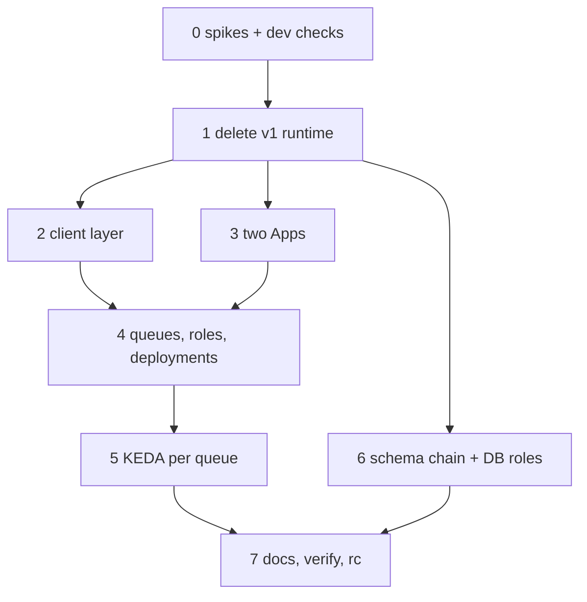

<!-- markdownlint-disable-file MD024 MD025 MD041 -->

# IMPL-0028: Controls foundations: v1 runtime removal, client split, two Apps, two queues and the fresh schema

**Status:** Draft
**Author:** Donald Gifford
**Date:** 2026-10-07

<!--toc:start-->
- [Objective](#objective)
- [Scope](#scope)
  - [In Scope](#in-scope)
  - [Out of Scope](#out-of-scope)
- [How the phases are ordered](#how-the-phases-are-ordered)
- [Implementation Phases](#implementation-phases)
  - [Phase 0: Spikes and dev checks](#phase-0-spikes-and-dev-checks)
    - [Tasks](#tasks)
    - [Success Criteria](#success-criteria)
  - [Phase 1: Delete the v1 runtime](#phase-1-delete-the-v1-runtime)
    - [Tasks](#tasks-1)
    - [Success Criteria](#success-criteria-1)
  - [Phase 2: GitHub client layer](#phase-2-github-client-layer)
    - [Tasks](#tasks-2)
    - [Success Criteria](#success-criteria-2)
  - [Phase 3: Two GitHub Apps](#phase-3-two-github-apps)
    - [Tasks](#tasks-3)
    - [Success Criteria](#success-criteria-3)
  - [Phase 4: Two task queues, two roles, two worker deployments](#phase-4-two-task-queues-two-roles-two-worker-deployments)
    - [Tasks](#tasks-4)
    - [Success Criteria](#success-criteria-4)
  - [Phase 5: KEDA per queue on the Prometheus trigger](#phase-5-keda-per-queue-on-the-prometheus-trigger)
    - [Tasks](#tasks-5)
    - [Success Criteria](#success-criteria-5)
  - [Phase 6: The controls schema chain and the two database roles](#phase-6-the-controls-schema-chain-and-the-two-database-roles)
    - [Tasks](#tasks-6)
    - [Success Criteria](#success-criteria-6)
  - [Phase 7: Documentation, verification and the release candidate](#phase-7-documentation-verification-and-the-release-candidate)
    - [Tasks](#tasks-7)
    - [Success Criteria](#success-criteria-7)
- [File Changes](#file-changes)
- [Testing Plan](#testing-plan)
- [Dependencies](#dependencies)
- [Open Questions](#open-questions)
  - [OQ1: Does Foundations keep the v2 rc releasable?](#oq1-does-foundations-keep-the-v2-rc-releasable)
  - [OQ2: Where do the Phase-0 results go?](#oq2-where-do-the-phase-0-results-go)
  - [OQ3: Does the v1 runtime deletion land before the client split?](#oq3-does-the-v1-runtime-deletion-land-before-the-client-split)
  - [OQ4: Which GraphQL client?](#oq4-which-graphql-client)
  - [OQ5: What is the Writer package called?](#oq5-what-is-the-writer-package-called)
  - [OQ6: Where do the client interfaces live before IMPL-0029?](#oq6-where-do-the-client-interfaces-live-before-impl-0029)
  - [OQ7: Is the temporal KEDA trigger kept alongside prometheus?](#oq7-is-the-temporal-keda-trigger-kept-alongside-prometheus)
  - [OQ8: How many release candidates does Foundations cut?](#oq8-how-many-release-candidates-does-foundations-cut)
  - [OQ9: How many PRs?](#oq9-how-many-prs)
  - [OQ10: Does all topology carry both Apps' keys?](#oq10-does-all-topology-carry-both-apps-keys)
  - [OQ11: Where does the controls chain live?](#oq11-where-does-the-controls-chain-live)
- [References](#references)
<!--toc:end-->

## Objective

Build the structure the controls model runs on, without yet evaluating a
control: delete the v1 runtime IMPL-0025 left behind, split the GitHub
client into the `Reader`, `PRObserver` and `Writer` surfaces with the
GraphQL write path and a throttle classifier that sees it, introduce the
second GitHub App, the second task queue and the evaluator/remediator
roles on their own worker deployments, move KEDA to one Prometheus-
triggered object per queue, and lay down the fresh controls schema chain
with its two operator-provisioned database roles. Phase 0 settles every
GitHub, Temporal and database behaviour the designs rely on but neither
the code nor the documentation confirms (INV-0022), on the homelab dev
install, before any phase that depends on the answer.

The v2 release candidate stays releasable throughout (OQ1): new pieces
land beside the old ones. IMPL-0029 performs the switch-over that
retires `internal/checker`, `internal/findings`, `RepoWorkflow` and the
rc schema.

**Implements:** DESIGN-0029, DESIGN-0030, DESIGN-0031 and DESIGN-0032 as
amended 2026-10-06 (D28 to D32), the KEDA half of DESIGN-0028 (folded in
from IMPL-0026), and the INV-0022 decisions.

## Scope

### In Scope

- Phase 0: the ten INV-0022 spikes, and IMPL-0025's homelab checks 9.1,
  9.3, 9.8, 11.7 and 11.8, run against the dev install (which runs the
  v2 rc; prod runs v1, and both are replaced by one fresh v2 install at
  the end of IMPL-0030).
- Deleting the v1 runtime (IMPL-0025 16.1 to 16.8) and the dead Valkey
  templates (17.5).
- `internal/control` created as a leaf holding only the client-facing
  interfaces and value types (`Reader`, `PRObserver`, `Writer`,
  `RepositorySettings`, `Ruleset`, `Label`, `PullRequest`, `Commit`,
  `FileChange`) (OQ6); IMPL-0029 adds `Definition`, `Rule` and the rest.
- The Reader and PRObserver implemented on `internal/github`; the Writer
  in its own package with a depguard rule; the GraphQL client; the
  throttle classifier for GraphQL and REST 429; per-bucket budget
  snapshots; update-branch with `expected_head_sha`; ruleset reads with
  parents and pagination; PR listing with author id, type and head
  repository id.
- Two Apps: two credential sets in config and the chart, one webhook
  URL per App (D29), the `installation.app_id` cross-check, the
  permission printer.
- Two task queues (`repo-guardian-eval`, `repo-guardian-remediate`), the
  `evaluator` and `remediator` roles, one worker deployment per role
  (D28), per-role schedules and registration, priority 1, the
  App-keyed budget workflow, `DescribeTaskQueue` on both queues, a
  signal-with-start activity helper, the replacement env vars.
- KEDA: one `ScaledObject` per role on the Prometheus trigger, from
  IMPL-0026 tasks 2.4, 2.5, 2.6, 2.9, 5.3, 6.1 to 6.3 and 6.9.
- The controls goose chain as its own directory, `00001_core` and the
  role grants, `rg_evaluator` and `rg_remediator` provisioned the way
  `repoguardian_ro` is today (D31), and `pgtest` extended to an owner
  plus the two roles.

### Out of Scope

- The catalogue, the policy loader, resolution, control types,
  `EvaluationWorkflow`, `control_results`, the API and UI re-key,
  posture and monitoring regeneration, and the switch-over that deletes
  the checker, findings, `RepoWorkflow` and the rc schema (IMPL-0029).
- `00002_controls_policy`, `00003_controls_results` and
  `00004_compliance` (IMPL-0029 and IMPL-0030 own their tables; this
  plan creates the chain, `00001_core` and the role plumbing).
- `RemediationWorkflow`, the PR lifecycle, every write a control type
  makes, the cutover runbook and the fresh homelab install (IMPL-0030).
- Credential reload and OpenBao-issued certificates (IMPL-0026, now
  auth-only).
- Any change to the rc's behaviour beyond what deleting the v1 runtime
  removes.

## How the phases are ordered

Phase 0 runs first because four of its answers change code in later
phases: the GraphQL commit's error shape and limits (Phase 2), the
Evaluation App's minimal permissions (Phase 3), per-queue backlog labels
(Phase 5) and role provisioning on each Postgres mode (Phase 6). A spike
whose answer contradicts a design amends the design, in the same PR as
the spike's write-up, before the dependent phase starts.

Phase 1 runs next (OQ3): every later phase edits `cmd/repo-guardian`,
`internal/config`, the chart and `internal/metrics`, and doing that
around a dead v1 runtime doubles the edits. Phases 2 and 6 are
independent of each other and of Phase 3. Phase 4 needs Phase 3 (the
App dimension on budgets and discovery) and Phase 2 (the client split
the roles wire). Phase 5 needs Phase 4's queues and the Phase 0 label
answer. Phase 7 needs all.

The plan lands as one PR into `v2` with the `dont-release` label (OQ9).
Each phase still leaves `make ci` and `make test-integration` green, and
a task that needs the maintainer is marked `deferred - human required`
instead of holding up the rest. The release
candidate is cut once, at the end (OQ8).

## Implementation Phases

Each phase builds on the previous one. A phase is complete when all its
tasks are checked off and its success criteria are met.

---

### Phase 0: Spikes and dev checks

Every spike below names what to run, what to record and which design
text its answer can change. Results go in an addendum to INV-0022,
"Phase-0 results" (OQ2). Spikes that write to GitHub or need homelab
access are run by the maintainer; Claude prepares the scripts and the
write-up.

#### Tasks

- [ ] 0.1 **Dev Temporal baseline (IMPL-0025 9.1, human-run).** On the
  dev install, record the server version (must be at least 1.31),
  persistence and visibility stores, `matching.enableFairness`, frontend
  TLS, and whether the `repo-guardian` namespace exists. Also record the
  current version of worker deployment `repo-guardian` and the task
  queues it has polled (`temporal worker deployment describe
  --deployment-name repo-guardian`).
- [ ] 0.2 **Bring dev in line with `contrib/temporal/` (IMPL-0025 9.3,
  human-run).** Apply the deviations 0.1 found or record why each stays.
- [ ] 0.3 **mTLS smoke (IMPL-0025 9.8, human-run).** From a dev machine,
  start and terminate a throwaway workflow on the dev frontend over the
  client certificate the chart mounts.
- [ ] 0.4 **Budget burst (IMPL-0025 11.7, human-run).** Run `cmd/rg-burst`
  (`-tags burst`) with 20,000 acquire/report pairs against one
  installation on dev. Record p50/p99 latency, history size and frontend
  CPU, and set the `InstallationWorkflow` ContinueAsNew threshold from
  them. The budget workflow is reused under `installation/<app>/<id>`,
  so the threshold carries into Phase 4.
- [ ] 0.5 **Budget branch on the live build (IMPL-0025 11.8,
  human-run).** Confirm dev's running build takes the `budget-v1` branch
  with zero `WorkflowTaskFailed` over a day of checks, and capture a
  fresh `InstallationWorkflow` history for the replay suite.
- [ ] 0.6 **GraphQL commit (INV-0022 spike 1, human-run against a
  throwaway repository).** Through a client built on the real transport
  chain (otelhttp → rate-limit transport → ghinstallation): a
  `createCommitOnBranch` with a correct `expectedHeadOid`, with a stale
  one, with 100 and 101 files, and with a 1 MiB and a 1 MiB + 1 file.
  Record the stale-head error's exact shape (HTTP status, `errors[].type`,
  message), the real limits, the `x-ratelimit-resource` and remaining
  headers, and whether the commit is signed. Can change DESIGN-0031 D8
  and AR-0031-09.
- [ ] 0.7 **update-branch (spike 2, human-run).** On a throwaway
  repository: an up-to-date PR, a PR with a conflicting base change, and
  a call with a stale `expected_head_sha`. Record status codes and
  bodies, and how long the background merge takes to move the head. Can
  change DESIGN-0032 D17 and the flowchart.
- [ ] 0.8 **Evaluation App minimal permissions (spike 3, human-run).**
  Register a test App with Metadata read, Contents read, Pull requests
  read and organisation Custom properties read only. Confirm
  `GET /repos` returns the merge-policy settings fields, rulesets return
  `source_type` and, fetched by id, `rules`, and property values are
  readable. Record any field that needs Administration read. Can change
  the DESIGN-0032 permission table and A23.
- [ ] 0.9 **`installation_repositories` on an all-repositories install
  (spike 4, human-run).** Create a repository in an org where a test App
  is installed on all repositories; record whether the event fires. If
  not, record that the Remediation App learns of new repositories only
  through its own discovery.
- [ ] 0.10 **Temporal behaviours (spike 5).** On the dev server or
  `temporaltest`: (a) signal-with-start into a workflow that is
  completing, asserting no lost signal with `GetUnhandledSignalNames`;
  (b) the labels of `approximate_backlog_count` across two queues
  (per-`priority` series, `worker_build_id` splits), recorded for the
  Phase 5 query; (c) evaluation history growth with maximum-size
  changed-path signals and N signal-with-start activities per iteration
  against the ContinueAsNew bounds.
- [ ] 0.11 **Database role provisioning (spike 6).** Prototype
  `rg_evaluator` and `rg_remediator` in baked mode (init script plus the
  existing-database hook pattern of `store-postgres-ro.yaml`), CNPG mode
  (`spec.managed.roles`) and external mode (documented SQL), and the
  extended `pgtest` harness. Record anything a mode cannot do.
- [ ] 0.12 **Template sourcing (spike 7).** Prototype rendering operator
  templates into the policy ConfigMap under the policy root and hashing
  them with the policies, with the embedded `rules.TemplateStore` as the
  fallback. Record the ConfigMap size limits that apply. Can change
  DESIGN-0030 D20.
- [ ] 0.13 **Policy revert (spike 8).** Against the rc schema, show the
  `ON CONFLICT DO NOTHING` revert bug with a test, then prototype the
  `activated_at` upsert DESIGN-0030 D14 specifies.
- [ ] 0.14 **Per-role deployment rehearsal (spike 9, human-run).** On
  dev: start a build that polls `repo-guardian-eval` under deployment
  `repo-guardian-eval` while the rc's `repo-guardian` deployment keeps
  its backlog; confirm the new build becomes current at first start;
  stop it and confirm the rc resumes with no `set-current-version`.
  Confirm a `repo-guardian-remediate` deployment at zero replicas does
  not block the evaluator's promotion.
- [ ] 0.15 **Label case (spike 10, human-run).** Create and update a
  label whose name differs from an existing one only in case; record
  GitHub's behaviour for DESIGN-0031's `labels` control.
- [ ] 0.16 Write the "Phase-0 results" addendum to INV-0022 with every
  recorded value, and apply any design change a result forces to the
  affected design in the same PR, marked "Amended (INV-0022 Phase-0
  results)".

#### Success Criteria

- Every spike has a recorded result in INV-0022, or a recorded reason it
  could not run and the decision taken instead.
- Every design statement a result contradicts is amended before the
  phase that depends on it starts.
- The `InstallationWorkflow` ContinueAsNew threshold is set from
  measured numbers.

---

### Phase 1: Delete the v1 runtime

IMPL-0025 deferred 16.1 to 16.8 and 17.5 because the auto-mode
permission classifier refuses a large `git rm` (Irreversible Local
Destruction). The maintainer approves the deletion when this phase runs.
The v2 roles still use `internal/checker` inside the `CheckRepo`
activity, so this phase deletes the v1 runtime only, never the checker.

#### Tasks

- [ ] 1.1 Delete `internal/queue/**`, `internal/scheduler/**`,
  `internal/worker/**`, `internal/webhook/**` (if no v2 code imports
  it), `checker/{sweep,posture}*`, `multireplica_integration_test.go`,
  `observability/valkey*`, and the v1 store implementation and
  interface with its mock. Keep the v1 `migrations/` directory and
  `pgtest/v1sql` as test fixtures until IMPL-0029 retires the rc schema.
  Move `internal/observability/http_test.go` off `internal/webhook`.
- [ ] 1.2 `cmd/repo-guardian/main.go`: remove the `v1` subcommand
  (`cmdV1`), `bringUp`, `newQueue`, `newScheduler`, `scheduleHandlers`,
  `podID` and `newStore`. Shutdown per role: the worker drains within
  `shutdownTimeout`, then the client and pool close, then the HTTP
  servers shut down.
- [ ] 1.3 Metrics: reconcile the removal list against the current
  registrations and record it in this task; delete the v1 business,
  queue and scheduler series and `github_rate_remaining`. Do **not**
  delete `installation_info` here: DESIGN-0032 keeps it with an `app`
  label (Phase 3 task 3.6). Add `checks_total{outcome}`.
  `metrics_test.go` asserts the exact set of names.
- [ ] 1.4 `internal/monitoring/dashboard/e4.go`, in the same commit as
  1.1: remove the matchers whose log lines are deleted and add "check
  deferred until budget reset" and "check failed after retries";
  `TestLogLines_AreStillEmittedByTheBinary` passes against the remaining
  emitters. The full re-cut for control emitters is IMPL-0029.
- [ ] 1.5 Config: add the 13 removed env vars to `removedEnvVars` so they
  warn and are ignored, with the runbook link (IMPL-0025 OQ17, closing
  IMPL-0025 16.5's gap noted in `docs/operations/v2-migration.md`);
  remove the three v1 HCL attributes from `guardianBodySchema`,
  `setGuardianAttr` and `mergeGuardianConfig` in lockstep so they fail
  load with a migration hint (regression test proven non-vacuous); fix
  the five `examples/` files and `examples_test.go` in the same commit.
- [ ] 1.6 Drop go-redis, redisotel and rediscmd; `go mod tidy`. Remove the
  `v1` compose profile and Valkey from `docker-compose.dev.yaml`. Remove
  the v1 `policy.Version`.
- [ ] 1.7 Chart: delete `templates/queue-valkey.yaml` and
  `templates/queue-valkey-secret.yaml` (IMPL-0025 17.5); remove any
  remaining Valkey values and helpers; helm-unittest still passes.
- [ ] 1.8 Remove the queue, scheduler and v1 `Store` entries from
  `.mockery.yaml`; `make mocks`.
- [ ] 1.9 Update `docs/operations/v2-migration.md`: the removed env vars
  now warn (the note added 2026-10-06 is replaced).

#### Success Criteria

- No package under `internal/` imports a deleted package; `make ci` and
  `make test-integration` are green; the rc's roles behave as before.
- `go.mod` carries no Redis dependency.
- Starting a role with a removed env var logs one warning naming it.
- `metrics_test.go` pins the exact metric set.

---

### Phase 2: GitHub client layer

#### Tasks

- [ ] 2.1 Create `internal/control` as a dependency leaf holding only the
  client-facing interfaces and value types from DESIGN-0031: `Reader`,
  `PRObserver`, `Writer`, `RepositorySettings`, `Ruleset`, `Label`,
  `PullRequest` (number, head ref, head SHA, head repository id, author
  user id, author type, state, created at), `Commit`, `FileChange`, and
  the sentinel `ErrExpectedHeadMismatch` (OQ6). `Writer.UpdateBranch`
  takes the expected head SHA (DESIGN-0031's signature is amended in the
  same PR). It imports nothing of ours.
- [ ] 2.2 Reader on `GitHubClient`, per repository (a small adapter bound
  to owner and repo): `GetContents`, `ListDirectory`, `GetRepository`,
  `ListRulesets` (`includes_parents=true`, paginated past 30, each
  fetched by id for `rules`, `Source` from `source_type`, replacing the
  `false` at `client.go:653`), `GetCustomProperties`,
  `OrgPropertySchema`, `ListLabels`. Ref-pinned reads where DESIGN-0031
  asks for them.
- [ ] 2.3 PRObserver: `ListPullRequests(headPrefix)` lists open PRs and
  filters client-side (GitHub's `head` filter is an exact ref), paginated
  to completion, capturing author user id and type and head repository
  id (`client.go:144-180` today captures neither); `GetPullRequest`,
  `ListCommits`, `GetRef`.
- [ ] 2.4 GraphQL client (OQ4): add the dependency; the client takes the
  same `*http.Client` the REST client uses, so every GraphQL call goes
  through `instrumentedClient`'s order (otelhttp outermost, then the
  rate-limit transport, then ghinstallation).
  `TestTransportOrder_ThrottledRequestIsStillMeasured` gains a GraphQL
  case.
- [ ] 2.5 Throttle classification in `internal/github/ratelimit.go`:
  `isRateLimited` recognises REST 429 as well as 403; GraphQL responses
  are classified from the body (`errors[].type == "RATE_LIMITED"` on a
  200, and secondary-limit 200 and 403) into the same `*ThrottledError`,
  so `AsThrottled` is still the only detector. `updateFromResponse`
  keeps one snapshot per `x-ratelimit-resource` (`core`, `graphql`,
  `search`), and `shouldThrottle` consults the bucket the request will
  spend. Table tests for each shape, and a non-vacuous check (revert the
  429 branch, watch the test fail).
- [ ] 2.6 Writer in its own package, `internal/github/write` (OQ5),
  implementing `control.Writer`: `Commit` over `createCommitOnBranch`
  with `expectedHeadOid` (mapping the Phase 0 stale-head error to
  `ErrExpectedHeadMismatch`), `CreateRef` (REST, fails when the branch
  exists), `UpdateBranch` (passes `expected_head_sha`; 202 returns a
  typed deferral error telling the caller to re-read the head, 422 "merge
  conflict" returns a typed conflict error, 422 SHA mismatch returns a
  deferral, other 422 an error), `UpdatePullRequestBase`,
  `CreatePullRequest`, `UpdatePullRequest`, `ClosePullRequest`,
  `UpsertPRComment`, `UpdateRepository`, `UpsertRuleset`,
  `SetCustomProperties`. No branch delete (D30).
- [ ] 2.7 depguard: a rule denying `internal/github/write` to every path
  except the remediation activities' package and `cmd/repo-guardian`,
  and denying it to `internal/control`, `internal/controls/**`,
  `internal/policy` and the evaluation activities. Probe once: add a
  deliberate import from an evaluator-side file, record the lint failure
  in this task, revert.
- [ ] 2.8 The existing `github.Client` interface keeps serving the rc's
  checker and reconcilers unchanged (OQ1); the new surfaces sit beside
  it. `make mocks` regenerates mocks for `control.Reader`,
  `control.PRObserver` and `control.Writer` into
  `internal/control/mocks`.
- [ ] 2.9 Go doc comments on every new type and function; `make lint`
  and `make test` green.

#### Success Criteria

- Each interface has an implementation tested against `httptest`
  servers, including pagination, parents, every update-branch outcome
  and the stale-head commit.
- A GraphQL 200 carrying a rate-limit error, a REST 429 and a
  secondary-limit 403 all produce a `*ThrottledError` through
  `AsThrottled`, and a GraphQL response leaves the `core` snapshot
  untouched.
- The depguard probe fails the lint as recorded; nothing on the
  evaluator side can import the Writer package.

---

### Phase 3: Two GitHub Apps

#### Tasks

- [ ] 3.1 Config: two credential sets, `EVAL_GITHUB_APP_ID` /
  `EVAL_GITHUB_PRIVATE_KEY_PATH` / `EVAL_WEBHOOK_SECRET` and
  `REMEDIATE_GITHUB_APP_ID` / `REMEDIATE_GITHUB_PRIVATE_KEY_PATH` /
  `REMEDIATE_WEBHOOK_SECRET` (DESIGN-0032 § Config; adopted 2026-10-07,
  and may still be renamed while this phase runs). The rc's single-App variables
  keep working for the rc roles until IMPL-0029's switch-over (OQ1).
  `ValidateRole` refuses an evaluator without the evaluation set and a
  remediator without the remediation set.
- [ ] 3.2 Ingest: two routes, `/webhooks/github/eval` and
  `/webhooks/github/remediate` (D29). Each route validates with its own
  secret (`ValidatePayload` per route) and stamps the App on
  `WebhookInput`; the App never comes from a header. Installation and
  installation-repositories payloads whose `installation.app_id` is not
  the route's App are rejected with 401 and counted under
  `webhook_rejected_total{reason="app_mismatch"}`. The rc's
  `/webhooks/github` route stays until the switch-over.
- [ ] 3.3 Router: `RouteWebhook` and its helpers carry the App;
  Remediation App `installation` and `installation_repositories` events
  upsert that App's access (written to the controls tables once
  IMPL-0029 switches over; until then routed to a no-op recorder behind
  the rc's store interface).
- [ ] 3.4 Permission printer: at startup each role logs the App
  permission set it needs, derived from the registered control types
  (Workflows read and write on the Remediation App only when a type
  declares workflow apply). Until IMPL-0029 registers types the printer
  prints the base sets from DESIGN-0032's table.
- [ ] 3.5 Chart: `github.eval` and `github.remediate` credential blocks
  (existing Secret or created), mounted by role: the evaluation key into
  evaluator and `all` pods, the remediation key into remediator and
  `all` pods (OQ10), each webhook secret into ingest and `all`.
  `roleHasAppKey` splits per App. helm-unittest asserts by env and
  Secret name that a split evaluator pod carries neither the remediation
  key nor (after Phase 6) the remediator DSN.
- [ ] 3.6 `installation_info` gains an `app` label; `topology` moves to a
  deployment-level info series (DESIGN-0029 D7 as amended).
- [ ] 3.7 Tests: a delivery on each path validates only with that path's
  secret; a payload signed with the other App's secret is 401; the
  app-id mismatch is rejected; config refusals per role.

#### Success Criteria

- Each webhook path accepts only its own App's signature and payloads;
  the mismatch counter increments in the test.
- The chart renders both credential blocks with per-role mounts, and the
  secret-scoping tests pass.
- The rc's single-App path still works unchanged.

---

### Phase 4: Two task queues, two roles, two worker deployments

#### Tasks

- [ ] 4.1 Roles: `RoleEvaluator` and `RoleRemediator` in
  `internal/config/role.go`; `RoleAll` includes both. `repo-guardian
  evaluator` and `repo-guardian remediator` subcommands in
  `cmd/repo-guardian/roles.go`. The rc's `worker` role stays until the
  switch-over.
- [ ] 4.2 Task queues `repo-guardian-eval` and `repo-guardian-remediate`
  as constants and config. `startV2Worker` becomes one function per
  role; `all` starts one worker per queue. Each worker registers only its
  role's set (`workflows.RegisterEvaluator`, `RegisterRemediator`); the
  replay test registers the union.
- [ ] 4.3 Worker deployments (D28): `DeploymentName` becomes a function
  of the role, `repo-guardian-eval` or `repo-guardian-remediate`, with
  no version suffix. `PromoteBuild`, `RequireCurrentVersion`, the
  promotion log hint and the `deployment` readiness check take the
  deployment name. The rc's `repo-guardian` deployment is untouched.
- [ ] 4.4 Schedules: `serviceStarter.ensureSchedules` takes the role and
  ensures only that role's schedules (evaluation: controls discovery,
  snapshot; remediation: sweep, maintenance), so pods of one role never
  create the other's.
- [ ] 4.5 Priorities: add `PriorityHuman = 1`; document in
  `internal/workflows/types.go` that priority orders tasks within one
  queue only (INV-0022 F5).
- [ ] 4.6 Budget: the `InstallationWorkflow` id becomes
  `installation/<app>/<id>` (`names.go`, `repo.go`, `activities/budget.go`,
  `route.go`, `cmd/rg-burst`); `NewBudget` takes the App's queue;
  `DefaultLeaseTTL` is set per App to cover that App's longest activity
  timeout; the budget `Holder` format follows. Recapture
  `installation_grant_report.json` when `InstallationWorkflowInput` gains
  the App.
- [ ] 4.7 Signal-with-start helper: one activity,
  `StartRemediations(ctx, []RemediationStart)`, calling
  `client.SignalWithStartWorkflow` once per entry on the remediation
  queue (batched to bound evaluation history, INV-0022 F4). Registered
  with no caller until IMPL-0029.
- [ ] 4.8 The api role's Temporal client calls `DescribeTaskQueue` on both
  queues; `internal/temporal/backlog.go` returns a backlog per queue and
  the status page shows both.
- [ ] 4.9 Env vars: `EVALUATOR_CONCURRENCY`, `REMEDIATOR_CONCURRENCY`,
  `EVALUATOR_DB_POOL_SIZE`, `REMEDIATOR_DB_POOL_SIZE` replace
  `WORKER_ACTIVITY_CONCURRENCY` and `STORE_POSTGRES_MAX_CONNS` for the
  new roles; the old names keep serving the rc's `worker` role until the
  switch-over, then join `removedEnvVars`.
- [ ] 4.10 Chart: `evaluator` and `remediator` in `repo-guardian.roles`
  with a Deployment each in split topology, `evaluator.*` and
  `remediator.*` values (replicas, concurrency, resources), the helpers
  `roleDialsTemporal`, `roleHasStore` and `roleReadsPolicy` extended, and
  the new env vars wired. helm-unittest per role.
- [ ] 4.11 Integration test on the dev server: an evaluator and a
  remediator start under their own deployments, each becomes current at
  first start, and a remediator at zero replicas does not block the
  evaluator's promotion (the code-level twin of Phase 0 task 0.14).

#### Success Criteria

- `all` runs two workers, one per queue; split runs one per role, each on
  its own deployment.
- Promotion of one role never waits on the other.
- The replay suite passes with the union registration and the recaptured
  fixture.

---

### Phase 5: KEDA per queue on the Prometheus trigger

Folded in from IMPL-0026 (tasks 2.4, 2.5, 2.6, 2.9, 5.3, 6.1 to 6.3 and
6.9), adapted from one worker object to one per role.

#### Tasks

- [ ] 5.1 `templates/worker-scaledobject.yaml` becomes one `ScaledObject`
  per role (`evaluator`, `remediator`), each targeting that role's
  Deployment, with a `prometheus` trigger: `serverAddress`, a `query`
  defaulting to that role's queue (`taskqueue="repo-guardian-eval"` or
  `"repo-guardian-remediate"`) built from `temporal.namespace` and the
  queue name, the grouping Phase 0 task 0.10(b) recorded, `threshold`
  from `targetQueueSize`, optional `authenticationRef`, and `fallback`
  (`failureThreshold: 3`, `replicas` from `fallbackReplicas` or the
  role's replicas). The `temporal` trigger remains selectable (OQ7) with
  `authenticationRef` when a client certificate is configured. A
  template comment explains why KEDA's composite running-workflows
  metric is never set.
- [ ] 5.2 `templates/worker-triggerauthentication.yaml`: `cert`, `key`,
  `ca` from the effective TLS Secret, rendered only for `trigger:
  temporal` with a client certificate; `tlsServerName` from
  `temporal.tls.serverName`.
- [ ] 5.3 Guards in `validateTemporalAuth`: `trigger: prometheus` without
  `serverAddress` fails; the OIDC guard fails only for `trigger:
  temporal`, naming `trigger: prometheus` as the fix; an unknown
  `trigger` fails. Messages name the value to change.
- [ ] 5.4 Values and `values.schema.json`: `evaluator.keda.*` and
  `remediator.keda.*` (enabled, min, max, targetQueueSize,
  fallbackReplicas), a shared `keda.trigger` enum and
  `keda.prometheus.*`. Minimum replicas may be 0 for the remediator
  (promotion no longer depends on it, D28).
- [ ] 5.5 helm-unittest `keda_test.yaml`: both roles, both triggers,
  default and custom query per queue, `authenticationRef`, `fallback`,
  composite metric absent, TriggerAuthentication only for temporal with
  a client certificate. `make lint-alerts-chart` passes.
- [ ] 5.6 Homelab (human-run, on dev): list the series and labels of
  `approximate_backlog_count{namespace="repo-guardian"}` for both queues;
  with each queue non-empty, compare the default query's value with
  `temporal task-queue describe`; if they disagree, fix the default
  query and its helm-unittest and record why (IMPL-0026 6.1 to 6.3).
- [ ] 5.7 Homelab (human-run): enable KEDA for the evaluator with the
  Prometheus trigger, generate a backlog with `rg-burst` or a policy
  change, and watch it scale out and back (IMPL-0026 6.9).
- [ ] 5.8 Docs: the KEDA values change in
  `docs/operations/v2-onboarding.md` (per-role objects, default trigger
  `prometheus`, `serverAddress` required) (IMPL-0026 5.3's intent; the
  migration page is rewritten in IMPL-0030).

#### Success Criteria

- Each role scales on its own queue's backlog; the default query matches
  `DescribeTaskQueue` on dev within one scrape interval.
- OIDC installs can use KEDA through the Prometheus trigger.
- helm-unittest and `make lint-alerts-chart` pass.

---

### Phase 6: The controls schema chain and the two database roles

#### Tasks

- [ ] 6.1 Create the controls goose chain as its own directory,
  `internal/store/postgres/migrations_controls/` (OQ11), embedded and
  applied by a `migrate` mode that is not wired to any chart default
  until IMPL-0029 switches over. `SchemaVersion` for the chain is
  tracked separately from the rc's `SchemaVersion = 3`.
- [ ] 6.2 `00001_core`: `repositories` without `last_check_outcome`,
  `policy_version`, `catalog_parse_ok` and `installation_id`;
  `repository_events` with the extended `kind` CHECK; `policy_versions`
  with `first_seen_at`, `activated_at` and `rollout_completed_at`
  (DESIGN-0030 D14); `checks` with the `pr_event` and `manual` triggers;
  `service_runs` with its `kind` CHECK extended to `sweep`,
  `maintenance` and Remediation App discovery. `00002` to `00004` are
  reserved for IMPL-0029 and IMPL-0030.
- [ ] 6.3 Grants in the chain grant to `rg_evaluator` and
  `rg_remediator` and never create a role (D31). `00001_core`'s grants
  follow DESIGN-0032's grant matrix for its tables.
- [ ] 6.4 Chart role provisioning, mirroring `repoguardian_ro`:
  `store-postgres-roles.yaml` creates both roles in baked mode (an init
  script for a new volume plus a hook that creates missing roles and
  resets passwords for an existing one); `store-cnpg-cluster.yaml` adds
  both to `spec.managed.roles` with their password Secrets; external
  mode documents the SQL. One Secret and one DSN per role
  (`STORE_DSN_EVALUATOR`, `STORE_DSN_REMEDIATOR`, DESIGN-0032
  § Config), mounted only into that role's pods; the migrate Job keeps
  the owner DSN.
- [ ] 6.5 `pgtest`: `AppRole` becomes an owner role plus `EvaluatorRole`
  and `RemediatorRole`, created the way the chart creates them, with
  per-role DSNs. Tests for `00001_core`'s grants run as each role, never
  as the owner, and assert a prohibited cross-writer statement fails.
- [ ] 6.6 `migrate --dry-run` for the controls chain applies the whole
  chain to an empty database in one rolled-back transaction.
- [ ] 6.7 helm-unittest for the three provisioning modes and the per-role
  DSN mounts; `validateBackendSecrets` extended for the new Secret
  knobs.

#### Success Criteria

- The chain applies cleanly to an empty database and rolls back in
  dry-run; the rc's chain and behaviour are untouched.
- Each role exists in all three Postgres modes as Phase 0 task 0.11
  proved, and `00001_core`'s grants hold as each role.

---

### Phase 7: Documentation, verification and the release candidate

#### Tasks

- [ ] 7.1 CLAUDE.md (on `v2`): the new contracts: the Writer package and
  its depguard rule; GraphQL through the same transport chain and
  per-bucket snapshots; the 429 and GraphQL throttle shapes through
  `AsThrottled`; one webhook URL per App and the app-id cross-check;
  per-role worker deployments with no version suffix; priority orders
  within a queue only; the controls chain and the operator-provisioned
  roles; repo-guardian never deletes a branch.
- [ ] 7.2 `docs/operations/v2-onboarding.md`: the two credential blocks,
  the two webhook URLs and the role DSNs as optional new values, marked
  as not yet active until IMPL-0029 (the full rewrite is IMPL-0029's).
- [ ] 7.3 `make ci`, `make test-integration`, `make lint-monitoring` and
  the replay suite green; the docs site builds with no new warnings.
- [ ] 7.4 `Chart.yaml` `version` and `appVersion` bumped by hand to the
  next rc (OQ8); helm-docs regenerated from `README.md.gotmpl`.
- [ ] 7.5 PR to `v2` with `dont-release` (Rule 6). After merge the
  maintainer tags the rc and confirms the image and chart publish
  (human-run).
- [ ] 7.6 Deploy the rc to dev (human-run): the rc roles keep running;
  an evaluator and a remediator start on their deployments with both
  Apps' credentials and report ready.

#### Success Criteria

- The rc is tagged and published, and dev runs it with the rc roles
  unchanged and the new roles ready.
- CLAUDE.md states every new contract this plan introduced.

## File Changes

| File | Action | Description |
| ---- | ------ | ----------- |
| `internal/queue/**`, `internal/scheduler/**`, `internal/worker/**`, `internal/webhook/**`, `internal/checker/{sweep,posture}*`, v1 store | Delete | the v1 runtime (Phase 1) |
| `cmd/repo-guardian/main.go`, `roles.go`, `services.go`, `api.go` | Modify | v1 removal, evaluator/remediator roles, per-role workers, schedules, backlog |
| `internal/control/` | Create | client-facing interfaces and value types (leaf) |
| `internal/github/client.go`, `ratelimit.go` | Modify | Reader, PRObserver, rulesets, PR listing, throttle classification, per-bucket snapshots |
| `internal/github/write/` | Create | the Writer, GraphQL commit, update-branch |
| `internal/ingest/ingest.go` | Modify | per-App routes and the app-id check |
| `internal/activities/route.go`, `budget.go` | Modify | App dimension, App-keyed budget, signal-with-start helper |
| `internal/workflows/names.go`, `types.go`, `register.go` | Modify | queues, priority 1, per-role registration |
| `internal/temporal/worker.go`, `deployment.go`, `backlog.go` | Modify | per-role deployment names, two-queue backlog |
| `internal/config/config.go`, `role.go` | Modify | two credential sets, new roles, env vars, removed vars |
| `internal/metrics/metrics.go` | Modify | v1 series removed, `installation_info{app}`, `checks_total` |
| `internal/monitoring/dashboard/e4.go` | Modify | matchers for deleted lines |
| `internal/store/postgres/migrations_controls/` | Create | the controls chain, `00001_core` |
| `internal/store/postgres/pgtest/` | Modify | owner plus two roles |
| `.golangci.yml` | Modify | depguard rule for the Writer package |
| `charts/repo-guardian/templates/{deployment,worker-scaledobject,worker-triggerauthentication,store-postgres-roles,store-cnpg-cluster}.yaml`, `_helpers.tpl`, `values.yaml`, `values.schema.json` | Modify/Create | roles, credentials, KEDA per queue, DB roles |
| `charts/repo-guardian/templates/queue-valkey*.yaml` | Delete | dead templates |
| `docs/investigation/0022-*.md` | Modify | Phase-0 results addendum |
| `docs/operations/v2-onboarding.md`, `v2-migration.md` | Modify | KEDA values, removed env vars, new optional values |
| `CLAUDE.md` | Modify | new contracts |

## Testing Plan

- Unit: throttle shapes (REST 403 and 429, GraphQL 200 rate-limited,
  secondary 200 and 403, per-bucket snapshots), ruleset pagination and
  parents, PR listing fields, every update-branch outcome, the
  stale-head commit, config refusals per role, the webhook path and
  app-id checks.
- Transport order: GraphQL calls are measured by otelhttp and refused by
  the rate-limit transport under the reserve.
- Integration (`-tags integration`): per-role deployment promotion on
  the dev server; the controls chain on an empty database and its
  dry-run; grants as each role through `pgtest`.
- Replay: the union registration with `check_then_park.json` and the
  recaptured `installation_grant_report.json`.
- Chart: helm-unittest for roles, credential mounts and secret scoping,
  KEDA per queue and both triggers, DB role provisioning in three modes;
  `make lint-alerts-chart`.
- Non-vacuous checks: the depguard probe (2.7), the 429 branch (2.5), the
  removed HCL attributes (1.5), each proven failing once with the fix
  reverted.

## Dependencies

- INV-0022 decisions (all eight decided 2026-10-06) and DESIGN-0029 to
  DESIGN-0032 as amended.
- Homelab dev install running the v2 rc, with Temporal 1.31 or newer, a
  Prometheus scraping the Temporal server, KEDA 2.21 or newer (Phase 5).
- Throwaway GitHub repositories and a test App the maintainer controls
  (Phase 0 tasks 0.6 to 0.9 and 0.15).
- Maintainer approval of the Phase 1 deletion.
- IMPL-0026 (auth-only after the KEDA fold) is independent and may run
  in parallel; its TLS values and this plan's KEDA values do not
  overlap.

## Open Questions

### OQ1: Does Foundations keep the v2 rc releasable?

**Resolved 2026-10-07: (a).**

- (a) ✅ recommended: **yes.** New pieces land beside the old: new
  packages, new routes, new roles, a separate migration chain. The rc's
  `worker` role, single-App config, `/webhooks/github` and rc schema keep
  working, and IMPL-0029 performs one switch-over that deletes the
  checker, findings, `RepoWorkflow` and the rc schema. Dev keeps running
  the rc between phases.
- (b) Allow the branch to stop producing a working release between
  phases, replacing pieces in place. Less parallel code, but no rc can be
  cut until IMPL-0029 finishes, and dev cannot follow the branch.
- other:

### OQ2: Where do the Phase-0 results go?

**Resolved 2026-10-07: (a).**

- (a) ✅ recommended: **an addendum section in INV-0022**, "Phase-0
  results", one subsection per spike. The questions are INV-0022's, so
  the answers sit beside them.
- (b) A new INV-0023, "Controls phase-0 spike results". Keeps INV-0022
  as a fixed record of the audit.
- other:

### OQ3: Does the v1 runtime deletion land before the client split?

**Resolved 2026-10-07: (a).**

- (a) ✅ recommended: **before** (Phase 1). Every later phase edits
  `cmd/repo-guardian`, config, metrics and the chart, and editing around
  a dead runtime doubles the work.
- (b) After Phase 2, so the deletion's human approval does not hold up
  the client work.
- other:

### OQ4: Which GraphQL client?

**Resolved 2026-10-07: (a).**

- (a) ✅ recommended: **`github.com/shurcooL/githubv4`**. Typed against
  GitHub's schema, takes any `*http.Client` so it rides the existing
  transport chain, and is what go-github's maintainers point to for
  GraphQL.
- (b) A minimal hand-rolled client: one POST of a fixed mutation string
  through the existing `*http.Client`. No dependency, but the response
  and error types are ours to maintain.
- (c) `genqlient` with generated code from the schema. Strongest typing,
  but a code-generation step and a schema file to keep current.
- other:

### OQ5: What is the Writer package called?

**Resolved 2026-10-07: (a).**

- (a) ✅ recommended: **`internal/github/write`**. It sits next to the
  client it shares the transport with, and depguard can still deny it by
  path.
- (b) `internal/githubwrite`, a sibling of `internal/github`.
- (c) Inside the remediation activities' package. Nothing else could
  import it, but the GitHub code would split across two places.
- other:

### OQ6: Where do the client interfaces live before IMPL-0029?

**Resolved 2026-10-07: (a).**

- (a) ✅ recommended: **create `internal/control` now with only the
  client-facing interfaces and value types**; IMPL-0029 adds
  `Definition`, `Rule`, the registry and the rest to the same package.
  The import edges DESIGN-0031 fixes hold from day one.
- (b) Define them in `internal/github` now and move them in IMPL-0029.
  Less up front, but a move that touches every implementation and mock.
- other:

### OQ7: Is the `temporal` KEDA trigger kept alongside `prometheus`?

**Resolved 2026-10-07: (a).**

- (a) ✅ recommended: **keep both, `prometheus` the default**, as
  DESIGN-0028 decided. mTLS installs without a Prometheus can still use
  the `temporal` trigger; OIDC installs must use `prometheus`.
- (b) `prometheus` only. One code path and fewer guards, but every KEDA
  install then needs a Prometheus that scrapes Temporal.
- other:

### OQ8: How many release candidates does Foundations cut?

**Resolved 2026-10-07: (a).**

- (a) ✅ recommended: **one, at the end** (`2.0.0-rc.5` if IMPL-0026 has
  not taken it, otherwise the next number). Dev can follow the branch
  under OQ1 (a) without intermediate tags.
- (b) One after Phase 4 (the new roles) and one at the end, so dev runs
  the roles before KEDA and the schema land.
- other:

### OQ9: How many PRs?

**Resolved 2026-10-07: (a).** The maintainer's direction: one PR per plan, so the agent does every task it can without waiting on a merge between phases. A task that needs the maintainer (homelab runs, GitHub App registration, approving a large `git rm`, release tags) is marked `deferred - human required` and done by the maintainer, during review or after the merge.

- (a) ✅ recommended: **one PR for the whole plan** into `v2`, with
  `dont-release`; human-only tasks are `deferred - human required`.
- (b) One PR per phase into `v2`. Smaller reviews, but every phase waits
  on a merge before the next starts.
- other:

### OQ10: Does `all` topology carry both Apps' keys?

**Resolved 2026-10-07: (a).**

- (a) ✅ recommended: **yes.** `all` is for small installs and the
  homelab and runs every role, so it carries both credential sets and
  both DSNs; the secret-scoping guarantee applies to split topology.
- (b) `all` runs the evaluator, ingest and api only, and remediation
  always needs split topology. Keeps the write key out of the shared pod
  at the cost of the one-pod install.
- other:

### OQ11: Where does the controls chain live?

**Resolved 2026-10-07: (a).**

- (a) ✅ recommended: **a new directory, `migrations_controls/`**, with
  its own embed and `migrate` mode, unused by the chart until IMPL-0029
  switches over and deletes `migrations_v2/`.
- (b) Replace `migrations_v2/` in place in IMPL-0029 and write no chain
  in Foundations. Fewer directories, but Phase 6's role grants cannot be
  tested until then.
- other:

## References

- DESIGN-0029, DESIGN-0030, DESIGN-0031, DESIGN-0032 (as amended
  2026-10-06; D28 to D32)
- DESIGN-0028 (the KEDA half folded in here)
- INV-0021, INV-0022 (findings, decisions, phase-0 spikes)
- IMPL-0025 (tasks 9.1, 9.3, 9.8, 11.7, 11.8, 16.1 to 16.8, 17.5 moved
  here)
- IMPL-0026 (tasks 2.4, 2.5, 2.6, 2.9, 5.3, 6.1 to 6.3, 6.9 moved here)
- IMPL-0029 (evaluation and the switch-over), IMPL-0030 (remediation and
  the fresh install)
- CLAUDE.md (Rule 6, the transport-ordering contract, the delayed-requeue
  contract)
