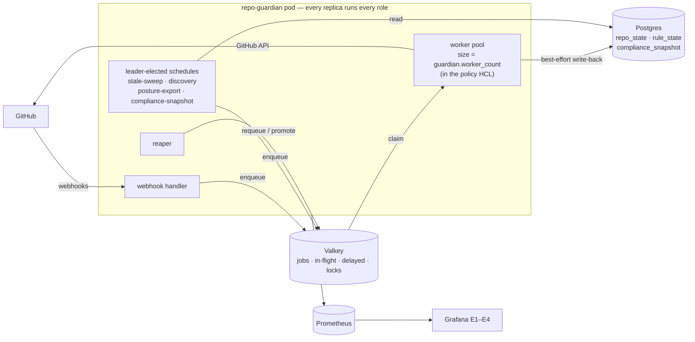
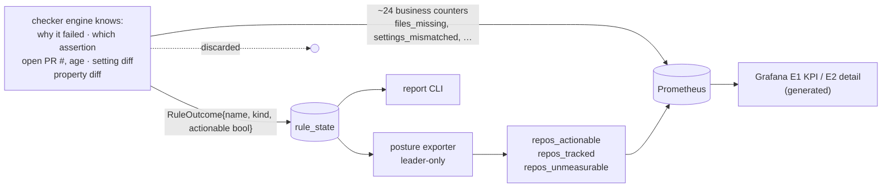
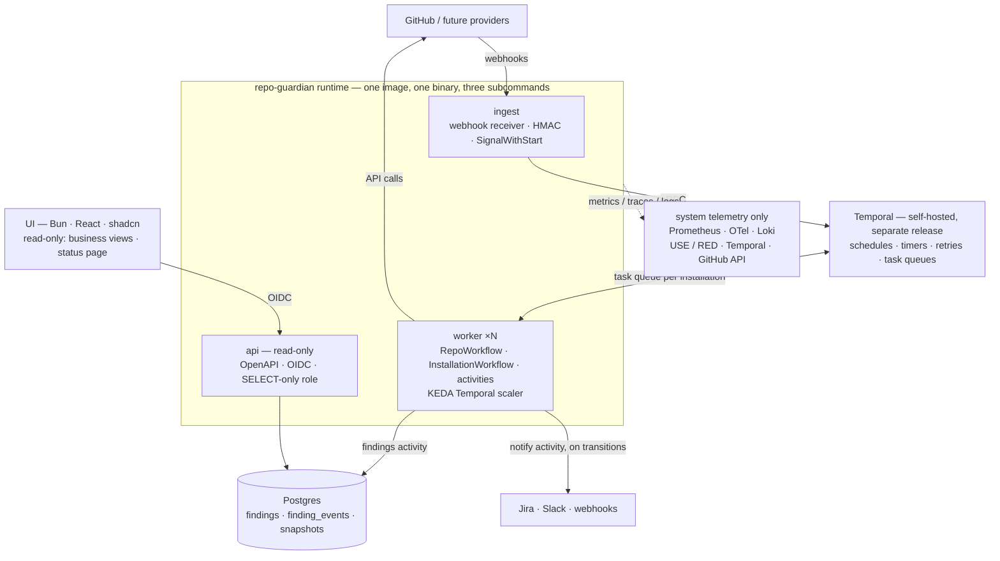
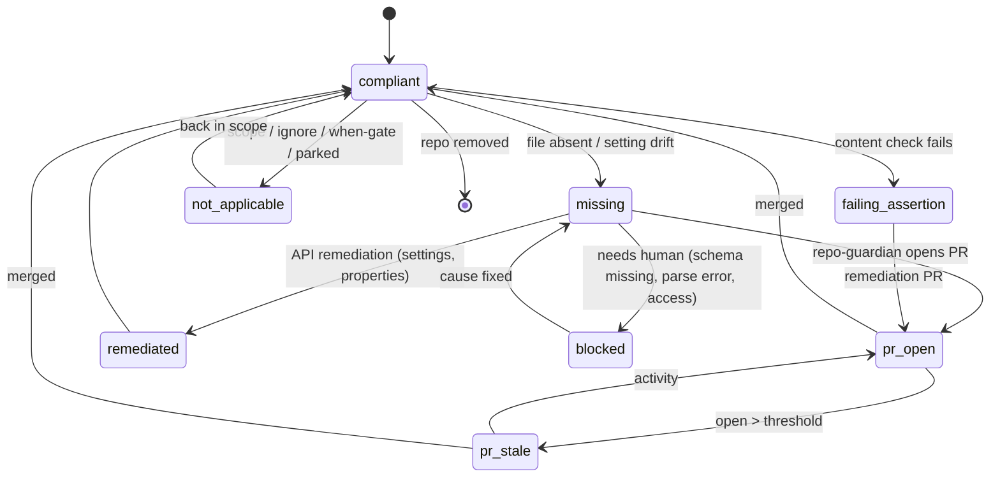

<!-- markdownlint-disable-file MD025 MD041 -->

# INV-0018: repo-guardian v2: role split, business state, and a platform UI

<!--toc:start-->
- [Question](#question)
- [Hypothesis](#hypothesis)
- [Context](#context)
- [Approach](#approach)
- [Environment](#environment)
- [Findings](#findings)
  - [Observation 1: the engine is half the codebase, and it is the half nobody wants to change](#observation-1-the-engine-is-half-the-codebase-and-it-is-the-half-nobody-wants-to-change)
  - [Observation 2: every replica runs every role, and the scaling knob lives in the policy](#observation-2-every-replica-runs-every-role-and-the-scaling-knob-lives-in-the-policy)
  - [Observation 3: the engine knows why a repo fails and persists only that it fails](#observation-3-the-engine-knows-why-a-repo-fails-and-persists-only-that-it-fails)
  - [Observation 4: half the metrics are business facts, and one component exists only to copy Postgres into Prometheus](#observation-4-half-the-metrics-are-business-facts-and-one-component-exists-only-to-copy-postgres-into-prometheus)
  - [Observation 5: telemetry becomes a clean system-only concern once the business half leaves](#observation-5-telemetry-becomes-a-clean-system-only-concern-once-the-business-half-leaves)
  - [Observation 6: the queue is not asynq, and the real queue question is transactions](#observation-6-the-queue-is-not-asynq-and-the-real-queue-question-is-transactions)
  - [Observation 7: autoscaling workers buys burst latency, not throughput past the GitHub budget](#observation-7-autoscaling-workers-buys-burst-latency-not-throughput-past-the-github-budget)
  - [Observation 8: the UI is read-only, and policy stays in git](#observation-8-the-ui-is-read-only-and-policy-stays-in-git)
  - [Observation 9: a read-only UI is a small security surface, and should stay one](#observation-9-a-read-only-ui-is-a-small-security-surface-and-should-stay-one)
  - [Observation 10: making findings actionable needs transitions, not snapshots](#observation-10-making-findings-actionable-needs-transitions-not-snapshots)
  - [Observation 11: dead code is scarce, and the cleanup opportunity is structural](#observation-11-dead-code-is-scarce-and-the-cleanup-opportunity-is-structural)
- [Options](#options)
  - [Rewrite versus re-topology](#rewrite-versus-re-topology)
  - [Target shape](#target-shape)
  - [The finding model](#the-finding-model)
- [Conclusion](#conclusion)
  - [What I think](#what-i-think)
- [Recommendation](#recommendation)
  - [Open questions](#open-questions)
- [References](#references)
<!--toc:end-->

## Question

Has repo-guardian outgrown its architecture badly enough to need a v2?
And if so, what would a v2 look like, given:

1. **Workers that scale on queued work** — Kubernetes-native autoscaling
   of the worker role, not a fixed goroutine count.
2. **Postgres and Valkey stay**, possibly with better tooling (goose for
   migrations, others), and a fresh look at whether the queue
   implementation is still the right choice (it was assumed to be
   asynq; see Observation 6).
3. **System telemetry separated from business metrics.** Monitoring,
   metrics, observability and logging describe *the service* — USE/RED,
   queue health, GitHub API behaviour. Business metrics describe *the
   fleet* — which org has a catalog-info PR waiting to merge, which repo
   is only missing custom properties, where a CODEOWNERS PR sits
   unmerged.
4. **Making business state actionable** — Jira tickets, Slack
   notifications for out-of-compliance repositories.
5. **A UI** for business users that doubles as a status page for system
   health and compliance. Bun + TypeScript + React + shadcn, with
   OIDC/OAuth. (The brief originally included editing `guardian.hcl`
   from the UI; that was decided out — Observation 8.)

Plus a standing brief: use the investigation to find code that is no
longer needed.

## Hypothesis

That the rules engine, the part everyone agrees works, is not the
problem, and the v2 is therefore a **re-topology, not a rewrite**. The
coupling that hurts is in three places around the engine: the process
shape (every replica does everything), the data model (business facts
stored as events in Prometheus rather than state in Postgres), and the
absence of any interface other than Prometheus and a CLI report.

## Context

repo-guardian started as a single-org onboarding bot and grew, over
DESIGN-0001 → DESIGN-0024, into a fleet compliance engine with durable
state, leader election, delayed requeue, per-org scoping, four
reconcilers and a generated monitoring suite. Each step was sound on its
own. Assembled, they left business reporting routed through the
observability stack. DESIGN-0022/IMPL-0023 recognised the symptom
("compliance is state, not counters") and moved posture into Postgres,
but then exported that state *back* into Prometheus as gauges, because
Prometheus was the only read path that existed.

Deployments at large scale are where this shows: the business questions
operators get asked cannot be answered from counters, and every attempt
to answer them in Prometheus runs into cardinality (no repo label, by
design — DESIGN-0022 Finding G) or replica semantics (`max by`, never
`sum`).

Directly related prior work:

- **INV-0009** (Open) — read-only status API and web UI. Concluded: an
  `api` subcommand of the same binary, separate UI repo, OIDC. This
  investigation extends it rather than replacing it; its Observation 2
  ("the persisted data is one table") is stale since IMPL-0023.
- **INV-0013 / DESIGN-0022** — the state-vs-event split, the tier
  taxonomy, and the posture exporter.
- **DESIGN-0015 / DESIGN-0016** (both Draft) — per-installation queue
  partitioning, and read/write Postgres endpoints. Both are v2 topics.
- **INV-0002 / INV-0007** — multi-provider (Forgejo, GitLab).
- **INV-0017 / DESIGN-0024** (open PRs #184/#185) — monitoring
  generation and multi-instance identity.

**Triggered by:** operator feedback from large deployments; branch
`docs/inv-refactor-investigation`.

## Approach

1. Size every package and bucket the code by what it is *for*.
2. Inventory direct dependencies; confirm what the queue actually is.
3. Read the process composition in `cmd/repo-guardian/main.go`.
4. Read the persisted schema (all migrations) and the `Store` interface.
5. Compare what the engine computes per check (`checker.CheckResult`,
   `RuleOutcome`) against what it persists (`store.RuleState`).
6. Classify all 52 registered metrics as system or business.
7. Run `golang.org/x/tools/cmd/deadcode` over the module for unreachable
   code, rather than guessing.
8. Check the current state of asynq and River from their repositories.
9. Cross-check docs, statuses and CLAUDE.md against the code.

## Environment

| Component | Version / Value |
| --- | --- |
| Base | `main` @ `ccb1e29` (post-IMPL-0024) |
| Go / module | Go 1.26.5; 25 direct dependencies |
| Non-test Go LOC | ~21,500 across 24 packages |
| Queue | custom Valkey implementation (`internal/queue/valkey`, LIST + 2 ZSETs + Lua) |
| Migrations | `golang-migrate/migrate/v4` v4.19.1, embedded SQL, 3 migrations |
| Metrics | 52 registrations (`internal/metrics/metrics.go`) |
| asynq | `v0.x`, 219 open issues at time of writing |
| River | pgx v5 driver, MPL-2.0 |

## Findings

### Observation 1: the engine is half the codebase, and it is the half nobody wants to change

Non-test Go LOC, bucketed by purpose:

| Bucket | Packages | LOC | Share |
| --- | --- | --- | --- |
| **Core engine** — the product | `checker`, `policy`, `reconciler`, `github`, `template`, `rules`, `catalog` | ~11,200 | **52%** |
| **Runtime plumbing** — how work moves | `store`(+`postgres`), `queue`(+`valkey`), `scheduler`(+`valkey`), `worker`, `webhook`, `config`, `cmd` | ~5,400 | 25% |
| **Telemetry and monitoring generation** | `monitoring`(+`dashboard`, `alert`, `emit`), `metrics`, `observability` | ~4,200 | 20% |
| **Business reporting** | `report` | ~650 | 3% |

The v2 changes are almost entirely in the bottom three rows. The top
row carries over. That is the whole argument for a re-topology rather
than a rewrite, in one table.

One-fifth of the codebase exists to observe, and much of that fifth is
observing *the fleet* rather than *the service* (Observation 4).

### Observation 2: every replica runs every role, and the scaling knob lives in the policy



`bringUp` (`main.go:232`) starts the webhook server, a worker pool of
`policyCfg.Guardian.WorkerCount` goroutines, the reaper, and four
leader-elected schedules (`stale-sweep`, `posture-export`,
`compliance-snapshot`, `discovery`) in one process. Every replica is
identical.

Two consequences:

- **You cannot scale workers without scaling webhook receivers and
  schedule candidates with them.** A Kubernetes autoscaler targeting
  this Deployment would add webhook endpoints to absorb queue depth,
  which is the wrong shape.
- **`worker_count` is a policy attribute** (`guardian { worker_count }`,
  `policy/defaults.go:10`, `loader.go:372`). A deployment-sizing knob sits
  in the file that describes what compliance means, so changing
  throughput changes nothing about `policy_version` but does mean
  editing the policy. In a v2 with a UI that edits policy, that becomes
  actively confusing: a business user editing rules would be looking at
  a concurrency setting.

### Observation 3: the engine knows why a repo fails and persists only that it fails

The persisted business state is closer than it looks. IMPL-0023 already
gave us `rule_state` (per repo, per rule), `compliance_snapshot` (per
org, per rule, over time) and `repo_state` (freshness, errors, parking).
INV-0009's "one table" finding predates all of that.

But the unit of state is a boolean:

```go
type RuleOutcome struct {   // internal/checker/result.go
    RuleName   string
    Kind       RuleKind
    Actionable bool
}
```

At check time the engine knows much more: *which* path was missing,
*which* assertion failed and its message, whether a repo-guardian PR is
open and its number and age, whether a setting was remediated or only
reported, the expected-vs-actual value, the custom-property diff, and
whether the org schema lacks a property. All of it is discarded at the
end of `CheckRepo`, apart from `catalog_parse_ok`.



This is the finding that matters most, because it is exactly the
question in the brief. **"This org's catalog-info PR is waiting to
merge" and "this repo is only missing custom properties" are both
`actionable = true` today.** The engine could tell them apart, but the
schema has nowhere to put the difference. A UI built on today's schema
would show a red square where the user needs a sentence.

### Observation 4: half the metrics are business facts, and one component exists only to copy Postgres into Prometheus

Of the 52 registered metrics, roughly half describe the fleet rather
than the service:

| Kind | Examples | Count |
| --- | --- | --- |
| **Business** — compliance facts about repos and orgs | `files_missing_total`, `files_forbidden_present_total`, `settings_mismatched_total`, `settings_remediated_total`, `branch_protection_*`, `custom_property_*`, `catalog_parse_failed_total`, `out_of_scope_total`, `ignored_total`, `open_prs_by_rule`, `prs_created/updated/closed_total`, `pr_orphan_left_total`, `repos_actionable`, `repos_tracked`, `repos_unmeasurable`, `posture_export_*` | ~26 |
| **System** — USE/RED of the service | `queue_*` (10), `store_query_seconds`, `store_writeback_*`, `check_duration_seconds`, `webhook_received/rejected_total`, `errors_total`, `rate_limit_remaining`, `scheduler_*`, `discovery_*` | ~26 |

The posture exporter (`checker.PostureExporter`) is the clearest case.
It is a leader-elected loop whose only job is to read `rule_state` from
Postgres and republish it as gauges every 60s, with a documented
contract about reading before reset and `max by` never `sum`, all so
that Grafana can show data that was already sitting in a queryable
database. That is the conflation in its most literal form: **the
business read path is Postgres → Go → Prometheus → Grafana, because
Postgres → API → UI does not exist.**

It has concrete costs, all of which INV-0017 found in practice:

- **Cardinality forbids the question operators actually ask.** "Which
  repository?" cannot be a metric label at 20,000 repos (DESIGN-0022
  Finding G), so it is answered by grepping logs (E4). A database
  answers it with a `WHERE`.
- **Replica semantics leak into business queries.** Every posture query
  needs `max by`, and INV-0017 Observation 10 found that `max by (org)`
  also silently merges *separate instances* watching the same org.
- **Business alerts ride the operations pager.** `RepoGuardianCatalogParseFailures`
  and `RepoGuardianPropertySchemaMissing` are repository-owner problems
  routed through Alertmanager, where on-call sees them.

### Observation 5: telemetry becomes a clean system-only concern once the business half leaves

If business state moves to Postgres-behind-an-API, what remains in
Prometheus/OTel/Loki is exactly the system tier: the queue metrics, the
otelhttp client/server histograms, otelpgx and redisotel, leader state,
discovery cost, write-back health, and the E3 system and E4 evidence
dashboards.

That is a smaller and more honest monitoring surface. It also shrinks
several things currently in flight:

- `monitoring/dashboard` loses E1 (KPI) and E2 (detail), the
  business-tier dashboards and the only ones that need posture queries.
- The mechanism-gated alert catalogue loses its business alerts.
- **DESIGN-0024** (multi-instance generation) keeps its value, since E3,
  E4 and the system alerts still need instance identity, but loses its
  hardest correctness case: the `max by (org)` merge lives entirely in
  the posture queries that would retire.

The new surfaces (API, UI, notification sinks) add their own system
telemetry — HTTP RED on the API, auth failures, sink delivery success.
That lands on the side of the line this investigation argues should
exist.

### Observation 6: the queue is not asynq, and the real queue question is transactions

`go.mod` has no asynq. The queue is `internal/queue/valkey` (~830 LOC):
a `jobs` LIST, `in-flight` and `delayed` ZSETs, a leader-elected reaper,
and Lua scripts that keep each job in exactly one key at every instant
(IMPL-0022). It is well tested and its contracts are good. The question
is not "is asynq still right" but "is a Redis-shaped queue still right".

**asynq** is not the answer. It is `v0.x` with an explicit caveat that
the public API can change before 1.0, 219 open issues at time of
writing, no stated Valkey support, and a note that some Lua scripts may
not work on Redis Cluster. It would replace a working custom queue with
a pre-1.0 dependency offering the same properties.

**River** (Postgres-backed, pgx v5, which we already use) is worth
serious evaluation, for a reason specific to v2:

- **Today the queue and the state are two systems joined by
  "best-effort".** The worker write-back to `repo_state`/`rule_state` is
  deliberately best-effort: failures are logged and counted, never
  propagated, because "the queue is the source of truth for did we do
  the work". That is the right call **while state is monitoring**. In a
  v2 where that state *is* the product a business user reads, a lost
  write-back means the UI shows a stale answer with nothing to say so.
  River enqueues a job in the same transaction as a data write
  (`InsertTx`), and a worker can mark the job done in the same
  transaction as its findings write. That removes the dual-write
  instead of documenting it.
- **Its primitives match contracts we built by hand.** Job snoozing is
  our `RetryAfterError` deferral. Unique jobs replace the workaround
  where `push` writes `StatusPending` before enqueue so the sweep does
  not double-enqueue (IMPL-0015 Phase 0). Periodic jobs cover the
  schedules. River UI gives operators queue visibility without us
  building it.
- **Throughput is not a concern.** A 20,000-repo fleet checked hourly
  is ~6 jobs/s, which is trivial for Postgres.

Not confirmed from River's repository and needing verification before
any design commits to it: whether leader election is built in (it
drives periodic jobs), and which features, if any, sit behind a paid
tier. Per-key concurrency limits in particular would matter for
per-installation fairness (DESIGN-0015).

**What that leaves Valkey for** is still real, and matches the "keep
Valkey" constraint: shared cross-pod state that is not a system of
record. That means the per-installation rate budget (Observation 7),
the org custom-property schema cache (currently per-pod, IMPL-0017),
GitHub conditional-request ETag caching, and UI session/cache storage.
Postgres holds the durable record; Valkey holds the ephemeral
coordination.

### Observation 7: autoscaling workers buys burst latency, not throughput past the GitHub budget

Kubernetes-native scaling of workers is straightforward once the role is
split:

- **Valkey queue:** KEDA's Redis lists scaler targets `LLEN jobs`
  directly. Deferred jobs sit in the `delayed` ZSET, not the list, so a
  throttled fleet correctly reads as *no runnable work* and scales down.
- **River:** KEDA's PostgreSQL scaler over a count of available jobs.
- Either way, workers can **scale to zero** between sweeps; the ingest
  role stays up for webhooks.

The honest ceiling: repo-guardian is **rate-limit-bound, not
CPU-bound**. Each installation has a GitHub API budget, and
rate-limit state is per-installation *and per-pod* — each worker pod
builds its own transport per installation (`getInstallClient`,
`client.go:1060`) and learns the shared remaining count only from its
own responses. More pods past the budget produce more deferrals, not
more checks.

What autoscaling genuinely buys is **latency on bursts**: a policy edit
changes `policy_version` and re-enqueues the whole fleet, an onboarding
adds thousands of repos at once, and a large org's push storm lands
together. Those finish in minutes instead of hours when workers fan
out. So the design needs:

- a `maxReplicaCount` derived from the budget, not from the queue;
- and ideally the per-installation budget moved into Valkey, so N pods
  share one view instead of N optimistic ones.

### Observation 8: the UI is read-only, and policy stays in git

**Decided 2026-09-23: the UI never edits policy.** `guardian.hcl` stays a
file in a git repository, deployed as a ConfigMap (typically by ArgoCD,
per CLAUDE.md PR #67), and is changed through pull requests reviewed
like any other code.

This is the right call on the merits, not just a scope cut. A UI that
wrote policy to a database would become a second source of truth that
ArgoCD reverts, and `policy_version` would hash a configuration no
reviewer ever saw. Keeping the UI read-only also keeps the UI's data
path one-directional: engine → findings → API → UI, with nothing
flowing back.

What the UI *can* still do for policy is show it: the loaded policy,
its version hash, which rules apply to which orgs, and when each rule's
findings last changed. That is a read of state the runtime already has.

### Observation 9: a read-only UI is a small security surface, and should stay one

The GitHub App already holds write access across every installed org,
and today the only inbound path to that power is the HMAC-validated
webhook. A **read-only** API adds no new path to it, which is the main
reason the read-only decision is also a security decision.

What the API still needs:

- **OIDC for humans** (code + PKCE for the UI, bearer-JWT validation in
  the API, per INV-0009), against a generic issuer.
- **A read-only database role.** The API connects with a `SELECT`-only
  Postgres role (INV-0009 OQ2), so read-only is enforced by the database,
  not just by the absence of handlers.
- **Coarse authorization, not RBAC.** With no mutating endpoints, the
  realistic need is "may this identity see this org" (group-to-org
  mapping from OIDC claims), not a role hierarchy. The status page may
  need a public-safe, unauthenticated subset (OQ5).
- **No generic GitHub proxy.** The API reads repo-guardian's own state
  and never calls GitHub with the App's credentials on a user's behalf.
- **Separate listener** (INV-0009 Observation 1 still holds): the API is
  its own role and Service, never a route on the webhook server.

Actions on findings (Jira, Slack) are not UI actions. They are
controller-driven off state transitions (Observation 10), so the
read-only property survives adding them.

### Observation 10: making findings actionable needs transitions, not snapshots

Jira and Slack want *events* ("repo X became non-compliant", "PR has
been open 30 days"), and they want them once. A per-sweep export of
current state would file the same ticket on every sweep.

The finding model in Observation 3 naturally produces transitions: a
`finding_events` append-only log, written in the same transaction as
the state change. A controller-owned notifier consumes transitions,
routes them through per-org rules (which org, which state, which sink),
and records an `external_ref` (the Jira key, the Slack thread) per
finding, so that:

- a ticket is created once and **updated or closed** when the finding
  resolves;
- restarts and leader failovers do not duplicate, which is the same
  idempotency shape as the sticky-comment content hash (IMPL-0013 P4);
- the UI can show "ticket PLAT-123 open for this repo".

This subsystem is new, but its patterns are not. It is mostly the
reconciler pattern pointed outward.

### Observation 11: dead code is scarce, and the cleanup opportunity is structural

`deadcode -test=false ./...` finds **seven** unreachable functions in
~21,500 lines:

| Function | Note |
| --- | --- |
| `github.NewClientForBaseURL` | **not dead** — the test seam behind the transport-order contract tests in `internal/github` and `internal/checker`. `deadcode -test=false` cannot see test callers. Keep. |
| `monitoring.Rule.AppliesEverywhere` | |
| `monitoring.Model.RulesFor` | |
| `monitoring.Model.RuleNames` | |
| `monitoring.matchesKind` | |
| `observability.Provider.Enabled` | |
| `postgres.migrateDown` | |

This is a clean codebase at the function level. The cleanup
opportunity is not a pile of dead helpers; it is whole subsystems whose
*purpose* changes in v2 (the posture exporter, the business counters,
the business dashboards). Those are listed under Recommendation.

Smaller items found along the way, all actionable without a v2:

- **`repo_guardian_github_rate_remaining` is wrong at scale.** It is an
  *unlabelled* gauge set on every response by the per-installation
  transport (`ratelimit.go:253`), so with more than one installation it
  reports whichever response arrived last. The labelled
  `rate_limit_remaining{installation_id}` supersedes it; only
  `contrib/README.md` still references the old one. The *throttling* is
  correct, since each installation gets its own transport; only the
  gauge is misleading. It is the same pre-labelling pattern as the four
  `properties_*` counters IMPL-0023 Phase 7 removed.
- **GitHub Enterprise Server is not supported, and stays out of scope
  (decided 2026-09-23).** No config sets an API base URL; "Enterprise"
  means Enterprise Cloud, today and in v2.
- **Docs drift:**
  - INV-0015 (repository parking) is cited in CLAUDE.md and code
    comments but has no document.
  - IMPL-0011, 0013 and 0014 carry `Implemented`, which is not a valid
    IMPL status.
  - IMPL-0015 is still `In Progress`.
  - INV-0005 is `Open` though IMPL-0013 fixed it.
  - CLAUDE.md still describes `scheduler.NewSweeper`, which no longer
    exists.
  - `deploy/MIGRATED.md` is a tombstone due for deletion on or after
    2026-11-30.
- **The docs site does not render mermaid.** `mkdocs.yml` configures no
  `superfences` mermaid fence, so the diagrams in this document render
  on GitHub and as code blocks on the site.

## Options

### Rewrite versus re-topology

| Option | Shape | Assessment |
| --- | --- | --- |
| **A** | Ground-up v2 in a new tree | Throws away 52% of the code that everyone agrees works, and years of edge-case fixes recorded in CLAUDE.md (INV-0003 idempotent commits, INV-0011 A1/A2, INV-0014 orphan cleanup, the subset invariant). No. |
| **B** | Strangler: v1.x minors add the new model, roles, API and UI alongside the old paths; one major version at the breaking cut | Every step ships to v1 users, but every step must also stay compatible with v1's control plane, which Temporal replaces wholesale. Not chosen. |
| **D** | Re-topology on a long-lived `v2` branch: engine carried over unchanged, runtime rebuilt around it; v1 frozen on `main`, fixes merge forward | Keeps the engine and its edge-case history (not A), without paying for v1 compatibility at every step (not B). **Chosen (OQ10).** |
| **C** | Bolt an API and UI onto today's shape | Builds a UI on a boolean (Observation 3) and on a best-effort write-back (Observation 6). The UI would be permanently less informative than the engine. |

### Target shape



- **One image, three subcommands** (`ingest`, `worker`, `api`), plus `all` for small installs so the homelab and a
  single-repo user keep one Deployment. INV-0009 Observation 5's
  argument against a second image (it doubles the signed,
  SLSA-attested release pipeline) holds for every role.
- **Two planes, one line between them.** Business state lives in
  Postgres and is read through the API. System state lives in
  Prometheus/OTel/Loki and is read by operators. The **status page** is
  served by the API from first-party state (last webhook received, last
  discovery, check backlog and throttled installations read from
  Temporal, per-org compliance), so the UI never
  depends on Prometheus. That would be the conflation in reverse.

### The finding model



`rule_state.actionable bool` becomes a `findings` row with:

- a **state** from the lifecycle above;
- a **reason** (which path, which assertion, which property);
- **evidence** — PR number/URL/age, expected vs actual, the assertion
  message;
- an `external_ref` for tickets.

Each state change also appends a `finding_events` row, in the same
transaction. Every consumer in the brief reads this model:

- the business graphs (state counts per org over time);
- the "PR waiting to merge versus only missing properties" distinction
  (the state column);
- Jira/Slack (the event log);
- the status page (aggregates).

Key it **provider-neutrally** — `(provider, host, org, repo)` rather
than `installation_id`. The roadmap includes 20+ orgs and a
self-hosted GitLab (INV-0002, INV-0007), and this is the migration
where changing the key is cheap.

## Conclusion

**Answer:** Yes to a v2, as a **major version with a new topology, not
a rewrite.**

Decided 2026-09-23: the UI is **read-only** and never holds policy;
**zero business metrics** remain in Prometheus in v2, which is for
operational metrics and observability only; **GitHub Enterprise Cloud
only**, no GHES. **The control plane is Temporal, self-hosted on
Kubernetes, and Valkey is dropped** (INV-0019); Observations 6 and 7
record the queue analysis as it stood before that decision.

Decided 2026-09-24: v2 is developed on a **long-lived `v2` branch**
while v1 on `main` stays as it is (OQ10), and every other open question
takes its recommended option.

### What I think

Your diagnosis is right, and the codebase makes it measurable rather
than a matter of taste:

- half the metrics are business facts;
- a leader-elected component exists only to copy Postgres into
  Prometheus;
- the persisted model stores a boolean where the business needs a
  state, while the engine computes that state and throws it away.

Three things to push on, though.

**The single most important change is the finding model, and it comes
first.** The UI, the Jira integration, the business graphs, the status
page and the notifications are all *consumers* of one thing:
per-repo, per-rule state with a reason and evidence. Build the UI first
and it will be a prettier `actionable = true`. If v2 only did one thing
it should be Observation 3.

**This is not a rewrite.** `deadcode` found seven unreachable functions
in 21,500 lines. The engine is 52% of the code and holds years of
edge-case fixes that exist only as tests and CLAUDE.md paragraphs. What
is wrong is where the engine's output goes and how the process is
shaped, and both can change around it. Carrying the engine onto a `v2`
branch keeps that history, and proving each phase in the homelab before
the next is how most of the bugs in CLAUDE.md were caught.

**Scope is the risk.** Each piece is modest: role split, findings,
API, UI, OIDC, notifications, autoscaling. Together they are a
platform. The read-only decision is what keeps it tractable: with no
mutating endpoints there is no RBAC hierarchy, no audit trail of user
actions, and no new inbound path to the App's write access.

Two recommendations that differ from the brief:

- **Not asynq, and not a queue at all.** asynq is a pre-1.0 lateral
  move (Observation 6). v2 turns the best-effort write-back from an
  acceptable monitoring gap into a correctness bug in the product, and
  INV-0019 concluded Temporal fixes that and deletes the rest of the
  hand-built control plane with it, Valkey included.
- **Business alerts leave the pager with the metrics.** Parse
  failures and missing schema properties are repository-owner problems;
  in v2 they become findings routed to Jira/Slack by org, not
  Alertmanager rules on-call has to triage.

On autoscaling: worth doing, with calibrated expectations. It buys
burst latency, not throughput past the GitHub API budget
(Observation 7).

## Recommendation

**Develop v2 on a long-lived `v2` branch; v1 stays as it is** (OQ10).
v1 on `main` is frozen for features and takes only fixes. v2 carries
the engine packages over unchanged and re-topologizes around them,
so it is a branch, not a new tree. Each phase is its own DESIGN/IMPL
targeting `v2` and is proven in the homelab before the next. With no
v1.x compatibility to preserve, breaking changes land when they are
ready instead of being held for a cut.

**Branch mechanics.**

- `main` merges into `v2` regularly. Engine fixes land on `main` first
  and flow forward; since the engine packages are unchanged on `v2`,
  those merges stay mechanical. The divergence lives in runtime
  plumbing, which v1 no longer changes.
- CI must run on PRs targeting `v2` (`ci.yml` branch filters), and
  `release.yml`'s semver bump must not fire from it. v2 pre-releases are
  manual `v2.0.0-rc.N` tags with `dont-release` PRs (CLAUDE.md rule 6).
- v2.0.0 is tagged when Phases 1–4 are done and a v1 → v2 upgrade has
  been run in the homelab; `v2` then fast-forwards `main`.

**Phase 0 — cleanup.** The dead-code deletions and the unused
`repo_guardian_github_rate_remaining` series go on `v2`; docs hygiene
goes on `main`, since it is about v1's record.

- Delete `repo_guardian_github_rate_remaining` and its `contrib/README.md`
  mention.
- Delete the six genuinely unreachable functions;
  `NewClientForBaseURL` stays as a test seam.
- Docs hygiene:
  - write INV-0015 or retarget its citations;
  - fix the IMPL-0011/0013/0014 statuses, close IMPL-0015 and INV-0005,
    and mark INV-0009 as extended by this document;
  - correct CLAUDE.md's `NewSweeper` note;
  - calendar the `deploy/MIGRATED.md` deletion (2026-11-30);
  - enable mermaid in `mkdocs.yml`.

**Phase 1 — the finding model (the foundation).**

- `findings` + `finding_events`, provider-neutral keys (OQ8), goose for
  migrations and sqlc for queries (OQ7).
- `RuleOutcome` widens to state, reason and evidence; the engine stops
  discarding what it knows.
- Backfill from `rule_state` as a goose Go-function migration: this is
  the v1 → v2 data upgrade path.
- The findings write is a single idempotent function, so it becomes a
  Temporal activity in Phase 2 unchanged.

**Phase 2 — Temporal control plane and role split** (INV-0019).

- Temporal self-hosted via the upstream `temporalio/helm-charts` on its
  own CNPG Postgres, visibility `baked` or `external`.
- `RepoWorkflow` + `InstallationWorkflow` replace the queue, reaper,
  scheduler, leader election and stale sweep; findings write and
  notifications are activities.
- **Valkey removed** from the binary and the chart.
- Subcommands `ingest | worker | api | all` (OQ6); no `controller`.
  Worker Deployment scaled by the KEDA Temporal scaler,
  `maxReplicaCount` bounded by budget. DESIGN-0016 folds in;
  DESIGN-0015 is superseded by per-installation task queues.
- **Zero business metrics in Prometheus.** The posture exporter, the
  ~26 business series, the E1/E2 dashboards and the business alerts are
  not carried to v2. The monitoring generator becomes system-tier only
  (E3, E4, system alerts), which DESIGN-0024 and the INV-0017 Loki tier
  continue to serve.
- `worker_count` leaves `guardian {}` and fails load with a migration
  message (the IMPL-0024 removed-attribute shape).

**Phase 3 — API v1 (read-only).**

INV-0009 Phase A, updated for findings:

- OpenAPI 3.1, `oapi-codegen`, `sqlc` for the read queries.
- `STORE_RO_DSN` and a `SELECT`-only role.
- OIDC bearer validation.
- Endpoints for fleet summary, org views, finding lists by state,
  per-repo detail, compliance history, and status-page health.
- The `report` subcommand becomes a client of the same queries.

**Phase 4 — UI v1 (read-only) and the status page.**

- A separate repository consuming the published OpenAPI contract
  (OQ5): Bun + React + TypeScript + shadcn, OIDC code + PKCE, a client
  generated from the spec.
- Business views over findings, plus an unauthenticated status page
  limited to aggregate health and compliance percentages.

**Phase 5 — notifications** (may ship in v2.0.0 or a v2.x minor).

- Transition-driven sinks (Jira, Slack, generic webhook), run as
  Temporal activities off `finding_events`, so retries and idempotency
  (`external_ref`) come from the platform (OQ9).
- Per-org routing rules, tickets closed on resolution.

There is deliberately no "mutating UI" phase: the UI is read-only for
the life of v2.

### Open questions

- **OQ1 — Queue.** — **RESOLVED (INV-0019): Temporal**, self-hosted on
  Kubernetes, replaces the queue, scheduler, leader election, reaper and
  sweep together. **Valkey is dropped**; the shared rate budget lives in
  a per-installation workflow. ~~(a)=River; (b)=custom Valkey queue +
  KEDA Redis scaler; (c)=asynq~~

- **OQ2 — Finding model shape.** — **RESOLVED (a):** new `findings`
  table (state enum, reason, evidence `jsonb`, `external_ref`) plus
  append-only `finding_events`, backfilled from `rule_state`.
  ~~(b)=widen `rule_state` in place~~

- **OQ3 — Business metrics in Prometheus after v2.** — **RESOLVED:
  zero.** Prometheus is operational metrics and observability only.
  Every business series, the posture exporter, the E1/E2 dashboards and
  the business alerts go at the major cut, with no compat exporter.
  ~~(a)=compat exporter for one major; (b)=small permanent set~~

- **OQ4 — Policy editing.** — **RESOLVED: none. The UI is read-only**
  and never holds or edits policy; `guardian.hcl` stays in git and
  changes by pull request. ~~(a)=UI authors policy PRs;
  (b)=Postgres-stored policy~~

- **OQ5 — UI placement and status-page exposure.** — **RESOLVED (a):**
  separate repository consuming the published OpenAPI contract (as
  INV-0009 concluded), with an unauthenticated status-page endpoint
  limited to aggregate health and compliance percentages. ~~(b)=`web/`
  in this repo; (c)=login-gated status page~~

- **OQ6 — Process topology.** — **RESOLVED (a):** one image,
  subcommands `ingest | worker | api | all` (no `controller` under
  Temporal), split by default with `all` for small installs.
  ~~(b)=separate images per role~~

- **OQ7 — Migration and query tooling.** — **RESOLVED (a):** goose
  (Go-function migrations for the findings backfill) and sqlc (typed
  queries for the API's read surface), from Phase 1. ~~(b)=golang-migrate
  + sqlc; (c)=no change~~

- **OQ8 — Provider keys.** — **RESOLVED (a):** GHES out of scope
  (Enterprise Cloud only); findings use provider-neutral keys
  `(provider, org, repo)` from the Phase 1 migration, since
  INV-0002/INV-0007 keep GitLab/Forgejo on the roadmap.
  ~~(b)=`installation_id` keys~~

- **OQ9 — Notification model.** — **RESOLVED (a):** transition-driven
  from `finding_events`, Temporal activities, idempotent via
  `external_ref`, auto-resolving. ~~(b)=periodic digests only~~

- **OQ10 — Release shape.** — **RESOLVED (b):** a long-lived `v2`
  branch developed in parallel; v1 on `main` stays as it is, taking
  fixes only, which merge forward into `v2`. See Recommendation.
  ~~(a)=strangler via v1.x minors~~

## References

- INV-0009 — read-only status API and web UI options (extended here)
- INV-0013, DESIGN-0022, IMPL-0023 — state vs events, posture exporter,
  tier taxonomy, Finding G
- DESIGN-0021, IMPL-0022 — delayed-requeue contract, best-effort
  write-back
- DESIGN-0015 / DESIGN-0016 — queue partitioning (superseded by
  per-installation Temporal task queues), Postgres RO/RW (folded into
  Phase 4); both Drafts
- INV-0019 — Temporal as the control plane (resolves OQ1)
- INV-0002, INV-0007 — multi-provider
- INV-0017, DESIGN-0024 — monitoring generation, multi-instance
  (open PRs #184, #185)
- `cmd/repo-guardian/main.go` — `bringUp`, `scheduleHandlers`
- `internal/checker/result.go` — `RuleOutcome`, `CheckResult`
- `internal/store/store.go`, `internal/store/postgres/migrations/`
- `internal/metrics/metrics.go`
- `internal/github/client.go` (`getInstallClient`,
  `NewClientForBaseURL`), `internal/github/ratelimit.go`
- [asynq](https://github.com/hibiken/asynq) ·
  [River](https://github.com/riverqueue/river) ·
  [KEDA scalers](https://keda.sh/docs/latest/scalers/)
</content>
</invoke>
