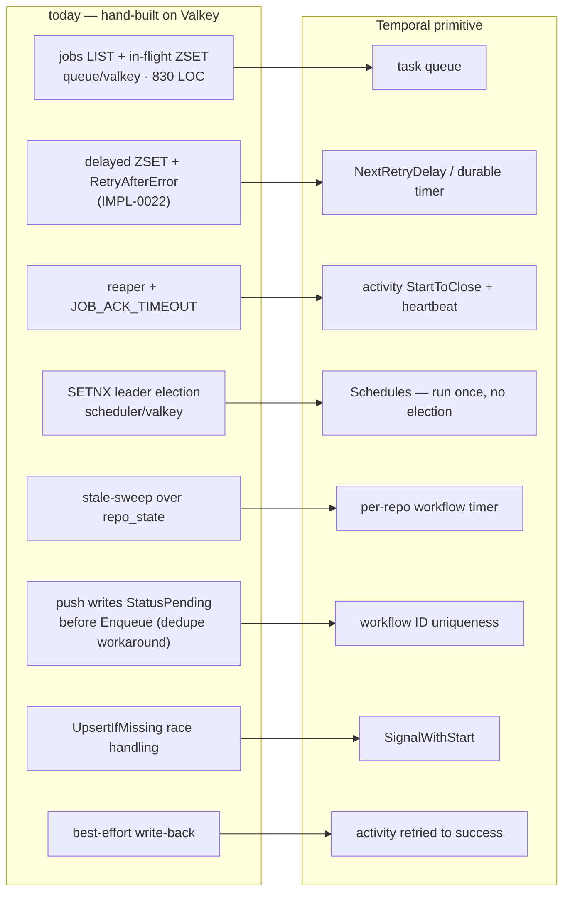
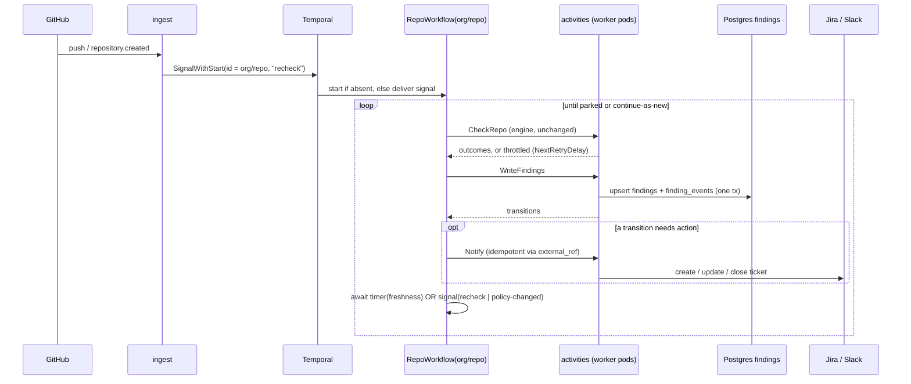
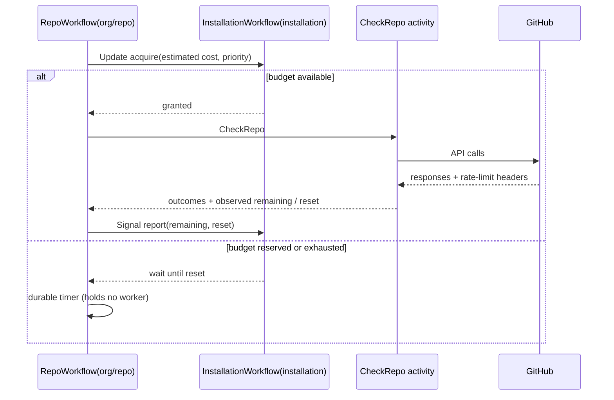
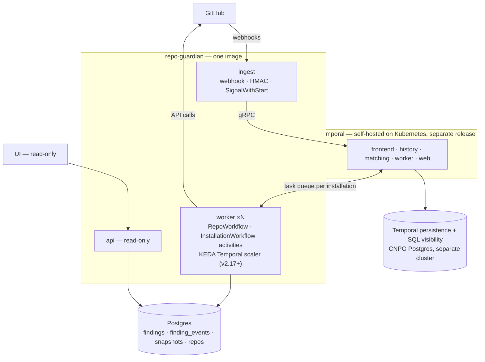

<!-- markdownlint-disable-file MD025 MD041 -->

# INV-0019: Temporal as the repo-guardian control plane

<!--toc:start-->
- [Question](#question)
- [Hypothesis](#hypothesis)
- [Context](#context)
- [Approach](#approach)
- [Environment](#environment)
- [Findings](#findings)
  - [Observation 1: the control plane is a hand-built workflow engine](#observation-1-the-control-plane-is-a-hand-built-workflow-engine)
  - [Observation 2: the natural model is one long-running workflow per repository](#observation-2-the-natural-model-is-one-long-running-workflow-per-repository)
  - [Observation 3: the "nothing blocks in-handler" rule gets easier to keep, not harder](#observation-3-the-nothing-blocks-in-handler-rule-gets-easier-to-keep-not-harder)
  - [Observation 4: the rate budget belongs in the activity layer, and Temporal can hold it precisely](#observation-4-the-rate-budget-belongs-in-the-activity-layer-and-temporal-can-hold-it-precisely)
  - [Observation 5: Temporal is a real system to operate](#observation-5-temporal-is-a-real-system-to-operate)
  - [Observation 6: what it deletes, and what it gives the system tier](#observation-6-what-it-deletes-and-what-it-gives-the-system-tier)
  - [Observation 7: Valkey has no job left under Temporal](#observation-7-valkey-has-no-job-left-under-temporal)
  - [Observation 8: API-limit control does not depend on workflow granularity](#observation-8-api-limit-control-does-not-depend-on-workflow-granularity)
  - [Observation 9: fleet fan-out doesn't need the visibility store](#observation-9-fleet-fan-out-doesnt-need-the-visibility-store)
- [Options](#options)
- [Conclusion](#conclusion)
  - [What I think](#what-i-think)
- [Recommendation](#recommendation)
  - [Open questions](#open-questions)
- [References](#references)
<!--toc:end-->

## Question

Should v2 (INV-0018) replace repo-guardian's hand-built control plane
with [Temporal](https://temporal.io)? The control plane here means the
Valkey queue, the delayed-requeue machinery, the reaper, leader
election, the stale sweep and the scheduled jobs. The rules engine
stays exactly as it is either way.

Concretely: does Temporal fit the *shape* of this workload, what code
would it delete, what does it cost to run, and is that a better trade
than INV-0018 OQ1's River option or keeping the current queue?

## Hypothesis

That Temporal is a closer fit to the domain than a job queue, because
repo-guardian's real unit is not "a job" but "a repository that must be
re-checked on a timer, or sooner when something happens to it". A lot
of the current control plane approximates that by hand. The cost is
operational: Temporal is a stateful distributed system that someone has
to run, and today repo-guardian's pitch is `helm install` against a
Postgres and a Valkey.

## Context

INV-0018 concluded v2 is a re-topology around an unchanged engine, and
left the queue open (OQ1) between keeping the custom Valkey queue and
moving to River on Postgres. The deciding argument there was
*transactional durability*: once findings are the product the UI reads,
a best-effort write-back becomes a correctness bug rather than a
monitoring gap.

Temporal answers the same question from a different angle, and takes
more of the stack with it. It replaces the queue *and* the scheduler,
leader election, reaper and sweep.

Decisions already made that constrain this (INV-0018, 2026-09-23): the
UI is read-only, Prometheus holds zero business metrics, and only
GitHub Enterprise Cloud is supported.

**Triggered by:** INV-0018 OQ1; branch `docs/inv-refactor-investigation`.

## Approach

1. Inventory every control-plane mechanism and the contract it
   implements (CLAUDE.md records most of them as post-mortems).
2. Map each to a Temporal primitive, or note where none fits.
3. Verify the load-bearing Temporal facts at the source rather than from
   memory: self-hosting components and persistence, SQL visibility,
   KEDA support, and whether an activity can dictate its own retry
   delay.
4. Size the code Temporal would delete versus reshape.
5. Compare against INV-0018's two queue options on the same axes.

## Environment

| Component | Version / Value |
| --- | --- |
| Base | `main` @ `ccb1e29` |
| Temporal Go SDK | `go.temporal.io/sdk` v1.49.0 (pkg.go.dev at time of writing) |
| `ApplicationErrorOptions.NextRetryDelay` | present in `sdk-go` `internal/error.go`; honoured by Temporal Server ≥ v1.24.2 |
| Persistence / visibility | Postgres 12+ supported for both, including advanced visibility (Server ≥ v1.20); Elasticsearch recommended at volume, not required |
| KEDA | Temporal scaler, available from v2.17, community-maintained, scales on task-queue backlog |
| Helm chart | `temporalio/helm-charts`: frontend, history, matching, worker, web UI, admintools; MySQL/Postgres/Cassandra persistence |

## Findings

### Observation 1: the control plane is a hand-built workflow engine

Every mechanism in the current control plane exists to give a
repository check durability, deferral, deduplication, or a schedule.
Each one was built by hand and each has a contract recorded in
CLAUDE.md:

Several of these contracts exist only because the queue has no notion
of *which repository* a job is for:

- **"A job is in exactly one key at every instant"** (IMPL-0022) needs
  three Lua scripts.
- **"Push writes `StatusPending` before `Enqueue`"** (IMPL-0015 Phase 0)
  exists so the sweep does not enqueue a duplicate while a job is in
  flight.
- **`UpsertIfMissing` race handling** is pinned by a 16-goroutine
  test.

A workflow ID is a per-repository lock the platform enforces, so all
three collapse into "start or signal the workflow for `org/repo`".

### Observation 2: the natural model is one long-running workflow per repository

The stale sweep answers "which repositories are due?" by scanning
`repo_state` on an interval. Temporal inverts it: each repository *is*
a workflow that knows when it is next due.

How existing behaviour maps:

| Behaviour today | As a `RepoWorkflow` |
| --- | --- |
| Stale sweep every interval | a durable timer per repository, set to the freshness window |
| Push to a watched path → `TriggerPush` | `SignalWithStart` with a `recheck` signal |
| Discovery → `UpsertIfMissing` | a `DiscoveryWorkflow` on a Temporal Schedule, `SignalWithStart` per repo |
| Parking (`Deactivate`) | the workflow completes; discovery's `SignalWithStart` is the only thing that restarts it, so **INV-0015's subset invariant carries over unchanged** |
| Policy change re-enqueues the fleet | a `PolicyRolloutWorkflow` pages the repository list from our Postgres and signals `policy-changed`, paced per installation (Observation 9) |
| Compliance snapshot, discovery cadence | Temporal Schedules; no leader election needed, because a Schedule fires once |
| Best-effort write-back | `WriteFindings` is an activity, retried until it succeeds; the workflow does not advance past it |
| `MAX_JOB_ATTEMPTS` and `dropExhausted` | the activity retry policy's maximum attempts, with the same semantics: deferrals count as attempts, as they do today (IMPL-0022) |

The engine itself (`checker`, `policy`, `reconciler`, `github`) runs
inside activities, so it needs no change and stays exempt from
Temporal's determinism rules. Only the thin orchestration loop above is
workflow code.

The last row of the durability comparison is the one INV-0018 cared
about most. River solves "findings write and job completion" with one
database transaction. Temporal solves it by making the write a retried
activity the workflow cannot skip. Both remove the best-effort gap.
Temporal also extends the same guarantee to notification side effects,
which a single database transaction cannot cover.

### Observation 3: the "nothing blocks in-handler" rule gets easier to keep, not harder

IMPL-0022's central rule is that a worker holding a claim must never
sleep waiting on the rate limit. It returns `RetryAfterError` so the
queue parks the job and frees the slot. That rule exists because the
queue cannot hold a job without holding a worker.

In Temporal the two are separate:

- **Activity-level deferral** — the activity returns an
  `ApplicationError` with `NextRetryDelay` set to the rate-limit reset.
  The worker slot is freed and the server schedules the retry. This is
  `RetryAfterError` with the platform owning the delayed ZSET, the
  promotion timer and `REAPER_INTERVAL`'s double duty. It needs Temporal
  Server ≥ v1.24.2, since older servers silently ignore the field. That
  is an easy mistake to make with an external dependency, and worth a
  startup version check.
- **Workflow-level waiting** — a workflow can `workflow.Sleep` until the
  budget resets at no cost. A durable timer holds no worker, no
  goroutine and no claim. The throttled case stops being an error path
  at all.

Reactive throttle detection (`github.AsThrottled`, including go-github's
pre-check path) stays exactly as it is. It just returns a different
error type.

### Observation 4: the rate budget belongs in the activity layer, and Temporal can hold it precisely

Today each worker pod tracks each installation's remaining budget from
its own responses (INV-0018 Observation 7), so N pods hold N optimistic
views. Temporal offers two layers, and v2 wants both:

- **Coarse smoothing:** `worker.Options.TaskQueueActivitiesPerSecond`
  is a **server-enforced** limit per task queue across every worker.
  With one task queue per installation, bursts are paced fleet-wide. It
  counts activities, not API calls, and one `CheckRepo` makes a
  variable number of GitHub calls, so on its own it is an approximation.
- **Precise budget:** an `InstallationWorkflow` entity per installation
  holds the shared budget itself (Observation 8). This is the job
  INV-0018 had assigned to Valkey.

Reactive throttling (`AsThrottled` → `NextRetryDelay`) stays as the
backstop under both.

### Observation 5: Temporal is a real system to operate

This is the cost side, and it is substantial:

- **Four server services** — frontend, history, matching and worker —
  plus the web UI and admin tools, per the official Helm chart.
- **Its own persistence and visibility stores.** Postgres 12+ works for
  both, including advanced visibility (Server ≥ v1.20), so no
  Elasticsearch is strictly required. Temporal recommends Elasticsearch
  or OpenSearch "for any setup that spawns more than a few Workflow
  Executions", which a 20,000-repo fleet with one long-running workflow
  per repository is. Whether SQL visibility copes at that count is a
  spike question, not something to assume.
- **Schema migrations and upgrades of its own**, on Temporal's release
  cadence, independent of repo-guardian's. Temporal's upgrade guidance
  should be read at spike time; it has historically asked for
  sequential minor-version upgrades.
- **A determinism discipline** for workflow code. Changing the
  `RepoWorkflow` loop while 20,000 executions are mid-flight needs
  `workflow.GetVersion` patching or Worker Versioning. That is a new
  class of bug this codebase has never had. It is mitigated by keeping
  the workflow loop small and every piece of logic in activities.
- **History growth** — a long-running workflow must `ContinueAsNew`
  periodically to stay well under Temporal's per-execution history
  limits.

And the deployment story changes shape. repo-guardian's chart today
bakes Postgres and Valkey so a single org — or a single repository —
can `helm install` and go. **Temporal should not be baked into the
chart.** Operating it well is a platform-team job. That makes Temporal
an *external prerequisite*: a self-hosted cluster the operator already
runs, or Temporal Cloud. For large deployments with platform teams that
is a reasonable ask. For a small team running repo-guardian on one org,
it is a large one.

Temporal Cloud removes the operations and adds a per-action bill and a
data-residency question. Workflow payloads would carry org and
repository names, which a payload codec can encrypt.

### Observation 6: what it deletes, and what it gives the system tier

Measured on `main`:

| Fate | Code | LOC |
| --- | --- | --- |
| **Deleted** | `queue` + `queue/valkey` (incl. reaper), `scheduler` + `scheduler/valkey`, `checker/sweep.go` | ~1,380 |
| **Reshaped into workflows/activities** | `worker/worker.go`, `scheduler/discoverer.go`, `checker/snapshot.go` | ~900 |
| **Deleted regardless** (INV-0018: zero business metrics) | `checker/posture.go` | ~140 |

Deletions also take out the Valkey queue integration tests, the Lua
scripts and the leader-election tests, which are some of the most
intricate tests in the repository. Temporal's `testsuite` replaces them
with deterministic, time-skipping workflow tests.

On the system tier (the only tier Prometheus holds in v2), Temporal
gives better signals than the hand-built queue:

- **Schedule-to-start latency**, which is the real queue-wait metric.
- Activity failure and retry counts by type.
- Task-queue backlog, which the KEDA scaler consumes directly.
- A per-repository execution history in the Temporal UI, answering
  "what happened to this repo's last three checks" for operators.

The Temporal UI is an *operator* tool, the same way Grafana is. It does
not replace the read-only business UI, which reads findings from
Postgres.

### Observation 7: Valkey has no job left under Temporal

Measured on `main`, Valkey's only consumers are `queue/valkey` (jobs,
in-flight, delayed, reaper lock), `scheduler/valkey` (SETNX leader
election), their OTel instrumentation in `observability/valkey.go`, and
config/wiring in `main.go` and `report.go`. There are no caches in it:
the org custom-property schema cache is already in-process
(`custom_properties.go`, `schemaCache` + singleflight), and there is no
conditional-request/ETag cache anywhere.

Temporal replaces every one of those consumers, and the shared rate
budget INV-0018 wanted to move into Valkey lives in an
`InstallationWorkflow` instead (Observation 8). **Valkey is dropped in
v2.** That removes a stateful dependency, a baked StatefulSet, a secret
and a DSN from the chart, and its integration-test tier from CI.

### Observation 8: API-limit control does not depend on workflow granularity

The obvious argument for one workflow *per check* is control over API
limits: a starter that decides how many checks to launch per
installation looks like a natural throttle. It isn't, for one reason:
**in both shapes the same `CheckRepo` activity makes the same GitHub
calls.** Budget is spent by activities, so it has to be controlled
where activities run, and that works the same whichever workflow shape
starts them.

The per-check starter is also a sweep again. It needs a leader (or a
Schedule), a view of what is due, and dedupe against in-flight checks,
which is the machinery Observation 1 deletes.

So the control goes into an entity per installation:

- **Precise and shared.** One writer per installation, fed by what
  GitHub actually reported, instead of N per-pod guesses.
- **Priority for free.** `acquire` carries a priority, so push-triggered
  rechecks can jump ahead of timer-driven ones when the budget is
  scarce. That is the one thing a per-check starter would have offered,
  and here it doesn't need a leader.
- **Waiting costs nothing.** A denied repo workflow sleeps on a durable
  timer until the reset, with no claim, goroutine or worker slot held.
  It is IMPL-0022's deferral with the machinery gone.
- **Load is tiny.** 20,000 repos on a 24h freshness window is about 0.25
  acquisitions per second fleet-wide. The InstallationWorkflow must
  `ContinueAsNew` periodically (every grant is history), and bursts are
  the spike question (Recommendation).

**Where per-check genuinely wins is versioning, not API limits.** A
short-lived workflow finishes before the next deploy, so changing its
code needs no `GetVersion` patching. The per-repo shape keeps that
problem small by putting every piece of logic in activities, which are
not replayed. The workflow is a loop of about a dozen lines: acquire,
check, write, notify, wait. If the loop ever turns out to change often,
the fallback is **per-repo entity + child workflow per check**: the
entity keeps the timer, signals and dedupe, and each check gets its own
short history and versioning boundary.

### Observation 9: fleet fan-out doesn't need the visibility store

The one hot-path use of Temporal visibility in Observation 2 was "batch
signal every running `RepoWorkflow` on a policy change". It doesn't need
visibility. Our Postgres already holds the repository list, so a
`PolicyRolloutWorkflow` can read it in pages via an activity and signal
each repository, paced per installation. Visibility is then only for
operators browsing the Temporal UI, which keeps the Elasticsearch
question (OQ6) about operator ergonomics rather than correctness.

## Options

Under Temporal, INV-0018's four roles become three: `ingest`, `worker`
and `api` (plus `all`). The `controller` role disappears, because
Schedules and workflows own everything it did.

| | Custom Valkey queue (today) | River (Postgres) | Temporal |
| --- | --- | --- | --- |
| **Findings write durability** | best-effort | transactional with job completion | retried activity; workflow cannot skip it |
| **Notification side effects** | new code | new code, own retries | activities with retry policies |
| **Rate-limit deferral** | `RetryAfterError` + delayed ZSET + reaper promotion | job snooze | `NextRetryDelay`, or a free durable timer |
| **Per-repo dedupe** | pending-status workaround | unique jobs | workflow ID |
| **Scheduling / leader election** | SETNX + four schedules | periodic jobs (leader election to verify) | Schedules, no election |
| **Shared rate budget** | per-pod | per-pod (or a new shared store) | `InstallationWorkflow`, precise, plus task-queue smoothing |
| **Autoscaling** | KEDA Redis lists | KEDA PostgreSQL | KEDA Temporal (v2.17+, community) |
| **Operator visibility** | Grafana only | River UI | Temporal UI with per-repo history |
| **New dependency to run** | none | none — reuses Postgres | **Temporal cluster** |
| **Dependencies dropped** | — | none (Valkey stays for budget) | **Valkey** |
| **New failure class** | none | none significant | workflow determinism and versioning |
| **Control-plane code deleted** | — | queue, reaper, delayed machinery | queue, reaper, delayed, scheduler, leader election, sweep |

## Conclusion

**Answer:** Temporal fits the shape of the problem **better** than
either queue option, at the cost of operating a Temporal cluster.

**Decided 2026-09-23:** Temporal is the v2 control plane, **self-hosted
on Kubernetes**. **Valkey is dropped** (Observation 7). This resolves
INV-0018 OQ1.

### What I think

The fit argument is strong, and I did not expect it to be this strong.
A repository is an entity with a timer, signals and durable side
effects, and that is exactly what a workflow is. Much of the
intricacy CLAUDE.md records (three Lua scripts, a pending-status
dedupe, a reaper whose interval doubles as a promotion timer, a SETNX
election, a best-effort write-back) is this codebase building a small
workflow engine one post-mortem at a time. Temporal deletes that rather
than re-hosting it.

The shape I recommend is **one entity workflow per repository and one
per installation**. The repository workflow owns the when (timer,
signals, parking). The installation workflow owns the how-much (the
shared API budget and priority). Neither requires a leader.

The one-mechanism rule from DESIGN-0021 still applies. **There is one
control plane; it is not pluggable.** No Valkey fallback, no "Temporal
optional" mode. The small-install story becomes "run Temporal", with a
documented minimal setup, and that is the price of the decision.

## Recommendation

1. **Deploy Temporal as its own release**, not a dependency of the
   repo-guardian chart: the upstream `temporalio/helm-charts`, on a
   separate CNPG Postgres cluster, visibility `baked` (Postgres) by
   default or `external` (Elasticsearch/OpenSearch) (OQ6). The
   repo-guardian chart takes an endpoint, a namespace and mTLS
   credentials, and the binary refuses to start against a server older
   than v1.24.2 (`NextRetryDelay`).
2. **Spike in the homelab before the IMPL**, to de-risk the design
   rather than decide it:
   - `RepoWorkflow` with timer + `recheck` signal + `ContinueAsNew`,
     calling the real `CheckRepo` in an activity;
   - `InstallationWorkflow` budget with `acquire`/`report`, including a
     burst of 20,000 acquisitions against one installation;
   - `NextRetryDelay` deferral against a deliberately low reserve;
   - `PolicyRolloutWorkflow` fanning out from our Postgres;
   - the KEDA Temporal scaler on the worker Deployment.

   Success criteria: acquisition latency stays bounded under the burst;
   deferred and denied checks hold no worker slots and resume on time;
   a `RepoWorkflow` change deploys under `GetVersion` without breaking
   in-flight executions; Temporal's Postgres copes at 20,000 open
   executions.
3. **Sequence it with INV-0018.** The findings model (INV-0018 Phase 1)
   is needed regardless and lands first. The Temporal cut-over replaces
   INV-0018 Phase 2's role split; the `controller` role is never built.
4. **Valkey leaves at the same cut.** The queue, scheduler and Valkey go
   out together, since the only thing that needs Valkey is what Temporal
   replaces.

### Open questions

- **OQ1 — Who runs v2?** — **RESOLVED: Temporal is the v2 control
  plane.** Operators run Temporal; small installs get a documented
  minimal setup. ~~(b)=self-contained install → River; (c)=both~~

- **OQ2 — Run the spike?** — **RESOLVED: yes**, in the homelab before
  the IMPL, with the Recommendation step 2 success criteria, as
  de-risking rather than a go/no-go. ~~(b)=go straight to a DESIGN~~

- **OQ3 — Workflow granularity.** — **RESOLVED: one entity workflow per
  repository, plus one per installation for the API budget**
  (Observation 8). API-limit control lives in the activity layer and
  the `InstallationWorkflow`, independent of workflow granularity.
  Fallback if the loop's versioning proves painful: per-repo entity +
  child workflow per check. ~~(b)=one short workflow per check~~

- **OQ4 — Valkey under Temporal.** — **RESOLVED: dropped.** It has no
  remaining consumer (Observation 7).

- **OQ5 — Self-hosted or Cloud?** — **RESOLVED: self-hosted on
  Kubernetes**, as a separate Helm release on its own CNPG Postgres.
  ~~(b)=Temporal Cloud~~

- **OQ6 — Visibility store.** — **RESOLVED: deployed with the upstream
  `temporalio/helm-charts`, in `baked` | `external` modes like the
  repo-guardian chart's Postgres.** No wrapper chart.
  - **`baked` Postgres (default):** SQL visibility in its own database
    on Temporal's CNPG cluster. No extra system, and sufficient because
    nothing on the hot path queries visibility (Observation 9).
  - **`baked` Elasticsearch/OpenSearch:** deployed in-cluster by Helm
    chart, pinned to a version the pinned Temporal Server supports as a
    visibility store.
  - **`external`:** bring-your-own Elasticsearch/OpenSearch. The AWS
    target is **Amazon OpenSearch Service** at its current engine
    version. Endpoint, index and credentials come from a secret.
    (ElastiCache is AWS's Redis/Valkey service, not a search engine.)

  Each mode ships as a reference values file for the upstream chart.
  The DESIGN picks the Temporal Server pin, and with it the supported
  Elasticsearch/OpenSearch versions and whether Amazon OpenSearch
  Service's current version falls inside them. The spike runs `baked`
  Postgres, and a `baked` OpenSearch if time allows.

## References

- INV-0018 — v2 re-topology; OQ1 (queue), Observations 6 and 7
- DESIGN-0021, IMPL-0022 — delayed-requeue contract, one-mechanism
  rule, `MAX_JOB_ATTEMPTS`
- IMPL-0015 — discovery, pending-status write before enqueue,
  `UpsertIfMissing`
- INV-0015 (cited in CLAUDE.md) — parking and the subset invariant
- [Temporal](https://docs.temporal.io) ·
  [SQL / advanced visibility](https://docs.temporal.io/self-hosted-guide/visibility) ·
  [temporalio/helm-charts](https://github.com/temporalio/helm-charts) ·
  [Go SDK](https://pkg.go.dev/go.temporal.io/sdk) ·
  [KEDA Temporal scaler](https://keda.sh/docs/latest/scalers/temporal/)
- [River](https://github.com/riverqueue/river) — the comparison baseline
</content>
</invoke>
