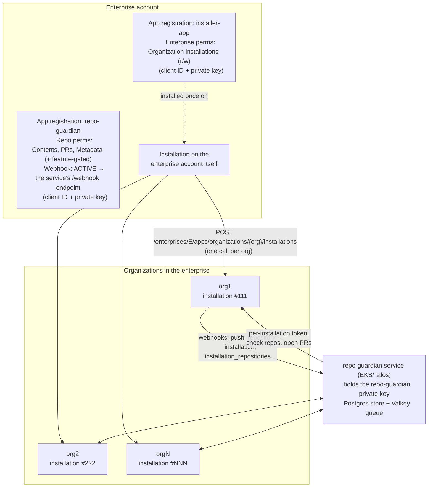
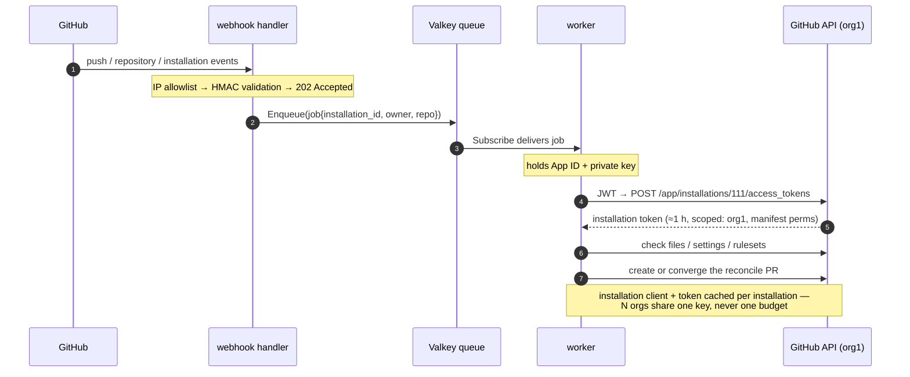

# repo-guardian GitHub App — Enterprise Setup Guide

How to register, install, and run repo-guardian as an **enterprise-owned
GitHub App** across N organizations in a GitHub Enterprise Cloud
account. One registration, one private key, N installations — the
[same-key-for-all-orgs stance](../investigation/0006-per-org-github-app-credentials.md)
(per-org credentials were investigated and deferred in INV-0006).

Companion docs: [Getting started](../usage/getting-started.md) covers a
single-org install; [Scaling repo-guardian](scaling.md) covers the
sizing math for multi-org fleets; [Running repo-guardian on AWS](aws.md)
covers the infrastructure underneath.

## The model in one diagram

Registration and installation are separate things. The **enterprise
account owns the app registration** (name, private key, permission
manifest, webhook config) — ownership grants no access.
**Installations** are the per-org grants: each one gives the app its
requested permissions on that org only, with its own installation ID
and its own independent rate-limit budget.



Key properties of this shape:

- **One registration, N installations.** The service holds a single App
  ID + private key; `ghinstallation` mints short-lived per-installation
  tokens on demand, and installation clients are cached per
  installation ID.
- **The service's configuration is oblivious to all of this.** There is
  no enterprise token, endpoint, or mode anywhere in the binary or
  chart — the deployment uses the same three credentials as a
  single-org install (`config.appId`, `secrets.privateKey`,
  `secrets.webhookSecret`), just pointing at the enterprise-owned
  registration. Enterprise ownership matters at exactly two moments:
  registration time (Step 1) and install time (Step 3), and the service
  participates in neither. Runtime auth is always per-installation.
- **Per-installation rate budgets.** Each org's installation gets its
  own budget — 5,000 req/hr baseline, scaling with repo and user count
  up to 12,500, and a flat 15,000 req/hr for installations on GitHub
  Enterprise Cloud orgs. One busy org cannot spend another org's
  budget. `docs/operations/scaling.md` has the math.
- Enterprise permissions (the ability to install apps into orgs) live
  on a separate **installer app** with a separate key. A leaked
  repo-guardian key can touch what repo-guardian's manifest grants —
  it can never install anything anywhere.
- Enterprise-owned apps can only be installed on the enterprise or orgs
  within it — structurally incapable of being installed outside, so
  there is no "accidentally public" failure mode.
- Permission changes made by an enterprise owner on the registration
  are **auto-accepted by every org installation** — no per-org approval
  chase when a new feature needs a new permission.

## Step 1 — Register the repo-guardian app

1. Go to `https://github.com/enterprises/<ENTERPRISE>/settings/apps` →
   **New GitHub App**.
2. Settings:
   - **Name:** `repo-guardian` (or your app naming convention).
   - **Homepage URL:** this repo's URL (required field).
   - **Webhook:** **Active**, unlike a pull-based CLI — repo-guardian is
     webhook-driven. **Webhook URL:** the service's public endpoint
     (ingress, LoadBalancer, or Tailscale Funnel — see the ordering
     note below). **Webhook secret:** generate a strong random value;
     it becomes `GITHUB_WEBHOOK_SECRET` / chart `secrets.webhookSecret`.
     Payloads are HMAC-validated, and the webhook route additionally
     sits behind the GitHub IP allowlist middleware (`SECURITY.md`).
   - **Expire user authorization tokens:** deselect (repo-guardian
     never signs in users).
   - **Permissions:** see the table below.
   - **Subscribe to events:** `Push`, `Repository`, `Installation
     repositories` (installation target events are delivered to App
     webhooks automatically).
   - **Enterprise permissions:** none.
3. Create the app. Record the **App ID** (→ `config.appId`) and
   **Client ID** (used by the Step 3 install loop).
4. **Generate a private key**. The `.pem` becomes
   `secrets.privateKey` (or an operator-managed Secret — ESO/1Password
   patterns in `docs/operations/aws.md`). The key never lives in a
   repo or a laptop; store it in your secrets backend.

### Permission manifest

Core — always required:

| Permission | Access | Used for |
|---|---|---|
| Repository → **Contents** | Read & write | File checks, reconcile-branch commits, forbidden-file deletion (`absent` rules) |
| Repository → **Pull requests** | Read & write | Create/update/close PRs, sticky reconcile-log comments, PR labels |
| Repository → **Metadata** | Read | Mandatory baseline; repo listing |

Feature-gated — grant only if your `guardian.hcl` uses the feature
(auto-accepted enterprise-wide when you add them later):

| Permission | Access | Needed by |
|---|---|---|
| Repository → **Administration** | Read & write | `rule "setting"` remediation (repo properties) and `rule "branch_protection"` / `branch_protection` reconciler (rulesets API) |
| Repository → **Issues** | Read & write | `label_sync` reconciler (label create/update/rename/delete) |
| Repository → **Workflows** | Read & write | Any rule or reconciler that writes `.github/workflows/*` (`renovate_workflow`, `custom_properties` in `github-action` mode) — Contents write alone is rejected by GitHub for workflow files |
| Repository → **Custom properties** | Read & write | `custom_properties` reconciler in `api` mode (`PATCH /repos/{o}/{r}/properties/values`) |
| Organization → **Custom properties** | Read | The org-schema preflight (IMPL-0017). Optional — without it the preflight fails open; with it, unmapped properties are filtered and surfaced via `custom_property_missing_schema_total`. See [annotation-properties migration](annotation-properties-migration.md) §4 |

> **Ordering note (webhook URL chicken-and-egg).** The registration
> form requires a webhook URL when the webhook is active, but you need
> the App ID + key from registration to deploy the service that serves
> that URL. Resolution: register with the *planned* URL, deploy the
> chart with the recorded credentials, then confirm delivery under the
> app's **Advanced → Recent Deliveries** tab. Deliveries that fired
> before the service was up can be redelivered from the same tab — or
> simply ignored, since the Discoverer converges on anything missed.
>
> The registration alone now exists but can do nothing anywhere. Access
> only materializes in Step 3.

## Step 2 — Installer app (reuse if it exists)

The installer app is what turns "install into N orgs" from a clickfest
into a loop. **Check whether one already exists** at
`https://github.com/enterprises/<ENTERPRISE>/settings/apps`. If yes,
skip to Step 3.

> **Do you actually need a second app?** Strictly, no — two
> alternatives exist, and the split is a deliberate choice, not an API
> requirement:
>
> - **Zero extra apps:** install repo-guardian into each org by hand
>   (org settings → the app's Install page). Fine at a handful of orgs;
>   a clickfest at 20+, and every new org is a manual step someone
>   forgets.
> - **One combined app:** the install endpoint's caller just needs
>   *some* app installed on the enterprise account with **Enterprise
>   organization installations: write** — GitHub documents no
>   prohibition on an app installing itself, so repo-guardian's own
>   registration could carry the enterprise permission and run the
>   Step 3 loop with its own key.
>
> Don't do the combined shape. That enterprise permission installs
> "**any valid GitHub App**" (GitHub's wording — not limited to
> enterprise-owned apps) into any org: a leaked key holding it lets an
> attacker install an app *they* control across the whole enterprise
> and mint tokens everywhere. repo-guardian's key is **hot** — mounted
> in a pod, touched on every reconcile. The installer key is **cold** —
> used for minutes at onboarding, then back in the vault, and reused
> for every future enterprise app (one more `client_id` through the
> same loop, no new install-capable key). Keep the escalation primitive
> out of the runtime credential. (The combined shape also gives the app
> an installation on the enterprise account itself, which the
> `Discoverer` would enumerate and fail-safe skip with log noise every
> `DISCOVERY_INTERVAL`.)

If not:

1. Same **New GitHub App** flow. Name it `<enterprise>-installer` per
   convention.
2. Webhook inactive, no repository permissions, no organization
   permissions.
3. **Enterprise permissions:** **Enterprise organization installations
   → Read and write**. This is the one permission that authorizes
   installing apps into member orgs.
4. Create, record Client ID, generate and store the private key.
5. In the app's sidebar → **Install App** → install it **on the
   enterprise account itself**. Note the installation ID from the
   resulting URL
   (`/enterprises/<ENTERPRISE>/settings/installations/<ID>`).

## Step 3 — Install repo-guardian into every org

Authenticate the installer app, then loop the install endpoint over the
org list:

```bash
# 1. JWT for the installer app (client ID + its private key)
INSTALLER_JWT=$(gen-jwt.sh "$INSTALLER_CLIENT_ID" installer.private-key.pem)

# 2. Exchange JWT for an enterprise-scoped installation token
INSTALLER_TOKEN=$(gh api --method POST \
  "/app/installations/${INSTALLER_INSTALL_ID}/access_tokens" \
  --header "Authorization: Bearer ${INSTALLER_JWT}" --jq .token)

# 3. Install repo-guardian into each org — all repositories
for ORG in $(cat orgs.txt); do
  gh api --method POST \
    "/enterprises/${ENTERPRISE}/apps/organizations/${ORG}/installations" \
    --header "Authorization: Bearer ${INSTALLER_TOKEN}" \
    --header "X-GitHub-Api-Version: 2022-11-28" \
    --field "client_id=${RG_CLIENT_ID}" \
    --field "repository_selection=all"
done
```

Notes:

- The endpoint takes the **client ID of the app being installed** — the
  installer token authorizes the act, the client ID says which app.
- **`repository_selection=all` matters for repo-guardian** (unlike a
  members-only app): it is an org-compliance tool, and `all` means new
  repos in the org are covered automatically. Per-repo exclusions
  belong in `guardian.hcl` `ignore {}` blocks, not in the installation's
  repo selection — ignores are visible, versioned policy; a `selected`
  installation is invisible drift.
- The call is effectively idempotent — an org that already has the
  installation returns an "already installed" error, which the loop
  treats as success.
- Each successful install fires an `installation.created` webhook at
  the already-running service, which seeds `repo_state` rows for the
  org's repos with jittered `LastCheckedAt` — so a 200-org rollout
  spreads its cold-start sweep over the freshness window instead of
  thundering.

## Step 4 — Verify

Spot-check the UI at
`https://github.com/organizations/<ORG>/settings/installations` —
repo-guardian should be listed. Programmatically, with the
**repo-guardian** app's own credentials:

```bash
RG_JWT=$(gen-jwt.sh "$RG_CLIENT_ID" repo-guardian.private-key.pem)
gh api "/orgs/${ORG}/installation" \
  --header "Authorization: Bearer ${RG_JWT}" --jq .id
```

Then verify the service side — installation is only half the story:

```bash
# Webhook deliveries landing (should show installation.created batches)
kubectl logs -n repo-guardian deploy/repo-guardian | grep installation

# Store rows seeded per org
psql "$STORE_DSN" -c \
  "SELECT owner, count(*), min(last_checked_at) FROM repo_state GROUP BY owner;"

# After the first sweep: per-org activity on the metrics endpoint
curl -s localhost:9090/metrics | grep 'repos_checked_total{'
```

Every org from `orgs.txt` should appear as an `owner` in `repo_state`
(webhook-seeded) even before the first sweep touches it. The periodic
`Discoverer` (`DISCOVERY_INTERVAL`, default 1h) enumerates all
installations and backfills anything a webhook missed, so a gap here
self-heals — but a *persistently* missing org means its installation
doesn't exist, and the Step 3 loop needs re-running.

**Do the first fleet-wide sweep in `DRY_RUN=true`.** At N orgs the
first reconcile is the largest PR burst the fleet will ever see. Dry
run logs every action it would take; review, then flip it off.

## Step 5 — How repo-guardian authenticates at runtime



Implementation notes:

- The `go-github` + `ghinstallation` transport handles the JWT/token
  dance; the binary never persists tokens.
- Installation clients are cached per installation ID
  (`getInstallClient`), so token minting and rate-limit accounting are
  per-org across the whole worker pool.
- Scheduled work follows the same path minus the webhook: the
  `StaleSweeper` enqueues repos whose `last_checked_at` exceeds
  `RECONCILE_FRESHNESS` (batch-bounded by `STALE_SWEEP_BATCH_SIZE`),
  and the `Discoverer` keeps the installation → repo inventory current.

## Ongoing operations

**New orgs.** Joining the enterprise does not install anything.
Onboarding = run the Step 3 loop for the org (or re-run the full list;
already-installed orgs no-op). From there discovery is automatic — the
`installation.created` webhook seeds the org's repos and the next sweep
covers them. **One caveat:** if your `guardian.hcl` declares a
top-level `scope { orgs = [...] }` (strict mode, DESIGN-0010), the new
org is discovered but every rule skips it — visible as
`out_of_scope_total{level="policy"}` — until you add it to the scope
list and roll the config. In legacy mode (no top-level scope) rules
apply to the new org with no config change.

**Key rotation.** GitHub App registrations support two private keys
simultaneously: generate the new key, update the secret backing
`secrets.privateKey`, roll the Deployment, confirm clean reconciles,
then delete the old key from the registration. Same procedure for the
installer app on its own cadence.

**Permission changes.** Edit the manifest on the enterprise-owned
registration; orgs in the enterprise auto-accept. This is how the
feature-gated permissions get added when you enable a feature later —
e.g. granting org-level **Custom properties: read** to activate the
schema preflight took effect fleet-wide with no per-org action
(the IMPL-0017 rollout).

**Webhook health.** The app's **Advanced → Recent Deliveries** tab is
the ground truth for delivery failures (the service returns
`202 Accepted` on ingest). Failed deliveries can be redelivered from
there; anything missed also converges via the Discoverer within
`DISCOVERY_INTERVAL`.

**Migrating from a non-enterprise registration.** An enterprise-owned
app is a **new registration** — new App ID, new private key, and new
installation IDs; there is no transfer path from a personal- or
org-owned registration. The cutover is: register per Step 1, swap the
chart's `config.appId` + `secrets.privateKey` + `secrets.webhookSecret`,
run the Step 3 loop, then uninstall the old app. The old `repo_state`
rows are orphaned but harmless (the primary key includes
`installation_id`; new installations re-seed fresh rows), and existing
reconcile PRs converge unchanged — the engine finds them by the
deterministic `repo-guardian/add-missing-files` branch name, not by
stored state. A credential swap plus a re-seed, not a data migration.

**Drain the Valkey queue during the cutover.** Unlike `repo_state`
rows, queued jobs are *not* harmless across the swap: each job carries
the old app's installation ID baked into its JSON, and a persistent
Valkey (EBS-backed, AOF/RDB enabled) keeps them across redeploys. The
new deployment's workers will dequeue them, fail to mint an
installation token for the dead ID, and — because a failed job is left
in-flight for the reaper to requeue after `JOB_ACK_TIMEOUT` (default
5m) — **retry them forever**. There is no attempt cap or dead-letter
queue today (DESIGN-0021 adds one). The symptom is a steady drip of
"installation not found" errors every ~5 minutes per stale job. The
fix, during cutover with the deployment scaled to zero:

```text
valkey-cli DEL repo-guardian:queue:jobs repo-guardian:queue:in-flight
```

(or `FLUSHDB` if the instance is dedicated to repo-guardian — every
key it holds is transient work state; the durable state lives in
Postgres). Nothing is lost: discovery and the stale-sweeper re-enqueue
anything due on the next tick. If the errors continue *after* the
flush, the old app registration still exists with an active webhook
pointed at the same URL — if its webhook secret matches, its
deliveries pass HMAC validation and keep minting jobs with dead
installation IDs. Suspend or delete the old app (or deactivate its
webhook) as part of the cutover, not as an afterthought.

**Uninstall / decommission.** Uninstalling from an org (org settings →
installations) immediately revokes that installation's tokens; the
org's `repo_state` rows go stale and its open reconcile PRs remain as
ordinary PRs. Deleting the registration revokes everything everywhere.

## References

- [Getting started](../usage/getting-started.md) — single-org setup,
  chart deployment, policy basics
- [Scaling repo-guardian](scaling.md) — multi-org sizing, sweep and
  discovery tuning, per-installation budget math
- [Running repo-guardian on AWS](aws.md) — EKS, RDS, ElastiCache,
  External Secrets
- [INV-0006](../investigation/0006-per-org-github-app-credentials.md)
  — why one App/key for all orgs (per-org credentials deferred)
- `SECURITY.md` — webhook IP allowlist + HMAC two-layer defence
- GitHub Docs — Automating app installations in your enterprise's
  organizations (installer-app pattern, install endpoint)
- GitHub Docs — Creating GitHub Apps for your enterprise
  (enterprise-owned registration, auto-accepted permission changes)
- GitHub REST — Apps: create an installation access token; Enterprise
  admin: organization installations
- GitHub Changelog — Enterprise-level access for GitHub Apps and
  installation automation APIs (2025-07-01)
