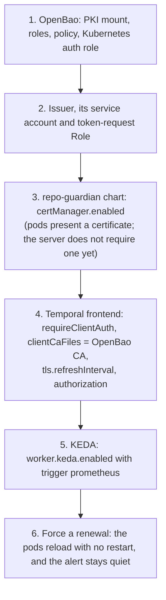

# Temporal client auth

How repo-guardian v2 authenticates to a self-hosted Temporal cluster,
and how to run it with a client certificate that renews itself
(DESIGN-0028, INV-0020).

## The posture

On open-source Temporal, mTLS and JWTs are not two ways of doing the
same thing. They are two layers:

| Layer | Mechanism | Answers |
| --- | --- | --- |
| Transport | mTLS | Is the connection encrypted, and does the client hold a certificate from a CA the frontend trusts? |
| Authorization | JWT claim mapper and default authorizer | What may this caller do, and in which namespace? |

Temporal's default claim mapper ignores the certificate subject. So a
certificate alone, with the authorizer off, grants full access to every
namespace. repo-guardian therefore uses both:

- **mTLS** with a short-lived client certificate from OpenBao, issued
  and renewed by cert-manager. It bounds who can connect.
- **An OIDC bearer token** from Keycloak or Okta, carrying
  `permissions: ["repo-guardian:write"]`. It bounds what the caller may
  do.

What workers on mTLS alone would give up (INV-0020 Observation 9):

| | OIDC token (with or without mTLS) | mTLS only, authorizer off |
| --- | --- | --- |
| Least privilege | `repo-guardian:write` on one namespace | any certificate is cluster admin |
| Dev and prod in one cluster | a dev token cannot touch the prod namespace | a dev certificate can |
| Revocation | disable the client in the IdP | rotate the CA or wait for expiry; Temporal checks no CRL |
| Audit | the IdP logs every token; the frontend sees a principal | the frontend sees a certificate subject only |
| Runtime dependency | the IdP must be up to renew tokens | none once the certificate is issued |
| KEDA's temporal trigger | cannot present a token: use the Prometheus trigger | works |

Either credential renews without a restart. The binary checks the TLS
files every `temporal.tls.reloadInterval` (default `30s`) and re-reads
the OIDC client secret each time it fetches a token.

## Environment isolation

Run one IdP client per environment (`repo-guardian-dev`,
`repo-guardian-prod`). A separate client alone is not enough, though:
the default authorizer checks the token's signature and its
`permissions`, never which client minted it. Isolation has to come from
something in the token, or in the keys a cluster trusts:

| Option | How it isolates | When |
| --- | --- | --- |
| **A client per environment plus an audience per cluster** (default) | each cluster sets `server.config.authorization.audience` (`temporal-dev`, `temporal-prod`), and only that environment's client has an audience mapper for it | any IdP with one realm or org |
| A separate IdP tenant per environment (Keycloak realm, Okta org) | each cluster trusts only its own tenant's signing keys | where separate tenants already exist, e.g. Okta prod and nonprod |

Keep the audience check even with separate tenants. It costs one
mapper, and it still holds if two clusters are later pointed at the same
tenant. Each environment also gets its own OpenBao PKI mount (or its own
OpenBao), so a dev certificate fails the handshake on prod.

repo-guardian needs no change for any of these: `temporal.auth.oidc`'s
token URL, client and audience are per-install values.

## Setup

The order matters. A client may present a certificate the server does
not ask for, but the server cannot require one before its clients have
it. Each step can be reverted on its own.



### 1. OpenBao

Use one PKI mount for Temporal only. The frontend admits every
certificate this CA signs, so sharing the CA with anything else widens
who gets through. The client and server roles are kept apart by
extended key usage: repo-guardian rejects a frontend certificate without
the server-auth EKU, and the frontend rejects a client certificate
without the client-auth EKU.

```bash
bao secrets enable -path=pki_temporal pki
bao secrets tune -max-lease-ttl=87600h pki_temporal
bao write pki_temporal/root/generate/internal \
    common_name="Temporal CA" ttl=87600h key_type=ec key_bits=384

# repo-guardian's client certificates: client EKU only, short-lived.
bao write pki_temporal/roles/repo-guardian \
    allowed_domains="repo-guardian" allow_bare_domains=true \
    allow_subdomains=false enforce_hostnames=false \
    client_flag=true server_flag=false \
    key_type=ec key_bits=256 max_ttl=72h

# The frontend's server certificate: server EKU only.
bao write pki_temporal/roles/temporal-frontend \
    allowed_domains="temporal-frontend" allow_bare_domains=true \
    client_flag=false server_flag=true \
    key_type=ec key_bits=256 max_ttl=720h

# What cert-manager may do, and the Kubernetes auth role it logs in with.
bao policy write repo-guardian-issuer - <<'EOF'
path "pki_temporal/sign/repo-guardian" { capabilities = ["create", "update"] }
EOF
bao write auth/kubernetes/role/repo-guardian-issuer \
    bound_service_account_names=repo-guardian-issuer \
    bound_service_account_namespaces=repo-guardian \
    audience="vault://repo-guardian/repo-guardian-temporal" \
    token_policies=repo-guardian-issuer token_ttl=5m
```

The `audience` is the one cert-manager requests for a namespaced Issuer:
`vault://<namespace>/<issuer name>`. Check the format against your
cert-manager version (for a ClusterIssuer it is `vault://<issuer name>`).

### 2. Issuer

The Issuer is yours, not the chart's. It needs a service account to log
in as, and cert-manager needs permission to mint that account's
tokens:

```yaml
apiVersion: v1
kind: ServiceAccount
metadata:
  name: repo-guardian-issuer
  namespace: repo-guardian
---
apiVersion: rbac.authorization.k8s.io/v1
kind: Role
metadata:
  name: repo-guardian-issuer-token
  namespace: repo-guardian
rules:
  - apiGroups: [""]
    resources: ["serviceaccounts/token"]
    resourceNames: ["repo-guardian-issuer"]
    verbs: ["create"]
---
apiVersion: rbac.authorization.k8s.io/v1
kind: RoleBinding
metadata:
  name: repo-guardian-issuer-token
  namespace: repo-guardian
roleRef:
  apiGroup: rbac.authorization.k8s.io
  kind: Role
  name: repo-guardian-issuer-token
subjects:
  - kind: ServiceAccount
    name: cert-manager
    namespace: cert-manager
---
apiVersion: cert-manager.io/v1
kind: Issuer
metadata:
  name: repo-guardian-temporal
  namespace: repo-guardian
spec:
  vault:
    server: https://openbao.openbao.svc:8200
    path: pki_temporal/sign/repo-guardian
    caBundleSecretRef: {name: openbao-ca, key: ca.crt}
    auth:
      kubernetes:
        role: repo-guardian-issuer
        mountPath: /v1/auth/kubernetes
        serviceAccountRef:
          name: repo-guardian-issuer
```

OpenBao keeps Vault's HTTP API, which is what cert-manager's Vault
issuer speaks. Confirm the Issuer is ready before going on:

```bash
kubectl -n repo-guardian get issuer repo-guardian-temporal
```

### 3. repo-guardian chart values

```yaml
temporal:
  address: temporal-frontend.temporal.svc:7233
  tls:
    serverName: temporal-frontend
    reloadInterval: 30s
    certManager:
      enabled: true
      issuerRef:
        name: repo-guardian-temporal
      # Defaults: commonName repo-guardian, duration 24h, renewBefore 8h.
  auth:
    oidc:
      tokenUrl: https://keycloak.example/realms/temporal/protocol/openid-connect/token
      clientId: repo-guardian-prod
      existingSecret: repo-guardian-temporal-oidc   # key: client-secret
      audience: temporal-prod
```

The chart renders a `Certificate` (client auth, ECDSA P-256,
`rotationPolicy: Always`) whose Secret, `<fullname>-temporal-tls` by
default, is mounted into every role that dials Temporal. The Vault
issuer writes `ca.crt` beside `tls.crt` and `tls.key`, and the pods
verify the frontend against it. Every role shares one certificate and
one IdP client: the default authorizer's roles are reader, writer and
admin, and both `ingest` and `worker` need writer.

At this point the pods present a certificate but nothing requires one.
Check that it is loaded:

```bash
cmctl status certificate -n repo-guardian <fullname>-temporal-client
```

On `/metrics`, `repo_guardian_temporal_client_cert_expiry_timestamp_seconds`
should be about 24h ahead.

### 4. Temporal frontend

Issue the frontend's certificate from the `temporal-frontend` role, and
list the OpenBao CA in the frontend's `clientCaFiles` (under
`server.config.tls.frontend.server` if it is not the CA in the
frontend's own Secret). Then turn on client auth, the certificate
refresh and the authorizer. `contrib/temporal/values-base.yaml` has the
whole shape:

```yaml
server:
  tls:
    frontend:
      enabled: true
      secretName: temporal-frontend-tls
      requireClientAuth: true
  internal-frontend:
    enabled: true
  config:
    tls:
      refreshInterval: 1m
    authorization:
      jwtKeyProvider:
        keySourceURIs:
          - https://keycloak.example/realms/temporal/protocol/openid-connect/certs
        refreshInterval: 1m
      permissionsClaimName: permissions
      audience: temporal-prod
      authorizer: default
      claimMapper: default
```

This is the one step that can lock clients out. To roll back, set
`requireClientAuth: false`.

### 5. KEDA

KEDA's own Temporal trigger cannot present an OIDC token. The chart
therefore defaults to the Prometheus trigger, which reads the Temporal
server's `approximate_backlog_count`. KEDA never dials Temporal, so it
works under any client auth:

```yaml
worker:
  keda:
    enabled: true
    trigger: prometheus
    prometheus:
      serverAddress: http://prometheus.monitoring:9090
    maxReplicas: 4
```

The default query is
`sum(max by (partition, task_type) (approximate_backlog_count{namespace="repo-guardian", taskqueue="repo-guardian"}))`.
Override it with `worker.keda.prometheus.query` if your server's metrics
carry a prefix. Size `maxReplicas` to the GitHub budget, not to the
backlog: checks are rate-limit bound, so pods beyond the budget only
wait on more timers (INV-0018 Observation 7). After three failed polls,
KEDA holds the worker at `worker.keda.fallbackReplicas` (default
`worker.replicas`).

`trigger: temporal` remains available for mTLS-only clusters. With a
client certificate, the chart renders a `TriggerAuthentication` from the
same Secret. It is refused alongside `temporal.auth.oidc`.

### 6. Prove renewal

```bash
cmctl renew -n repo-guardian <fullname>-temporal-client
```

Within `reloadInterval` plus kubelet's Secret sync (up to about a minute),
each pod logs `temporal: loaded a renewed client certificate` and
increments
`repo_guardian_temporal_credential_reloads_total{credential="client_cert",outcome="changed"}`.
The expiry gauge moves forward, and no pod restarts.

## Troubleshooting

| Signal | Meaning |
| --- | --- |
| `repo_guardian_temporal_client_cert_expiry_timestamp_seconds` | When the certificate each pod presents expires. With the defaults it stays between 8h and 24h ahead. |
| `repo_guardian_temporal_credential_reloads_total{outcome="error"}` | A reload failed, by `credential` (`client_cert`, `ca`, `oidc_secret`). The pod keeps the last good set and retries on the next poll. A one-off is a read racing kubelet's Secret swap; a rising count is a bad Secret. |
| `RepoGuardianTemporalClientCertExpiring` | Less than 4h left on some pod's certificate: renewal or reload has failed with hours to spare. Rendered only when a client certificate is configured. |
| Log `temporal: reloading TLS files failed; keeping the previous ones` | The reload error, with the reason. |

When the alert fires:

1. `cmctl status certificate -n repo-guardian <fullname>-temporal-client`
   shows whether cert-manager renewed it and, if not, the Issuer's
   error. The usual causes are OpenBao's Kubernetes auth (role, bound
   service account, audience) and the token-request Role.
2. If the Secret is fresh but the gauge is not, the pods are failing to
   load it. Check the reload error counter and the log above.

The pods refuse to *start* on a missing, mismatched or expired
certificate, because the first load is strict. Later loads are
forgiving: they keep the last good set.

For the generated dashboards and alerts, pass `--temporal-client-cert`
to `repo-guardian monitoring generate`. That adds the same alert, and a
time-to-expiry stat on the system dashboard
([monitoring-generation.md](monitoring-generation.md)).
