## Deep dive 1: data model and type flow

This section draws the types the five documents define and shows how each is produced and consumed, so the flow can be checked end to end. Everything here is taken from DESIGN-0030 (policy types), DESIGN-0031 (control framework), DESIGN-0032 (results and remediation) and DESIGN-0033 (the amendments it adds). Drawing it the first time exposed types the prose relied on but never wrote down; those were folded back into the documents, and the list at the end of the section records where each landed.

### Three layers

Policy documents are data. Loading them produces one immutable `policy.Snapshot`, which holds built `control.Control` instances. Everything at run time either resolves a repository against the snapshot or runs a control from it, and every outcome lands in a table.

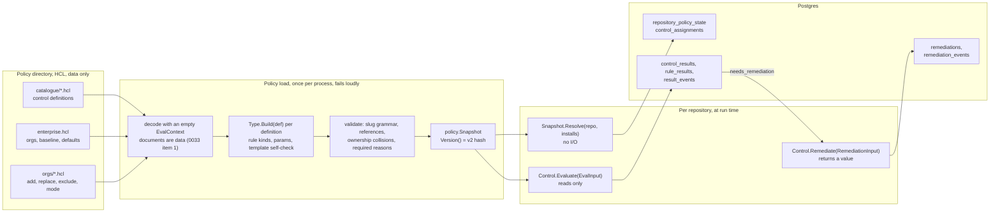

### Policy and resolution types (DESIGN-0030)

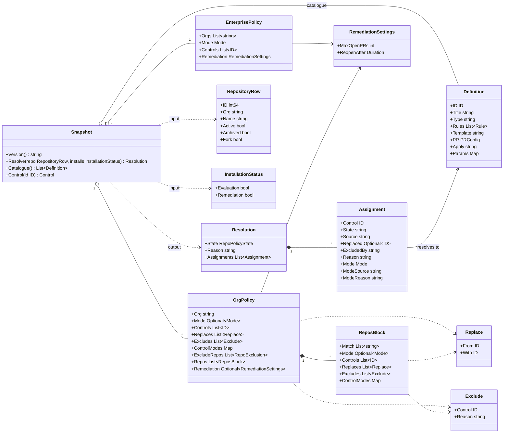

The three documents, condensed to the attributes the types above carry:

```hcl
# catalogue/codeowners.hcl — one Definition
control "codeowners" {
  version = 2
  title   = "CODEOWNERS"
  type    = "codeowners"                  # the Go control type

  rule "exists"     { number = "1.1"  title = "..."  remediate = true }
  rule "wiz-owners" { number = "1.2"  title = "..."  kind = "owners"
                      pattern = ".wiz"  owners = ["@{{ .Org }}/security_champions"]
                      remediate = true }

  template = "codeowners"                 # full-file template for an absent file
  pr { title = "chore: CODEOWNERS ({{ .Control.Title }} v{{ .Control.Version }})" }
}

# enterprise.hcl — the baseline and the onboarding gate (no excludes)
enterprise {
  orgs     = ["donaldgifford", "test-org", "platform"]
  mode     = "evaluate"
  controls = ["codeowners@1", "catalog_info@1", "dependency_updates@1"]
  remediation { max_open_prs = 3  reopen_after = "336h" }
}

# orgs/test-org.hcl — one layer plus N repos layers
org "test-org" {
  mode     = "remediate"
  controls = ["branch_ruleset@1"]
  replace "codeowners@1" { with = "codeowners@2" }
  exclude "dependency_updates@1" { reason = "in-house updater" }
  control "codeowners@2" { mode = "evaluate" }
  exclude_repos { match = ["sandbox-*"]  reason = "throwaway" }
  repos { match = ["legacy-*"]  mode = "evaluate"
          exclude "catalog_info@1" { reason = "being decommissioned" } }
}
```

The Go surface the rest of the system calls, as DESIGN-0030 names it (`policy.Snapshot`, `Resolve`, `Version`) with the field set taken from the resolution output table and the `control_assignments` columns:

```go
package policy

// Snapshot is one loaded, validated policy directory. Immutable.
type Snapshot struct { /* catalogue, enterprise, orgs, built controls, version */ }

func (s *Snapshot) Version() string                 // "v2:<sha256>", hashes catalogue + policies + templates
func (s *Snapshot) Control(id control.ID) control.Control

// Resolve is deterministic and performs no I/O. It is called inline by
// discovery, by policy rollout and when an installation changes.
func (s *Snapshot) Resolve(repo RepositoryRow, installs InstallationStatus) Resolution

type RepositoryRow struct {
    ID                   int64
    Org, Name            string
    Active, Archived, Fork bool          // Active is the parking flag
}

type InstallationStatus struct {
    Evaluation, Remediation bool         // per org, per App
}

type RepoPolicyState string             // managed | excluded | unmanaged | parked

type Resolution struct {
    State       RepoPolicyState
    Reason      string                   // exclusion or park reason
    Assignments []Assignment             // empty unless State == managed
}

// Assignment is one row of control_assignments.
type Assignment struct {
    Control    control.ID                // {Slug: "codeowners", Version: 2}
    State      string                    // active | excluded
    Source     string                    // enterprise | org:<org> | org:<org>/repos[<glob>]
    Replaced   *control.ID               // codeowners@1 when a replace applied
    ExcludedBy string
    Reason     string
    Mode       Mode                      // evaluate | remediate
    ModeSource string
    ModeReason string                    // "" | remediation_app_not_installed
}
```

Resolution walks the layers. Each layer is one step that applies `replace`, additions, exclusions and mode together on top of the previous set:

```go
func (s *Snapshot) Resolve(repo RepositoryRow, inst InstallationStatus) Resolution {
    if !repo.Active                          { return Resolution{State: Parked, Reason: repo.ParkReason} }
    if !s.enterprise.HasOrg(repo.Org)        { return Resolution{State: Unmanaged} }
    org := s.orgs[repo.Org]                  // may be zero-valued
    if r, ok := org.ExcludeRepos.Match(repo.Name); ok {
        return Resolution{State: Excluded, Reason: r.Reason}
    }
    set := newAssignmentSet(s.enterprise)    // layer 1: baseline, default mode
    set.apply(org.Layer(), "org:"+repo.Org)  // layer 2: replace, add, exclude, mode, overrides
    for _, b := range org.Repos {            // layers 3..n, file order
        if b.Matches(repo.Name) {
            set.apply(b.Layer(), fmt.Sprintf("org:%s/repos[%s]", repo.Org, b.Label()))
        }
    }
    set.resolveModes()                       // most specific wins
    if !inst.Remediation {
        set.forceMode(Evaluate, "remediation_app_not_installed")
    }
    set.checkOwnership()                     // backstop; a collision here is a bug
    return Resolution{State: Managed, Assignments: set.rows()}
}
```

How a repository's policy state moves. Only discovery un-parks, and a parked row has no assignments:

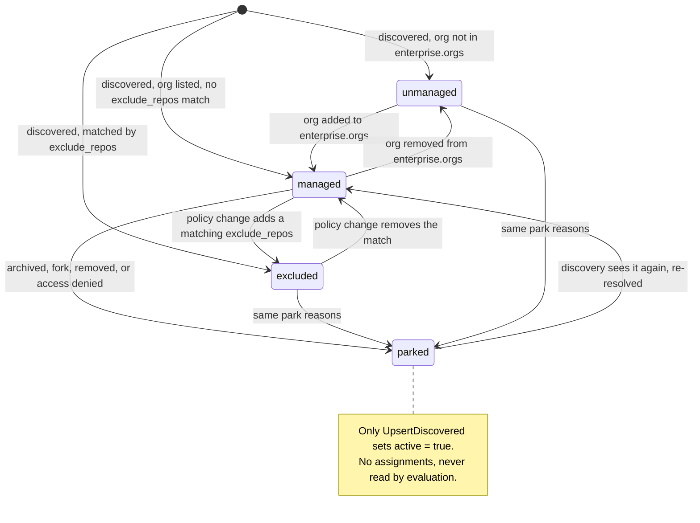

### Control framework types (DESIGN-0031)

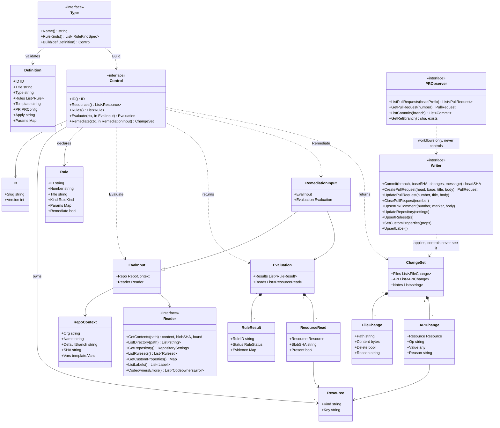

Three things on the diagram were missing from DESIGN-0031's first draft and were added during this pass. `Reason` on `FileChange` and `APIChange` carries DESIGN-0033 item 3 (`missing`, `rule_failed:<id>`, `stale`, `orphan`). `PRObserver` is the third GitHub interface (0031 D7): the PR and branch reads the workflows need and no control does, which keeps `Reader` honest as "everything a control may read". `Writer.Commit` (0031 D8) replaces the Contents-API file methods so a change set is one commit on the git-data API with a non-forced ref update. `Definition`, the argument to `Type.Build`, is the catalogue entry after decode:

```go
package control

// Definition is one catalogue entry after HCL decode and before Build
// (DESIGN-0031 "Supporting types").
type Definition struct {
    ID       ID                 // slug + integer version
    Title    string
    Type     string             // Type.Name() this definition is built by
    Rules    []Rule             // kinds and params validated by Type.Build
    Template string             // template store name; must pass every remediable rule
    PR       policy.PRConfig    // title/body/labels, rendered with internal/template
    Apply    string             // "pr" (default) | "direct"  — API-remediated types only
    Params   map[string]any     // type-level params: dependency_updates.tool, file.path, …
}
```

Status derivation is a pure function of the rule results. `fail` outranks `error` on purpose: one definite failure is non-compliant whatever else could not be determined, and an `error` never triggers remediation.

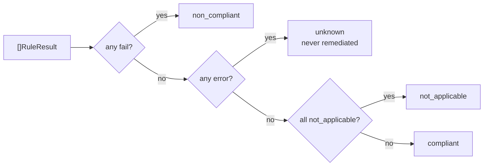

```go
package control

type Status string // compliant | non_compliant | unknown | not_applicable

func StatusOf(ev Evaluation) Status { /* table above, in that order */ }

// Fingerprint is what DESIGN-0032 compares between evaluations. It hashes
// rule statuses and resource blob SHAs and nothing else: not evidence
// wording, not timestamps, not the pinned commit.
func Fingerprint(id ID, ev Evaluation) string {
    h := sha256.New()
    fmt.Fprintf(h, "%s@%d\n", id.Slug, id.Version)
    for _, r := range sortedByRuleID(ev.Results)   { fmt.Fprintf(h, "r %s %s\n", r.RuleID, r.Status) }
    for _, rd := range sortedByResource(ev.Reads)  {
        sha := rd.BlobSHA
        if !rd.Present { sha = "absent" }
        fmt.Fprintf(h, "x %s:%s %s\n", rd.Resource.Kind, rd.Resource.Key, sha)
    }
    return hex.EncodeToString(h.Sum(nil))
}
```

### Writing a control type: the codeowners example

A file control type supplies `Parse`, `Check`, `Fix` and `Render`; the framework supplies `LocateFile`, the absent-file template path, the unparseable-file guard and the minimal-edit rule. The helper names below (`control.EvaluateFile`, `control.RemediateFile`) are illustrative; DESIGN-0031 describes the behaviour, not the helper API.

```go
package codeowners

var spec = control.FileSpec{
    Locations: []string{".github/CODEOWNERS", "CODEOWNERS", "docs/CODEOWNERS"}, // GitHub's precedence (A21)
    Canonical: ".github/CODEOWNERS",
}

type Type struct{}

func (Type) Name() string                  { return "codeowners" }
func (Type) RuleKinds() []control.RuleKind { return []control.RuleKind{"exists", "valid", "owners", "default_owner"} }

func (Type) Build(def control.Definition) (control.Control, error) {
    for _, r := range def.Rules {
        if err := validateParams(r); err != nil { return nil, err } // e.g. owners requires pattern + owners
    }
    tmpl, err := templates.Compile(def.Template)                     // internal/template (A10)
    if err != nil { return nil, err }
    c := &ctl{def: def, tmpl: tmpl}
    return c, control.SelfCheckTemplate(c)                           // the template must pass every remediable rule (D2)
}

type ctl struct { def control.Definition; tmpl *template.Compiled }

func (c *ctl) ID() control.ID                { return c.def.ID }
func (c *ctl) Rules() []control.Rule         { return c.def.Rules }
func (c *ctl) Resources() []control.Resource { return control.FileResources(spec) } // file:<each location>

func (c *ctl) Evaluate(ctx context.Context, in control.EvalInput) (control.Evaluation, error) {
    return control.EvaluateFile(ctx, in, spec, c.def.Rules, parse, check) // absent → fail+file_missing, parse error → error
}

func (c *ctl) Remediate(ctx context.Context, in control.RemediationInput) (control.ChangeSet, error) {
    return control.RemediateFile(ctx, in, spec, c.def.Rules, parse, fix, render, c.tmpl) // one FileChange, found path or Canonical
}

// fix inserts missing "pattern owners" lines least- to most-specific and
// before any trailing "*" line, so a narrow pattern is never shadowed.
func fix(m *model, failing []control.Rule) *model { /* ... */ }
```

### Runtime flow: who produces and consumes each type

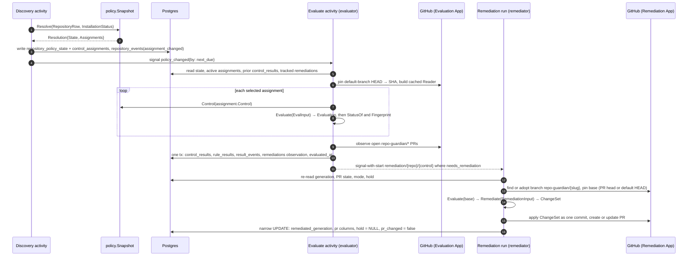

The two activities, as consumers of the types. The evaluate activity returns only decisions to the workflow; the data stays in the database (DESIGN-0026's rule that payloads carry ids and counts, never evidence):

```go
package activities

type EvaluateInput struct {
    RepositoryID  int64
    Trigger       string   // schedule | push | pr_event | policy_changed | manual
    ChangedPaths  []string // push only; nil means "all"
    EvalKey       string   // <workflowID>/<runID>/<iteration>, idempotency key for the evaluation log
}

type ControlDecision struct {
    Control          control.ID
    Changed          bool // fingerprint moved → eval_generation bumped
    PRChanged        bool
    NeedsRemediation bool // the predicate below
}

type EvaluateOutput struct {
    Skipped   bool              // policy state not managed
    Decisions []ControlDecision
}

func (e *Evaluator) Evaluate(ctx context.Context, in EvaluateInput) (EvaluateOutput, error) {
    st, _ := e.store.RepositoryPolicyState(ctx, in.RepositoryID)
    if st.State != policy.Managed { return EvaluateOutput{Skipped: true}, nil }

    asg, _   := e.store.ActiveAssignments(ctx, in.RepositoryID)            // control_assignments WHERE state = 'active'
    prior, _ := e.store.ControlResults(ctx, in.RepositoryID)               // fingerprints, generations, holds
    prs, _   := e.store.TrackedRemediations(ctx, in.RepositoryID)          // open PRs we recorded

    sha, _ := e.gh.DefaultBranchHead(ctx, st.Repo)                          // pin once
    rd := e.gh.Reader(st.Repo, sha)                                         // cached; every control sees one state

    var outs []controlOutcome
    for _, a := range selectByChangedPaths(asg, in.ChangedPaths, e.snapshot) { // Resources() ∩ changed paths
        ctrl := e.snapshot.Control(a.Control)
        ev, err := ctrl.Evaluate(ctx, control.EvalInput{Repo: repoContext(st.Repo, sha), Reader: rd})
        if err != nil { ev = control.ErrorEvaluation(ctrl, err) }           // every rule → error, control → unknown
        outs = append(outs, controlOutcome{
            Assignment: a, Evaluation: ev,
            Status:      control.StatusOf(ev),
            Fingerprint: control.Fingerprint(a.Control, ev),
        })
    }
    obs, _ := observePRs(ctx, e.prs, prs)                                    // github.PRObserver: head SHA moved? closed? merged? missing?

    dec, err := e.store.RecordEvaluation(ctx, in.EvalKey, sha, outs, obs)  // ONE transaction, computes Changed/NeedsRemediation
    return EvaluateOutput{Decisions: dec}, err
}
```

```text
needs_remediation(repository, control) =
      repository_policy_state.state = 'managed'
  AND assignment.mode = 'remediate'                       -- already 'evaluate' when the Remediation App is absent
  AND (
        (   status = 'non_compliant'
        AND EXISTS failing rule WITH remediate = true
        AND (   eval_generation > remediated_generation   -- 1 > 0 on a brand-new row
             OR pr_changed
             OR (remediation.state = 'closed_by_user' AND closed_at + reopen_after < now()) ) )
     OR (status = 'compliant' AND remediation.state = 'open')   -- close it as closed_compliant
  )
```

The remediation run consumes the same `Control`, but against the PR head when one exists, and never trusts the stored evaluation:

```go
func (r *Remediator) Run(ctx context.Context, in RunInput) error {
    s, _ := r.store.RemediationState(ctx, in.RepositoryID, in.Control)       // generation, PR, mode, hold
    if !s.NeedsRemediation { return nil }
    startGen := s.EvalGeneration                                              // recorded at the END, not the current one

    lk, _ := findOrAdopt(ctx, r.prs, "repo-guardian/"+in.Control.Slug)        // github.PRObserver: GetRef, ListCommits (authors), ListPullRequests (by head)
    if lk.HasForeignCommits { return r.store.Hold(ctx, s, "foreign_branch") }
    if s.Status == control.Compliant && lk.OpenPR != nil { return r.closeCompliant(ctx, s, lk.OpenPR) }
    if lk.OpenPR == nil && s.OpenPRs >= s.MaxOpenPRs { return r.store.Hold(ctx, s, "pr_cap") }

    base := lk.HeadSHA; if lk.OpenPR == nil { base = lk.DefaultHeadSHA }
    ctrl := r.snapshot.Control(in.Control)
    rd := r.gh.Reader(s.Repo, base)                                           // Remediation App, read half
    ev, _ := ctrl.Evaluate(ctx, control.EvalInput{Repo: rc(s.Repo, base), Reader: rd})
    if !control.HasRemediableFailure(ctrl, ev) { return r.store.Record(ctx, s, lk, startGen) } // human fixed it on the PR
    cs, _ := ctrl.Remediate(ctx, control.RemediationInput{EvalInput: control.EvalInput{Repo: rc(s.Repo, base), Reader: rd}, Evaluation: ev})

    if err := control.SelfCheck(ctx, ctrl, cs, rd); err != nil { return err } // changed content must pass; refuse otherwise
    head, err := r.writer.Commit(ctx, "repo-guardian/"+in.Control.Slug, base, cs.Files, message(ctrl, ev)) // git-data: one commit, no force (0031 D8)
    if errors.Is(err, github.ErrNotFastForward) { return queue.RetryAfter(…) }  // a human pushed; re-pin next run
    pr, _ := createOrUpdatePR(ctx, r.writer, head, lk.OpenPR, renderPR(ctrl, ev, cs))
    return r.store.Record(ctx, s, pr, startGen)                              // narrow UPDATE
}
```

Per `(repository, control)` the result row moves between three conditions. "Due" is `needs_remediation` true:

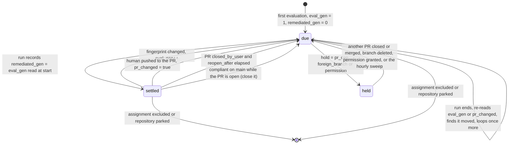

### Column ownership on control_results

Two writers share one row by column, never by row. Getting this wrong is the exact loss the generation counters exist to prevent.

| Column | Written by | When |
| ------ | ---------- | ---- |
| `status`, `fingerprint`, `evaluated_sha`, `evaluated_at`, `last_changed_at` | evaluation | every evaluation (`evaluated_at` always, the rest on change) |
| `eval_generation` | evaluation | inserts 1 on the first row, increments on a fingerprint change |
| `pr_changed = true` | evaluation | PR head SHA moved since the last remediation |
| `remediated_generation` | remediation | set to the generation read at the start of the run, after the GitHub write |
| `pr_changed = false`, `hold`, `hold_since` | remediation | the narrow record UPDATE, or a hold without a write |
| `control_version` | evaluation | the version the assignment carried when the row was written |

### Where DESIGN-0033 touches the types

- **Slug grammar** `^[a-z0-9]+(-[a-z0-9]+)*$` on `ID.Slug` and `Rule.ID`, enforced at load (item 2). A catalogue control no policy assigns is a load warning.
- **`Reason` on every change** (item 3): `FileChange.Reason` and `APIChange.Reason` take `missing`, `rule_failed:<rule id>`, `stale`, `orphan`. They feed `repo-guardian evaluate --format json` and the PR body, and are not persisted.
- **`custom_properties` definition** gains `tag_schema = file("...")` (OQ2a): the managed set becomes `{rendered GitHub key for every repo-scoped tag} ∪ annotation_properties values`, and a `value_pattern` rule kind checks well-formedness before a write. Evidence gains `source = tag_schema | annotation_properties`.
- **Documents are data** (item 1): the loader's `EvalContext` has no variables and one function, a `file()`-style path reference that returns a cleaned in-root path, never contents.

```gap
**Found while drawing the data model, resolved in the documents**

- `control.Definition` was used by `Type.Build` and never defined → added to DESIGN-0031 "Supporting types", including `Apply` (`remediation { apply }`) and type-level `Params`.
- `FileChange` and `APIChange` lacked the `Reason` DESIGN-0033 item 3 relies on → added to both structs in DESIGN-0031.
- `github.Reader` had no pull-request methods, yet evaluation observes PRs and the run does find-or-adopt → `github.PRObserver` (DESIGN-0031 D7): `ListPullRequests`, `GetPullRequest`, `ListCommits`, `GetRef`, used by workflows only.
- `github.Writer` could not deliver one commit per change set → `Writer.Commit` on the git-data API with `ErrNotFastForward` (DESIGN-0031 D8); the Contents-API file methods are gone.
- The PR templates used `.Control.Title` with no variables defined → `template.PRVars` gains `.Control`, `.Failing` and `.Notes` (DESIGN-0031 "API / Interface Changes").
- Rule-kind parameters had no metadata for the docs generator → `RuleKinds()` returns `[]RuleKindSpec{Kind, Params, Remediable}` (DESIGN-0031).
```

## Deep dive 2: the API

DESIGN-0032 lists the resources; DESIGN-0030 names three of them; the v2 API skeleton (IMPL-0025 Phases 14 and 15) supplies the machinery every one of them runs through: OpenAPI 3.1 as the source of truth, oapi-codegen strict server, authn outside the generated wrapper, authz into `store.APIScope`, the scope predicate on every query, read-only pool, keyset cursors. This section shows what changes on top of that and what each endpoint reads.

### Surface: today and after

| Today (v2 rc) | After | Reads |
| ------------- | ----- | ----- |
| `GET /me` | unchanged | principal, visible orgs |
| `GET /summary` | **extended**: evaluation freshness, remediation backlog, holds | `control_results`, `remediations`, `repository_policy_state` |
| `GET /rules`, `GET /rules/{kind}/{name}` | **replaced by** `GET /controls`, `GET /controls/{id}` | catalogue from the snapshot, compliance from `control_assignments ⨝ control_results` |
| `GET /orgs`, `GET /orgs/{org}` | **extended**: baseline-versus-org compliance, worst controls, exclusions with reasons | same join, cut by `source` |
| `GET /findings` | **replaced by** `GET /repositories/{id}/controls` (per repository) and `GET /remediations` (fleet-wide PRs) | `control_assignments ⨝ control_results ⨝ rule_results ⨝ remediations` |
| `GET /repositories`, `GET /repositories/{id}` | unchanged shape, plus `policy_state`, `policy_reason`, `evaluable`, `remediable` | `repositories ⨝ repository_policy_state ⨝ installations` |
| `GET /repositories/{id}/events` | **extended**: assignment, result and remediation events merged | `UNION ALL` of `repository_events`, `result_events`, `remediation_events` |
| `GET /repositories/{id}/checks` | **renamed** `GET /repositories/{id}/evaluations` | `checks` as the evaluation log (A6) |
| — | **new** `POST /repositories/{id}/evaluate` → 202, signals `recheck` at priority 1; 501 when the api role has no Temporal client (DESIGN-0032 D9) | none (signal only) |
| `GET /compliance/history` | unchanged path, new key `(org, control_id, source)` | `compliance_snapshots` |
| `GET /policy` | **replaced by** `GET /policies` (enterprise orgs, org policies, exclusions, version) | the snapshot summary in `policy_versions.summary` |
| `GET /installations` | gains `app` | `installations` |
| `GET /status` | **extended**: per-queue backlog (`repo-guardian-eval`, `repo-guardian-remediate`) | `StatusInputs` + `DescribeBacklog` per queue |
| — | **new** `GET /remediations` | `remediations` filtered by state, org, control, age |
| — | **new** `GET /controls/{id}/compliance` (per-org breakdown, optional split from the detail view) | same join |

### Resource schemas

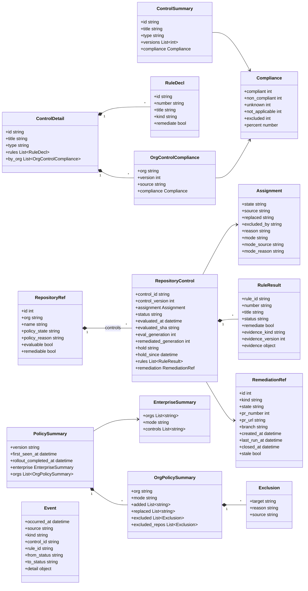

Field names are snake_case and the enums stay open strings documented in `description`, as the v2 spec does today. `evidence_kind` replaces the injected `reason` as the `oneOf` discriminator: evidence is keyed by `(control type, rule kind, version)`, so the field is `"<control type>/<rule kind>"` (`codeowners/owners`, `catalog_info/field_set`, …) next to `evidence_version`, and the UI renders only kinds and versions it knows (DESIGN-0032 "API / Interface Changes").

### Example: one repository's controls

```json
GET /repositories/4821/controls

{
  "repository": { "id": 4821, "org": "test-org", "name": "payments-api",
                  "policy_state": "managed", "policy_reason": null, "evaluable": true, "remediable": true },
  "controls": [
    {
      "control_id": "codeowners", "control_version": 2,
      "assignment": { "state": "active", "source": "org:test-org", "replaced": "codeowners@1",
                      "mode": "evaluate", "mode_source": "org:test-org/control[codeowners@2]", "mode_reason": null },
      "status": "non_compliant",
      "evaluated_at": "2026-10-02T14:03:11Z", "evaluated_sha": "9f1c…",
      "eval_generation": 3, "remediated_generation": 2, "hold": null,
      "rules": [
        { "rule_id": "exists",     "number": "1.1", "status": "pass", "remediate": true,
          "evidence_kind": "codeowners/exists", "evidence_version": 1, "evidence": { "path": ".github/CODEOWNERS" } },
        { "rule_id": "wiz-owners", "number": "1.2", "status": "fail", "remediate": true,
          "evidence_kind": "codeowners/owners", "evidence_version": 1,
          "evidence": { "pattern": ".wiz", "required": ["@test-org/security_champions"], "effective_owners": ["@test-org/payments"] } }
      ],
      "remediation": { "id": 77, "kind": "pull_request", "state": "open", "pr_number": 12,
                       "pr_url": "https://github.com/test-org/payments-api/pull/12", "branch": "repo-guardian/codeowners",
                       "created_at": "2026-09-20T09:00:00Z", "last_run_at": "2026-10-01T08:12:40Z", "stale": false }
    },
    {
      "control_id": "dependency_updates", "control_version": 1,
      "assignment": { "state": "excluded", "source": "enterprise", "excluded_by": "org:test-org",
                      "reason": "test-org uses an in-house updater", "mode": "remediate", "mode_source": "org:test-org" },
      "status": null, "rules": [], "remediation": null
    }
  ]
}
```

The second entry is why excluded assignments are stored, not dropped: "excluded by policy, with reason" is posture the UI shows, and it is distinct from a control that ran and reported `not_applicable`.

### Request flow

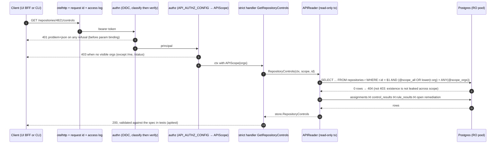

### Query shape

Every `api_*.sql` query carries the scope predicate and `TestAPIQueries_AreScoped` enforces it. The new tables have no `org` column, so the predicate lands on the `repositories` join, aliased `r` as today:

```sql
-- name: APIRepositoryControls :many
SELECT a.control_id, a.control_version, a.state, a.source, a.replaced, a.excluded_by, a.reason,
       a.mode, a.mode_source, a.mode_reason,
       cr.status, cr.evaluated_at, cr.evaluated_sha, cr.eval_generation, cr.remediated_generation,
       cr.hold, cr.hold_since,
       rm.id AS remediation_id, rm.kind, rm.state AS remediation_state, rm.pr_number, rm.pr_url, rm.branch,
       rm.created_at, rm.last_run_at, rm.closed_at,
       (rm.state = 'open' AND rm.created_at < @stale_before::timestamptz) AS pr_stale
FROM control_assignments a
JOIN repositories r ON r.id = a.repository_id
LEFT JOIN control_results cr ON (cr.repository_id, cr.control_id) = (a.repository_id, a.control_id)
LEFT JOIN remediations rm   ON (rm.repository_id, rm.control_id) = (a.repository_id, a.control_id)
                           AND rm.state IN ('open', 'recommended')
WHERE a.repository_id = @repository_id
  AND (@scope_all::bool OR lower(r.org) = ANY (@scope_orgs::text[]))
ORDER BY a.state, a.control_id;
```

Compliance for `/controls`, `/orgs` and `/orgs/{org}` comes from one shared query so the report, the API and the snapshots cannot drift (the IMPL-0025 Phase 8 rule, with the new keys):

```sql
-- name: ComplianceByControl :many   (shared by report, API and InsertComplianceSnapshot)
SELECT r.org, a.control_id, a.source,
       count(*) FILTER (WHERE a.state = 'active' AND cr.status = 'compliant')      AS compliant,
       count(*) FILTER (WHERE a.state = 'active' AND cr.status = 'non_compliant')  AS non_compliant,
       count(*) FILTER (WHERE a.state = 'active' AND cr.status = 'unknown')        AS unknown,
       count(*) FILTER (WHERE a.state = 'active' AND cr.status = 'not_applicable') AS not_applicable,
       count(*) FILTER (WHERE a.state = 'excluded')                                AS excluded,
       floor(100.0 * count(*) FILTER (WHERE a.state = 'active' AND cr.status = 'compliant')
             / NULLIF(count(*) FILTER (WHERE a.state = 'active' AND cr.status IN ('compliant','non_compliant')), 0))::numeric
                                                                                   AS percent  -- NULL on an empty denominator
FROM control_assignments a
JOIN repositories r ON r.id = a.repository_id AND r.active
JOIN repository_policy_state ps ON ps.repository_id = r.id AND ps.state = 'managed'
LEFT JOIN control_results cr ON (cr.repository_id, cr.control_id) = (a.repository_id, a.control_id)
WHERE (@scope_all::bool OR lower(r.org) = ANY (@scope_orgs::text[]))
GROUP BY r.org, a.control_id, a.source;
```

### Remediation as the API exposes it

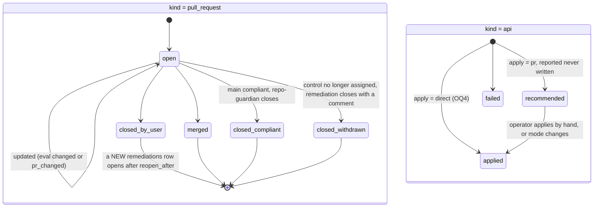

`hold` is not a remediation state. It lives on the result row because there may be no PR yet, and `GET /repositories/{id}/controls` shows it next to the status so "why is there no PR" has an answer: `pr_cap`, `foreign_branch`, `permission`.

### How the API is built and consumed

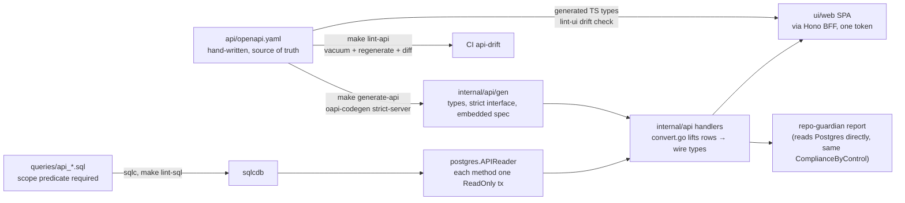

| Consumer | Endpoints | Notes |
| -------- | --------- | ----- |
| UI fleet view | `/summary`, `/controls`, `/orgs` | compliance tiles read `percent` as the SQL value, never recomputed |
| UI control page | `/controls/{id}`, `/compliance/history?control=` | per-org breakdown with version and `source` |
| UI org page | `/orgs/{org}` | baseline versus org-specific, exclusions with reasons |
| UI repository page | `/repositories/{id}`, `/repositories/{id}/controls`, `/repositories/{id}/events`, `/repositories/{id}/evaluations` | the evidence renderer is keyed by `evidence_kind` + `evidence_version` |
| UI "re-evaluate" button | `POST /repositories/{id}/evaluate` | the BFF proxies this one `POST` with the logout Origin check; hidden when the API answers 501 |
| UI remediation queue | `/remediations?state=open&stale=true` | replaces the findings PR list |
| `repo-guardian report` | none (direct SQL) | same `ComplianceByControl` query |
| `repo-guardian evaluate --repo org/name --format json` | none (runs the control locally) | DESIGN-0032 D7 + DESIGN-0033 item 3; exit 2 under `--detailed-exitcode` when any control is non-compliant |
| `repo-guardian policy validate` | none | slug grammar, unresolved references, unassigned controls (warning); exit 0 / 1 / 2 |

```gap
**Found while drawing the API, resolved in the documents**

- **Manual re-evaluate had no home** in a read-only API role → `POST /repositories/{id}/evaluate` backed by an optional, signal-only Temporal client in the `api` role; 501 without `TEMPORAL_ADDRESS`, the UI hides the button (DESIGN-0032 D9).
- **The evaluation log endpoint** was unmentioned → `/repositories/{id}/checks` becomes `/repositories/{id}/evaluations` (DESIGN-0032 "API / Interface Changes").
- **`/policies` had no response shape** → it returns `policy.Summarize` output: version, rollout timestamps, enterprise orgs/mode/controls, per org the additions, replacements and exclusions with reasons (DESIGN-0032).
- **A control can run at two versions in one fleet** → the `/controls/{id}` per-org breakdown carries `version`; fleet totals sum over `control_id` (DESIGN-0032).
- **`Remediation` was already a schema name** → the old enum leaves with `/findings` in the same spec change, and the new object takes the name (DESIGN-0032).
- **The evidence discriminator** was unspecified → `evidence_kind = "<control type>/<rule kind>"` plus `evidence_version` (DESIGN-0032).
- **One `installation_id` for two Apps** → `/repositories` exposes `evaluable` and `remediable`; the row keeps the Evaluation App's installation (DESIGN-0032 "Two GitHub Apps").
```

## Deep dive 3: database and schema

DESIGN-0030 owns two tables, DESIGN-0032 owns five, DESIGN-0029 says `repositories` and `installations` stay and `installations` gains `app`. This section puts them next to the v2 tables they replace, shows the keys and the foreign keys, and follows a row through the two transactions that write it. The schema-level decisions this pass added (results cleared with their assignment, remediation settings on the policy-state row, two database roles, `closed_withdrawn`) are DESIGN-0030 D6 and D7 and DESIGN-0032 D8 and D10.

### Who writes what

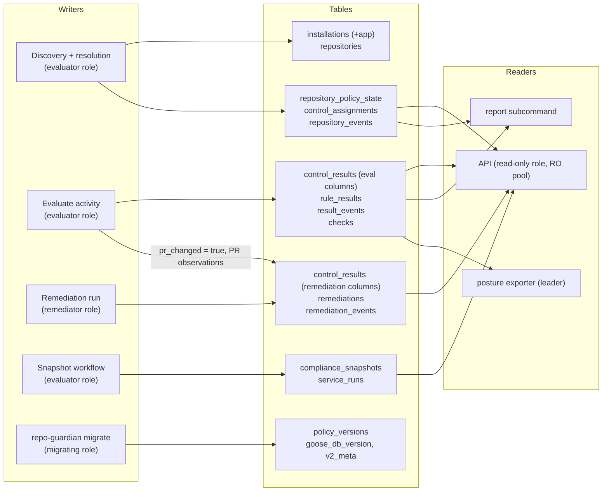

### Entity relationships

Split into four diagrams by concern. `repositories.id` is the stable key everywhere; `(repository_id, control_id)` is the key both designs share, deliberately without the version.

**Identity and policy** (kept tables plus DESIGN-0030's two):

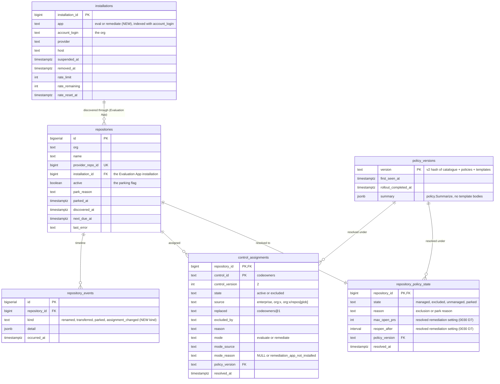

**Evaluation results** (DESIGN-0032, replacing `findings` and `finding_events`):

```mermaid
erDiagram
    repositories ||--o{ control_results : "one row per control"
    control_assignments ||--o| control_results : "same key, no FK by design"
    control_results ||--o{ rule_results : "FK (repository_id, control_id)"
    control_results ||--o{ result_events : "transitions, append-only"
    repositories ||--o{ checks : "evaluation log (A6)"
    control_results {
        bigint repository_id PK, FK
        text control_id PK
        int control_version
        text status "compliant, non_compliant, unknown, not_applicable"
        text fingerprint "sha256 of statuses + blob SHAs"
        bigint eval_generation "evaluation writes, inserts 1"
        bigint remediated_generation "remediation writes, default 0"
        boolean pr_changed
        text hold "pr_cap, foreign_branch, permission"
        timestamptz hold_since
        text evaluated_sha
        timestamptz evaluated_at
        timestamptz last_changed_at
    }
    rule_results {
        bigint repository_id PK, FK
        text control_id PK, FK
        text rule_id PK "bare id, unique within the control"
        text status "pass, fail, error, not_applicable"
        boolean remediate "copied from the rule"
        jsonb evidence "text-only, versioned"
        smallint evidence_version
    }
    result_events {
        bigserial id PK
        bigint repository_id
        text control_id
        int control_version "the version that produced it"
        text rule_id "NULL for a control-status transition"
        text from_status
        text to_status
        bigint eval_generation
        timestamptz occurred_at
    }
    checks {
        bigserial id PK
        bigint repository_id FK
        text check_key UK "workflowID/runID/iteration"
        text trigger "schedule, push, pr_event (NEW), policy_changed, manual"
        text outcome "pending, success, error, skipped"
        jsonb pending_result "staged outcomes until RecordEvaluation"
        text policy_version
        timestamptz started_at
        timestamptz finished_at
    }
```

**Remediation** (DESIGN-0032):

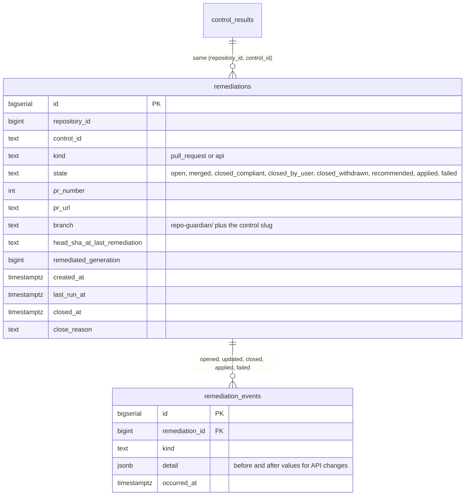

Partial unique index `remediations_one_open ON (repository_id, control_id) WHERE state IN ('open', 'recommended')` is the "at most one open PR or outstanding recommendation per control" invariant, enforced by the database rather than by the workflow. `closed_withdrawn` (DESIGN-0032 D10) is the close reason for a PR whose control stopped being assigned while it was open.

**Reporting and service state** (kept, re-keyed):

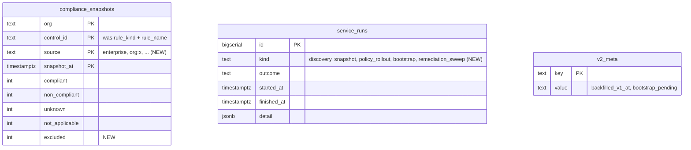

### Table ledger

| Table | Fate | Change |
| ----- | ---- | ------ |
| `installations` | changed | `+ app TEXT NOT NULL CHECK (app IN ('eval','remediate'))`, index on `(account_login, app)`; one row per org per App |
| `repositories` | changed | keep identity, `active`, `park_reason`, `parked_at`, `next_due_at`, `last_error`; `installation_id` is the Evaluation App's installation; the rule-engine posture columns `last_check_outcome`, `policy_version`, `catalog_parse_ok` are dropped at cutover (DESIGN-0032) |
| `policy_versions` | kept | the hash input changes (catalogue + policies + templates); `summary` carries `policy.Summarize` of the new shape |
| `repository_events` | changed | `kind` CHECK gains `assignment_changed` |
| `repository_policy_state` | **new** | DESIGN-0030; carries the resolved `max_open_prs` and `reopen_after` (D7) |
| `control_assignments` | **new** | DESIGN-0030; PK `(repository_id, control_id)` is the one-version-per-control invariant |
| `control_results` | **new** | DESIGN-0032; two writers by column; rows are deleted with their assignment (DESIGN-0030 D6) |
| `rule_results` | **new** | DESIGN-0032; composite FK to `control_results` |
| `result_events` | **new** | DESIGN-0032; append-only by grant like `finding_events` |
| `remediations` | **new** | DESIGN-0032; partial unique index on `open` or `recommended`; `closed_withdrawn` state |
| `remediation_events` | **new** | DESIGN-0032; append-only by grant |
| `checks` | changed | becomes the evaluation log (A6): `trigger` gains `pr_event`, `manual`; `pending_result` stages `[]controlOutcome` until the record step |
| `compliance_snapshots` | re-keyed | `(org, control_id, source, snapshot_at)`; `excluded` count added; `rule_kind`/`rule_name` dropped |
| `service_runs` | changed | `kind` gains `remediation_sweep` |
| `findings` | **removed** | A5: replaced, not extended |
| `finding_events` | **removed** | A5 |
| database roles | **new** | `rg_evaluator`, `rg_remediator` with column-level grants; `all` is a member of both (DESIGN-0032 D8) |

### Column ownership, made enforceable

DESIGN-0032 D8 turns the record-is-narrow invariant from prose into a constraint. The evaluator and remediator connect as separate database roles, the same mechanism that makes `finding_events` append-only today (the application role revokes its own UPDATE/DELETE), and `all` connects as a member of both:

```sql
-- Two application roles (DESIGN-0032 D8). Each worker role connects as its own; `all` is a member of both.
CREATE ROLE rg_evaluator;  CREATE ROLE rg_remediator;

GRANT SELECT ON ALL TABLES IN SCHEMA public TO rg_evaluator, rg_remediator;

-- evaluation owns the posture columns
GRANT INSERT ON control_results, rule_results, result_events, checks TO rg_evaluator;
GRANT UPDATE (status, fingerprint, eval_generation, control_version, evaluated_sha, evaluated_at,
              last_changed_at, pr_changed) ON control_results TO rg_evaluator;
GRANT UPDATE (state, closed_at, close_reason, head_sha_at_last_remediation) ON remediations TO rg_evaluator; -- PR observation
GRANT DELETE ON rule_results TO rg_evaluator;           -- rules dropped by a version bump

-- remediation owns its own columns and nothing of evaluation's
GRANT INSERT ON remediations, remediation_events TO rg_remediator;
GRANT UPDATE (remediated_generation, pr_changed, hold, hold_since) ON control_results TO rg_remediator;
GRANT UPDATE ON remediations TO rg_remediator;

-- append-only, enforced on both
REVOKE UPDATE, DELETE, TRUNCATE ON result_events, remediation_events FROM rg_evaluator, rg_remediator;
```

A remediator bug that tries a full-row save of `control_results` then fails loudly at the database instead of silently clobbering an evaluation's generation bump.

### The two transactions

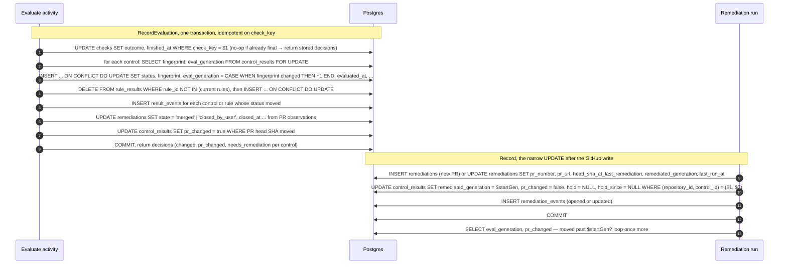

The race the counters resolve, shown as the pair `(eval_generation, remediated_generation)`:

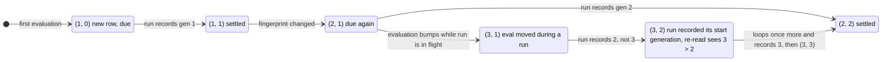

### Queries the workflows depend on

The backstop sweep and the evaluate activity share one definition of "due", so the hourly sweep can never disagree with the signal path:

```sql
CREATE VIEW remediation_due AS
SELECT cr.repository_id, cr.control_id
FROM control_results cr
JOIN repository_policy_state ps ON ps.repository_id = cr.repository_id AND ps.state = 'managed'
JOIN control_assignments a ON (a.repository_id, a.control_id) = (cr.repository_id, cr.control_id)
                          AND a.state = 'active' AND a.mode = 'remediate'
LEFT JOIN remediations rm ON (rm.repository_id, rm.control_id) = (cr.repository_id, cr.control_id)
                         AND rm.state IN ('open', 'closed_by_user')
WHERE cr.hold IS NULL
  AND (
        ( cr.status = 'non_compliant'
          AND EXISTS (SELECT 1 FROM rule_results rr WHERE (rr.repository_id, rr.control_id) = (cr.repository_id, cr.control_id)
                                                     AND rr.status = 'fail' AND rr.remediate)
          AND ( cr.eval_generation > cr.remediated_generation
                OR cr.pr_changed
                OR (rm.state = 'closed_by_user' AND rm.closed_at + ps.reopen_after < now()) ) )   -- reopen_after from the policy-state row (0030 D7)
     OR ( cr.status = 'compliant' AND rm.state = 'open' )
  );
```

The merged timeline for `/repositories/{id}/events` extends today's `UNION ALL` of `finding_events` and `repository_events` with a third source:

```sql
SELECT occurred_at, 'repository' AS source, kind, NULL AS control_id, NULL AS rule_id, NULL AS from_status, NULL AS to_status, detail
  FROM repository_events WHERE repository_id = $1
UNION ALL
SELECT occurred_at, 'result', 'status_changed', control_id, rule_id, from_status, to_status, '{}'::jsonb
  FROM result_events WHERE repository_id = $1
UNION ALL
SELECT e.occurred_at, 'remediation', e.kind, r.control_id, NULL, NULL, r.state, e.detail
  FROM remediation_events e JOIN remediations r ON r.id = e.remediation_id WHERE r.repository_id = $1
ORDER BY occurred_at DESC, source, id DESC;
```

### Migrations

| Migration | Contents | Note |
| --------- | -------- | ---- |
| `00004_controls_policy.sql` | `repository_policy_state` (with `max_open_prs`, `reopen_after`), `control_assignments`, `repository_events.kind` CHECK + `assignment_changed`, `installations.app` + backfill `'eval'` + index on `(account_login, app)` | additive, safe on a live rc |
| `00005_controls_results.sql` | `control_results`, `rule_results`, `result_events`, `remediations`, `remediation_events`, `remediation_due` view, `checks.trigger` CHECK, `service_runs.kind` CHECK, append-only revokes, the two application roles and their column grants | additive |
| `00006_compliance_rekey.sql` | new `compliance_snapshots` shape; old rows are dropped (A20: cutover starts from a fresh evaluation) | destructive for history; acceptable on the rc line |
| `00007_drop_findings.sql` | drop `findings`, `finding_events`; drop `repositories.last_check_outcome`, `policy_version`, `catalog_parse_ok` | **after** cutover, its own PR |

`SchemaVersion` moves 3 → 7. `migrate --dry-run` replays pending migrations in one rolled-back transaction; its 00002 replay is hand-wired, so each new SQL file must be added to `postgres.DryRun`. The v1 backfill (`00003`) stays a no-op on a fresh v2 database and is not extended: DESIGN-0029 A20 says cutover starts from a fresh evaluation, not from migrated findings.

```gap
**Found while drawing the schema, resolved in the documents**

- **`repositories.installation_id` was one FK for two Apps** → it references the Evaluation App's installation; the Remediation App's is looked up by `(account_login, app = 'remediate')`, indexed (DESIGN-0032 "Two GitHub Apps").
- **Result rows outlived their assignment** → resolution deletes `control_results` and `rule_results` for a control that stops being active, in the same transaction, and writes a `result_events` row with `to_status = NULL` (DESIGN-0030 D6).
- **`remediations_one_open` covered `open` only** → `WHERE state IN ('open', 'recommended')` (DESIGN-0032 Data Model).
- **`reopen_after` and `max_open_prs` had no table** → resolved like mode and persisted on `repository_policy_state` (DESIGN-0030 D7); the `remediation_due` view reads them from that row.
- **`checks` as the evaluation log** → `trigger` CHECK gains `pr_event` and `manual`; `pending_result` stays JSONB because evidence is text-only and bounded (DESIGN-0032 Data Model).
- **`repositories` rule-engine columns** → `last_check_outcome`, `policy_version`, `catalog_parse_ok` are dropped at cutover in `00007` (DESIGN-0032).
- **Append-only grants** → stated for both `result_events` and `remediation_events`, created by the migrating role alongside the two application roles (DESIGN-0032 D8).
```

## Deep dive 4: implementation order

DESIGN-0029's rollout plan gives the order in one line each. This expands it into phases with dependencies, shows what can run in parallel, and proposes a branch strategy for running several agents on worktrees without a merge pile-up at the end. Phase numbers here are for this page; the IMPL document assigns the real ones.

### Phases

| # | Phase | Delivers | Depends on | Parallel lane |
| - | ----- | -------- | ---------- | ------------- |
| 0 | **Decide and verify** | the 15 open questions answered; investigation on A1–A23 and F1–F10 with keep / adapt / remove per assumption; the IMPL document | DESIGN-0029..0033 accepted | — (user-owned) |
| 0.5 | **Contracts** | one commit on the integration branch: `internal/control` types (`Definition`, `Reason`, `RuleKindSpec`, `StatusOf`, `Fingerprint`), the DDL for all seven tables plus the two roles, `policy.Assignment` / `Resolution`, `github.Reader` / `PRObserver` / `Writer` (with `Commit`), `api/openapi.yaml` stubs for the new resources including `POST /repositories/{id}/evaluate`, migration numbers `00004`–`00007` reserved | 0 | — (one author) |
| 1 | **Control framework + codeowners** | `internal/control` behaviour (`StatusOf`, `Fingerprint`, `FileSpec`, `LocateFile`, file helpers, registry, template self-check), `controltest` conformance suite, `internal/controls/codeowners` | 0.5 | A |
| 2 | **Policy model** | catalogue / enterprise / org loader with empty `EvalContext`, slug grammar, validation (ownership, reasons, references), `Snapshot.Resolve`, `VersionV2` over the new inputs, `policy.Summarize`, table tests | 0.5 (and 1 for `Type.Build` at load) | B |
| 3 | **Schema + store** | migrations `00004`–`00006`, sqlc queries (`RecordEvaluation`, narrow record, `remediation_due`, `ComplianceByControl`, `api_*`), `V2Store` methods, role grants, `DryRun` wiring, store integration tests | 0.5 | C |
| 4 | **Evaluation workflow, evaluate-only** | pinned cached `Reader`, `Evaluate` activity, `RepoWorkflow` adaptation, discovery + resolution, policy rollout re-resolve, push scoping by `Resources()`, PR observation, `pr_event` ingest, budgets `installation/eval/<id>`, `evaluator` role, queue `repo-guardian-eval`, `EVAL_INTERVAL`, chart | 1, 2, 3 | — (integration) |
| 5 | **API + UI** | `/controls`, `/policies`, `/repositories/{id}/controls`, `/repositories/{id}/evaluations`, `/remediations`, `/orgs/{org}` extension, merged events, `/summary` + `/status` extensions, `POST /repositories/{id}/evaluate` with the api role's optional signal-only Temporal client and the BFF `POST` proxy; UI views; `evidence_kind` renderer registry; report on `ComplianceByControl` | 3 (contracts suffice to start), 4 for e2e and the `POST` | D (can start after 0.5 against seeded rows) |
| 6 | **Remediation + second App** | `Writer.Commit` on the git-data API, find-or-adopt through `PRObserver`, remediation workflow, PR cap, lifecycle including `closed_withdrawn`, `remediation-sweep` on the `remediation_due` view, `remediator` role connecting as `rg_remediator`, queue `repo-guardian-remediate`, KEDA per queue, chart secret scoping, Remediation App permission derivation | 4 | E |
| 7 | **Remaining control types** | `catalog_info`, `dependency_updates`, `file`, `repo_settings`, `branch_ruleset`, `labels`, `custom_properties` (+ tag schema seam per 0033 OQ1–OQ3) | 1 for evaluate halves; 6 for API-remediated types' `direct` path | F1..F7, one worktree each |
| 8 | **Observability + CLI** | metrics table from 0032, dashboards and alerts regenerated (`make monitoring-generate`), posture exporter on `control_results`, `repo-guardian evaluate --format json --detailed-exitcode`, `repo-guardian policy validate` | 4 (metrics), 6 (remediation metrics) | G |
| 9 | **Cutover and removal** | close v1 PRs with a pointer comment, retire `TestPRIdentity_IsFrozen` literals deliberately, remove `internal/checker`, reconcilers, parity suite, v1 loader, `findings` tables (`00007`), migration guide `v1 rules → control types` | 4–8 shipped as rc | — |

### Dependencies

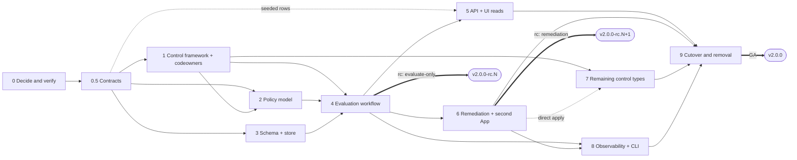

The two rc milestones are DESIGN-0029's "evaluate-only first": the first rc with controls ships evaluation alone so posture can be compared with v1 before anything writes.

### Board

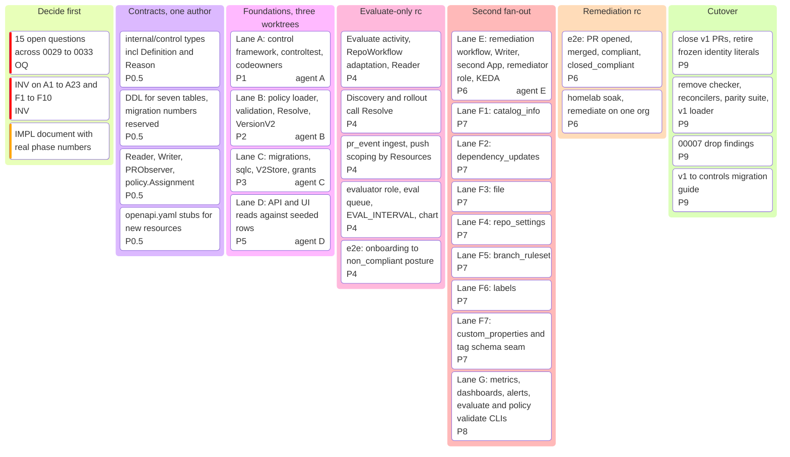

### Branching for parallel work

The repository's rules: never commit to `main`, `v2` is protected and the user merges, rc tags are cut by hand behind `dont-release` PRs. An integration branch keeps the fan-out off `v2` until each milestone is whole:

```mermaid
%%{init: { 'gitGraph': { 'mainBranchName': 'v2', 'showCommitLabel': true } } }%%
gitGraph
    commit id: "IMPL-0025 done"
    branch controls
    commit id: "0.5 contracts" tag: "contracts frozen"
    branch feat-control-framework
    commit id: "1 framework"
    commit id: "1 codeowners"
    checkout controls
    branch feat-controls-schema
    commit id: "3 migrations"
    commit id: "3 sqlc + store"
    checkout controls
    branch feat-policy-model
    commit id: "2 loader"
    commit id: "2 resolve"
    checkout controls
    branch feat-api-controls
    commit id: "5 endpoints"
    checkout controls
    merge feat-controls-schema id: "merge C"
    merge feat-control-framework id: "merge A"
    merge feat-policy-model id: "merge B"
    commit id: "4 evaluation workflow"
    merge feat-api-controls id: "merge D"
    commit id: "4 e2e evaluate-only"
    checkout v2
    merge controls tag: "v2.0.0-rc.N evaluate-only"
    checkout controls
    merge v2
    branch feat-remediation
    commit id: "6 remediation"
    checkout controls
    branch feat-control-types
    commit id: "7 catalog_info"
    commit id: "7 dependency_updates"
    checkout controls
    branch feat-observability
    commit id: "8 metrics + dashboards"
    checkout controls
    merge feat-remediation id: "merge E"
    merge feat-control-types id: "merge F"
    merge feat-observability id: "merge G"
    checkout v2
    merge controls tag: "v2.0.0-rc.N+1 remediation"
    checkout controls
    merge v2
    commit id: "9 cutover + removal"
    checkout v2
    merge controls tag: "v2.0.0"
```

Rules that make the fan-out mergeable:

- **Contracts first, then fan out.** Phase 0.5 is one commit by one author. Every lane codes against the frozen types, DDL and interfaces; a lane that needs a contract change opens a small PR to `controls` first, and the other lanes rebase on it. Interface drift is the only thing that produces a bad merge here.
- **Lanes own disjoint directories.** A: `internal/control`, `internal/controls/codeowners`. B: `internal/policy`. C: `internal/store/postgres` (migrations, queries, sqlcdb). D: `api/`, `internal/api`, `ui/`. E: `internal/activities`, `internal/workflows`, `charts/`. F*: `internal/controls/<type>`. G: `internal/monitoring`, `internal/metrics`, `cmd/`.
- **Merge order within a fan-out: C, A, B, then D.** Schema has no Go dependencies; the framework has none on policy; policy calls `Type.Build` from the framework; the API needs the store. Merging in this order means every merge compiles against already-merged code.
- **Shared files are listed and pre-assigned.** `go.mod`, `internal/workflows/names.go`, `api/openapi.yaml`, `charts/repo-guardian/values.yaml`, `CLAUDE.md`, `.mockery.yaml`, migration numbers. Migration numbers `00004`–`00007` are reserved in Phase 0.5. The control-type registry is one line per type in `internal/controls/all.go`, so seven lanes append seven lines and the conflict is trivial.
- **Each lane is a worktree on a branch off `controls`**, PRs into `controls` with the `dont-release` label (CI runs on both `main` and `v2`; it does not run on `controls`, so lanes run `make ci` locally or the integration branch is added to the `ci.yml` branch list for the duration).
- **`controls` merges into `v2` only at a milestone**, as the rc. Between milestones `v2` is merged back into `controls` so bug fixes that landed on `main` and were forwarded to `v2` reach the lanes.
- **Each merged lane adds its entry to CLAUDE.md's v2 section** in the same PR, so the next lane's agent reads an accurate map.

### Acceptance per milestone

| Milestone | Proof |
| --------- | ----- |
| contracts frozen | `go build ./...` with the new packages compiling against stubs; `make lint-sql` and `make lint-api` green on the stubs |
| evaluate-only rc | conformance suite green for `codeowners`; resolution table tests; `TestCompliance_ParityAcrossReportAPIAndSnapshot` on the new query; e2e: discovery → resolve → evaluate → `/repositories/{id}/controls` shows `non_compliant` with evidence; replay histories captured for the adapted `RepoWorkflow`; posture comparable with v1 on the homelab |
| remediation rc | e2e: onboarding → PR opened → merged → compliant; closed_compliant path; `pr_changed` path; PR cap hold and release; foreign-branch hold; replay histories for the remediation workflow; secret-scoping chart tests prove the evaluator never mounts the Remediation App key |
| v2.0.0 | every built-in type passes the conformance suite; v1 PRs closed with pointer comments; `internal/checker` and reconcilers gone; `findings` dropped; migration guide published; `make ci` green on `v2` |
